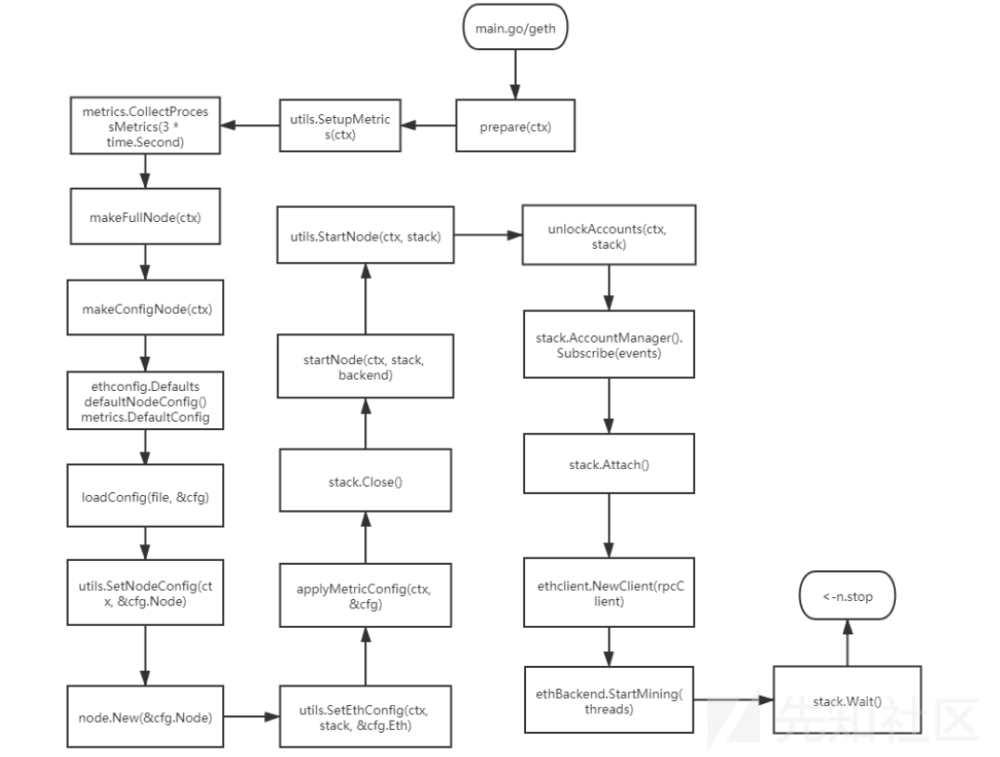

# 公链启动过程安全分析 (下) - 先知社区

公链启动过程安全分析 (下)

- - -

## 文章前言

本篇文章是对《公链启动过程安全分析》的后续补充和扩展

## 源码分析

### 节点启动

startNode 函数接受三个参数：ctx 是上下文对象，stack 是一个 node.Node 类型的指针，backend 是 ethapi.Backend 类型的对象，该函数用于启动以太坊节点，并执行一系列操作

```plain
func startNode(ctx *cli.Context, stack *node.Node, backend ethapi.Backend) {
    debug.Memsize.Add("node", stack)

    // Start up the node itself
    utils.StartNode(ctx, stack)
```

unlockAccounts 函数则是用于解锁特定的账户

```plain
// Unlock any account specifically requested
    unlockAccounts(ctx, stack)
```

随后创建了一个容量为 16 的通道 events 并将其注册为钱包事件处理程序，这也意味着当钱包相关的事件发生时会将事件发送到这个通道，

```plain
// Create a client to interact with local geth node.
    rpcClient, err := stack.Attach()
    if err != nil {
        utils.Fatalf("Failed to attach to self: %v", err)
    }
    ethClient := ethclient.NewClient(rpcClient)
```

这里创建了一个与本地 Geth 节点进行交互的客户端，首先使用 stack.Attach() 方法获取一个 RPC 客户端并将其赋值给 rpcClient 变量，然后使用 ethclient.NewClient() 方法创建一个以太坊客户端，将 RPC 客户端传递给它，最后将返回的以太坊客户端赋值给 ethClient 变量

```plain
go func() {
        // Open any wallets already attached
        for _, wallet := range stack.AccountManager().Wallets() {
            if err := wallet.Open(""); err != nil {
                log.Warn("Failed to open wallet", "url", wallet.URL(), "err", err)
            }
        }
        // Listen for wallet event till termination
        for event := range events {
            switch event.Kind {
            case accounts.WalletArrived:
                if err := event.Wallet.Open(""); err != nil {
                    log.Warn("New wallet appeared, failed to open", "url", event.Wallet.URL(), "err", err)
                }
            case accounts.WalletOpened:
                status, _ := event.Wallet.Status()
                log.Info("New wallet appeared", "url", event.Wallet.URL(), "status", status)

                var derivationPaths []accounts.DerivationPath
                if event.Wallet.URL().Scheme == "ledger" {
                    derivationPaths = append(derivationPaths, accounts.LegacyLedgerBaseDerivationPath)
                }
                derivationPaths = append(derivationPaths, accounts.DefaultBaseDerivationPath)

                event.Wallet.SelfDerive(derivationPaths, ethClient)

            case accounts.WalletDropped:
                log.Info("Old wallet dropped", "url", event.Wallet.URL())
                event.Wallet.Close()
            }
        }
    }()
```

这段代码创建了一个匿名的 goroutine(并发执行的函数)，用于处理钱包相关的事件，首先它遍历已经附加的所有钱包并尝试打开它们，然后它开始监听钱包事件，直到终止，在事件的处理过程中根据事件的类型，执行相应的操作，例如：打开新的钱包、记录日志、关闭旧的钱包等

```plain
if ctx.GlobalBool(utils.ExitWhenSyncedFlag.Name) {
        go func() {
            sub := stack.EventMux().Subscribe(downloader.DoneEvent{})
            defer sub.Unsubscribe()
            for {
                event := <-sub.Chan()
                if event == nil {
                    continue
                }
                done, ok := event.Data.(downloader.DoneEvent)
                if !ok {
                    continue
                }
                if timestamp := time.Unix(int64(done.Latest.Time), 0); time.Since(timestamp) < 10*time.Minute {
                    log.Info("Synchronisation completed", "latestnum", done.Latest.Number, "latesthash", done.Latest.Hash(),
"age", common.PrettyAge(timestamp))
                    stack.Close()
                }
            }
        }()
    }
```

如果设置了全局标志 ExitWhenSyncedFlag，则会启动一个 goroutine 用于监视同步状态，它订阅了 downloader.DoneEvent 事件并在事件发生时执行相应的操作，如果最新区块的时间距离当前时间不到 10 分钟，则会打印同步完成的日志信息并关闭节点

```plain
if ctx.GlobalBool(utils.MiningEnabledFlag.Name) || ctx.GlobalBool(utils.DeveloperFlag.Name) {
        // Mining only makes sense if a full Ethereum node is running
        if ctx.GlobalString(utils.SyncModeFlag.Name) == "light" {
            utils.Fatalf("Light clients do not support mining")
        }
        ethBackend, ok := backend.(*eth.EthAPIBackend)
        if !ok {
            utils.Fatalf("Ethereum service not running: %v", err)
        }
        // Set the gas price to the limits from the CLI and start mining
        gasprice := utils.GlobalBig(ctx, utils.MinerGasPriceFlag.Name)
        ethBackend.TxPool().SetGasPrice(gasprice)
        // start mining
        threads := ctx.GlobalInt(utils.MinerThreadsFlag.Name)
        if err := ethBackend.StartMining(threads); err != nil {
            utils.Fatalf("Failed to start mining: %v", err)
        }
    }
}
```

如果设置了全局标志 MiningEnabledFlag 或 DeveloperFlag，则会检查节点的同步模式是否为"light",如果是"light"模式则会报错，因为轻客户端不支持挖矿，接着检查 backend 对象是否为 eth.EthAPIBackend 类型，如果不是，则会报错，然后根据命令行传入的 Gas Price 参数，设置交易池的 Gas Price 并启动挖矿，具体的挖矿操作需要通过 ethBackend.StartMining(threads) 来执行

startNode 的具体实现如下：

```plain
// filedir:go-ethereum-1.10.2\cmd\utils\cmd.go
func StartNode(ctx *cli.Context, stack *node.Node) {
    if err := stack.Start(); err != nil {
        Fatalf("Error starting protocol stack: %v", err)
    }
    go func() {
        sigc := make(chan os.Signal, 1)
        signal.Notify(sigc, syscall.SIGINT, syscall.SIGTERM)
        defer signal.Stop(sigc)

        minFreeDiskSpace := ethconfig.Defaults.TrieDirtyCache
        if ctx.GlobalIsSet(MinFreeDiskSpaceFlag.Name) {
            minFreeDiskSpace = ctx.GlobalInt(MinFreeDiskSpaceFlag.Name)
        } else if ctx.GlobalIsSet(CacheFlag.Name) || ctx.GlobalIsSet(CacheGCFlag.Name) {
            minFreeDiskSpace = ctx.GlobalInt(CacheFlag.Name) * ctx.GlobalInt(CacheGCFlag.Name) / 100
        }
        if minFreeDiskSpace > 0 {
            go monitorFreeDiskSpace(sigc, stack.InstanceDir(), uint64(minFreeDiskSpace)*1024*1024)
        }

        <-sigc
        log.Info("Got interrupt, shutting down...")
        go stack.Close()
        for i := 10; i > 0; i-- {
            <-sigc
            if i > 1 {
                log.Warn("Already shutting down, interrupt more to panic.", "times", i-1)
            }
        }
        debug.Exit() // ensure trace and CPU profile data is flushed.
        debug.LoudPanic("boom")
    }()
}
```

在这里会调用 node 的 start 方法启动所有注册的生命周期、RPC 服务和 P2P 网络，这里对此进行逐行解析：  
Start 方法是 Node 结构体的一个方法，用于启动节点，在方法的开始和结束处使用了互斥锁，以确保在不同的线程中只有一个线程能够执行该方法

```plain
func (n *Node) Start() error {
    n.startStopLock.Lock()
    defer n.startStopLock.Unlock()
    n.lock.Lock()
    switch n.state {
    case runningState:
        n.lock.Unlock()
        return ErrNodeRunning
    case closedState:
        n.lock.Unlock()
        return ErrNodeStopped
    }
    n.state = runningState
```

在这里获取了节点的锁并根据节点的状态进行判断，如果节点已经处于运行状态，则解锁并返回 ErrNodeRunning 错误，如果节点已经处于关闭状态则解锁并返回 ErrNodeStopped 错误，否则将节点状态设置为运行状态

```plain
err := n.openEndpoints()
    lifecycles := make([]Lifecycle, len(n.lifecycles))
    copy(lifecycles, n.lifecycles)
    n.lock.Unlock()
```

在此处调用 n.openEndpoints() 方法打开网络和 RPC 端点并创建一个 lifecycles 切片，用于存储节点中所有已注册的生命周期对象，然后将 n.lifecycles 切片的内容复制到 lifecycles 中并解锁节点的锁

```plain
if err != nil {
        n.doClose(nil)
        return err
    }
```

如果打开端点的过程中出现错误，则调用 n.doClose(nil) 方法关闭节点并返回错误

```plain
var started []Lifecycle
    for _, lifecycle := range lifecycles {
        if err = lifecycle.Start(); err != nil {
            break
        }
        started = append(started, lifecycle)
    }
```

在这里遍历 lifecycles 切片中的每个生命周期对象并调用它们的 Start() 方法，如果某个生命周期启动失败，则终止遍历并将已启动的生命周期对象存储在 started 切片中，如果有生命周期启动失败，则调用 n.stopServices(started) 方法停止已启动的生命周期对象并调用 n.doClose(nil) 方法关闭节点，最后返回可能的错误

```plain
if err != nil {
        n.stopServices(started)
        n.doClose(nil)
    }
    return err
```

unlockAccounts 解锁账户：

```plain
// filedir:go-ethereum-1.10.2\cmd\geth\main.go   L426
// unlockAccounts unlocks any account specifically requested.
func unlockAccounts(ctx *cli.Context, stack *node.Node) {
    var unlocks []string
    inputs := strings.Split(ctx.GlobalString(utils.UnlockedAccountFlag.Name), ",")
    for _, input := range inputs {
        if trimmed := strings.TrimSpace(input); trimmed != "" {
            unlocks = append(unlocks, trimmed)
        }
    }
    // Short circuit if there is no account to unlock.
    if len(unlocks) == 0 {
        return
    }
    // If insecure account unlocking is not allowed if node's APIs are exposed to external.
    // Print warning log to user and skip unlocking.
    if !stack.Config().InsecureUnlockAllowed && stack.Config().ExtRPCEnabled() {
        utils.Fatalf("Account unlock with HTTP access is forbidden!")
    }
    ks := stack.AccountManager().Backends(keystore.KeyStoreType)[0].(*keystore.KeyStore)
    passwords := utils.MakePasswordList(ctx)
    for i, account := range unlocks {
        unlockAccount(ks, account, i, passwords)
    }
}
```

注册钱包事件：

```plain
// Register wallet event handlers to open and auto-derive wallets
    events := make(chan accounts.WalletEvent, 16)
    stack.AccountManager().Subscribe(events)
```

之后监听钱包事件：

```plain
// Listen for wallet event till termination
        for event := range events {
            switch event.Kind {
            case accounts.WalletArrived:
                if err := event.Wallet.Open(""); err != nil {
                    log.Warn("New wallet appeared, failed to open", "url", event.Wallet.URL(), "err", err)
                }
            case accounts.WalletOpened:
                status, _ := event.Wallet.Status()
                log.Info("New wallet appeared", "url", event.Wallet.URL(), "status", status)

                var derivationPaths []accounts.DerivationPath
                if event.Wallet.URL().Scheme == "ledger" {
                    derivationPaths = append(derivationPaths, accounts.LegacyLedgerBaseDerivationPath)
                }
                derivationPaths = append(derivationPaths, accounts.DefaultBaseDerivationPath)

                event.Wallet.SelfDerive(derivationPaths, ethClient)

            case accounts.WalletDropped:
                log.Info("Old wallet dropped", "url", event.Wallet.URL())
                event.Wallet.Close()
            }
        }
    }
```

生成用于状态同步监视的独立 goroutine

```plain
// Spawn a standalone goroutine for status synchronization monitoring,
    // close the node when synchronization is complete if user required.
    if ctx.GlobalBool(utils.ExitWhenSyncedFlag.Name) {
        go func() {
            sub := stack.EventMux().Subscribe(downloader.DoneEvent{})
            defer sub.Unsubscribe()
            for {
                event := <-sub.Chan()
                if event == nil {
                    continue
                }
                done, ok := event.Data.(downloader.DoneEvent)
                if !ok {
                    continue
                }
                if timestamp := time.Unix(int64(done.Latest.Time), 0); time.Since(timestamp) < 10*time.Minute {
                    log.Info("Synchronisation completed", "latestnum", done.Latest.Number, "latesthash", done.Latest.Hash(),
                        "age", common.PrettyAge(timestamp))
                    stack.Close()
                }
            }
        }()
    }
```

之后启动辅助服务 (例如：挖矿)：

```plain
// Start auxiliary services if enabled
    if ctx.GlobalBool(utils.MiningEnabledFlag.Name) || ctx.GlobalBool(utils.DeveloperFlag.Name) {
        // Mining only makes sense if a full Ethereum node is running
        if ctx.GlobalString(utils.SyncModeFlag.Name) == "light" {
            utils.Fatalf("Light clients do not support mining")
        }
        ethBackend, ok := backend.(*eth.EthAPIBackend)
        if !ok {
            utils.Fatalf("Ethereum service not running: %v", err)
        }
        // Set the gas price to the limits from the CLI and start mining
        gasprice := utils.GlobalBig(ctx, utils.MinerGasPriceFlag.Name)
        ethBackend.TxPool().SetGasPrice(gasprice)
        // start mining
        threads := ctx.GlobalInt(utils.MinerThreadsFlag.Name)
        if err := ethBackend.StartMining(threads); err != nil {
            utils.Fatalf("Failed to start mining: %v", err)
        }
    }
```

挖矿函数的具体逻辑代码如下，这里首先会检查矿工是否运行、配置本地挖矿奖励地址、最后执行挖矿：

```plain
// filedir:go-ethereum-1.10.2\eth\backend.go
// StartMining starts the miner with the given number of CPU threads. If mining
// is already running, this method adjust the number of threads allowed to use
// and updates the minimum price required by the transaction pool.
func (s *Ethereum) StartMining(threads int) error {
    // Update the thread count within the consensus engine
    type threaded interface {
        SetThreads(threads int)
    }
    if th, ok := s.engine.(threaded); ok {
        log.Info("Updated mining threads", "threads", threads)
        if threads == 0 {
            threads = -1 // Disable the miner from within
        }
        th.SetThreads(threads)
    }
    // If the miner was not running, initialize it
    if !s.IsMining() {
        // Propagate the initial price point to the transaction pool
        s.lock.RLock()
        price := s.gasPrice
        s.lock.RUnlock()
        s.txPool.SetGasPrice(price)

        // Configure the local mining address
        eb, err := s.Etherbase()
        if err != nil {
            log.Error("Cannot start mining without etherbase", "err", err)
            return fmt.Errorf("etherbase missing: %v", err)
        }
        if clique, ok := s.engine.(*clique.Clique); ok {
            wallet, err := s.accountManager.Find(accounts.Account{Address: eb})
            if wallet == nil || err != nil {
                log.Error("Etherbase account unavailable locally", "err", err)
                return fmt.Errorf("signer missing: %v", err)
            }
            clique.Authorize(eb, wallet.SignData)
        }
        // If mining is started, we can disable the transaction rejection mechanism
        // introduced to speed sync times.
        atomic.StoreUint32(&s.handler.acceptTxs, 1)

        go s.miner.Start(eb)
    }
    return nil
}
```

之后等待节点关闭：

```plain
// Wait blocks until the node is closed.
func (n *Node) Wait() {
    <-n.stop
}
```

### 流程总览

根据对上面的流程进行分析我们可以绘制得出如下精简版本的流程示意图：  
[](https://xzfile.aliyuncs.com/media/upload/picture/20240203112655-149a2724-c244-1.png)

## 文末小结

本篇文章主要介绍了公链的启动过程并以以太坊源码为例对此进行了刨析，从上面可以看到公链的启动过程中的配置文件的加载、公链网络的选择适配、节点的创建、节点的启动、账户的创建、账户的锁定、账户的管理、事件的监听、挖矿操作等内容，期间我们需要重点注意的点主要有账户的管理、节点的创建和启动、挖矿操作等维度的安全性问题，例如：共识机制的设计、权限问题、数据同步问题等
