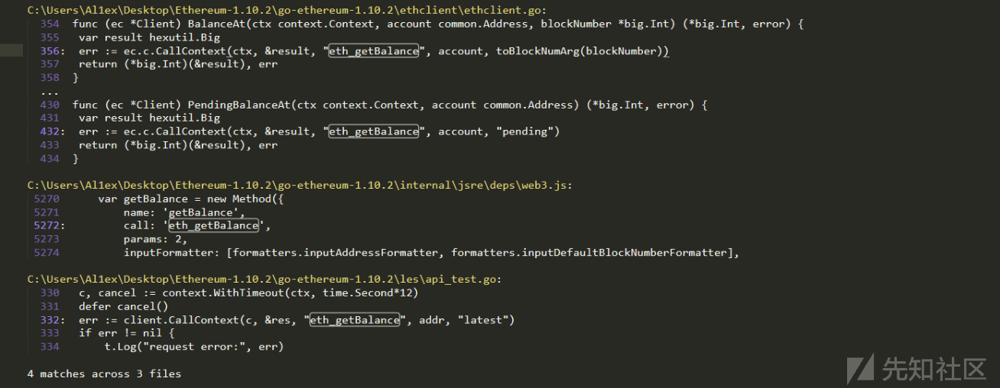

# 公链远程方法调用机制及安全风险探索 (上) - 先知社区

公链远程方法调用机制及安全风险探索 (上)

- - -

## 文章前言

公链已经非常成熟且普遍，其中以太坊无疑成为了当前最受欢迎的区块链平台之一，它不仅支持智能合约的开发和执行，还提供了远程方法调用 (Remote Procedure Call，RPC) 机制使得应用程序可以与以太坊网络进行交互，虽然 RPC 机制为开发者提供了便捷和强大的功能，但也存在一些潜在的安全风险，攻击者可能利用存在权限控制缺陷或接口配置错误的 RPC 对公链发起攻击，在本文中我们将从源代码角度探索以太坊的远程方法调用机制并深入了解其工作原理和使用方式，最后我们将介绍和公链远程方法调用相关的一些安全风险

## 基本介绍

在公链中 RPC(Remote Procedure Call) 机制是一种用于与区块链网络进行交互的通信方式，通过使用 RPC，开发者可以通过远程调用的方式与公链进行通信，查询区块链数据、执行智能合约等操作

## 工作原理

公链中的 RPC 机制的工作原理如下：

-   客户端发起调用：客户端应用程序向公链节点发送 RPC 请求，请求包括要调用的方法或命令以及相应的参数
-   传输请求：请求通过网络传输到公链节点，通常使用 HTTP 或 WebSocket 等协议进行传输
-   节点执行调用：公链节点接收到 RPC 请求后根据请求中指定的方法或命令执行相应的操作，包括查询链上数据、执行智能合约、创建交易等
-   传输结果：节点执行完请求后将结果通过网络发送回客户端，结果可以是查询到的数据、智能合约的执行结果、交易的状态等
-   客户端接收结果：客户端应用程序接收到节点返回的结果并对其进行处理和解析，根据结果应用程序可以更新用户界面、执行后续操作等

## 接口分类

公链的 RPC 可以根据通信协议和接口类型进行分类：

-   JSON-RPC：JSON-RPC 是一种基于 JSON(JavaScript Object Notation) 数据格式的远程过程调用协议，它是最常见和广泛支持的公链 RPC 协议之一，通过 JSON-RPC 开发者可以使用 HTTP 或 WebSocket 等协议与公链节点进行通信，执行各种操作，包括查询区块链数据、发送交易、执行智能合约等
-   gRPC：gRPC 是一种高性能、跨语言的远程过程调用框架，它基于 Google 开源的 Protocol Buffers 和 HTTP/2 协议，一些公链项目选择使用 gRPC 作为 RPC 通信的协议，以提供更高效、更可靠的通信方式
-   Web3.js RPC：Web3.js 是以太坊生态系统中广泛使用的 JavaScript 库，它提供了与以太坊节点进行交互的 API，Web3.js 库包括对以太坊 JSON-RPC 接口的封装，使开发者可以使用 JavaScript 语言通过 HTTP 或 WebSocket 与以太坊节点进行通信
-   Native RPC：某些公链可能使用自定义的原生 RPC 协议，这些协议通常是特定公链项目为了满足其特定需求而开发的，与标准的 RPC 协议相比原生 RPC 协议可能具有更高的性能和特定功能

需要注意的是不同的公链项目可能会选择不同的 RPC 协议或接口类型，开发者在与特定公链进行交互时需要了解该公链所支持的 RPC 类型并相应地选择和配置适当的 RPC 工具或库来与公链进行通信

## 源码刨析

下面我们用以太坊源代码为例对公链的 RPC 服务的启动、接口的调用过程进行刨析：

### 服务启动

RPC 服务的启动我们可以通过 geth 启动链节点时添加参数--rpc 来实现，在 geth 函数中会调用 startNode 来启动一个 node:

```plain
// filedir:go-ethereum-1.10.2\cmd\geth\main.go  L308
// geth is the main entry point into the system if no special subcommand is ran.
// It creates a default node based on the command line arguments and runs it in
// blocking mode, waiting for it to be shut down.
func geth(ctx *cli.Context) error {
    if args := ctx.Args(); len(args) > 0 {
        return fmt.Errorf("invalid command: %q", args[0])
    }

    prepare(ctx)
    stack, backend := makeFullNode(ctx)
    defer stack.Close()

    startNode(ctx, stack, backend)
    stack.Wait()
    return nil
}
```

startNode 进而转去调用 utils 的 StartNode 函数，此处的 utils 为 github.com/ethereum/go-ethereum/cmd/utils

```plain
// filedir:go-ethereum-1.10.2\cmd\geth\main.go  L325
// startNode boots up the system node and all registered protocols, after which
// it unlocks any requested accounts, and starts the RPC/IPC interfaces and the
// miner.
func startNode(ctx *cli.Context, stack *node.Node, backend ethapi.Backend) {
    debug.Memsize.Add("node", stack)

    // Start up the node itself
    utils.StartNode(ctx, stack)
......
```

在 go-ethereum-1.10.2\\cmd\\utils\\cmd.go 的 startNode 函数中转而调用 Node 的 start 函数来启动服务，之后开启监听：

```plain
func StartNode(ctx *cli.Context, stack *node.Node) {
    if err := stack.Start(); err != nil {
        Fatalf("Error starting protocol stack: %v", err)
    }
    go func() {
        sigc := make(chan os.Signal, 1)
        signal.Notify(sigc, syscall.SIGINT, syscall.SIGTERM)
        defer signal.Stop(sigc)

        minFreeDiskSpace := ethconfig.Defaults.TrieDirtyCache
        if ctx.GlobalIsSet(MinFreeDiskSpaceFlag.Name) {
            minFreeDiskSpace = ctx.GlobalInt(MinFreeDiskSpaceFlag.Name)
        } else if ctx.GlobalIsSet(CacheFlag.Name) || ctx.GlobalIsSet(CacheGCFlag.Name) {
            minFreeDiskSpace = ctx.GlobalInt(CacheFlag.Name) * ctx.GlobalInt(CacheGCFlag.Name) / 100
        }
        if minFreeDiskSpace > 0 {
            go monitorFreeDiskSpace(sigc, stack.InstanceDir(), uint64(minFreeDiskSpace)*1024*1024)
        }

        <-sigc
        log.Info("Got interrupt, shutting down...")
        go stack.Close()
        for i := 10; i > 0; i-- {
            <-sigc
            if i > 1 {
                log.Warn("Already shutting down, interrupt more to panic.", "times", i-1)
            }
        }
        debug.Exit() // ensure trace and CPU profile data is flushed.
        debug.LoudPanic("boom")
    }()
}
```

Node.start 函数进而去调用 openEndpoints 去开启 RPC 端点并启动所有注册的生命周期，如果任何步骤出现错误将会进行相应的错误处理

```plain
// filedir: go-ethereum-1.10.2\node\node.go
// Start starts all registered lifecycles, RPC services and p2p networking.
// Node can only be started once.
func (n *Node) Start() error {
    n.startStopLock.Lock()
    defer n.startStopLock.Unlock()

    n.lock.Lock()
    switch n.state {
    case runningState:
        n.lock.Unlock()
        return ErrNodeRunning
    case closedState:
        n.lock.Unlock()
        return ErrNodeStopped
    }
    n.state = runningState
    // open networking and RPC endpoints
    err := n.openEndpoints()
    lifecycles := make([]Lifecycle, len(n.lifecycles))
    copy(lifecycles, n.lifecycles)
    n.lock.Unlock()

    // Check if endpoint startup failed.
    if err != nil {
        n.doClose(nil)
        return err
    }
    // Start all registered lifecycles.
    var started []Lifecycle
    for _, lifecycle := range lifecycles {
        if err = lifecycle.Start(); err != nil {
            break
        }
        started = append(started, lifecycle)
    }
    // Check if any lifecycle failed to start.
    if err != nil {
        n.stopServices(started)
        n.doClose(nil)
    }
    return err
}
```

openEndpoints 调用 startRPC 来启动 RPC 服务，代码首先通过日志记录信息，输出正在启动对等节点的消息，其中包括节点实例的名称，然后代码调用 n.server.Start() 启动网络端点，如果启动过程中出现错误，代码会将错误转换为适当的文件锁错误并返回，随后代码调用 n.startRPC() 启动 RPC 端点，如果启动过程中出现错误，代码会先停止 RPC 端点，然后停止网络端点，最后代码返回可能存在的错误：

```plain
// filedir:go-ethereum-1.10.2\node\node.go   L260
// openEndpoints starts all network and RPC endpoints.
func (n *Node) openEndpoints() error {
    // start networking endpoints
    n.log.Info("Starting peer-to-peer node", "instance", n.server.Name)
    if err := n.server.Start(); err != nil {
        return convertFileLockError(err)
    }
    // start RPC endpoints
    err := n.startRPC()
    if err != nil {
        n.stopRPC()
        n.server.Stop()
    }
    return err
}
```

这里的 startRPC() 是一个辅助方法，它主要用于在节点启动期间配置各种 RPC 端点，它不适用于在启动后的任何时间调用，因为它对节点的状态做出了某些假设，代码首先调用 n.startInProc() 方法启动内部进程通信 (InProc) 端点，如果启动过程中出现错误，代码将返回该错误，然后代码根据配置信息，依次配置 IPC、HTTP 和 WebSocket 端点，对于 IPC 端点，代码主要检查配置中是否设置了 IPC 端点的终端并调用 n.ipc.start(n.rpcAPIs) 启动 IPC，对于 HTTP 端点，代码首先创建一个 httpConfig 对象，设置允许的跨域请求来源、虚拟主机和模块，然后代码调用 n.http.setListenAddr() 设置 HTTP 端点的监听地址和端口并调用 n.http.enableRPC() 启用 RPC 功能，对于 WebSocket 端点，代码首先根据配置的主机和端口获取相应的 WebSocket 服务器实例并创建一个 wsConfig 对象，设置模块和来源，然后代码调用 server.setListenAddr() 设置 WebSocket 端点的监听地址和端口并调用 server.enableWS() 启用 WebSocket 功能，最后代码调用 n.http.start() 启动 HTTP 端点并调用 n.ws.start() 启动 WebSocket 端点

```plain
// filedir: go-ethereum-1.10.2\node\node.go
// configureRPC is a helper method to configure all the various RPC endpoints during node
// startup. It's not meant to be called at any time afterwards as it makes certain
// assumptions about the state of the node.
func (n *Node) startRPC() error {
    if err := n.startInProc(); err != nil {
        return err
    }

    // Configure IPC.
    if n.ipc.endpoint != "" {
        if err := n.ipc.start(n.rpcAPIs); err != nil {
            return err
        }
    }

    // Configure HTTP.
    if n.config.HTTPHost != "" {
        config := httpConfig{
            CorsAllowedOrigins: n.config.HTTPCors,
            Vhosts:             n.config.HTTPVirtualHosts,
            Modules:            n.config.HTTPModules,
            prefix:             n.config.HTTPPathPrefix,
        }
        if err := n.http.setListenAddr(n.config.HTTPHost, n.config.HTTPPort); err != nil {
            return err
        }
        if err := n.http.enableRPC(n.rpcAPIs, config); err != nil {
            return err
        }
    }

    // Configure WebSocket.
    if n.config.WSHost != "" {
        server := n.wsServerForPort(n.config.WSPort)
        config := wsConfig{
            Modules: n.config.WSModules,
            Origins: n.config.WSOrigins,
            prefix:  n.config.WSPathPrefix,
        }
        if err := server.setListenAddr(n.config.WSHost, n.config.WSPort); err != nil {
            return err
        }
        if err := server.enableWS(n.rpcAPIs, config); err != nil {
            return err
        }
    }

    if err := n.http.start(); err != nil {
        return err
    }
    return n.ws.start()
}
```

在这里会调用 startInProc 来注册所有的 RPC API 接口信息：

```plain
// startInProc registers all RPC APIs on the inproc server.
func (n *Node) startInProc() error {
    for _, api := range n.rpcAPIs {
        if err := n.inprocHandler.RegisterName(api.Namespace, api.Service); err != nil {
            return err
        }
    }
    return nil
}
```

调用 n.ipc.start(n.rpcAPIs) 启动 IPC

```plain
// filedir: go-ethereum-1.10.2\node\rpcstack.go
// Start starts the httpServer's http.Server
func (is *ipcServer) start(apis []rpc.API) error {
    is.mu.Lock()
    defer is.mu.Unlock()

    if is.listener != nil {
        return nil // already running
    }
    listener, srv, err := rpc.StartIPCEndpoint(is.endpoint, apis)
    if err != nil {
        is.log.Warn("IPC opening failed", "url", is.endpoint, "error", err)
        return err
    }
    is.log.Info("IPC endpoint opened", "url", is.endpoint)
    is.listener, is.srv = listener, srv
    return nil
}
```

调用 n.http.enableRPC 在服务器上启用基于 HTTP 的 JSON-RPC 功能，在这段代码中首先获取一个互斥锁 h.mu 的锁以确保在启用过程中没有其他并发操作，然后代码检查当前是否已经启用了 JSON-RPC over HTTP，如果已经启用则代码会返回错误提示"JSON-RPC over HTTP is already enabled"，接下来代码创建一个 RPC 服务器 srv，然后调用 RegisterApisFromWhitelist() 方法从白名单中注册 API 并将 API 添加到 RPC 服务器 srv 中，如果注册过程中出现错误代码会返回相应的错误，然后代码将 HTTP 配置信息 config 存储到 HTTP 服务器的 h.httpConfig 字段中并将 RPC 处理程序 NewHTTPHandlerStack() 存储到 HTTP 服务器的 h.httpHandler 字段中，最后代码释放互斥锁并返回 nil 表示启用 RPC 功能成功

```plain
// filedir:go-ethereum-1.10.2\node\rpcstack.go      L272
// enableRPC turns on JSON-RPC over HTTP on the server.
func (h *httpServer) enableRPC(apis []rpc.API, config httpConfig) error {
    h.mu.Lock()
    defer h.mu.Unlock()

    if h.rpcAllowed() {
        return fmt.Errorf("JSON-RPC over HTTP is already enabled")
    }

    // Create RPC server and handler.
    srv := rpc.NewServer()
    if err := RegisterApisFromWhitelist(apis, config.Modules, srv, false); err != nil {
        return err
    }
    h.httpConfig = config
    h.httpHandler.Store(&rpcHandler{
        Handler: NewHTTPHandlerStack(srv, config.CorsAllowedOrigins, config.Vhosts),
        server:  srv,
    })
    return nil
}
```

Handler 注册跟踪如下 (下面的 ServeHTTP 其实已经到了处理请求的逻辑了，这里不再深入，后面再做探究)：

```plain
// filedir: go-ethereum-1.10.2\node\rpcstack.go
// NewHTTPHandlerStack returns wrapped http-related handlers
func NewHTTPHandlerStack(srv http.Handler, cors []string, vhosts []string) http.Handler {
    // Wrap the CORS-handler within a host-handler
    handler := newCorsHandler(srv, cors)
    handler = newVHostHandler(vhosts, handler)
    return newGzipHandler(handler)
}

// filedir:go-ethereum-1.10.2\node\rpcstack.go
func newGzipHandler(next http.Handler) http.Handler {
    return http.HandlerFunc(func(w http.ResponseWriter, r *http.Request) {
        if !strings.Contains(r.Header.Get("Accept-Encoding"), "gzip") {
            next.ServeHTTP(w, r)
            return
        }

        w.Header().Set("Content-Encoding", "gzip")

        gz := gzPool.Get().(*gzip.Writer)
        defer gzPool.Put(gz)

        gz.Reset(w)
        defer gz.Close()

        next.ServeHTTP(&gzipResponseWriter{ResponseWriter: w, Writer: gz}, r)
    })
}
// filedir: go-ethereum-1.10.2\rpc\http.go
// ServeHTTP serves JSON-RPC requests over HTTP.
func (s *Server) ServeHTTP(w http.ResponseWriter, r *http.Request) {
    // Permit dumb empty requests for remote health-checks (AWS)
    if r.Method == http.MethodGet && r.ContentLength == 0 && r.URL.RawQuery == "" {
        w.WriteHeader(http.StatusOK)
        return
    }
    if code, err := validateRequest(r); err != nil {
        http.Error(w, err.Error(), code)
        return
    }
    // All checks passed, create a codec that reads directly from the request body
    // until EOF, writes the response to w, and orders the server to process a
    // single request.
    ctx := r.Context()
    ctx = context.WithValue(ctx, "remote", r.RemoteAddr)
    ctx = context.WithValue(ctx, "scheme", r.Proto)
    ctx = context.WithValue(ctx, "local", r.Host)
    if ua := r.Header.Get("User-Agent"); ua != "" {
        ctx = context.WithValue(ctx, "User-Agent", ua)
    }
    if origin := r.Header.Get("Origin"); origin != "" {
        ctx = context.WithValue(ctx, "Origin", origin)
    }

    w.Header().Set("content-type", contentType)
    codec := newHTTPServerConn(r, w)
    defer codec.close()
    s.serveSingleRequest(ctx, codec)
}
```

调用 server.enableWS 启动 Websocket：

```plain
// filedir:go-ethereum-1.10.2\node\rpcstack.go
// enableWS turns on JSON-RPC over WebSocket on the server.
func (h *httpServer) enableWS(apis []rpc.API, config wsConfig) error {
    h.mu.Lock()
    defer h.mu.Unlock()

    if h.wsAllowed() {
        return fmt.Errorf("JSON-RPC over WebSocket is already enabled")
    }

    // Create RPC server and handler.
    srv := rpc.NewServer()
    if err := RegisterApisFromWhitelist(apis, config.Modules, srv, false); err != nil {
        return err
    }
    h.wsConfig = config
    h.wsHandler.Store(&rpcHandler{
        Handler: srv.WebsocketHandler(config.Origins),
        server:  srv,
    })
    return nil
}
```

Handler 注册：

```plain
// filedir:  go-ethereum-1.10.2\rpc\websocket.go L45
// WebsocketHandler returns a handler that serves JSON-RPC to WebSocket connections.
//
// allowedOrigins should be a comma-separated list of allowed origin URLs.
// To allow connections with any origin, pass "*".
func (s *Server) WebsocketHandler(allowedOrigins []string) http.Handler {
    var upgrader = websocket.Upgrader{
        ReadBufferSize:  wsReadBuffer,
        WriteBufferSize: wsWriteBuffer,
        WriteBufferPool: wsBufferPool,
        CheckOrigin:     wsHandshakeValidator(allowedOrigins),
    }
    return http.HandlerFunc(func(w http.ResponseWriter, r *http.Request) {
        conn, err := upgrader.Upgrade(w, r, nil)
        if err != nil {
            log.Debug("WebSocket upgrade failed", "err", err)
            return
        }
        codec := newWebsocketCodec(conn)
        s.ServeCodec(codec, 0)
    })
}

// filedir: go-ethereum-1.10.2\rpc\websocket.go L241
func newWebsocketCodec(conn *websocket.Conn) ServerCodec {
    conn.SetReadLimit(wsMessageSizeLimit)
    wc := &websocketCodec{
        jsonCodec: NewFuncCodec(conn, conn.WriteJSON, conn.ReadJSON).(*jsonCodec),
        conn:      conn,
        pingReset: make(chan struct{}, 1),
    }
    wc.wg.Add(1)
    go wc.pingLoop()
    return wc
}
// filedir: go-ethereum-1.10.2\rpc\server.go
// ServeCodec reads incoming requests from codec, calls the appropriate callback and writes
// the response back using the given codec. It will block until the codec is closed or the
// server is stopped. In either case the codec is closed.
//
// Note that codec options are no longer supported.
func (s *Server) ServeCodec(codec ServerCodec, options CodecOption) {
    defer codec.close()

    // Don't serve if server is stopped.
    if atomic.LoadInt32(&s.run) == 0 {
        return
    }

    // Add the codec to the set so it can be closed by Stop.
    s.codecs.Add(codec)
    defer s.codecs.Remove(codec)

    c := initClient(codec, s.idgen, &s.services)
    <-codec.closed()
    c.Close()
}
```

最后调用 start 启动 HTTP Server

```plain
// start starts the HTTP server if it is enabled and not already running.
func (h *httpServer) start() error {
    h.mu.Lock()
    defer h.mu.Unlock()

    if h.endpoint == "" || h.listener != nil {
        return nil // already running or not configured
    }

    // Initialize the server.
    h.server = &http.Server{Handler: h}
    if h.timeouts != (rpc.HTTPTimeouts{}) {
        CheckTimeouts(&h.timeouts)
        h.server.ReadTimeout = h.timeouts.ReadTimeout
        h.server.WriteTimeout = h.timeouts.WriteTimeout
        h.server.IdleTimeout = h.timeouts.IdleTimeout
    }

    // Start the server.
    listener, err := net.Listen("tcp", h.endpoint)
    if err != nil {
        // If the server fails to start, we need to clear out the RPC and WS
        // configuration so they can be configured another time.
        h.disableRPC()
        h.disableWS()
        return err
    }
    h.listener = listener
    go h.server.Serve(listener)

    if h.wsAllowed() {
        url := fmt.Sprintf("ws://%v", listener.Addr())
        if h.wsConfig.prefix != "" {
            url += h.wsConfig.prefix
        }
        h.log.Info("WebSocket enabled", "url", url)
    }
    // if server is websocket only, return after logging
    if !h.rpcAllowed() {
        return nil
    }
    // Log http endpoint.
    h.log.Info("HTTP server started",
        "endpoint", listener.Addr(),
        "prefix", h.httpConfig.prefix,
        "cors", strings.Join(h.httpConfig.CorsAllowedOrigins, ","),
        "vhosts", strings.Join(h.httpConfig.Vhosts, ","),
    )

    // Log all handlers mounted on server.
    var paths []string
    for path := range h.handlerNames {
        paths = append(paths, path)
    }
    sort.Strings(paths)
    logged := make(map[string]bool, len(paths))
    for _, path := range paths {
        name := h.handlerNames[path]
        if !logged[name] {
            log.Info(name+" enabled", "url", "http://"+listener.Addr().String()+path)
            logged[name] = true
        }
    }
    return nil
}
```

至此，完成启动~

### 用户请求

这里我们以 RPC 请求接口 eth\_getBalance 为例进行分析，首先我们在全局搜索"eth\_getBalance"关键字，确定其引用位置——ethclient.go L354

[](https://xzfile.aliyuncs.com/media/upload/picture/20240201135823-e8dd4f9a-c0c6-1.png)  
eth\_getBalance 函数主要用于获取给定账户的以太币 (wei) 余额，代码接受三个参数：ctx 上下文对象，account 要查询余额的账户地址，blockNumber 要查询的区块号，其中 blockNumber 可以为 nil，如果为 nil，则表示从最新的已知区块中获取余额，接下来代码声明了一个 hexutil.Big 类型的变量 result，用于存储返回的余额值，紧接着代码调用 ec.c.CallContext() 方法发起以太坊 JSON-RPC 调用，调用的方法名为 eth\_getBalance，传递的参数为 account 和 toBlockNumArg(blockNumber)，toBlockNumArg() 函数用于将 blockNumber 转换为 JSON-RPC 调用所需的类型，最后代码将返回的余额值转换为 big.Int 类型并同时返回该余额值和可能出现的错误

```plain
// filedir:go-ethereum-1.10.2\ethclient\ethclient.go    L351
// BalanceAt returns the wei balance of the given account.
// The block number can be nil, in which case the balance is taken from the latest known block.
func (ec *Client) BalanceAt(ctx context.Context, account common.Address, blockNumber *big.Int) (*big.Int, error) {
    var result hexutil.Big
    err := ec.c.CallContext(ctx, &result, "eth_getBalance", account, toBlockNumArg(blockNumber))
    return (*big.Int)(&result), err
}
```

之后跟进这里的关键操作函数 ec.c.CallContext 逻辑代码如下：

```plain
// filedir: go-ethereum-1.10.2\rpc\client.go  L286
// CallContext performs a JSON-RPC call with the given arguments. If the context is
// canceled before the call has successfully returned, CallContext returns immediately.
//
// The result must be a pointer so that package json can unmarshal into it. You
// can also pass nil, in which case the result is ignored.
func (c *Client) CallContext(ctx context.Context, result interface{}, method string, args ...interface{}) error {
    if result != nil && reflect.TypeOf(result).Kind() != reflect.Ptr {
        return fmt.Errorf("call result parameter must be pointer or nil interface: %v", result)
    }
    msg, err := c.newMessage(method, args...)
    if err != nil {
        return err
    }
    op := &requestOp{ids: []json.RawMessage{msg.ID}, resp: make(chan *jsonrpcMessage, 1)}

    if c.isHTTP {
        err = c.sendHTTP(ctx, op, msg)
    } else {
        err = c.send(ctx, op, msg)
    }
    if err != nil {
        return err
    }

    // dispatch has accepted the request and will close the channel when it quits.
    switch resp, err := op.wait(ctx, c); {
    case err != nil:
        return err
    case resp.Error != nil:
        return resp.Error
    case len(resp.Result) == 0:
        return ErrNoResult
    default:
        return json.Unmarshal(resp.Result, &result)
    }
}
```

上面的 newMessage 用于处理请求数据：

```plain
// filedir: go-ethereum-1.10.2\rpc\client.go
func (c *Client) newMessage(method string, paramsIn ...interface{}) (*jsonrpcMessage, error) {
    msg := &jsonrpcMessage{Version: vsn, ID: c.nextID(), Method: method}
    if paramsIn != nil { // prevent sending "params":null
        var err error
        if msg.Params, err = json.Marshal(paramsIn); err != nil {
            return nil, err
        }
    }
    return msg, nil
}
```

这里的&jsonrpcMessage 的数据格式和我们 python 脚本构建的请求相差无几：

```plain
#!/usr/bin/env python3
import requests
URL = "http://192.168.174.212:8545/"
data = {
   "jsonrpc": "2.0", 
   "method": "eth_getBalance", 
   "params":["0x578efd53cf8342f4f5acfb6ee0ce9c7b3cfe2252", "latest"],
   "id":0 
}
response = requests.post(url=URL,json=data)
print(response.json())
```

再这里我们的请求为 http 请求，所以会进入到 sendHTTP 方法中：

```plain
// filedir: go-ethereum-1.10.2\rpc\http.go
func (c *Client) sendHTTP(ctx context.Context, op *requestOp, msg interface{}) error {
    hc := c.writeConn.(*httpConn)
    respBody, err := hc.doRequest(ctx, msg)
    if respBody != nil {
        defer respBody.Close()
    }

    if err != nil {
        if respBody != nil {
            buf := new(bytes.Buffer)
            if _, err2 := buf.ReadFrom(respBody); err2 == nil {
                return fmt.Errorf("%v: %v", err, buf.String())
            }
        }
        return err
    }
    var respmsg jsonrpcMessage
    if err := json.NewDecoder(respBody).Decode(&respmsg); err != nil {
        return err
    }
    op.resp <- &respmsg
    return nil
}
```

在这里首先调用 doRequest 来读取请求并记录请求数据的长度，之后设置请求头信息，然后调用 http 的 do 请求，获取到请求的返回值 resp

```plain
// filedir: go-ethereum-1.10.2\rpc\http.go  L175
func (hc *httpConn) doRequest(ctx context.Context, msg interface{}) (io.ReadCloser, error) {
    body, err := json.Marshal(msg)
    if err != nil {
        return nil, err
    }
    req, err := http.NewRequestWithContext(ctx, "POST", hc.url, ioutil.NopCloser(bytes.NewReader(body)))
    if err != nil {
        return nil, err
    }
    req.ContentLength = int64(len(body))

    // set headers
    hc.mu.Lock()
    req.Header = hc.headers.Clone()
    hc.mu.Unlock()

    // do request
    resp, err := hc.client.Do(req)
    if err != nil {
        return nil, err
    }
    if resp.StatusCode < 200 || resp.StatusCode >= 300 {
        return resp.Body, errors.New(resp.Status)
    }
    return resp.Body, nil
}
```

之后传进管道 op.resp，向上回溯到 CallContext() 里面的 op.wait(ctx) 方法：

```plain
func (c *Client) CallContext(ctx context.Context, result interface{}, method string, args ...interface{}) error {
    ......

    // dispatch has accepted the request and will close the channel when it quits.
    switch resp, err := op.wait(ctx, c); {
    case err != nil:
        return err
    case resp.Error != nil:
        return resp.Error
    case len(resp.Result) == 0:
        return ErrNoResult
    default:
        return json.Unmarshal(resp.Result, &result)
    }
}
```

wait 的具体实现如下所示：

```plain
func (op *requestOp) wait(ctx context.Context, c *Client) (*jsonrpcMessage, error) {
    select {
    case <-ctx.Done():
        // Send the timeout to dispatch so it can remove the request IDs.
        if !c.isHTTP {
            select {
            case c.reqTimeout <- op:
            case <-c.closing:
            }
        }
        return nil, ctx.Err()
    case resp := <-op.resp:
        return resp, op.err
    }
}
```

之后 resp recieve 到 op.resp 管道的数据，然后对 resp 数据进行 json 序列化并返回~

篇幅过长，下篇继续分析并给出漏洞示例~
