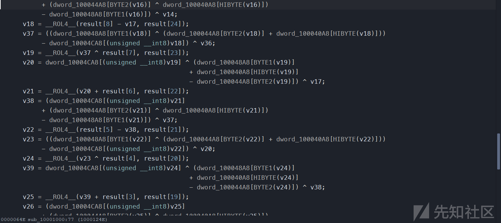

# 关于 dll 逆向的一些实战技术 - 先知社区

关于 dll 逆向的一些实战技术

- - -

在 CTF 比赛中，或许我们并不经常去逆向一个 dll，因为它需要我们加载然后运行。

[](https://xzfile.aliyuncs.com/media/upload/picture/20240125190054-026431f0-bb71-1.png)

当用 IDA 调试 dll 时，会遇到这样的问题。不像 exe 那样调试比较容易，我们需要写个 exe 调用 dll，再进行动态调试分析。  
这道国外的 dll 逆向，为我们进行 dll 逆向提供了一个思路。

# 初步分析

使用 IDA 打开，发现了许多 challenge 函数

[](https://xzfile.aliyuncs.com/media/upload/picture/20240125190118-10feda9e-bb71-1.png)

因为是 dll，我们需要分析它导出了哪些函数  
发现导出了 52 个函数，很可疑

[](https://xzfile.aliyuncs.com/media/upload/picture/20240125190125-1564262a-bb71-1.png)

进入最后一个导出函数，导出的函数，正是刚才看到的 challenge 函数

[](https://xzfile.aliyuncs.com/media/upload/picture/20240125190132-1993b454-bb71-1.png)

而其他的函数

[](https://xzfile.aliyuncs.com/media/upload/picture/20240125190139-1d7294e6-bb71-1.png)

返回范围 \[1-48\] 的值

[](https://xzfile.aliyuncs.com/media/upload/picture/20240125190145-2110e74c-bb71-1.png)

## sub\_10001000

分析发现是类似解密的一个函数

[](https://xzfile.aliyuncs.com/media/upload/picture/20240125190152-251cf22c-bb71-1.png)

猜测跟前面的 challenge 函数调用顺序有关，因为他们的返回值很可疑

[](https://xzfile.aliyuncs.com/media/upload/picture/20240125190158-28f9d45a-bb71-1.png)

## 使用 IDA 的 signsrch 插件

[](https://xzfile.aliyuncs.com/media/upload/picture/20240125190205-2cbc750c-bb71-1.png)

关于安装方法可以自行搜索，这里使用 signsrch 来搜索相关的加密算法，帮助我们分析

[](https://xzfile.aliyuncs.com/media/upload/picture/20240125190212-31401002-bb71-1.png)

发现是 CAST128 加密算法  
分析导出函数  
经过分析发现调用 sub\_10001000 函数有两个，导出序号 51 和导出序号 50 的函数

[](https://xzfile.aliyuncs.com/media/upload/picture/20240125190218-3485998a-bb71-1.png)

[](https://xzfile.aliyuncs.com/media/upload/picture/20240125190222-36fbf218-bb71-1.png)

经过对比，发现解密的秘钥和密文不同

[](https://xzfile.aliyuncs.com/media/upload/picture/20240125190229-3b31cbf0-bb71-1.png)

现在总结一下：  
导出函数 51 被导出函数 1-48 所引用，（导出函数 1-48 修改了 byte\_10007014 秘钥值建立了引用联系）  
导出函数 50 使用了导出函数 49，但是导出函数 50，并没有被其他函数引用  
到这里，我们应该建立了一个思路，猜测走导出函数 51 这条路可以得到 flag  
同时，我们应该注意到导出函数 1-48，返回了某一范围的值，或许这是暗示调用顺序。

[](https://xzfile.aliyuncs.com/media/upload/picture/20240125190235-3eb9b09e-bb71-1.png)

## 获得 dll 导出函数调用顺序

[](https://xzfile.aliyuncs.com/media/upload/picture/20240125190244-446c607c-bb71-1.png)

使用 ida-python

```plain
startaddr=0x10001C70
endaddr=0x10002E10

funcs=idautils.Functions(startaddr,endaddr)
for i in funcs:
    m = re.match(rptn, idc.get_func_name(i))
    if m != None and m.group(1) != "51":
        #通过这样方式，得到返回序号
        nextordinal = int(idc.print_operand(i+0x7,1).replace("h",""),16) ^ int(idc.print_operand(i+0xe,1).replace("h",""),16)
        print(nextordinal)
        ret.append(nextordinal)

ret = list(set(ret))
ret.sort()

for i in range(1, 49):
    if ret[i-1] != i:
        print(i)
        break
```

得到这样的顺序

```plain
48
20
1
21
33
25
22
16
14
40
2
38
26
6
13
29
36
47
35
37
42
4
18
3
51
43
7
32
46
5
39
19
24
28
27
9
34
31
10
23
11
12
17
8
15
44
45
30
```

发现导出函数序号 30 为 base call  
现在，我们已经拥有了编写一个 exe 程序所需的一切，该程序可以按正确的顺序调用导出函数，将解密的数据 dump 到文件中以供进一步分析

# 编写 exe 调试 dll

```plain
#include <Windows.h>
#include <stdio.h>
#include <stdint.h>
typedef uint32_t (*EXP)(VOID);
int main(int argc, char **argv)
{
    HMODULE hLib;
    HANDLE hFile;
    EXP exp;
    uint32_t plaintxt;
    uint32_t nextord;
    hLib = LoadLibraryA((LPCSTR)argv[1]);
    nextord = 48; // our starting point
    // decrypt key
    while (nextord != 51)
    {
        exp = (EXP)GetProcAddress(hLib, MAKEINTRESOURCE(ret));
        nextord = exp();
    }
    exp = (EXP)GetProcAddress(hLib, MAKEINTRESOURCE(51));
    // decrypt plaintxt
    exp();
    // dump plaintext to file
    plaintxt = *(uint32_t *)((uint32_t)exp + 0x2e);
    hFile = CreateFile("out", GENERIC_WRITE, 0, 0, CREATE_ALWAYS,
                       FILE_ATTRIBUTE_NORMAL, 0);
    WriteFile(hFile, (LPCVOID)plaintxt, 0x1A10, 0, 0);
    CloseHandle(hFile);
    return 0;
}
```

[](https://xzfile.aliyuncs.com/media/upload/picture/20240125190434-85a58c44-bb71-1.png)

# 输出 flag

```plain
#include <Windows.h>
#include <stdio.h>
#include <stdint.h>
typedef VOID (*BEEPBEEP)(
    DWORD dwFreq,
    DWORD dwDuration);
int main(int argc, char **argv)
{
    HMODULE hLib;
    BEEPBEEP beep;
    hLib = LoadLibraryA((LPCSTR)argv[1]);
    beep = (BEEPBEEP)GetProcAddress(hLib, MAKEINTRESOURCE(50));
    beep(440, 500);
    beep(440, 500);
    beep(440, 500);
    beep(349, 350);
    beep(523, 150);
    beep(440, 500);
    beep(349, 350);
    beep(523, 150);
    beep(440, 1000);
    beep(659, 500);
    beep(659, 500);
    beep(659, 500);
    beep(698, 350);
    beep(523, 150);
    beep(415, 500);
    beep(349, 350);
    beep(523, 150);
    beep(440, 1000);
    return 0;
}
```

或者运行 python

```plain
from ctypes import *

mydll = cdll.LoadLibrary("./flareon2016challenge.dll")
i = 30
while True:
    i = mydll[i]()
    if i == 51:
        break
mydll[51]()

mydll[50](0x1B8, 0x1F4)
mydll[50](0x1B8, 0x1F4)
mydll[50](0x1B8, 0x1F4)
mydll[50](0x15D, 0x15E)
mydll[50](0x20B, 0x96)
mydll[50](0x1B8, 0x1F4)
mydll[50](0x15D, 0x15E)
mydll[50](0x20B, 0x96)
mydll[50](0x1B8, 0x3E8)
mydll[50](0x293, 0x1F4)
mydll[50](0x293, 0x1F4)
mydll[50](0x293, 0x1F4)
mydll[50](0x2BA, 0x15E)
mydll[50](0x20B, 0x96)
mydll[50](0x19F, 0x1F4)
mydll[50](0x15D, 0x15E)
mydll[50](0x20B, 0x96)
mydll[50](0x1B8, 0x3E8)
```

拿到 flag：

[](https://xzfile.aliyuncs.com/media/upload/picture/20240125190457-93b1df22-bb71-1.png)
