# 关于 wasm 逆向的实战方法 - 先知社区

关于 wasm 逆向的实战方法

- - -

WebAssembly 是一种全新的 Web 编程语言，但是与 JavaScript 不同，它不是一种让你直接手动编写的语言，而是 C / C ++，Rust，C＃和 TypeScript 等不断增加的上层语言的编译目标。  
WebAssembly 虽然是一种新的标准，但也有一些分析工具：

-   WebAssembly Binary Toolkit：提供命令行工具 wasm2wat，可以将.wasm 文件翻译为可读性更强的.wat 格式。
-   基于 web 的 WebAssembly Studio IDE：可以将.wasm 文件中的特征提取并转变为其他格式，包括 x86-64 的翻译。
-   Radare2：可以分解指令，但不能重构控制流图。  
    对于我们来说，主要有两个方向。  
    1、使用开源工具 wat 系列的 wasm2c 来转换成 c 语言代码来分析（在本题中，该方法失效，wasm 文件不是 normal）  
    2、如果代码量较少，直接使用 chrome 浏览器来动态调试来做（本题采用）  
    这是国际赛 TetCTF 的一道题目，题目很有意思，并且 wasm 逆向在国内资料较少，因此写下这篇文章。  
    题目已上传附件（我将题目 dump 下来，可以在本地运行 html 文件即可复现题目）  
    注意：请使用 Chrome 浏览器来运行 wasm 题目  
    那么在开始之前，我们先来介绍一下 wasm，以及常用的工具

# wasm 文件

这是 wasm 的官网  
[https://webassembly.org/](https://webassembly.org/)  
WebAssembly（缩写为 Wasm）是用于基于堆栈的虚拟机的二进制指令格式。Wasm 被设计为编程语言的可移植编译目标，支持在 Web 上部署客户端和服务器应用程序。  
如果单纯介绍 wasm 文件难免会很枯燥，一般常见的做题方法有下面几种

## 1、jeb 反编译

没有想到吧，JEB 在 Android 应用广泛，但其在 wasm 逆向中也有大作用  
[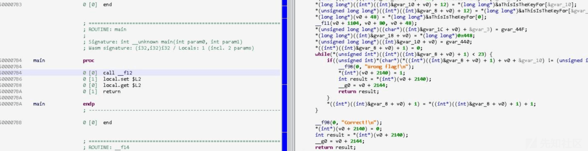](https://xzfile.aliyuncs.com/media/upload/picture/20240130151838-c9d5b778-bf3f-1.png)

但是可读性有待提高，基本靠猜意思，还不如直接看 wasm 文件。其实我们看的就是 wat 文件，使用工具 wasm2wat 也可以直接转换。

## 2、wabt

项目地址：[https://link.zhihu.com/?target=https%3A//github.com/WebAssembly/wabt](https://link.zhihu.com/?target=https%3A//github.com/WebAssembly/wabt)  
使用 wabt 项目可以将 wasm 文件转换成 c 文件，但是可读性不太好  
我们一般将 c 文件使用 gcc 命令转换成可执行文件  
在 bin 文件夹下使用命令  
wasm2wat wasm1.wasm -o wasm1.wat  
可以得到 wasm 汇编格式的 wat 文件  
使用命令  
wasm2c ./wasm1.wasm -o wasm1.wat  
可以得到 C 语言的.c 和.h 文件  
然后再用命令  
gcc -c webassembly.c -o webassembly.o  
将文件编译成为 ida 可以分析的.o 文件  
对于 wasm 的逆向和常规逆向的流程相差不大，首先静态观察，其次动态调试。

## 3、chrome 调试

其实对于少量的 wasm 文件，可以直接使用浏览器来动调来做，这样对抗非正常的 wasm 文件也是很适用，以不变应万变。  
本篇文章采用了第三种方法。

# 分析

[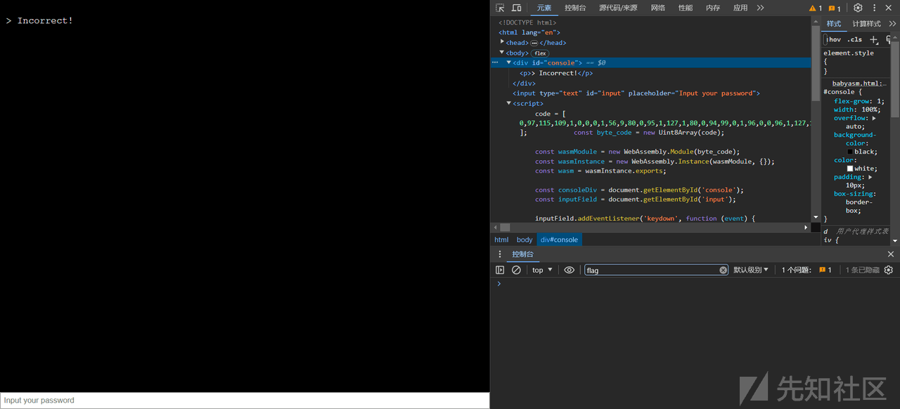](https://xzfile.aliyuncs.com/media/upload/picture/20240129140212-f21ecd70-be6b-1.png)  
原来是 wasm 逆向，这是关键代码

```plain
code = [ 0,97,115,109,1,0,0,0,1,56,9,80,0,95,1,127,1,80,0,94,99,0,1,96,0,0,96,1,127,1,100,1,96,3,99,1,127,127,0,96,2,99,1,127,1,127,96,4,99,1,127,127,127,0,96,1,99,1,1,127,96,1,99,1,1,127,3,8,7,2,3,4,5,6,7,8,6,118,20,127,1,65,224,0,11,127,1,65,229,0,11,127,1,65,20,11,127,1,65,177,1,11,127,1,65,155,1,11,127,1,65,244,0,11,127,1,65,236,0,11,127,1,65,197,0,11,127,1,65,212,0,11,127,1,65,237,0,11,127,1,65,231,0,11,127,1,65,238,0,11,127,1,65,239,0,11,127,1,65,223,0,11,127,1,65,244,0,11,127,1,65,231,0,11,127,1,65,225,0,11,127,1,65,200,0,11,127,1,65,20,11,127,1,65,59,11,7,45,7,1,49,0,0,4,105,110,105,116,0,1,10,97,114,114,97,121,95,102,105,108,108,0,2,1,51,0,3,1,52,0,4,1,53,0,5,5,99,104,101,99,107,0,6,10,184,8,7,142,1,0,35,0,65,19,115,36,0,35,1,65,55,115,36,1,35,2,65,32,115,36,2,35,3,65,36,115,36,3,35,4,65,19,115,36,4,35,5,65,55,115,36,5,35,6,65,32,115,36,6,35,7,65,36,115,36,7,35,8,65,19,115,36,8,35,9,65,55,115,36,9,35,10,65,32,115,36,10,35,11,65,36,115,36,11,35,12,65,19,115,36,12,35,13,65,55,115,36,13,35,14,65,32,115,36,14,35,15,65,36,115,36,15,35,16,65,19,115,36,16,35,17,65,55,115,36,17,35,18,65,32,115,36,18,35,19,65,36,115,36,19,11,9,0,32,0,251,7,1,16,0,11,22,0,32,0,32,1,32,2,65,19,106,65,64,107,251,0,0,65,1,251,16,1,11,13,0,32,0,32,1,251,11,1,251,2,0,0,11,109,0,32,1,65,0,70,4,64,32,0,32,2,32,0,32,2,16,3,32,3,106,65,32,115,16,2,5,32,1,65,1,70,4,64,32,0,32,2,32,0,32,2,16,3,32,3,106,65,36,115,16,2,5,32,1,65,2,70,4,64,32,0,32,2,32,0,32,2,16,3,32,3,106,65,19,115,16,2,5,32,1,65,3,70,4,64,32,0,32,2,32,0,32,2,16,3,32,3,106,65,55,115,16,2,11,11,11,11,11,172,3,1,1,127,32,0,65,0,16,3,65,137,175,2,70,4,64,32,1,65,1,106,33,1,5,11,32,0,65,1,16,3,65,200,4,70,4,64,32,1,65,1,106,33,1,11,32,0,65,2,16,3,65,226,5,70,4,64,32,1,65,1,106,33,1,11,32,0,65,3,16,3,65,194,173,2,70,4,64,32,1,65,1,106,33,1,11,32,0,65,4,16,3,65,193,242,3,70,4,64,32,1,65,1,106,33,1,11,32,0,65,5,16,3,65,135,5,70,4,64,32,1,65,1,106,33,1,11,32,0,65,6,16,3,65,193,6,70,4,64,32,1,65,1,106,33,1,11,32,0,65,7,16,3,65,242,240,3,70,4,64,32,1,65,1,106,33,1,11,32,0,65,8,16,3,65,166,243,2,70,4,64,32,1,65,1,106,33,1,11,32,0,65,9,16,3,65,238,3,70,4,64,32,1,65,1,106,33,1,11,32,0,65,10,16,3,65,151,5,70,4,64,32,1,65,1,106,33,1,11,32,0,65,11,16,3,65,229,241,2,70,4,64,32,1,65,1,106,33,1,11,32,0,65,12,16,3,65,225,139,4,70,4,64,32,1,65,1,106,33,1,11,32,0,65,13,16,3,65,129,5,70,4,64,32,1,65,1,106,33,1,11,32,0,65,14,16,3,65,151,6,70,4,64,32,1,65,1,106,33,1,11,32,0,65,15,16,3,65,174,137,4,70,4,64,32,1,65,1,106,33,1,11,32,0,65,16,16,3,65,225,149,2,70,4,64,32,1,65,1,106,33,1,11,32,0,65,17,16,3,65,177,4,70,4,64,32,1,65,1,106,33,1,11,32,0,65,18,16,3,65,161,5,70,4,64,32,1,65,1,106,33,1,11,32,0,65,19,16,3,65,234,147,2,70,4,64,32,1,65,1,106,33,1,11,32,1,65,20,70,4,127,65,1,5,65,0,11,11,218,2,0,32,0,65,0,65,1,32,0,65,0,16,3,35,0,106,16,4,32,0,65,1,65,2,32,0,65,1,16,3,35,1,107,16,4,32,0,65,2,65,3,32,0,65,2,16,3,35,2,108,16,4,32,0,65,3,65,0,32,0,65,3,16,3,35,3,115,16,4,32,0,65,0,65,5,32,0,65,4,16,3,35,4,106,16,4,32,0,65,1,65,6,32,0,65,5,16,3,35,5,107,16,4,32,0,65,2,65,7,32,0,65,6,16,3,35,6,108,16,4,32,0,65,3,65,4,32,0,65,7,16,3,35,7,115,16,4,32,0,65,0,65,9,32,0,65,8,16,3,35,8,106,16,4,32,0,65,1,65,10,32,0,65,9,16,3,35,9,107,16,4,32,0,65,2,65,11,32,0,65,10,16,3,35,10,108,16,4,32,0,65,3,65,8,32,0,65,11,16,3,35,11,115,16,4,32,0,65,0,65,13,32,0,65,12,16,3,35,12,106,16,4,32,0,65,1,65,14,32,0,65,13,16,3,35,13,107,16,4,32,0,65,2,65,15,32,0,65,14,16,3,35,14,108,16,4,32,0,65,3,65,12,32,0,65,15,16,3,35,15,115,16,4,32,0,65,0,65,17,32,0,65,16,16,3,35,16,106,16,4,32,0,65,1,65,18,32,0,65,17,16,3,35,17,107,16,4,32,0,65,2,65,19,32,0,65,18,16,3,35,18,108,16,4,32,0,65,3,65,16,32,0,65,19,16,3,35,19,115,16,4,32,0,16,5,11,0,45,4,110,97,109,101,1,38,7,0,1,49,1,4,105,110,105,116,2,10,97,114,114,97,121,95,102,105,108,108,3,1,51,4,1,52,5,1,53,6,5,99,104,101,99,107 ];            const byte_code = new Uint8Array(code);

const wasmModule = new WebAssembly.Module(byte_code);
const wasmInstance = new WebAssembly.Instance(wasmModule, {});
const wasm = wasmInstance.exports;

const consoleDiv = document.getElementById('console');
const inputField = document.getElementById('input');

inputField.addEventListener('keydown', function (event) {
  if (event.key === 'Enter') {
    const inputText = inputField.value;
    processInput(inputText);
    inputField.value = '';
  }
});

function processInput(text) {
  const p = document.createElement('p');
  if (text.startsWith('TetCTF{') && text.endsWith('}') && text.length === 27) {

    let array_size= 20;
    let array_obj = wasm.init(array_size);

    for (var i = 0; i < array_size; i++) {
      wasm.array_fill(array_obj, i, text.charCodeAt(i+7));
    }
    if (wasm.check(array_obj )){
      p.textContent = '> Correct!';
    } else {
      p.textContent = '> Incorrect!';
    }
  } else {
    p.textContent = '> Incorrect!';
  }
  consoleDiv.appendChild(p);
  consoleDiv.scrollTop = consoleDiv.scrollHeight;
}
```

[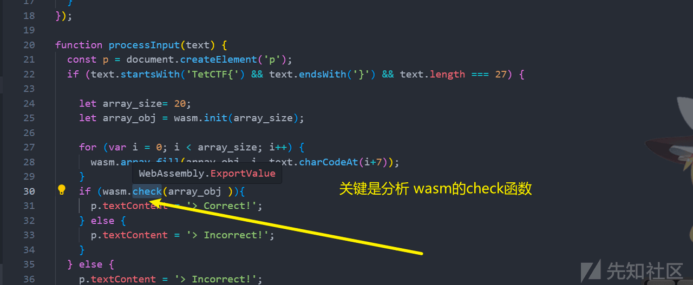](https://xzfile.aliyuncs.com/media/upload/picture/20240129140252-09d2485c-be6c-1.png)  
尝试控制台输出，发现无法实现。有点意思了，wasm 文件内置。

[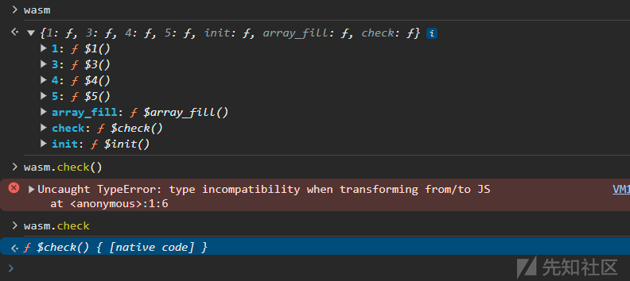](https://xzfile.aliyuncs.com/media/upload/picture/20240129140303-106ff8a8-be6c-1.png)

## 方法一：尝试 wasm2c

安装  
sudo apt install wabt  
1、反编译：  
wasm2c test.wasm -o test.c  
2、编译成可执行程序  
gcc -c test.c -o test.o  
不用链接，根本运行不起来，我们分析 o 文件即可

[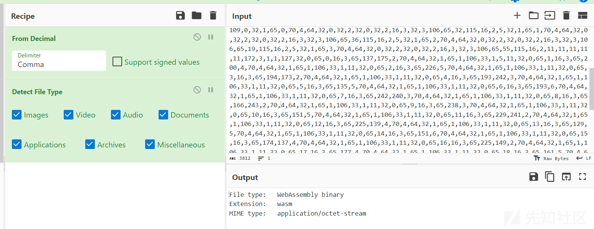](https://xzfile.aliyuncs.com/media/upload/picture/20240129140406-362a0e30-be6c-1.png)  
将内置的字节码 byte 提取出来，使用 Cyberchef 平台进行 dump

[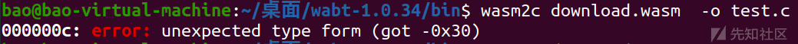](https://xzfile.aliyuncs.com/media/upload/picture/20240129140416-3bdac39c-be6c-1.png)  
但是很可惜，wasm2c 并不支持此类 wasm 文件  
这是作者的解释：

[](https://xzfile.aliyuncs.com/media/upload/picture/20240129140448-4ea37104-be6c-1.png)  
所以，换一种方法。正常情况下，这种 wasm2c 是最方便的。

## 方法二：chrome 动调

[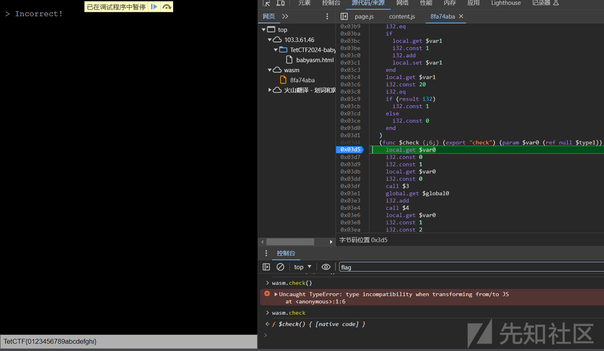](https://xzfile.aliyuncs.com/media/upload/picture/20240129140504-58338952-be6c-1.png)  
构造一个假的 flag  
TetCTF{0123456789abcdefghi}  
然后在 wasm 文件内下断点，即可运行。  
借助 GPT 的帮助，将 wasm 代码甩给他初步分析  
[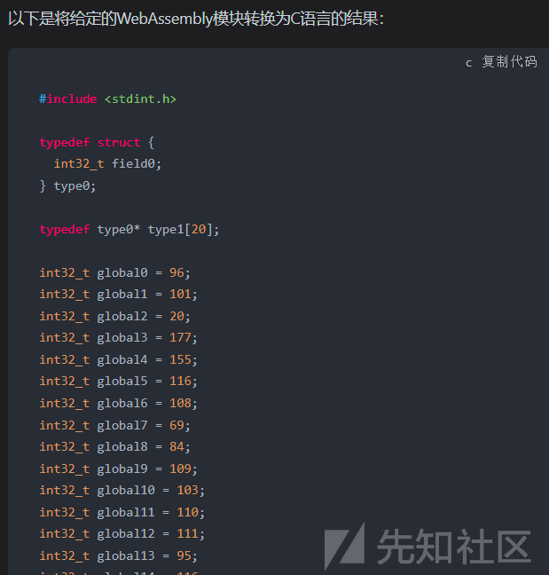](https://xzfile.aliyuncs.com/media/upload/picture/20240129140515-5ef4b8f6-be6c-1.png)  
因为代码量较多，就不贴出来的，读者可以自行将 wasm 甩给 gpt 分析。  
经过漫长的动态调试分析和 GPT 辅助分析，我们得出如下的结论：  
t 是全局密文数组，20 个输入 input，对每一个 83 都加上 83，结果按 2，3，4，1 的顺序来计算。  
我们能得到 4 个未知数和 4 个方程组，只需解 5 组 4 方程就能得到 flag

[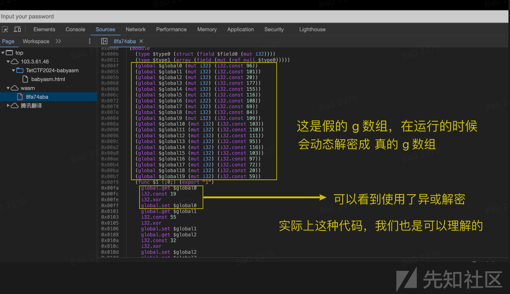](https://xzfile.aliyuncs.com/media/upload/picture/20240129140537-6bdf8f1e-be6c-1.png)

[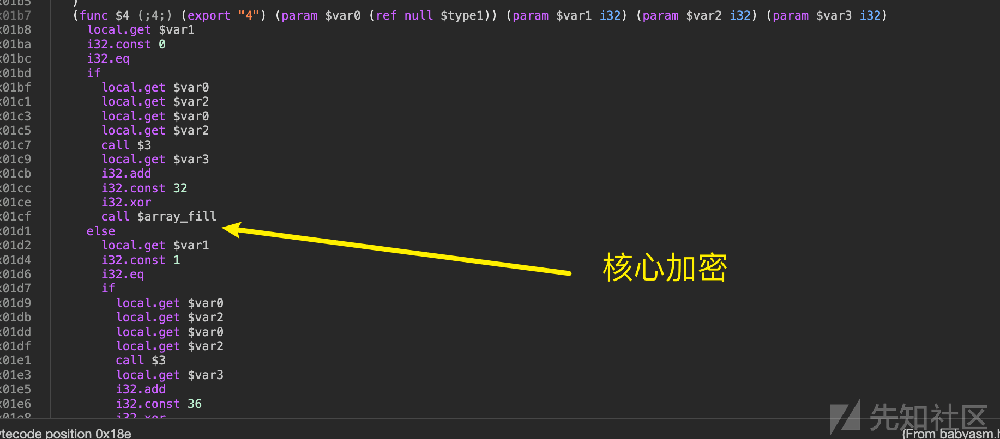](https://xzfile.aliyuncs.com/media/upload/picture/20240129140541-6ecec8f2-be6c-1.png)

[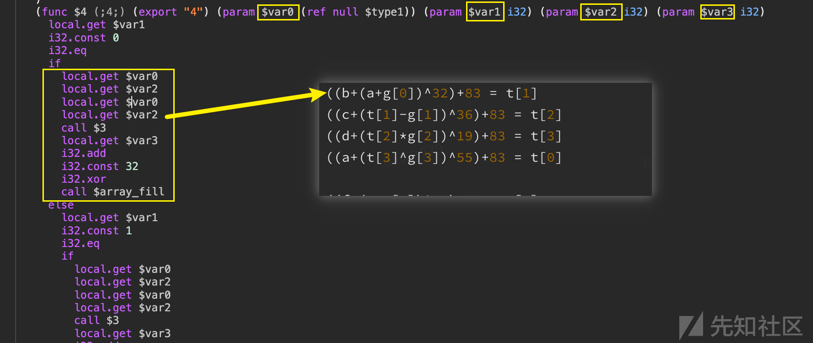](https://xzfile.aliyuncs.com/media/upload/picture/20240129140547-72143c5e-be6c-1.png)

[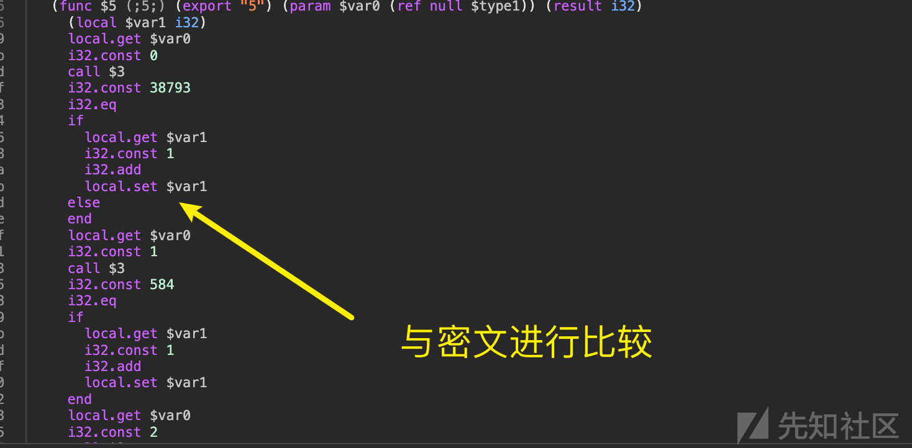](https://xzfile.aliyuncs.com/media/upload/picture/20240129140552-750c3088-be6c-1.png)  
详细的计算如下：

```plain
g = [96, 101, 20, 177, 155, 116, 108, 69, 84, 109, 103, 110, 111, 95, 116, 103, 97, 72, 20, 59]
t = [38793, 584, 738, 38594, 63809, 647, 833, 63602, 47526, 494, 663, 47333, 67041, 641, 791, 66734, 35553, 561, 673, 35306]

# 假设输入的 abcd... (97～100 都加上 83 = 180～183)
2: ((181 + (180 + 96)) ^ 32) + 83 = 572
3: ((182 + (572 - 101)) ^ 36) + 83 = 764
4: ((183 + (764 * 20)) ^ 19) + 83 = 15559
1: ((180 + (15559 ^ 177)) ^ 55) + 83 = 15728
-----
6: ((185 + (180 + 155)) ^ 32) + 83 = 630
...

# 将加密的结果 与 密文 t 数组进行比较
((b+(a+g[0])^32)+83 = t[1]
((c+(t[1]-g[1])^36)+83 = t[2]
((d+(t[2]*g[2])^19)+83 = t[3]
((a+(t[3]^g[3])^55)+83 = t[0]

((f+(e+g[4])^32)+83 = t[5]
((g+(t[5]-g[5])^36)+83 = t[6]
((h+(t[6]*g[6])^19)+83 = t[7]
((e+(t[7]^g[7])^55)+83 = t[4]
...
```

使用爆破的方式，当然也可以使用 z3，并且效率会更高

```plain
g = [115, 82, 52, 149, 136, 67, 76, 97, 71, 90, 71, 74, 124, 104, 84, 67, 114, 127, 52, 31]
t = [38793, 584, 738, 38594, 63809, 647, 833, 63602, 47526, 494, 663, 47333, 67041, 641, 791, 66734, 35553, 561, 673, 35306]

def brute_force_solve(g, t, o):
    for a in range(32+83, 127+83):
        for b in range(32+83, 127+83):
            eq1 = ((b + (a + g[0+4*o])) ^ 32) + 83
            if eq1 == t[1+4*o]:
                for c in range(32+83, 127+83):
                    eq2 = ((c + (eq1 - g[1+4*o])) ^ 36) + 83
                    if eq2 == t[2+4*o]:
                        for d in range(32+83, 127+83):
                            eq3 = ((d + (eq2 * g[2+4*o])) ^ 19) + 83
                            eq4 = ((a + (eq3 ^ g[3+4*o])) ^ 55) + 83
                            if eq3 == t[3+4*o] and eq4 == t[0+4*o]:
                                return a, b, c, d
    return None, None, None, None

for o in range(0,5):
    a, b, c, d = brute_force_solve(g, t, o)
    #3
    print(chr(a-83), chr(b-83), chr(c-83), chr(d-83), sep="", end="")
```

运行代码即可得到 flag

```plain
TetCTF{WebAss3mblyMystique}
```

当 wasm 的字节码较少时，其实可以直接看的，挺“规整”。
