# 内网渗透瑞士军刀-impacket 工具解析（七） - 先知社区

内网渗透瑞士军刀-impacket 工具解析（七）

- - -

前言  
Atexec 是 Impacket 中被高频使用的一种横向工具，该技术手段主要通过任务计划实现，本文带大家对其中的技术细节进行简单的介绍。  
0x1 MS-TSCH  
Atexec 的原理并不复杂，通过远程调用对方主机的任务计划程序（Task Scheduler）创建一个定时任务，然后通过手动触发该定时任务将执行结果写入文本中，再利用 smb 共享去读取执行结果。  
MS-TSCH：任务调度程序服务远程协议，该协议用于注册和配置任务以及查询远程计算机上运行的任务的状态，主要由三个独立的 RPC 接口组成  
网络时间表（ATSvc）

任务计划程序代理 ( SASec)

Windows Vista 操作系统任务远程协议 ( ITaskSchedulerService )

这三个接口都使用 RPC 作为远程配置和管理任务的传输，且它们的功能是逐级递增的。现如今，ITaskSchedulerService 成为了大部分计划任务操作的首选。同时，ITaskSchedulerService 接口不通过远程注册表和文件系统协议，而是通过 XML 来指定任务的配置。  
该三个接口在 Impacket 中均有实现  
Atsvc  
在 atsvc.py 中实现  
接口的 UUID：

[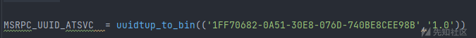](https://xzfile.aliyuncs.com/media/upload/picture/20240131180934-d55fa6f8-c020-1.png)  
相关的增删改查的结构体和请求：

[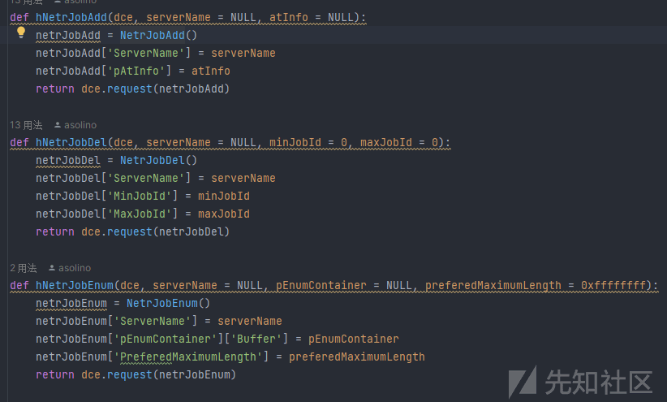](https://xzfile.aliyuncs.com/media/upload/picture/20240131180949-de543918-c020-1.png)  
SASec  
在 sasec.py 中实现  
接口的 UUID 和相关的结构体

[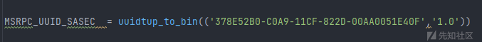](https://xzfile.aliyuncs.com/media/upload/picture/20240131181001-e54c799c-c020-1.png)

[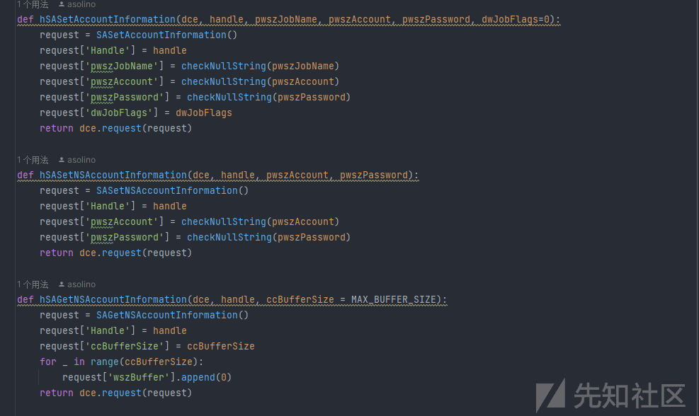](https://xzfile.aliyuncs.com/media/upload/picture/20240131181011-eb927996-c020-1.png)  
ITaskSchedulerService  
在 tsch.py 中实现  
这是平时红队工具中最常用也是功能最完善的计划任务接口，Atexec 中默认的也是这个接口

[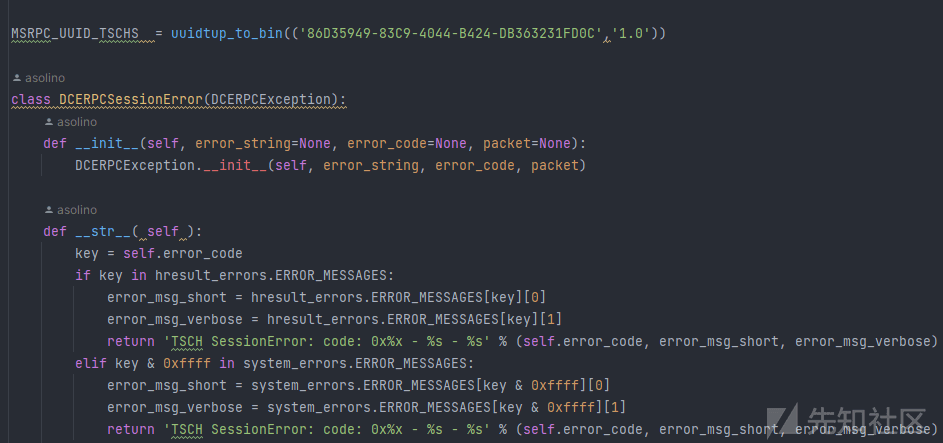](https://xzfile.aliyuncs.com/media/upload/picture/20240131181022-f218a3b2-c020-1.png)  
0x2 流程分析  
首先从主函数入口开始运行，打印版本和 banner 信息，利用 argparse 库解析输入的参数。中间经过一系列的参数解析和日志 DEBUG 判断，最后来到最后两个最关键的函数

[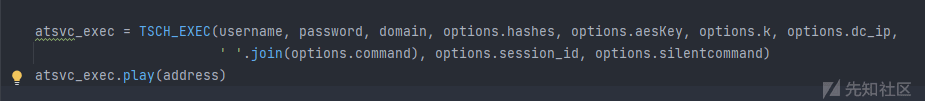](https://xzfile.aliyuncs.com/media/upload/picture/20240131181043-fe746b5a-c020-1.png)

第一个函数用于初始化定义的 TSCH\_EXEC 类对象，第二个调用实例的 play 方法，我们来到这个类对象的 play 方法，  
首先格式化连接参数，使用 SMB 传输的 RPC 服务通过连接命名管道\\pipe\\atsvc 来创建和删除计划任务，然后利用 DCERPCTransportFactory 工厂来实例一个 rpctransport

[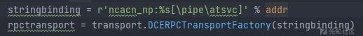](https://xzfile.aliyuncs.com/media/upload/picture/20240131181058-07a3f4e8-c021-1.png)

[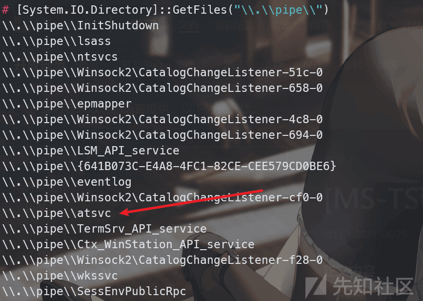](https://xzfile.aliyuncs.com/media/upload/picture/20240131181110-0e4eb904-c021-1.png)

然后根据凭据的种类来设置凭据，进入 doStuff 方法。在 doStuff 方法中，获取了一个 dce 对象，并绑定相应的 UUID 接口，也就是 ITaskSchedulerService 接口。随机生成一个文件名并将这个文件名与 tmp 拼接作为临时文件，将后续执行结果写入，同时这个临时文件名也将作为后续创建的计划任务名。  
读取我们输入的命令并拼接，可以看到利用 cmd 执行结果，并写入 Temp 目录下的临时文件中

[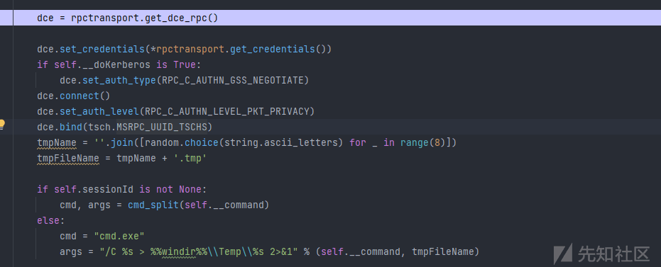](https://xzfile.aliyuncs.com/media/upload/picture/20240131181123-16540906-c021-1.png)

后面定义的 xml 则是创建的计划任务的具体配置，我们主要关注它的触发器和执行的命令  
触发器：

[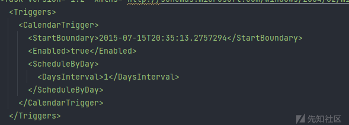](https://xzfile.aliyuncs.com/media/upload/picture/20240131181136-1e494932-c021-1.png)

它指定了起始时间，从 2015 年 7 月 15 号开始每隔一天来周期性的触发这个任务  
执行命令：

[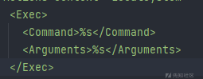](https://xzfile.aliyuncs.com/media/upload/picture/20240131181203-2e4dc9c0-c021-1.png)

第一个参数是执行的命令，第二个参数是给命令的参数

[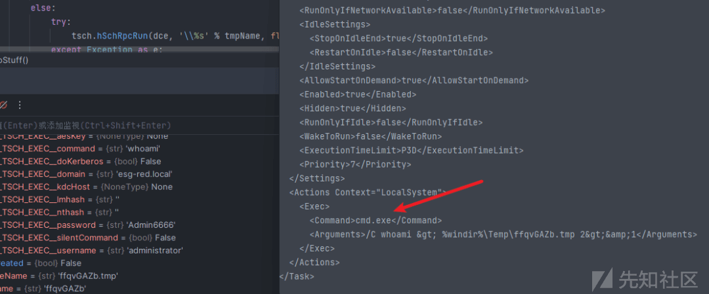](https://xzfile.aliyuncs.com/media/upload/picture/20240131181215-355d6b08-c021-1.png)

后续利用 hSchRpcRegisterTask 来注册计划任务同时打印日志输出

[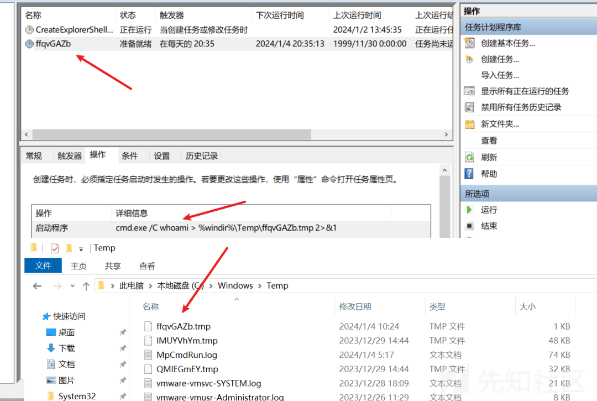](https://xzfile.aliyuncs.com/media/upload/picture/20240131181229-3d93e2c0-c021-1.png)  
前面我们知道，设置的触发器是每天一次的执行，这并不符合我们的需求，于是后续利用 hSchRpcRun 来直接进行触发

[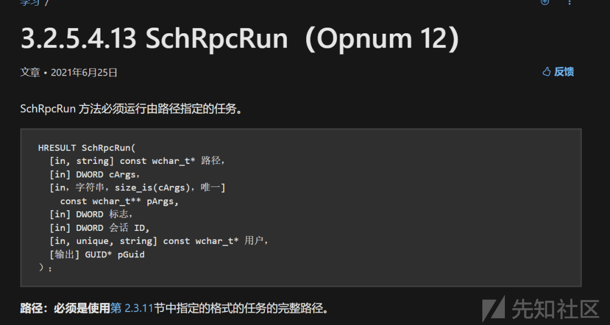](https://xzfile.aliyuncs.com/media/upload/picture/20240131181351-6e7125c4-c021-1.png)  
后续就是很常规的利用 hSchRpcGetLastRunInfo 获取计划任务的详细信息，利用 hSchRpcDelete 删除执行之后的计划任务，然后进行一次 SMB 连接读取输出的结果，在读取成功之后删除临时 tmp 文件

[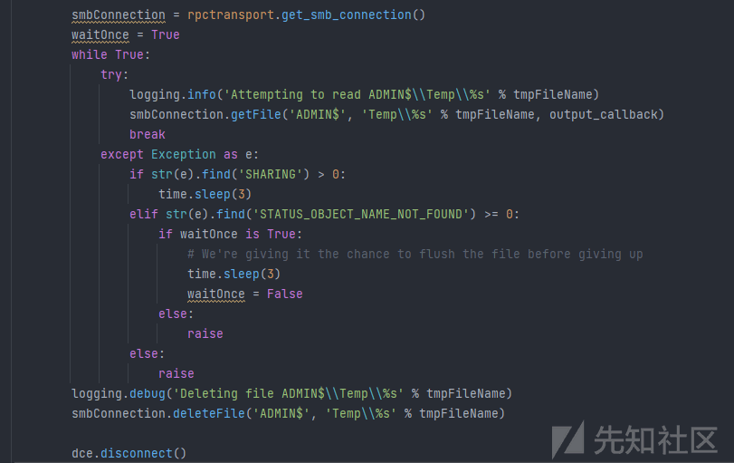](https://xzfile.aliyuncs.com/media/upload/picture/20240131181336-654f0cd6-c021-1.png)

最后整个脚本的流程结束  
0x3 总结  
Atexec 通过创建计划任务来巧妙的执行命令，但相较于 Impacket 中的其他的命令执行工具，它也有很多不足。例如它不能获取一个交互式的 shell 只能单步执行命令。同时后面文件逻辑处理也有些许不足，如果计划任务中间过程出现问题，生成的结果文件则不会被删除，如下：

[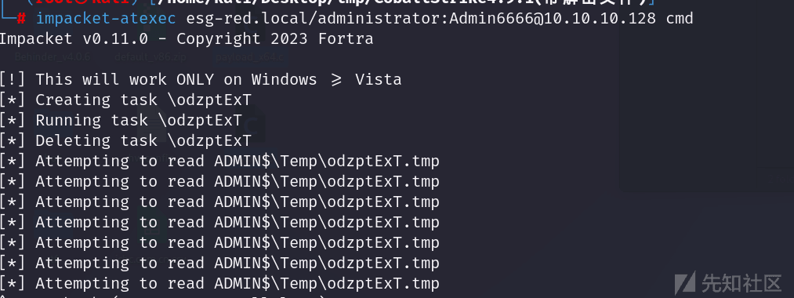](https://xzfile.aliyuncs.com/media/upload/picture/20240131181320-5bfd2afa-c021-1.png)

[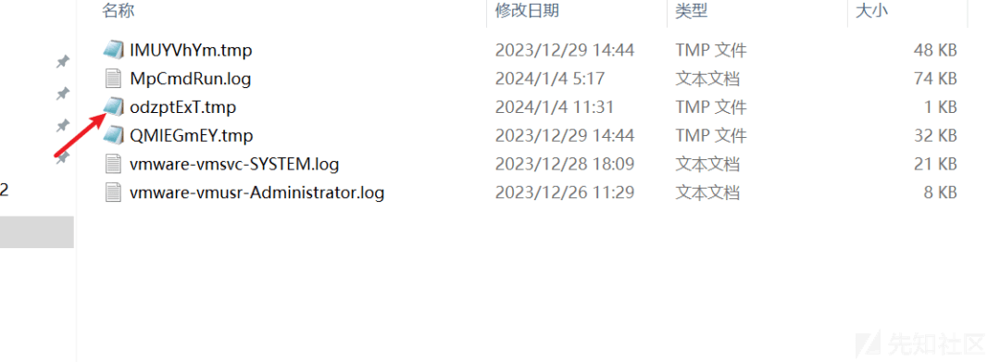](https://xzfile.aliyuncs.com/media/upload/picture/20240131181302-515cb278-c021-1.png)

除此之外，远程创建计划任务本身也是一个比较敏感的操作，很容易被杀软监控或者阻拦。我们可以通过其他方法来创建计划任务，例如通过 COM 组件等。
