# 内网渗透瑞士军刀-impacket 工具解析（五） - 先知社区

内网渗透瑞士军刀-impacket 工具解析（五）

- - -

**前言**  
在前面四篇文章中，我们向大家介绍了 impacket 中的两种认证协议的详细实现原理，以及 Windows 网络中最常用的协议 SMB 和 RPC，这四种协议都属于 impacket 库中最基础的底层协议，利用这些底层协议的组合，可以实现各种功能强大的内网渗透工具。  
从本篇开始，我们将基于 impacket 内置工具来逐一介绍其功能和代码细节。  
**PSexec 和 psexec.py**  
Psexec 是一款由 Mark Russinovich 在 1996 年开发的 Sysinternals 系列工具之一，主要功能是用于在远程计算机上执行命令。  
在当时，主流的远程运维方式主要还是依赖于 Telnet 和 SSH 服务，这两种服务在 Windows 主机中默认没有安装，而在后来出现的 Windows 远程桌面服务对带宽的要求有比较高，所以只有 700Kb 且只需要通过 SMB 服务进行通信的 Psexec 工具很快就得到了从事 Windows 运维以及安全从业者们的关注。  
Sysinternals 中的 Psexec 是一款闭源工具，在后来开源爱好者们发布了一款模仿 Psexec 功能的开源项目 RemCom，这个项目托管在 Github\[[https://github.com/kavika13/RemCom](https://github.com/kavika13/RemCom)\]  
上，有兴趣的小伙伴可以阅读一下项目的源码。RemCom 工具主要由两个部分组成：RemCom 和 RemComSVC，前者作为客户端运行，后者为一个 Windows 服务程序，作用是接受客户端指令，在所安装的机器上执行指令并向客户端返回执行结果。  
impacket 工具出现后，作者@agsolino 便将 RemComSVC 的二进制程序嵌入到 Python 中，并基于 impacket 中的 DCERPC 和 SMB 协议重新实现了 RemCom 的功能，并将其命名为 psexec.py，这也是我们今天介绍的第一个工具。  
**RemComSVC 解析**  
首先 psexec 会利用 SMB 连接将 RemComSVC 程序上传到服务器上，再利用 SCMR 服务管理 RPC 在服务器上创建一个服务，服务的二进制程序指向上传的 RemComSVC 文件路径。  
我们可以从服务端代码来看这个服务所进行的操作。  
服务入口为\_ServiceMain 函数中，我们可以看到这个服务会启动一个 CommunicationPoolThread 线程来处理客户端发送的请求，并且在主线程中调用 WaitForSingleObject 方法监听服务退出事件，如果服务退出就将自身删除掉。  
[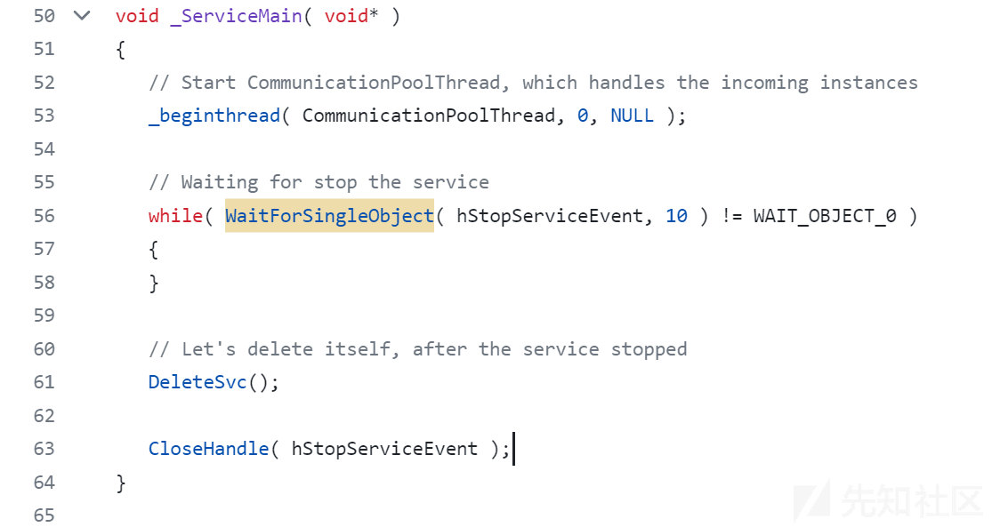](https://xzfile.aliyuncs.com/media/upload/picture/20231206152206-28d3287c-9408-1.png)  
再跟进一下 CommunicationPoolThread，CommunicationPoolThread 函数是一个死循环，首先调用 CreateNamedPipe 创建一个命名管道，管道名称是一个常量，定义如下  
**代码块**  
紧接着创建一个新的线程 CommunicationPipeThreadProc，并且将上一个管道的句柄作为参数传给 CommunicationPipeThreadProc  
[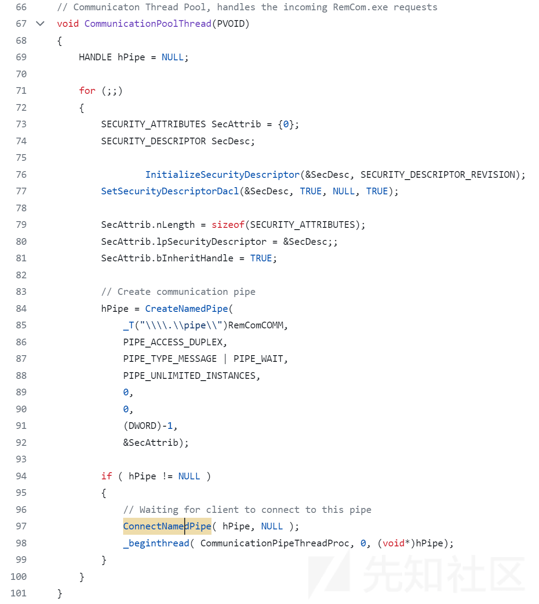](https://xzfile.aliyuncs.com/media/upload/picture/20231206152221-31c3f95c-9408-1.png)  
再跟进一下 CommunicationPipeThreadProc，在这里调用 ReadFile 函数读取上一个管道的数据并赋值到 msg 结构体中，ReadFile 在这里将阻塞，直到有客户端来连接之前创建的 RemComCOMM 管道，并向该管道写入数据。读取到客户端发送的数据之后，再调用 Execute 函数来处理客户端消息 msg，最后将处理的返回结果写入 emComCOMM 管道。

[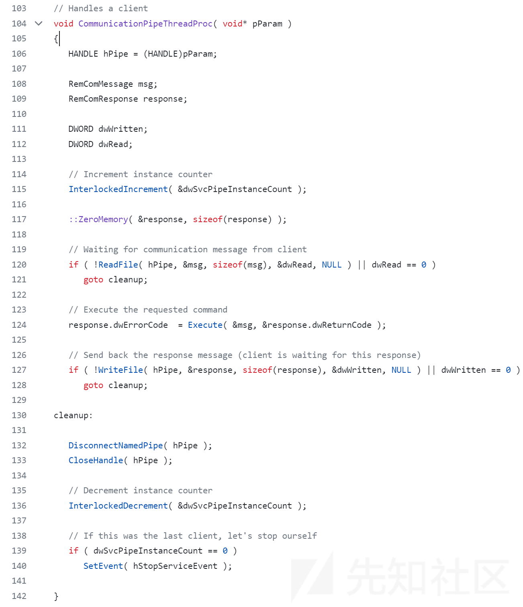](https://xzfile.aliyuncs.com/media/upload/picture/20231206152235-3a87e198-9408-1.png)  
RemCom 利用了两个类来进行数据通讯 RemComMessage 和 RemComResponse，两个类的定义如下：  
**代码块**  
RemComMessage 表示客户端请求，其中 szCommand 为执行命令，szWorkingDir 表示工作目录，dwPriority 为优先级，dwProcessId 表示客户端的 PID，szMachine 为客户端机器名。RemComResponse 为服务端响应，包含两个字段：dwErrorCode 和 dwReturnCode 分别表示错误码和命令执行的返回值。  
再跟进 Execute 方法，可以看到开头部分又创建了管道，从注释里可以知道创建三个命名管道分别代表标准输出、标准输入和标准错误。

[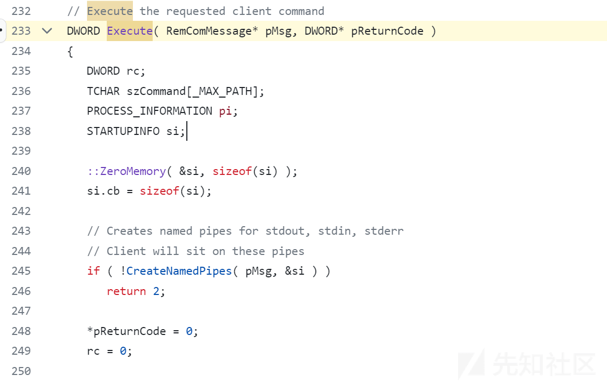](https://xzfile.aliyuncs.com/media/upload/picture/20231206152258-48282dd0-9408-1.png)  
跟进 CreateNamedPipes 方法可以发现，管道的名称有一定规律，这三个命名管道前缀都是常量，定义如下  
**代码块**  
紧接着将其与客户端传入的参数 pMsg->szMachine 和 pMsg->dwProcessId，也就是机器名和 PID 拼接

[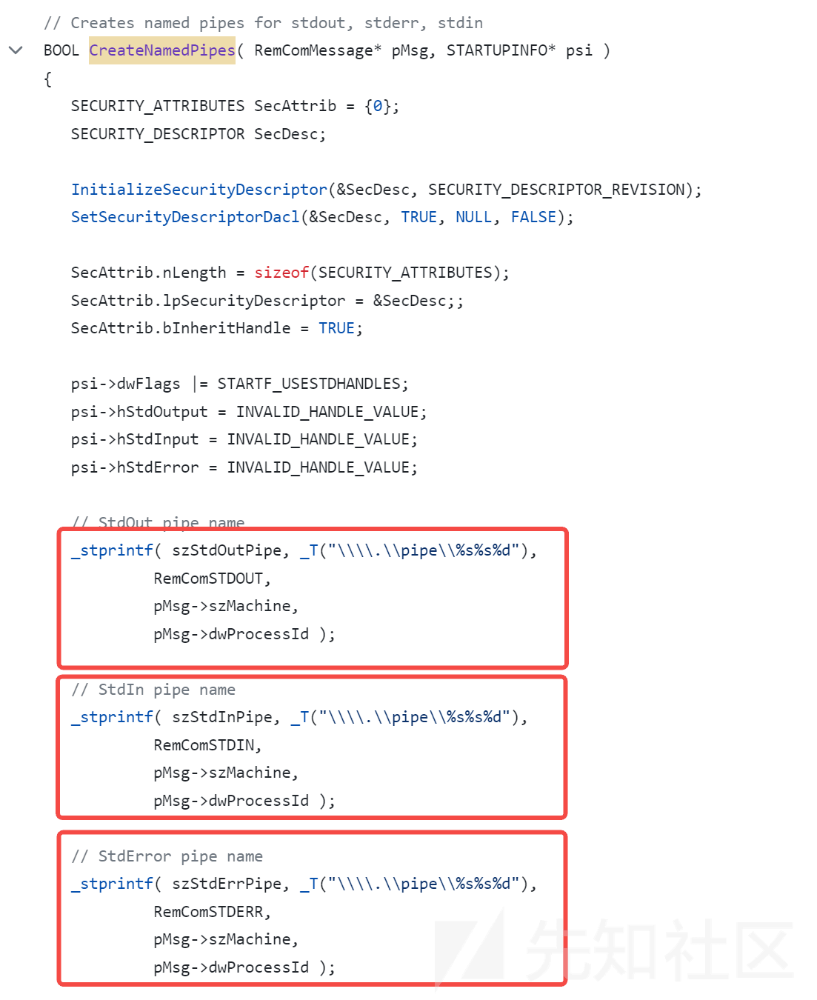](https://xzfile.aliyuncs.com/media/upload/picture/20231206152312-503fc4ec-9408-1.png)  
最后调用 CreateProcess 方法创建进程，进程的命令参数为客户端消息中的 szCommand 字段，标准输出、标准输入和错误分别重定向到了刚刚所创建的三个命名管道上。

[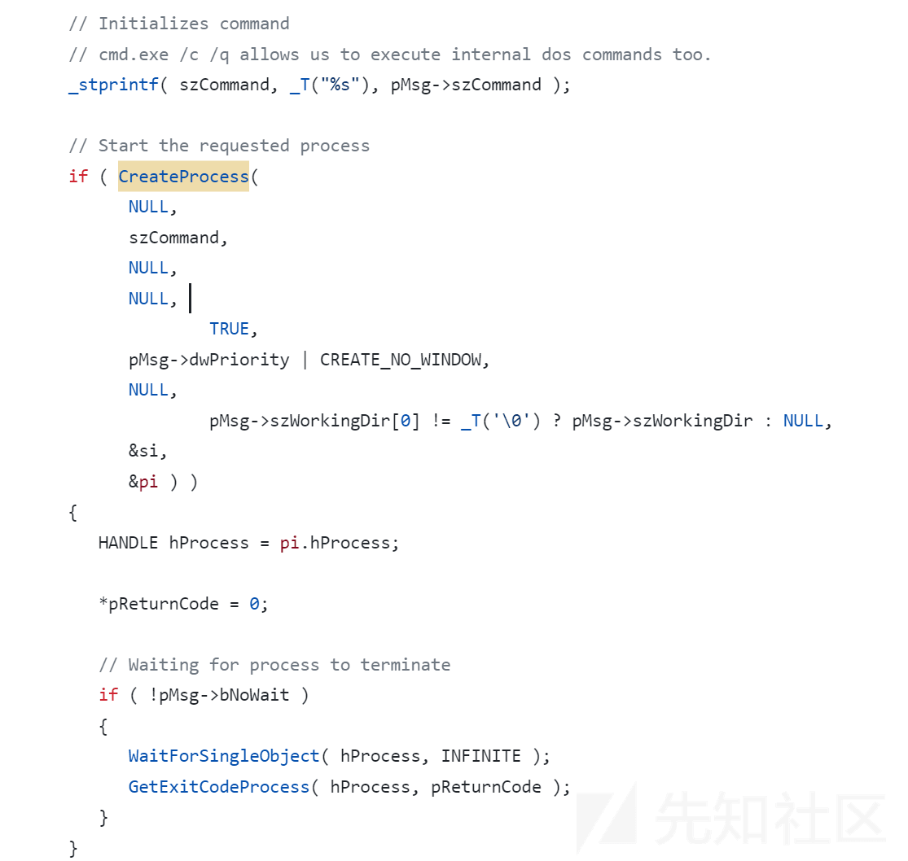](https://xzfile.aliyuncs.com/media/upload/picture/20231206152323-56ede6ca-9408-1.png)  
从整个过程可以看到，这里实现交互式命令执行主要依赖于 4 个命名管道，其中 RemCom\_communicaton 管道主要用于消息传输，其他三个管道用于将命令执行的输出重定向，以便于客户端通过命名管道进行读取。  
**psexec 代码解析**  
impacket 工具中的入口参数都比较类似，大致分为几个部分，首先  
PSEXEC 类中，主要是一些常规的参数的传递、没有进行特殊的操作。

[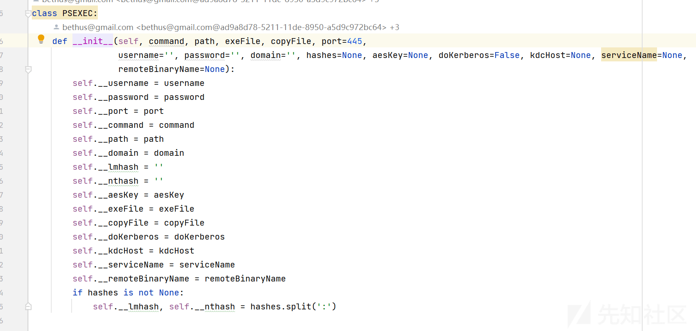](https://xzfile.aliyuncs.com/media/upload/picture/20231206152336-5e786d70-9408-1.png)  
调用的入口方法为 run 方法，我们跟进该方法，开头部分主要是对 rpc 进行了初始化，这里连接的 rpc 端点为\\pipe\\svcctl，这个是用于 SCMR 远程服务管理的 RPC 端点，设置好相关参数之后再调用 doStuff 进行处理，

[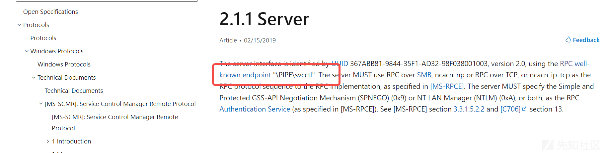](https://xzfile.aliyuncs.com/media/upload/picture/20231206152353-691bb386-9408-1.png)

[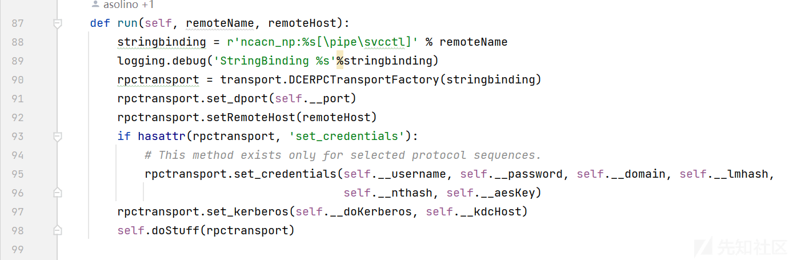](https://xzfile.aliyuncs.com/media/upload/picture/20231206152423-7a90b4ea-9408-1.png)  
继续跟进 doStuff 方法发现这里调用了 rpc 的 connect 的方法，在之前的 RPC 介绍的文章我们说过，connect 方法根据 RPC 的底层传输方式都是不同的，根据前面 stringBinding 的格式可以知道从 RPC 工厂返回的是以 SMB 为底层传输方法的 RPC，那这里的 connect 方法实际上是建立了一个 SMB 连接

[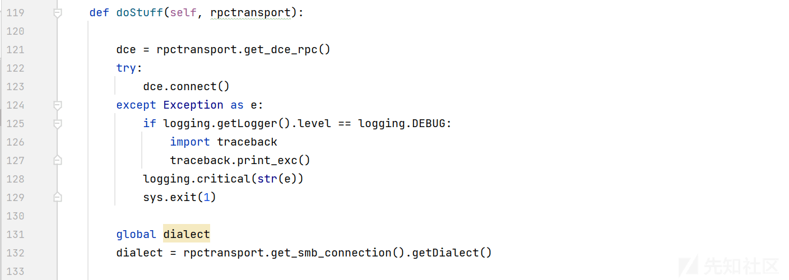](https://xzfile.aliyuncs.com/media/upload/picture/20231206152442-85c948b8-9408-1.png)  
继续跟进发现，在这里调用了一个外部库中的类 ServiceInstall，分为两种情况，当 self.\_\_exeFile 为空时参数为 remcomsvc.RemComSvc()，不为空时就打开文件，并将文件句柄作为参数，实际上这里就是利用 SCMR 对 RemComSVC 进行安装的部分，这里提供了一个替代 RemComSVC 的选项

[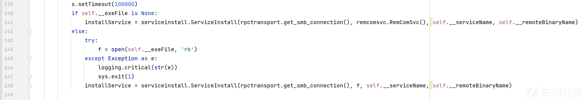](https://xzfile.aliyuncs.com/media/upload/picture/20231206152457-8f4e3772-9408-1.png)  
点击 RemComSvc 可以看到这里是将 RemComSVC 的二进制程序硬编码到了代码里面。

[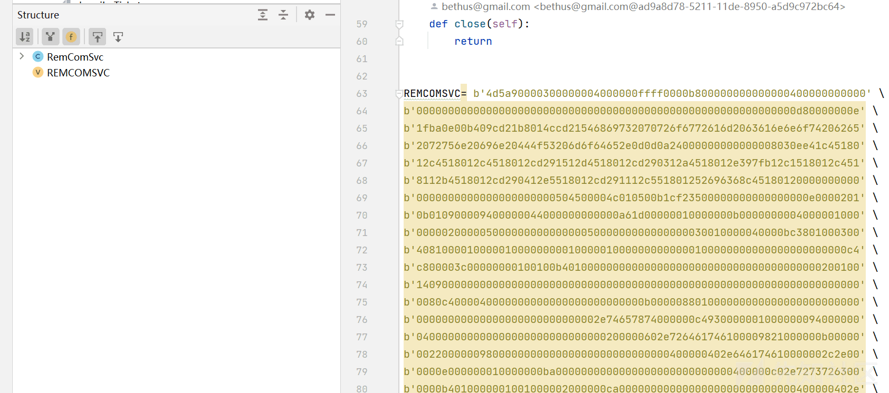](https://xzfile.aliyuncs.com/media/upload/picture/20231206152509-9665c778-9408-1.png)  
跟进下 ServiceInstall 类，初始化方法中对 serviceName 和 binary\_service\_name 参数进行判断。这两个参数分别代表目标机器上安装的服务名称和服务程序落地的文件名，可以看到在没有指定这两个名称的情况下自动生成名称的规则。服务名为 4 字节长度的 ASCII 字母，服务落地的名称为 8 字节长度的 ASCII 字母。

[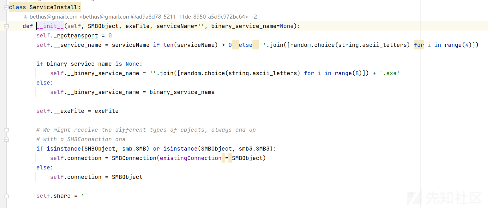](https://xzfile.aliyuncs.com/media/upload/picture/20231206152521-9d463686-9408-1.png)  
查看 install 方法可以发现这里有一个小细节，psexec 会通过 rpc 来寻找一个可写的共享路径，并将服务文件复制到这个路径中。

[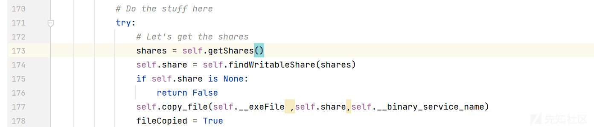](https://xzfile.aliyuncs.com/media/upload/picture/20231206152917-2a391950-9409-1.png)  
随后，打开服务管理器，根据指定的服务名、文件路径远程创建并启动服务。

[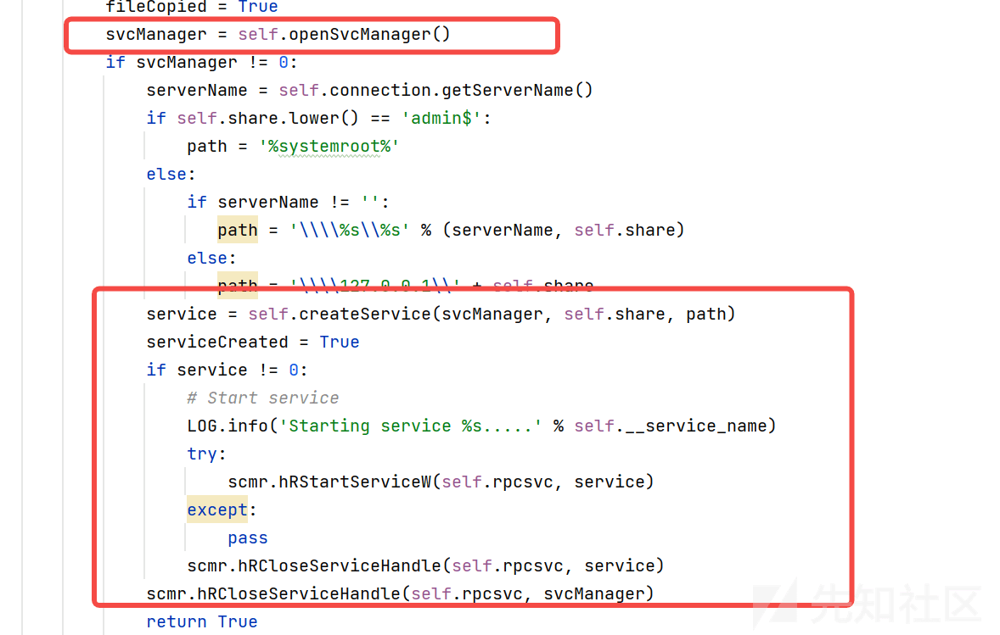](https://xzfile.aliyuncs.com/media/upload/picture/20231206152936-350681d8-9409-1.png)  
再回到 psexec 中，在这里会检查是否需要将文件复制到目标服务器中，并修改命令内容，这里主要作用是可以执行用户自己定义的可执行程序。

[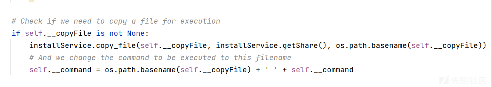](https://xzfile.aliyuncs.com/media/upload/picture/20231206152948-3c43fd0e-9409-1.png)  
随后可以看到连接了目标服务的 RemCom\_communicaton 共享，再构造一个 RemComMessage 数据包，对数据包进行赋值之后写入到命名管道中。

[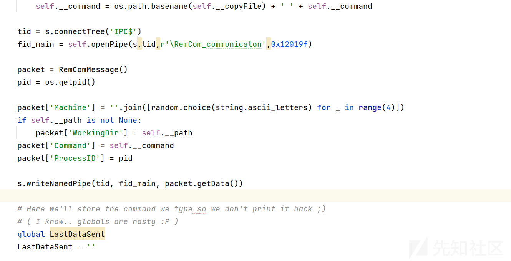](https://xzfile.aliyuncs.com/media/upload/picture/20231206153001-4419cd9c-9409-1.png)  
我们查看 RemComMessage 可以看到字段和 RemCom 中定义的都是一致的

[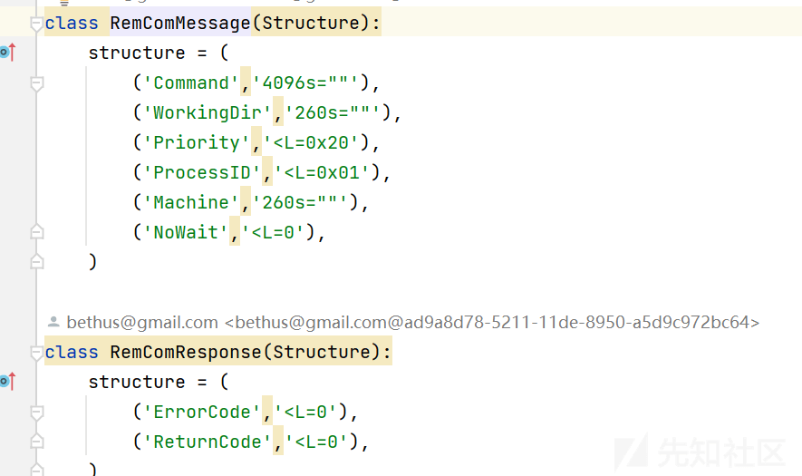](https://xzfile.aliyuncs.com/media/upload/picture/20231206153012-4ae4594e-9409-1.png)  
在这里客户端传输的机器名实际上是随机生成的 4 字节的字母。继续跟进，在这里实例化了三个类，分别为 RemoteStdInPipe、RemoteStdOutPipe、RemoteStdErrPipe，并调用了三个类的 start 方法，从注释中我们可以知道这里是创建了三个管道的线程。

[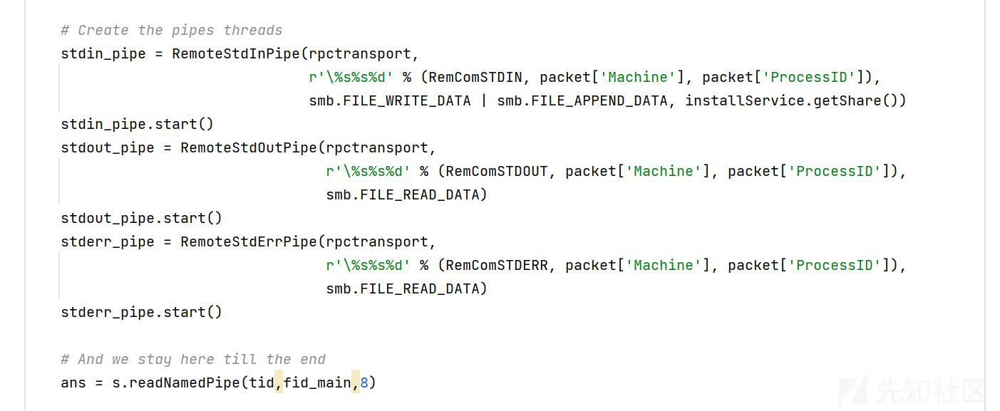](https://xzfile.aliyuncs.com/media/upload/picture/20231206153140-7f407cb8-9409-1.png)  
三个类都是继承于 Pipes 类，而 Pipes 类又是继承自 Thread 类，其中 RemoteStdOutPipe 和 RemoteStdErrPipe 类比较简单，都是在 run 方法中通过一个死循环读取各自管道的数据。

[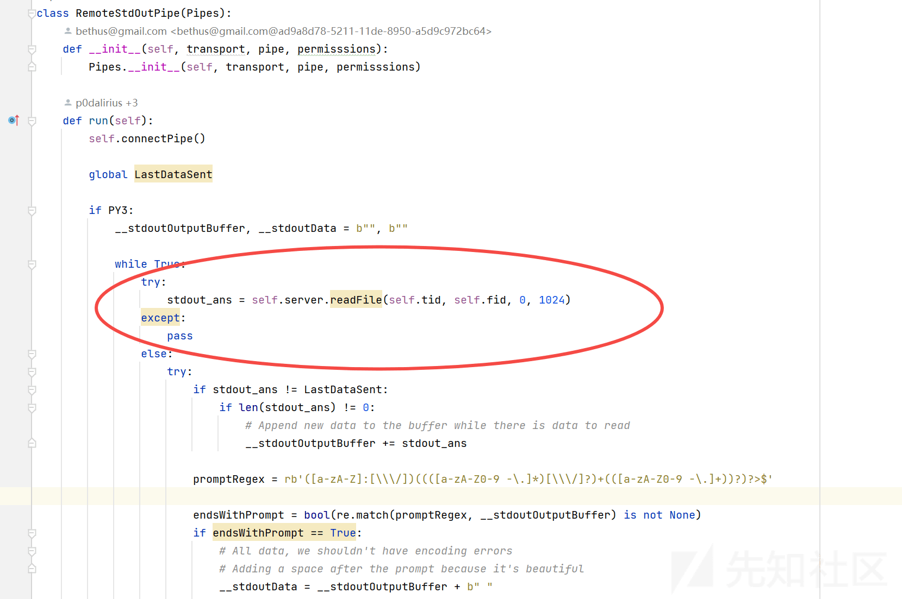](https://xzfile.aliyuncs.com/media/upload/picture/20231206153125-76062e72-9409-1.png)

[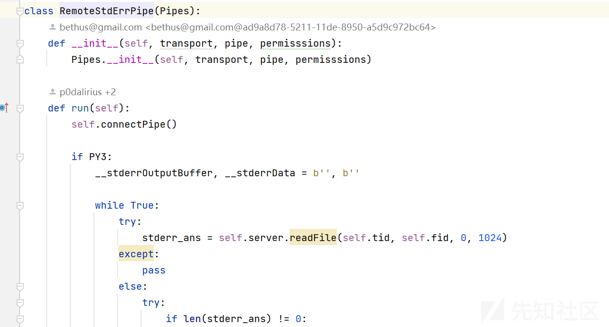](https://xzfile.aliyuncs.com/media/upload/picture/20231206153152-867f148a-9409-1.png)  
RemoteStdInPipe 相对比较复杂，因为这里需要实现一个输入终端的逻辑，所以在内部创建了一个 RemoteShell 实例，

[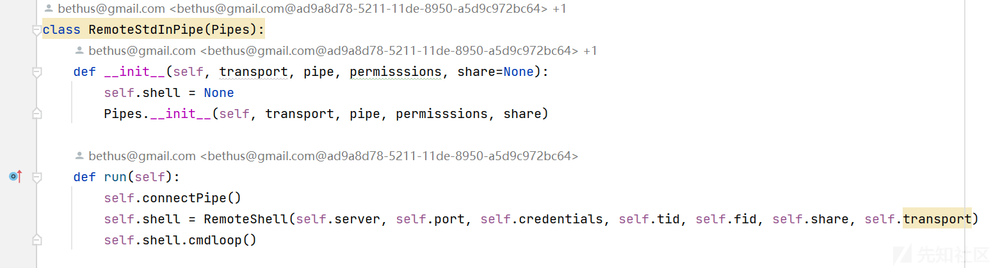](https://xzfile.aliyuncs.com/media/upload/picture/20231206153205-8e297d2e-9409-1.png)

RemoteShell 类继承自 Cmd，这是 impacket 中用于实现命令行的一个类，我们就不做具体具体分析了，简单来说，通过这个类创建的命令终端，输入的命令都会被分分配到相应的方法进行处理，例如输入 foo bar 就会调用 do\_foo 方法处理 bar 参数，如果没有找到 do*foo 方法则执行 default 方法。  
回到 RemoteShell 类中，do*\*方法一共又有 5 个，do\_help 对应的是 help 命令，作用是输出 psexec 的帮助信息。

[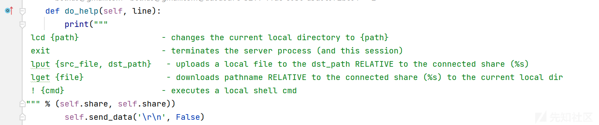](https://xzfile.aliyuncs.com/media/upload/picture/20231206153218-9602d34c-9409-1.png)  
do\_lcd 方法对应 lcd 命令，作用为切换当前工作目录。

[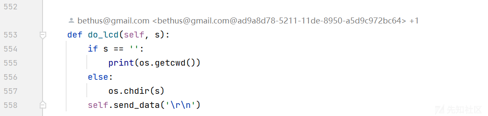](https://xzfile.aliyuncs.com/media/upload/picture/20231206153234-9f9ef782-9409-1.png)  
do\_lget 方法对应 lget 命令、作用将目标服务器上的文件下载到本地，从代码中可以看到调用的实际上是 SMBConnection.getFile 方法，传入的共享路径为安装服务的共享路径。

[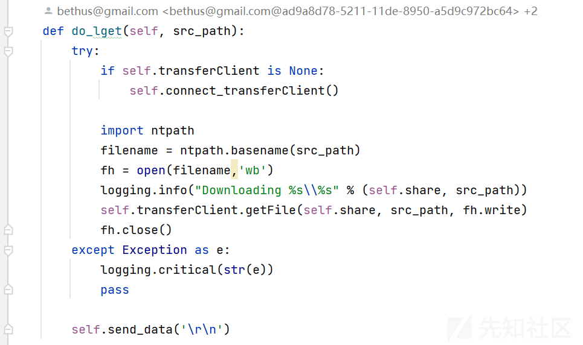](https://xzfile.aliyuncs.com/media/upload/picture/20231206153245-a619ea18-9409-1.png)  
do\_shell 方法很简单，作用就是在本地执行一条系统命令。

[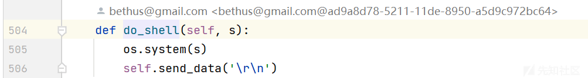](https://xzfile.aliyuncs.com/media/upload/picture/20231206153256-ac6c168e-9409-1.png)  
再来看默认执行的 default 方法，再 default 方法中则是把输入都写到标准输入命名管道中。

[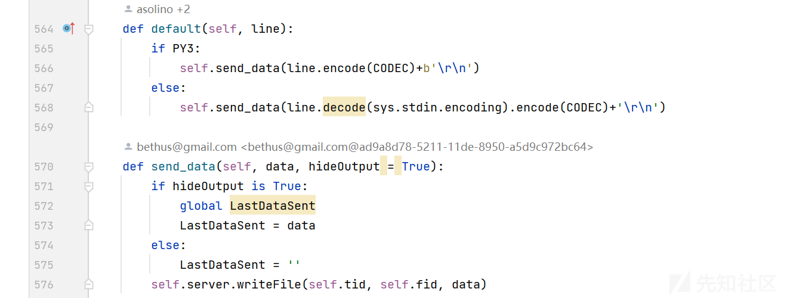](https://xzfile.aliyuncs.com/media/upload/picture/20231206153306-b2bdb97a-9409-1.png)

**总结**  
psexec 利用 DCERPC 和命名管道巧妙地实现了 Windows 平台远程交互式 shell，但是工具本身还是存在许多明显的特征。首先是 psexec 中默认的服务程序为硬编码内容，并且该文件需要落地到服务端，众多杀软和 EDR 早已将这个文件特征列入到特征库中，其次是服务创建的参数，服务名及可执行文件名称都是随机生成，正常服务中这些参数都应该是一个有意义的字符串，最后是访问共享路径，psexec 通过 4 个命名管道与服务端进行通信，其中用于初始信息交换的命名管道为硬编码名称“RemCom\_communicaton”，用于输入输出重定向的其他三个管道也具有一定的硬编码特征。  
当然、具有 OPSEC 意识的攻击者可以通过魔改 RemComSVC 和 psexec 的方式来消除以上特征，但仍然绕不开网络登录、创建服务，访问管道等过程，这时可以以用户身份为线索追溯服务创建及共享访问的行为来确定系统是否遭受此类工具进行攻击。
