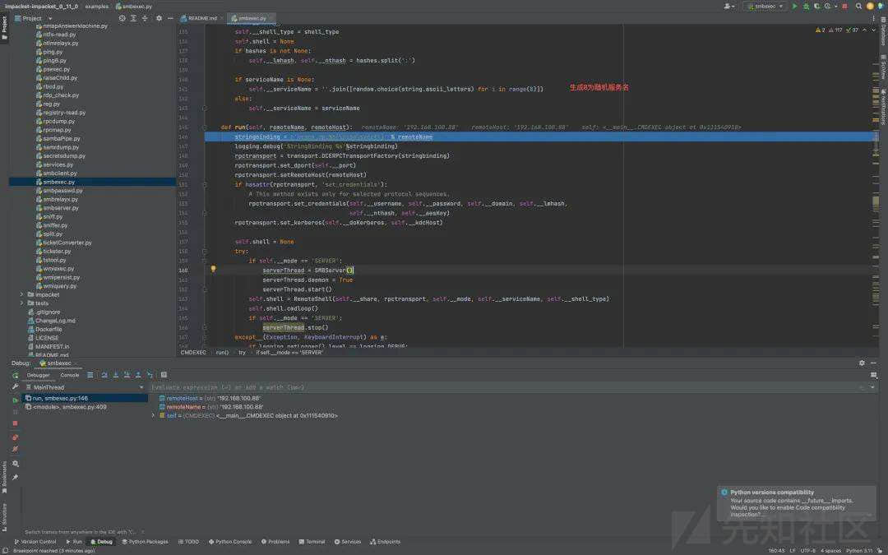
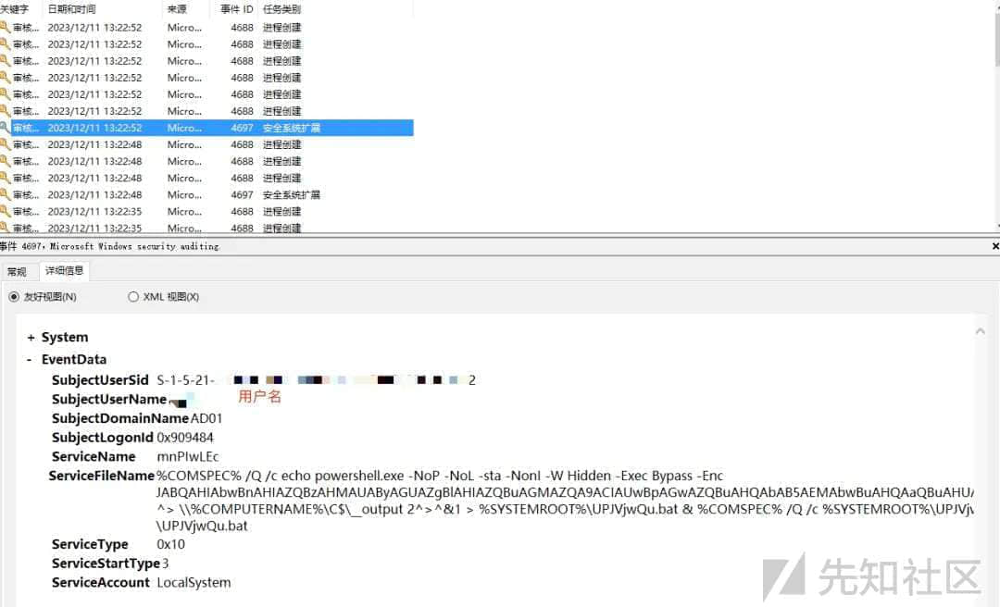

# 内网渗透瑞士军刀-impacket 工具解析（六） - 先知社区

内网渗透瑞士军刀-impacket 工具解析（六）

- - -

**前言**  
通过 SMB 协议进行的攻击行为确实是相对隐秘的。和 psexec 相同，smbexec 也有不同的版本，我们这里讲的是 impacket 里的 python 版本，众所周知，psexec 通过将同一个二进制可执行文件落地到目标来执行，这个文件是写死在 remcomsvc 里的。smbexec 同样是通过 ntlm 认证使用调用 rpc 创建服务，但是由于具体实现不同，它不会落地固定的一个文件。  
**smbexec 原理分析**  
一句话了解 smbexec:ntlm 认证后通过 rpc 创建 system 权限的服务，通过服务执行写入到 bat 文件，将结果写入到指定文件，读取结果，之后删除服务和生成的文件。  
smbexec 主要包含了三个类，SMBServer 这个类用于 SERVER 模式开启新的线程在本地创建 SMB 服务，CMDEXEC 用于身份认证、通道绑定和调用 RemoteShell 类，最后这个 RemoteShell 类是命令执行和服务创建逻辑的最终实现。

  
关于通道绑定和 ntlm 认证之前已经提过这部分我们就不再讲了，我们直接看 smbexec 的执行命令部分。这个类包含了下面这些方法，其中我们需要看的主要就是用于执行命令的 execute\_remote 方法。

  
这里补充一下，smbexec 包含两种模式，server 和 share，返回的 shell 也有两种:cmd 和 powershell。  
先看执行命令的部分，先判断我们用什么 shell 模式启动，如果是 powershell 就开启进度消息静默，然后使用分号把要执行的命令拼接到后面，再 base64 加密一次，拼接参数的时候会用到函数初始化的时候的一些数据，powershell 下的命令就类似于这样。  
echo powershell.exe -NoP -NoL -sta -NonI -W Hidden -Exec Bypass -Enc  
JABQAHIAbwBnAHIAZQBzAHMAUAByAGUAZgBlAHIAZQBuAGMAZQA9ACIAUwBpAGwAZQBuAHQAbAB5AEMA  
bwBuAHQAaQBuAHUAZQAiADsAbABkAA== ^> \\127.0.0.1\\C$\_\_output2 2^>^&1 >  
C:\\Windows\\TEMP\\execute.bat & C:\\Windows\\system32\\cmd.exe /Q /c  
C:\\Windows\\TEMP\\execute.bat & del C:\\Windows\\TEMP\\execute.bat  
这就很简单了，将 powershell 语句写到 bat 文件里，然后通过 cmd 来执行 bat 文件，powershell 执行结果输出到文件 \_\_output 里。这部分其实就是命令拼接和执行的核心，当然，在最开始第一次的时候会传递默认的命令'cd '，其切换到当前的工作目录。cmd 模式就不再讲了，只是省略了调用 powershell 的部分而已。服务创建的 hRCreateServiceW 函数其实是使用了 RCreateServiceW API 具体的参数结构可以去看一下微软文档，

  
创建后的服务

  
最后读取结果使用 get\_output 方法，如果是 SHARE 模式就调用 smbconnection 里的 getFile 方法把文件拿到本地，然后读结果再删除这个文件。如果是 SERVER 模式就在本地直接去读然后删除文件。

  
这里就要提到 SERVER 模式，默认的是 share，server 模式和它不同的点在于 SERVER 会在攻击机本地启一个 SMB 服务端监听，然后让目标机器来连本地的 smb 服务，这个过程里我们可以记录目标机器账户的 ntlmv2。

  
生成 8 位随机服务名  
但是由于最开始初始化的时候给的是“BTOBTO”，所以不会走这个逻辑，咱们自己用的参数-service-name 也是。

  
使用命名管道 svcctl

  
创建 RPC 绑定  
使用 transport.py 里的 DCERPCStringBinding 类来创建 DCERPC 绑定。

  
创建实例工厂函数  
工厂函数 DCERPCTransportFactory，接受字符串绑定，创建传输实例。

  
判断使用协议，进入命名管道协议代码块  
之后会对使用的协议进行判断，因为我们 smbexec 使用 ncacn\_np，之后就进入命名管道相关的部分。

  
获取管道端点

  
进程树  
cmd

  
powershell

  
监测  
这里我们只从日志层面来对它进行监测。在创建服务的时候会触发服务服务创建

  
然后就是进程树往下走，服务启动创建 cmd 进程用来执行命令。

  
出错的话可能会有 wermgr 的进程日志

  
总结  
现在 impacket 里的 smbexec 还是比较简单的，特征也比较很明显，大部分杀软都有针对它的监控，很多地方都是可以改的，比如 rpc 调用、服务创建，还有 server 模式的部分细节都可以更加的完善。当然，因为 SMB 协议的局限性，所以整个执行过程相对还是比较容易追踪和溯源的。
