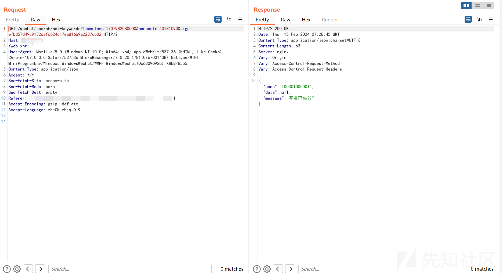
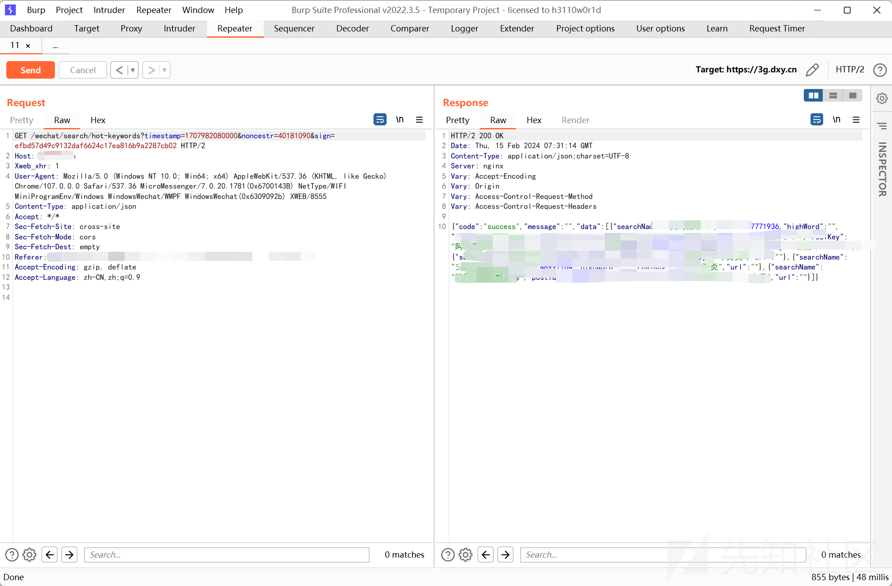

# 初探小程序渗透--Sign 签名破解 - 先知社区

初探小程序渗透--Sign 签名破解

- - -

# 前言

刚了解小程序渗透，碰到的第一个小程序就具有请求参数的 Sign 签名校验，那么就学习一下如何破解它。为了让这个过程显得完整，也写下了解密、反编译和抓包等小程序渗透的前期工作。最后，编写一个 burpsuite 插件实现自动篡改 sign 签名。  
小程序的解密、反编译和抓包在网上已经有很多文章讲述得很详细，这一部分我就只写了我的操作过程，不详述更多的细节，重点放在后面的 sign 签名破解和插件编写。

# 解密 & 反编译

**小程序代码包的存储路径**  
为了加快小程序的运行效率，首次打开小程序时微信客户端会下载包含代码和静态资源的代码包到本地。在 PC 端，要查看小程序的代码包存储路径，可以先打开微信客户端的“设置”->”文件管理“：  
[](https://xzfile.aliyuncs.com/media/upload/picture/20240215162204-4d0a31f8-cbdb-1.png)  
打开该路径，然后打开 Applet 文件夹，即 `C:\Users\Lenovo\Documents\WeChat Files\Applet`:  
[](https://xzfile.aliyuncs.com/media/upload/picture/20240215162308-73271810-cbdb-1.png)  
每个以 `wx` 作为前缀的文件夹都与不同的小程序相关，打开其中任意一个文件夹，能在里面找到有一个 `__APP__.wxapkg` 文件，这就是小程序的代码包。为了找到我所渗透的目标小程序的代码包，我先把所有 `wx` 前缀的文件夹删掉，然后重新打开目标小程序，此时 `C:\Users\Lenovo\Documents\WeChat Files\Applet` 只有一个 `wx` 前缀的文件夹，显然它就是属于目标小程序的文件夹，接着在里面找到 `__APP__.wxpakg`：  
[](https://xzfile.aliyuncs.com/media/upload/picture/20240215162345-89634a22-cbdb-1.png)  
这就是目标小程序的代码包。

注意：除了 `__APP__.wxapkg` 外，有时候可能还有其他 `.wxapkg` 文件，此时 `__APP__.wxapkg` 是主包，其他 `.wxapkg` 是分包，在[官方文档](https://developers.weixin.qq.com/miniprogram/dev/framework/subpackages.html)上可以了解更多，这不是本篇文章的重点。

**解密**  
`__APP__.wxapkg` 是经过加密的。如何识别出是否加密？可以打开文件看文件头几个字节：  
[](https://xzfile.aliyuncs.com/media/upload/picture/20240215162422-9f766e98-cbdb-1.png)  
以 `V1MMWX` 几个字节开头的是经过加密的代码包，不经过加密的是这样的：  
[](https://xzfile.aliyuncs.com/media/upload/picture/20240215162449-af9a6400-cbdb-1.png)  
在第一个字节和第十四个字节分别是 `BE` 和 `ED`，除了这个特征，还有就是看到一些类似文件路径的明文。  
当然，不想手动识别是否经过加密就直接用 UnpackMiniApp.exe 工具尝试解密 wxapkg：  
[](https://xzfile.aliyuncs.com/media/upload/picture/20240215162510-bbb24802-cbdb-1.png)  
如图所示，解密成功并得到解密后的代码包。如果是没有经过加密的 wxapkg 文件，UnpackMiniApp.exe 也会有所提示的。

**反编译**  
因为开发工具编译生成小程序代码包时，是将项目中的 js 代码文件和其他资源文件压缩到一个 wxapkg 文件中，所以我们得到解密后的代码包后，可以从中还原当初开发这个小程序项目的目录结构和文件（反编译）。

使用 [wxappUnpacker](https://gitee.com/merrytong/wxappUnpacker/) 这个工具可以反编译代码包，执行该工具的 bingo.bat 针对前面用 UnpackMiniApp.exe 工具解密得到的 wxapkg 代码包进行反编译：

```plain
bingo.bat E:\hacktools\mobile\wxpack\wx15xxxxxxxxxxxx.wxapkg
```

执行后，在与 `wx15xxxxxxxxxxxx.wxapkg` 文件同目录下有一个 `wx15xxxxxxxxxxxx` 文件夹，里面就包含小程序的代码文件和资源文件：  
[](https://xzfile.aliyuncs.com/media/upload/picture/20240215162529-c70936c0-cbdb-1.png)

# 抓包

我使用的是 proxifier 加 burpsuite 的方案，简单来说就是通过 proxifier 将微信小程序客户端的流量发送到 burpsuite 代理。首先，burpsuite 开启代理，监听端口为 127.0.0.1:8080：  
[](https://xzfile.aliyuncs.com/media/upload/picture/20240215162800-20fdb7fa-cbdc-1.png)  
proxifier 设置的代理服务器：  
[](https://xzfile.aliyuncs.com/media/upload/picture/20240215162821-2d6ed7f8-cbdc-1.png)  
代理规则：  
[](https://xzfile.aliyuncs.com/media/upload/picture/20240215162842-39eb9aa2-cbdc-1.png)  
关键是第二条规则，其作用是将 `WeChatAppEx.exe` 应用程序的所有流量都发送到 HTTPS 127.0.0.1:8080，即 burpsuite 代理的地址和端口。`WeChatAppEx.exe` 是微信小程序客户端的程序名，也就是这个窗口：  
[](https://xzfile.aliyuncs.com/media/upload/picture/20240215162859-44390e22-cbdc-1.png)  
从中打开的小程序仍然隶属 `WeChatAppEx.exe` 进程，所以小程序的流量将会发送到 burpsuite 代理。  
其他代理规则的 Action 都设置为 Direct，表示不进行代理。

# 破解 sign 签名

我打开我的渗透目标的一个小程序，其流量都经过 burpsuite 代理，假设域名为 target.com，我发现几乎所有 Host 为 target.com 的 HTTP 请求报文中发现 timestamp、nonce 和 sign 三个请求参数，例如：  
[](https://xzfile.aliyuncs.com/media/upload/picture/20240215175617-76bc54f6-cbe8-1.png)  
除了第一次发送该 HTTP 请求之后，之后不管是添加请求参数、修改请求参数的值或者直接重发这个请求，都响应“签名已失效”：  
[](https://xzfile.aliyuncs.com/media/upload/picture/20240215162932-5818fe7a-cbdc-1.png)  
显然，我需要重新生成 timestamp、nonce 和 sign 的值。timestamp 很好猜到生成方式，就是当前时间的时间戳，其他两个就需要深入到小程序代码中找到生成方式。  
在前面反编译所生成的代码中搜索 `sign` 关键词，找到一处疑似 sign 签名生成的函数：  
[](https://xzfile.aliyuncs.com/media/upload/picture/20240215162947-611e38e6-cbdc-1.png)  
下面对这段代码的整理和解释：

```plain
sign = exports.sign = function() {
    // arguments 数组包含函数被调用时传递的所有参数，arguments[0] 是第一个参数，以此类推
    var e = arguments.length > 0 && void 0 !== arguments[0] ? arguments[0] : {}, 
    t = arguments.length > 1 && void 0 !== arguments[1] ? arguments[1] : _appSignKey, 
    n = (arguments.length > 2 && void 0 !== arguments[2] && arguments[2], Object.assign({}, e)), 
    r = {
        appSignKey: t
    };

    // timestamp 是当前时间的时间戳，noncestr 是 0 到 9 之间的随机 8 个数字组合
    n.timestamp = 1e3 * Math.floor(Date.now() / 6e4) * 60, 
    n.noncestr = randomWords(8, "number");

    var a = Object.keys(n).filter(function(e) {
        return void 0 !== n[e] && "" !== n[e] || (delete n[e], !1);
    }).concat("appSignKey").sort().map(function(e) {
        return e + "=" + (r[e] || (void 0 === n[e] ? "" : n[e]));
    }).join("&");

    return n.sign = (0, _sha2.default)(a), n;
};
```

关键是 a 变量的值，它将传入到 `_sha2.default()` 函数（这里当做 SHA1 哈希函数就行了），它的值由 n 变量经过一系列处理步骤得到。n 变量是一个对象，包含与 GET 请求参数相关的属性，它经过以下步骤处理：

1.  Object.keys() 函数从 n 对象中获取所有属性的 key，包含在一个数组中并返回；
2.  filter() 过滤掉值为 undefined 或空字符串的元素，返回过滤后的数组；
3.  concat() 往数组中加入 appSignKey 字符串；
4.  sort() 对所有元素进行升序排序；
5.  map() 利用数组中的每个元素构造出类似于 `a=b&c=d&e=f` 的字符串。

假设有一个 HTTP 请求的 URL 是：`https://target.com/wechat/homepage/hot-post?categoryId=0&timestamp=1707842880000&noncestr=38551338&sign=3f42bc58631cc1583dbfdb7aef48179670a704a4`，那么原来在执行上述代码时，n 对象的属性是这样的：

```plain
{
    categoryId: 0,
    timestamp: 1707842880000,
    noncestr: "38551338",
    appSignKey: "4bTogwpz7RzNO2VTFtW7zcfRkAE97ox6ZSgcQi7FgYdqrHqKB7aGqEZ4o7yssa2aEXoV3bQwh12FFgVNlpyYk2Yjm9d2EZGeGu3"
}
```

（注意，没有出现 sign 参数，但多出一个 appSignKey 参数，它将参与 SHA1 计算，相当于 salt，其值是在小程序的代码中找到的，很容易找到的，所以这里无需纠结怎么来的）

然后，经过前面所说的 5 个步骤，添加了 appSignKey 参数，以及键按照首字母从小到大排序，最终 a 变量赋值为 `appSignKey=<省略>&categoryId=0&noncestr=38551338&timestamp=1707845023004`。

最后，a 变量传入 SHA1 哈希函数计算出 SHA1 哈希值 `3f42bc58631cc1583dbfdb7aef48179670a704a4`，这就是 sign 请求参数的值。

# 编写 burpsuite 插件

## 准备工作

要编写 burpsuite 插件，先从 burpsuite 导出接口：  
[](https://xzfile.aliyuncs.com/media/upload/picture/20240215163012-6fc68a60-cbdc-1.png)  
选择保存到一个空文件夹后，burpsuite 会在该文件夹下会生成上图列表中那些 API 的 java 文件。接着，把这些 java 文件导入到 IDEA 的一个空项目：  
[](https://xzfile.aliyuncs.com/media/upload/picture/20240215163028-7947ea48-cbdc-1.png)  
注意要放在 burp 包下。然后，在 burp 包下创建一个类，类名随意，让这个类实现两个接口 IBurpExtender 和 IHttpListener。与此同时，这个类就需要针对接口实现相应的方法，代码如下：

```plain
package burp;  

public class BurpExtender implements IBurpExtender, IHttpListener {  

    @Override  
    public void registerExtenderCallbacks(IBurpExtenderCallbacks callbacks) {  

    }  

    @Override  
    public void processHttpMessage(int toolFlag, boolean messageIsRequest, IHttpRequestResponse messageInfo) {  

    }  
}
```

下面对两个接口及其方法的解释。

**`IBurpExtender` 接口**  
一个类实现这个接口就表明它是一个 burpsuite 插件，该接口有一个 registerExtenderCallbacks 方法需要实现，它在插件被加载时调用，做一些初始化工作，比如设置插件的名称、注册 IHttpListener 实例等等。

**`IHttpListener` 接口**  
顾名思义，它表示 HTTP 请求和响应的监听器，当 burpsuite 接收到请求和响应时调用该接口的 processHttpMessage 方法，对 HTTP 请求报文做处理，我们将在这个方法中实现对 HTTP 请求参数的 sign 字段篡改。

## 插件初始化

在 processHttpMessage 方法中实现 HTTP 请求参数的 sign 重新签名之前，先在 registerExtenderCallbacks 方法做一些初始化，代码如下：

```plain
public class BurpExtender implements IBurpExtender, IHttpListener {

    private IExtensionHelpers helpers;

    private IBurpExtenderCallbacks callbacks;

    private PrintWriter stdout;

    private PrintWriter stderr;

    @Override
    public void registerExtenderCallbacks(IBurpExtenderCallbacks callbacks) {
        // 获取 helper 实例，它包含了很多辅助 burpsuite 处理各种任务的方法
        helpers = callbacks.getHelpers();

        // 获取输入流和输出流，跟 sign 自动篡改的功能无关，主要用于在 burpsuite 控制台输出一些信息
        stdout = new PrintWriter(callbacks.getStdout(), true);
        stderr = new PrintWriter(callbacks.getStderr(), true);

        // 设置插件的名称 
        callbacks.setExtensionName("AutoSign");

        // 注册 IHttpListener 实例，当前类就实现了 IHttpListener 接口，注册它即可
        callbacks.registerHttpListener(this);

        // 在控制台输出信息，测试插件是否加载成功
        stdout.println("burpsuite extender AutoSign is loaded.");
    }

    ...
}
```

## burpsuite 加载插件

burpsuite 插件以 jar 包的格式加载，所以先将当前的项目打包成 jar 包，这部分利用 IDEA 的构建功能就可以做到，这不难，不在此赘述。jar 包里面只有一个 burp 文件夹，其下包含我所创建的 BurpExtender 和 burpsuite API 相关的类文件：  
[](https://xzfile.aliyuncs.com/media/upload/picture/20240215163050-86abd5aa-cbdc-1.png)  
在 burpsuite 加载插件：  
[](https://xzfile.aliyuncs.com/media/upload/picture/20240215163120-986b52fc-cbdc-1.png)  
可以看到在下面的控制台输出了测试信息，表明插件已经成功加载并调用 registerExtenderCallbacks 方法。

## sign 签名实现

接下来，我们要在 processHttpMessage 方法中实现 sign 签名自动篡改的功能。先整理 sign 参数的生成思路，假设 burpsuite 的 Proxy 模块拦截了一个 HTTP 请求报文或者 Repeater 重新发送一个 HTTP 请求报文：  
[](https://xzfile.aliyuncs.com/media/upload/picture/20240215180013-02f84150-cbe9-1.png)  
需要做以下处理：

1.  获取所有的 GET 请求参数，但不包括 sign 和 timestamp 参数，因为它们需要重新生成；
2.  添加 timestamp 参数，参数值为时间戳；
3.  添加 appSignKey 参数；
4.  升序排序所有参数；
5.  根据参数构造出类似于 `a=b&c=d&e=f` 的字符串；
6.  对该字符串进行 SHA1 计算，得到一个 SHA1 哈希值；
7.  添加 sign 参数，参数值为 SHA1 哈希值；
8.  去掉 appSignKey 参数；
9.  最后将所有参数作为 GET 请求参数覆盖到原来的 HTTP 请求报文中。

可以参考上一节”破解 sign 签名“，对照小程序代码中对 sign 的生成步骤。

processHttpMessage 方法的实现：

```plain
public class BurpExtender implements IBurpExtender, IHttpListener {

    ...

    // appSignKey 参数的值
    private static final String APP_SIGN_KEY = "4bTogwpz7RzNO2VTFtW7zcfRkAE97ox6ZSgcQi7FgYdqrHqKB7aGqEZ4o7yssa2aEXoV3bQwh12FFgVNlpyYk2Yjm9d2EZGeGu3";

    // HTTP 请求报文的数据
    private byte[] request;

    ...

    @Override
    public synchronized void processHttpMessage(int toolFlag, boolean messageIsRequest, IHttpRequestResponse messageInfo) {
        // 只处理 Repeater、Intruder 和 Proxy 这三个模块拦截或发送的 HTTP 请求
        if (messageIsRequest && ((toolFlag & IBurpExtenderCallbacks.TOOL_REPEATER) != 0 ||
                (toolFlag & IBurpExtenderCallbacks.TOOL_INTRUDER) != 0 ||
                (toolFlag & IBurpExtenderCallbacks.TOOL_PROXY) != 0)) {

            // 获取 HTTP 请求报文的原始数据，并进行解析
            request = messageInfo.getRequest();
            IRequestInfo requestInfo = helpers.analyzeRequest(request);

            // 获取所有的 GET 请求参数，后续将围绕这个 parameters 列表处理，生成新的请求参数
            List<IParameter> parameters = requestInfo.getParameters();

            // 先清空 HTTP 请求报文上的所有 GET 请求参数，后面再重新添加
            parameters.forEach(new Consumer<IParameter>() {
                @Override
                public void accept(IParameter iParameter) {
                    request = helpers.removeParameter(request, iParameter);
                }
            });

            // 先从 parameters 列表中移除 sign 和 timestamp 参数，因为这两个参数的值需要重新生成
            parameters.removeIf(new Predicate<IParameter>() {
                @Override
                public boolean test(IParameter iParameter) {
                    return (iParameter.getName().equals("sign")) || (iParameter.getName().equals("timestamp"));
                }
            });

            // 往 parameters 列表添加 appSignKey 参数，以及具有最新时间戳的 timestamp 参数
            IParameter appSignKey = helpers.buildParameter("appSignKey", APP_SIGN_KEY, IParameter.PARAM_URL);
            parameters.add(appSignKey);
            IParameter timestamp = helpers.buildParameter("timestamp", "" + System.currentTimeMillis(), IParameter.PARAM_URL);
            parameters.add(timestamp);

            // 对所有参数进行升序排序
            parameters.sort(new Comparator<IParameter>() {
                @Override
                public int compare(IParameter o1, IParameter o2) {
                    return o1.getName().compareTo(o2.getName());
                }
            });

            // 利用所有参数构造 "a=b&c=d&e=f" 的字符串
            StringBuilder queryString = new StringBuilder();
            parameters.forEach(new Consumer<IParameter>() {
                @Override
                public void accept(IParameter iParameter) {
                    try {
                        queryString.append(iParameter.getName() + "=" + URLDecoder.decode(iParameter.getValue(), "UTF-8") + "&");
                    } catch (UnsupportedEncodingException e) {
                        e.printStackTrace();
                    }
                }
            });
            String unSignedData = queryString.substring(0, queryString.length() - 1);
            stdout.println("unSignedData: " + unSignedData);

            // 对 "a=b&c=d&e=f" 的字符串进行 SHA1 计算，得到哈希值后，往 paramters 列表添加 sign 参数
            IParameter sign = helpers.buildParameter("sign", sha1(unSignedData), IParameter.PARAM_URL);
            parameters.add(sign);

            // 根据 parameters 列表在 HTTP 请求报文上重新添加请求参数，除了 appSignKey 参数，它只在生成 sign 签名用到
            parameters.forEach(new Consumer<IParameter>() {
                @Override
                public void accept(IParameter iParameter) {
                    if (!iParameter.getName().equals("appSignKey"))
                        request = helpers.addParameter(request, iParameter);
                }
            });

            // 将篡改后的 HTTP 请求报文数据替换原来的 HTTP 请求报文
            messageInfo.setRequest(request);
            stdout.println(new String(request));
        }
    }
```

当我们调用 messageInfo.setRequest() 将篡改后的 HTTP 请求报文替换到 messageInfo，并结束 processHttpMessage 方法的执行后，burpsuite 就会自动把该请求报文发送出去。需要注意，我给 processHttpMessage 方法添加了 synchronized 关键词，因为涉及到多线程的问题，request 属性会被多个线程并发访问，没有 synchronized 关键词，在 Intruder 模块中多线程发送请求时会有问题。（后面再讲述这个问题）

还有一个 SHA1 函数需要实现，这很简单，代码如下：

```plain
public class BurpExtender implements IBurpExtender, IHttpListener {

    ...

    private String sha1(String input) {  
        try {  
            MessageDigest messageDigest = MessageDigest.getInstance("SHA-1");  
            byte[] hash = messageDigest.digest(input.getBytes());  

            StringBuilder hex = new StringBuilder();  
            for (byte b : hash) {  
                hex.append(String.format("%02x", b));  
            }  

            return hex.toString();  
        } catch (Exception e) {  
            stderr.println(e.getMessage());  
        }  

        return null;  
    }
}
```

主要用于对 "a=b&c=d&e=f" 字符串进行 SHA1 计算，返回哈希值。

## 测试插件

利用 IDEA 重新构建并生成一个新的 jar 包，然后把之前的 AutoSign 插件从 burpsuite 卸载掉并移除，重新添加。在开始测试之前，先不加载插件：  
[](https://xzfile.aliyuncs.com/media/upload/picture/20240215163221-bd027e56-cbdc-1.png)  
在 Repeater 模块测试当前向小程序后端重新发送一个 HTTP 请求的情况：  
[](https://xzfile.aliyuncs.com/media/upload/picture/20240215163240-c83b14ea-cbdc-1.png)  
响应结果显示”签名已失效“。回到 Extender 模块加载 AutoSign 插件：  
[](https://xzfile.aliyuncs.com/media/upload/picture/20240215163300-d3b91f9c-cbdc-1.png)  
再回到到 Repeater 模块，重新发送一次刚才的 HTTP 请求：  
[](https://xzfile.aliyuncs.com/media/upload/picture/20240215163351-f277412a-cbdc-1.png)  
响应结果中成功返回业务数据，说明插件的 sign 自动篡改功能生效。  
篡改后的 sign 参数是不会显示在 Repeater 模块的，如果想查看，可以在 Logger 模块中查看：  
[](https://xzfile.aliyuncs.com/media/upload/picture/20240215163409-fd3960fc-cbdc-1.png)  
可以看到日志记录中显示 sign 和 timestamp 参数篡改后的结果。

## 补充

对几个问题进行补充说明。首先，前面说到不给 processHttpMessage 方法添加 synchronized 关键词，在 Intruder 模块中多线程发送请求时会有问题，我说的问题是这样的：  
[](https://xzfile.aliyuncs.com/media/upload/picture/20240215180253-62502366-cbe9-1.png)  
两组请求参数堆叠在一个 HTTP 请求报文中，这是因为我把包含 HTTP 请求报文数据的 request 变量定义为 BurpExtender 类的属性，在 Intruder 多线程发送请求时，每个线程都会调用 processHttpMessage 方法对 request 属性进行访问和操作，这就出现并发问题。因此，需要给 processHttpMessage 方法添加 synchronized 关键词，让多个线程同步访问 request 属性。

第二个问题，我渗透的目标小程序对具有相同时间戳的 HTTP 请求报文也会响应“签名已失效”：  
[](https://xzfile.aliyuncs.com/media/upload/picture/20240215163443-119df4a4-cbdd-1.png)  
Length 为 60000 多的响应是正常返回业务数据的，而 287 的响应则是“签名已失效” 。对于这个问题，可以设置 Intruder 的请求间隔解决：  
[](https://xzfile.aliyuncs.com/media/upload/picture/20240215163500-1b4a237e-cbdd-1.png)  
重新执行：  
[](https://xzfile.aliyuncs.com/media/upload/picture/20240215175037-aba1b662-cbe7-1.png)  
Length 都是 60000 多，说明每个 HTTP 请求报文的 timestamp 都不一样，解决了相同 timestamp 造成部分请求返回“签名已失效”的问题。

# 结语

我是带着“摸透”burpsuite 工具的想法去编写插件实现 sign 签名自动篡改，便于我之后可以自己编写 burpsuite 插件实现更多个性化的功能，也有其他插件可以实现这个功能，例如 [Burpy](https://github.com/mr-m0nst3r/Burpy) ，这个插件的一个优点是可以用 python 编写。另外，这篇文章涉及的技术由于没有具体场景提供给读者，可能暂时无法复现，所以在此记录留待以后遇到后查看可能对大家有所帮助。最后，感谢大家的阅读~

# 参考

[Python 编写 Burpsuite 插件（一）](https://blog.csdn.net/qq_39997096/article/details/109649542)  
[Burpsuite API 文档](https://portswigger.net/burp/extender/api/index.html)  
[portswigger 官方文档](https://portswigger.net/burp/documentation/desktop/extensions/creating)
