# 初探异步调试 - 先知社区

初探异步调试

- - -

## 什么是异步

这并不是 js 专有的东西，但是在前端 js 安全里，如果在不了解异步的情况下，直接碰上了异步还是比较麻烦的。因此我们先来了解一下异步是什么。

**异步**（asynchronous）是计算机编程中的一个概念，指的是在执行某个任务时不需要等待该任务完成才能继续执行其他任务的能力。在异步编程中，程序可以同时执行多个任务，并且可以在某个任务执行的过程中开始执行其他任务。

异步编程通常用于处理那些需要等待一段时间才能完成的操作，比如网络请求、文件 I/O 操作或者长时间运行的计算。使用异步编程可以提高程序的效率和性能，因为它允许在等待某些任务完成的同时执行其他任务，而不需要让程序停顿等待。

这看着像多线程，其实是在一个线程内完成的。我们拿用户和浏览器交互举个例子。

当用户在浏览器中发出 HTTP 请求时，浏览器会发送请求到服务器并等待响应。在等待服务器响应的过程中，浏览器不会停止响应用户的其他操作，比如点击按钮或输入文本、下拉页面。

那么落到代码层面是怎么实现的呢，我们先要看一个东西叫回调函数

## 回调函数

它是指将一个**函数作为参数**传递给另一个函数，并在特定的事件发生或条件满足时执行该函数。

直接来看代码，同步的回调函数

### demo1.js

```plain
// 定义一个执行某些操作的函数，它接受一个回调函数作为参数
function doSomethingSync(callback) {
  console.log("正在执行同步操作...");
  // 模拟同步操作，比如计算或其他简单任务
  const result = 10 + 20; // 这里是一个简单的示例操作
  // 完成操作后调用回调函数，并将结果作为参数传递给回调函数
  callback(result);
}

// 定义一个回调函数，它将在操作完成后被调用
function callbackFunctionSync(result) {
  console.log("操作已完成，结果为：" + result);
}

// 调用函数并将回调函数作为参数传递
doSomethingSync(callbackFunctionSync);
```

异步的回调函数

### demo2.js

```plain
function fetchData(callback) {
  // 模拟异步操作，比如网络请求
  setTimeout(() => {
    const data = '这是从服务器获取的数据';
    // 调用回调函数，并将数据作为参数传递给它
    callback(data);
  }, 2000); // 2 秒后执行回调函数
}

// 定义一个回调函数，用于处理从服务器获取的数据
function processData(data) {
  console.log('处理数据:', data);
}

// 调用 fetchData 函数，并传递 processData 函数作为回调函数
fetchData(processData);

console.log('发送请求，等待响应...');
```

我们运行可以看到，在控制台先打印的**发送请求，等待响应...** ，类似的异步效果避免了耗时的运算或者操作，避免阻塞主线程。

[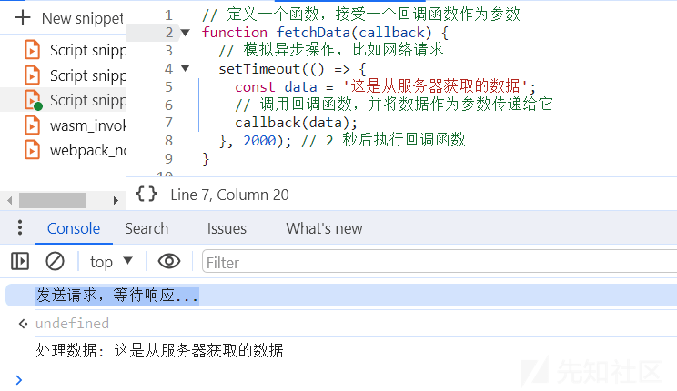](https://xzfile.aliyuncs.com/media/upload/picture/20240225014750-d3e24388-d33c-1.png)

在实际逆向过程中，如果加密算法也是通过异步实现的呢，那么我们是不是应该跟一下回调函数，确实也是如此。

## promise

promise 是 javascript 封装好的处理异步的一种方式，其底层是一个无限循环加上上面提到的回调函数，目的是为了解决回调地狱，我们来看一下有关的一些概念。

1.  **状态（State）**：Promise 有三种状态，分别是 pending（进行中）、fulfilled（已成功）和 rejected（已失败）。Promise 对象最初是 pending 状态，然后可以转变为 fulfilled 或 rejected。一旦状态发生转变，就不可再改变。
2.  **执行器函数（Executor Function）**：Promise 构造函数接受一个执行器函数作为参数，在 Promise 对象被创建时立即执行。执行器函数接受两个参数，分别是 resolve 和 reject 函数。resolve 函数用于将 Promise 的状态从 pending 转变为 fulfilled，而 reject 函数用于将 Promise 的状态从 pending 转变为 rejected。
3.  **then 方法**：Promise 实例具有 then 方法，用于注册当 Promise 状态发生改变时的回调函数。then 方法接受两个参数，分别是成功时的回调函数和失败时的回调函数。当 Promise 转变为 fulfilled 状态时，会调用成功回调函数；当 Promise 转变为 rejected 状态时，会调用失败回调函数。then 方法返回一个新的 Promise 对象，可以链式调用 then 方法。
4.  **微任务队列（Microtask Queue）**：Promise 的 then 方法中注册的回调函数会被放入微任务队列中，等待事件循环的下一个周期执行。这保证了 Promise 的回调函数总是在当前 JavaScript 执行栈执行完毕后立即执行。
5.  **异常处理**：Promise 可以通过 catch 方法或在 then 方法中传递第二个参数来处理异步操作中发生的异常。如果异步操作抛出异常，则会被 catch 方法捕获到，或者被 then 方法中的失败回调函数捕获到。
6.  **Promise 链**：Promise 对象支持链式调用，可以通过在 then 方法中返回一个新的 Promise 对象来实现链式调用。这样可以使得多个异步操作按顺序执行，并且可以方便地处理操作的结果。

[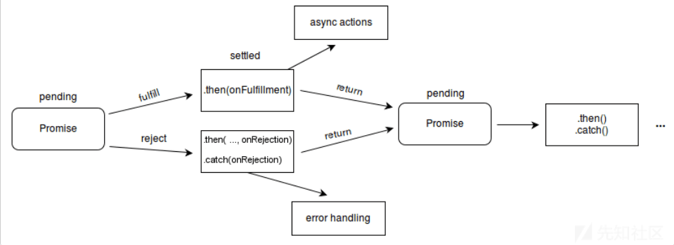](https://xzfile.aliyuncs.com/media/upload/picture/20240225014848-f69dcc08-d33c-1.png)

更多细节查看，[Promise - JavaScript | MDN (mozilla.org)](https://developer.mozilla.org/zh-CN/docs/Web/JavaScript/Reference/Global_Objects/Promise)

有了上面的铺垫，我们来看一段代码就清晰了。

```plain
const myPromise = new Promise((resolve, reject) => {
  // 执行一些异步操作，比如请求服务器数据或执行耗时任务
  const randomNumber = Math.random(); // 生成一个随机数
  setTimeout(() => {
    if (randomNumber < 0.5) {
      // 如果随机数小于 0.5，将 Promise 状态改为 fulfilled
      resolve("操作成功，随机数为 " + randomNumber);
    } else {
      // 如果随机数大于等于 0.5，将 Promise 状态改为 rejected
      reject("操作失败，随机数为 " + randomNumber);
    }
  }, 1000); // 模拟异步操作，延迟 1 秒
});

// 处理 Promise 对象的状态
myPromise
  .then((result) => {
    // 如果 Promise 状态为 fulfilled，执行此回调函数
    console.log("成功：" + result);
  })
  .catch((error) => {
    // 如果 Promise 状态为 rejected，执行此回调函数
    console.error("失败：" + error);
  });
```

## 例子

### url:aHR0cHM6Ly9tLmN0eXVuLmNuL3dhcC9tYWluL2F1dGgvbG9naW4=

很多站点加了混淆，导致不能很好的说明问题，所以在调试的过程中也要掌握其他技能。

### 接口定位和参数分析

只有一个 login

[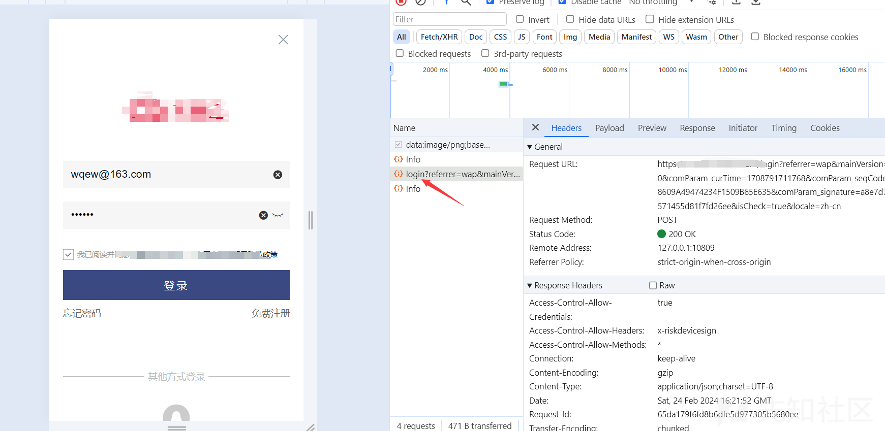](https://xzfile.aliyuncs.com/media/upload/picture/20240225014909-032f8894-d33d-1.png)

payload 里关注 password 的参数，我们就是看看怎么加密的

[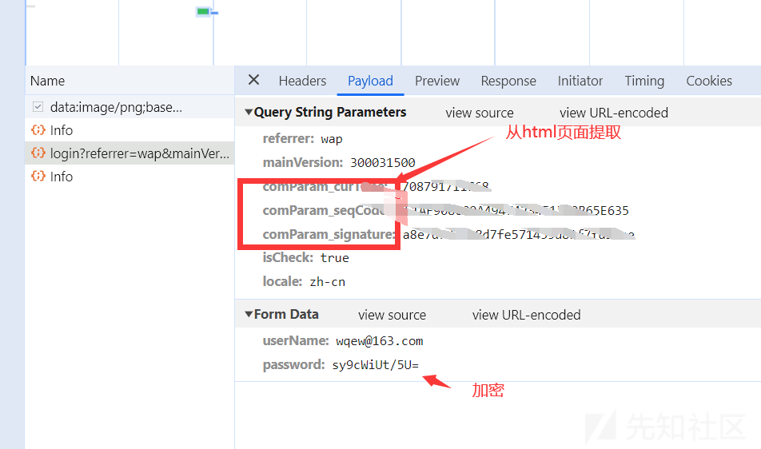](https://xzfile.aliyuncs.com/media/upload/picture/20240225014927-0dbf99c0-d33d-1.png)

### 跟栈

切换到 initiator，再点击箭头所指的地方

[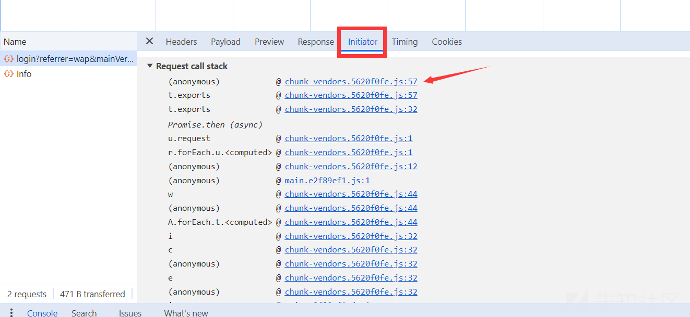](https://xzfile.aliyuncs.com/media/upload/picture/20240225014945-18a5d26e-d33d-1.png)

在 send 的地方下个断点

[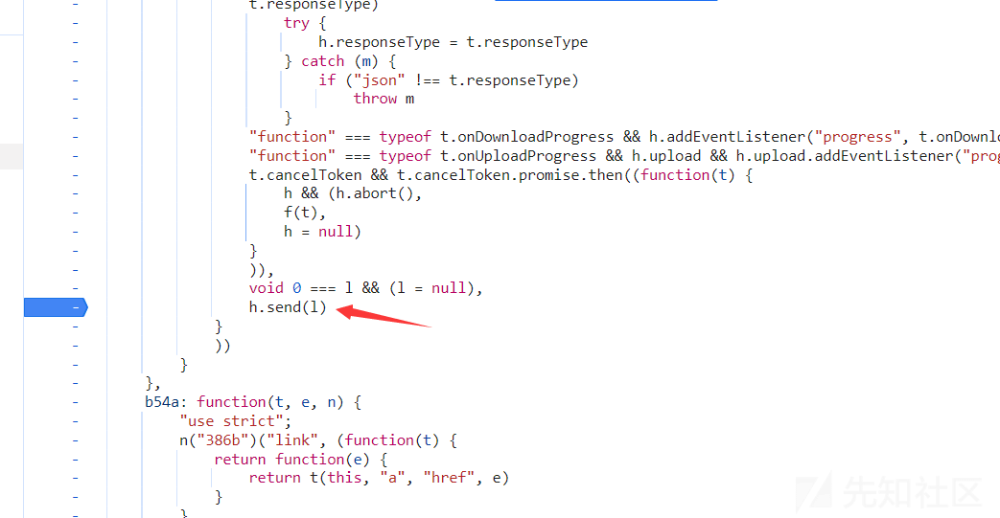](https://xzfile.aliyuncs.com/media/upload/picture/20240225014958-204027f4-d33d-1.png)

重新点击登入可以看到已经加密的 pwd，我们要找到没有加密的

[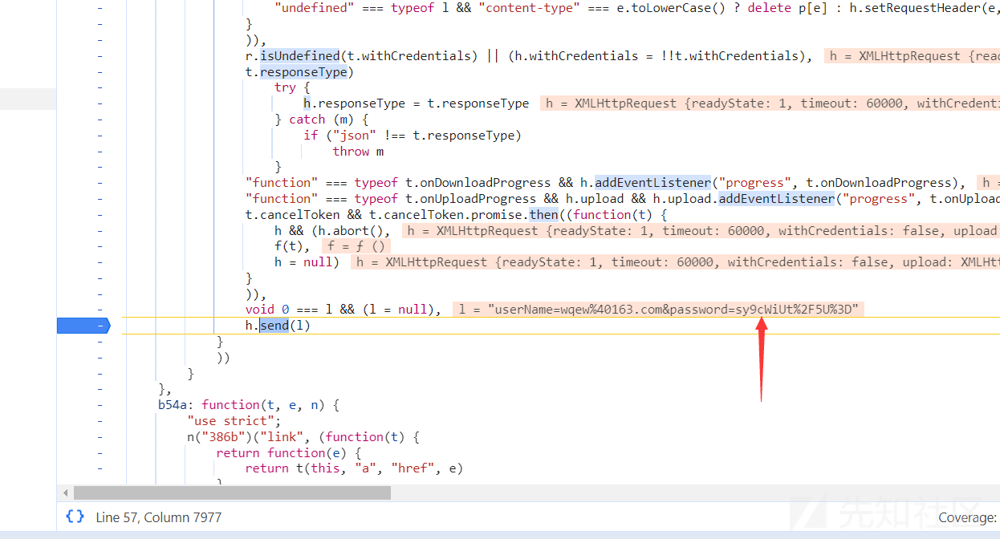](https://xzfile.aliyuncs.com/media/upload/picture/20240225015014-2a349d76-d33d-1.png)

看到这个 then 是不是很熟悉？这就是异步了，我们向上跟栈

[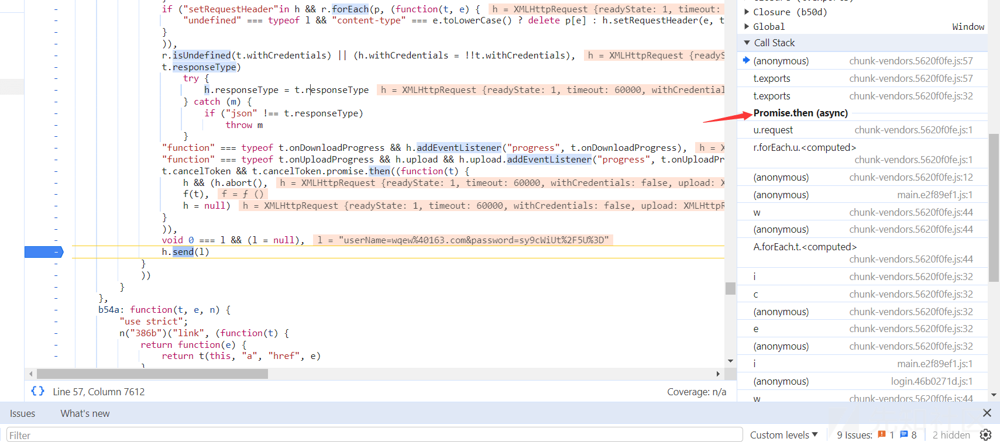](https://xzfile.aliyuncs.com/media/upload/picture/20240225015029-32d9be0c-d33d-1.png)

然后你会发现有好多异步在

```plain
u.prototype.request = function(t) {
            "string" === typeof t ? (t = arguments[1] || {},
            t.url = arguments[0]) : t = t || {},
            t = c(this.defaults, t),
            t.method ? t.method = t.method.toLowerCase() : this.defaults.method ? t.method = this.defaults.method.toLowerCase() : t.method = "get";
            var e = [a, void 0]
              , n = Promise.resolve(t);
            this.interceptors.request.forEach((function(t) {
                e.unshift(t.fulfilled, t.rejected)
            }
            )),
            this.interceptors.response.forEach((function(t) {
                e.push(t.fulfilled, t.rejected)
            }
            ));
            while (e.length)
                n = n.then(e.shift(), e.shift());
            return n
        }
```

下面是个技巧，看 js 的文件名，看过之后就知道什么意思了

[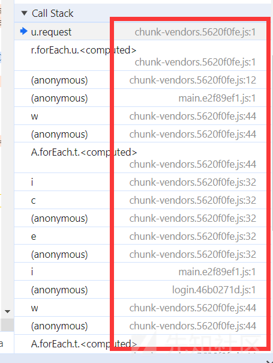](https://xzfile.aliyuncs.com/media/upload/picture/20240225015044-3bd126ee-d33d-1.png)

我们看到了这个登录的接口，有个小小的控制流，但是没啥影响。至今在 return 处下断点

[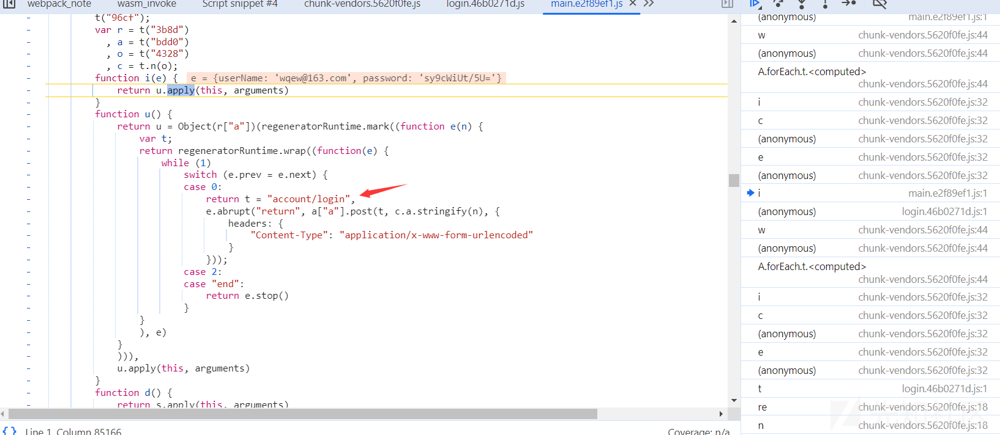](https://xzfile.aliyuncs.com/media/upload/picture/20240225015059-448c2e00-d33d-1.png)

重新点击登录按钮

[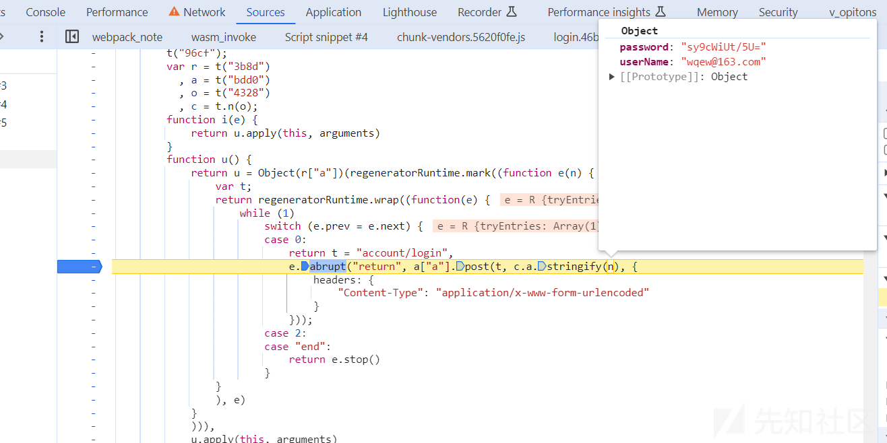](https://xzfile.aliyuncs.com/media/upload/picture/20240225015109-4adcbd10-d33d-1.png)

还是被加密了，继续跟，在上一个栈调用找到了

[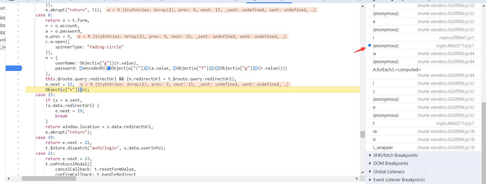](https://xzfile.aliyuncs.com/media/upload/picture/20240225015123-53048f4a-d33d-1.png)

下面是验证

### 解密验证

[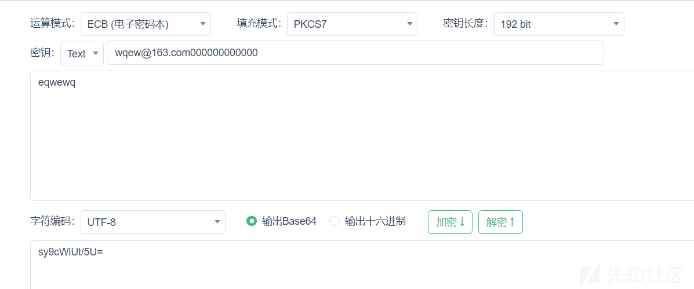](https://xzfile.aliyuncs.com/media/upload/picture/20240225015135-59f3f340-d33d-1.png)

## 总结

尝试了通过跟栈的方式解决 js 安全异步加密的案例，但这只是一种情况，也就是加密方式在异步之外的。
