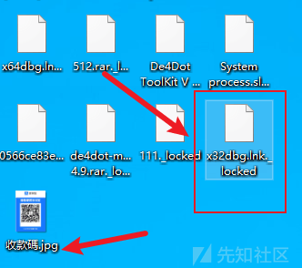

# 勒索病毒分析 - 中文信息勒索软件，利用国内平台收款 - 先知社区

勒索病毒分析 - 中文信息勒索软件，利用国内平台收款

- - -

## 前言

对病毒受害的 PC 或服务器及其所有实体 (组织或个人) 来说，除了非常敏感的小体量数据，我个人认为相比于窃密，勒索攻击的危害会更大。中国新闻网发布文章《美国将把对勒索软件调查提升至与恐怖主义同级》，先进技术国家也深受其害。学习逆向分析以来一直没有完整分析过勒索病毒，前些天刚好看别人找到的轻量级的勒索病毒，就写了一篇完整文章做系统的分析梳理。如果你对勒索病毒执行流程及原理感兴趣，本篇文章会很有帮助。

## 背景

该勒索病毒加载模块由"C++"程序编写，解密获取的核心勒索模块由"C#"程序编写，使用 reactor 6.7 加壳保护。样本运行后会将系统超过 400 种后缀文件加密并删除原始文件（附加.locked 后缀），并且向勒索攻击者邮箱发送勒索成功信息。在桌面上留下支\*宝（对，没看错）付款码图片，让你给 2000 块。  
[](https://xzfile.aliyuncs.com/media/upload/picture/20240221171815-250412f0-d09a-1.png)  
以及一段繁体中文文字告知勒索信息。[](https://xzfile.aliyuncs.com/media/upload/picture/20240221171831-2e0a2434-d09a-1.png)

## 逆向分析

## ".NET"初始化及解密勒索模块

首先调用 OleInitialize() 函数初始化 COM（Component Object Model，组件对象模型）系统。

异或解密字符“Cor\_Enable\_Profiling”。  
[](https://xzfile.aliyuncs.com/media/upload/picture/20240221171903-410feda2-d09a-1.png)  
获取环境变量“Cor\_Enable\_Profiling”状态，如果禁用则继续执行代码。[](https://xzfile.aliyuncs.com/media/upload/picture/20240221171917-49746630-d09a-1.png)  
此变量与 Microsoft .NET Framework 应用程序能否正常执行相关。当设置为非零值时启用（0x01）；否则被禁用（0x00）。该环境变量的判断实际上是比较敏感的，许多后门权限持久化操作都会查看或修改此环境变量，配合其他一些敏感操作就符合杀软检索特征，被干掉。

程序继续执行，创建当前进程快照，后续可以调用其他 API 函数来遍历快照中的进程信息。常见的操作包括枚举进程、枚举线程、获取进程模块列表等等。  
[](https://xzfile.aliyuncs.com/media/upload/picture/20240221171940-579e9db6-d09a-1.png)  
遍历当前进程的全部模块信息，检查是否存在指定的模块（mscorjit.dll、clrjit.dll，都是.net 程序关联的 dll 库），如果存在则关闭句柄并返回 0，如果不存在程序继续执行，跳转至 LABEL\_10。  
[](https://xzfile.aliyuncs.com/media/upload/picture/20240221171958-61f1fc86-d09a-1.png)  
未检索到相应模块跳转至 LABEL\_10，关闭进程快照，解密字符“\_\_”，调用 FindResourceA() 在当前内存模块中寻找勒索模块的密文载荷，然后做寻址加载、长度计算等。  
[](https://xzfile.aliyuncs.com/media/upload/picture/20240221172039-7a654cb4-d09a-1.png)  
动态调试查看定位内存信息，即部分密文 shellcode。  
[](https://xzfile.aliyuncs.com/media/upload/picture/20240221172052-824164fe-d09a-1.png)  
对密文 shellcode 连续异或等解密操作。  
[](https://xzfile.aliyuncs.com/media/upload/picture/20240221172114-8f64a876-d09a-1.png)  
完全解密获得一个完整的 PE 格式内存模块。  
[](https://xzfile.aliyuncs.com/media/upload/picture/20240221172130-9906ca08-d09a-1.png)  
导出内存保存为文件查看基本信息，可以看到有加壳，开源工具”de4dot“即可解壳。  
[](https://xzfile.aliyuncs.com/media/upload/picture/20240221172142-a047ea0e-d09a-1.png)  
续使用偏移寻址方式调用.net 模块中的勒索功能，接下来就分析勒索模块。[](https://xzfile.aliyuncs.com/media/upload/picture/20240221172158-a982fa28-d09a-1.png)

## 勒索模块

“.net”程序编写的核心勒索 PE 模块，被解密在内存中，被原有的"C++"程序以内存地址偏移的形式调用。  
程序模块结构如图。  
[](https://xzfile.aliyuncs.com/media/upload/picture/20240221172249-c83f092a-d09a-1.png)

### 前期准备工作

准备功能函数贴心的取名叫 StartAction()。首先尝试杀掉一些安全软件的进程来尽可能的清理其运行环境。然后生成加密用户文件所需密钥的相关随机数，并使用事先内置在代码内的 RSA 公钥将声称的随机数加密后保存到本地。  
[](https://xzfile.aliyuncs.com/media/upload/picture/20240221172315-d79399fe-d09a-1.png)

-   尽可能的尝试杀掉 360 安全软件的关联进程。  
    [](https://xzfile.aliyuncs.com/media/upload/picture/20240221172350-ecaf87d0-d09a-1.png)
-   生成后续加密用户文件使用的随机数（string\_5），获取硬盘序列号（string\_6），使用“255 个随机字符+Lock+ 机器硬盘序列号”的格生成一个字符串。并利用软件内置的公钥（bytes）加密和编码这个字符串。  
    [](https://xzfile.aliyuncs.com/media/upload/picture/20240221172446-0dc70cae-d09b-1.png)
-   将加密结果经过 UTF-8 编码，在 base64 编码，最终存储在“c:\\temp\\libadvpack.dll”中。虽然命名为 DLL，实际上它是一个文本文件。  
    [](https://xzfile.aliyuncs.com/media/upload/picture/20240221172652-58a0a0fa-d09b-1.png)

### 加密文件选择

选中和拼接一些路径作为指定加密路径，所有被加密的文件均会被添加.\_locked 扩展名。该勒索软件会对以下扩展名的文件进行加密（共 469 种）。

```plain
加密文件路径
C:\\Users\\\\Desktop\\
C:\\Users\\\\Downloads\\
C:\\Users\\\\Documents\\
C:\\Users\\\\Pictures\\
加密指定后缀文件：
.txt ;.doc ;.docx ;.rm ;.rrd ;.forge ;.sldasm ;.jpg ;.zpr ;.mp3 ;.qfx ;.ztmp ;.ace ;.mpp ;.raw ;.brd ;.dsn ;.pptx ;.rofl ;.plc ;.mdb ;.idf ;.xls ;.step ;.jpeg ;.3dm ;.ttxt ;.dgn ;.ad ;.bqy ;.fd ;.u8 ;.nc ;.kdb33 ;.qkg ;.kf5 ;.kdbx ;.kdb ;.ufd ;.kdy ;.emrg2 ;.edat2 ;.ebs2 ;.es2 ;.edat3 ;.ebs3 ;.es3 ;.tdms ;.lvm ;.spm ;.pug ;.xdr ;.inp ;.bw ;.aln ;.pre ;.prproj ;.d ;.chm ;.cdxml ;.cdx ;
.cds ;.sps ;.sav ;.tps ;.lgr ;.ltf ;.ldt ;.lng ;.lg4 ;.mw ;.sage ;.lab ;.edu ;.zda ;.zar ;.zmx ;.dxf ;.fn ;.bmk ;.bf3 ;.bf2 ;.bf1 ;.bd3 ;.bd2 ;.bd1 ;.cnc ;.nc ;.emf ;.mcb ;.gts ;.mgb ;.gen ;.xsr ;.t ;.pm ;.snn ;.out ;.rmg ;.rth ;.rst ;.esav ;.emat ;.db ;.hm ;.gra ;.res ;.req ;.cgr ;.ipt ;.igs ;.stp ;.crm ;.mat ;.xlxs ;.tgz ;.pcbdoc ;.min ;.cam ;.net ;.neu ;.asc ;.ms7 ;.ms8 ;.ms9 ;
.ms10 ;.ms11 ;.ms12 ;.ms13 ;.ms14 ;.ms15 ;.ms16 ;.m3u8 ;.rm ;.rmvb ;.mpeg ;.lnk ;.cs ;.odt ;.ods ;.odp ;.odm ;.odc ;.odb ;.docm ;.wps ;.xlsm ;.xlsb ;.xlk ;.ppt ;.pptx ;.pptm ;.dba ;.db0 ;.kdb ;.mpqge ;.vfs0 ;.mcmeta ;.m2 ;.lrf ;.vpp_pc ;.ff ;.cfr ;.snx ;.lvl ;.arch00 ;.ntl ;.fsh ;.w3x ;.rim ;.psk ;.tor ;.vpk ;.iwd ;.kf ;.mlx ;.fpk ;.dazip ;.vtf ;.vcf ;.esm ;.blob ;.dmp ;.layout ;.menu ;
.ncf ;.sid ;.sis ;.vdf ;.mov ;.fos ;.sb ;.itm ;.wmo ;.map ;.svg ;.cas ;.gho ;.syncdb ;.mdbackup ;.hkdb ;.hplg ;.hvpl ;.icxs ;.itdb ;.itl ;.mddata ;.sidd ;.sidn ;.bkf ;.qic ;.bkp ;.bc7 ;.def ;.dat ;.bc6 ;.pkpass ;.tax ;.gdb ;.qdf ;.t12 ;.t13 ;.bak ;.ibank ;.sum ;.sie ;.zip ;.d3dbsp ;.csv ;.wmv ;.avi ;.wma ;.m4a ;.rar ;.7z ;.mp4 ;.sql ;.psd ;.xml ;.html ;.aspx ;.asp ;.php ;.sln ;.mdb ;
.sql ;.csv ;.png ;.ofx ;.qbb ;.qbw ;.r ;.blend ;.ma ;.mb ;.avb ;.fcpx ;.config ;.arc ;.jssx ;.skp ;.vsd ;.max ;.dwf ;.wrl ;.sea ;.exb ;.rep ;.scada ;.catanalysis ;.catshape ;.catdrawing ;.catporduct ;.catpart ;.catp ;.cat ;.sec ;.mfg ;.frm ;.asm ;.drw ;.prt ;.cir ;.m4v ;.dxf ;.dcm ;.cls ;.class ;.avr ;.au ;.art ;.rwl ;.rw2 ;.r3d ;.ptx ;.pef ;.srw ;.x3f ;.der ;.cer ;.crt ;.pem ;.pfx ;
.p12 ;.p7b ;.pk7 ;.p7c ;.rb ;.css ;.js ;.flv ;.m3u ;.py ;.desc ;.xxx ;.wotreplay ;.big ;.pak ;.rgss3a ;.epk ;.bik ;.slm ;.lbf ;.sav ;.re4 ;.apk ;.bsa ;.ltx ;.accdb ;.pst ;.dwg ;.xf ;.dxg ;.wpd ;.rtf ;.wb2 ;.mdf ;.dbf ;.pdd ;.pdf ;.eps ;.ai ;.indd ;.cdr ;.jpg ;.jpe ;.dng ;.3fr ;.arw ;.srf ;.sr2 ;.bay ;.crw ;.cr2 ;.dcr ;.kdc ;.erf ;.mef ;.mrwref ;
.nrw ;.orf ;.raf ;.vcard ;.edi ;.md ;.enex ;.note ;.onenote ;.cpt ;.spx ;.gdb ;.atx ;.rda ;.rdata ;.ipynb ;.gps ;.pos ;.gdbindexes ;.gdbtable ;.shp ;.index ;.bat ;.wav ;.zip ;.ogg ;.divx ;.mkv ;.aps ;.abk ;.dot ;.java ;.bas ;.wki ;.pas ;.obj ;.msg ;.lst ;.lib ;.for ;.asm ;.c ;.com ;.int ;.dll ;.swf ;.mpg ;.flac ;.aac ;.amr ;.mmf ;.ram ;.au ;.aif ;.pic ;.gif ;.tif ;.rtf ;.mid ;.mxd ;
.img ;.ppt ;.xlsx ;.sldprt ;.ifc ;.rvt ;.logicx ;.sesx ;.vmx ;.pvm ;.nvram ;.vmdk ;.au ;.tsp ;.exe ;.gdf ;.cpp ;.cpp ;.c ;.h ;.m ;.prj ;.seq ;.plt ;.qif ;.odt ;.asset ;.litemod ;.iwi ;.das ;.upk ;.bar ;.hkx ;.ofd ;.out ;.vbs ;.pub ;.ps ;.pm5 ;.pcb ;.njx ;.vod ;.jiff ;.cpx ;.aid ;.dbb ;.jio ;.tiff ;.pcm ;.egd ;
```

加密路径和选择如图。  
[](https://xzfile.aliyuncs.com/media/upload/picture/20240221172833-94e76dc8-d09b-1.png)

### 加密逻辑

勒索软件对文件大小大于或小于 50M 采用不同的 AES 加密模式。计算文件大小（M）,更具大小做不同加密操作。  
[](https://xzfile.aliyuncs.com/media/upload/picture/20240221172910-ab60fe7a-d09b-1.png)  
大于 50M 使用 AES256 CFB 算法加密。函数首先生成随机盐值，利用盐值将准备阶段拼接的字符迭代 50000 次，生成密钥和初始化向量，然后使用 AES 算法和密码对输入文件进行加密，并将加密后的数据写入新的输出文件中，最后删除原始的未加密文件。  
[](https://xzfile.aliyuncs.com/media/upload/picture/20240221172932-b85e226a-d09b-1.png)  
小于 50M 使用 AES256 CBC 算法加密，和上诉的区别在于使用了固定的盐值（11223344）迭代 1000 次，再生成密钥和初始化向量。  
[](https://xzfile.aliyuncs.com/media/upload/picture/20240221172947-c17330f2-d09b-1.png)

### 后续操作

后续发送邮件至勒索软件使用者邮箱，具体信息包括，磁盘序列号、计算机名、加密的文件数量、RSA 公钥加密的关联字符串。并且在桌面留下了勒索信息“重要資訊.txt”，文字为繁体中文。2000 块，要是写了几个月的代码你给不给 (手动狗头)。  
[](https://xzfile.aliyuncs.com/media/upload/picture/20240221173024-d73f01d6-d09b-1.png)  
支付码图片就编码存于勒索软件中，恶意程序将图片留在了桌面上“收款碼.jpg”,并且修改文件时间为勒索软件运行至此的系统时间。  
[](https://xzfile.aliyuncs.com/media/upload/picture/20240221173100-ec7e5402-d09b-1.png)  
编写一个 GO 语言的小脚本实现和勒索软件中相同的图片解码功能。

图片如下。  
[](https://xzfile.aliyuncs.com/media/upload/picture/20240221173118-f79771b6-d09b-1.png)

脚本如下。

```plain
func Base64ToImage(base64String string, userName string) error {
 prefixes := []string{"data:image/png;base64,", "data:image/jpg;base64,", "data:image/jpeg;base64,"}
 for _, prefix := range prefixes {
  base64String = strings.Replace(base64String, prefix, "", 1)
 }
 // 解码 Base64 字符串
 decoded, err := base64.StdEncoding.DecodeString(base64String)
 if err != nil {
  return err
 }
 img, _, err := image.Decode(strings.NewReader(string(decoded)))
 if err != nil {
  return err
 }
 fileName := fmt.Sprintf("C:\\Users\\qianlan\\Desktop\\1.jpg", userName, "20240102150405") 
 file, err := os.Create(fileName)
 if err != nil {
  return err
 }
 defer file.Close()
 jpeg.Encode(file, img, nil)
 return nil
}
func main() {
 base64String := "/9j/4AAQSkZJRgABAQ.......“ //这里将内存中的字符复制完整
 userName := "example"
 err := Base64ToImage(base64String, userName)
 if err != nil {
  log.Fatal(err)
 }
 fmt.Println("Image saved successfully.")
}
```
