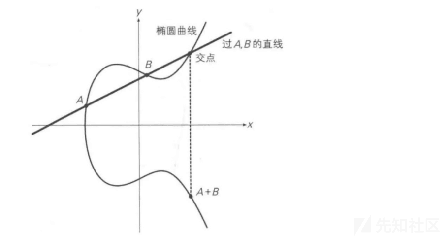
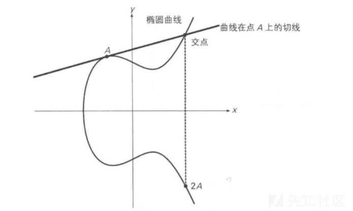
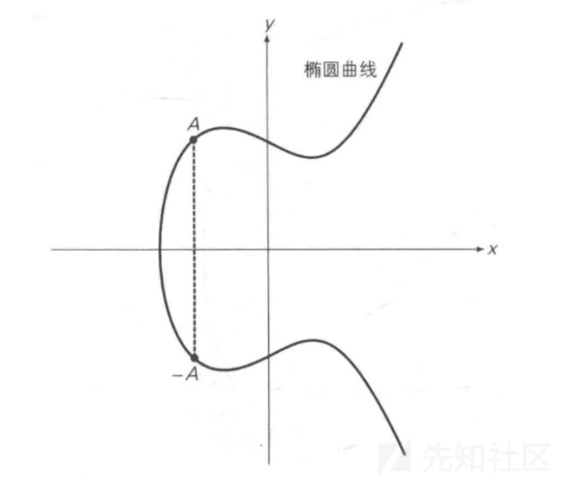
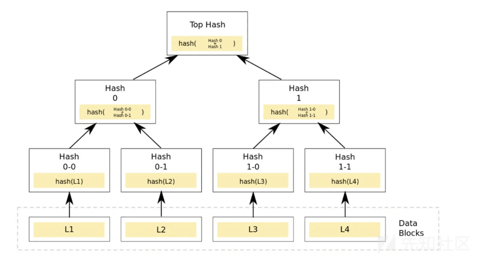

# 区块链数据结构构造分析 - 先知社区

区块链数据结构构造分析

- - -

## 文章前言

区块链是近年来备受关注的技术，它的出现为数字货币、智能合约等领域带来了革命性的变革，然而区块链的实现并不简单，其中的数据结构是至关重要的一部分。本文将介绍区块链的数据结构，帮助读者更好地理解区块链的运作原理，通过本文的学习，读者将能够更好地理解区块链的本质并为后续的区块链安全研究及漏洞挖掘打下坚实的基础

## 区块结构

区块是一种记录交易的数据结构，每个区块由区块头和区块主体组成，区块主体负责记录前一段时间内的所有交易信息，区块链的大部分功能都由区块头实现，区块头数据结构包含以下几个部分：

-   版本号 (Version)：表示当前区块的版本号，用于标识当前区块所使用的协议和规范
-   父区块哈希值 (Previous Block Hash)：表示当前区块之前一个区块的哈希值，这样就形成了区块链的不可篡改性
-   Merkle 根 (Merkle Root)：表示当前区块中所有交易信息的 Merkle 树根哈希值，用于保证区块中交易信息的完整性
-   时间戳 (Timestamp)：表示当前区块的时间戳，用于记录区块的产生时间
-   难度目标 (Difficulty Target)：表示当前区块的哈希值必须满足的难度目标，这个值是根据当前网络计算出来的，用于保证区块链的安全性和可靠性
-   随机数 (Nonce)：用于计算区块哈希值的随机数，通过不断尝试不同的随机数以满足难度目标为目的，从而保证区块的唯一性和完整性

下面是一个区块链头部的示意图，需要注意的是区块头中的前一区块哈希值、Merkle 根和难度目标等元数据信息都是通过哈希计算得到的并以此来保证区块的完整性和安全性，如果有人试图篡改某个区块的交易信息或者区块头，必须要重新计算该区块后面所有区块的哈希值，这是非常困难和耗费大量计算资源的，因此区块头是保证区块链安全性和可靠性的重要组成部分

```plain
+-------------------------------------------------------+
|                                                       |
|           +----------------------+                    |
|           | Version              |                    |
|           | Previous Block Hash  |                    |
|           | Merkle Root          |                    |
|           | Timestamp            |                    |
|           | Difficulty Target    |                    |
|           | Nonce                |                    |
|           +----------------------+                    |
|                                                       |
+-------------------------------------------------------+
```

区块链中的区块体 (Block Body) 是区块数据结构中的另一个重要组成部分，它包含了一定数量的交易信息，记录了所有的交易信息并保证了区块链的去中心化和可靠性，区块体的数据结构通常包含以下几个部分：

-   交易记录 (Transactions)：表示当前区块中包含的交易信息，每个交易都包含了交易双方的地址、交易金额、交易时间等信息
-   交易计数器 (Transaction Counter)：表示当前区块中包含的交易数量，用于区分不同的区块

区块链中的区块体示意图如下：

```plain
+-------------------------------------------------------+
|                                                       |
|           +----------------------+                    |
|           | Transactions         |                    |
|           +----------------------+                    |
|           | Transaction 1        |                    |
|           | Transaction 2        |                    |
|           | Transaction 3        |                    |
|           | ...                  |                    |
|           +----------------------+                    |
|           | Transaction Counter  |                    |
|           +----------------------+                    |
|                                                       |
+-------------------------------------------------------+
```

区块体中的交易记录是区块链的核心内容之一，它记录了所有的交易信息并保证了区块链的去中心化和可靠性，交易记录中包含了交易双方的地址、交易金额、交易时间等信息，同时也包含了数字签名等信息，用于验证交易的合法性和完整性，交易计数器则用于记录当前区块中包含的交易数量，用于区分不同的区块，避免区块重复或丢失的情况

综上所述，我们可以得到一个完整的区块链中区块的示意图：

```plain
+-------------------------------------------------------+
|                                                       |
|           +----------------------+                    |
|           | Block Header         |                    |
|           +----------------------+                    |
|           | Version              |                    |
|           | Previous Block Hash  |                    |
|           | Merkle Root          |                    |
|           | Timestamp            |                    |
|           | Difficulty Target    |                    |
|           | Nonce                |                    |
|           +----------------------+                    |
|                                                       |
|           +----------------------+                    |
|           | Transactions         |                    |
|           +----------------------+                    |
|           | Transaction 1        |                    |
|           | Transaction 2        |                    |
|           | Transaction 3        |                    |
|           | ...                  |                    |
|           +----------------------+                    |
|                                                       |
|                                                       |
|           +----------------------+                    |
|           | Block Hash           |                    |
|           +----------------------+                    |
|                                                       |
+-------------------------------------------------------+
```

以下是使用 Go 语言声明一个简单的区块链区块数据结构的测试代码，其中声明了一个区块结构体 Block 和一个交易结构体 Transaction 并实现了计算区块哈希值的方法 calculateHash 和创建新区块的方法 newBlock，在测试代码中创建了一个创世区块和一个新区块并输出了新区块的各项信息：

```plain
package main

import (
    "crypto/sha256"
    "encoding/hex"
    "time"
)

// 区块结构体
type Block struct {
    // 区块头
    Version       int64  // 版本号
    PreviousHash  string // 前一区块哈希值
    MerkleRoot    string // Merkle 根哈希值
    Timestamp     int64  // 时间戳
    Difficulty    int64  // 难度目标
    Nonce         int64  // 随机数
    // 区块体
    Transactions  []*Transaction // 交易信息
    TransactionNum int64          // 交易数量
}

// 交易结构体
type Transaction struct {
    From   string // 发送方地址
    To     string // 接收方地址
    Amount int64  // 交易金额
    Time   int64  // 交易时间
}

// 计算区块哈希值
func (b *Block) calculateHash() string {
    blockData := string(b.Version) + b.PreviousHash + b.MerkleRoot + string(b.Timestamp) + string(b.Difficulty) + string(b.Nonce)
    hash := sha256.Sum256([]byte(blockData))
    return hex.EncodeToString(hash[:])
}

// 创建新区块
func newBlock(previousBlock *Block, transactions []*Transaction) *Block {
    block := &Block{
        Version:        1,
        PreviousHash:   previousBlock.calculateHash(),
        MerkleRoot:     "merkle_root",
        Timestamp:      time.Now().UnixNano(),
        Difficulty:     1,
        Nonce:          0,
        Transactions:   transactions,
        TransactionNum: int64(len(transactions)),
    }
    return block
}

// 测试代码
func main() {
    // 创建创世区块
    genesisBlock := &Block{
        Version:        1,
        PreviousHash:   "",
        MerkleRoot:     "merkle_root",
        Timestamp:      time.Now().UnixNano(),
        Difficulty:     1,
        Nonce:          0,
        Transactions:   []*Transaction{},
        TransactionNum: 0,
    }
    // 创建新区块
    transactions := []*Transaction{
        {From: "alice", To: "bob", Amount: 10, Time: time.Now().UnixNano()},
        {From: "bob", To: "charlie", Amount: 5, Time: time.Now().UnixNano()},
    }
    newBlock := newBlock(genesisBlock, transactions)
    // 输出新区块信息
    println("Block Version:", newBlock.Version)
    println("Previous Block Hash:", newBlock.PreviousHash)
    println("Merkle Root Hash:", newBlock.MerkleRoot)
    println("Timestamp:", newBlock.Timestamp)
    println("Difficulty Target:", newBlock.Difficulty)
    println("Nonce:", newBlock.Nonce)
    println("Transactions:", newBlock.Transactions)
    println("Transaction Number:", newBlock.TransactionNum)
    println("Block Hash:", newBlock.calculateHash())
}
```

## 哈希算法

Hash 算法又称散列算法，它是一种将任意长度的消息转换为固定长度输出的算法，Hash 算法的主要应用场景包括数据完整性校验、数据加密、数字签名等。

Hash 算法可以分为以下几类：

-   消息摘要算法：将任意长度的消息转换为固定长度的哈希值，常用的算法包括 MD5、SHA-1、SHA-2、SHA-3 等
-   消息认证码算法：在消息摘要算法的基础上增加了密钥，用于验证消息的完整性和真实性，常用的算法包括 HMAC、CMAC 等
-   公钥密码学算法：包括数字签名、密钥交换、加密等功能，常用的算法包括 RSA、DSA、ECDSA、Diffie-Hellman、ElGamal 等

以下是一个使用 Go 语言实现 SHA-256 消息摘要算法的示例代码：

```plain
package main

import (
    "crypto/sha256"
    "encoding/hex"
    "fmt"
)

func main() {
    // 定义消息
    message := "Hello, world!"
    // 计算SHA-256哈希值
    hash := sha256.Sum256([]byte(message))
    // 输出哈希值
    fmt.Println("Message:", message)
    fmt.Println("Hash:", hex.EncodeToString(hash[:]))
}
```

以上示例代码中通过调用 Go 语言标准库中的 crypto/sha256 包实现了 SHA-256 哈希算法，首先定义了一个消息字符串 message，然后调用 sha256.Sum256 方法计算哈希值并使用 hex.EncodeToString 方法将哈希值转换为十六进制字符串进行输出，由于 Hash 算法是不可逆的，即无法从哈希值反推出原始消息，因此在实际应用中需要对原始消息进行哈希计算并将哈希值与消息一起进行存储和传输以保证数据的完整性和真实性

## 椭圆曲线

### 基本介绍

椭圆曲线加密算法 (Elliptic Curve Cryptography，ECC) 是基于椭圆曲线数学理论实现的一种非对称加密算法，相比 RSA，ECC 优势是可以使用更短的密钥来实现与 RSA 相当或更高的安全，据研究表明 160 位 ECC 加密安全性相当于 1024 位 RSA 加密，210 位 ECC 加密安全性相当于 2048 位 RSA 加密，椭圆曲线在密码学中的使用是 1985 年由 Neal Koblitz 和 Victor Miller 分别独立提出的

### 算法原理

椭圆曲线加密算法 (Elliptic Curve Cryptography，ECC) 是一种公钥加密技术，以椭圆曲线理论为基础，利用有限域上椭圆曲线的点构成的 Abel 群离散对数难解性，实现加密、解密和数字签名，将椭圆曲线中的加法运算与离散对数中的模乘运算相对应就可以建立基于椭圆曲线的对应密码体制

### 理论基础

域：在一个整数集合中，里面的整数进行加法，减法，乘法，除法产生的结果都在这个集合中，则称这个集合为域  
有限域：椭圆曲线是连续的并不适合用于加密，所以必须把椭圆曲线变成离散的点，要把椭圆曲线定义在有限域上，而椭圆曲线密码所使用的椭圆曲线是定义在有限域内，有限域最常见的例子是有限域 GF(p)，指给定某质数 p，由 0,1,2...p-1 共 p 个元素组成的整数集合中加法、二倍运算，例如:GF(233) 就是  
[](https://xzfile.aliyuncs.com/media/upload/picture/20240122173554-a3768aa8-b909-1.png)

### 运算规则

#### 加法规则

过曲线上的两点 A、B 画一条直线，找到直线与椭圆曲线的交点，交点关于 x 轴对称位置的点，定义为 A+B，即为加法，如下图所示：A + B = C  
[](https://xzfile.aliyuncs.com/media/upload/picture/20240122173617-b17f54cc-b909-1.png)

#### 二倍运算

上述方法无法解释 A + A，即两点重合的情况，因此在这种情况下取椭圆曲线在 A 点的切线与椭圆曲线的交点，交点关于 x 轴对称位置的点，定义为 A + A，即 2A，即为二倍运算  
[](https://xzfile.aliyuncs.com/media/upload/picture/20240122173638-bdbefa6c-b909-1.png)

#### 正负取反

将 A 关于 x 轴对称位置的点定义为-A，即椭圆曲线的正负取反运算，如下图所示：  
[](https://xzfile.aliyuncs.com/media/upload/picture/20240122173658-c980079c-b909-1.png)

#### 无穷远点

如果将 A 与-A 相加，过 A 与-A 的直线平行于 y 轴，可以认为直线与椭圆曲线相交于无穷远点  
综上，定义了 A+B、2A 运算，因此给定椭圆曲线的某一点 G，可以求出 2G、3G(即 G + 2G)、4G......，即当给定 G 点时，已知 x，求 xG 点并不困难，反之，已知 xG 点，求 x 则非常困难，此即为椭圆曲线加密算法背后的数学原理

### 主要用途

椭圆曲线加密算法 (Elliptic Curve Cryptography，ECC) 在区块链中主要用于实现数字资产的安全存储和交易，具体来说它主要用于以下几个方面：

#### 钱包地址生成

区块链中每个用户都有一个唯一的地址用于接收和发送数字资产，该地址是通过椭圆曲线加密算法生成的，通过 ECC 算法生成的地址具有高度的随机性和不可预测性，能够有效保护用户的数字资产，以下是椭圆曲线加密算法生成钱包地址的详细过程：

-   选择一个椭圆曲线和一个基点 G。在比特币中常用的椭圆曲线是 secp256k1，基点 G 的坐标为 (0x79BE667EF9DCBBAC55A06295CE870B07029BFCDB2DCE28D959F2815B16F81798，0x483ADA7726A3C4655DA4FBFC0E1108A8FD17B448A68554199C47D08FFB10D4B8)
-   选择一个私钥 d。私钥是一个 256 位的随机数，通常表示为一个 64 位的十六进制字符串，私钥用于生成公钥和签名，必须妥善保管，避免泄露
-   通过私钥 d 和基点 G 计算公钥 Q。公钥是一个椭圆曲线上的点，可以表示为 (x，y) 的坐标形式，在比特币中公钥是一个 65 字节的字节数组，由 04 开头，后面跟随 64 字节的 x 坐标和 64 字节的 y 坐标组成
-   对公钥进行哈希运算。在比特币中采用 SHA-256 和 RIPEMD-160 两个哈希函数对公钥进行哈希运算生成一个 20 字节的哈希值
-   添加版本号和校验码。在比特币中钱包地址的版本号为 0，校验码是对版本号和哈希值进行两次 SHA-256 哈希运算后取前 4 个字节
-   将版本号、哈希值和校验码组合成一个 Base58 编码的字符串，得到钱包地址

以下是一个使用 Go 语言实现椭圆曲线加密算法生成比特币钱包地址的示例代码，该示例代码使用 Go 语言的 crypto/ecdsa 包和 crypto/elliptic 包实现了椭圆曲线加密算法，生成比特币钱包地址，其中 base58Encode 函数实现了 Base58 编码算法，用于将版本号、哈希值和校验码组合成一个 Base58 编码的字符串

```plain
package main

import (
    "crypto/ecdsa"
    "crypto/elliptic"
    "crypto/rand"
    "crypto/sha256"
    "fmt"
    "golang.org/x/crypto/ripemd160"
    "math/big"
)

func main() {
    // 选择椭圆曲线 secp256k1 和基点 G
    curve := elliptic.P256k1()
    x, _ := new(big.Int).SetString("79BE667EF9DCBBAC55A06295CE870B07029BFCDB2DCE28D959F2815B16F81798", 16)
    y, _ := new(big.Int).SetString("483ADA7726A3C4655DA4FBFC0E1108A8FD17B448A68554199C47D08FFB10D4B8", 16)
    G := ecdsa.PublicKey{Curve: curve, X: x, Y: y}

    // 生成私钥
    privateKey, err := ecdsa.GenerateKey(curve, rand.Reader)
    if err != nil {
        fmt.Println("Generate Private Key Error:", err)
        return
    }

    // 生成公钥
    publicKey := privateKey.PublicKey

    // 对公钥进行哈希运算
    publicKeyBytes := elliptic.Marshal(curve, publicKey.X, publicKey.Y)
    hash := sha256.Sum256(publicKeyBytes)
    ripemd160Hasher := ripemd160.New()
    _, err = ripemd160Hasher.Write(hash[:])
    if err != nil {
        fmt.Println("Hash Public Key Error:", err)
        return
    }
    hash160 := ripemd160Hasher.Sum(nil)

    // 添加版本号和校验码
    version := []byte{0}
    payload := append(version, hash160...)
    checksum := sha256.Sum256(sha256.Sum256(payload))
    payload = append(payload, checksum[:4]...)

    // 将版本号、哈希值和校验码组合成一个Base58编码的字符串，得到钱包地址
    address := base58Encode(payload)
    fmt.Println("Address:", address)
}

func base58Encode(payload []byte) string {
    alphabet := "123456789ABCDEFGHJKLMNPQRSTUVWXYZabcdefghijkmnopqrstuvwxyz"
    var x big.Int
    x.SetBytes(payload)

    var result []byte
    for x.Cmp(big.NewInt(0)) > 0 {
        mod := new(big.Int)
        x.DivMod(&x, big.NewInt(58), mod)
        result = append(result, alphabet[mod.Int64()])
    }

    for _, b := range payload {
        if b != 0 {
            break
        }
        result = append(result, alphabet[0])
    }

    for i, j := 0, len(result)-1; i < j; i, j = i+1, j-1 {
        result[i], result[j] = result[j], result[i]
    }

    return string(result)
}
```

#### 签名验证操作

在区块链中每个交易都需要进行数字签名以确保交易的真实性和完整性，这个数字签名是通过私钥对交易数据进行加密生成的，而公钥则用于验证签名，由于 ECC 算法具有高度的安全性和效率，因此被广泛应用于区块链中的数字签名  
下面是椭圆曲线加密算法对交易进行签名验证的详细过程：

-   选择一个椭圆曲线和一个基点 G。在比特币中常用的椭圆曲线是 secp256k1，基点 G 的坐标为 (0x79BE667EF9DCBBAC55A06295CE870B07029BFCDB2DCE28D959F2815B16F81798，0x483ADA7726A3C4655DA4FBFC0E1108A8FD17B448A68554199C47D08FFB10D4B8)
-   选择一个私钥 d。私钥是一个 256 位的随机数，通常表示为一个 64 位的十六进制字符串，私钥用于生成公钥和签名，必须妥善保管，避免泄露
-   通过私钥 d 和基点 G 计算公钥 Q。公钥是一个椭圆曲线上的点，可以表示为 (x，y) 的坐标形式，在比特币中公钥是一个 65 字节的字节数组，由 04 开头，后面跟随 64 字节的 x 坐标和 64 字节的 y 坐标组成
-   计算交易的哈希值。在比特币中交易的哈希值是对交易数据进行 SHA-256 哈希运算后再进行一次 RIPEMD-160 哈希运算得到的，交易哈希值用于签名和验证
-   通过私钥 d 和交易的哈希值计算签名。签名是一个由两个大整数 r 和 s 组成的序列，通常表示为一个 64 字节的字节数组，签名用于验证交易的真实性和完整性
-   通过公钥 Q、交易哈希值和签名验证交易的真实性和完整性。具体来说就是通过公钥 Q 计算出椭圆曲线上的点 P，然后通过签名中的 r 和 s 可以计算出椭圆曲线上的点 Q，如果点 Q 和点 P 相等，则交易验证通过，否则交易验证失败

以下是一个使用 Go 语言实现椭圆曲线加密算法对比特币交易进行签名验证的示例代码，该示例代码使用 Go 语言的 crypto/ecdsa 包和 crypto/elliptic 包实现了椭圆曲线加密算法对比特币交易进行签名验证，其中 ecdsa.Sign 函数实现了对交易进行签名的功能，ecdsa.Verify 函数实现了对签名进行验证的功能

```plain
package main

import (
    "crypto/ecdsa"
    "crypto/elliptic"
    "crypto/rand"
    "crypto/sha256"
    "golang.org/x/crypto/ripemd160"
    "math/big"
)

func main() {
    // 选择椭圆曲线 secp256k1 和基点 G
    curve := elliptic.P256k1()
    x, _ := new(big.Int).SetString("79BE667EF9DCBBAC55A06295CE870B07029BFCDB2DCE28D959F2815B16F81798", 16)
    y, _ := new(big.Int).SetString("483ADA7726A3C4655DA4FBFC0E1108A8FD17B448A68554199C47D08FFB10D4B8", 16)
    G := ecdsa.PublicKey{Curve: curve, X: x, Y: y}

    // 生成私钥
    privateKey, err := ecdsa.GenerateKey(curve, rand.Reader)
    if err != nil {
        panic(err)
    }

    // 生成公钥
    publicKey := privateKey.PublicKey

    // 生成交易哈希值
    txHash := sha256.Sum256([]byte("Transaction Data"))
    ripemd160Hasher := ripemd160.New()
    _, err = ripemd160Hasher.Write(txHash[:])
    if err != nil {
        panic(err)
    }
    hash160 := ripemd160Hasher.Sum(nil)

    // 签名
    r, s, err := ecdsa.Sign(rand.Reader, privateKey, hash160)
    if err != nil {
        panic(err)
    }
    signature := append(r.Bytes(), s.Bytes()...)

    // 验证签名
    Px, Py := publicKey.Curve.ScalarBaseMult(privateKey.D.Bytes())
    P := ecdsa.PublicKey{Curve: curve, X: Px, Y: Py}
    Qx, Qy := elliptic.Unmarshal(curve, publicKey.X)
    Q := ecdsa.PublicKey{Curve: curve, X: Qx, Y: Qy}
    if !ecdsa.Verify(&P, hash160, new(big.Int).SetBytes(signature[:32]), new(big.Int).SetBytes(signature[32:])) {
        panic("Invalid Signature")
    }
    if !ecdsa.Verify(&Q, hash160, new(big.Int).SetBytes(signature[:32]), new(big.Int).SetBytes(signature[32:])) {
        panic("Invalid Signature")
    }
}
```

#### 密钥交换实现

椭圆曲线加密算法 (Elliptic Curve Cryptography，ECC) 可以用于进行密钥交换，实现双方在不泄露私钥的情况下生成共享密钥，以下是椭圆曲线加密算法进行密钥交换的详细过程：

-   选择一个椭圆曲线和一个基点 G。在比特币中常用的椭圆曲线是 secp256k1，基点 G 的坐标为 (0x79BE667EF9DCBBAC55A06295CE870B07029BFCDB2DCE28D959F2815B16F81798，0x483ADA7726A3C4655DA4FBFC0E1108A8FD17B448A68554199C47D08FFB10D4B8)
-   选择一个私钥 d1。私钥是一个 256 位的随机数，通常表示为一个 64 位的十六进制字符串，私钥用于生成公钥和签名，必须妥善保管，避免泄露
-   通过私钥 d1 和基点 G 计算公钥 Q1。公钥是一个椭圆曲线上的点，可以表示为 (x，y) 的坐标形式，在比特币中公钥是一个 65 字节的字节数组，由 04 开头，后面跟随 64 字节的 x 坐标和 64 字节的 y 坐标组成
-   选择一个私钥 d2。私钥是一个 256 位的随机数，同样必须妥善保管
-   通过私钥 d2 和基点 G 计算公钥 Q2
-   通过私钥 d1 和公钥 Q2 计算共享密钥 K。具体来说私钥 d1 和公钥 Q2 可以分别表示为 d1G 和 d2G，其中 d1 和 d2 都是 256 位的随机数，共享密钥 K 可以表示为 d1(d2G) 或 d2(d1G)，结果是相同的

以下是一个使用 Go 语言实现椭圆曲线加密算法进行密钥交换的示例代码，该示例代码使用 Go 语言的 crypto/ecdsa 包和 crypto/elliptic 包实现了椭圆曲线加密算法进行密钥交换，其中 curve.ScalarMult 函数实现了计算共享密钥的功能，在该示例代码中私钥 d1 和公钥 Q2 用于计算共享密钥，结果与使用私钥 d2 和公钥 Q1 计算得到的共享密钥相同

```plain
package main

import (
    "crypto/ecdsa"
    "crypto/elliptic"
    "crypto/rand"
    "fmt"
    "math/big"
)

func main() {
    // 选择椭圆曲线 secp256k1 和基点 G
    curve := elliptic.P256k1()
    x, _ := new(big.Int).SetString("79BE667EF9DCBBAC55A06295CE870B07029BFCDB2DCE28D959F2815B16F81798", 16)
    y, _ := new(big.Int).SetString("483ADA7726A3C4655DA4FBFC0E1108A8FD17B448A68554199C47D08FFB10D4B8", 16)
    G := ecdsa.PublicKey{Curve: curve, X: x, Y: y}

    // 生成私钥d1和公钥Q1
    privateKey1, err := ecdsa.GenerateKey(curve, rand.Reader)
    if err != nil {
        panic(err)
    }
    publicKey1 := privateKey1.PublicKey

    // 生成私钥d2和公钥Q2
    privateKey2, err := ecdsa.GenerateKey(curve, rand.Reader)
    if err != nil {
        panic(err)
    }
    publicKey2 := privateKey2.PublicKey

    // 计算共享密钥
    x, _ = curve.ScalarMult(publicKey2.X, publicKey2.Y, privateKey1.D.Bytes())
    y, _ = curve.ScalarMult(publicKey2.X, publicKey2.Y, privateKey1.D.Bytes())
    K := elliptic.Marshal(curve, x, y)

    fmt.Println(K)
}
```

## 默克尔树

默克尔树 (Merkle Tree) 是一种基于哈希算法的二叉树结构，常用于保证数据的完整性和验证数据的真实性，在区块链技术中默克尔树被广泛应用于保证区块中交易数据的完整性和安全性，默克尔树采用了自底向上的计算方式将相邻的数据进行哈希计算得到哈希值后再将相邻的哈希值进行二两配对，之后继续进行哈希计算直到得到根哈希值为止，这样只要有任何一个数据发生了改变就会导致整个哈希链的哈希值发生改变，从而保证了数据的完整性和安全性  
下图是一个 Merkle 树的示例，该图中会首先会对 4 个交易记录 L1--L4 分别计算 hash(L1)--hash(L4)，然后计算 hash0=hash0-0+hash0-1 和 hash1=hash1-0+hash1-1，最后计算得出根节点的 hash 值  
[](https://xzfile.aliyuncs.com/media/upload/picture/20240122173908-174d3e90-b90a-1.png)  
在以太坊中默克尔树被广泛应用于保证交易信息的完整性和安全性，以太坊中交易数据被组织成一颗默克尔树，每个叶子节点都是一个交易的哈希值，每个非叶子节点都是其子节点哈希值的哈希值，这样只要有任何一个交易发生了改变就会导致整个默克尔树的根哈希值发生改变，从而保证了交易信息的完整性和安全性，下面是以太坊中默克尔树的具体实现示例代码

```plain
package main

import (
    "crypto/sha256"
    "encoding/hex"
    "fmt"
)

// 默克尔树节点结构体
type MerkleNode struct {
    Left  *MerkleNode
    Right *MerkleNode
    Data  []byte
}

// 计算节点哈希值
func (node *MerkleNode) calculateHash() []byte {
    if node == nil {
        return nil
    }
    hash := sha256.Sum256(node.Data)
    return hash[:]
}

// 创建新节点
func newMerkleNode(left, right *MerkleNode, data []byte) *MerkleNode {
    node := &MerkleNode{
        Left:  left,
        Right: right,
        Data:  data,
    }
    if left != nil && right != nil {
        hashData := append(left.calculateHash(), right.calculateHash()...)
        node.Data = sha256.Sum256(hashData)[:]
    }
    return node
}

// 创建默克尔树
func newMerkleTree(data [][]byte) *MerkleNode {
    var nodes []*MerkleNode

    for _, datum := range data {
        node := newMerkleNode(nil, nil, datum)
        nodes = append(nodes, node)
    }

    for len(nodes) > 1 {
        var newLevel []*MerkleNode

        for i := 0; i < len(nodes); i += 2 {
            left := nodes[i]
            var right *MerkleNode
            if i+1 < len(nodes) {
                right = nodes[i+1]
            }
            newNode := newMerkleNode(left, right, nil)
            newLevel = append(newLevel, newNode)
        }

        nodes = newLevel
    }

    return nodes[0]
}

// 测试代码
func main() {
    // 创建交易数据
    data := [][]byte{
        []byte("Transaction 1"),
        []byte("Transaction 2"),
        []byte("Transaction 3"),
        []byte("Transaction 4"),
    }

    // 创建默克尔树
    root := newMerkleTree(data)

    // 输出根哈希值
    fmt.Println("Root Hash:", hex.EncodeToString(root.calculateHash()))
}
```

## 文末小结

区块链数据结构是区块链技术的核心，它将每个区块链接在一起确保区块链的完整性、安全性和可靠性，区块链数据结构的设计和实现是一个复杂的过程，需要多方面的知识和技能，随着区块链技术的不断发展和普及对区块链数据结构的研究和优化也将成为一个重要的研究方向

## 参考链接

[https://blog.hsm.cool/index.php/archives/679/](https://blog.hsm.cool/index.php/archives/679/)  
[https://blog.csdn.net/love131452098/article/details/118198118](https://blog.csdn.net/love131452098/article/details/118198118)
