# 取消 Avast 挂钩 Hook - 先知社区

取消 Avast 挂钩 Hook

- - -

首先在这之前我们需要了解 DEP 和 ASLP 是什么，DEP 和 ASLR 是微软默认的两个缓解措施。

## DEP

DEP 简单来说就是数据执行防护，可帮助保护你免受从不应启动的位置启动的可执行代码的损害。DEP 通过将电脑内存的某些区域标记为仅用于数据，将不允许任何可执行代码或应用从这些内存区域运行。

它的工作原理是将指定的内存区域标记为不可执行，从而使攻击者更难以从这些区域执行恶意代码。

在哪里开启？windows 默认是开启数据执行防护的，这里可以在 Windows 安全中心中，选择应用和浏览器控制，点击攻击防护设置。

[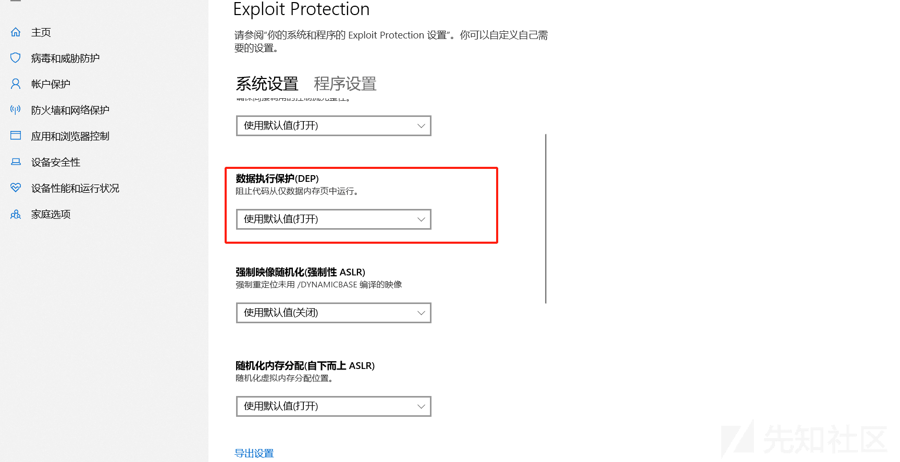](https://xzfile.aliyuncs.com/media/upload/picture/20240126094951-31e8367a-bbed-1.png)  
我们也可以在 Process Hacker 中查看：

[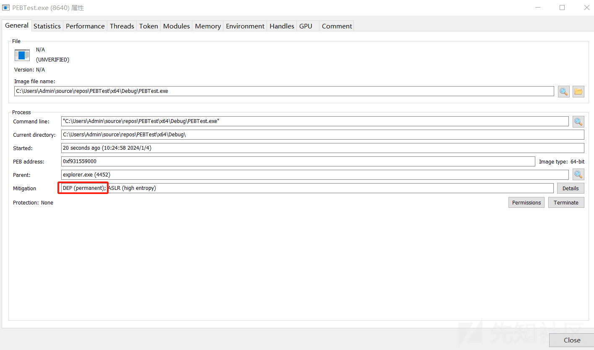](https://xzfile.aliyuncs.com/media/upload/picture/20240126094956-34f03e08-bbed-1.png)

## ASLR

ASLR 随机排列关键数据区域的位置，例如可执行文件的基址以及进程地址空间中堆栈、堆和库的位置。这种随机化使攻击者更难预测内存布局，从而降低了成功利用内存相关漏洞的可能性。

也可以在安全中心找到：

[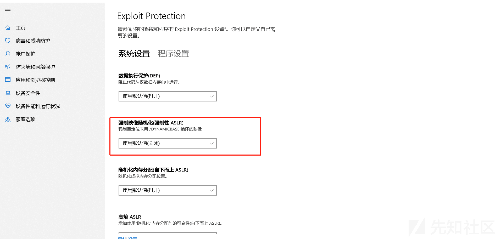](https://xzfile.aliyuncs.com/media/upload/picture/20240126095002-383f0b66-bbed-1.png)  
同样也可以在 Process Hacker 中看到： 
[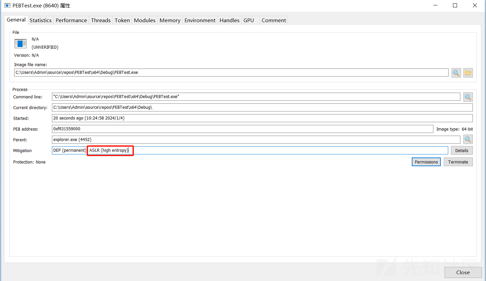](https://xzfile.aliyuncs.com/media/upload/picture/20240126095007-3b3b1968-bbed-1.png)

## PROCESS\_MITIGATION\_BINARY\_SIGNATURE\_POLICY 结构

接下来来看一下这个结构：

```plain
struct _PROCESS_MITIGATION_BINARY_SIGNATURE_POLICY {
  union {
    DWORD Flags;
    struct {
      DWORD MicrosoftSignedOnly : 1;
      DWORD StoreSignedOnly : 1;
      DWORD MitigationOptIn : 1;
      DWORD AuditMicrosoftSignedOnly : 1;
      DWORD AuditStoreSignedOnly : 1;
      DWORD ReservedFlags : 27;
    } DUMMYSTRUCTNAME;
```

这个结构包含用于加载映像的进程缓解策略设置，具体取决于映像的签名。

### MicrosoftSignedOnly

设置 (0x1) 以防止进程加载未由 Microsoft 签名的图像;否则保留未设置 (0x0) 。

### StoreSignedOnly

设置 (0x1) 以防止进程加载未由 Windows 应用商店签名的图像;否则保留未设置 (0x0) 。

### MitigationOptIn

设置 (0x1) 以防止进程加载未由 Microsoft、Windows 应用商店和 Windows 硬件质量实验室 (WHQL) 签名的图像;否则保留未设置 (0x0) 。

## 测试

所以我们可以通过 3 种方式来进行禁止 EDR 给我们的进程注入 DLL，除非它是微软签名的 DLL。

如下代码开启：

```plain
#include <iostream>
#include <Windows.h>
int main()
{
    PROCESS_MITIGATION_BINARY_SIGNATURE_POLICY ply = { 0 };
    ply.StoreSignedOnly = false;
    ply.MicrosoftSignedOnly = true;

    if (SetProcessMitigationPolicy(ProcessSignaturePolicy, &ply, sizeof(ply))) {
            printf("设置成功");
    }
    else {
         printf("设置失败");
    }
    getchar();
}
```

这里我们使用 Process Hacker 来观察一下：

我们会发现它多了一项。

[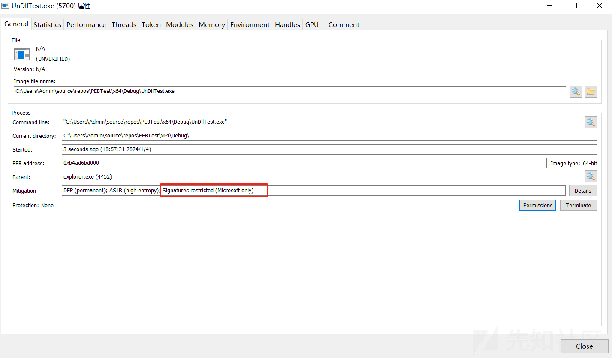](https://xzfile.aliyuncs.com/media/upload/picture/20240126095045-52682edc-bbed-1.png)  
我们打开详细来看一下：

这里表示已为此进程启用图像签名限制。只允许使用 Microsoft 签名。

[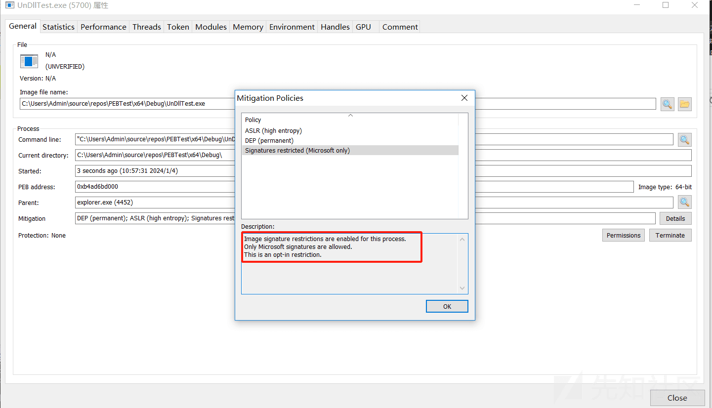](https://xzfile.aliyuncs.com/media/upload/picture/20240126095051-55893aac-bbed-1.png)  
我们使用 Avast Free Antivirus 来测试一下：

Avast Free Antivirus 会为你启动的应用程序注入一个 aswhook.dll 来监视你应用程序的一些行为。

但是我们会发现似乎没有起到什么作用。

[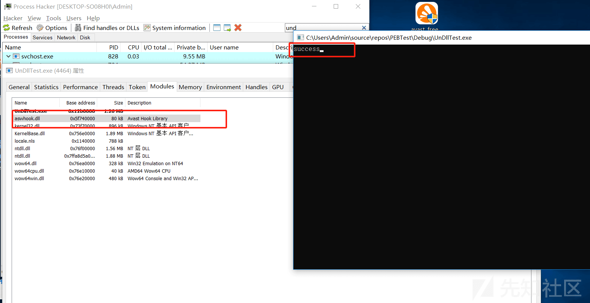](https://xzfile.aliyuncs.com/media/upload/picture/20240126095058-5a0cf0fa-bbed-1.png)  
这是什么原因造成的呢？

我们会发现应用程序是已经启动之后才设置得签名限制，这样的话并不能阻止 EDR 给我们的程序去注入监控 DLL。

我们可以给他启动一个子进程，就比如说我们通过这个程序去拉一个子进程，而这个子进程才是我们真正的 loader，或者恶意二进制程序，我们在启动的时候使用策略限制对其进行初始化，那么 EDR 就不会对其进行挂钩。

除非他有微软签名。

创建子进程如下 API 函数： 
CreateProcessA

```plain
BOOL CreateProcessA(
  [in, optional]      LPCSTR                lpApplicationName,
  [in, out, optional] LPSTR                 lpCommandLine,
  [in, optional]      LPSECURITY_ATTRIBUTES lpProcessAttributes,
  [in, optional]      LPSECURITY_ATTRIBUTES lpThreadAttributes,
  [in]                BOOL                  bInheritHandles,
  [in]                DWORD                 dwCreationFlags,
  [in, optional]      LPVOID                lpEnvironment,
  [in, optional]      LPCSTR                lpCurrentDirectory,
  [in]                LPSTARTUPINFOA        lpStartupInfo,
  [out]               LPPROCESS_INFORMATION lpProcessInformation
);
```

lpApplicationName 参数表示执行的模块的名称，这里我们给他设置为 NULL 就可以了。

lpCommandLine 参数表示你要执行的命令行，这里我们设置为你要执行的子进程的名称就可以了。

lpProcessAttributes 参数设置为 NULL，表示新的进程不会继承进程的句柄。

lpThreadAttributes 参数表示新进程的主线程不会继承调用进程主线程的句柄。这里设置为 NULL。

bInheritHandles 参数表示新进程是否将从调用进程继承句柄，这里设置为 TRUE。

dwCreationFlags 参数表示指定控制进程创建的附加标志`EXTENDED_STARTUPINFO_PRESENT`是一个标志，指示扩展结构的存在`STARTUPINFO`，它允许对新进程的创建进行更多控制。

lpEnvironment 参数表示允许您为新进程指定环境块，这里设置为 NULL。

lpCurrentDirectory 参数表示新进程的当前工作目录。将其设置为`NULL`表示新进程将以与调用进程相同的当前目录启动。这很重要，因为我们想要执行相同的可执行文件来启动我们的子进程。

lpStartupInfo 参数指向一个 STARTUPINFO 结构的指针。

lpProcessInformation 此参数是一个指向结构的指针`PROCESS_INFORMATION`该结构接收有关新进程的标识信息，例如其进程句柄和线程句柄。

如下代码会创建一个 sss.exe 的子进程，这里其实可以换成我们的 loader。

参考：[https://www.ired.team/offensive-security/defense-evasion/preventing-3rd-party-dlls-from-injecting-into-your-processes](https://www.ired.team/offensive-security/defense-evasion/preventing-3rd-party-dlls-from-injecting-into-your-processes)

```plain
void CreateChildProcessWithMitigationOption() {
    PROCESS_INFORMATION pi = {};
    STARTUPINFOEXA si = {};
    SIZE_T attributeSize = 0;
    InitializeProcThreadAttributeList(NULL, 1, 0, &attributeSize);
    PPROC_THREAD_ATTRIBUTE_LIST attributes = (PPROC_THREAD_ATTRIBUTE_LIST)HeapAlloc(GetProcessHeap(), HEAP_ZERO_MEMORY, attributeSize);
    InitializeProcThreadAttributeList(attributes, 1, 0, &attributeSize);
    DWORD64 policy = PROCESS_CREATION_MITIGATION_POLICY_BLOCK_NON_MICROSOFT_BINARIES_ALWAYS_ON;

    UpdateProcThreadAttribute(attributes, 0, PROC_THREAD_ATTRIBUTE_MITIGATION_POLICY, &policy, sizeof(DWORD64), NULL, NULL);
    si.lpAttributeList = attributes;

    CreateProcessA(NULL, (LPSTR)"sss.exe", NULL, NULL, TRUE, EXTENDED_STARTUPINFO_PRESENT, NULL, NULL, &si.StartupInfo, &pi);
    HeapFree(GetProcessHeap(), HEAP_ZERO_MEMORY, attributes);

    return;
}
```

然后在我们设置禁止微软以外的 DLL 注入我们的进程之前，创建初始化子进程。

```plain
void LocalProcessMitigationOption() {
    PROCESS_MITIGATION_BINARY_SIGNATURE_POLICY poy = { 0 };
    GetProcessMitigationPolicy(GetCurrentProcess(), ProcessSignaturePolicy, &poy, sizeof(poy));
    poy.MicrosoftSignedOnly = true;
    CreateChildProcessWithMitigationOption();
    SetProcessMitigationPolicy(ProcessSignaturePolicy, &poy, sizeof(poy));
}
```

看一下效果：

[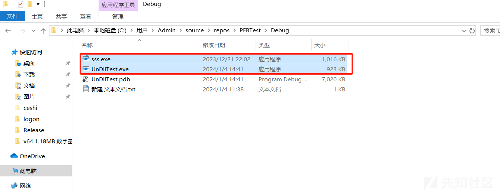](https://xzfile.aliyuncs.com/media/upload/picture/20240126095144-756aa27a-bbed-1.png)

[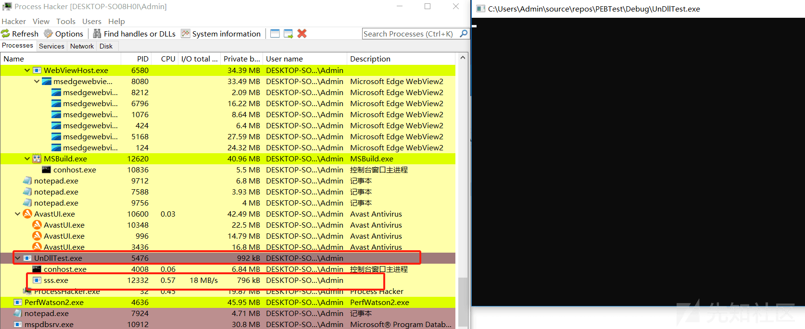](https://xzfile.aliyuncs.com/media/upload/picture/20240126095147-772844e6-bbed-1.png)  
如下图可以看到子进程和父进程都成功设置了 Mircrosoft only，我们来看下 aswhook.dll 有没有注入进去。

[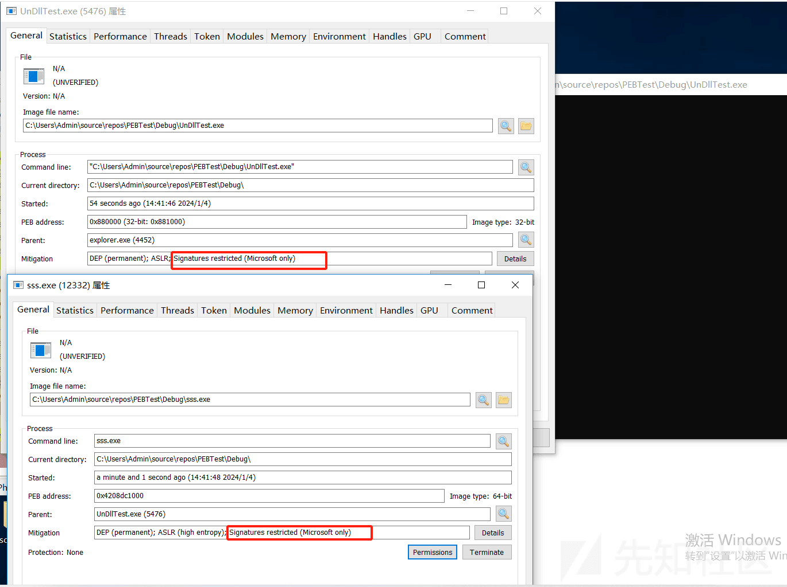](https://xzfile.aliyuncs.com/media/upload/picture/20240126095153-7a9533d2-bbed-1.png)  
首先查看父进程会发现 aswhook.dll 依旧注入进去了。但是我们会发现它的子进程并没有被注入 aswhook.dll

[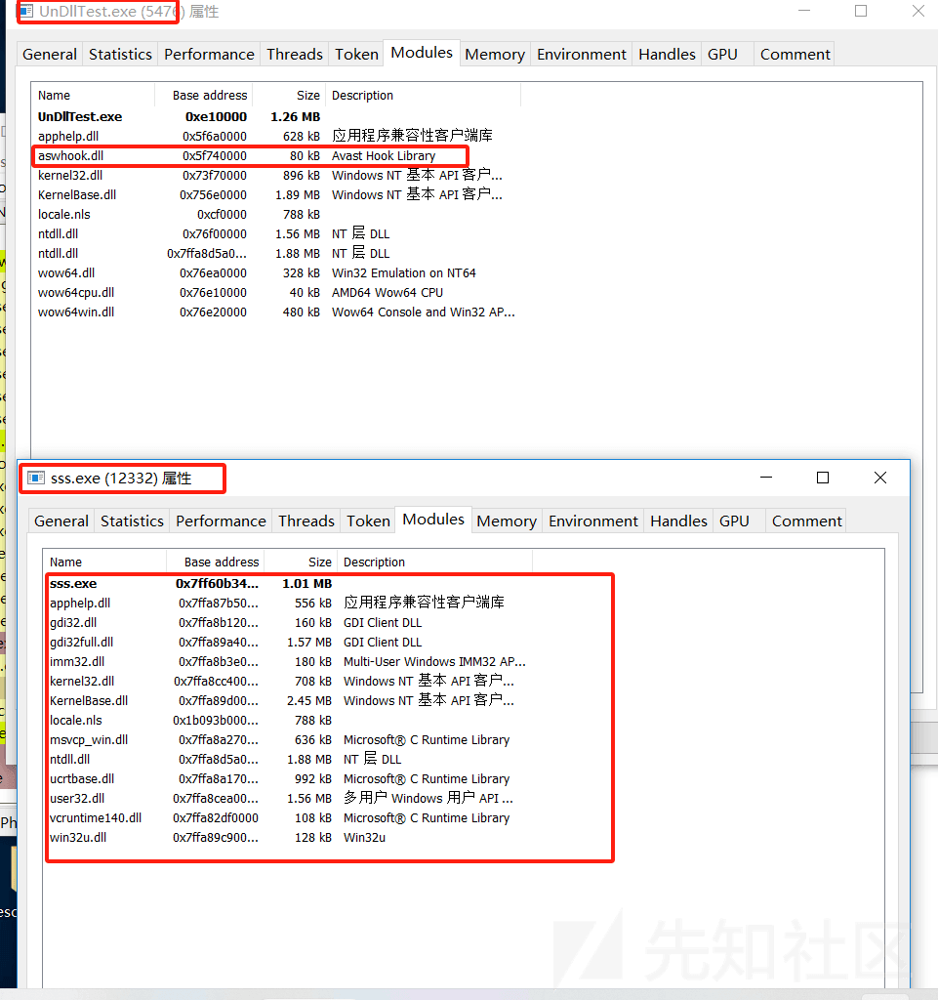](https://xzfile.aliyuncs.com/media/upload/picture/20240126095201-7f4340ae-bbed-1.png)
