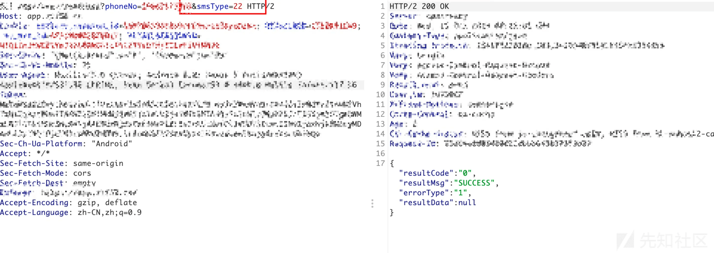
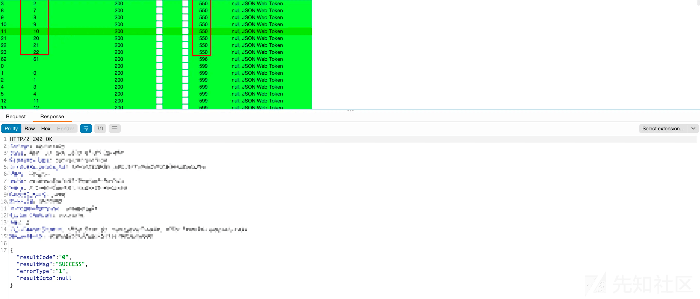
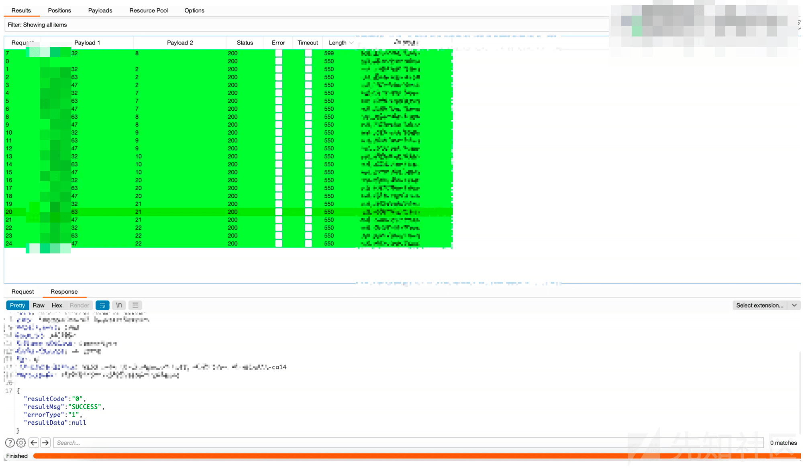
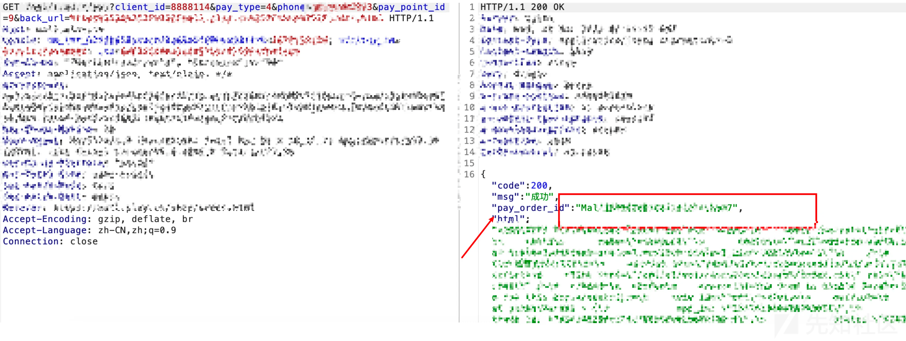
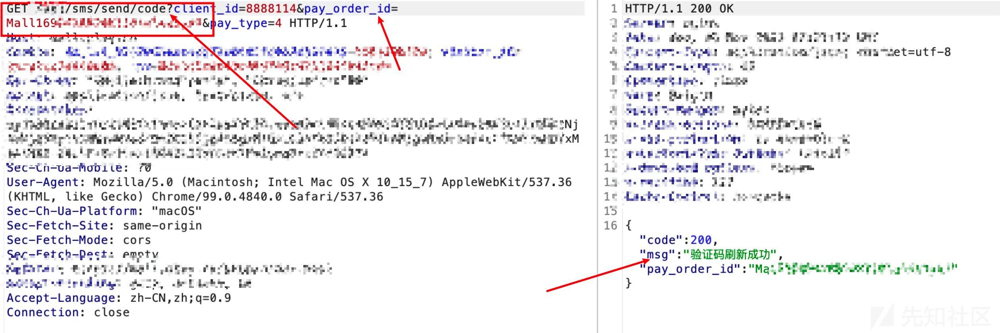

# "另类"短信轰炸绕过两则 - 先知社区

"另类"短信轰炸绕过两则

- - -

## 前言

短信轰炸漏洞是渗透测试中常见的一类漏洞，也是大家在 SRC 挖掘过程中常测试的点，网上常规的短信轰炸挖掘技巧也有很多，绕过方式也花样百出，在这里与大家分享一下我在实际渗透中的两例绕过思路。

## 案例 1

在某次项目上发现了一个通过手机验证码进行密码找回的功能点。

数据包如下

正常对一个手机号进行短信轰炸，会提示我们 90s 内不允许对一个手机号进行重复发送。所以，我在这里通过添加+、空格、\\n、逗号进行绕过，最终没有绕过成功。

但是，我这里注意到了一个参数 smsType，字面直翻的意思就是短信类型。这里我猜想短信类型无非分为以下两类：

功能点：登陆、修改密码、修改手机号、商品下单等等，即一个系统会有很多功能点具备发送短信的功能。

客户端：一个业务系统会有 web、app、小程序等不同的客户端。

因此，思路就很清楚了 smsType 参数的值是一个 int 类型，每个值对应不同功能点的短信发送功能，对 smsType 值进行遍历。

返回包为 550 的均为短信验证码发送成功的。

注意观察一下短信的内容，再次证实了是不同功能点发送的短信，在做渗透之前，笔者也发现了多个功能点存在发送验证码的功能，例如：商品下单、登陆、修改密码、修改手机号等等。并且在做信息收集的时候，发现同一个业务系统存在一个 web 站点、一个 app，一个小程序，甚至还存在一个 app.test.com 的域名。

因为只是遍历出不到 10 个类型，所以这里并不能针对单个手机号进行轰炸，这里可以添加多个手机号进行横向轰炸。

## 案例 2

在某次项目中遇到了下单支付发送验证码的功能点，具体流程为用户下单 - 发送验证码，而请求包的流程为

1、用户下单，生成订单 id。

2、根据订单 id 发送验证码。

一开始我对第二个数据包进行重复，发现一个订单只能发送 5 次验证码。但是，我在重放第一个数据包的时候发现每次都会生成一个不同订单 id。那么，我们先生成 10 个订单 id，每个 id 可以发送 5 次验证码，10 次就是 50 次，此时就造成了短信轰炸。

## 小结

我们平时在做测试的时候，遇到短信验证码的功能点更多的侧重点在于处理手机号本身，例如手机号添加空格、+、逗号、\\n、\\r等等，甚至并发操作等。其实，我们也可以把关注点着重放在网站自身的业务逻辑上，多分析网站的功能点，这样更容易出货！
