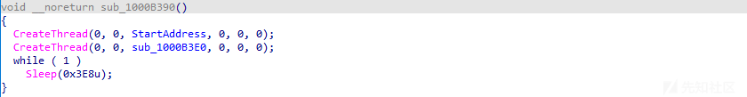

# 后门分析---点击此处安装语言包.exe - 先知社区

后门分析---点击此处安装语言包.exe

- - -

# 前言概述

笔者在日常使用一些社交软件的时候，总是会遇到在一些群里发一些安装语言包之类的程序，又想骗我安装后门。

提醒大家，不管是群里发的各种破解软件、安装程序、安全工具，还是从 GitHub 等开源网站上，下载的各种安全工具、POC 等，只要是非正式官方上的各种安装程序，大家在下载安装使用的时候，都不要随意点击安装，可能一不小心，就被安装上了后门，但如果遇到了供应链攻击，就算是从官方渠道下载的软件可能都隐藏后门了，安全攻击，无处不在，防不甚防，哈哈哈哈，今天笔者给大家分享一下这些安装语言包背后隐藏的后门程序。

# 攻击流程

黑客组织攻击流程图，如下所示：  

# 详细分析

1.样本从远程服务器上下载加密的压缩数据包，如下所示：  
  
2.加密的压缩包下载到临时目录下，如下所示：  
  
3.读取加密的压缩包文件，然后通过硬编码的密钥信息解密压缩包数据，如下所示：  
  
4.将加密的压缩包数据逐字节读取到内存中，然后解密，如下所示：  
  
5.然后将解密的数据写入到另外一个压缩包文件当中，如下所示：  
  
6.解密过程，如下所示：  
  
7.将解密的压缩包，解压缩释放到公共目录下，如下所示：  
  
8.最后调用该目录下的主程序 tapisrv.exe，通过白 + 黑的方式加载同目录下的恶意模块 IvsDrawer.dll，如下所示：  
  
9.IvsDrawer.dll 导出函数调用目录下的 D3D.dll 的导出函数，如下所示：  
  
10.DRAW\_Startup 和 DRAW\_InputTrackData 导出函数会执行相关的恶意操作，如下所示：  
  
11.读取目录下的 donottrace.txt 加密数据文件，如下所示：  
  
12.将加密的数据读取到分配的内存当中，如下所示：  
  
13.调用解密函数解密该内存数据，如下所示：  
  
14.解密后的数据，如下所示：  
  
15.该模块的导出函数，如下所示：  
  
16.读取同目录下的 task.dat 文件内容，然后安装计划任务自启动项，如下所示：  
  
17.然后利用程序中的硬编码密钥，解密程序中的相关数据，如下所示：  
  
18.解密之后，如下所示：  
  
19.解密出来的 PayLoad 是一个 Gh0st 修改版，如下所示：  
  
创建两个线程，如下所示：  
  
20.一个线程，通过读取远程 pastebin.com 服务器的数据，如下所示：  
  
21.远程 pastebin.com 服务器的数据，如下所示：  
  
22.或者通过解密自身硬编码的数据，解密出远服务器的 C2：hero.gettimi.top，如下所示：  
  
23.与远程 C2 服务器进行通信，如下所示：  
  
24.另外一个通过解密自身硬编码的数据，解密出远服务器的 C2：news.cookielive.top，如下所示：  
  
25.硬编码数据的解密函数，如下所示：  

# 关联分析

通过下载链接中 link.jscdn.cn 域名，可以关联到一堆相关的样本，如下所示：  
  
查询解密出来的域名 hero.gettimi.top，关联到另外一个样本，如下所示：  
  
关联样本下载解压缩之后，如下所示：  
  
加载的恶意模块 pbvm90.dll 的代码与上面的 IvsDrawer.dll 模块代码基本一致，使用的 hash 不一样，如下所示：  
  
该样本从远程服务器上下载加密的压缩包数据，从下载的链接可以发现，最新的样本使用了与此前样本不同的远程服务器，说明黑客组织一直在更新自己的攻击样本，如下所示：  
  
查询解密出来的域名 news.cookielive.top，同样关联到一个样本，如下所示：  
  
关联的样本解压缩之后，如下所示：  
  
加载的恶意模块 AndroidAssistHelper.dll 的代码与上面的 IvsDrawer.dll 模块代码基本一致，如下所示：  
  
使用的 hash 也是一样的，如下所示：  
  
通过上面的关联分析，可以发现黑客组织一直在更新自己的攻击样本，使用不同的下载服务器以及不同的软件加载方式等，同时通过域名关联，可以发现该攻击活动非常频繁，不仅仅使用语言安装包的方式，还使用了其他各种工具软件等进行传播。

# 威胁情报

# 检测规则

# 结尾

黑客组织利用各种恶意软件进行的各种攻击活动已经无处不在，防不胜防，很多系统可能已经被感染了各种恶意软件，全球各地每天都在发生各种恶意软件攻击活动，这些攻击活动主要包含：勒索攻击、APT 窃密攻击等，笔者最近几年专注于针对勒索病毒黑客组织、APT 定向攻击黑客组织、以及各种黑灰产黑客组织进行跟踪分析和研究，发现这些组织一直在持续更新自己的攻击样本以及攻击技术，不断有企业被攻击，这些黑客组织从来没有停止过攻击活动，而且非常活跃，持续不断地更新攻击样本，采用新的攻击技术。

未来黑客会研究和采用更高级的攻击手法，使用更高级的攻击样本和攻击技术，会开发更为复杂的恶意软件，会使用更隐藏的免杀植入方式，会挖掘更多新的安全漏洞，安全对抗没有终点，如果想在安全行业走的更远，就踏踏实实不断提升自己的能力，黑客组织也在不断进步，安全从业人员更需要持续不断的学习进步，才能抵御未来各种网络安全攻击，而且未来高端的安全对抗会越来越激烈，安全厂商和安全研究人员需要持续不断的提升自己的安全能力。
