# 吾爱破解论坛 2024 春节解题领红包之 Android 题 - 先知社区

吾爱破解论坛 2024 春节解题领红包之 Android 题

- - -

[题目来源](https://www.52pojie.cn/thread-1889163-1-1.html "题目来源")

## Android 初级题一

出题老师：正己

题目简介：小明和李华是同学，最近小明发现李华技术进步很快，他太想进步了，于是他一直在观察李华，却发现他老是在玩圈小猫，直到一次偶然发现，小明惊呼:“WC，原。。。

### 分析 apk

-   首先根据论坛提示，下载相应题目的 apk。
-   将下载的 apk 拖入手机，使用 MT 管理器查看一些基本情况。主要是看看有没有加固。根据提示，apk 并没有什么加固，而且也可以知道 app 包名签名等信息。  
    [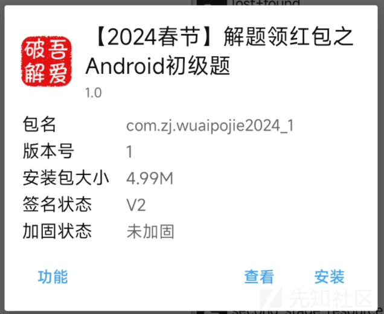](https://xzfile.aliyuncs.com/media/upload/picture/20240223094904-b9be3cfa-d1ed-1.png)
    
-   安装 apk，看看基本的操作逻辑是什么。简单玩了两把，大概的逻辑就是你要围堵小猫跑到边界，而小猫可以往四周没有被标记的圆圈活动而且优先向大致一个外围方向移动。目的应该是围堵小猫四周的圆圈，然后给出 flag。  
    [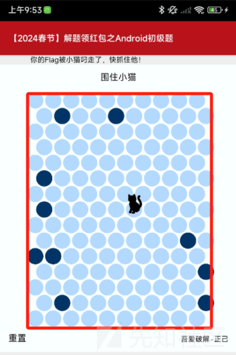](https://xzfile.aliyuncs.com/media/upload/picture/20240223095418-74d01bb2-d1ee-1.png)  
    \### 解题  
    \#### 方法一
    
-   能不能直接将 apk 拖入 Jadx，查看源码，看 flag 是否是静态存储在本地。因为发现手机上安装 apk 后并没有网络权限。
-   apk 源码比较简单，有下图中的几部分。从 MainActivity 可以看出，主界面是 HTML 的。  
    [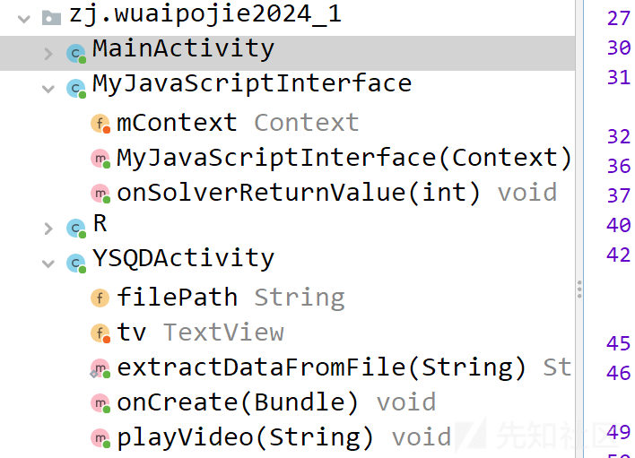](https://xzfile.aliyuncs.com/media/upload/picture/20240223100354-cbdd83ee-d1ef-1.png)
    
-   由于代码量不大，所以就简单分析有没有和 flag 相关的内容，找到下面这个函数。查看该函数的调用，发现就下面一段代码调用这个 extractDataFromFile 函数。  
    [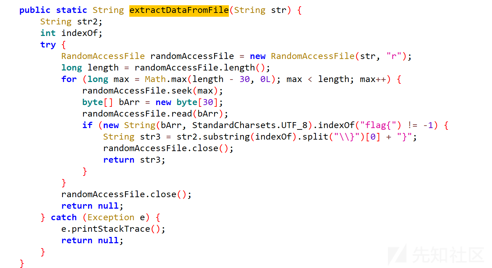](https://xzfile.aliyuncs.com/media/upload/picture/20240223100916-8bcc2ef8-d1f0-1.png)
    

```plain
videoView.setOnCompletionListener(new MediaPlayer.OnCompletionListener() { // from class: com.zj.wuaipojie2024_1.YSQDActivity.2
            @Override // android.media.MediaPlayer.OnCompletionListener
            public void onCompletion(MediaPlayer mediaPlayer) {
                YSQDActivity.this.tv.setText(YSQDActivity.extractDataFromFile(YSQDActivity.this.filePath));
            }
        });
        videoView.start();}
```

-   上面这个代码是在视频播放完成时，调用 extractDataFromFile() 方法从指定文件中提取数据，并将提取到的数据显示在 TextView 中。而这个入参 file 是一段 MP4 视频，这里首先想到的是根据 apk 数据存储位置找到该 MP4，然后查看文件信息。
-   首先根据 MT 管理器给出的信息找到 apk 数据存储位置，然后找到该视频，简单播放一下，原来是原神启动！然后使用 MT 管理器的打开方式，选择编辑文本，看 mp4 原始数据。  
    [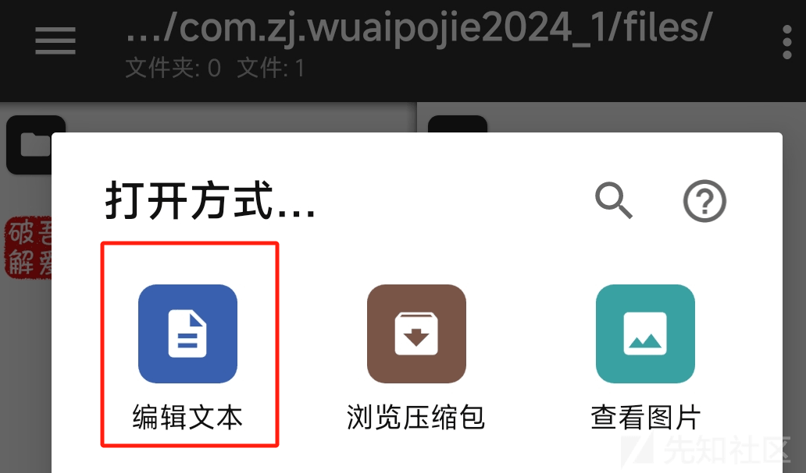](https://xzfile.aliyuncs.com/media/upload/picture/20240223103134-a9af45a6-d1f3-1.png)
    
-   由 extractDataFromFile() 函数可以看出，找符合 flag{}格式的字符串，那我们也通过 MT 的文本搜索找一下 flag。果然就直接找到了 flag。  
    [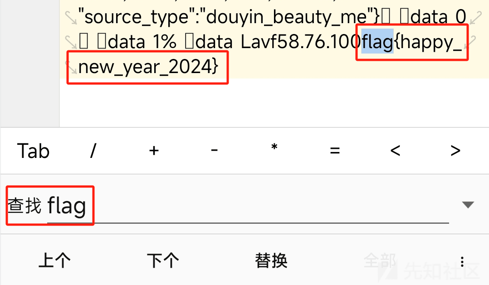](https://xzfile.aliyuncs.com/media/upload/picture/20240223103334-f117fae6-d1f3-1.png)
    
-   提交上面得出的 flag，发现是正确的。  
    [](https://xzfile.aliyuncs.com/media/upload/picture/20240223102645-fd03203e-d1f2-1.png)
    

#### 方法二

-   根据之前的分析，YSQDActivity 类只在下面的接口类中有调用，想着能不能不围堵猫就可以调用 YSQDActivity 类，从而播放视频获取 flag。作为用作 Android 应用程序中的 JavaScript 接口，应该是和 webview 中的 HTML 有关。  
    [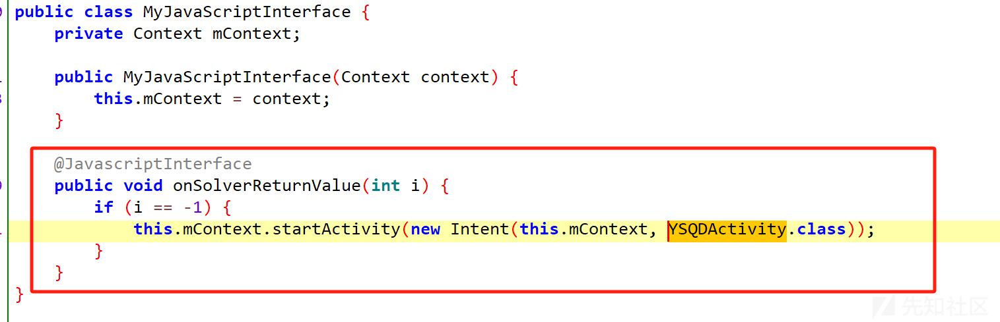](https://xzfile.aliyuncs.com/media/upload/picture/20240223103907-b7326982-d1f4-1.png)
    
-   首先想到是上图函数中关于入参 i 的判断条件，这里是==-1，那就改成！=-1，看能不能调用 YSQDActivity 类。怎么找到这个 smali 代码，之前的文章有，这里就不再赘述了，反正 MT 管理器和 NP 管理器很好用！  
    [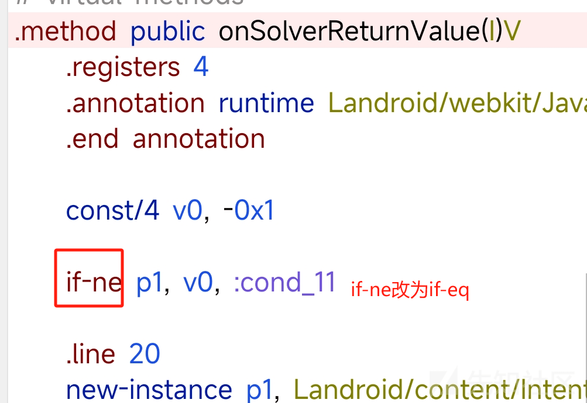](https://xzfile.aliyuncs.com/media/upload/picture/20240223105401-cc3687c6-d1f6-1.png)
    
-   修改 smali 代码后就是保存编译签名安装测试这一流程。发现这样改不起作用，因为改成 if-eq p1,v0，相当于是 p1 等于 -1 的时候会 return，那删除 if 判断呢。经过测试也不可以，这里先暂时放下这一思路。
    

#### 方法三

-   由于 webview 加载的 HTML 也是存储在本地的，能不能修改 HTML 文件使其初始化黑点的时候足够多这就可以围堵住小猫。
-   this.webView.loadUrl("file:///android\_asset/index.html");根据这一代码找出 index.html，先不管 js 中如果初始化黑点的，先修改下面的 initialWallCount，先修改为 80 试试。  
    [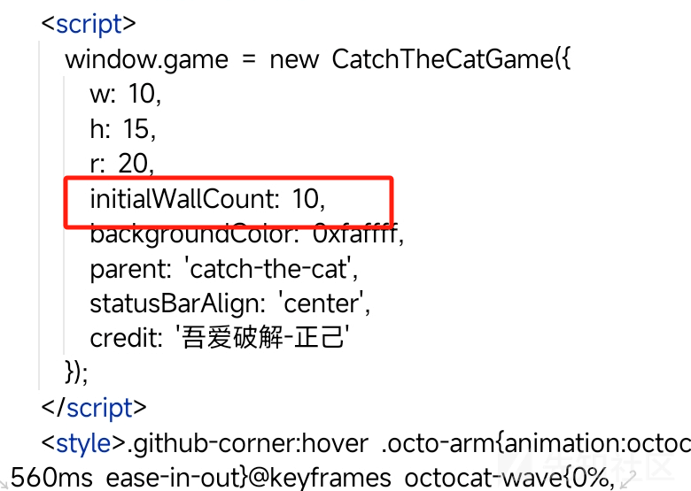](https://xzfile.aliyuncs.com/media/upload/picture/20240223110431-43ab9f84-d1f8-1.png)
    
-   从下图效果图可以看出这一思路可行，这样就比较顺利的围堵住小猫。围堵成功后，开始播放视频并顺利出现 flag。  
    [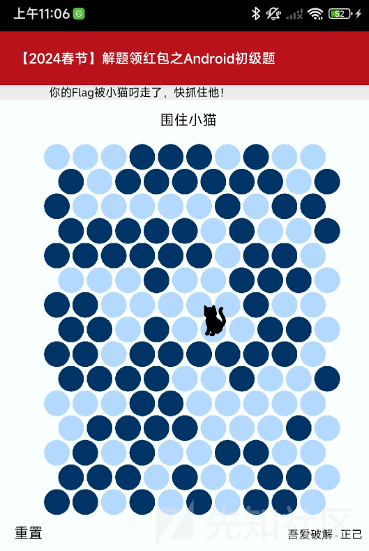](https://xzfile.aliyuncs.com/media/upload/picture/20240223110759-c007afa0-d1f8-1.png)
    

[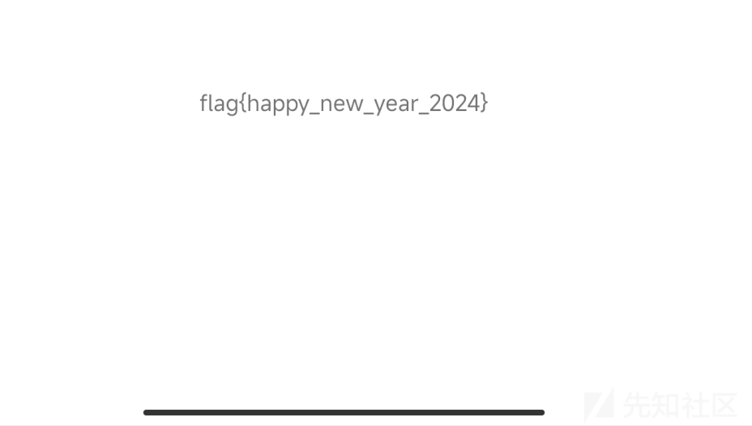](https://xzfile.aliyuncs.com/media/upload/picture/20240223110814-c88cb3aa-d1f8-1.png)

## Android 初级题二

出题老师：侃遍天下无二人

寄语：如果不会解题还想拿分那赶紧来现学现卖吧，只要认真看完并动手练习，肯定能解出来本题，吾爱破解安卓逆向入门教程《安卓逆向这档事》。

### 分析

-   首先根据论坛提示，下载相应题目的 apk。
-   将下载的 apk 拖入手机，使用 MT 管理器查看一些基本情况。主要是看看有没有加固。根据提示，apk 并没有什么加固，而且也可以知道 app 包名签名等信息。  
    [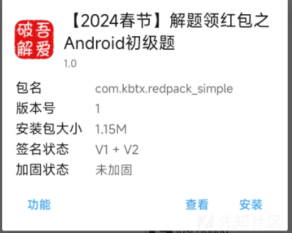](https://xzfile.aliyuncs.com/media/upload/picture/20240223111212-56e36c02-d1f9-1.png)
    
-   安装 apk，查看基本逻辑。大概就是多长时间出一个什么宝石，然后 10 个可以抽 10 抽，90 抽保底出个金。而且这个等待时间越来越长。  
    [](https://xzfile.aliyuncs.com/media/upload/picture/20240223111816-2f935d46-d1fa-1.png)
    

### 解题

-   拖入 Jadx 查看代码逻辑。
-   就在我查看源码的时候，发现又凑够了 10 抽，就抽了一下，发现抽中了，试一下下面给出的 flag。而且给出的 flag 是正确的。根据提示是我太诚实了吗，就单纯的等抽奖然后抽？  
    [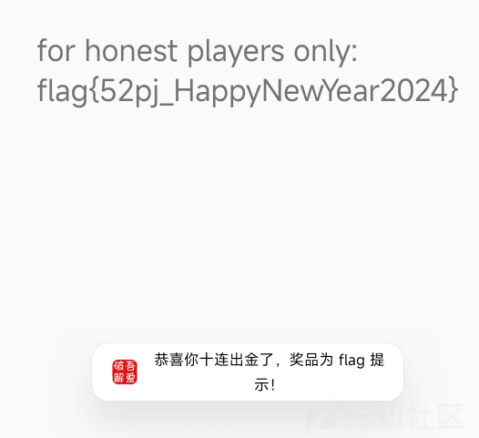](https://xzfile.aliyuncs.com/media/upload/picture/20240223112235-c9bfbd6a-d1fa-1.png)

[](https://xzfile.aliyuncs.com/media/upload/picture/20240223112315-e19d7bfc-d1fa-1.png)

-   查看具体的代码，从下面可以看出，果然是不对 apk 做什么修改的才会进入到 honest 选项，然后会比较顺利的出金。  
    [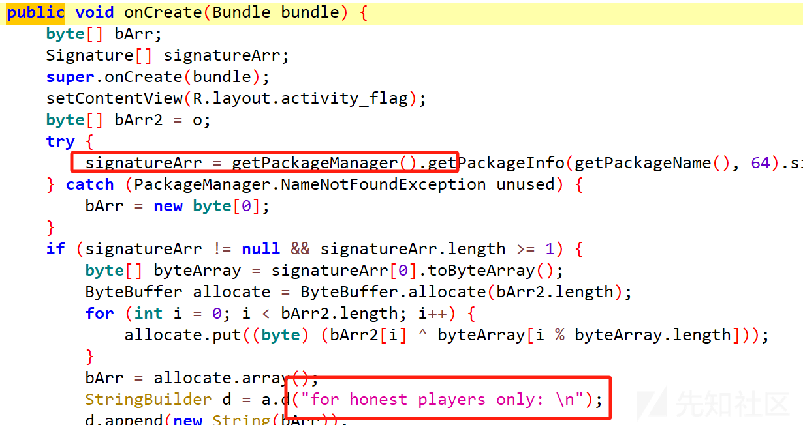](https://xzfile.aliyuncs.com/media/upload/picture/20240223112811-923f3be4-d1fb-1.png)
    
-   下面赋值到 textview 的代码如下图所示，可以看出字符串也是静态存储在代码中的，public static byte\[\] o = {86, -18, 98, 103, 75, -73, 51, -104, 104, 94, 73, 81, 125, 118, 112, 100, -29, 63, -33, -110, 108, 115, 51, 59, 55, 52, 77};数组 o 就是存储 flag 字符串的 ASCII 码。转换成 str 就是 flag。  
    [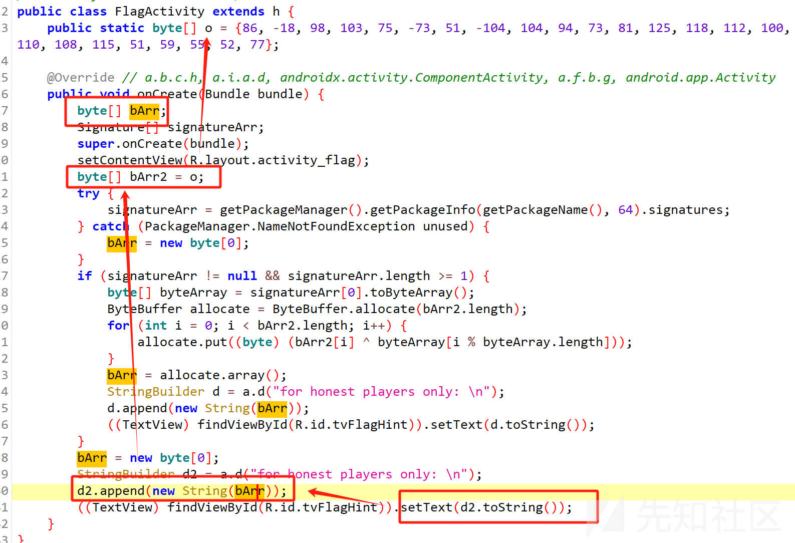](https://xzfile.aliyuncs.com/media/upload/picture/20240223113642-c310534c-d1fc-1.png)
    
-   第二个初级题要比第一个简单。  
    \#### 方法二
    
-   直接修改初试的什么宝石数量，直接修改 WishActivity 的 o 数组中 10.  
    [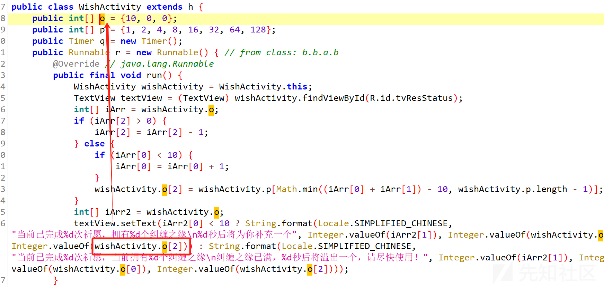](https://xzfile.aliyuncs.com/media/upload/picture/20240223114025-478baf18-d1fd-1.png)
    
-   这里初试是 0xa，也就是十六进制中的 10，在后面多加几个 a。  
    [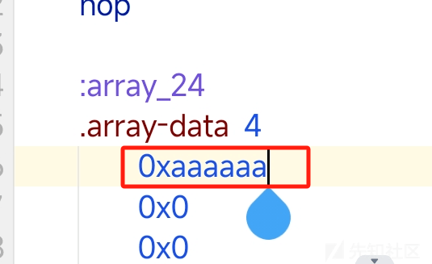](https://xzfile.aliyuncs.com/media/upload/picture/20240223114200-803a8762-d1fd-1.png)
    
-   从下图可以看出有很多纠缠之缘，那就抽吧。发现这样抽中是不对的 flag。返回代码中查看。  
    [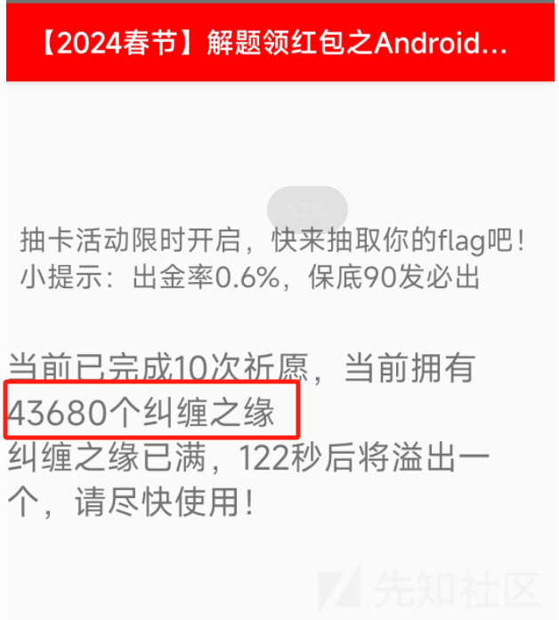](https://xzfile.aliyuncs.com/media/upload/picture/20240223114412-cf402272-d1fd-1.png)
    
-   真正的 flag 是需要 signature 中的一部分数据的，当你修改 apk 之后这部分数据就是错误的了，所以不对。目前想到可以做的就是分析代码，然后等一小会再抽十次就可以获取 flag。  
    [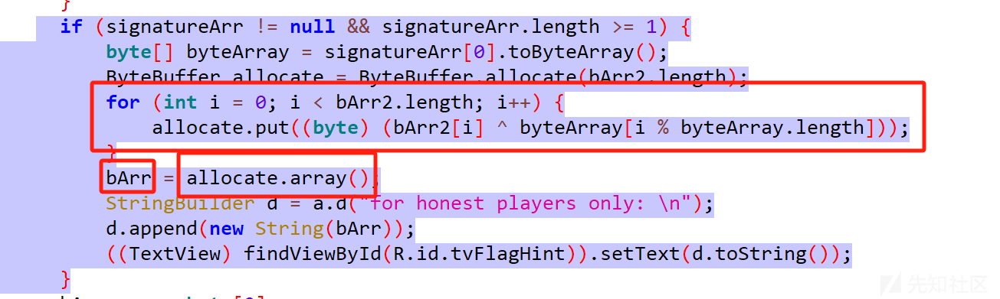](https://xzfile.aliyuncs.com/media/upload/picture/20240223115347-25c3be00-d1ff-1.png)
