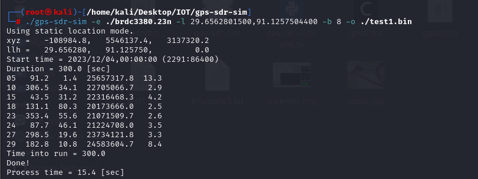
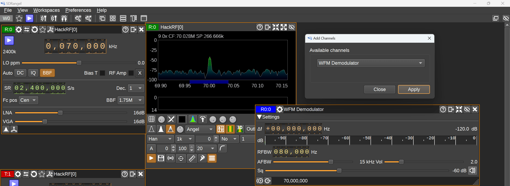

# 固件 IOT 之 Hackrf-One - 先知社区

固件 IOT 之 Hackrf-One

- - -

## 环境配置

软件工具  
1)multi-sdr-gps-sim

> [multi-sdr-gps-sim](https://github.com/Mictronics/multi-sdr-gps-sim)

2)gps-sdr-sim

> [https://github.com/osqzss/gps-sdr-sim](https://github.com/osqzss/gps-sdr-sim)

设备  
HackRF One  
[](https://cdn.nlark.com/yuque/0/2023/jpeg/29034274/1701918642155-5128c1c9-4b08-4da0-9742-01205f13e8b0.jpeg?x-oss-process=image/auto-orient,1#averageHue=%23a3a19b&clientId=ue98f4ace-ffa2-4&from=paste&height=2688&id=ud930c4f9&originHeight=4032&originWidth=3024&originalType=binary&ratio=1.5&rotation=0&showTitle=false&size=3530498&status=done&style=none&taskId=u7c8a436f-696c-4a11-a232-49216660b8a&title=&width=2016)

## 利用 gps-sdr-sim 工具进行 GPS 欺骗

首先要理解为什么能够达到 GPS 欺骗的效果就需要知道 GPS 的工作原理  
[](https://cdn.nlark.com/yuque/0/2023/png/29034274/1701746660804-efecb196-4c7b-4338-a690-a9af3c69ff41.png#averageHue=%23f9f9f9&clientId=u624264ca-a6a9-4&from=paste&height=596&id=u1cf6a163&originHeight=894&originWidth=1245&originalType=binary&ratio=1.5&rotation=0&showTitle=false&size=334536&status=done&style=none&taskId=u29685c6b-5d95-4d7f-9890-4bfd9b7de3b&title=&width=830)  
卫星定位是根据方程组求解的，通常利用四个卫星，按道理来说三维世界中三个方程组就可以求解出坐标，但因为其他环境因素的干扰我们的时间参数是被影响的因此也需要求解，故一般用四个方程组求解  
[](https://cdn.nlark.com/yuque/0/2023/png/29034274/1701747309165-c477914c-b183-4e39-a9be-1a6387d88f10.png#averageHue=%23f2f2f2&clientId=u624264ca-a6a9-4&from=paste&height=103&id=u205a61ba&originHeight=155&originWidth=495&originalType=binary&ratio=1.5&rotation=0&showTitle=false&size=18400&status=done&style=none&taskId=u4ac80bfa-3b14-469f-a56d-a9319e6422d&title=&width=330)

> [https://www.blackhat.com/docs/eu-15/materials/eu-15-Kang-Is-Your-Timespace-Safe-Time-And-Position-Spoofing-Opensourcely-wp.pdf](https://www.blackhat.com/docs/eu-15/materials/eu-15-Kang-Is-Your-Timespace-Safe-Time-And-Position-Spoofing-Opensourcely-wp.pdf)  
> [http://drops.xmd5.com/static/drops/tips-10580.html](http://drops.xmd5.com/static/drops/tips-10580.html)

那么，我们可以知道接收器是通过解出和卫星的方程式推算出其具体位置，那么如果我们能够获取某个时间的卫星星历即模拟当天的卫星情况，这里使用武汉大学的 IGS 数据中心可以直接导出  
[](https://cdn.nlark.com/yuque/0/2023/png/29034274/1701746853829-8eaf0d79-a7c7-48b0-b083-a2aabe95dc76.png#averageHue=%238d8f71&clientId=u624264ca-a6a9-4&from=paste&height=839&id=u643af730&originHeight=1258&originWidth=2324&originalType=binary&ratio=1.5&rotation=0&showTitle=false&size=1134032&status=done&style=none&taskId=udfe27950-8e91-4a23-9a59-934e45c3071&title=&width=1549.3333333333333)

> [http://www.igs.gnsswhu.cn/index.php/home/data\_product/igs.html](http://www.igs.gnsswhu.cn/index.php/home/data_product/igs.html)

那么我们此时下载好了数据，那么我们就需要来发送欺骗信号，利用 gps-sdr-sim 工具达到伪造目的  
我们下载的星历是模拟了当时卫星的轨迹和运动情况，我们工具来伪造自身的坐标

```plain
./gps-sdr-sim -e ./brdc3380.23n -l 29.6562801500,91.1257504400 -b 8 -o ./test1.bin
```

-   \-e 后边放刚刚下好的星历文件
-   \-l 要修改的 ip
-   \-b 的意思是采样精度是 8（不需要改）
-   \-o 生成 bin 文件的位置，这里要在路径的后边加上文件名

[](https://cdn.nlark.com/yuque/0/2023/png/29034274/1701747154429-6bb6b68b-9593-456b-bff0-f0b1c7bb59b7.png#averageHue=%232a2c36&clientId=u624264ca-a6a9-4&from=paste&height=203&id=u7af0ddc4&originHeight=304&originWidth=811&originalType=binary&ratio=1.5&rotation=0&showTitle=false&size=72005&status=done&style=none&taskId=u50fb8e4b-3845-4a68-b7aa-3063363465c&title=&width=540.6666666666666)  
此时伪造的内容已经准备好了，我们通过 hackrf 来发送欺骗信号

```plain
hackrf_transfer -t test1.bin -f 1575420000 -s 2600000 -a 1 -x 20 -R
```

\-t 文件名，从文件传输数据（刚刚生成的二进制文件）  
\-f 频率赫兹 1575420000 民用频段（一般不需要改）  
\-s 采样速率 2.6Msps（一般不需要改）  
\-a 放大器使能，接收/发射射频放大器 1 =使能，0 =禁用  
\-R 重复发射模式  
\-x 增益分贝，TX VGA(中频) 增益，0-47 分贝，1dB 步长  
[](https://cdn.nlark.com/yuque/0/2023/png/29034274/1701747165043-da9e18e4-048e-4630-a886-8494ec534169.png#averageHue=%232f313a&clientId=u624264ca-a6a9-4&from=paste&height=605&id=ue76dfa9f&originHeight=907&originWidth=803&originalType=binary&ratio=1.5&rotation=0&showTitle=false&size=225703&status=done&style=none&taskId=u815a1be7-2575-4bec-8341-3a71f34e274&title=&width=535.3333333333334)  
此时，拿出手机来打开有关定位的软件就会发现定位已经被干扰，按照上述步骤完成后应该在中国左上角。小米成功实现 GPS 欺骗。  
但在想模拟某个非星历时段的 GPS 信号是报错，显示错误的开始时间，必须是星历所包含的时间。因此考虑换一个软件尝试  
[](https://cdn.nlark.com/yuque/0/2023/png/29034274/1701920369106-e3bdf4bc-7d3b-4084-8415-1ff0e1020910.png#averageHue=%23282a34&clientId=u18b935a4-cc34-4&from=paste&height=447&id=u33d8e33e&originHeight=671&originWidth=1127&originalType=binary&ratio=1.5&rotation=0&showTitle=false&size=114230&status=done&style=none&taskId=u25550592-6cc4-40ff-9c0b-bbc2228c1eb&title=&width=751.3333333333334)  
参考

> [https://blog.csdn.net/qq\_51663706/article/details/121274801](https://blog.csdn.net/qq_51663706/article/details/121274801)

## 使用 multi-sdr-gps-sim 进行 GPS 欺骗

安装好工具后进行测试

> [https://github.com/Mictronics/multi-sdr-gps-sim](https://github.com/Mictronics/multi-sdr-gps-sim)

如下报错是虚拟机 hackrf 没有连接到虚拟机  
[](https://cdn.nlark.com/yuque/0/2023/png/29034274/1701917925039-fd5a1b02-997a-48dd-b148-e4a785f39486.png#averageHue=%23171421&clientId=ue98f4ace-ffa2-4&from=paste&height=315&id=fBP6c&originHeight=473&originWidth=716&originalType=binary&ratio=1.5&rotation=0&showTitle=false&size=29051&status=done&style=none&taskId=u4bf5dab3-1ccb-49e8-8fcb-cc7b4b7892d&title=&width=477.3333333333333)  
解决方法，选择 VM 中的虚拟机选择->可移动设备->选择 HackRF  
[](https://cdn.nlark.com/yuque/0/2023/png/29034274/1701918001475-b656fbe2-dfe1-49cf-bd66-396c7498d108.png#averageHue=%23f4f2f1&clientId=ue98f4ace-ffa2-4&from=paste&height=353&id=ub19aeace&originHeight=529&originWidth=1195&originalType=binary&ratio=1.5&rotation=0&showTitle=false&size=91270&status=done&style=none&taskId=u27e5c3a6-a8c1-4551-8e56-6b2b28f06ec&title=&width=796.6666666666666)

```plain
/gps-sim -e brdc3380.23n -l 29.6562801500,91.1257504400 -a -g 47 -r hackrf
```

下面的报错是提示没有历书文件

> 为什么我们有了广播星历，却还需要历书文件呢  
> 首先我们先了解什么是广播星历什么是历书，这里放一个我个人的理解，其他比较详细的理解在下方链接  
> 广播星历，非常详细的卫星轨道和位置信息，因此数据量大我们在模拟的时候需要耗费大量时间  
> 历书，是星历数据的简化集，数据较少，传播时间较短，精度较低，类似于检索表一样，提供了一个访问方便查询  
> [https://www.yiqisoft.cn/blog/7/gnss-gnss-gps-gps-22](https://www.yiqisoft.cn/blog/7/gnss-gnss-gps-gps-22)

[](https://cdn.nlark.com/yuque/0/2023/png/29034274/1701918052950-5b5fdca4-4161-4545-b6a5-de82d7a0b5c3.png#averageHue=%23181624&clientId=ue98f4ace-ffa2-4&from=paste&height=319&id=u8080e164&originHeight=479&originWidth=723&originalType=binary&ratio=1.5&rotation=0&showTitle=false&size=59173&status=done&style=none&taskId=u9d01b678-49ab-4c9a-8fdb-aa9940e8836&title=&width=482)  
解决方法，输入下述指令

```plain
wget https://celestrak.org/GPS/almanac/SEM/almanac.sem.txt

mv almanac.sem.txt almanac.sem
```

再次运行即可  
[](https://cdn.nlark.com/yuque/0/2023/png/29034274/1701761336003-d8c030b4-c0c1-439f-8a54-6debb95d1c90.png#averageHue=%23262431&clientId=u04a073ef-3e0b-4&from=paste&height=819&id=ubc44fa38&originHeight=1229&originWidth=1518&originalType=binary&ratio=1.5&rotation=0&showTitle=false&size=192550&status=done&style=none&taskId=u50047b65-8452-414a-9b26-d3a63607b0d&title=&width=1012)  
[](https://cdn.nlark.com/yuque/0/2023/jpeg/29034274/1701761398667-a8812766-ad6e-4ae3-b31f-6c2a800cc370.jpeg?x-oss-process=image/auto-orient,1#averageHue=%2377ac5e&clientId=u04a073ef-3e0b-4&from=paste&height=2688&id=u3ea200d2&originHeight=4032&originWidth=3024&originalType=binary&ratio=1.5&rotation=0&showTitle=false&size=2424160&status=done&style=none&taskId=u0c70a926-0cf0-46b6-b621-a6ae4e11fd5&title=&width=2016)  
加入-s now 参数即用现在的时间来模拟后无法解析出位置，目前还没有看到解决方法。

## 使用 SDRangel 实现无线收发

首先下载需要的软件 SDRangel，下载后默认安装即可

> [https://github.com/f4exb/sdrangel/releases/tag/v7.17.2](https://github.com/f4exb/sdrangel/releases/tag/v7.17.2)

[](https://cdn.nlark.com/yuque/0/2023/png/29034274/1701917151168-36172c7a-7bc4-4308-a988-b5cef46fc514.png#averageHue=%23fefdfd&clientId=ue98f4ace-ffa2-4&from=paste&height=865&id=u3897566a&originHeight=1298&originWidth=2273&originalType=binary&ratio=1.5&rotation=0&showTitle=false&size=253452&status=done&style=none&taskId=ud13a292c-7c44-4dcc-95df-c9371994d1a&title=&width=1515.3333333333333)

### 接收

进入软件界面后，点击箭头指向的功能点，其为接收标志，选择对应接收设备即我们接入的 hackrf  
[](https://cdn.nlark.com/yuque/0/2023/png/29034274/1701917202846-f989e578-3245-4c13-9401-b1e41b2129e3.png#averageHue=%232e2c29&clientId=ue98f4ace-ffa2-4&from=paste&height=547&id=u39dd74b1&originHeight=821&originWidth=1547&originalType=binary&ratio=1.5&rotation=0&showTitle=false&size=164557&status=done&style=none&taskId=u2a029d6e-95ca-4449-ba65-247127ebbd0&title=&width=1031.3333333333333)  
刚开始接收功能中只有上述两个界面，此时点击 R：0 中的播放是没有声音的。  
[](https://cdn.nlark.com/yuque/0/2023/png/29034274/1701917295072-a1c2ffa9-e6fb-4c3e-b620-05c49f6ffb2b.png#averageHue=%2331302e&clientId=ue98f4ace-ffa2-4&from=paste&height=565&id=uda2b55b9&originHeight=848&originWidth=2560&originalType=binary&ratio=1.5&rotation=0&showTitle=false&size=214378&status=done&style=none&taskId=uc3a2acb3-bd0b-43c5-bd52-0e59ba9f5f1&title=&width=1706.6666666666667)  
点击红色箭头的功能点进行添加 WFM Demodulator，此时点击 R：0 中的开始就可以接收你所设置的频道的广播了  
[](https://cdn.nlark.com/yuque/0/2023/png/29034274/1701917363418-5aa1ffd9-1657-4dbb-bcff-2d5dee7ffa77.png#averageHue=%233f3e3b&clientId=ue98f4ace-ffa2-4&from=paste&height=621&id=u53d99ebc&originHeight=932&originWidth=2560&originalType=binary&ratio=1.5&rotation=0&showTitle=false&size=283325&status=done&style=none&taskId=u7b526220-9529-48da-b329-9d0aa63e365&title=&width=1706.6666666666667)

### 发送

这一步需要注意需要重新选择设备，我们此时选择红色箭头所指向的广播功能点，选择对应设备  
[](https://cdn.nlark.com/yuque/0/2023/png/29034274/1701917493870-a5e8a6db-fcc2-41e6-b598-4c830cad72e9.png#averageHue=%232b2827&clientId=ue98f4ace-ffa2-4&from=paste&height=592&id=ua83df0b4&originHeight=888&originWidth=1512&originalType=binary&ratio=1.5&rotation=0&showTitle=false&size=151756&status=done&style=none&taskId=u263c6667-5c1f-469b-9ec3-8cdf58f9145&title=&width=1008)  
接收的时候我们也需要添加 NFM Modulator  
[](https://cdn.nlark.com/yuque/0/2023/png/29034274/1701917524632-9178951c-d3c5-4e76-b5ab-b37d238dc7e7.png#averageHue=%23433f3b&clientId=ue98f4ace-ffa2-4&from=paste&height=676&id=u9466e4a2&originHeight=1014&originWidth=1571&originalType=binary&ratio=1.5&rotation=0&showTitle=false&size=210041&status=done&style=none&taskId=uf77e6c7c-9cee-4cf2-97c6-acddb4ec77e&title=&width=1047.3333333333333)  
此时界面如下  
[](https://cdn.nlark.com/yuque/0/2023/png/29034274/1701917550819-83b803d6-7b8d-4017-a96f-6d93fbaf4242.png#averageHue=%23353231&clientId=ue98f4ace-ffa2-4&from=paste&height=606&id=u18719cec&originHeight=909&originWidth=2560&originalType=binary&ratio=1.5&rotation=0&showTitle=false&size=248028&status=done&style=none&taskId=u470cf102-1b9b-48e3-b775-e3468c08fa6&title=&width=1706.6666666666667)  
选择红色箭头指向的麦克风，即可开始语言广播  
[](https://cdn.nlark.com/yuque/0/2023/png/29034274/1701917596880-484bcfe9-df68-40cf-b50d-2dbd9711612e.png#averageHue=%23353231&clientId=ue98f4ace-ffa2-4&from=paste&height=598&id=u4c460613&originHeight=897&originWidth=2560&originalType=binary&ratio=1.5&rotation=0&showTitle=false&size=244648&status=done&style=none&taskId=ud3b8c766-99d2-4814-9a77-b9fbef13b4c&title=&width=1706.6666666666667)  
因为没有设备有限，因此这里只能单独实现接收和广播。  
参考文章

> [https://blog.csdn.net/qq\_45389511/article/details/122721168](https://blog.csdn.net/qq_45389511/article/details/122721168)
