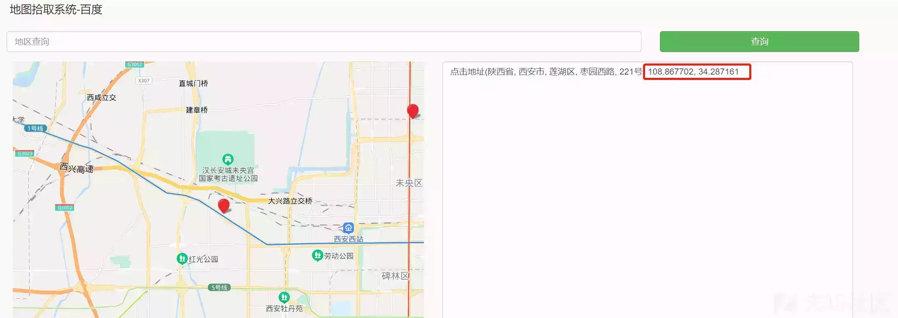

# 图片真实性伪造&鉴别 - 先知社区

图片真实性伪造&鉴别

- - -

# 0x01 舆情与图片

随着互联网技术快速进步，新媒体时代使得网络公民身份更为鲜明，大众对于公共事件的关注度和参与度愈来愈高，此特点在互联网上凸显的尤为明显。在此背景下，互联网舆论场呈现出热点事件频发、情绪传播鲜明的状况，更有心怀不轨之人借助互联网的匿名性强散播速度快的特点故意煽动网民情绪，舆论场热点极度高涨但结果出现反转的事情更是屡见不鲜。许多谣言以图片为载体，在互联网上大肆传播，这篇文章介绍一些查验图片真实性的技巧

# 0x02 基于 EXIF 信息如何判断图片真实性

如果我们有机会拿到原图可以通过 EXIF 信息进行判断图片是否进行过修改，什么是 EXIF 信息呢？

> **EXIF 为可交换图像文件格式**  
> Exchangeable image file format，官方简称**Exif**，是专门为数码相机的照片设定的文件格式，可以记录数码照片的属性信息和拍摄数据，通常会包含型号、拍摄日期、GPS、创建时间等信息

通常我们使用聊天软件的拍照功能或通过聊天软件进行图片传输是会自动抹去图片的 EXIF 信息的，以微信举例，只有使用原图选项传输的图片才会包含 EXIF 信息，但假如我们得到了原图，可以使用`MagicEXIF 图像校验器` `JPEGsnoop` 这个两个工具进行辅助识别，`JPEGsnoop` 貌似 Win10 环境下无法使用（更改了兼容性也无法运行），下文我们重点介绍一下 `MagicEXIF`

## **MagicEXIF 图像校验器**

MagicEXIF 图像校验器是 MagicEXIF 元数据编辑器分离出来的一个小工具，只能用来查验图片真实性，无法修改图片的 EXIF 信息，查验维度如下：

| EXIF 格式检验 | 检测文件是否为标准 EXIF JPEG 格式 | EXIF 数据内部一致性 | 检测 EXIF 内部数据是否存在冲突 |
| --- | --- | --- | --- |
| EXIF 数据外部一致性 | 检测 EXIF 所描述的参数是否符合当前图像 | 第三方软件数据 | 检测照片中是否存在第三方软件所插入的数据 |
| 厂商注释数据信度 | 检测照片中是否存在厂商注释数据，如果存在，进一步检测其完整性和原始程度 | 内嵌图特征一致性 | 检测文件中全部可读的内嵌图的哈希特征是否一致 |
| 压缩指纹信度 | 通过匹配来检测文件中的 JPEG 压缩指纹是否和原厂编码器产生的指纹一致 | MPF 数据信度 | 如果存在 MPF 数据，通过尝试提取 MPF 来检测 MPF 指针是否有效 |
| FlashPix Ready 数据信度 | 检测 FLPX 数据，仅适用于部分厂商 | 苹果 AROT 数据信度 | 检测 AROT 记录与图像匹配程度，仅适用于苹果系列型号 |
| MagicEXIF 编辑器旧版数据 | 检测老版本 MagicEXIF 元数据编辑器的遗留数据（老版本存在技术缺陷） | 直方图信度 | 检测图像直方图分布是否有明显人为修改痕迹，部分带有严重曝光问题的原片该项也可能会受怀疑 |
| 长宽比信度 | 检测图像长宽比是否为主流拍摄设备传感器画幅的常见比例，从而判断照片被裁剪的情况 | 图像尺寸信度 | 检测图像尺寸是否过小 |

根据上述指标给出 `class 1` 至 `class 5` 的评级，并且可与`JPEGsnoop` 给出的评级进行粗略转换，转换标准如下图：

注：因为评级标准不同，JPEGsnoop Class 4 为未知原始性的照片，尽管数字上比 Class 3 要高，但并不代表其原始度更高

## **MagicEXIF 元数据编辑器（部分功能付费）**

既然这个 EXIF 信息需要进行查验真伪，那么它一定是可以被修改和伪造的，上文所说的 **`MagicEXIF 图像校验器`** 就是 **`MagicEXIF 元数据编辑器`** 拆解出来的一个小功能，一般来说像我这种非专业人士主要就是看几个重要的维度：制造厂商、拍摄事件、GPS 信息，而这些信息都可以被修改，首先我们只修改 GPS 试试看

1、随机找一张包含基本 EXIF 信息的图片，原图下载：[https://www.vcg.com/creative/1362656657](https://www.vcg.com/creative/1362656657)

这张图片只包含了基本的相机信息，并无 GPS 信息记录下来，那么我们自己插入一条虚假的 GPS 信息进去

2、将照片导入编辑器，增加一条”真实“的 GPS 信息，这里我们有两种添加方式

右键空白区域可以增加一些专业参数

但是我们只想要更改基本的 GPS 信息，这里我们使用编辑向导进行编辑

之后我们用坐标拾取的工具进行地理位置的选择

这个工具的默认格式是百度地图 `**BD09坐标系**` 的坐标轴，我们需要再转换为 `**WGS-84坐标系**`格式的坐标，故 `108.867702, 34.287161` 转化为 `108.85666240393616,34.282604744637915` ，再导入到编辑器中，这里顺便将时间改为 2077 年

修改成功后便会发现 GPS 信息新增了四条信息，便是我们刚才导入的”真实“信息，再使用 Windows 的自带工具查验果然多出了刚才写入的 GPS 信息

3、虽然坐标已经成功伪造，但是当我们使用**`MagicEXIF 图像校验器`** 查验图片真实性时发现可信度仅为 Class 1，原因是这张照片经过了 `Phtotoshop` 的编辑

遇到这种情况我们可以使用图片重构的功能模拟其他相机的数据进行伪装，换句话来说就是把其他相机的相互对应的信息套用在这张图片上，从而绕过检测

这里再随机选择一组佳能相机（原照片为索尼）数据进行重构，结果可信度变为 Class 5

不过图片的 MD5 值会随 EXIF 的改变而改变

# 0x03 基于格式标准如何鉴别公文

1.  目前国家使用的纸质公文标准为中国标准化研究院在 2012 年规定的 `GB-T 9704-2012` 标准，如果纸质公文以图片的形式传播，可以通过此对照此标准进行辨别真伪
2.  现在更多谣言是通过经技术处理后的（P 图、F12 修改网页信息）外宣号截图进行传播的，但这类公众号并没有类似`GB-T 9704-2012` 的执行标准，那么我们可以通过以下方法进行辨别
    
3.  查看往期类似内容的格式，对照格式是否一致
    
4.  查看文中执行文件号是否重复出现过
5.  以政策关键词 + 地区为搜索条件进行查询

# 0x04 引用

1.  图片照妖镜 JPEGsnoop —— 盘古石取证（技术专家 钟焕伟）
2.  22 起舆情反转事件给我们带来哪些启示？ —— 人民网舆情数据中心（杨心茹）
