# 域渗透实战之 Forest - 先知社区

域渗透实战之 Forest

- - -

# 信息收集

## 端口扫描

首先使用 nmap 去探测端口，发现存在大量 windows 端口。

[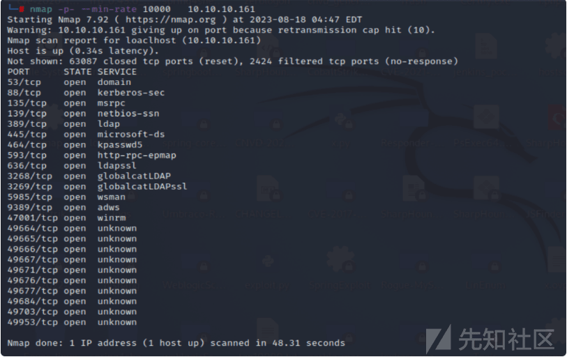](https://xzfile.aliyuncs.com/media/upload/picture/20231120102613-2ccc198e-874c-1.png)

然后接着使用 nmap 去探测其版本信息。

[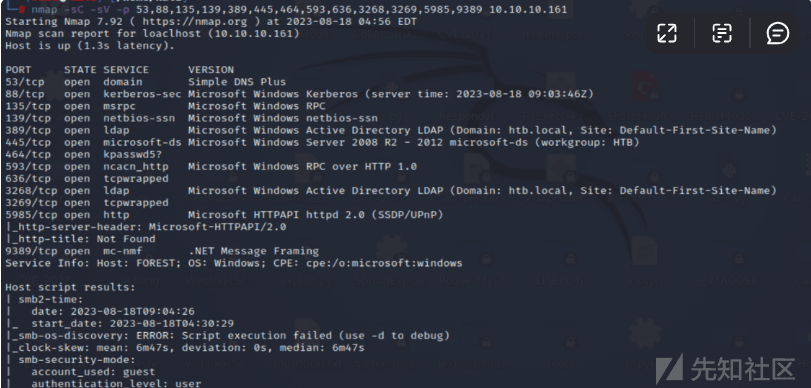](https://xzfile.aliyuncs.com/media/upload/picture/20231120102622-31f6aef6-874c-1.png)

发现其存在 5985 端口，如果找到用户的凭据，我可能能够通过 WinRM 获得 shell。

[](https://xzfile.aliyuncs.com/media/upload/picture/20231120102631-37d840c8-874c-1.png)

## DNS 协议探测

发现 htb.local 是从 forest.htb.local 这个 DNS 服务器来解析的。

[](https://xzfile.aliyuncs.com/media/upload/picture/20231120102640-3d34648e-874c-1.png)

并不能进行区域传输。

[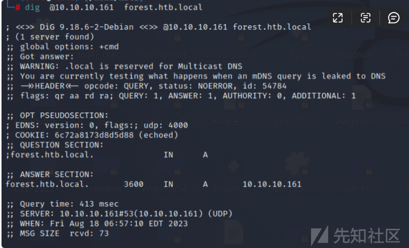](https://xzfile.aliyuncs.com/media/upload/picture/20231120102648-41f74e00-874c-1.png)

## TCP-445 端口

使用 smbmap 不能列出，但使用 smbclient 在没有密码的情况下列出列表。

[](https://xzfile.aliyuncs.com/media/upload/picture/20231120102658-47a573ea-874c-1.png)

## RPC 检测用户

使用空用户进行连接，接着来枚举用户。

[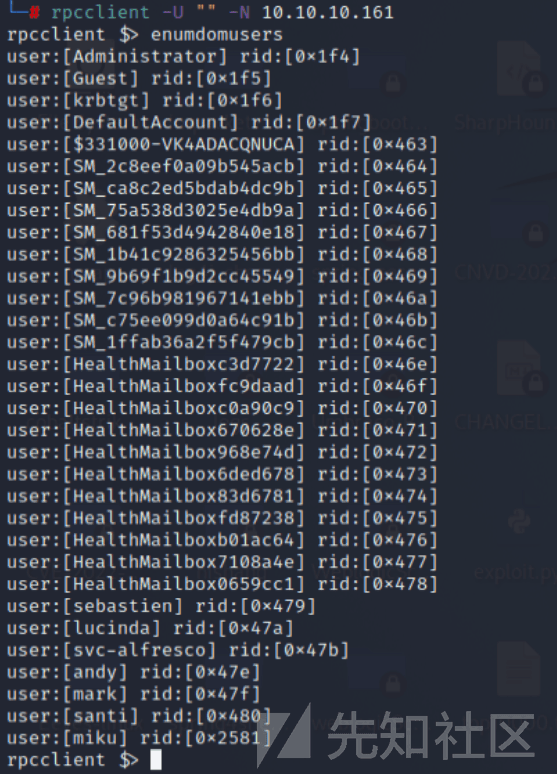](https://xzfile.aliyuncs.com/media/upload/picture/20231120102711-4f9caf46-874c-1.png)

然后获取用户列表和用户组。

[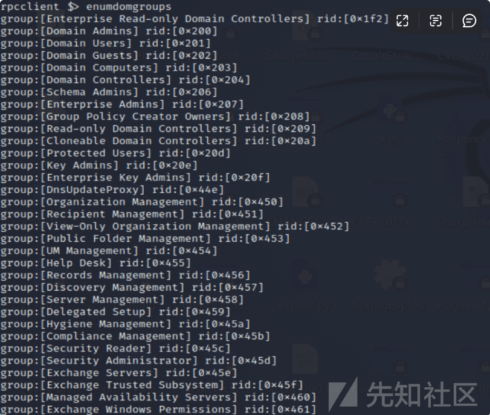](https://xzfile.aliyuncs.com/media/upload/picture/20231120102721-553fcbe0-874c-1.png)

接着进行查看群组成员。并找到了一个管理员用户。

[](https://xzfile.aliyuncs.com/media/upload/picture/20231120102732-5ba97cba-874c-1.png)

对于 Kerberos 服务，在不使用用户名的情况下测试了快速的 No-Preauth 成功。

# 漏洞利用

## AS-REP 烘焙

AS-REP 烘焙是一种允许为选择了“不需要 Kerberos 预身份验证”属性的用户检索密码哈希值的技术。事实上，如果用户没有启用 Kerberos 预身份验证，则可以为该用户请求 AS-REP，并且可以离线破解部分回复以恢复其明文密码。  
使用工具发现一个可烘培的用户：svc-alfresco  
通常使用 AS-REP 烘焙，您需要一个有效的用户名。当涉及到 AD 枚举时，有三个检查阶段：无凭证（匿名访问）、无密码的有效用户名，然后是有效凭证集（用户名 + 密码）。

[](https://xzfile.aliyuncs.com/media/upload/picture/20231120102744-63523830-874c-1.png)

## hashcat 解密

```plain
$krb5asrep$23$svc-alfresco@HTB.LOCAL:93fbd77d6d4b54d331e1a665047d4dfb$8a3d3a98956b1c0a9cf886b8e073db94b6f9be12e2703f641a7d067c9525d45822f2c69308b46c169be00137b1837c894d9df7a2fc4a9c738a115eb8c8cbed813f4ca10ef1163260e0b3c324f55ece2377d8695e914f330e2224caadefe4953435a4f0b26138aab58b45bfdd46c5c62e38dfef85776d3323e2a5abc4179ebd2b57149c7e71042d76846e41668f2b8fe34448e6e3ee75bf4d5716f47997f279af20a1d415e9e1bf1517befef8722dcda7b055065685630bebf2119c04582b81f86d3f42466cfb0c419074b889cb9a8653e6ec74b137746034ceed687c6baeb01e2ae47906f5b7
```

发现一串 hash，然后使用 hashcat 进行解密。

[](https://xzfile.aliyuncs.com/media/upload/picture/20231120102803-6eabea78-874c-1.png)

## WinRM 测试

解密之后，使用 WinRM 来测试这些凭据是否可以使用

[](https://xzfile.aliyuncs.com/media/upload/picture/20231120102811-730f9560-874c-1.png)

## 获取 shell

发现其可以进行 winrm 获取 shell

[](https://xzfile.aliyuncs.com/media/upload/picture/20231120102819-782236e8-874c-1.png)

## 获取 user.txt

接着获取 user.txt

[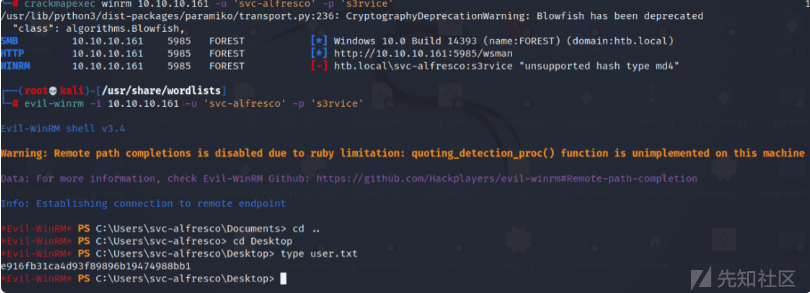](https://xzfile.aliyuncs.com/media/upload/picture/20231120102831-7f4d7c02-874c-1.png)

# 内网信息收集

## 使用 BloodHound 来 寻找路径。

[](https://xzfile.aliyuncs.com/media/upload/picture/20231120102844-8698af5e-874c-1.png)

看到我们的用户 svc-alfresco 是“Account Operators”组的成员，该组对“Exchange Windows Permissions”组拥有 GenericAll 权限。  
有了 GenericAll 权限，我们就拥有了目标对象的完全权限（将用户添加到组、重置用户密码等），并且我们可以滥用这个弱权限。  
此外，“Exchange Windows 权限”确实具有域 ( htb.local ) 上的 WriteDACL 权限。这意味着，如果我们创建一个用户并将其添加到“Exchange Windows Permissions”组，我们就可以向他授予 DCSync 访问权限并转储域控制器密码哈希值。  
因此，我们有四 (4) 件事要做：  
● 创建用户  
● 将其添加到“Exchange Windows 权限”组  
● 将其添加到“远程管理用户”组（具有远程访问权限）  
● 滥用 DACL 的弱权限来获取 DCSync 权限  
判断用户群组归属  
接着使用 net user /domain 进行收集域信息。  
获取所有域用户的列表：  
进行数据筛选，然后筛选出用户

[](https://xzfile.aliyuncs.com/media/upload/picture/20231120102855-8d2ecfc4-874c-1.png)

## 枚举用户组。

[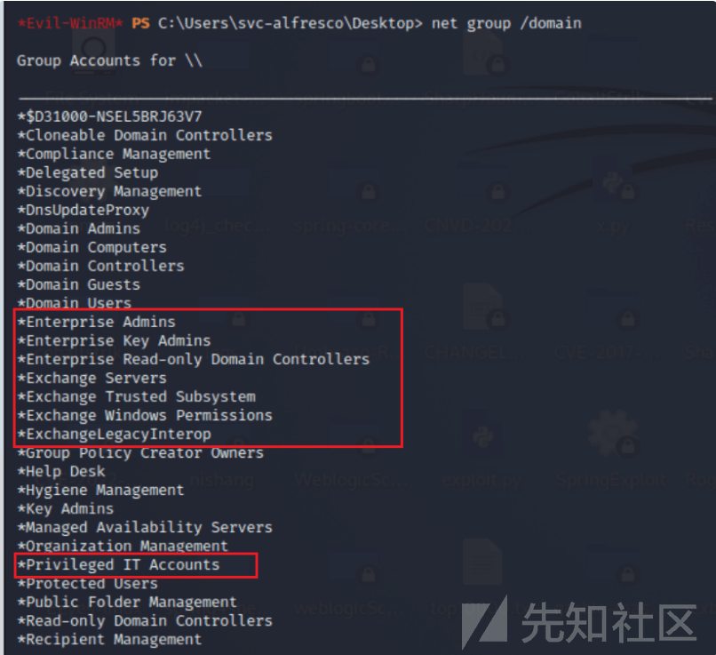](https://xzfile.aliyuncs.com/media/upload/picture/20231120102904-92cb8c74-874c-1.png)

## 接着检查“本地组”

[](https://xzfile.aliyuncs.com/media/upload/picture/20231120102915-99813000-874c-1.png)

## 查找嵌套组

使用 net user svc-alfresco /domain 去查询。  
发现当前用户是 ServiceAccounts 组的一部分;但嵌套了“服务帐户”组的多个组的成员。

[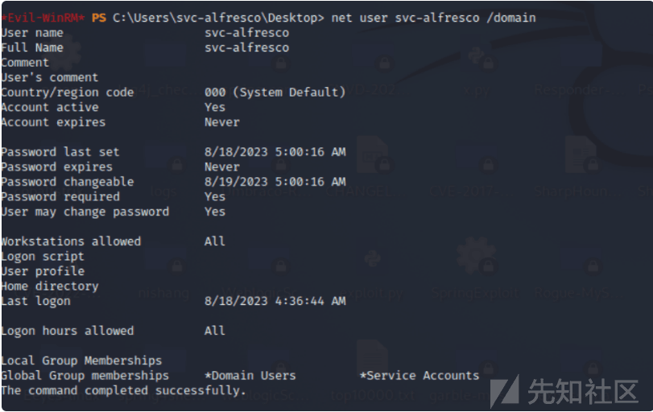](https://xzfile.aliyuncs.com/media/upload/picture/20231120102925-9f5f204a-874c-1.png)

# 权限提升

## 上传 PowerVIew.ps1 工具

接着上传 PowerView.ps1 工具

[](https://xzfile.aliyuncs.com/media/upload/picture/20231120102934-a4982e1c-874c-1.png)

使用 dot-sourcing 将脚本导入到当前会话中。  
加载 PowerView 后，首先要查找的是当前用户所属的所有组。  
Get-DomainGroup -MemberIdentity 'svc-alfresco' | select samaccountname

[](https://xzfile.aliyuncs.com/media/upload/picture/20231120102959-b39d3b00-874c-1.png)

## 加入 Exchange Windows 权限组

发现存在特权用户。  
深入每个组，找到与每个组关联的所有嵌套组。

[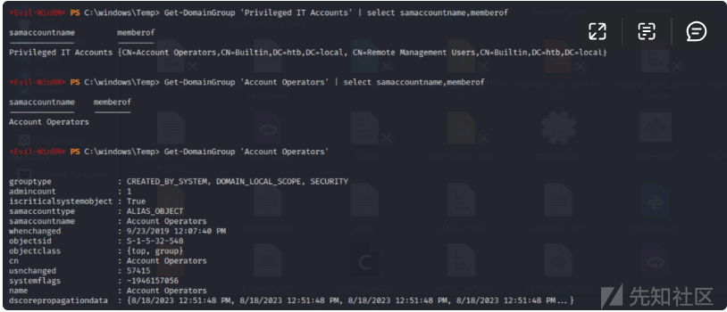](https://xzfile.aliyuncs.com/media/upload/picture/20231120103008-b8e721e8-874c-1.png)

找到了第一个嵌套组。发现“服务帐户”组中的所有用户也是“特权 IT 帐户”组的成员。

[](https://xzfile.aliyuncs.com/media/upload/picture/20231120103016-bd729e54-874c-1.png)

## DCSync 权限

```plain
● GenericAll – full rights to the object (add users to a group or reset user’s password)
GenericAll -对象的完全权限（将用户添加到组或重置用户的密码）
● GenericWrite – update object’s attributes (i.e logon script)
GenericWrite -更新对象的属性（即登录脚本）
● WriteOwner – change object owner to attacker controlled user take over the object
WriteOwner -将对象所有者更改为攻击者控制的用户接管对象
● WriteDACL – modify object’s ACEs and give attacker full control right over the object
WriteDACL -修改对象的 ACE 并给予攻击者对对象的完全控制权
● AllExtendedRights – ability to add user to a group or reset password
AllExtendedRights -将用户添加到组或重置密码的能力
● ForceChangePassword – ability to change user’s password
ForceChangePassword -更改用户密码的能力
● Self (Self-Membership) – ability to add yourself to a group
Self（Self-Membership）- 将自己添加到组的能力
```

[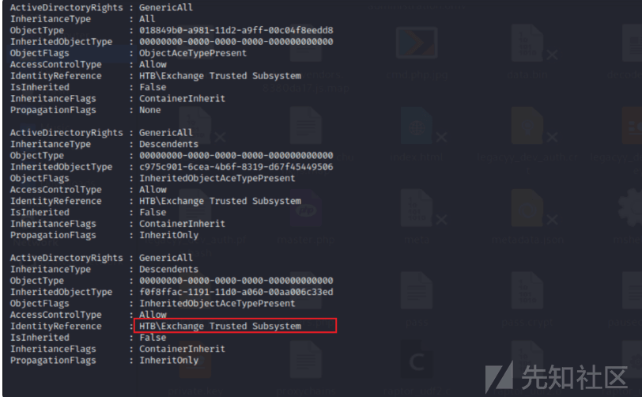](https://xzfile.aliyuncs.com/media/upload/picture/20231120103029-c5334634-874c-1.png)

在 Exchange 受信任子系统组上滥用权限  
net user /add testz1 testz1@qq.com /domain  
net group /add 'Exchange Trusted Subsystem' testz1 /domain

[](https://xzfile.aliyuncs.com/media/upload/picture/20231120103037-ca18cf70-874c-1.png)

```plain
1. $SecPassword = ConvertTo-SecureString 'testz1@qq.com' -AsPlainText -Force
2.$Cred = New-Object System.Management.Automation.PSCredential('HTB.local\testz1', $SecPassword)

3.Add-DomainObjectAcl -Credential $Cred -TargetIdentity "DC=htb,DC=local" -PrincipalIdentity pwnt -Rights DCSync
4. 
Add-DomainObjectAcl -Credential $Cred -TargetIdentity "DC=htb,DC=local" -PrincipalIdentity testz1 -Rights DCSync
```

[](https://xzfile.aliyuncs.com/media/upload/picture/20231120103052-d324b822-874c-1.png)

## 转储哈希

secretsdump.py svc-alfresco:s3rvice@10.10.10.161

[](https://xzfile.aliyuncs.com/media/upload/picture/20231120103102-d8fc9d46-874c-1.png)

使用管理员散列执行传递散列攻击并获得权限

[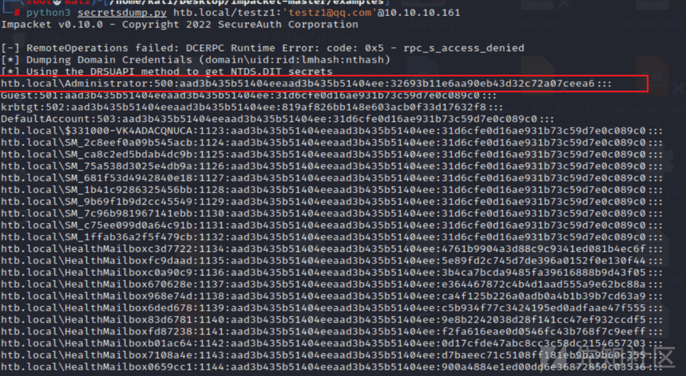](https://xzfile.aliyuncs.com/media/upload/picture/20231120103118-e2747f88-874c-1.png)

## 获取 root.txt

使用 winrm 进行获取 shell。

[](https://xzfile.aliyuncs.com/media/upload/picture/20231120103132-eb182770-874c-1.png)

# 总结

DCSync 与 DCshadow 是域渗透中经常会用到的技术。

## DCSync 攻击

2015 年 8 月，Benjamin Delpy(神器 Mimikatz 的作者) 和 Vincent Le Toux 发布了新版本的 Mimikatz，新增加了 DCSync 功能。模仿一个域控制器 DC，从真实的域控制器中请求获取数据，例如账号的口令散列值等数据。  
DCSync 之前，获取域的账号口令信息，需要登录域服务器，在域服务器上运行代码才可以获取。  
DCSync 的最大特点，在于不用登录域服务器，即可远程通过域数据同步复制的方式获得想要的用户口令信息。  
需要注意的是，DCSync 攻击的对象如果是 RODC 域控制器，则会失效，因为 RODC 是不能参与复制同步数据

## DCSync 攻击原理

DCSync 的原理非常清晰，利用域控制器之间的数据同步复制。  
● 发现网络中的目标域控制器;  
● 通过 DRS 服务的 GetNCChanges 接口发起数据同步请求，Directory Replication Service (DRS) Remote Protocol  
Samba wiki 关于 GetNCChanges 的描述包括： 
当一个 DC (客户端 DC) 想从其他 DC (服务端 DC) 获取数据时，客户端 DC 会向服务端 DC 发起一个 GetNCChanges 请求。回应的数据包括需要同步的数据。  
如果需要同步的数据比较多，则会重复上述过程。毕竟每次回应的数据有限。  
一个用户想发起 DCSync 攻击，必须获得以下任一用户的权限：  
● Administrators 组内的用户  
● Domain Admins 组内的用户  
● Enterprise Admins 组内的用户  
● 域控制器的计算机帐户  
即：默认情况下域管理员组具有该权限。

## DCShadow 攻击

2018 年 1 月 24 日，Benjamin Delpy(神器 Mimikatz 的作者) 和 Vincent Le Toux 在 BlueHat IL 会议期间公布了针对域活动目录的一种新型攻击技术 DCShadow  
在具备域管理员权限条件下，攻击者可以创建伪造的域控制器，将预先设定的对象或对象属性复制到正在运行域服务器中。  
DCSync 从域服务器复制出东西，DCShadow 是将数据复制至域服务器。  
Luc Delsalle 对这种技术进行了验证和详细的描述，并就红蓝对抗中蓝队对抗此种攻击技术的缺陷和补救方法。  
从 DCShadow 目前展示的功能来看，主要只能用于红蓝对抗的隐蔽后门。但是 DCShadow 第一次澄清和实现了伪造一个 DC 的最小需求合集，这个贡献非常大。以 前很多攻击方法都卡在不能伪造域服务器，例如 MS15-011 和 MS15-014 等，有了 DCShadow 的基础，相信将来会有很多新的攻击方法。

## DCShadow 攻击流程

根据 Luc Delsalle 的描述，DCShadow 的攻击过程包括 3 个主要个步骤： 
1、在目标域的 AD 活动目录注册一个伪造的 DC 中;  
2、使伪造的 DC 被其他的 DC 认可，能够参与域复制 ;  
3、强制触发域复制，将指定的新对象或修改后的对象属 r 性同步复制到其他 DC 中;  
1.注册伪造的 DC  
一台机器要想注册成为域中的一台 DC 服务器，需要在域的活动目录中注册一个 NTDS-DSA(nTDSDSA) 类对象。注册的位置为 CN=Servers,CN=Default-First-Site-Name,CN=Sites,CN=Configuration,DC=adsec,DC=com  
2.注册的 DC 被其他 DC 认可，能够参与域复制  
3.发起域复制  
REF：  
[https://github.com/gentilkiwi/mimikatz](https://github.com/gentilkiwi/mimikatz)
