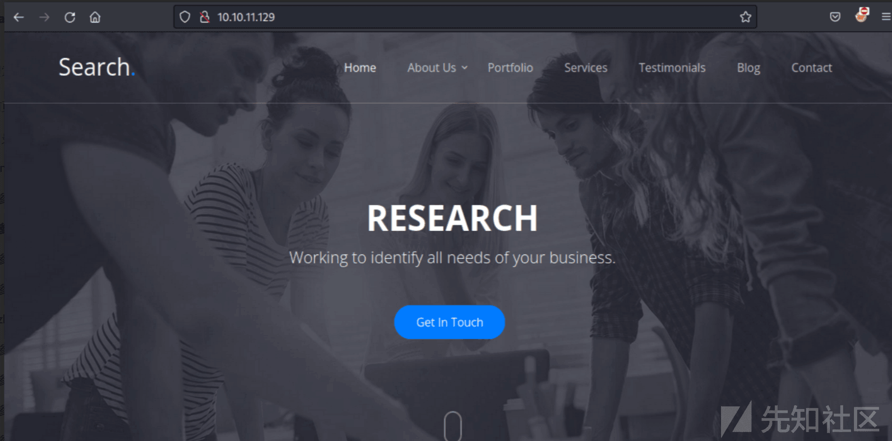
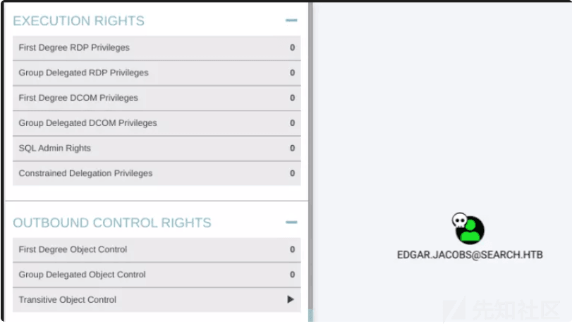
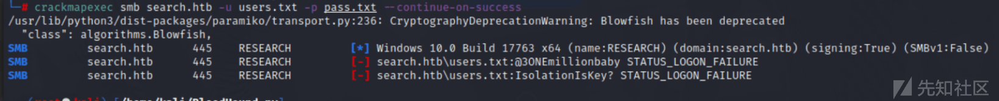

# 域渗透实战之 search - 先知社区

域渗透实战之 search

- - -

# 信息收集

## 端口扫描

首先使用 nmap 去探测存活端口。

接着去探测端口的具体信息

  
  
访问 80 端口，发现一个网页。

## 目录爆破

使用工具对其进行目录爆破

## SMB 未授权访问

使用 smbmap 尝试进行未授权访问。

## 用户暴力破解

使用在网页中获取到的用户进行枚举密码。

## SMB 未授权访问

发现主机中有一些共享文件。

在 RedirectedFolders$有一些用户信息。

接着进行查看目录中的文件

## LDAP 未授权访问

使用 ladpsearch 来枚举 ladp 信息。

经过身份验证的 LDAP 搜索验证。

## LDAP 域转储

使用 ldapdomaindump 来转存域用户信息。

然后它会建立 html 网页，这样查找起来更方便。

有一些“帮助用户”的帐户和不同的基于位置的帮助台组

发现了一个临时用户：web\_svc

## Bloodhound 分析

运行 Bloodhound.py 来收集域信息。

查看数据，hope.sharp 无法访问任何有趣的内容。  
列出所有 Kerberoastable 帐户”查询返回两个用户：

# Edgar.Jacobs

## Kerbero

使用 GetUserSPNs.py 来获取用户 hash

接着进行 hashcat 爆破，然后使用 crackmapexec 来验证用户。

## SMB 枚举

接着进行 SMB 枚举，来获取有用信息。

然后进行密码喷洒

# Siearra.Frye

## Bloodhound 分析/LDAP

标记 Edgar.Jacobs 拥有的 Bloodhound，然后继续进行分析。

查看用户组之间的关系。

## SMB 未授权

使用 smbmap 来进行文件的未授权访问。

发现它是空的。

发现一个.xlsx 文件，发现大量用户和密码。

然后打开发现没有完整的密码，有解压密码。

密码 01082020 选项卡有 14 行，分别是第一个、最后一个和用户名：

然后解压看看。

接着进行用户名和密码爆破。然后获取到可用用户，进行登录。

然后来检验用户的可用性。

## 获取 user.txt

成功获取 user.txt

## 导入证书

发现登录需要密码。

## 破解密码

使用 pfx2john 来破解证书的密码。

## 获取 shell

访问 https 页面，成功获取一个 shell。

# Tristan.Davies

回到 Bloodhound，我会将 Sierra.Fry 标记为已拥有

## 获取密码

组托管服务帐户 (GMSA) 是 Windows 服务器通过为帐户生成长随机密码来管理帐户密码的地方  
将其保存在其保存在一个变量。

## 重置用户密码

用上面的帐户密码创建的对象 Invoke-Command 作为 BIR-ADFS-GSMA$ 运行：PSCredential

使用 crackmapexec 来验证密码是否重置。

## 获取 root.txt

成功获取 root.txt  
接着使用 wmiexec.py 进行登录。

