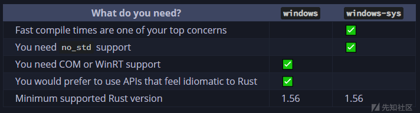

# 基于 Rust 的 Windows 平台进程遍历 - 先知社区

基于 Rust 的 Windows 平台进程遍历

- - -

Rust 是这两年比较火的一门语言，作为新研发的系统级编程语言。用 Rust 写出来的程序不仅运行速度快，还通过所有权系统等对代码进行编译时检查，有效地提升了程序的安全性，降低了 bug 率。

通过 Rust 调用 Windows API 需要使用相应的包 (crate) 来实现，几年前有一个[winapi](https://crates.io/crates/winapi) 包可以做这件事。不过这个包已经好久没有更新了，微软官方最近则提供了[windows](https://crates.io/crates/windows) 和 [windows-rs](https://crates.io/crates/windows-sys) 这两个 crate 供大家使用。

本文将展示通过**windows**和**windows-rs**这两个 crate 来调用 Windows API 并实现进程遍历，并打印每个进程的 PID 和进程名的功能。

## windows 和 windows-rs 的区别

这两个 crate 都可以用来调用 Windows API，两者的区别可以看[Choosing between the windows and windows-sys crates - Kenny Kerr](https://kennykerr.ca/rust-getting-started/windows-or-windows-sys.html) 中的介绍，大概如下。对于本文来说，最主要的是第四点区别，也就是用 windows 这个 crate 写出来的代码更有 Rust 的风格，而用 windows-rs 写出来的代码看起来和 C/C++ 没什么区别。

[](https://xzfile.aliyuncs.com/media/upload/picture/20240226211754-733266ee-d4a9-1.png)

之所以会这样，是因为 windows-rs 这个 crate 没有对 Windows API 进行封装，而是直接从 kernel32.dll 中获取然后调用：

```plain
#[cfg(feature = "Win32_Foundation")]
::windows_targets::link!("kernel32.dll" "system" #[doc = "Required features: `\"Win32_Foundation\"`"] fn CreateToolhelp32Snapshot(dwflags : CREATE_TOOLHELP_SNAPSHOT_FLAGS, th32processid : u32) -> super::super::super::Foundation:: HANDLE);
```

但是 windows 这个 crate 则会对 API 进行简单的封装，让函数的返回值符合 Rust 的风格：

```plain
#[inline]
pub unsafe fn CreateToolhelp32Snapshot(dwflags: CREATE_TOOLHELP_SNAPSHOT_FLAGS, th32processid: u32) -> ::windows_core::Result<super::super::super::Foundation::HANDLE> {
    ::windows_targets::link!("kernel32.dll" "system" fn CreateToolhelp32Snapshot(dwflags : CREATE_TOOLHELP_SNAPSHOT_FLAGS, th32processid : u32) -> super::super::super::Foundation:: HANDLE);
    let result__ = CreateToolhelp32Snapshot(dwflags, th32processid);
    (!result__.is_invalid()).then(|| result__).ok_or_else(::windows_core::Error::from_win32)
}
```

所以从 crate.io 中查询道到函数定义上看，这两个函数除了返回值，其他都一样，并且都和原生 API 一样：  
[](https://xzfile.aliyuncs.com/media/upload/picture/20240226211810-7d274aac-d4a9-1.png)  
[](https://xzfile.aliyuncs.com/media/upload/picture/20240226211820-82e5921e-d4a9-1.png)

## 代码实现

首先，需要在 Cargo.toml 中引入这两个包，之后才能使用这里面的函数：

```plain
[dependencies.windows]
version = "*"
features = [
    "Win32_Foundation",
    "Win32_System_Diagnostics_ToolHelp",
]

[dependencies.windows-sys]
version = "*"
features = [
    "Win32_Foundation",
    "Win32_System_Diagnostics_ToolHelp",
]
```

其次，由于这些 Windows API 基本上都是用 unsafe 声明的，所以要调用这些 API 需要在 Rust 的 unsafe 块中调用。

如果使用 windows-rs 来实现进程遍历，写出来的代码基本和用 C/C++ 写出来的代码没什么区别，都是获取进程快照，然后循环获取每个进程的 PID 和进程名：

```plain
fn test_in_windows_sys() {
    use windows_sys::Win32::Foundation::{INVALID_HANDLE_VALUE, GetLastError};
    use windows_sys::Win32::System::Diagnostics::ToolHelp::{CreateToolhelp32Snapshot, Process32First, Process32Next, PROCESSENTRY32,TH32CS_SNAPPROCESS};

    unsafe {
        // 获取进程快照
        let handle = CreateToolhelp32Snapshot(TH32CS_SNAPPROCESS, 0);
        if handle == INVALID_HANDLE_VALUE {
            println!("CreateToolhelp32Snapshot Error: {}", GetLastError());
            process::exit(1);
        }

        let mut pe32: PROCESSENTRY32 = zeroed();
        pe32.dwSize = size_of_val(&pe32) as u32;

        let mut b_ret = Process32First(handle, &mut pe32) != 0;

        while b_ret {
            // 将进程名转换为UTF-8
            let name = String::from_utf8(pe32.szExeFile[..].to_vec()).unwrap_or_else(|e| {
                println!("String::from_utf8 Error: {}", e);
                process::exit(1);
            });
            println!("PID={},name={}", pe32.th32ProcessID, name);

            b_ret = Process32Next(handle, &mut pe32) != 0;
        }
    }
}
```

如果是使用 windows 这个包来实现，方法也是一样，只不过要对返回值进行处理，写出来的代码就具有 Rust 风格：

```plain
fn test_in_windows() {
    use windows::Win32::System::Diagnostics::ToolHelp::{CreateToolhelp32Snapshot, Process32First, Process32Next, PROCESSENTRY32, TH32CS_SNAPPROCESS};

    unsafe {
        let handle = CreateToolhelp32Snapshot(TH32CS_SNAPPROCESS, 0).unwrap_or_else(|e| {
            println!("CreateToolhelp32Snapshot Error: {}", e);
            process::exit(1);
        });

        let mut pe32: PROCESSENTRY32 = PROCESSENTRY32::default();
        pe32.dwSize = size_of_val(&pe32) as u32;

        Process32First(handle, &mut pe32).unwrap_or_else(|e| {
            println!("Process32First Error: {}", e);
            process::exit(1);
        });

        loop {
            // 将进程名转换为UTF-8
            let sz_exe_file = pe32.szExeFile.map(|x| x as u8).to_vec();
            let name = String::from_utf8(sz_exe_file).unwrap_or_else(|e| {
                println!("String::from_utf8 Error: {}", e);
                process::exit(1);
            });

            println!("PID={},name={}", pe32.th32ProcessID, name);

            if let Err(_) = Process32Next(handle, &mut pe32) {
                break;
            }
        }
    }
}
```

## 编码问题

上面两段代码，无论哪段代码运行以后，进程名的输出都是像下面这样出错：

[](https://xzfile.aliyuncs.com/media/upload/picture/20240226211925-a9d41a94-d4a9-1.png)

这是因为，在 Rust 中字符是按 UTF-8 编码的，而 Process32First 和 Process32Next 这两个 API 都是按照 ASCII 编码来将进程名字写入到 PROCESSENTRY32->szExeFile 数组中，所以在获取进程名的时候，都需要通过 String::from\_utf8 来转换：

```plain
let name = String::from_utf8(sz_exe_file).unwrap_or_else(|e| {
       println!("String::from_utf8 Error: {}", e);
       process::exit(1);
});
```

然而，Process32First 和 Process32Next 在将进程名写入到 szExeFile 数组的时候并没有清空该数组。

以下是调试的结果：

首先在第一次运行 Process32Next 函数之前，Process32First 函数会将第一个进程名写入到 szExeFile 数组中。该进程名共 16 个字节，所以 szExeFile\[0\]到 szExeFile\[15\]就保存了这个进程的名称：

[](https://xzfile.aliyuncs.com/media/upload/picture/20240226212101-e2db8f16-d4a9-1.png)

当第二次准备运行 Process32Next 函数的时候，该函数已经把第二个进程的名称写入到 szExeFile 数组中，第二个进程名共 6 个字节，所以 szExeFile\[0\]到 szExeFile\[5\]就保存了第二个进程的名称。

[](https://xzfile.aliyuncs.com/media/upload/picture/20240226212121-eea47218-d4a9-1.png)

但是，Process32Next 函数在写入第二个进程名的时候没有清空 szExeFile 数组，而是直接将 szExeFile\[6\]赋值为 0，以此来截断字符。这就导致 szExeFile\[7\]到 szExeFile\[15\]中保存了上一个进程名的数据。

由此可以推测，Process32First 和 Process32Next 这两个函数在写入进程名称的时候，逻辑大概如下所示，也就是直接将新的进程的进程名写入到数组中，然后在后面加个 0 截断，而没有去清空 szExeFile 数组。

```plain
void write_process_name(char szExeFile[], char newProName[]) {
    DWORD dwProNameLen = strlen(newProName);

    for (DWORD i = 0; i < dwProNameLen; i++) {
            szExeFile[i] = newProName[i];
    }
    szExeFile[dwProNameLen] = 0;
}
```

虽然这样写不合适，不过你如果用 ASCII 来编码 szExeFile 程序是可以正常输出的。但问题是，Rust 是用 UTF-8 来编码的。这个时候，程序不会将 szExeFile\[6\]中的 0 当成是字符串结束，而是继续向后编码，直到遇到连续的两个 0，这就产生了上面说的输出进程名出现的错误。

要解决这个问题也不难，在这个程序中只要在调用 Process32Next 函数之前，自己手动将 szExeFile 数组清空即可：

```plain
for item in pe32.szExeFile.iter_mut() {
                *item = 0;
}
```

这个时候就会发现，程序的输出是正常的：

## 后记

这个字符编码问题怎么说呢，应该说是 Process32First/Process32Next 函数这两个原生 API 的问题。按道理不应该那样去写入进程名，不知道最开始为什么要这样去写代码，可能是为了快？

而且，如果 Process32First/Process32Next 函数有这个问题，其他的比如 Module32First/Module32Next 这些函数也肯定会有这个问题。但是坑的地方是，windows 和 windows-rs 这两个包没有在 crate-io 中说明这个问题。而如果按照 MSDN 的定义，程序员是不会想到要去特别处理这一块代码。

所以可想而知，这样就很容易出现很多 Bug。windows 和 windows-rs 作为 crate，按道理在封装的时候应该对这些代码进行处理，不然你也得在 crate-io 中进行说明。可是什么都没有，我已经把这个问题在 github 上向这两个 crate 的开发人员进行反馈了反馈：[Unable to get the correct process name by using Process32First/Process32Next function · Issue #2879 · microsoft/windows-rs · GitHub](https://github.com/microsoft/windows-rs/issues/2879)

但是目前得到的回复是：

> There doesn't appear to be any bug here. Your program owns the `PROCESSENTRY32` structure and is responsible for ensuring it's ready before calling `Process32Next`.
> 
> I don't think we want to do this at the crate level for a number of reasons, such as:
> 
> -   The crate is automatically generated from metadata and there's no metadata to indicate which buffers should be zeroed before call
> -   Zeroing out the struct member automatically could be wasteful if the user already zeroed it out
> -   The caller may want to provide a `szExeFile` padded out with `0x20` (space) characters
> 
> I'll leave this open for others to chime in, just in case I'm missing something.

大概意思就是要程序员们自己注意，调这些函数的时候多想想，相应结构体有没有被你合理的赋值。

（不得不说这个锅甩的一言难尽，希望之后这两个包在迭代过程中会有所修改吧，不然真的是要带一堆 BUG 出来）
