# 基于 wireshark 对网页版微信抓包和 ios 微信抓包分析 - 先知社区

基于 wireshark 对网页版微信抓包和 ios 微信抓包分析

- - -

## 网页版微信

### 分析过程

-   先查看本机的 IP 地址  
    [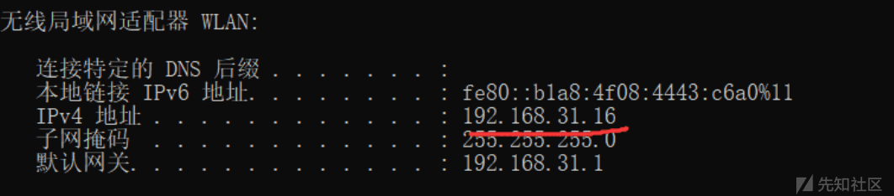](https://xzfile.aliyuncs.com/media/upload/picture/20240125114834-9d0c00da-bb34-1.png)

-   打开浏览器准备登录微信网页版。扫码的时候查看抓的包，其中有个 DNS 数据包询问 extshaort.weixin.qq.com 的 IP 地址。  
    [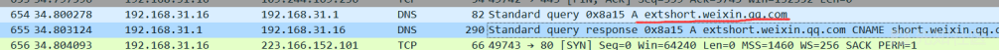](https://xzfile.aliyuncs.com/media/upload/picture/20240125114855-a9704606-bb34-1.png)
    
    -   查看这个报文的具体内容，发现这是一个 DNS 查询报文，DNS 查询报文为标准查询即通过主机名查询对应的 IP  
        [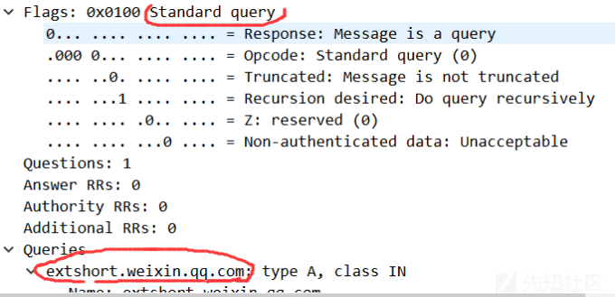](https://xzfile.aliyuncs.com/media/upload/picture/20240125114911-b331d056-bb34-1.png)
        
    -   查询本机网络信息得知，本地 DNS 服务器地址为 192.168.31.1  
        [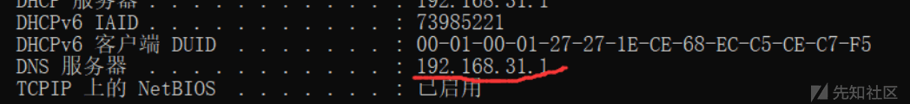](https://xzfile.aliyuncs.com/media/upload/picture/20240125114930-be9ad5fa-bb34-1.png)
        
    -   下面是 DNS 回复报文，从 DNS 回复报文中可以看出网页版微信的 IP 地址有多个，为了应对大流量的访问包括避免宕机影响业务，大企业或者大型服务都会有多个服务器。  
        [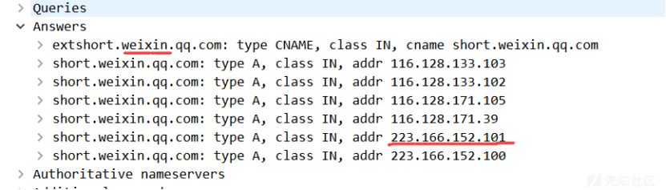](https://xzfile.aliyuncs.com/media/upload/picture/20240125114943-c61297e6-bb34-1.png)
        
    -   从接下来的报文中可以看出用户选择了 223.166.152.101 这个服务器进行访问连接。因为 DNS 查询后有一定数量的 TCP 数据包是本机与 223.166.152.101 之间的  
        [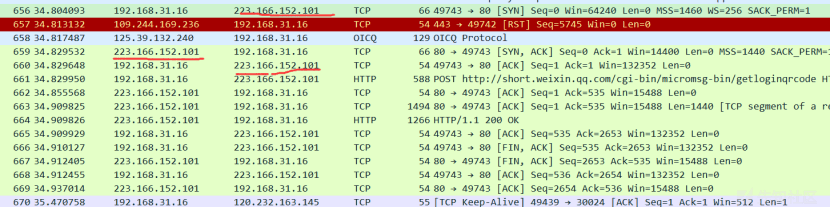](https://xzfile.aliyuncs.com/media/upload/picture/20240125114957-cecea96a-bb34-1.png)
        

-   分析上述提到的 TCP 数据包（三次握手过程）
    
    -   从下图流量包看到了源 IP 是本机 IP，目的 IP 为 DNS 返回的其中一个 IP。分析 TCP 报文内容，看到了目的 Port 为 80 即常见的 HTTP 协议的端口。然后标志位 SYN 置 1，为 TCP 三次握手中的第一步。说明本机正常通过 TCP 与微信的服务器建立连接。  
        [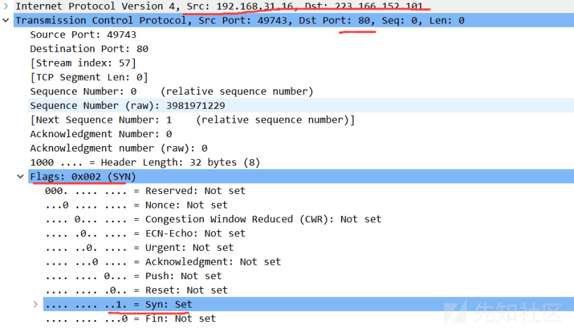](https://xzfile.aliyuncs.com/media/upload/picture/20240125115009-d5a09e88-bb34-1.png)
        
    -   下图流量包是服务器回复的报文。其中确认号 ACK=x+1，x 为请求报文中的 0，syn = 1，表示客户端的请求报文有效，服务器可以正常接收客户端发送的数据，同意创建与客户端的的新连接。  
        [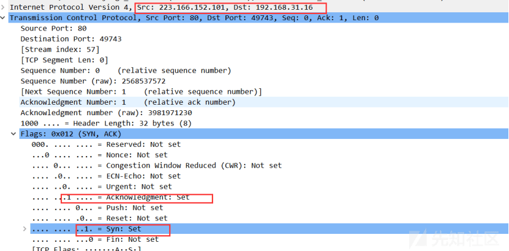](https://xzfile.aliyuncs.com/media/upload/picture/20240125115023-dde5aae8-bb34-1.png)
        
    -   客户端收到服务器回复的报文后得知服务器允许建立连接，此时客户端还会再发送一个 TCP 报文，这个数据包的 seq = x+1=1,ack 还是为 1。表明可以建立连接了。接下来的就是双方的数据传输。  
        [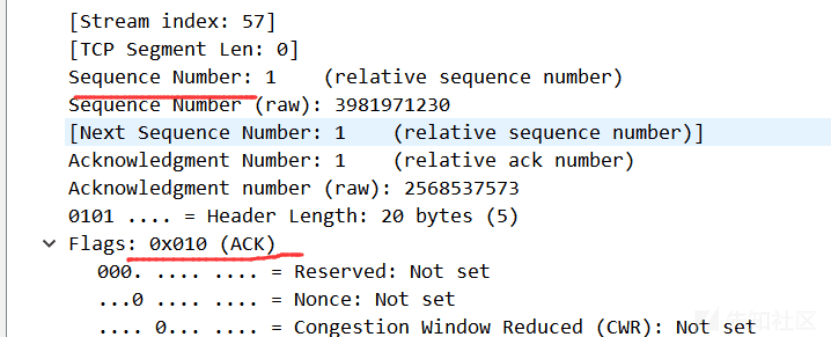](https://xzfile.aliyuncs.com/media/upload/picture/20240125115033-e4115354-bb34-1.png)
        

-   三次握手后建立连接后客户端向服务器发送了一个 HTPP post 报文，客户端开始提交数据。看 HTTP 的内容，request URI，而这个 URI 为..../getloginqrcode，是微信登录的二维码。

[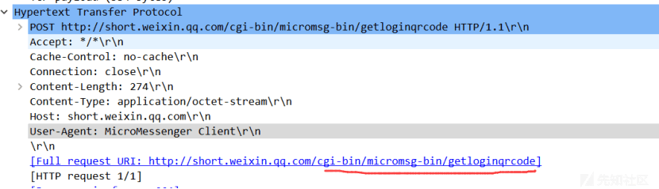](https://xzfile.aliyuncs.com/media/upload/picture/20240125115043-ea498642-bb34-1.png)

[](https://xzfile.aliyuncs.com/media/upload/picture/20240125115053-efd925c2-bb34-1.png)

-   扫码登录
    
    -   登录后有大量的 TCP 数据包及 HTTP POST 和 HTTP 响应数据包。从这里可以看出这时候与登录前的服务器 IP 不同，但是都是之前 DNS 返回的 IP 之一。这种大型业务不同的服务器承载着不同的业务需求。  
        [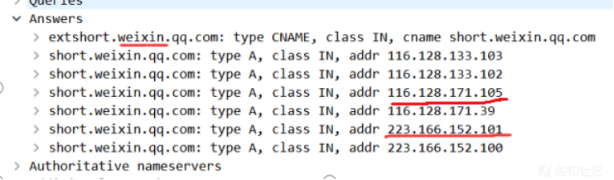](https://xzfile.aliyuncs.com/media/upload/picture/20240125115104-f6d75c4a-bb34-1.png)
        
    -   客户端向微信服务器请求同步数据等数据传输的 HTTP。  
        [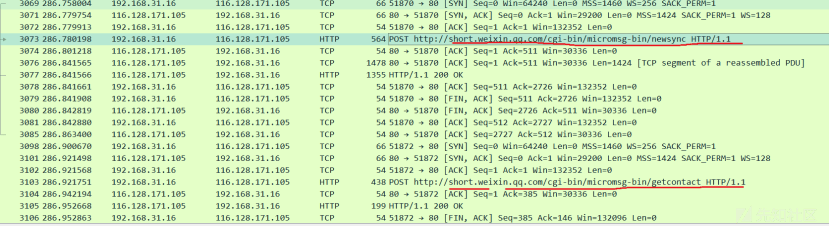](https://xzfile.aliyuncs.com/media/upload/picture/20240125115119-ff5cd958-bb34-1.png)
        

[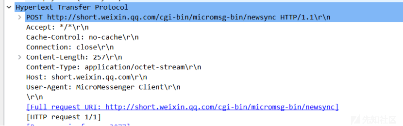](https://xzfile.aliyuncs.com/media/upload/picture/20240125115132-07185280-bb35-1.png)

-   加密协议。微信使用了应用层与传输层之间的 SSL/TLS 协议进行数据加密。
    
    -   Client Hello 开始客户端向服务器发送建立连接的请求：（版本号，随机数等）  
        [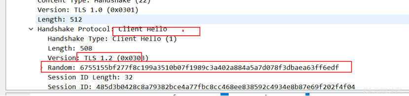](https://xzfile.aliyuncs.com/media/upload/picture/20240125115143-0e1651a4-bb35-1.png)

[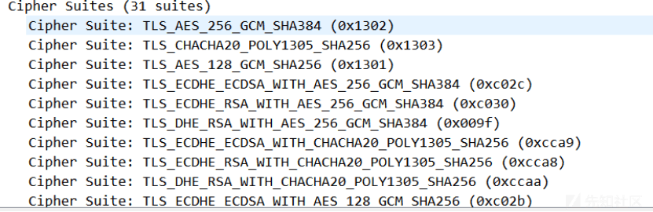](https://xzfile.aliyuncs.com/media/upload/picture/20240125115154-145fc40a-bb35-1.png)

-   Server Hello，根据请求中携带的内容建立连接版本，加密套件，生成服务器端随机数。  
    [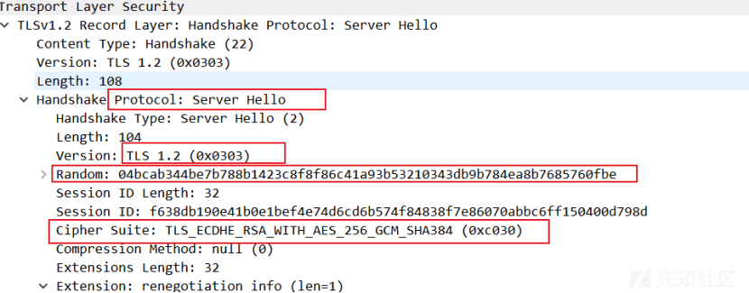](https://xzfile.aliyuncs.com/media/upload/picture/20240125115205-1afc157a-bb35-1.png)
    
-   服务器向用户发送由 CA 签发的证书，验证身份。（Certificate，server Key exchange 等）  
    [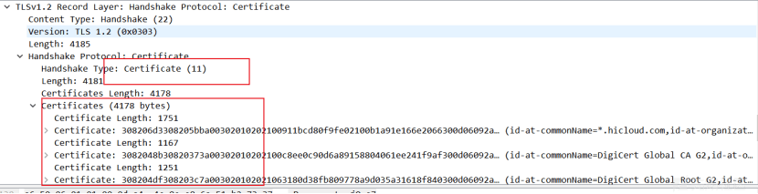](https://xzfile.aliyuncs.com/media/upload/picture/20240125115216-21b462be-bb35-1.png)
    

[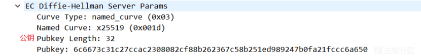](https://xzfile.aliyuncs.com/media/upload/picture/20240125115225-272c111a-bb35-1.png)

-   Change Cipher Spec（通知）

[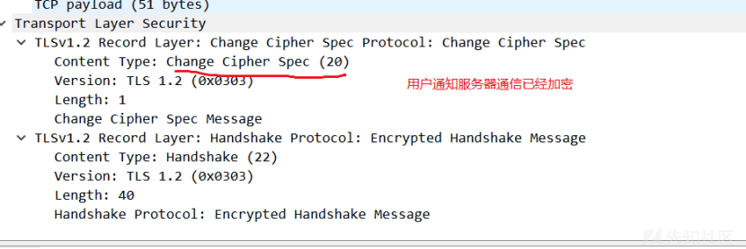](https://xzfile.aliyuncs.com/media/upload/picture/20240125115239-2f1be454-bb35-1.png)

-   通信建立

-   消息测试
    
    -   给好友传一张照片
        
    -   抓包发现还是原来的建立通信的过程  
        [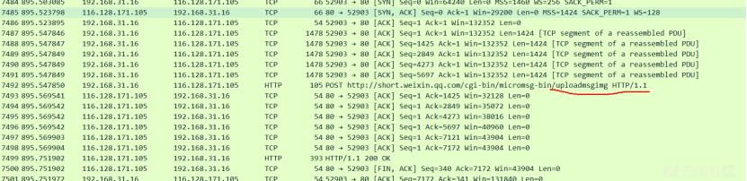](https://xzfile.aliyuncs.com/media/upload/picture/20240125115248-34a973b4-bb35-1.png)
        
    -   抓包发现了 HTTP 请求报文，是关于 uploadmsgimg 的，即上传图片。  
        [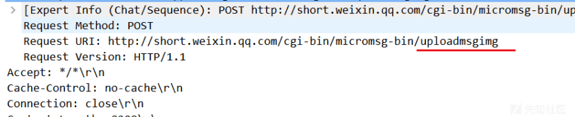](https://xzfile.aliyuncs.com/media/upload/picture/20240125115258-3a8fa85c-bb35-1.png)
        

## IOS 端微信抓包分享

> 开始进行了网页端的微信抓包分析，正好手头有个 IPAD，就试了一下 IOS 端的，还请各位多多指教

### 分析

-   用 PC 作为一个无线 AP，让移动端接入。查看移动端的 IP 和 MAC 地址。  
    [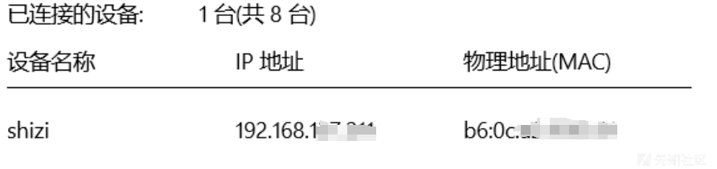](https://xzfile.aliyuncs.com/media/upload/picture/20240125115309-4106eb14-bb35-1.png)

-   将 wireshark 绑定在这个无线接口，进行抓包分析。还是先通过 DNS 查找微信的服务器 IP。IP 地址和之前的类似。116.128 开头。  
    [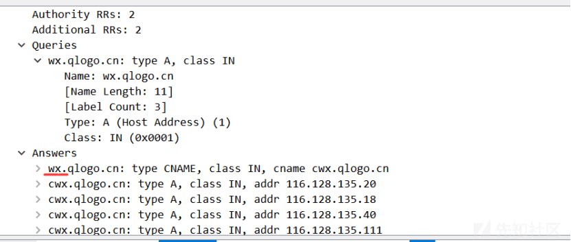](https://xzfile.aliyuncs.com/media/upload/picture/20240125115317-45ec3490-bb35-1.png)
    
-   获得登录二维码，在获得二维码过程中，终端和 121.51.73.100 进行了大量的 TCP 通信。  
    [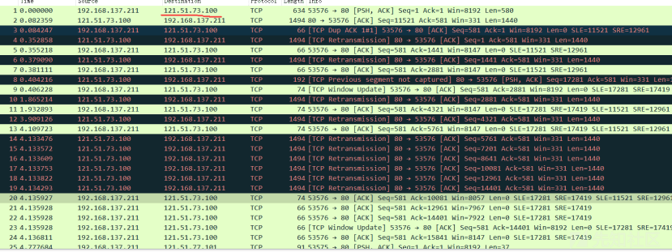](https://xzfile.aliyuncs.com/media/upload/picture/20240125115329-4d23befe-bb35-1.png)
    
    -   观察其中一个报文，发现了之前不太了解的字段 SACK。在网上查找相关知识，得知这个字段可以告诉发送方哪些报文段丢失，哪些报文段重传。根据这些信息，发送方可以重传这些真正丢失的字段。  
        [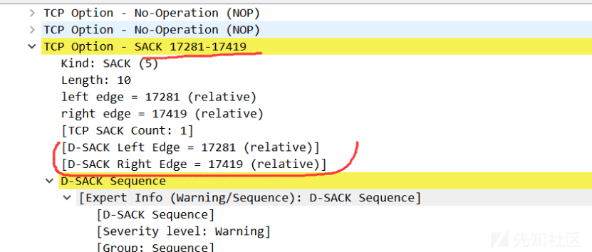](https://xzfile.aliyuncs.com/media/upload/picture/20240125115341-5462e56e-bb35-1.png)

-   登录。经过网上查找发现微信客户端用的是自己改进的 mmtls 协议。也抓到了相关的 mmtls POST 数据包。
    
    -   在刷新微信列表的时候发现有大量的 TCP 包和其中的 HTTP 请求包。以下面这个为例：  
        开始有个 HTTP Get，应该是下载某个数据，然后服务器向用户发送多个 TCP 后，最后接上一个 HTTP OK（JPEG JFIF Image）。  
        [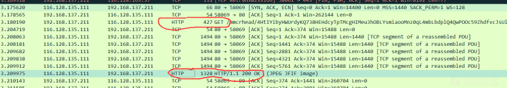](https://xzfile.aliyuncs.com/media/upload/picture/20240125115402-60fc72cc-bb35-1.png)
        
    -   一般来说 TCP 可以发 1500 个字节，减去 40 字节的头文件就还有 1452 个字节，所以一般大于 1452TCP 也会分段。如上图，一个 TCP 中包含 1440 字节数据。  
        TCP segment of a reassembled PDU，TCP 层收到上层大块报文后分解成段后发出去。  
        [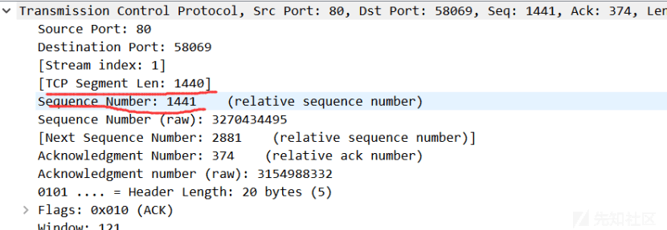](https://xzfile.aliyuncs.com/media/upload/picture/20240125115433-733d7e18-bb35-1.png)
        
    -   比如下面几个报文的 ACK 是相同的，正是分段后的结果。  
        [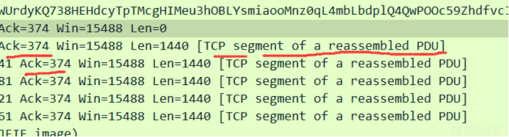](https://xzfile.aliyuncs.com/media/upload/picture/20240125115446-7ae02c2e-bb35-1.png)
        
    -   下图是最后的 HTTP OK 报文，其中包含了之前 6 个 TCP 的数据，让我想起了之前做的 IP 分片，最后也是 ICMP 重组所有分片。  
        [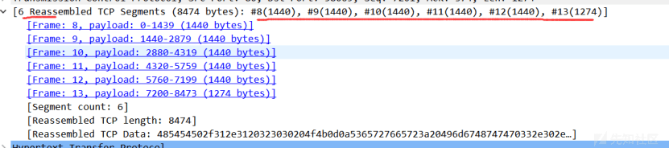](https://xzfile.aliyuncs.com/media/upload/picture/20240125115459-82c921a2-bb35-1.png)
        
    -   看到 JPEG 就知道应该是关于图像数据的 GET 传输，找到最后的 HTTP OK 报文。找到了 JPEG File 数据段。当时看到了开头的 FF D8，就抱着试试看的态度去找了一下 JPEG 文件的文件格式，发现正是是开头 FF D8，结尾是 FF D9，数据段也符合。就想着将数据取出生成 JPEG 文件。  
        [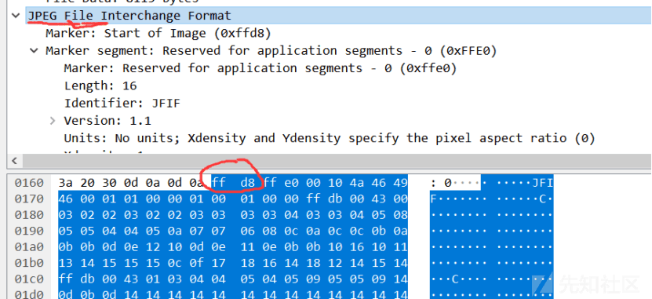](https://xzfile.aliyuncs.com/media/upload/picture/20240125115513-8b31b41c-bb35-1.png)
        
        [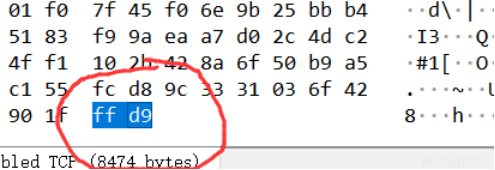](https://xzfile.aliyuncs.com/media/upload/picture/20240125115526-92920f36-bb35-1.png)
        
    -   用 python 将 Hex 串写入一个文件并以图片形式存储到本地。
        
        ```plain
        import binascii
        # payload 为十六进制字符串，如：“ffd8ffe111e0457869...”；经过如下代码转换，可将 pic 存储为图片形式并可以正常打开
        filepath = "C:\\Users\\14112\\Desktop\\yang\\a.jpg"
        payload = "FF D8......FF D9" #只取了文件头和尾，数据太长
        f=open(filepath,"ab") # filepath 为你要存储的图片的全路径
        pic = binascii.a2b_hex(payload.encode())
        f.write(pic)
        f.close()
        ```
        
    -   发现生成的图片可以打开  
        [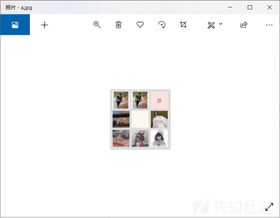](https://xzfile.aliyuncs.com/media/upload/picture/20240125115538-99ddbb8c-bb35-1.png)
        

-   生成了上述图片就去微信列表找头像，发现下面这个群头像正是从抓到的报文中提取出的十六进制数据生成的。  
    [](https://xzfile.aliyuncs.com/media/upload/picture/20240125115553-a3037ef4-bb35-1.png)

-   了解到微信使用的是基于 TLS 的 mmtls，能力有限，就不再分析腾讯未公开的协议了。原有的加密是存在业务层，加密的是请求包主体，但是数据包包头是明文，其中还包括用户的 id 等信息，而且加密的安全性也都待加强，所以腾讯开发了保护 Client 到 Server 之前所有网络通信数据、而且加密通信保护对业务开发人员透明的安全通信协议即 mmtls。

## 总结

-   现在我们使用的 PC 以及移动网络设备每时每刻都运行着各种服务，也和非常多的服务器之间进行数据包的传输，但是基本离不开 TCP/IP 还有 HTTP 等常见的协议。感觉在真实的网络环境抓包比在 GNS3 上最难的就是无法排除其他服务数据包的干扰，在本机可能一打开 wireshark 就出现了大量的数据包，所以这时候 wireshark 使用技巧就尤为重要，学会过滤报文。  
    分析微信的通信过程中服务器的 IP 会发送变化，也许是不同的业务使用不同的服务器，开始的时候需要分析 DNS，因为开始主机会查询相关服务器的 IP 地址，从 DNS 中也可以看出一项大型服务会使用多个服务器，多个 IP 来保证业务正常。Web 版应用基于 TLS 的加密也表现了 web 版应用存在一定不安全性。通过协议分析和实操也发现了自己真的很菜，还有很多要做要学的。
