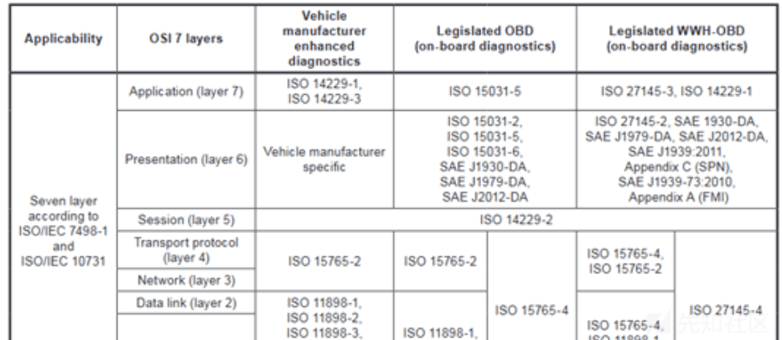
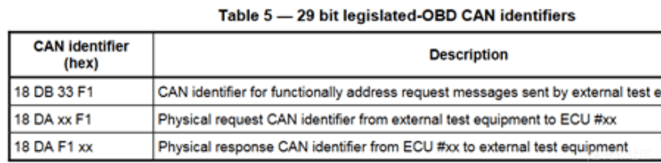
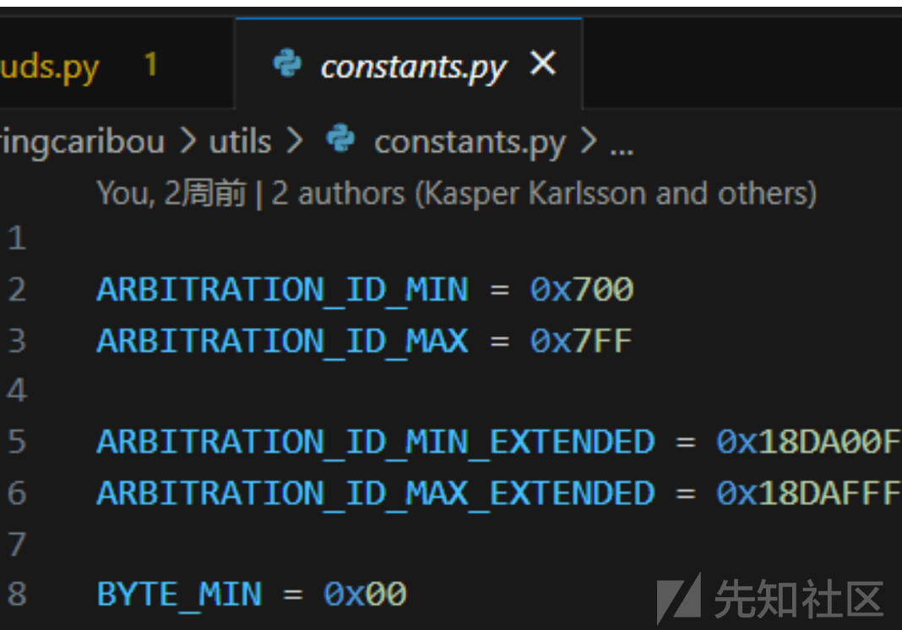
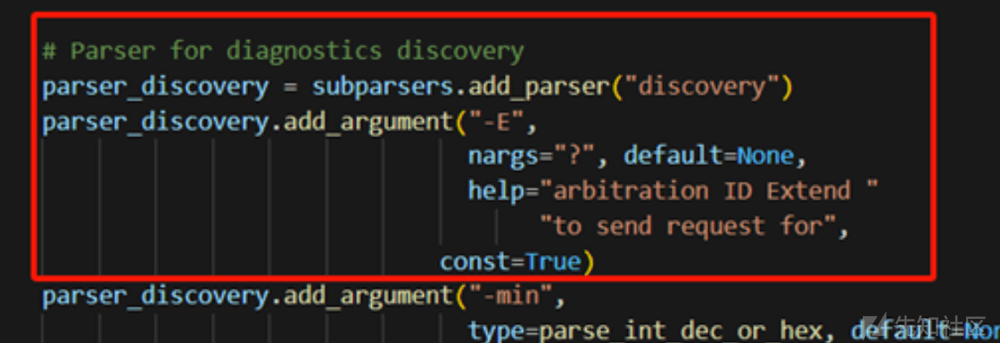
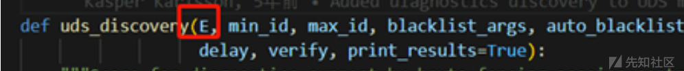
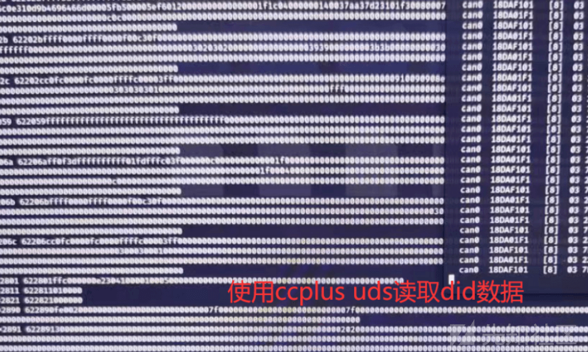

# 基于扩展帧 UDS 的 can 安全测试工具-ccplus - 先知社区

基于扩展帧 UDS 的 can 安全测试工具-ccplus

- - -

前一段时间整车测试中发现部分车型发送诊断请求没有响应。通过使用诊断仪对车辆诊断请求，发现该车型使用扩展帧进行 uds 通信。

引出一个问题，基于扩展帧的 uds 通信是怎样实现的，和标准帧有什么区别？

经过一顿翻标准，明白 can 通信的也是具有 OSI 7 层模型的定义

在 can 的网络层协议 ISO-15765-4 中，对扩展帧的诊断 ID 做了定义。18DB33F1 是功能寻址

18DAXXF1 为测试设备发送给 ECU 的 ID，

18DAF1XX 为 ECU 的响应 ID

此处 xx 范围是 00-ff，其他和标准帧一致

由此我们可以通过遍历 18DA00F1 到 18DAFFF1 的范围来发现支持的 ecu。

然后探测服务、子服务，一步步展开测试。

这时已经搞明白了基于扩展帧的 uds 具体情况，接下来就想能不能实现测试的工具化，之前讲到 caringcaribou（以下简称 cc）在 can 总线测试中是一个很好用的工具，打算在此基础上二次开发，从而实现基于扩展帧 UDS 的安全测试工具。

首先，把 cc 的源码看了一遍，发现 cc 很多自动化的测试功能，ecu 探测，种子爆破，fuzz 等，具备扩展性，modules 路径下创建自己的 python 代码就可以将自己内容添加到工具中去。符合预期要求，继续实现。

通过查找工具中的对应 uds 模块，发现在指定初始 id 后可以进行扩展帧的诊断探测，但是只能像标准帧那样每次＋1 遍历，无法满足要求，于是使用变量插入 id 内。

uds 中的所有模块都是基于 uds+discovery 这个函数进行，只要修改这个函数就可以满足对扩展帧探测的要求。

增加参数“E”使用扩展帧诊断探测。

相同方法加入参数“E”，在 uds auto 可以进行自动化测试。

后续对其它可能需要添加扩展帧的模块，uds fuzz 和 fuzz 最可能需要加入。

uds-fuzz 为种子爆破需要指定发送和响应 ID

fuzz 可以使用 mutate 7f. aabbccddeeffgg 指定模糊测试位。

目前可以使用

cc.py uds discovery -E  
cc.py uds auto -E

进行 UDS 扩展帧的 ecu 探测和自动扫描。

最后附上工具地址：[https://github.com/1in-oos/ccplus](https://github.com/1in-oos/ccplus)
