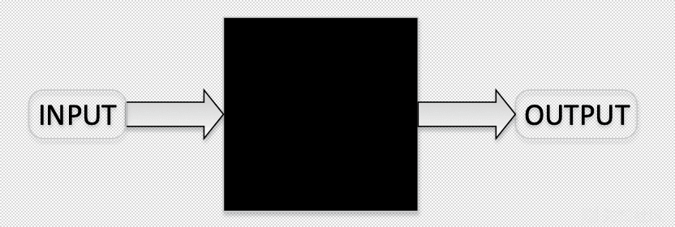
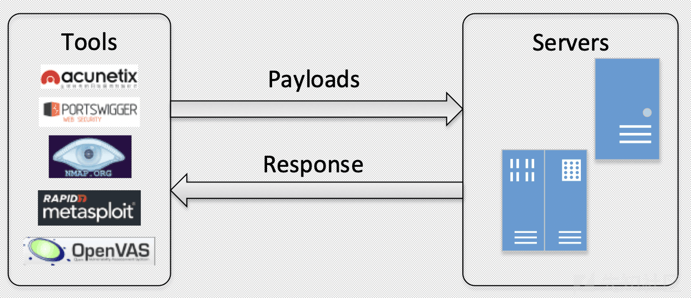
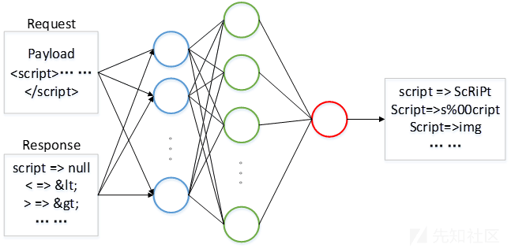
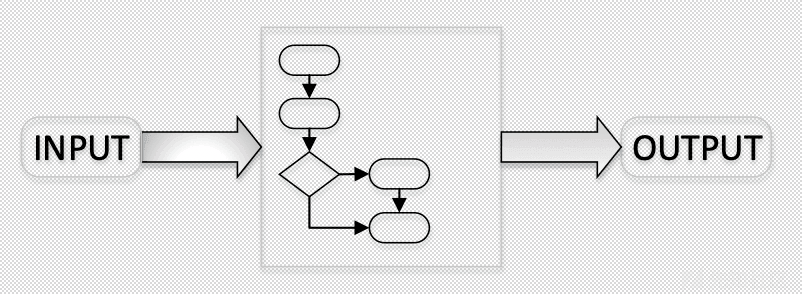
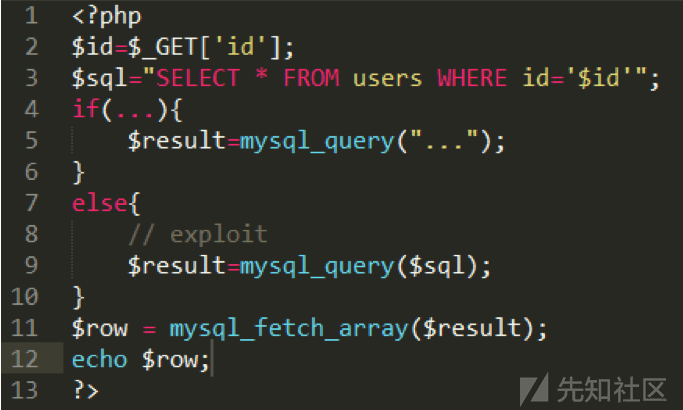
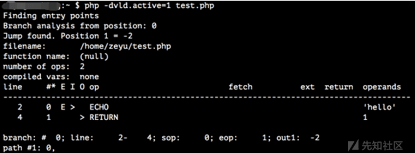
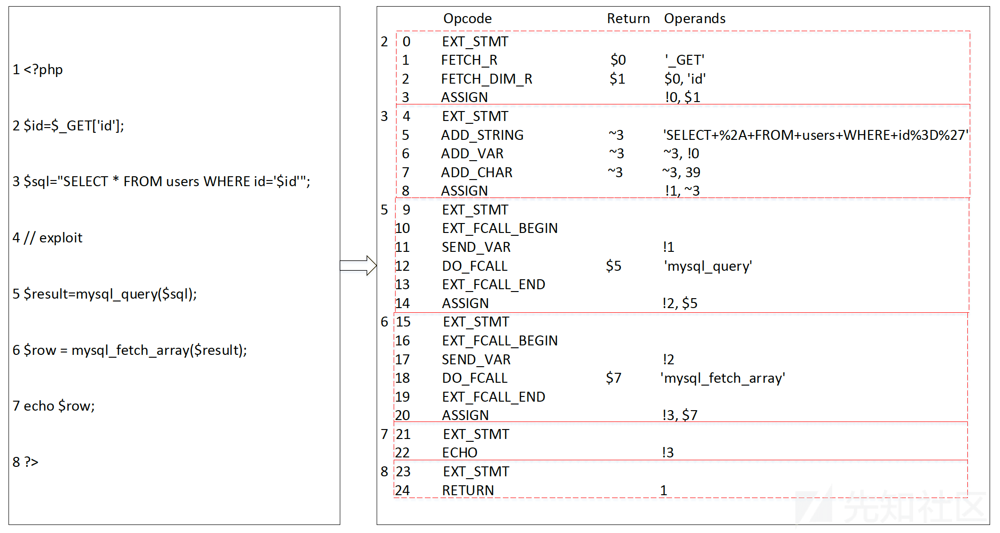
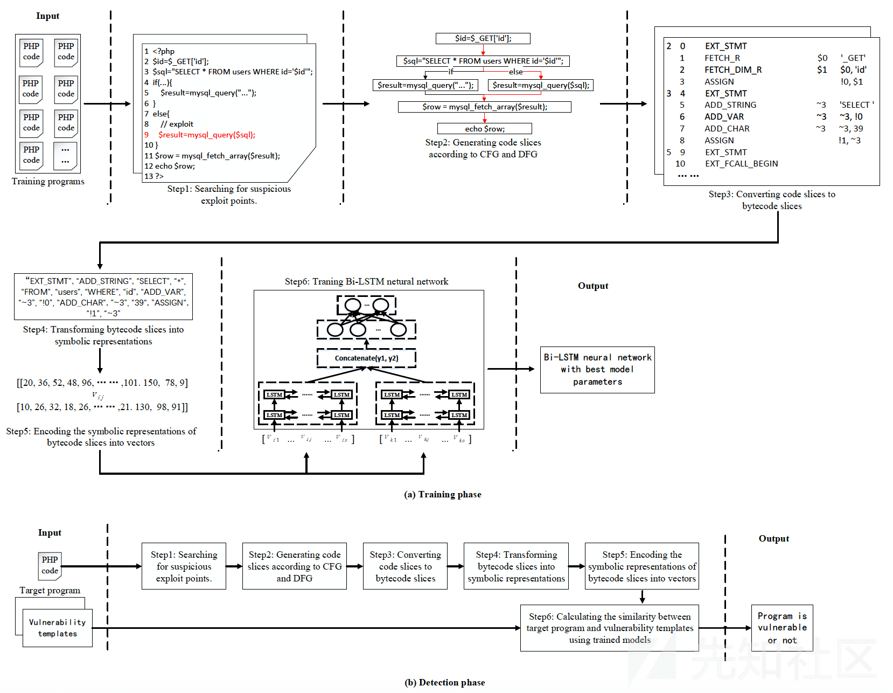
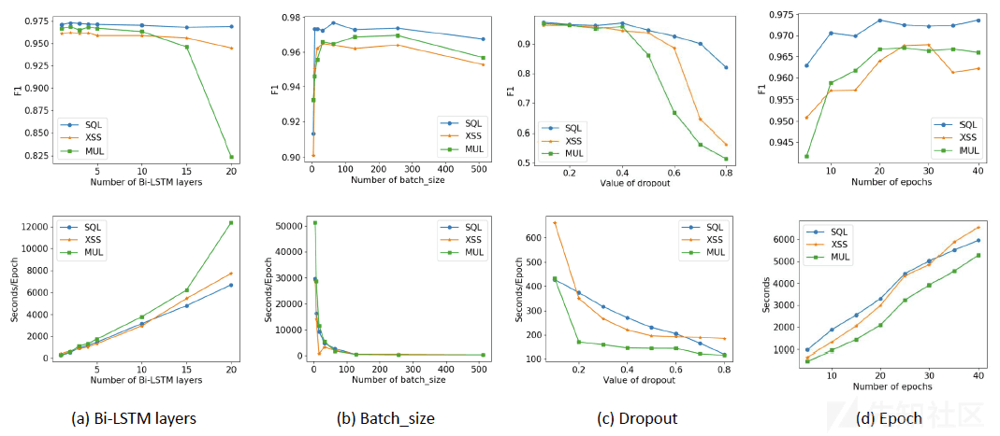

# 基于算法的漏洞检测 - 先知社区

基于算法的漏洞检测

- - -

# 零、背景

漏洞挖掘是安全中比较核心的一个方向，无论是个人安全爱好者的研究还是企业的安全建设很多工作都是围绕漏洞来做的。在大型甲方公司中负责漏洞挖掘和发现的团队通常是 SDL 或者现在叫 DevSecOps，每一个产品发布之前至少要对其做黑盒和白盒两个方面的检测。

无论是黑盒与白盒很重要的一点就是要对其实现自动化，这一点已经有很多了研究成果，包括一些优秀的开源项目。本文探讨一种深度学习算法在白盒代码审计中的利用方式，尝试使用算法检测源代码中的漏洞，类似的最早的一篇论文是发表在 NDSS 的 [VulDeePecker](https://arxiv.org/abs/1801.01681 "VulDeePecker") ，感兴趣的可以看一下。

本文是很久之前参考类似文章做的实验，只是现在整理了一下，可能思路已经不再新鲜了。

# 一、漏洞挖掘概述

漏洞挖掘的手法主要分为两个：一是黑盒测试；二是白盒测试。黑盒测试：也称功能测试，把程序看作一个不能打开的黑盒子，在完全不考虑程序内部结构和内部特性的情况下，对程序接口进行测试。  
[](https://xzfile.aliyuncs.com/media/upload/picture/20210329221343-f7fffee8-9098-1.png)

黑盒的自动化就是对接口使用不同的 POC 进行测试，然后分析响应的返回包确定 POC 是否正确执行。黑盒的扫描工具有很多，有些可以和爬虫组合使用，输入一个域名自动爬取接口测试，有些则是半自动化需要自己输入接口。黑盒扫描有很有一些有趣的挑战，比如如何用更少的请求判断是否存在漏洞，自如自动化检测 DOM-XSS 等。  
[](https://xzfile.aliyuncs.com/media/upload/picture/20210329221628-5a307e1c-9099-1.png)

其实黑盒扫描已经有了结合算法的研究成果，在 2016 年日本的信息安全大会 Code Blue 2016 上 Isao Takaesu 发表了一篇名为《[Method of Detecting Vulnerability in Web Apps Using Machine Learning](https://github.com/13o-bbr-bbq/machine_learning_security/tree/master/DeepExploit "Method of Detecting Vulnerability in Web Apps Using Machine Learning")》的研究成果。作者所设计的系统包含了智能爬虫和智能检测模型两个部分，爬虫负责识别页面类型（比如登录表单或者后台界面）和数据构造（比如自动且正确的填写表单中的邮箱、手机号）；检测模型负责构造 Payload，换句话说该系统的漏洞扫描并不是依赖提前写好的 POC，还是根据不同的请求实时生成新的 Payload（当然，这里针对的是通用型漏洞，比如 XSS，SQL 注入）。其模型核心思想如下所示：

算法会根据上一次请求的 Payload 和 Response 生成一个新的 Payoad，这其实是模拟了人测试的过程，比如当我们输入<script>alert1)</script>进行 XSS 漏洞测试时，一些符号在输出时被转码，常规的扫描器就是认为此次测试失败了，要换一个新的 Payload，而此模型会根据返回结果尝试生成一个可以绕过的 Payload，这也就是其智能化的体现。由于本文主要探讨白盒的漏洞挖掘，此模型不详细介绍，感兴趣可以在其 github 上了解项目细节。

[](https://xzfile.aliyuncs.com/media/upload/picture/20210506174651-fbb2f426-ae4f-1.png)

白盒测试：又称结构测试、透明盒测试或基于代码的测试。白盒测试是可视的，了解程序内部逻辑结构，对所有逻辑路径进行测试。  
[](https://xzfile.aliyuncs.com/media/upload/picture/20210329221405-05199d32-9099-1.png)

相对于黑盒，白盒自动化的难度更高一些，因为这涉及到变量的传递和代码语义的理解，很难将专家经验直接转化成工具，因此国内有些大型互联网公司仍然会加入人工代码审计的流程来卡点，保证代码质量。

# 二、基于深度学习的代码审计模型

## 2.1 代码审计常规流程

在引入算法之前，我们先来回顾一下一个正常的人工审计流程是怎样的，大体可以分为以下四步（可能每个人的习惯不同，会有差异）：

1.  首先要能理解代码
2.  寻找输入点和危险函数
3.  确定代码漏洞利用的代码路径（ROC 链）
4.  对代码路径进行测试

以下面这段代码为例

[](https://xzfile.aliyuncs.com/media/upload/picture/20210506173428-412f7bac-ae4e-1.png)

对应于上面四个步骤，  
**1、理解代码：**  
这是一段数据库查询的 PHP 代码，它会显示数据库的查询结果  
**2、输入点和危险函数：**  
$id=$\_GET\['id'\];  
mysql\_query  
**3、确定漏洞代码路径**  
2->3->9->11->12  
**4、代码测试：**  
\-1' union select database() --+  
结果：当 if 条件不满足执行 else 分支时存在 SQL 注入漏洞。

使用算法无论是解决什么问题，本质都是学习人类的经验来模拟人类进行决策。那么上面四个步骤适合应用算法的实际上是第三步，我们给算法一个代码执行路径，让它判断是否可以漏洞利用。

## 2.2 算法的选择

代码不同于一般的字符串，它的字符与字符之间、行与行之间、函数与函数之间甚至文件与文件之间都是有关系的，这种上下文关系使得我们不能像处理离散值那样简单的切分后直接抛给一个模型。我们希望算法能够学习向量不同维度之间关系，即是由字符转换成数字后，仍然不损失代码的语义逻辑。

这个问题可以参考一个有趣的项目：[Screenshot-to-code](https://github.com/emilwallner/Screenshot-to-code "Screenshot-to-code")，此项目是以前端图片为输入，通过算法生成前端代码。  
[](https://xzfile.aliyuncs.com/media/upload/picture/20210409111850-4df8e6c4-98e2-1.png)

其中卷积网络负责对图片的处理，循环网络负责对代码的处理，这里的循环神经网络使用的 LSTM。LSTM 最初是自然语言处理中常用的算法，它可以学习文本中的空间序列关系，保留语义信息。LSTM 是比较适合用来代码数据的，因此本文在 LSTM 的基础上构建神经网络模型。  
[](https://xzfile.aliyuncs.com/media/upload/picture/20210409140506-885058d6-98f9-1.png)

该项目的理论基础基础是一篇发表在 EICS 2018 上的一篇论文，感兴趣的可以深入看一下。  
论文下载地址：[https://arxiv.org/pdf/1705.07962.pdf](https://arxiv.org/pdf/1705.07962.pdf)  
模型和数据集下载地址：[https://github.com/tonybeltramelli/pix2code](https://github.com/tonybeltramelli/pix2code)  
模型视频演示地址：[https://uizard.io/research#pix2code](https://uizard.io/research#pix2code)

## 2.2 数据处理

数据处理的本质其实是模拟人的思路去解析代码，但是要把代码转换成模型可识别的数字向量，这里我们分成下面几个步骤。

### Step1：搜索可疑漏洞点

为了确定漏洞的大概位置，首先要搜索可疑漏洞点，也就是指漏洞最终触发的地方。它可能是一些函数或者特殊的代码关键字，比如执行 SQL 语句的函数或者一些 HTML tags（HTML 标签，如`<script>`、``等，它们分别表示 SQL 注入和 XSS 漏洞的漏洞点。以 2.1 节中的图片为例，我们认为可疑漏洞点就是第 9 行。

### Step2：生成代码数据流

根据代码数据流进行变量追踪是很多白盒检测工具的原理，我们也需要代码的执行流程进行分析，以数据流为单位进行漏洞检测。而不是直接将源代码作为直接切分成字符串，这样会破坏代码的语义，也就失去了漏洞检测的依据。

下图展示了对 PHP 源代码使用图谱分析生成数据流的流程图，源代码会首先根据上述算法生成图谱，然后根据图的路径提取出多个代码切片。中间部分是代码图谱，可以看到其输入是$id=$\_GET\[‘id’\]，含义是获取 HTTP(S) 数据包 URI 中的 id 参数值，图的输出是 echo $row，也就是常见的输出语句。图中示例代码根据控制流可以分成黑色和红色两个代码执行路径，其中红色执行路径存在可疑漏洞点且有用户可控的输入变量，因此将其数据流提取出来，组成代码切片。

[](https://xzfile.aliyuncs.com/media/upload/picture/20210506173400-30533526-ae4e-1.png)

这里我其实没有找到太好的自动化方法，看一些论文是将 Checkmax 的数据流中间结果提取出来用于实验，Checkmax 确实可以做到这一点。但当时在实验的时候没有 Checkmax 的环境，太过昂贵也无法自行购买，因此只能从数据本身下手，相关说明可以看第三节『算法实验』。

### Step3：生成字节码切片

每一种语言都有其对应的编码规范，但是在实际编程中即使是同一功能点不同的开发人员也可能写出风格完全不同的源代码。这些差异导致算法在学习源代码级别的特征的时候容易被干扰，极有可能使得模型过于拟合训练集，当测试集或待检测的目标源代码风格与训练集不一致时模型很容易误判，也就是出现过拟合现象。因此使用源代码级别的特征进行漏洞挖掘存在一定先天劣势，为了解决这个问题我们将代码图谱中提取的源代码切片转换成字节码切片。每种语言有各自的转换方式，PHP 可使用自身的拓展 VLD（Vulcan Logic Dumper）进行转换，安装完成之后使用命令运行即可，效果如下图所示。  
[](https://xzfile.aliyuncs.com/media/upload/picture/20210330210409-6a6500cc-9158-1.png)

PHP 源代码与字节码的关系如图下所示，左边为 Stpe2 所提取的 SQL 注入漏洞源代码切片，右边是其对应的字节码（一行源代码对应若干行字节码），可以看到字节码的三个核心字段：Opcode（操作码）、Operands（操作数）以及 Return（返回值）。源代码转换成字节码的过程中会自动进行一些数据处理，比如去除注释、变量名编码等，图中!0 对应 $id, !1 对应 $sql, !2 对应 $result, !3 对应 $row。变量名编码本质就是将用户自定义的变量名使用同一套规则进行数字化，避免了自定义字符对模型学习带来的干扰。

[](https://xzfile.aliyuncs.com/media/upload/picture/20210506173335-2130f2f4-ae4e-1.png)

### Step4：生成字符向量

深度神经网络一般只能接收数字向量作为输入，因此要采取合适的编码方式将字节码符号转换成数字向量。首先，要对字节码切片进行一些预处理。在字节码字符中有些是被 URL 编码过的，需要对其进行解码。再以源代码的行为单位，每一行对应若干行字节码切片，将这若干行字节码片段转换成字符序列。具体操作步骤以上图的第 3 行为例，源代码为：

```plain
$sql="SELECT * FROM users WHERE id=’$id’";
```

其对应的字节码转换成字符序列为：  
"EXT\_STMT", "ADD\_STRING", "SELECT", "\*", "FROM", "users", "WHERE", "id", "ADD\_VAR", "~ 3", "!0", "ADD\_CHAR", "~ 3", "39", "ASSIGN", "!1", "~ 3"

### Step5：生成数字向量

然后使用 word2vec，将词序列转换成数字向量。word2vec 是词嵌入方法的一种，本质上是简化的神经网络，通过训练可以得到当前词与上下文词的关系模型，模型的权重参数即是当前词的数字编码结果，一般是隐藏层的权重矩阵。使用 word2vec 获得的数字向量可以在保留词上下文关系的前提下简化向量维度，避免维度灾难。在代码数据中，word2vec 转换得出的数字向量包含了变量在个语句传递的关系，对深度学习模型识别漏洞特征具有非常大的帮助。

## 2.3 模型设计

这里尝试过两种模型，一是单输入和单输出的检测模型，输入一个代码片段，输出是否存在漏洞；二是尝试了一种孪生网络，双输入和单输出，输入两个代码片段，输出两者的相似度，通过相似度的值判断是否存在漏洞。

单网络模型较好理解，输入一个代码片段，输出是否存在漏洞，因此这里重点介绍孪生网络模型的流程。

### 孪生网络模型

基于 Bi-LSTM 构造的孪生网络的核心方法是计算待检测的目标代码和漏洞模板之间相似度，根据相似度是否超过阈值判定是否存在漏洞。因此，本文的神经网络模型输入为两个数字向量，输出为一个 0 到 1 之间的相似度值。如下图所示为神经网络的结构图，它有两个 Bi-LSTM 层，一个 Merge layer（融合层），一个 Dense layer（全连接层）和一个 Softmax 层，最终使用一个 Model 进行封装，使得左右两个网络能够共享权值。Bi-LSTM 层包含了 LSTM 神经元，将它们进行前后双向链接，能够前后双向的传播误差，提高算法准确度；融合层会将 Bi-LSTM 层的两个输出融合成一个张量；全链接层用于减少张量的维度；Softmax 层将低维张量作为输入，然后输出一个 0 到 1 之间数值，代表了最初两个向量的相似度。相似度越高值接近 1，相似度越低值越接近于 0。为了适应模型的输入结构，要将训练或测试数据构造成一个元组 (X1,X2)。第一维是漏洞模板，第二维是训练或测试数据，分别输入到两个分支网络中。模型使用 Adam 优化算法以及二元交叉熵（binary\_crossentropy）损失函数，其损失值不为负，Adam 对其的优化是一个由较高的正值逐渐向 0 靠近的过程。

[](https://xzfile.aliyuncs.com/media/upload/picture/20210506175524-2d8c271e-ae51-1.png)

## 2.4 系统流程

模型的过程主要分为两个阶段，训练阶段和检测阶段。两个阶段的处理过程是一致的，不过训练阶段的输出是模型，检测阶段的输出是漏洞检测结果。如下图所示（图中代码数据以 PHP 语言为例）是整个模型结构。

[](https://xzfile.aliyuncs.com/media/upload/picture/20210506175552-3e4f3c30-ae51-1.png)

某一类型的漏洞可能存在多个子类型，它表示漏洞多种的利用方式。因此在本文的模型中，每一个漏洞都会存在多个漏洞模板。每个模板代表了某一个漏洞子类型，不同子类型之间的定义差别是非常微小的，因此模板之间的差别也是递进变化的，当一个目标代码与某一个模板相似度较高时，那必然与一定数量的模板都有较高的相似度，而正常代码与漏洞模板在特征的各个维度上是差别很大的。所以，一个目标代码是否存在漏洞要综合计算与所有漏洞模板的相似度均值，有以下公式：  
[](https://xzfile.aliyuncs.com/media/upload/picture/20210330211152-7e37048c-9159-1.png)

其中 S 表示相似度均值，N 表示特定类型的漏洞模板数量，BLNN 表示 Bi-LSTM 神经网络，T\_i 表示某一个具体的模板，P 表示待检测的目标代码（本文以 PHP 为例）。BLNN 是的输出是 0（不相似）到 1（相似）之间的一个值，当整体的相似度均值 S 超过了设定的阈值就判定存在漏洞，这里的初始阈值本文设定为 0.5，用户可以根据使用情况在系统配置中进行修改。

在本文的实验中，漏洞模板本质是确定存在漏洞的字节码切片，每种类型的漏洞会有多个模板。判定是否存在某个类型的漏洞时要和该类型的模板都计算一次相似度，因此这个模型相对于单网络模型是非常耗时的。

# 三、算法实验

实验以 P（准确率））、R（召回率）、F1 值、假阴率（FNR）和假阳率（FPR）几个指标作为评估依据。实验数据来自美国国家漏洞库的  
[Sard](https://samate.nist.gov/SRD/index.php "Sard") 项目，该项目有大量的漏洞样例，并且每个都标记了 CWE 编号，也就是漏洞类型。经过统计，一共收集了 18989 个样本，其中 SQL 注入漏洞样本 912 个，XSS 漏洞样本 4352 个，剩下的 13725 个为不存在漏洞的样本。

根据前面提到的数据处理过程，将采集到的数据转换成数字向量。前面说到我们没有太好的方法从源代码中提取数据流信息，而 Sard 的数据某种程度上可以解决这个问题，上面的漏洞 case 都是处理过的，每个实例文件基本都是单一的数据流程序，直接使用基本就可以满足我们的预期。一个 XSS 漏洞而 Sard 数据实例如下所示：

[](https://xzfile.aliyuncs.com/media/upload/picture/20210506180418-6c0f81ec-ae52-1.png)

本文根据漏洞类型不同将数据集分成 SQL-SET、XSS-SET 和 MUL-SET 三个，MUL-SET 是 SQL 和 XSS 漏洞数据的混合数据集，以此来检验模型对不同漏洞的区分能力。在 SQL-SET 数据集中有 1032509 个 token，每一个 token 代表向量中的一个词，去重之后有 182 个；在 XSS-SET 数据中有 510252 个 token，去重之后有 168 个；MUL-SET 是前两者的和。这里的每一个 token 都是源代码中的一个关键词、变量名或者函数名，当以空格分割后会产生大量的 token，但是转换成字节码后许多自定义名称或者程序关键词都被自动编码了，这使得字节码层面的 token 种类大幅减少。下表展示了三个数据集中字节码切片的统计情况，可以看到每一种类型漏洞数据的无漏洞样本要多于有漏洞的样本，这是数据采集中的正负样本不均衡的现象，会给模型训练带来一定负面影响。本实验会从三个数据集随机抽取 10% 的数据作为测试集，剩余的作为训练集用于模型训练。

| 数据集 | 字节码切片 | 漏洞字节码切片 | 无漏洞字节码切片 |
| --- | --- | --- | --- |
| SQL-SET | 8904 | 912 | 7992 |
| XSS-SET | 10085 | 4352 | 5733 |
| MUL-SET | 18989 | 5264 | 13725 |

如下图所示是训过中参数调优的过程，图中重点描述了几个核心参数随着 F1 值变化而变化的过程，根据参数与 F1 值的变化关系，综合选定参数值。  
[](https://xzfile.aliyuncs.com/media/upload/picture/20210407192532-f6e8b58e-9793-1.png)

然后使用剩余 10% 的数据进行测试，下表是测试集的检测结果。

孪生网络模型：

| 数据集 | P(%) | R(%) | F1(%) | FPR(%) | FNR(%) |
| --- | --- | --- | --- | --- | --- |
| SQL-SET | 78.04 | 100.0 | 88.04 | 3.13 | 0.00 |
| XSS-SET | 99.02 | 92.22 | 95.50 | 0.70 | 7.78 |
| MUL-SET | 85.76 | 97.99 | 91.44 | 6.26 | 2.01 |

单网络模型的数据丢失了，没有找到备份，总体上是低于孪生网络模型的。不过若真正在生产环境下使用，孪生网络可行性比较低，主要是因为其检测速度太慢。

# 附 - 模型构造代码

```plain
def gen_model(embedding_matrix, nb_words):
    num_lstm1 = 64
    num_lstm2 = 32
    num_dense = 64
    rate_drop_lstm = 0.1
    rate_drop_dense = 0.1
    """Build the lstm model"""
    embedding_layer = Embedding(nb_words,
                                EMBEDDING_DIM,
                                weights=[embedding_matrix],
                                input_length=MAX_SEQUENCE_LENGTH,
                                trainable=True)
    # Double bi-directional layer
    lstm_1_layer1 = Bidirectional(LSTM(num_lstm1, dropout=rate_drop_lstm, recurrent_dropout=rate_drop_lstm,return_sequences=True))
    lstm_1_layer2 = Bidirectional(LSTM(num_lstm2, dropout=rate_drop_lstm, recurrent_dropout=rate_drop_lstm))

    lstm_2_layer1 = Bidirectional(LSTM(num_lstm1, dropout=rate_drop_lstm, recurrent_dropout=rate_drop_lstm,return_sequences=True))
    lstm_2_layer2 = Bidirectional(LSTM(num_lstm2, dropout=rate_drop_lstm, recurrent_dropout=rate_drop_lstm))

    # The first input data
    input_1 = Input(shape=(MAX_SEQUENCE_LENGTH,), dtype='int32')
    embedded_sequences_1 = embedding_layer(input_1)
    sequence_1_input = Masking(mask_value=0, input_shape=(MAX_SEQUENCE_LENGTH,EMBEDDING_DIM))(embedded_sequences_1)
    first_y1 = lstm_1_layer1(sequence_1_input)
    y1 = lstm_1_layer2(first_y1)

    # The second input data
    input_2 = Input(shape=(MAX_SEQUENCE_LENGTH,), dtype='int32')
    embedded_sequences_2 = embedding_layer(input_2)
    sequence_2_input = Masking(mask_value=0, input_shape=(MAX_SEQUENCE_LENGTH,EMBEDDING_DIM))(embedded_sequences_2)
    first_y2 = lstm_2_layer1(sequence_2_input)
    y2 = lstm_2_layer2(first_y2)

    # Concatenate layer
    merged = Concatenate(axis = -1)([y1, y2])
    merged = Dropout(rate_drop_dense)(merged)
    merged = BatchNormalization()(merged)

    # Dense layer
    merged = Dense(num_dense, activation='relu')(merged)
    merged = Dropout(rate_drop_dense)(merged)
    merged = BatchNormalization()(merged)

    # Output layer
    preds = Dense(1, activation='sigmoid')(merged)
    original_model = Model(inputs=[input_1, input_2], outputs=preds)
    parallel_model = multi_gpu_model(original_model, GPU)
    parallel_model.compile(loss='binary_crossentropy',
                  optimizer='adam',
                  metrics=[F1])
    return original_model, parallel_model
```
