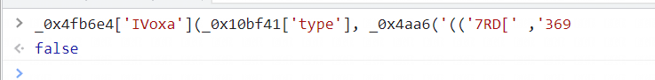
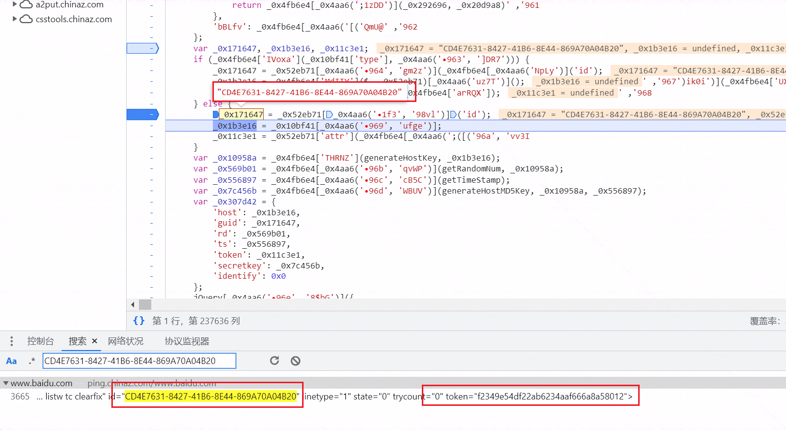

# 多地 ping 检测域名解析 ip 地址—js 混淆对抗 - 先知社区

多地 ping 检测域名解析 ip 地址—js 混淆对抗

- - -

### 0x1 概述

由于项目需求，给出了 n 多条域名，需要获取其对应的 ip 地址。本文叙述了解决项目问题所使用的方法，且本文旨在研究 js 反混淆，请勿将所观所学用于非法操作，如有侵权，联系立删。

### 0x2 需求

给了一堆域名，需获取其对应的 IP 解析地址，多数情况下直接本地调用 cmd 来 ping 即可获取到对应的 ip 地址，然而一些网站由于业务量较大，通常考虑负载问题，会将业务分给多个服务器来分摊流量。此时想到使用在线平台可以获取到多个 ip 解析地址，通常由于访问者的流量所在地，所用网络线路不一样，所以会得出不同的 ip 地址，本文用的是 zzzj。

了解完需求后，由于需要对多个域名进行解析，单个访问平台来获取 ip 实在费劲，于是想了一下写个脚本来获取解析后的，于是便有了此文。

### 0x3 抓包分析

本文以百度域名为例来进行分析，可以看到如下图所示，不同地域解析出了不同 ip 地址。

[](https://testingcf.jsdelivr.net/gh/yunxiaoshu/images/image-20230706222034560.png)

那么打开 burp 抓包，抓包发现接口 pingcheck 调用了很多次，观察其报文，如下：

[](https://testingcf.jsdelivr.net/gh/yunxiaoshu/images/image-20230706212728219.png)

可以看到请求体里带了一些参数，这里作以下讲解：

> host：需要解析的域名
> 
> guid：uid 值，此时不知道是干啥的
> 
> rd：一个数字
> 
> ts：时间戳
> 
> token：不知道是干啥的
> 
> secretkey：不知道干啥的
> 
> identify：不知道干啥的

接着将这个包重放一下，发现仍然正常解析 ip 地址，改一下 host 为其他域名时，发现报错

> {"code":4,"data":{"address":"-","ipAddress":"-","tTL":"-","timeMs":"-"},"msg":"token 认证失败"}

[](https://testingcf.jsdelivr.net/gh/yunxiaoshu/images/image-20230706213041745.png)

于是对这几个参数分别修改一下，最终确定 identify 影响输出的结果，但此时默认是 0 即可，因为其他包会得到不同地方 ping 的结果。而测试其他值修改都会出现 token 认证失败。那么便去控制台里定位一下怎么生成的这几个参数。

按下 F12 打开浏览器控制台，按下 ESC 打开底部控制台，按下 Ctrl+Alt+F 打开搜索，搜索 secretkey，然后定位到关键代码处：

[](https://testingcf.jsdelivr.net/gh/yunxiaoshu/images/image-20230706213524964.png)

分析一下，发现代码做了混淆，简单分析了一下，发现请求体里的几个参数会被 if 语句影响结果的走向，此时在 if 语句处下断点

[](https://testingcf.jsdelivr.net/gh/yunxiaoshu/images/image-20230706213708677.png)

接着刷新一下网页，断下，输出一下，发现恒为假。

```plain
_0x4fb6e4['IVoxa'](_0x10bf41['type'], _0x4aa6('‮963', ']DR7'))
```

[](https://testingcf.jsdelivr.net/gh/yunxiaoshu/images/image-20230706213921709.png)

那么 guid 的值应该是上图第二个方框里的变量 \_0x171647 获取到的，通过对该行下断点调试，发现这个值是在页面内获取到的，而不是动态生存的，于是直接搜索 CD4E7631-8427-41B6-8E44-869A70A04B20

[](https://testingcf.jsdelivr.net/gh/yunxiaoshu/images/image-20230706214254017.png)

发现了在页面内固定了，并且看到了 token，点击进去发现了很多 id 和 token，那么这里推测抓包获取到每次调用接口里的 guid 值是获取这个页面里的值，guid 和 token 对应的应该是不同地方的服务器。

[](https://testingcf.jsdelivr.net/gh/yunxiaoshu/images/image-20230706214352458.png)

接着只剩 rd 和 secretkey 了，找到这两个值的逻辑即可主动调用接口获取解析 ip 地址了。此时回到一开始分析的代码处，发现 rd 是由变量 \_0x569b01 获取到的，这个变量是由 \_0x10958a 获取到的，在往前推通过变量 \_0x1b3e16 经过函数操作生成了变量 \_0x10958a，而变量 \_0x1b3e16 正好是传入的域名（www.baidu.com）

[](https://testingcf.jsdelivr.net/gh/yunxiaoshu/images/image-20230706214616796.png)

[](https://testingcf.jsdelivr.net/gh/yunxiaoshu/images/image-20230706214859526.png)

### 0x4 反混淆分析

继续分析可以得出函数*0x4fb6e4 是加载器，第一个形式参数则是加载器加载的函数名，后面的参数是加载的函数所需要的参数。得出此结论后，单步跟进可以来到 generateHostKey 函数里，将整个函数抠出来放在 js 脚本里，调用时发现* \_0x329d 找不到，经过多次调试后，发现这个生成的值是固定的 1|11|9|3|6|7|2|0|10|5|4|12|8，于是在 js 里将这一行写死即可。

[](https://testingcf.jsdelivr.net/gh/yunxiaoshu/images/image-20230706215740802.png)

接着再次执行会报找不到 getRandom 函数，在 case 5 代码处定位到 getRandom 函数

[](https://testingcf.jsdelivr.net/gh/yunxiaoshu/images/image-20230706215906698.png)

将函数抠出来放进去即可，再次执行发现找不到函数 \_0x329d，跟进函数抠出来，继续报错找不到\_0x35ee，于是找到对应位置，继续抠出来，保存后发现执行出来的结果不太对，于是重新抠，将下图所示处一直抠到函数 \_0x329d 结束位置处。

[](https://testingcf.jsdelivr.net/gh/yunxiaoshu/images/image-20230706220201531.png)

最后执行发现没问题了，并且成功输出了结果：

[](https://testingcf.jsdelivr.net/gh/yunxiaoshu/images/image-20230706220428676.png)

接下来获取 rd 参数的值，跟进 getRandomNum 函数，发现只取数组里的第一个值。

[](https://testingcf.jsdelivr.net/gh/yunxiaoshu/images/image-20230706220541091.png)

接着继续分析 secretkey 的值，使用函数 generateHostMD5Key，跟进发现是对 rd 和时间戳的值进行转换后再进行 md5 加密。这里不再进行过多介绍，自行调试便可得出结论。

[](https://testingcf.jsdelivr.net/gh/yunxiaoshu/images/image-20230706220734355.png)

最后整理写出脚本如下：

```plain
var _0xodr = 'jsjiami.com.v6'
  , _0xodr_ = ['‮_0xodr']
  , _0x35ee = [_0xodr, 'V8ObwprCkUU=', 'wqt/VcOZw7Q=', 'wqVtEQF4', 'asOqwqfDo1U=', 'K8KKWS96', 'OmbDsT3Dqw==', 'LcODworCn8KZ', 'YHrDuMODFQ==', 'cwJmwqbCgw==', 'wqJQYsOew6k=', 'w4kZcMOaAA==', 'BRvCtMKowo0=', 'wrh4U8OWDA==', 'PxPCqsKpwp8=', 'w6TCvR3ClR8=', 'WMOgGXkD', 'wpNqcsOtw7A=', 'eMKhwp3Dv8Kk', 'w4RNI8OhDQ==', 'VMOLwqzDrE4=', 'VWVKwrYl', 'GMKeYMKRLg==', 'wrrCkMOZVcKU', 'w5VFFMO7Ow==', 'YcKUwr/DisK5', 'S8OEWkLDkg==', 'JMOtw6/CsDQ=', 'OMOZPyrCgg==', 'Zydlf8OX', 'HW3DpTbDgA==', 'woAzwpQ+MA==', 'wonDrsKAw5fCtA==', 'wpJAw6bCm8OD', 'GsOiw5LCsgI=', 'UMOMbWzDtA==', 'e8OHAFE+', 'wqnCuWDDscKm', 'w4Y3wqpnwqw=', 'w4TCvgzDixs=', 'wr5xbsOCBQ==', 'Y8O5HkEL', 'J8OIKVvDpg==', 'T8OqfGfDow==', 'wqFWW8Oiw68=', 'wpl1RMORw7g=', 'w5ZYwp3CmsKO', 'w5HCl0nChsOx', 'NcOHw5bChj0=', 'DsKBcsKiEw==', 'A8OZwojChsKf', 'wp84wpUkIw==', 'wpDCrMOYUsKM', 'w4fCjWLCq8Oe', 'w7nCvjfCoBI=', 'HMO1CVjDtA==', 'bA5NwpvCqw==', 'wqLCk8OCQMKp', 'JcO7w5rCvsKN', 'DsO5w4TCij0=', 'wq4awowREA==', 'woDDnnnDgRI=', 'R8OVAF0h', 'w7jCnsKow7rCvw==', 'wrzDm8Kdw6zCiQ==', 'wodUNS17', 'wpZmfcO4Dg==', 'Yn7CpMOLXA==', 'w6PDhsK5wpzDhw==', 'IcK5ZcKeGQ==', 'woHCvmzDocKE', 'wr5VXMO2FA==', 'AcKew55bXR7Cnh/CrMOoDg==', 'EsO9w63CgDc=', 'GVrDpSrDmcKKwoFBw7rCg8ON', 'cmjCjcKb', 'ZsOJwpbCv2zCj8Kkwr/CgQvChcK3w7zDlAtWA8Kzw6w=', 'HkXDhSzDmg==', 'Ay1HwoDDiMOXw53DuBfCuA==', 'w43CnV3Co8Ok', 'VkjDhcOuF8OH', 'wrxbSMOkOg==', 'OMOQw43CpC7Cmw==', 'JS8Bw5jDvsK5', 'wr/CnH7DjcKg', 'QlzCmcKIAg==', 'wrdHw5zCnsOxFw==', 'MiZMwojDrg==', 'I8OYATLCoQ==', 'MMKnVhVR', 'wqLCl8OtRcKwFQ==', 'w4zDjMK9wp3DsA==', 'w6HCuTbDjinCqQ==', 'D2stw6QJw6PCtxLCliVvw5AUQsKYSMKVZ8O+w5pQdsORw5DCmMOnwrNZ', 'YcOCCV4g', 'w4EaR8O1HcKM', 'ZWXClMKdJgQ=', 'V1nCh8KoFQ==', 'wrEZwpoJFw==', 'aMOISUnDkg==', 'MsOaw6vChD0=', 'dMOdLXAz', 'LhHChcKYwqI=', 'OsO4w6PCosKF', 'GcKUw7xTXhM=', 'w6nCpmjChMON', 'wpVNGxZT', 'X8OuG04i', 'QiZwU8Of', 'fm/CusOjUMOd', 'EzVKwpvDvw==', 'BsKdw7tXTw==', 'w6XDoMKxwrrDiQ==', 'woRjVsOJNw==', 'IMOOwoTCk8K6', 'wp11W8OEw6s=', 'McOHw4nCky4=', 'SsOoQU3Drg==', 'wpIiw5pxAFA=', 'w44XSMOgKsKLw6rCvVHDjg==', 'EMO8IzHCiw==', 'w4w4YcOrJg==', 'SsOsV2fDlA==', 'J8OZw4rCoD8=', 'VcO9fV7Djg==', 'EMKnWzJUwps=', 'N3tGcz4=', 'w5rCmzHCpzc=', 'w4Zsw57Cv8K2ZHc=', 'w6JQw6TCnsK+', 'JMKvUi9Q', 'w4JWN8OcLg==', 'JGXDvQ7Dnw==', 'wo/DtcOAw7TDgsK3wpLDhsKjw5kIVcKo', 'Pz80w63Dhw==', 'Q1zDvMOGGQ==', 'wplXw5TCg8OU', 'w4FUF8O2IA==', 'wrfDrFPDksKvwpfDk8KrcA/DmXTCq8OKMT1Qf8KWw7tqBMOcwqk3V3ZVw6jDsDJsTcORwoVCWMO/UATDi8O1KCfDhsKKE8OIwrPCv8OOYFvDiAZkwo9GDMKKCcKTB1/Cpilcc8KrKMOkwqfDtsKKwp5EwoPDncOew78lw6bDhy1iw7wCFDfCv23DgcORw79ie0IUw5pyw5HCs157wozDg8KgwpZHW8OBU8OAw7TDjsO7FMOxw5Y8w7F1wpIcAcOkwp3DqA/Cr1zCvcO7w6s6wo4+w6ceworDkQUkw6LCmANDQFF2EcOXP0F/w4HCnG4Pw5p4ScKAw6xMYsKXLMOGwqgfw4XDoXdVRsK7HMKTw6IYwp4VFkDDicKmT8KsQMOca0XCjR9Aw4NDL8KUbmLDmcKjLw==', 'IsKww6jDusO+wp1qMH/CrsK0w7gO', 'E1p3bh0=', 'wpvDhXfDrSI=', 'wqIVwqMkNQ==', 'wrrCgVDDk8KE', 'Nktcfzg=', 'w4kpRsOgBw==', 'BWxsTSQ=', 'amjCm8KIExg=', 'EsOTCjrCh8OEAcOjwqTCiA==', 'wr8IwpUtAg==', 'w4IzwpVMwq8=', 'eU7Ct8O8Zw==', 'w4LDhcKOwqLDsg==', 'w67ClwnCtCg=', 'w4bCgMKFw6LCjQ==', 'wovCq8ODesKq', 'woPCoUvDlMKQ', 'BlNTw5zDmg==', 'DcOew77Ck8KG', 'OcOsw5nCmQk=', 'fMOcA10j', 'L8Opw4PCrcK3', 'WMKgwpLDqcKR', 'wpwSw7NEJQ==', 'XEJbwock', 'GiRNwp7DoA==', 'w6RBNsOROQ==', 'wqd2GxBh', 'XcOfEHYJ', 'C8Kjdxla', 'w5ceQsO+Ag==', 'w5zCvinCizs=', 'QMKiwqnDocKA', 'wqoQw5NONg==', 'w5nCiz/DsR8=', 'JMKBacK0Jw==', 'wq4Xw796EA==', 'SSd+TsOo', 'aMOXU0HDsQ==', 'Ul14wpgT', 'w4DDvMKpwprDuA==', 'HlHDoTzDjw==', 'I8K2QT91', 'UWNowpwX', 'ExcCw43Diw==', 'fQZgWsOV', 'wqlHw6vCrMOQ', 'HiwMw7jDjA==', 'JS8Bw5jDvMKiQSBMAg==', 'wp51XsO5w5xfw69OwqXDsjsq', 'RmdZwp4M', 'woBTHRh1Hg96wpHDkcKgWg==', 'wp8Mw717AA==', 'wplMeMO5w6s=', 'FMOwJF/Dhw==', 'dcK+wrHDq8KIwok/PgzCvcOiw6E=', 'NG9Ybxw=', 'w5oFwpxiwp4=', 'w5dFwqjCscKd', 'SkLDh8ORFQ==', 'R1rCtsOjUA==', 'BcK1dhxi', 'AcOUBxDCsg==', 'FcOhw5bCusKd', 'FMOTK0TDrQ==', 'w4PCuGrCkcOV', 'wpbDvWvDiww=', 'wocGw71FAQ==', 'w5J5w4bCgsKr', 'LcK8dcKzNg==', 'HsKGYMKOAw==', 'BcOvPV3Dsw==', 'S8OHOEwV', 'woZjccOPCA==', 'JsO1IynCjA==', 'w4xjw4nCisKz', 'wq/DtcKLw7zCosKWworDgsOEw4Q=', 'YMOrwqzCjEg=', 'BkzDoTfDqQ==', 'M8O0GRzChg==', 'cMOMUXrDkw==', 'J8OQLUfDlg==', 'OMOrATzCtw==', 'wonCuUzDkcK3', 'UsOlc3zDpw==', 'ecOAMHIU', 'HMO/PWfDlQ==', 'w6LDisKjwoHDgw==', 'w6zDn8KewrTDmg==', 'KldFw4vDpg==', 'wqHClsO/ecK8', 'd0d2wqEG', 'wopEHBJCHg==', 'wqbCk1jDmMKf', 'I8ORw6TCpS8=', 'd8ONwq/Cl1I=', 'w5/CnMK9w7zCq8OVDQ==', 'TS1Qb8OSGcKwMl4k', 'w5/Dt8KnwpDDgw==', 'wr3Cq3bDlMK/', 'aWRmwoUS', 'w6vCrjfDhB7CqcOcw6cveSTDjA==', 'wpfCu2jDlcK2', 'wpHCkMKdwrbCpw==', 'fcOycXjDpA==', 'JsOCw7jCtcKe', 'RsOSwrzDjlY=', 'w47Dt8KVwpvDrg==', 'wqrDr8KFw6PCosKRwo/DlcOGw59Nfw==', 'w6knwpFowqkiIsO6w63CqA3Dtg==', 'GMKUfjBi', 'ZsKFwqfDr8KR', 'fsOvwojCmH8=', 'wrBqT8O5Fg==', 'PmBvUiI=', 'wp3CiHLDm8KqLg==', 'w4HCnTbChCA=', 'jksjiqqMaDmuFi.cLFloZym.v6=='];
if (function(_0x1fb97c, _0x111438, _0x2f0e4a) {
    function _0x165eb0(_0x22525b, _0x5bb4eb, _0x5b8f07, _0x60df4, _0x24188c, _0x543ac5) {
        _0x5bb4eb = _0x5bb4eb >> 0x8,
        _0x24188c = 'po';
        var _0x55a8ab = 'shift'
          , _0x1e6d71 = 'push'
          , _0x543ac5 = '‮';
        if (_0x5bb4eb < _0x22525b) {
            while (--_0x22525b) {
                _0x60df4 = _0x1fb97c[_0x55a8ab]();
                if (_0x5bb4eb === _0x22525b && _0x543ac5 === '‮' && _0x543ac5['length'] === 0x1) {
                    _0x5bb4eb = _0x60df4,
                    _0x5b8f07 = _0x1fb97c[_0x24188c + 'p']();
                } else if (_0x5bb4eb && _0x5b8f07['replace'](/[kqqMDuFLFlZy=]/g, '') === _0x5bb4eb) {
                    _0x1fb97c[_0x1e6d71](_0x60df4);
                }
            }
            _0x1fb97c[_0x1e6d71](_0x1fb97c[_0x55a8ab]());
        }
        return 0x123214;
    }
    ;return _0x165eb0(++_0x111438, _0x2f0e4a) >> _0x111438 ^ _0x2f0e4a;
}(_0x35ee, 0x14a, 0x14a00),
_0x35ee) {
    _0xodr_ = _0x35ee['length'] ^ 0x14a;
}
;
function _0x329d(_0x5bdd2a, _0x214027) {
    _0x5bdd2a = ~~'0x'['concat'](_0x5bdd2a['slice'](0x1));
    var _0x2b5ec7 = _0x35ee[_0x5bdd2a];
    if (_0x329d['YTxxLJ'] === undefined) {
        (function() {
            var _0x324164 = typeof window !== 'undefined' ? window : typeof process === 'object' && typeof require === 'function' && typeof global === 'object' ? global : this;
            var _0x2417c1 = 'ABCDEFGHIJKLMNOPQRSTUVWXYZabcdefghijklmnopqrstuvwxyz0123456789+/=';
            _0x324164['atob'] || (_0x324164['atob'] = function(_0x52b35c) {
                var _0x4a329c = String(_0x52b35c)['replace'](/=+$/, '');
                for (var _0x4bcde0 = 0x0, _0x203ebd, _0x533a9e, _0x4caace = 0x0, _0x5cef6b = ''; _0x533a9e = _0x4a329c['charAt'](_0x4caace++); ~_0x533a9e && (_0x203ebd = _0x4bcde0 % 0x4 ? _0x203ebd * 0x40 + _0x533a9e : _0x533a9e,
                _0x4bcde0++ % 0x4) ? _0x5cef6b += String['fromCharCode'](0xff & _0x203ebd >> (-0x2 * _0x4bcde0 & 0x6)) : 0x0) {
                    _0x533a9e = _0x2417c1['indexOf'](_0x533a9e);
                }
                return _0x5cef6b;
            }
            );
        }());
        function _0x42816f(_0x4235de, _0x214027) {
            var _0x60670e = [], _0x39da6c = 0x0, _0x5f459d, _0x308343 = '', _0x369550 = '';
            _0x4235de = atob(_0x4235de);
            for (var _0x287bdd = 0x0, _0x27ac6a = _0x4235de['length']; _0x287bdd < _0x27ac6a; _0x287bdd++) {
                _0x369550 += '%' + ('00' + _0x4235de['charCodeAt'](_0x287bdd)['toString'](0x10))['slice'](-0x2);
            }
            _0x4235de = decodeURIComponent(_0x369550);
            for (var _0x3ff4d0 = 0x0; _0x3ff4d0 < 0x100; _0x3ff4d0++) {
                _0x60670e[_0x3ff4d0] = _0x3ff4d0;
            }
            for (_0x3ff4d0 = 0x0; _0x3ff4d0 < 0x100; _0x3ff4d0++) {
                _0x39da6c = (_0x39da6c + _0x60670e[_0x3ff4d0] + _0x214027['charCodeAt'](_0x3ff4d0 % _0x214027['length'])) % 0x100;
                _0x5f459d = _0x60670e[_0x3ff4d0];
                _0x60670e[_0x3ff4d0] = _0x60670e[_0x39da6c];
                _0x60670e[_0x39da6c] = _0x5f459d;
            }
            _0x3ff4d0 = 0x0;
            _0x39da6c = 0x0;
            for (var _0x4ea355 = 0x0; _0x4ea355 < _0x4235de['length']; _0x4ea355++) {
                _0x3ff4d0 = (_0x3ff4d0 + 0x1) % 0x100;
                _0x39da6c = (_0x39da6c + _0x60670e[_0x3ff4d0]) % 0x100;
                _0x5f459d = _0x60670e[_0x3ff4d0];
                _0x60670e[_0x3ff4d0] = _0x60670e[_0x39da6c];
                _0x60670e[_0x39da6c] = _0x5f459d;
                _0x308343 += String['fromCharCode'](_0x4235de['charCodeAt'](_0x4ea355) ^ _0x60670e[(_0x60670e[_0x3ff4d0] + _0x60670e[_0x39da6c]) % 0x100]);
            }
            return _0x308343;
        }
        _0x329d['cUZeIF'] = _0x42816f;
        _0x329d['JtnbEp'] = {};
        _0x329d['YTxxLJ'] = !![];
    }
    var _0x5a93cd = _0x329d['JtnbEp'][_0x5bdd2a];
    if (_0x5a93cd === undefined) {
        if (_0x329d['eHtEOA'] === undefined) {
            _0x329d['eHtEOA'] = !![];
        }
        _0x2b5ec7 = _0x329d['cUZeIF'](_0x2b5ec7, _0x214027);
        _0x329d['JtnbEp'][_0x5bdd2a] = _0x2b5ec7;
    } else {
        _0x2b5ec7 = _0x5a93cd;
    }
    return _0x2b5ec7;
}

function getRandom(_0x1199c9, _0xd0c467) {
    var _0x317f90 = {
        'laFPn': function(_0x20fc2f, _0x585fc7) {
            return _0x20fc2f < _0x585fc7;
        },
        'evXxt': function(_0x48df51, _0x3289ec) {
            return _0x48df51 + _0x3289ec;
        },
        'UKoKG': function(_0x261b67, _0x3cf8ac) {
            return _0x261b67 - _0x3cf8ac;
        }
    };
    var _0x1276f0 = _0xd0c467;
    var _0x3bb471 = _0x1199c9;
    if (_0x317f90[_0x329d('‫31', '!3i$')](_0x1276f0, _0x3bb471)) {
        _0x1276f0 = _0x1199c9;
        _0x3bb471 = _0xd0c467;
    }
    var _0x4739da = parseInt(_0x317f90['evXxt'](Math[_0x329d('‫32', '9Z9S')]() * _0x317f90[_0x329d('‮33', 'ayb&')](_0x317f90[_0x329d('‮34', 'lN79')](_0x1276f0, _0x3bb471), 0x1), _0x3bb471));
    return _0x4739da;
}
function generateHostKey(_0x451556) {
    var _0x308bed = {
        'RoOrY': "1|11|9|3|6|7|2|0|10|5|4|12|8",
        'QTrGr': function(_0x4200ad, _0x42ffe7) {
            return _0x4200ad + _0x42ffe7;
        },
        'xHZUa': function(_0x136528, _0x1d8aee) {
            return _0x136528 - _0x1d8aee;
        },
        'foHGg': function(_0x27a75f, _0x271f50) {
            return _0x27a75f + _0x271f50;
        },
        'NDzZM': function(_0x14f235, _0x17a375) {
            return _0x14f235 >= _0x17a375;
        },
        'osGcP': function(_0x3def7a, _0x5a6595) {
            return _0x3def7a + _0x5a6595;
        },
        'lcANN': function(_0x4d5f40, _0xed106d) {
            return _0x4d5f40 + _0xed106d;
        },
        'LuYhk': function(_0x3077ef, _0x2c0ac9) {
            return _0x3077ef == _0x2c0ac9;
        }
    };
    var _0x42b2d7 = _0x308bed['RoOrY'][_0x329d('‮13', '^%V4')]('|')
      , _0x372dc5 = 0x0;
    while (!![]) {
        switch (_0x42b2d7[_0x372dc5++]) {
        case '0':
            var _0x4b13d3 = '';
            continue;
        case '1':
            if (!_0x451556)
                return '';
            continue;
        case '2':
            var _0x2fecb9 = _0x3b2c29['split']('.');
            continue;
        case '3':
            var _0x3b2c29 = '';
            continue;
        case '4':
            for (var _0x17cc2a = 0x0; _0x17cc2a < _0x2fecb9[_0x329d('‮14', 'GQfL')]; _0x17cc2a++) {
                var _0x317e39 = 0x0;
                for (var _0x579f57 = 0x0; _0x579f57 < _0x2fecb9[_0x17cc2a]['length']; _0x579f57++) {
                    var _0x10f472 = _0x2fecb9[_0x17cc2a][_0x329d('‫15', 'NmAl')](_0x579f57);
                    var _0x2cbd58 = _0x10f472['charCodeAt']();
                    _0x317e39 = _0x308bed[_0x329d('‮16', 'NmAl')](_0x317e39, _0x2cbd58);
                }
                if (_0x17cc2a == _0x308bed[_0x329d('‫17', 'G2&R')](_0x2fecb9[_0x329d('‫5', 'Chea')], 0x1))
                    _0x317e39 = _0x308bed[_0x329d('‫18', '!3i$')](_0x317e39, _0x4e3298);
                else
                    _0x317e39 = _0x308bed[_0x329d('‮19', 'modE')](_0x308bed[_0x329d('‫1a', '^%V4')](_0x317e39, _0x3ad03a), _0x4e3298);
                _0x4b13d3 += _0x308bed[_0x329d('‫1b', 'R2AF')](',', _0x317e39);
            }
            continue;
        case '5':
            var _0x4e3298 = getRandom(0x64, 0x3e7);
            continue;
        case '6':
            for (var _0x17cc2a = _0x308bed[_0x329d('‮1c', '3vtg')](_0x686686[_0x329d('‫1d', 'K7x9')], 0x1); _0x308bed['NDzZM'](_0x17cc2a, 0x0); _0x17cc2a--) {
                _0x3b2c29 += _0x308bed[_0x329d('‫1e', '5bvH')]('.', _0x686686[_0x17cc2a]);
            }
            continue;
        case '7':
            _0x3b2c29 = _0x3b2c29[_0x329d('‫1f', '^]l^')](0x1);
            continue;
        case '8':
            return _0x308bed[_0x329d('‮20', 'qD!2')](_0x308bed[_0x329d('‮21', 'Qv6p')](_0x4e3298, ','), _0x4b13d3);
        case '9':
            if (_0x308bed['LuYhk'](_0x686686[_0x329d('‮22', '4yt$')], 0x0))
                return '';
            continue;
        case '10':
            var _0x3ad03a = '.'['charCodeAt']();
            continue;
        case '11':
            var _0x686686 = _0x451556[_0x329d('‮23', 'K)Bu')]('.');
            continue;
        case '12':
            _0x4b13d3 = _0x4b13d3[_0x329d('‮24', 'K7x9')](0x1);
            continue;
        }
        break;
    }
}
const crypto = require('crypto');
function generateHostMD5Key(_0x47f65b, _0x2ac1d2) {
    var _0x36ace0 = {
        'CYNua': function(_0x1fa924, _0x2f5d77) {
            return _0x1fa924 + _0x2f5d77;
        },
        'dXCTE': '*#|&'
    };
    const md5 = crypto.createHash('md5');
    var cryptostr = md5.update(_0x36ace0['CYNua'](_0x47f65b + _0x36ace0['dXCTE'], _0x2ac1d2)).digest('hex');
    return cryptostr;
}
var host=generateHostKey("www.baidu.com");
var rd=host.split(',')[0];
var ts=new Date().getTime();
var secretkey=generateHostMD5Key(host, ts);
console.log(rd)
console.log(ts)
console.log(secretkey)
```

[](https://testingcf.jsdelivr.net/gh/yunxiaoshu/images/image-20230706221057568.png)

最后将运行得到的值拿到 burp 里进行请求：

[](https://testingcf.jsdelivr.net/gh/yunxiaoshu/images/image-20230706221200719.png)

[](https://testingcf.jsdelivr.net/gh/yunxiaoshu/images/image-20230706221706544.png)
