# 安卓 root 检测常见手段 - 先知社区

安卓 root 检测常见手段


# 一、root 检测常见手段

1.目录特征遍历 我们来看段检测代码，从代码中可以看会去遍历"/sbin/su", "/system/bin/su", "/system/sbin/su", "/system/xbin/su" 等目录其次检测 magsik、SuperSU 等特征。  
2.尝试执行 root 后的一些操作 对特定目录尝试新建文件例如 /data、/system、/etc 等（只有 root 后才有权限操作的目录），或者去执行典型的，例如 su，还有 find、mount 等命令。  
3.读取手机编译版本、调试状态 例如读取/system/build.prop 中 是 test-keys（测试版），还是 release-keys（发布版)，去获取 ro.debuggable、ro.secure 的值检测是否有调试状态  
4.root 检测指纹

```plain
1.detectRootManagementApps—检测常见 su 包名，如{“com.noshufou.android.su”, “com.noshufou.android.su.elite”, “eu.chainfire.supersu”, “com.koushikdutta.superuser”, “com.thirdparty.superuser”, “com.yellowes.su”, “com.topjohnwu.magisk”, “com.kingroot.kinguser”, “com.kingo.root”, “com.smedialink.oneclickroot”, “com.zhiqupk.root.global”, “com.alephzain.framaroot”}

2.detectPotentiallyDangerousApps—{“com.koushikdutta.rommanager”, “com.koushikdutta.rommanager.license”, “com.dimonvideo.luckypatcher”, “com.chelpus.lackypatch”, “com.ramdroid.appquarantine”, “com.ramdroid.appquarantinepro”, “com.android.vending.billing.InAppBillingService.COIN”, “com.android.vending.billing.InAppBillingService.LUCK”, “com.chelpus.luckypatcher”, “com.blackmartalpha”, “org.blackmart.market”, “com.allinone.free”, “com.repodroid.app”, “org.creeplays.hack”, “com.baseappfull.fwd”, “com.zmapp”, “com.dv.marketmod.installer”, “org.mobilism.android”, “com.android.wp.net.log”, “com.android.camera.update”, “cc.madkite.freedom”, “com.solohsu.android.edxp.manager”, “org.meowcat.edxposed.manager”, “com.xmodgame”, “com.cih.game_cih”, “com.charles.lpoqasert”, “catch_.me_.if_.you_.can_”}

3.detectRootCloakingApps—{“com.devadvance.rootcloak”, “com.devadvance.rootcloakplus”, “de.robv.android.xposed.installer”, “com.saurik.substrate”, “com.zachspong.temprootremovejb”, “com.amphoras.hidemyroot”, “com.amphoras.hidemyrootadfree”, “com.formyhm.hiderootPremium”, “com.formyhm.hideroot”}

4.suPath—遍历执行可能存在的 su 文件夹，如{“/data/local/”, “/data/local/bin/”, “/data/local/xbin/”, “/sbin/”, “/su/bin/”, “/system/bin/”, “/system/bin/.ext/”, “/system/bin/failsafe/”, “/system/sd/xbin/”, “/system/usr/we-need-root/”, “/system/xbin/”, “/cache/”, “/data/”, “/dev/”}

5.checkForDangerousProps—检查一些属性的值.{ro.debuggable”, “1”},{“ro.secure”, “0”}

6.checkForRWPaths—先执行 (需要 root)mount 如果返回 true 然后再查看是否有读写权限{“/system”, “/system/bin”, “/system/sbin”, “/system/xbin”, “/vendor/bin”, “/sbin”, “/etc”}

7.detectTestKeys—查看编译类型是否为 {“test-keys”}

8.checkBuildProp—检查 Buildprop 的值，{“ro.build.display.id”,”ro.build.version.incremental”,”ro.build.date”,”ro.build.date.utc”,”ro.build.type”,”ro.build.user”,”ro.build.flavor”,”ro.build.tags”,”ro.build.description”,”ro.build.fingerprint”,”ro.product.model”,”ro.product.brand”,”ro.product.name”}

9.checkSuExists—执行 su，看看能否执行成功

10.checkForRootNative—Native 层 root 检查

11.checkForMagiskBinary—检测是否存在 Magisk-{“/data/local/”, “/data/local/bin/”, “/data/local/xbin/”, “/sbin/”, “/su/bin/”, “/system/bin/”, “/system/bin/.ext/”, “/system/bin/failsafe/”, “/system/sd/xbin/”, “/system/usr/we-need-root/”, “/system/xbin/”, “/cache/”, “/data/”, “/dev/”}
```

## 二、方案

### 一、修改 su 名字

#### 1、环境

安卓 8 源码

#### 2、自定义 su 名

/system/extras/su/Android.mk中修改su为需要的名称

[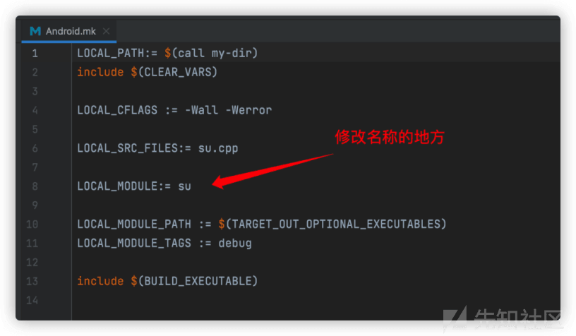](https://xzfile.aliyuncs.com/media/upload/picture/20231007084816-3401481e-64ab-1.png)

#### 3、/system/core/libcutils/fs\_config.cpp 中/system/xbin/su 修改为/system/xbin/修改的名称

[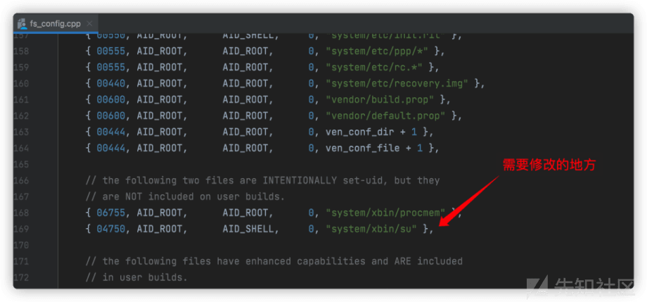](https://xzfile.aliyuncs.com/media/upload/picture/20231007084836-3fcec41e-64ab-1.png)

#### 4、/system/sepolicy/private/file\_contexts 中/system/xbin/su 修改为/system/xbin/修改的名称

[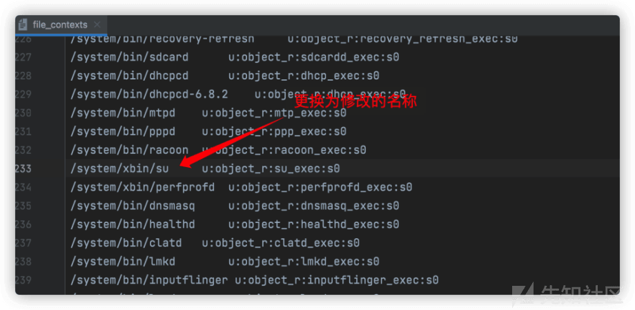](https://xzfile.aliyuncs.com/media/upload/picture/20231007084842-42fc17a4-64ab-1.png)

#### 5、去除指纹

ro.build.tags=test-keys 被写入在 system/build.prop 文件，我们查看这个文件看到 autogenerated by buildinfo.sh 是被 buildinfo.sh 文件写入的，我们找下这个文件 在/build/make/tools/buildinfo.sh ro.build.tags 的值是读取 BUILD\_VERSION\_TAGS 而 BUILD\_VERSION\_TAGS 则是/build/core/Makefile 中 BUILD\_KEYS 给的值，所以我们将 test-keys 改为 release-keys 即可

[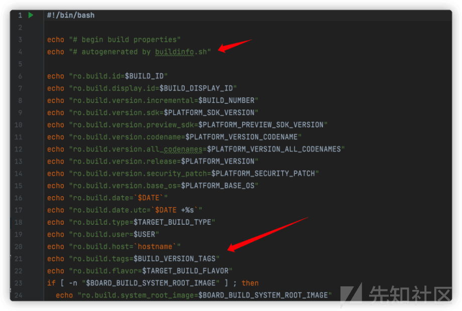](https://xzfile.aliyuncs.com/media/upload/picture/20231007084849-4798cf32-64ab-1.png)

[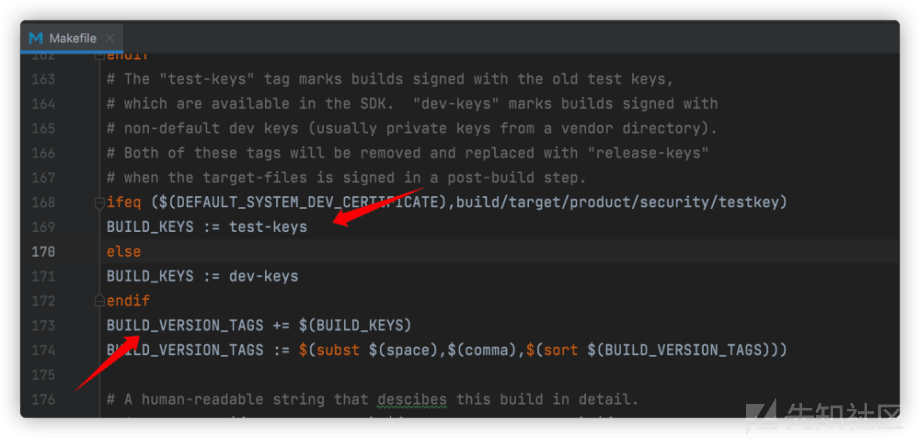](https://xzfile.aliyuncs.com/media/upload/picture/20231007084855-4b29b40e-64ab-1.png)

更改后 test-keys 均变成了 release-keys。  
虽然我们改了 test-keys 但是 ro.build.type、ro.build.display.id、ro.build.flavor、ro.build.description、ro.build.fingerprint 标签中均有 userdebug，发布版值应为 user 我们先 看下 ro.build.type 对应的值是来自 TARGET\_BUILD\_TYPE

[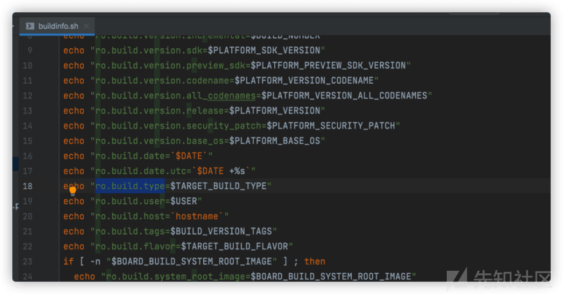](https://xzfile.aliyuncs.com/media/upload/picture/20231007084907-51da7eb4-64ab-1.png)

TARGET\_BUILD\_TYPE 的值又是 TARGET\_BUILD\_VARIANT，又索引到其他文件去了，为了减少出错率，我们就在这里直接赋值 user  
/aosp810r1/aosp810r1/build/core/Makefile

[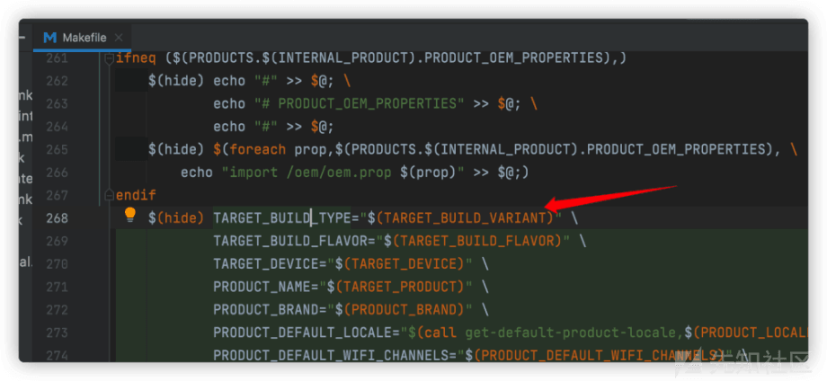](https://xzfile.aliyuncs.com/media/upload/picture/20231007084915-56b8e61e-64ab-1.png)

/aosp810r1/aosp810r1/build/make/tools/buildinfo.sh

[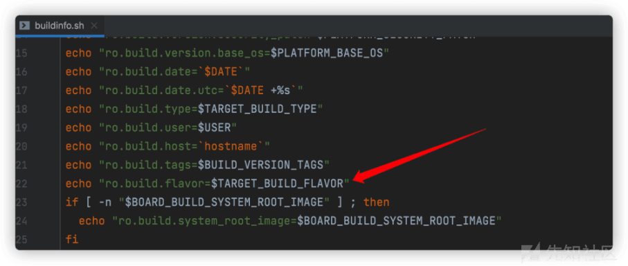](https://xzfile.aliyuncs.com/media/upload/picture/20231007084921-5abc7c58-64ab-1.png)

aosp810r1/aosp810r1/build/core/Makefile

[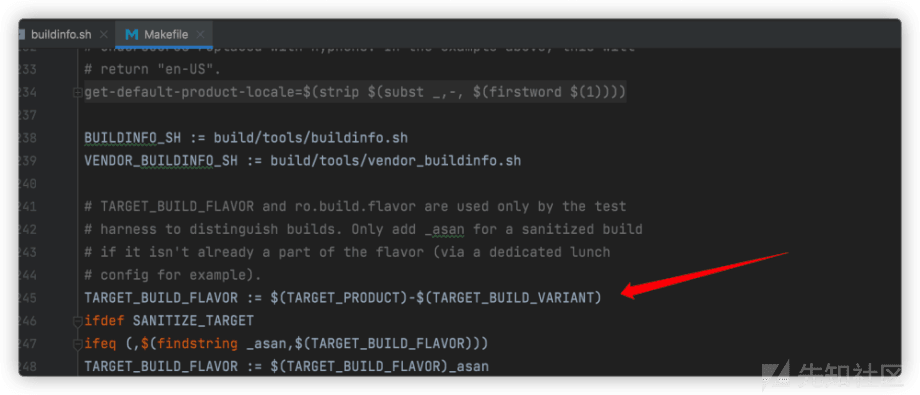](https://xzfile.aliyuncs.com/media/upload/picture/20231007084928-5e648940-64ab-1.png)

TARGET\_BUILD\_FLAVOR := $(TARGET\_PRODUCT)-$(TARGET\_BUILD\_VARIANT) 我们对比下值就可以判断出 TARGET\_BUILD\_VARIANT 就是 userdebug 字符串。直接改成 TARGET\_BUILD\_FLAVOR := $(TARGET\_PRODUCT)-user  
接下来根据 root 检测指纹 8 去修改即可

### 二、直接赋予 adb 为 root 权限

#### 1、环境

adb 的 root 权限是在 system/core/adb/adb.c 中控制。主要根据 ro.secure 以及 ro.debuggable 等 system property 来控制。  
默认即档 ro.secure 为 0 时，即开启 root 权限，为 1 时再根据 ro.debuggable 等选项来确认是否可以用开启 root 权限。为此如果要永久性开启 adb 的 root 权限，有两种修改的方式：

1.  修改 system property ro.secure，让 ro.secure=0。
2.  修改 adb.c 中开启 root 权限的判断逻辑。  
    以安卓 8 为例  
    \#### 2、修改  
    #####（1）方法一 修改 system property ro.secure，让 ro.secure=0  
    1、修改 aosp810r1/build/core/main.mk

[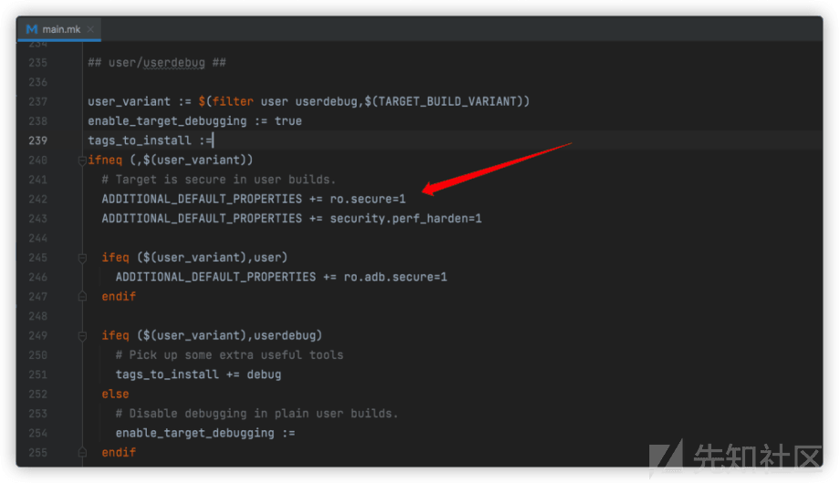](https://xzfile.aliyuncs.com/media/upload/picture/20231007085053-910cab2a-64ab-1.png)

将 ADDITIONAL\_DEFAULT\_PROPERTIES += ro.secure=1 改成 ADDITIONAL\_DEFAULT\_PROPERTIES += ro.secure=0  
2、修改 aosp810r1/system/core/adb/Android.mk  
google 从编译上直接去除了 adbd 的 user 版本 root 权限，为此需要修改 system/core/adb/Android.mk 中的编译选项 ALLOW\_ADBD\_ROOT, 如果没有打开这个选项，那么 adb.c 中将不会根据 ro.secure 去选择 root 还是 shell 权限，直接返回 shell 权限。

[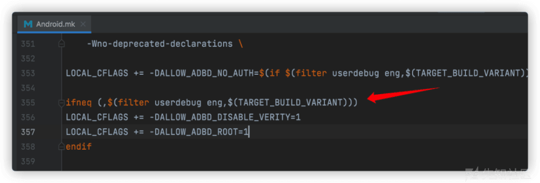](https://xzfile.aliyuncs.com/media/upload/picture/20231007085100-9592dd18-64ab-1.png)

将 ifneq (,$(filter userdebug eng,$(TARGET\_BUILD\_VARIANT))) 换成 ifneq (,$(filter userdebug user eng,$(TARGET\_BUILD\_VARIANT)))  
3、修改 aosp810r1/system/sepolicy/Android.mk

[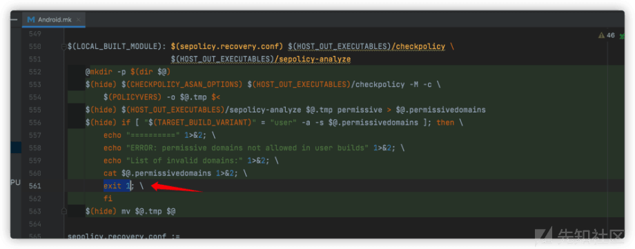](https://xzfile.aliyuncs.com/media/upload/picture/20231007085107-9959330c-64ab-1.png)

将两行 exit 1；注释掉。

##### （2）方法二 修改 should\_drop\_privileges() 函数

[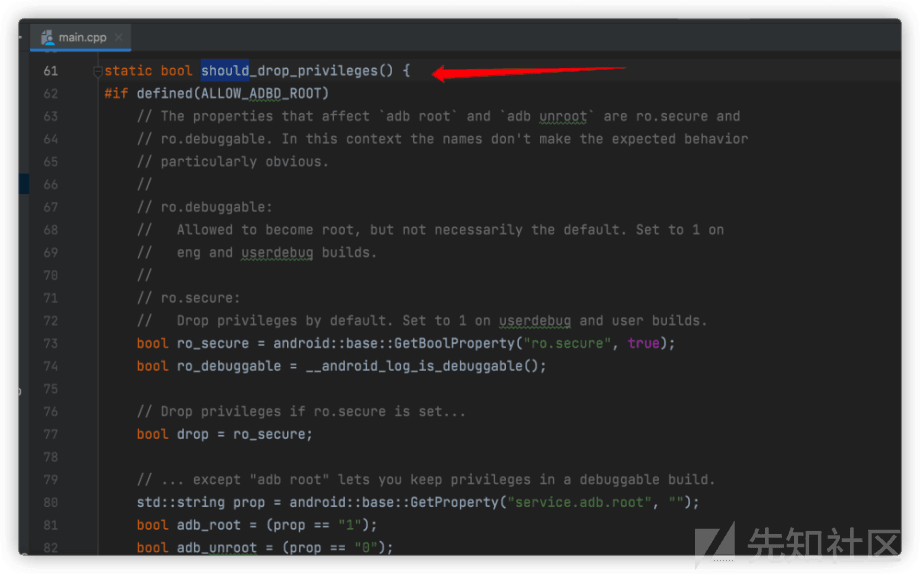](https://xzfile.aliyuncs.com/media/upload/picture/20231007085113-9cf16354-64ab-1.png)

在 aosp810r1/system/core/adb/daemon/main.cpp 中将 should\_drop\_privileges 函数清空，直接返回 0。返回 0 即开启 root 权限。

#### 3、去掉编译指纹

根据前面的去除指纹进行清除。
